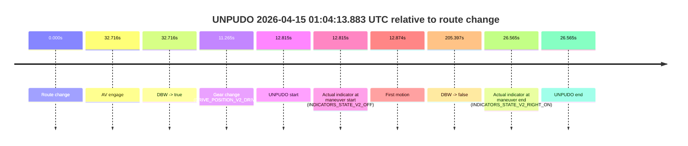
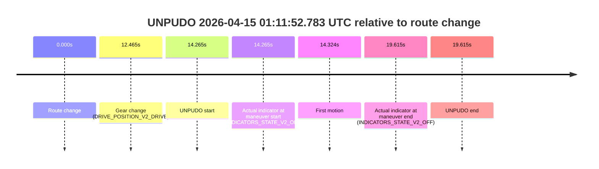
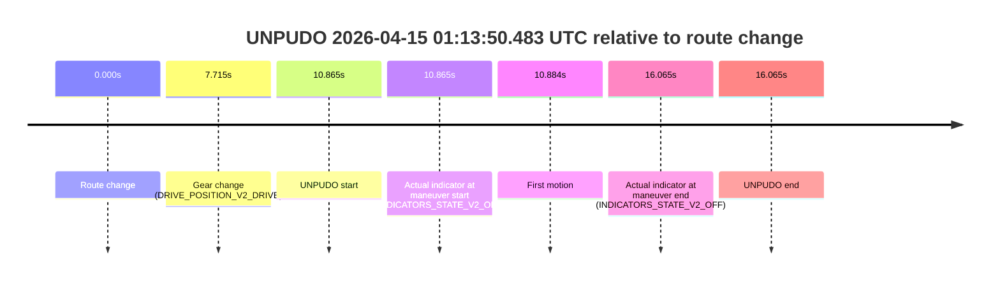
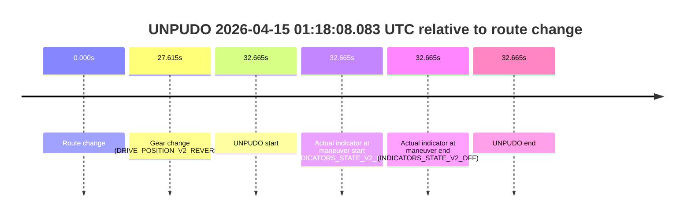

# Run Report: fme10003/2026-04-15--00-36-47--gen2-av-635ece17-1809-4dda-8020-3411344426cb

| Field | Value |
|---|---|
| Run ID | `fme10003/2026-04-15--00-36-47--gen2-av-635ece17-1809-4dda-8020-3411344426cb` |
| Date | `2026-04-15` |
| Model(s) | `apricot-crocodile-uproarious` |
| Author | `guy.geva` |
| Event count | `5` |

## unpudo 2026-04-15 01:04:13.883 UTC

| Field | Value |
|---|---|
| Model | `apricot-crocodile-uproarious` |
| Author | `guy.geva` |
| Run ID | `fme10003/2026-04-15--00-36-47--gen2-av-635ece17-1809-4dda-8020-3411344426cb` |
| Date | `2026-04-15` |
| Time (UTC) | `01:04:13.883` |
| Event type | `unpudo` |
| Disengagement type | `failed_to_unpudo` |
| Route change | `found` |
| Console | [run](https://console.sso.wayve.ai/run/fme10003/2026-04-15--00-36-47--gen2-av-635ece17-1809-4dda-8020-3411344426cb?id=&time-unixus=1776215053883301) |
| Foxglove | [segment](https://app.foxglove.dev/wayve-on-prem/p/prj_0dX18KZdVHg1fmmI/view?ds=foxglove-stream&ds.deviceName=fme10003&ds.start=2026-04-15T01%3A03%3A51.068263Z&ds.end=2026-04-15T01%3A07%3A36.465156Z&layoutId=lay_0e7VD4WIKDQGU73Y&time=2026-04-15T01%3A04%3A13.883301Z) |

### Event card: non-av

- Non-AV: there is no AV-owned portion anywhere inside the detected unpudo timeline, so it is kept for coverage but excluded from model success / failure scoring.

| Event | Time (UTC) | Delta from route change |
|---|---:|---:|
| Route change | 2026-04-15 01:04:01.068 | `0.000s` |
| AV engage | 2026-04-15 01:04:33.784 | `32.716s` |
| DBW -> true | 2026-04-15 01:04:33.784 | `32.716s` |
| Gear change (DRIVE_POSITION_V2_DRIVE) | 2026-04-15 01:04:12.333 | `11.265s` |
| UNPUDO start | 2026-04-15 01:04:13.883 | `12.815s` |
| Actual indicator at maneuver start (INDICATORS_STATE_V2_OFF) | 2026-04-15 01:04:13.883 | `12.815s` |
| First motion | 2026-04-15 01:04:13.942 | `12.874s` |
| DBW -> false | 2026-04-15 01:07:26.465 | `205.397s` |
| Actual indicator at maneuver end (INDICATORS_STATE_V2_RIGHT_ON) | 2026-04-15 01:04:27.633 | `26.565s` |
| UNPUDO end | 2026-04-15 01:04:27.633 | `26.565s` |

| Metric | Value |
|---|---|
| Outcome | `non-av` |
| Effective failure type | `none` |
| Route change status | `found` |
| DBW at event start | `false` |
| DBW at event end | `false` |
| Predicted gear at AV start | `DRIVE_POSITION_V2_DRIVE` |
| Actual gear at AV start | `DRIVE_POSITION_V2_DRIVE` |
| Predicted gear at event start | `DRIVE_POSITION_V2_DRIVE` |
| Actual gear at event start | `DRIVE_POSITION_V2_DRIVE` |
| Planned indicator direction | `INDICATORS_STATE_V2_OFF` |
| Controller indicator direction | `INDICATORS_STATE_V2_OFF` |
| Actual indicator direction | `INDICATORS_STATE_V2_OFF` |
| Actual indicator at maneuver end | `INDICATORS_STATE_V2_RIGHT_ON` |
| Driver accel help in AV | `false` |
| Driver accel help timestamp | `n/a` |
| Max accel pedal pct in AV | `0.0%` |
| Max brake pedal pct in AV | `0.0%` |
| Max speed mps in AV | `0.000` |
| Route -> AV | `32.716s` |
| AV -> event start | `-19.901s` |
| AV -> first motion | `-19.842s` |
| AV duration before disengagement | `172.681s` |
| Trajectory waypoint count | `37` |
| Driving-plan step count | `11` |

The scored portion starts from the AV-owned window, not from the pre-AV setup. Route-change search in the stopped pre-event segment was `found`, with the baseline therefore set to route change. At the event anchor the model predicts `DRIVE_POSITION_V2_DRIVE` and the actual gear is `DRIVE_POSITION_V2_DRIVE`. The effective model outcome is `non-av` because `there is no AV-owned overlap inside the event timeline`.

### Resolution

| Field | Value |
|---|---|
| Final outcome | `non-av` |
| Do we agree with this label? | `yes` |
| Source disengagement type | `failed_to_unpudo` |
| Resolved effective failure type | `none` |
| Confidence | `high` |

## unpudo 2026-04-15 01:11:52.783 UTC

| Field | Value |
|---|---|
| Model | `apricot-crocodile-uproarious` |
| Author | `guy.geva` |
| Run ID | `fme10003/2026-04-15--00-36-47--gen2-av-635ece17-1809-4dda-8020-3411344426cb` |
| Date | `2026-04-15` |
| Time (UTC) | `01:11:52.783` |
| Event type | `unpudo` |
| Disengagement type | `failed_to_unpudo` |
| Route change | `found` |
| Console | [run](https://console.sso.wayve.ai/run/fme10003/2026-04-15--00-36-47--gen2-av-635ece17-1809-4dda-8020-3411344426cb?id=&time-unixus=1776215512783307) |
| Foxglove | [segment](https://app.foxglove.dev/wayve-on-prem/p/prj_0dX18KZdVHg1fmmI/view?ds=foxglove-stream&ds.deviceName=fme10003&ds.start=2026-04-15T01%3A11%3A28.518293Z&ds.end=2026-04-15T01%3A12%3A08.133301Z&layoutId=lay_0e7VD4WIKDQGU73Y&time=2026-04-15T01%3A11%3A52.783307Z) |

### Event card: non-av

- Non-AV: there is no AV-owned portion anywhere inside the detected unpudo timeline, so it is kept for coverage but excluded from model success / failure scoring.

| Event | Time (UTC) | Delta from route change |
|---|---:|---:|
| Route change | 2026-04-15 01:11:38.518 | `0.000s` |
| Gear change (DRIVE_POSITION_V2_DRIVE) | 2026-04-15 01:11:50.983 | `12.465s` |
| UNPUDO start | 2026-04-15 01:11:52.783 | `14.265s` |
| Actual indicator at maneuver start (INDICATORS_STATE_V2_OFF) | 2026-04-15 01:11:52.783 | `14.265s` |
| First motion | 2026-04-15 01:11:52.841 | `14.324s` |
| Actual indicator at maneuver end (INDICATORS_STATE_V2_OFF) | 2026-04-15 01:11:58.133 | `19.615s` |
| UNPUDO end | 2026-04-15 01:11:58.133 | `19.615s` |

| Metric | Value |
|---|---|
| Outcome | `non-av` |
| Effective failure type | `none` |
| Route change status | `found` |
| DBW at event start | `false` |
| DBW at event end | `false` |
| Predicted gear at AV start | `n/a` |
| Actual gear at AV start | `n/a` |
| Predicted gear at event start | `DRIVE_POSITION_V2_DRIVE` |
| Actual gear at event start | `DRIVE_POSITION_V2_DRIVE` |
| Planned indicator direction | `INDICATORS_STATE_V2_OFF` |
| Controller indicator direction | `INDICATORS_STATE_V2_OFF` |
| Actual indicator direction | `INDICATORS_STATE_V2_OFF` |
| Actual indicator at maneuver end | `INDICATORS_STATE_V2_OFF` |
| Driver accel help in AV | `false` |
| Driver accel help timestamp | `n/a` |
| Max accel pedal pct in AV | `0.0%` |
| Max brake pedal pct in AV | `0.0%` |
| Max speed mps in AV | `0.000` |
| Route -> AV | `n/a` |
| AV -> event start | `n/a` |
| AV -> first motion | `n/a` |
| AV duration before disengagement | `n/a` |
| Trajectory waypoint count | `37` |
| Driving-plan step count | `11` |

The scored portion starts from the AV-owned window, not from the pre-AV setup. Route-change search in the stopped pre-event segment was `found`, with the baseline therefore set to route change. At the event anchor the model predicts `DRIVE_POSITION_V2_DRIVE` and the actual gear is `DRIVE_POSITION_V2_DRIVE`. The effective model outcome is `non-av` because `there is no AV-owned overlap inside the event timeline`.

### Resolution

| Field | Value |
|---|---|
| Final outcome | `non-av` |
| Do we agree with this label? | `yes` |
| Source disengagement type | `failed_to_unpudo` |
| Resolved effective failure type | `none` |
| Confidence | `high` |

## unpudo 2026-04-15 01:13:50.483 UTC

| Field | Value |
|---|---|
| Model | `apricot-crocodile-uproarious` |
| Author | `guy.geva` |
| Run ID | `fme10003/2026-04-15--00-36-47--gen2-av-635ece17-1809-4dda-8020-3411344426cb` |
| Date | `2026-04-15` |
| Time (UTC) | `01:13:50.483` |
| Event type | `unpudo` |
| Disengagement type | `failed_to_unpudo` |
| Route change | `found` |
| Console | [run](https://console.sso.wayve.ai/run/fme10003/2026-04-15--00-36-47--gen2-av-635ece17-1809-4dda-8020-3411344426cb?id=&time-unixus=1776215630483299) |
| Foxglove | [segment](https://app.foxglove.dev/wayve-on-prem/p/prj_0dX18KZdVHg1fmmI/view?ds=foxglove-stream&ds.deviceName=fme10003&ds.start=2026-04-15T01%3A13%3A29.618297Z&ds.end=2026-04-15T01%3A14%3A05.683296Z&layoutId=lay_0e7VD4WIKDQGU73Y&time=2026-04-15T01%3A13%3A50.483299Z) |

### Event card: non-av

- Non-AV: there is no AV-owned portion anywhere inside the detected unpudo timeline, so it is kept for coverage but excluded from model success / failure scoring.

| Event | Time (UTC) | Delta from route change |
|---|---:|---:|
| Route change | 2026-04-15 01:13:39.618 | `0.000s` |
| Gear change (DRIVE_POSITION_V2_DRIVE) | 2026-04-15 01:13:47.333 | `7.715s` |
| UNPUDO start | 2026-04-15 01:13:50.483 | `10.865s` |
| Actual indicator at maneuver start (INDICATORS_STATE_V2_OFF) | 2026-04-15 01:13:50.483 | `10.865s` |
| First motion | 2026-04-15 01:13:50.502 | `10.884s` |
| Actual indicator at maneuver end (INDICATORS_STATE_V2_OFF) | 2026-04-15 01:13:55.683 | `16.065s` |
| UNPUDO end | 2026-04-15 01:13:55.683 | `16.065s` |

| Metric | Value |
|---|---|
| Outcome | `non-av` |
| Effective failure type | `none` |
| Route change status | `found` |
| DBW at event start | `false` |
| DBW at event end | `false` |
| Predicted gear at AV start | `n/a` |
| Actual gear at AV start | `n/a` |
| Predicted gear at event start | `DRIVE_POSITION_V2_DRIVE` |
| Actual gear at event start | `DRIVE_POSITION_V2_DRIVE` |
| Planned indicator direction | `INDICATORS_STATE_V2_OFF` |
| Controller indicator direction | `INDICATORS_STATE_V2_OFF` |
| Actual indicator direction | `INDICATORS_STATE_V2_OFF` |
| Actual indicator at maneuver end | `INDICATORS_STATE_V2_OFF` |
| Driver accel help in AV | `false` |
| Driver accel help timestamp | `n/a` |
| Max accel pedal pct in AV | `0.0%` |
| Max brake pedal pct in AV | `0.0%` |
| Max speed mps in AV | `0.000` |
| Route -> AV | `n/a` |
| AV -> event start | `n/a` |
| AV -> first motion | `n/a` |
| AV duration before disengagement | `n/a` |
| Trajectory waypoint count | `37` |
| Driving-plan step count | `11` |

The scored portion starts from the AV-owned window, not from the pre-AV setup. Route-change search in the stopped pre-event segment was `found`, with the baseline therefore set to route change. At the event anchor the model predicts `DRIVE_POSITION_V2_DRIVE` and the actual gear is `DRIVE_POSITION_V2_DRIVE`. The effective model outcome is `non-av` because `there is no AV-owned overlap inside the event timeline`.

### Resolution

| Field | Value |
|---|---|
| Final outcome | `non-av` |
| Do we agree with this label? | `yes` |
| Source disengagement type | `failed_to_unpudo` |
| Resolved effective failure type | `none` |
| Confidence | `high` |

## unpudo 2026-04-15 01:16:50.033 UTC

| Field | Value |
|---|---|
| Model | `apricot-crocodile-uproarious` |
| Author | `guy.geva` |
| Run ID | `fme10003/2026-04-15--00-36-47--gen2-av-635ece17-1809-4dda-8020-3411344426cb` |
| Date | `2026-04-15` |
| Time (UTC) | `01:16:50.033` |
| Event type | `unpudo` |
| Disengagement type | `failed_to_unpudo` |
| Route change | `found` |
| Console | [run](https://console.sso.wayve.ai/run/fme10003/2026-04-15--00-36-47--gen2-av-635ece17-1809-4dda-8020-3411344426cb?id=&time-unixus=1776215810033308) |
| Foxglove | [segment](https://app.foxglove.dev/wayve-on-prem/p/prj_0dX18KZdVHg1fmmI/view?ds=foxglove-stream&ds.deviceName=fme10003&ds.start=2026-04-15T01%3A15%3A55.618302Z&ds.end=2026-04-15T01%3A17%3A48.965377Z&layoutId=lay_0e7VD4WIKDQGU73Y&time=2026-04-15T01%3A16%3A50.033308Z) |

### Event card: non-av

- Non-AV: there is no AV-owned portion anywhere inside the detected unpudo timeline, so it is kept for coverage but excluded from model success / failure scoring.

| Event | Time (UTC) | Delta from route change |
|---|---:|---:|
| Route change | 2026-04-15 01:16:05.618 | `0.000s` |
| AV engage | 2026-04-15 01:17:25.294 | `79.676s` |
| DBW -> true | 2026-04-15 01:17:25.294 | `79.676s` |
| Gear change (DRIVE_POSITION_V2_DRIVE) | 2026-04-15 01:16:38.283 | `32.665s` |
| UNPUDO start | 2026-04-15 01:16:50.033 | `44.415s` |
| Actual indicator at maneuver start (INDICATORS_STATE_V2_OFF) | 2026-04-15 01:16:50.033 | `44.415s` |
| First motion | 2026-04-15 01:16:50.142 | `44.524s` |
| DBW -> false | 2026-04-15 01:17:38.965 | `93.347s` |
| Actual indicator at maneuver end (INDICATORS_STATE_V2_OFF) | 2026-04-15 01:17:14.883 | `69.265s` |
| UNPUDO end | 2026-04-15 01:17:14.883 | `69.265s` |

| Metric | Value |
|---|---|
| Outcome | `non-av` |
| Effective failure type | `none` |
| Route change status | `found` |
| DBW at event start | `false` |
| DBW at event end | `false` |
| Predicted gear at AV start | `DRIVE_POSITION_V2_DRIVE` |
| Actual gear at AV start | `DRIVE_POSITION_V2_DRIVE` |
| Predicted gear at event start | `DRIVE_POSITION_V2_DRIVE` |
| Actual gear at event start | `DRIVE_POSITION_V2_DRIVE` |
| Planned indicator direction | `INDICATORS_STATE_V2_OFF` |
| Controller indicator direction | `INDICATORS_STATE_V2_OFF` |
| Actual indicator direction | `INDICATORS_STATE_V2_OFF` |
| Actual indicator at maneuver end | `INDICATORS_STATE_V2_OFF` |
| Driver accel help in AV | `false` |
| Driver accel help timestamp | `n/a` |
| Max accel pedal pct in AV | `0.0%` |
| Max brake pedal pct in AV | `0.0%` |
| Max speed mps in AV | `0.000` |
| Route -> AV | `79.676s` |
| AV -> event start | `-35.261s` |
| AV -> first motion | `-35.153s` |
| AV duration before disengagement | `13.671s` |
| Trajectory waypoint count | `36` |
| Driving-plan step count | `11` |

The scored portion starts from the AV-owned window, not from the pre-AV setup. Route-change search in the stopped pre-event segment was `found`, with the baseline therefore set to route change. At the event anchor the model predicts `DRIVE_POSITION_V2_DRIVE` and the actual gear is `DRIVE_POSITION_V2_DRIVE`. The effective model outcome is `non-av` because `there is no AV-owned overlap inside the event timeline`.

### Resolution

| Field | Value |
|---|---|
| Final outcome | `non-av` |
| Do we agree with this label? | `yes` |
| Source disengagement type | `failed_to_unpudo` |
| Resolved effective failure type | `none` |
| Confidence | `high` |

## unpudo 2026-04-15 01:18:08.083 UTC

| Field | Value |
|---|---|
| Model | `apricot-crocodile-uproarious` |
| Author | `guy.geva` |
| Run ID | `fme10003/2026-04-15--00-36-47--gen2-av-635ece17-1809-4dda-8020-3411344426cb` |
| Date | `2026-04-15` |
| Time (UTC) | `01:18:08.083` |
| Event type | `unpudo` |
| Disengagement type | `none observed` |
| Route change | `found` |
| Console | [run](https://console.sso.wayve.ai/run/fme10003/2026-04-15--00-36-47--gen2-av-635ece17-1809-4dda-8020-3411344426cb?id=&time-unixus=1776215888083312) |
| Foxglove | [segment](https://app.foxglove.dev/wayve-on-prem/p/prj_0dX18KZdVHg1fmmI/view?ds=foxglove-stream&ds.deviceName=fme10003&ds.start=2026-04-15T01%3A17%3A25.418347Z&ds.end=2026-04-15T01%3A18%3A18.083312Z&layoutId=lay_0e7VD4WIKDQGU73Y&time=2026-04-15T01%3A18%3A08.083312Z) |

### Event card: non-av

- Non-AV: there is no AV-owned portion anywhere inside the detected unpudo timeline, so it is kept for coverage but excluded from model success / failure scoring.

| Event | Time (UTC) | Delta from route change |
|---|---:|---:|
| Route change | 2026-04-15 01:17:35.418 | `0.000s` |
| Gear change (DRIVE_POSITION_V2_REVERSE) | 2026-04-15 01:18:03.033 | `27.615s` |
| UNPUDO start | 2026-04-15 01:18:08.083 | `32.665s` |
| Actual indicator at maneuver start (INDICATORS_STATE_V2_OFF) | 2026-04-15 01:18:08.083 | `32.665s` |
| Actual indicator at maneuver end (INDICATORS_STATE_V2_OFF) | 2026-04-15 01:18:08.083 | `32.665s` |
| UNPUDO end | 2026-04-15 01:18:08.083 | `32.665s` |

| Metric | Value |
|---|---|
| Outcome | `non-av` |
| Effective failure type | `none` |
| Route change status | `found` |
| DBW at event start | `false` |
| DBW at event end | `false` |
| Predicted gear at AV start | `n/a` |
| Actual gear at AV start | `n/a` |
| Predicted gear at event start | `DRIVE_POSITION_V2_REVERSE` |
| Actual gear at event start | `DRIVE_POSITION_V2_REVERSE` |
| Planned indicator direction | `INDICATORS_STATE_V2_OFF` |
| Controller indicator direction | `INDICATORS_STATE_V2_OFF` |
| Actual indicator direction | `INDICATORS_STATE_V2_OFF` |
| Actual indicator at maneuver end | `INDICATORS_STATE_V2_OFF` |
| Driver accel help in AV | `false` |
| Driver accel help timestamp | `n/a` |
| Max accel pedal pct in AV | `0.0%` |
| Max brake pedal pct in AV | `0.0%` |
| Max speed mps in AV | `0.000` |
| Route -> AV | `n/a` |
| AV -> event start | `n/a` |
| AV -> first motion | `n/a` |
| AV duration before disengagement | `n/a` |
| Trajectory waypoint count | `37` |
| Driving-plan step count | `11` |

The scored portion starts from the AV-owned window, not from the pre-AV setup. Route-change search in the stopped pre-event segment was `found`, with the baseline therefore set to route change. At the event anchor the model predicts `DRIVE_POSITION_V2_REVERSE` and the actual gear is `DRIVE_POSITION_V2_REVERSE`. The effective model outcome is `non-av` because `there is no AV-owned overlap inside the event timeline`.

### Resolution

| Field | Value |
|---|---|
| Final outcome | `non-av` |
| Do we agree with this label? | `yes` |
| Source disengagement type | `none observed` |
| Resolved effective failure type | `none` |
| Confidence | `high` |
