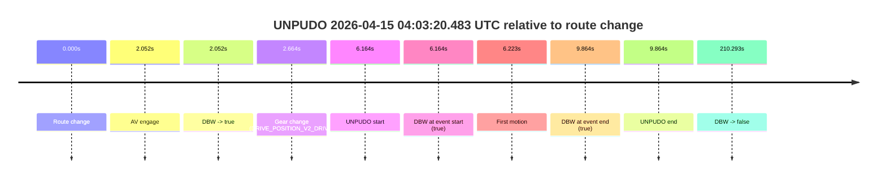
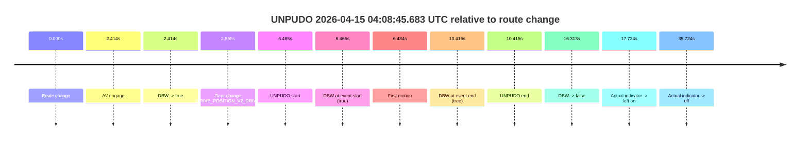
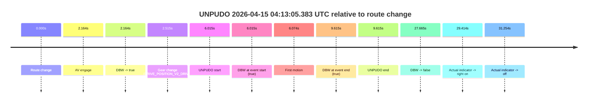
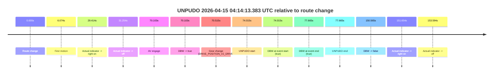
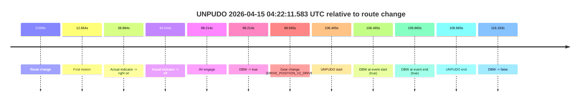
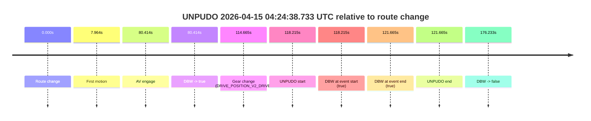
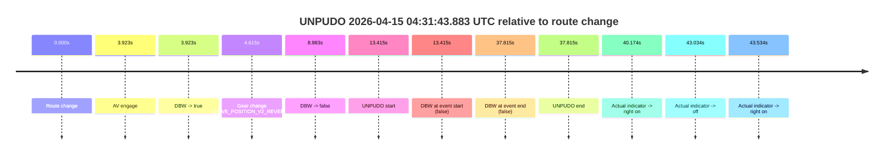
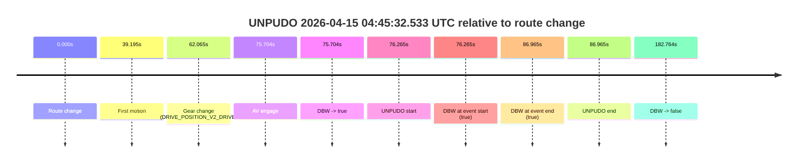
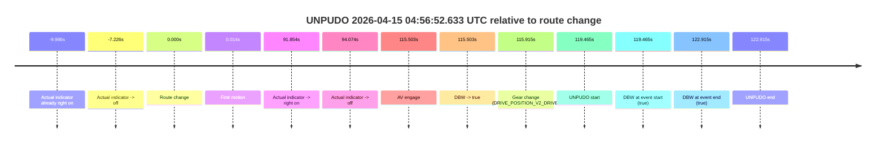

# Run Report: fme10003/2026-04-15--03-49-30--gen2-av-0a92ebc2-f66b-4a0b-9026-2990942d3433

| Field | Value |
|---|---|
| Run ID | `fme10003/2026-04-15--03-49-30--gen2-av-0a92ebc2-f66b-4a0b-9026-2990942d3433` |
| Date | `2026-04-15` |
| Model(s) | `eel-teal-outspoken` |
| Author | `zak` |
| Event count | `17` |

## unpudo 2026-04-15 03:59:25.683 UTC

| Field | Value |
|---|---|
| Model | `eel-teal-outspoken` |
| Author | `zak` |
| Run ID | `fme10003/2026-04-15--03-49-30--gen2-av-0a92ebc2-f66b-4a0b-9026-2990942d3433` |
| Date | `2026-04-15` |
| Time (UTC) | `03:59:25.683` |
| Event type | `unpudo` |
| Disengagement type | `none observed` |
| Route change | `found` |
| Console | [run](https://console.sso.wayve.ai/run/fme10003/2026-04-15--03-49-30--gen2-av-0a92ebc2-f66b-4a0b-9026-2990942d3433?id=&time-unixus=1776225565683305) |
| Foxglove | [segment](https://app.foxglove.dev/wayve-on-prem/p/prj_0dX18KZdVHg1fmmI/view?ds=foxglove-stream&ds.deviceName=fme10003&ds.start=2026-04-15T03%3A58%3A44.668626Z&ds.end=2026-04-15T04%3A00%3A28.812642Z&layoutId=lay_0e7VD4WIKDQGU73Y&time=2026-04-15T03%3A59%3A25.683305Z) |

### Event card: pass

- Pass: AV owns the credited unpudo from route change through the official unpudo window, the gear state is aligned at the anchor, and the vehicle moves without driver accelerator help in AV.

| Event | Time (UTC) | Delta from route change |
|---|---:|---:|
| Route change | 2026-04-15 03:58:54.668 | `0.000s` |
| AV engage | 2026-04-15 03:59:21.671 | `27.003s` |
| DBW -> true | 2026-04-15 03:59:21.671 | `27.003s` |
| Gear change (DRIVE_POSITION_V2_DRIVE) | 2026-04-15 03:59:22.183 | `27.515s` |
| UNPUDO start | 2026-04-15 03:59:25.683 | `31.015s` |
| DBW at event start (true) | 2026-04-15 03:59:25.683 | `31.015s` |
| First motion | 2026-04-15 03:59:25.741 | `31.073s` |
| DBW at event end (true) | 2026-04-15 03:59:37.633 | `42.965s` |
| UNPUDO end | 2026-04-15 03:59:37.633 | `42.965s` |
| DBW -> false | 2026-04-15 04:00:18.812 | `84.144s` |

| Metric | Value |
|---|---|
| Outcome | `pass` |
| Effective failure type | `none` |
| Route change status | `found` |
| DBW at event start | `true` |
| DBW at event end | `true` |
| Predicted gear at AV start | `DRIVE_POSITION_V2_DRIVE` |
| Actual gear at AV start | `DRIVE_POSITION_V2_PARK` |
| Predicted gear at event start | `DRIVE_POSITION_V2_DRIVE` |
| Actual gear at event start | `DRIVE_POSITION_V2_DRIVE` |
| Planned indicator direction | `INDICATORS_STATE_V2_LEFT_ON` |
| Controller indicator direction | `INDICATORS_STATE_V2_LEFT_ON` |
| Actual indicator direction | `INDICATORS_STATE_V2_OFF` |
| Actual indicator at maneuver end | `INDICATORS_STATE_V2_OFF` |
| Driver accel help in AV | `false` |
| Driver accel help timestamp | `n/a` |
| Max accel pedal pct in AV | `0.0%` |
| Max brake pedal pct in AV | `8.0%` |
| Max speed mps in AV | `2.556` |
| Success timing baseline | `route change` |
| Route -> AV | `27.003s` |
| AV -> event start | `4.012s` |
| AV -> first motion | `4.070s` |
| Success baseline -> event start | `31.015s` |
| Success baseline -> first motion | `31.073s` |
| AV duration before disengagement | `57.141s` |
| Trajectory waypoint count | `37` |
| Driving-plan step count | `11` |

The scored portion starts from the AV-owned window, not from the pre-AV setup. Route-change search in the stopped pre-event segment was `found`, with the baseline therefore set to route change. At the event anchor the model predicts `DRIVE_POSITION_V2_DRIVE` and the actual gear is `DRIVE_POSITION_V2_DRIVE`. The effective model outcome is `pass` because `the credited unpudo stays AV-owned through the official unpudo window.`

### Resolution

| Field | Value |
|---|---|
| Final outcome | `pass` |
| Do we agree with this label? | `yes` |
| Source disengagement type | `none observed` |
| Resolved effective failure type | `none` |
| Confidence | `high` |

## unpudo 2026-04-15 04:01:03.233 UTC

| Field | Value |
|---|---|
| Model | `eel-teal-outspoken` |
| Author | `zak` |
| Run ID | `fme10003/2026-04-15--03-49-30--gen2-av-0a92ebc2-f66b-4a0b-9026-2990942d3433` |
| Date | `2026-04-15` |
| Time (UTC) | `04:01:03.233` |
| Event type | `unpudo` |
| Disengagement type | `none observed` |
| Route change | `found` |
| Console | [run](https://console.sso.wayve.ai/run/fme10003/2026-04-15--03-49-30--gen2-av-0a92ebc2-f66b-4a0b-9026-2990942d3433?id=&time-unixus=1776225663233299) |
| Foxglove | [segment](https://app.foxglove.dev/wayve-on-prem/p/prj_0dX18KZdVHg1fmmI/view?ds=foxglove-stream&ds.deviceName=fme10003&ds.start=2026-04-15T03%3A59%3A03.568258Z&ds.end=2026-04-15T04%3A01%3A27.852187Z&layoutId=lay_0e7VD4WIKDQGU73Y&time=2026-04-15T04%3A01%3A03.233299Z) |

### Event card: pass

- Pass: AV owns the credited unpudo from route change through the official unpudo window, the gear state is aligned at the anchor, and the vehicle moves without driver accelerator help in AV.

| Event | Time (UTC) | Delta from route change |
|---|---:|---:|
| Route change | 2026-04-15 03:59:13.568 | `0.000s` |
| First motion | 2026-04-15 03:59:25.741 | `12.174s` |
| AV engage | 2026-04-15 04:00:59.211 | `105.644s` |
| DBW -> true | 2026-04-15 04:00:59.211 | `105.644s` |
| Gear change (DRIVE_POSITION_V2_DRIVE) | 2026-04-15 04:00:59.683 | `106.115s` |
| UNPUDO start | 2026-04-15 04:01:03.233 | `109.665s` |
| DBW at event start (true) | 2026-04-15 04:01:03.233 | `109.665s` |
| DBW at event end (true) | 2026-04-15 04:01:07.933 | `114.365s` |
| UNPUDO end | 2026-04-15 04:01:07.933 | `114.365s` |
| DBW -> false | 2026-04-15 04:01:17.852 | `124.284s` |

| Metric | Value |
|---|---|
| Outcome | `pass` |
| Effective failure type | `none` |
| Route change status | `found` |
| DBW at event start | `true` |
| DBW at event end | `true` |
| Predicted gear at AV start | `DRIVE_POSITION_V2_PARK` |
| Actual gear at AV start | `DRIVE_POSITION_V2_PARK` |
| Predicted gear at event start | `DRIVE_POSITION_V2_DRIVE` |
| Actual gear at event start | `DRIVE_POSITION_V2_DRIVE` |
| Planned indicator direction | `INDICATORS_STATE_V2_OFF` |
| Controller indicator direction | `INDICATORS_STATE_V2_OFF` |
| Actual indicator direction | `INDICATORS_STATE_V2_OFF` |
| Actual indicator at maneuver end | `INDICATORS_STATE_V2_OFF` |
| Driver accel help in AV | `false` |
| Driver accel help timestamp | `n/a` |
| Max accel pedal pct in AV | `0.0%` |
| Max brake pedal pct in AV | `8.0%` |
| Max speed mps in AV | `2.728` |
| Success timing baseline | `route change` |
| Route -> AV | `105.644s` |
| AV -> event start | `4.021s` |
| AV -> first motion | `-93.470s` |
| Success baseline -> event start | `109.665s` |
| Success baseline -> first motion | `12.174s` |
| AV duration before disengagement | `18.640s` |
| Trajectory waypoint count | `38` |
| Driving-plan step count | `11` |

The scored portion starts from the AV-owned window, not from the pre-AV setup. Route-change search in the stopped pre-event segment was `found`, with the baseline therefore set to route change. At the event anchor the model predicts `DRIVE_POSITION_V2_DRIVE` and the actual gear is `DRIVE_POSITION_V2_DRIVE`. The effective model outcome is `pass` because `the credited unpudo stays AV-owned through the official unpudo window.`

### Resolution

| Field | Value |
|---|---|
| Final outcome | `pass` |
| Do we agree with this label? | `yes` |
| Source disengagement type | `none observed` |
| Resolved effective failure type | `none` |
| Confidence | `high` |

## unpudo 2026-04-15 04:03:20.483 UTC

| Field | Value |
|---|---|
| Model | `eel-teal-outspoken` |
| Author | `zak` |
| Run ID | `fme10003/2026-04-15--03-49-30--gen2-av-0a92ebc2-f66b-4a0b-9026-2990942d3433` |
| Date | `2026-04-15` |
| Time (UTC) | `04:03:20.483` |
| Event type | `unpudo` |
| Disengagement type | `none observed` |
| Route change | `found` |
| Console | [run](https://console.sso.wayve.ai/run/fme10003/2026-04-15--03-49-30--gen2-av-0a92ebc2-f66b-4a0b-9026-2990942d3433?id=&time-unixus=1776225800483304) |
| Foxglove | [segment](https://app.foxglove.dev/wayve-on-prem/p/prj_0dX18KZdVHg1fmmI/view?ds=foxglove-stream&ds.deviceName=fme10003&ds.start=2026-04-15T04%3A03%3A04.319572Z&ds.end=2026-04-15T04%3A06%3A54.612428Z&layoutId=lay_0e7VD4WIKDQGU73Y&time=2026-04-15T04%3A03%3A20.483304Z) |

### Event card: pass

- Pass: AV owns the credited unpudo from route change through the official unpudo window, the gear state is aligned at the anchor, and the vehicle moves without driver accelerator help in AV.

| Event | Time (UTC) | Delta from route change |
|---|---:|---:|
| Route change | 2026-04-15 04:03:14.319 | `0.000s` |
| AV engage | 2026-04-15 04:03:16.371 | `2.052s` |
| DBW -> true | 2026-04-15 04:03:16.371 | `2.052s` |
| Gear change (DRIVE_POSITION_V2_DRIVE) | 2026-04-15 04:03:16.983 | `2.664s` |
| UNPUDO start | 2026-04-15 04:03:20.483 | `6.164s` |
| DBW at event start (true) | 2026-04-15 04:03:20.483 | `6.164s` |
| First motion | 2026-04-15 04:03:20.542 | `6.223s` |
| DBW at event end (true) | 2026-04-15 04:03:24.183 | `9.864s` |
| UNPUDO end | 2026-04-15 04:03:24.183 | `9.864s` |
| DBW -> false | 2026-04-15 04:06:44.612 | `210.293s` |

| Metric | Value |
|---|---|
| Outcome | `pass` |
| Effective failure type | `none` |
| Route change status | `found` |
| DBW at event start | `true` |
| DBW at event end | `true` |
| Predicted gear at AV start | `DRIVE_POSITION_V2_PARK` |
| Actual gear at AV start | `DRIVE_POSITION_V2_PARK` |
| Predicted gear at event start | `DRIVE_POSITION_V2_DRIVE` |
| Actual gear at event start | `DRIVE_POSITION_V2_DRIVE` |
| Planned indicator direction | `INDICATORS_STATE_V2_LEFT_ON` |
| Controller indicator direction | `INDICATORS_STATE_V2_LEFT_ON` |
| Actual indicator direction | `INDICATORS_STATE_V2_OFF` |
| Actual indicator at maneuver end | `INDICATORS_STATE_V2_OFF` |
| Driver accel help in AV | `false` |
| Driver accel help timestamp | `n/a` |
| Max accel pedal pct in AV | `0.0%` |
| Max brake pedal pct in AV | `8.0%` |
| Max speed mps in AV | `4.994` |
| Success timing baseline | `route change` |
| Route -> AV | `2.052s` |
| AV -> event start | `4.112s` |
| AV -> first motion | `4.170s` |
| Success baseline -> event start | `6.164s` |
| Success baseline -> first motion | `6.223s` |
| AV duration before disengagement | `208.241s` |
| Trajectory waypoint count | `37` |
| Driving-plan step count | `11` |

The scored portion starts from the AV-owned window, not from the pre-AV setup. Route-change search in the stopped pre-event segment was `found`, with the baseline therefore set to route change. At the event anchor the model predicts `DRIVE_POSITION_V2_DRIVE` and the actual gear is `DRIVE_POSITION_V2_DRIVE`. The effective model outcome is `pass` because `the credited unpudo stays AV-owned through the official unpudo window.`

### Resolution

| Field | Value |
|---|---|
| Final outcome | `pass` |
| Do we agree with this label? | `yes` |
| Source disengagement type | `none observed` |
| Resolved effective failure type | `none` |
| Confidence | `high` |

## unpudo 2026-04-15 04:08:45.683 UTC

| Field | Value |
|---|---|
| Model | `eel-teal-outspoken` |
| Author | `zak` |
| Run ID | `fme10003/2026-04-15--03-49-30--gen2-av-0a92ebc2-f66b-4a0b-9026-2990942d3433` |
| Date | `2026-04-15` |
| Time (UTC) | `04:08:45.683` |
| Event type | `unpudo` |
| Disengagement type | `none observed` |
| Route change | `found` |
| Console | [run](https://console.sso.wayve.ai/run/fme10003/2026-04-15--03-49-30--gen2-av-0a92ebc2-f66b-4a0b-9026-2990942d3433?id=&time-unixus=1776226125683312) |
| Foxglove | [segment](https://app.foxglove.dev/wayve-on-prem/p/prj_0dX18KZdVHg1fmmI/view?ds=foxglove-stream&ds.deviceName=fme10003&ds.start=2026-04-15T04%3A08%3A29.218257Z&ds.end=2026-04-15T04%3A09%3A05.531576Z&layoutId=lay_0e7VD4WIKDQGU73Y&time=2026-04-15T04%3A08%3A45.683312Z) |

### Event card: pass

- Pass: AV owns the credited unpudo from route change through the official unpudo window, the gear state is aligned at the anchor, and the vehicle moves without driver accelerator help in AV.

| Event | Time (UTC) | Delta from route change |
|---|---:|---:|
| Route change | 2026-04-15 04:08:39.218 | `0.000s` |
| AV engage | 2026-04-15 04:08:41.631 | `2.414s` |
| DBW -> true | 2026-04-15 04:08:41.631 | `2.414s` |
| Gear change (DRIVE_POSITION_V2_DRIVE) | 2026-04-15 04:08:42.083 | `2.865s` |
| UNPUDO start | 2026-04-15 04:08:45.683 | `6.465s` |
| DBW at event start (true) | 2026-04-15 04:08:45.683 | `6.465s` |
| First motion | 2026-04-15 04:08:45.702 | `6.484s` |
| DBW at event end (true) | 2026-04-15 04:08:49.633 | `10.415s` |
| UNPUDO end | 2026-04-15 04:08:49.633 | `10.415s` |
| DBW -> false | 2026-04-15 04:08:55.531 | `16.313s` |
| Actual indicator -> left on | 2026-04-15 04:08:56.942 | `17.724s` |
| Actual indicator -> off | 2026-04-15 04:09:14.941 | `35.724s` |

| Metric | Value |
|---|---|
| Outcome | `pass` |
| Effective failure type | `none` |
| Route change status | `found` |
| DBW at event start | `true` |
| DBW at event end | `true` |
| Predicted gear at AV start | `DRIVE_POSITION_V2_DRIVE` |
| Actual gear at AV start | `DRIVE_POSITION_V2_PARK` |
| Predicted gear at event start | `DRIVE_POSITION_V2_DRIVE` |
| Actual gear at event start | `DRIVE_POSITION_V2_DRIVE` |
| Planned indicator direction | `INDICATORS_STATE_V2_LEFT_ON` |
| Controller indicator direction | `INDICATORS_STATE_V2_LEFT_ON` |
| Actual indicator direction | `INDICATORS_STATE_V2_OFF` |
| Actual indicator at maneuver end | `INDICATORS_STATE_V2_OFF` |
| Driver accel help in AV | `false` |
| Driver accel help timestamp | `n/a` |
| Max accel pedal pct in AV | `0.0%` |
| Max brake pedal pct in AV | `8.0%` |
| Max speed mps in AV | `4.731` |
| Success timing baseline | `route change` |
| Route -> AV | `2.414s` |
| AV -> event start | `4.051s` |
| AV -> first motion | `4.070s` |
| Success baseline -> event start | `6.465s` |
| Success baseline -> first motion | `6.484s` |
| AV duration before disengagement | `13.900s` |
| Trajectory waypoint count | `37` |
| Driving-plan step count | `11` |

The scored portion starts from the AV-owned window, not from the pre-AV setup. Route-change search in the stopped pre-event segment was `found`, with the baseline therefore set to route change. At the event anchor the model predicts `DRIVE_POSITION_V2_DRIVE` and the actual gear is `DRIVE_POSITION_V2_DRIVE`. The effective model outcome is `pass` because `the credited unpudo stays AV-owned through the official unpudo window.`

### Resolution

| Field | Value |
|---|---|
| Final outcome | `pass` |
| Do we agree with this label? | `yes` |
| Source disengagement type | `none observed` |
| Resolved effective failure type | `none` |
| Confidence | `high` |

## unpudo 2026-04-15 04:10:42.183 UTC

| Field | Value |
|---|---|
| Model | `eel-teal-outspoken` |
| Author | `zak` |
| Run ID | `fme10003/2026-04-15--03-49-30--gen2-av-0a92ebc2-f66b-4a0b-9026-2990942d3433` |
| Date | `2026-04-15` |
| Time (UTC) | `04:10:42.183` |
| Event type | `unpudo` |
| Disengagement type | `none observed` |
| Route change | `found` |
| Console | [run](https://console.sso.wayve.ai/run/fme10003/2026-04-15--03-49-30--gen2-av-0a92ebc2-f66b-4a0b-9026-2990942d3433?id=&time-unixus=1776226242183300) |
| Foxglove | [segment](https://app.foxglove.dev/wayve-on-prem/p/prj_0dX18KZdVHg1fmmI/view?ds=foxglove-stream&ds.deviceName=fme10003&ds.start=2026-04-15T04%3A10%3A23.968252Z&ds.end=2026-04-15T04%3A10%3A58.072762Z&layoutId=lay_0e7VD4WIKDQGU73Y&time=2026-04-15T04%3A10%3A42.183300Z) |

### Event card: pass

- Pass: AV owns the credited unpudo from route change through the official unpudo window, the gear state is aligned at the anchor, and the vehicle moves without driver accelerator help in AV.

| Event | Time (UTC) | Delta from route change |
|---|---:|---:|
| Route change | 2026-04-15 04:10:33.968 | `0.000s` |
| AV engage | 2026-04-15 04:10:38.071 | `4.104s` |
| DBW -> true | 2026-04-15 04:10:38.071 | `4.104s` |
| Gear change (DRIVE_POSITION_V2_DRIVE) | 2026-04-15 04:10:38.583 | `4.615s` |
| UNPUDO start | 2026-04-15 04:10:42.183 | `8.215s` |
| DBW at event start (true) | 2026-04-15 04:10:42.183 | `8.215s` |
| First motion | 2026-04-15 04:10:42.222 | `8.254s` |
| DBW at event end (true) | 2026-04-15 04:10:45.733 | `11.765s` |
| UNPUDO end | 2026-04-15 04:10:45.733 | `11.765s` |
| DBW -> false | 2026-04-15 04:10:48.072 | `14.105s` |

| Metric | Value |
|---|---|
| Outcome | `pass` |
| Effective failure type | `none` |
| Route change status | `found` |
| DBW at event start | `true` |
| DBW at event end | `true` |
| Predicted gear at AV start | `DRIVE_POSITION_V2_DRIVE` |
| Actual gear at AV start | `DRIVE_POSITION_V2_PARK` |
| Predicted gear at event start | `DRIVE_POSITION_V2_DRIVE` |
| Actual gear at event start | `DRIVE_POSITION_V2_DRIVE` |
| Planned indicator direction | `INDICATORS_STATE_V2_OFF` |
| Controller indicator direction | `INDICATORS_STATE_V2_OFF` |
| Actual indicator direction | `INDICATORS_STATE_V2_OFF` |
| Actual indicator at maneuver end | `INDICATORS_STATE_V2_OFF` |
| Driver accel help in AV | `false` |
| Driver accel help timestamp | `n/a` |
| Max accel pedal pct in AV | `0.0%` |
| Max brake pedal pct in AV | `8.0%` |
| Max speed mps in AV | `4.892` |
| Success timing baseline | `route change` |
| Route -> AV | `4.104s` |
| AV -> event start | `4.112s` |
| AV -> first motion | `4.150s` |
| Success baseline -> event start | `8.215s` |
| Success baseline -> first motion | `8.254s` |
| AV duration before disengagement | `10.001s` |
| Trajectory waypoint count | `37` |
| Driving-plan step count | `11` |

The scored portion starts from the AV-owned window, not from the pre-AV setup. Route-change search in the stopped pre-event segment was `found`, with the baseline therefore set to route change. At the event anchor the model predicts `DRIVE_POSITION_V2_DRIVE` and the actual gear is `DRIVE_POSITION_V2_DRIVE`. The effective model outcome is `pass` because `the credited unpudo stays AV-owned through the official unpudo window.`

### Resolution

| Field | Value |
|---|---|
| Final outcome | `pass` |
| Do we agree with this label? | `yes` |
| Source disengagement type | `none observed` |
| Resolved effective failure type | `none` |
| Confidence | `high` |

## unpudo 2026-04-15 04:13:05.383 UTC

| Field | Value |
|---|---|
| Model | `eel-teal-outspoken` |
| Author | `zak` |
| Run ID | `fme10003/2026-04-15--03-49-30--gen2-av-0a92ebc2-f66b-4a0b-9026-2990942d3433` |
| Date | `2026-04-15` |
| Time (UTC) | `04:13:05.383` |
| Event type | `unpudo` |
| Disengagement type | `none observed` |
| Route change | `found` |
| Console | [run](https://console.sso.wayve.ai/run/fme10003/2026-04-15--03-49-30--gen2-av-0a92ebc2-f66b-4a0b-9026-2990942d3433?id=&time-unixus=1776226385383303) |
| Foxglove | [segment](https://app.foxglove.dev/wayve-on-prem/p/prj_0dX18KZdVHg1fmmI/view?ds=foxglove-stream&ds.deviceName=fme10003&ds.start=2026-04-15T04%3A12%3A49.368252Z&ds.end=2026-04-15T04%3A13%3A37.033008Z&layoutId=lay_0e7VD4WIKDQGU73Y&time=2026-04-15T04%3A13%3A05.383303Z) |

### Event card: pass

- Pass: AV owns the credited unpudo from route change through the official unpudo window, the gear state is aligned at the anchor, and the vehicle moves without driver accelerator help in AV.

| Event | Time (UTC) | Delta from route change |
|---|---:|---:|
| Route change | 2026-04-15 04:12:59.368 | `0.000s` |
| AV engage | 2026-04-15 04:13:01.531 | `2.164s` |
| DBW -> true | 2026-04-15 04:13:01.531 | `2.164s` |
| Gear change (DRIVE_POSITION_V2_DRIVE) | 2026-04-15 04:13:01.883 | `2.515s` |
| UNPUDO start | 2026-04-15 04:13:05.383 | `6.015s` |
| DBW at event start (true) | 2026-04-15 04:13:05.383 | `6.015s` |
| First motion | 2026-04-15 04:13:05.442 | `6.074s` |
| DBW at event end (true) | 2026-04-15 04:13:08.983 | `9.615s` |
| UNPUDO end | 2026-04-15 04:13:08.983 | `9.615s` |
| DBW -> false | 2026-04-15 04:13:27.033 | `27.665s` |
| Actual indicator -> right on | 2026-04-15 04:13:28.781 | `29.414s` |
| Actual indicator -> off | 2026-04-15 04:13:30.622 | `31.254s` |

| Metric | Value |
|---|---|
| Outcome | `pass` |
| Effective failure type | `none` |
| Route change status | `found` |
| DBW at event start | `true` |
| DBW at event end | `true` |
| Predicted gear at AV start | `DRIVE_POSITION_V2_PARK` |
| Actual gear at AV start | `DRIVE_POSITION_V2_PARK` |
| Predicted gear at event start | `DRIVE_POSITION_V2_DRIVE` |
| Actual gear at event start | `DRIVE_POSITION_V2_DRIVE` |
| Planned indicator direction | `INDICATORS_STATE_V2_LEFT_ON` |
| Controller indicator direction | `INDICATORS_STATE_V2_LEFT_ON` |
| Actual indicator direction | `INDICATORS_STATE_V2_OFF` |
| Actual indicator at maneuver end | `INDICATORS_STATE_V2_OFF` |
| Driver accel help in AV | `false` |
| Driver accel help timestamp | `n/a` |
| Max accel pedal pct in AV | `0.0%` |
| Max brake pedal pct in AV | `8.0%` |
| Max speed mps in AV | `5.664` |
| Success timing baseline | `route change` |
| Route -> AV | `2.164s` |
| AV -> event start | `3.851s` |
| AV -> first motion | `3.910s` |
| Success baseline -> event start | `6.015s` |
| Success baseline -> first motion | `6.074s` |
| AV duration before disengagement | `25.501s` |
| Trajectory waypoint count | `37` |
| Driving-plan step count | `11` |

The scored portion starts from the AV-owned window, not from the pre-AV setup. Route-change search in the stopped pre-event segment was `found`, with the baseline therefore set to route change. At the event anchor the model predicts `DRIVE_POSITION_V2_DRIVE` and the actual gear is `DRIVE_POSITION_V2_DRIVE`. The effective model outcome is `pass` because `the credited unpudo stays AV-owned through the official unpudo window.`

### Resolution

| Field | Value |
|---|---|
| Final outcome | `pass` |
| Do we agree with this label? | `yes` |
| Source disengagement type | `none observed` |
| Resolved effective failure type | `none` |
| Confidence | `high` |

## unpudo 2026-04-15 04:14:13.383 UTC

| Field | Value |
|---|---|
| Model | `eel-teal-outspoken` |
| Author | `zak` |
| Run ID | `fme10003/2026-04-15--03-49-30--gen2-av-0a92ebc2-f66b-4a0b-9026-2990942d3433` |
| Date | `2026-04-15` |
| Time (UTC) | `04:14:13.383` |
| Event type | `unpudo` |
| Disengagement type | `none observed` |
| Route change | `found` |
| Console | [run](https://console.sso.wayve.ai/run/fme10003/2026-04-15--03-49-30--gen2-av-0a92ebc2-f66b-4a0b-9026-2990942d3433?id=&time-unixus=1776226453383292) |
| Foxglove | [segment](https://app.foxglove.dev/wayve-on-prem/p/prj_0dX18KZdVHg1fmmI/view?ds=foxglove-stream&ds.deviceName=fme10003&ds.start=2026-04-15T04%3A12%3A49.368252Z&ds.end=2026-04-15T04%3A15%3A39.932885Z&layoutId=lay_0e7VD4WIKDQGU73Y&time=2026-04-15T04%3A14%3A13.383292Z) |

### Event card: pass

- Pass: AV owns the credited unpudo from route change through the official unpudo window, the gear state is aligned at the anchor, and the vehicle moves without driver accelerator help in AV.

| Event | Time (UTC) | Delta from route change |
|---|---:|---:|
| Route change | 2026-04-15 04:12:59.368 | `0.000s` |
| First motion | 2026-04-15 04:13:05.442 | `6.074s` |
| Actual indicator -> right on | 2026-04-15 04:13:28.781 | `29.414s` |
| Actual indicator -> off | 2026-04-15 04:13:30.622 | `31.254s` |
| AV engage | 2026-04-15 04:14:09.471 | `70.103s` |
| DBW -> true | 2026-04-15 04:14:09.471 | `70.103s` |
| Gear change (DRIVE_POSITION_V2_DRIVE) | 2026-04-15 04:14:09.883 | `70.515s` |
| UNPUDO start | 2026-04-15 04:14:13.383 | `74.015s` |
| DBW at event start (true) | 2026-04-15 04:14:13.383 | `74.015s` |
| DBW at event end (true) | 2026-04-15 04:14:17.033 | `77.665s` |
| UNPUDO end | 2026-04-15 04:14:17.033 | `77.665s` |
| DBW -> false | 2026-04-15 04:15:29.932 | `150.565s` |
| Actual indicator -> right on | 2026-04-15 04:15:31.021 | `151.654s` |
| Actual indicator -> off | 2026-04-15 04:15:32.962 | `153.594s` |

| Metric | Value |
|---|---|
| Outcome | `pass` |
| Effective failure type | `none` |
| Route change status | `found` |
| DBW at event start | `true` |
| DBW at event end | `true` |
| Predicted gear at AV start | `DRIVE_POSITION_V2_DRIVE` |
| Actual gear at AV start | `DRIVE_POSITION_V2_PARK` |
| Predicted gear at event start | `DRIVE_POSITION_V2_DRIVE` |
| Actual gear at event start | `DRIVE_POSITION_V2_DRIVE` |
| Planned indicator direction | `INDICATORS_STATE_V2_LEFT_ON` |
| Controller indicator direction | `INDICATORS_STATE_V2_LEFT_ON` |
| Actual indicator direction | `INDICATORS_STATE_V2_OFF` |
| Actual indicator at maneuver end | `INDICATORS_STATE_V2_OFF` |
| Driver accel help in AV | `false` |
| Driver accel help timestamp | `n/a` |
| Max accel pedal pct in AV | `0.0%` |
| Max brake pedal pct in AV | `8.0%` |
| Max speed mps in AV | `4.750` |
| Success timing baseline | `route change` |
| Route -> AV | `70.103s` |
| AV -> event start | `3.912s` |
| AV -> first motion | `-64.030s` |
| Success baseline -> event start | `74.015s` |
| Success baseline -> first motion | `6.074s` |
| AV duration before disengagement | `80.461s` |
| Trajectory waypoint count | `37` |
| Driving-plan step count | `11` |

The scored portion starts from the AV-owned window, not from the pre-AV setup. Route-change search in the stopped pre-event segment was `found`, with the baseline therefore set to route change. At the event anchor the model predicts `DRIVE_POSITION_V2_DRIVE` and the actual gear is `DRIVE_POSITION_V2_DRIVE`. The effective model outcome is `pass` because `the credited unpudo stays AV-owned through the official unpudo window.`

### Resolution

| Field | Value |
|---|---|
| Final outcome | `pass` |
| Do we agree with this label? | `yes` |
| Source disengagement type | `none observed` |
| Resolved effective failure type | `none` |
| Confidence | `high` |

## unpudo 2026-04-15 04:22:11.583 UTC

| Field | Value |
|---|---|
| Model | `eel-teal-outspoken` |
| Author | `zak` |
| Run ID | `fme10003/2026-04-15--03-49-30--gen2-av-0a92ebc2-f66b-4a0b-9026-2990942d3433` |
| Date | `2026-04-15` |
| Time (UTC) | `04:22:11.583` |
| Event type | `unpudo` |
| Disengagement type | `none observed` |
| Route change | `found` |
| Console | [run](https://console.sso.wayve.ai/run/fme10003/2026-04-15--03-49-30--gen2-av-0a92ebc2-f66b-4a0b-9026-2990942d3433?id=&time-unixus=1776226931583318) |
| Foxglove | [segment](https://app.foxglove.dev/wayve-on-prem/p/prj_0dX18KZdVHg1fmmI/view?ds=foxglove-stream&ds.deviceName=fme10003&ds.start=2026-04-15T04%3A20%3A15.118232Z&ds.end=2026-04-15T04%3A22%3A31.310956Z&layoutId=lay_0e7VD4WIKDQGU73Y&time=2026-04-15T04%3A22%3A11.583318Z) |

### Event card: pass

- Pass: AV owns the credited unpudo from route change through the official unpudo window, the gear state is aligned at the anchor, and the vehicle moves without driver accelerator help in AV.

| Event | Time (UTC) | Delta from route change |
|---|---:|---:|
| Route change | 2026-04-15 04:20:25.118 | `0.000s` |
| First motion | 2026-04-15 04:20:37.782 | `12.664s` |
| Actual indicator -> right on | 2026-04-15 04:21:04.002 | `38.884s` |
| Actual indicator -> off | 2026-04-15 04:21:08.362 | `43.244s` |
| AV engage | 2026-04-15 04:22:03.331 | `98.214s` |
| DBW -> true | 2026-04-15 04:22:03.331 | `98.214s` |
| Gear change (DRIVE_POSITION_V2_DRIVE) | 2026-04-15 04:22:03.683 | `98.565s` |
| UNPUDO start | 2026-04-15 04:22:11.583 | `106.465s` |
| DBW at event start (true) | 2026-04-15 04:22:11.583 | `106.465s` |
| DBW at event end (true) | 2026-04-15 04:22:14.983 | `109.865s` |
| UNPUDO end | 2026-04-15 04:22:14.983 | `109.865s` |
| DBW -> false | 2026-04-15 04:22:21.310 | `116.193s` |

| Metric | Value |
|---|---|
| Outcome | `pass` |
| Effective failure type | `none` |
| Route change status | `found` |
| DBW at event start | `true` |
| DBW at event end | `true` |
| Predicted gear at AV start | `DRIVE_POSITION_V2_PARK` |
| Actual gear at AV start | `DRIVE_POSITION_V2_PARK` |
| Predicted gear at event start | `DRIVE_POSITION_V2_DRIVE` |
| Actual gear at event start | `DRIVE_POSITION_V2_DRIVE` |
| Planned indicator direction | `INDICATORS_STATE_V2_LEFT_ON` |
| Controller indicator direction | `INDICATORS_STATE_V2_LEFT_ON` |
| Actual indicator direction | `INDICATORS_STATE_V2_OFF` |
| Actual indicator at maneuver end | `INDICATORS_STATE_V2_OFF` |
| Driver accel help in AV | `false` |
| Driver accel help timestamp | `n/a` |
| Max accel pedal pct in AV | `0.0%` |
| Max brake pedal pct in AV | `8.0%` |
| Max speed mps in AV | `5.861` |
| Success timing baseline | `route change` |
| Route -> AV | `98.214s` |
| AV -> event start | `8.251s` |
| AV -> first motion | `-85.550s` |
| Success baseline -> event start | `106.465s` |
| Success baseline -> first motion | `12.664s` |
| AV duration before disengagement | `17.979s` |
| Trajectory waypoint count | `37` |
| Driving-plan step count | `11` |

The scored portion starts from the AV-owned window, not from the pre-AV setup. Route-change search in the stopped pre-event segment was `found`, with the baseline therefore set to route change. At the event anchor the model predicts `DRIVE_POSITION_V2_DRIVE` and the actual gear is `DRIVE_POSITION_V2_DRIVE`. The effective model outcome is `pass` because `the credited unpudo stays AV-owned through the official unpudo window.`

### Resolution

| Field | Value |
|---|---|
| Final outcome | `pass` |
| Do we agree with this label? | `yes` |
| Source disengagement type | `none observed` |
| Resolved effective failure type | `none` |
| Confidence | `high` |

## unpudo 2026-04-15 04:22:48.433 UTC

| Field | Value |
|---|---|
| Model | `eel-teal-outspoken` |
| Author | `zak` |
| Run ID | `fme10003/2026-04-15--03-49-30--gen2-av-0a92ebc2-f66b-4a0b-9026-2990942d3433` |
| Date | `2026-04-15` |
| Time (UTC) | `04:22:48.433` |
| Event type | `unpudo` |
| Disengagement type | `none observed` |
| Route change | `found` |
| Console | [run](https://console.sso.wayve.ai/run/fme10003/2026-04-15--03-49-30--gen2-av-0a92ebc2-f66b-4a0b-9026-2990942d3433?id=&time-unixus=1776226968433293) |
| Foxglove | [segment](https://app.foxglove.dev/wayve-on-prem/p/prj_0dX18KZdVHg1fmmI/view?ds=foxglove-stream&ds.deviceName=fme10003&ds.start=2026-04-15T04%3A21%3A37.818288Z&ds.end=2026-04-15T04%3A23%3A49.351525Z&layoutId=lay_0e7VD4WIKDQGU73Y&time=2026-04-15T04%3A22%3A48.433293Z) |

### Event card: pass

- Pass: AV owns the credited unpudo from route change through the official unpudo window, the gear state is aligned at the anchor, and the vehicle moves without driver accelerator help in AV.

| Event | Time (UTC) | Delta from route change |
|---|---:|---:|
| Route change | 2026-04-15 04:21:47.818 | `0.000s` |
| First motion | 2026-04-15 04:22:11.601 | `23.784s` |
| AV engage | 2026-04-15 04:22:44.191 | `56.374s` |
| DBW -> true | 2026-04-15 04:22:44.191 | `56.374s` |
| Gear change (DRIVE_POSITION_V2_DRIVE) | 2026-04-15 04:22:44.883 | `57.065s` |
| UNPUDO start | 2026-04-15 04:22:48.433 | `60.615s` |
| DBW at event start (true) | 2026-04-15 04:22:48.433 | `60.615s` |
| DBW at event end (true) | 2026-04-15 04:22:51.883 | `64.065s` |
| UNPUDO end | 2026-04-15 04:22:51.883 | `64.065s` |
| DBW -> false | 2026-04-15 04:23:39.351 | `111.533s` |

| Metric | Value |
|---|---|
| Outcome | `pass` |
| Effective failure type | `none` |
| Route change status | `found` |
| DBW at event start | `true` |
| DBW at event end | `true` |
| Predicted gear at AV start | `DRIVE_POSITION_V2_PARK` |
| Actual gear at AV start | `DRIVE_POSITION_V2_PARK` |
| Predicted gear at event start | `DRIVE_POSITION_V2_DRIVE` |
| Actual gear at event start | `DRIVE_POSITION_V2_DRIVE` |
| Planned indicator direction | `INDICATORS_STATE_V2_LEFT_ON` |
| Controller indicator direction | `INDICATORS_STATE_V2_LEFT_ON` |
| Actual indicator direction | `INDICATORS_STATE_V2_OFF` |
| Actual indicator at maneuver end | `INDICATORS_STATE_V2_OFF` |
| Driver accel help in AV | `false` |
| Driver accel help timestamp | `n/a` |
| Max accel pedal pct in AV | `0.0%` |
| Max brake pedal pct in AV | `8.2%` |
| Max speed mps in AV | `5.936` |
| Success timing baseline | `route change` |
| Route -> AV | `56.374s` |
| AV -> event start | `4.241s` |
| AV -> first motion | `-32.590s` |
| Success baseline -> event start | `60.615s` |
| Success baseline -> first motion | `23.784s` |
| AV duration before disengagement | `55.160s` |
| Trajectory waypoint count | `38` |
| Driving-plan step count | `11` |

The scored portion starts from the AV-owned window, not from the pre-AV setup. Route-change search in the stopped pre-event segment was `found`, with the baseline therefore set to route change. At the event anchor the model predicts `DRIVE_POSITION_V2_DRIVE` and the actual gear is `DRIVE_POSITION_V2_DRIVE`. The effective model outcome is `pass` because `the credited unpudo stays AV-owned through the official unpudo window.`

### Resolution

| Field | Value |
|---|---|
| Final outcome | `pass` |
| Do we agree with this label? | `yes` |
| Source disengagement type | `none observed` |
| Resolved effective failure type | `none` |
| Confidence | `high` |

## unpudo 2026-04-15 04:24:04.783 UTC

| Field | Value |
|---|---|
| Model | `eel-teal-outspoken` |
| Author | `zak` |
| Run ID | `fme10003/2026-04-15--03-49-30--gen2-av-0a92ebc2-f66b-4a0b-9026-2990942d3433` |
| Date | `2026-04-15` |
| Time (UTC) | `04:24:04.783` |
| Event type | `unpudo` |
| Disengagement type | `none observed` |
| Route change | `found` |
| Console | [run](https://console.sso.wayve.ai/run/fme10003/2026-04-15--03-49-30--gen2-av-0a92ebc2-f66b-4a0b-9026-2990942d3433?id=&time-unixus=1776227044783310) |
| Foxglove | [segment](https://app.foxglove.dev/wayve-on-prem/p/prj_0dX18KZdVHg1fmmI/view?ds=foxglove-stream&ds.deviceName=fme10003&ds.start=2026-04-15T04%3A22%3A30.518234Z&ds.end=2026-04-15T04%3A25%3A46.751621Z&layoutId=lay_0e7VD4WIKDQGU73Y&time=2026-04-15T04%3A24%3A04.783310Z) |

### Event card: pass

- Pass: AV owns the credited unpudo from route change through the official unpudo window, the gear state is aligned at the anchor, and the vehicle moves without driver accelerator help in AV.

| Event | Time (UTC) | Delta from route change |
|---|---:|---:|
| Route change | 2026-04-15 04:22:40.518 | `0.000s` |
| First motion | 2026-04-15 04:22:48.482 | `7.964s` |
| AV engage | 2026-04-15 04:24:00.931 | `80.414s` |
| DBW -> true | 2026-04-15 04:24:00.931 | `80.414s` |
| Gear change (DRIVE_POSITION_V2_DRIVE) | 2026-04-15 04:24:01.283 | `80.765s` |
| UNPUDO start | 2026-04-15 04:24:04.783 | `84.265s` |
| DBW at event start (true) | 2026-04-15 04:24:04.783 | `84.265s` |
| DBW at event end (true) | 2026-04-15 04:24:08.383 | `87.865s` |
| UNPUDO end | 2026-04-15 04:24:08.383 | `87.865s` |
| DBW -> false | 2026-04-15 04:25:36.751 | `176.233s` |

| Metric | Value |
|---|---|
| Outcome | `pass` |
| Effective failure type | `none` |
| Route change status | `found` |
| DBW at event start | `true` |
| DBW at event end | `true` |
| Predicted gear at AV start | `DRIVE_POSITION_V2_PARK` |
| Actual gear at AV start | `DRIVE_POSITION_V2_PARK` |
| Predicted gear at event start | `DRIVE_POSITION_V2_DRIVE` |
| Actual gear at event start | `DRIVE_POSITION_V2_DRIVE` |
| Planned indicator direction | `INDICATORS_STATE_V2_LEFT_ON` |
| Controller indicator direction | `INDICATORS_STATE_V2_LEFT_ON` |
| Actual indicator direction | `INDICATORS_STATE_V2_OFF` |
| Actual indicator at maneuver end | `INDICATORS_STATE_V2_OFF` |
| Driver accel help in AV | `false` |
| Driver accel help timestamp | `n/a` |
| Max accel pedal pct in AV | `0.0%` |
| Max brake pedal pct in AV | `8.0%` |
| Max speed mps in AV | `5.883` |
| Success timing baseline | `route change` |
| Route -> AV | `80.414s` |
| AV -> event start | `3.851s` |
| AV -> first motion | `-72.450s` |
| Success baseline -> event start | `84.265s` |
| Success baseline -> first motion | `7.964s` |
| AV duration before disengagement | `95.820s` |
| Trajectory waypoint count | `37` |
| Driving-plan step count | `11` |

The scored portion starts from the AV-owned window, not from the pre-AV setup. Route-change search in the stopped pre-event segment was `found`, with the baseline therefore set to route change. At the event anchor the model predicts `DRIVE_POSITION_V2_DRIVE` and the actual gear is `DRIVE_POSITION_V2_DRIVE`. The effective model outcome is `pass` because `the credited unpudo stays AV-owned through the official unpudo window.`

### Resolution

| Field | Value |
|---|---|
| Final outcome | `pass` |
| Do we agree with this label? | `yes` |
| Source disengagement type | `none observed` |
| Resolved effective failure type | `none` |
| Confidence | `high` |

## unpudo 2026-04-15 04:24:38.733 UTC

| Field | Value |
|---|---|
| Model | `eel-teal-outspoken` |
| Author | `zak` |
| Run ID | `fme10003/2026-04-15--03-49-30--gen2-av-0a92ebc2-f66b-4a0b-9026-2990942d3433` |
| Date | `2026-04-15` |
| Time (UTC) | `04:24:38.733` |
| Event type | `unpudo` |
| Disengagement type | `none observed` |
| Route change | `found` |
| Console | [run](https://console.sso.wayve.ai/run/fme10003/2026-04-15--03-49-30--gen2-av-0a92ebc2-f66b-4a0b-9026-2990942d3433?id=&time-unixus=1776227078733295) |
| Foxglove | [segment](https://app.foxglove.dev/wayve-on-prem/p/prj_0dX18KZdVHg1fmmI/view?ds=foxglove-stream&ds.deviceName=fme10003&ds.start=2026-04-15T04%3A22%3A30.518234Z&ds.end=2026-04-15T04%3A25%3A46.751621Z&layoutId=lay_0e7VD4WIKDQGU73Y&time=2026-04-15T04%3A24%3A38.733295Z) |

### Event card: pass

- Pass: AV owns the credited unpudo from route change through the official unpudo window, the gear state is aligned at the anchor, and the vehicle moves without driver accelerator help in AV.

| Event | Time (UTC) | Delta from route change |
|---|---:|---:|
| Route change | 2026-04-15 04:22:40.518 | `0.000s` |
| First motion | 2026-04-15 04:22:48.482 | `7.964s` |
| AV engage | 2026-04-15 04:24:00.931 | `80.414s` |
| DBW -> true | 2026-04-15 04:24:00.931 | `80.414s` |
| Gear change (DRIVE_POSITION_V2_DRIVE) | 2026-04-15 04:24:35.183 | `114.665s` |
| UNPUDO start | 2026-04-15 04:24:38.733 | `118.215s` |
| DBW at event start (true) | 2026-04-15 04:24:38.733 | `118.215s` |
| DBW at event end (true) | 2026-04-15 04:24:42.183 | `121.665s` |
| UNPUDO end | 2026-04-15 04:24:42.183 | `121.665s` |
| DBW -> false | 2026-04-15 04:25:36.751 | `176.233s` |

| Metric | Value |
|---|---|
| Outcome | `pass` |
| Effective failure type | `none` |
| Route change status | `found` |
| DBW at event start | `true` |
| DBW at event end | `true` |
| Predicted gear at AV start | `DRIVE_POSITION_V2_PARK` |
| Actual gear at AV start | `DRIVE_POSITION_V2_PARK` |
| Predicted gear at event start | `DRIVE_POSITION_V2_DRIVE` |
| Actual gear at event start | `DRIVE_POSITION_V2_DRIVE` |
| Planned indicator direction | `INDICATORS_STATE_V2_LEFT_ON` |
| Controller indicator direction | `INDICATORS_STATE_V2_LEFT_ON` |
| Actual indicator direction | `INDICATORS_STATE_V2_OFF` |
| Actual indicator at maneuver end | `INDICATORS_STATE_V2_OFF` |
| Driver accel help in AV | `false` |
| Driver accel help timestamp | `n/a` |
| Max accel pedal pct in AV | `0.0%` |
| Max brake pedal pct in AV | `14.6%` |
| Max speed mps in AV | `8.317` |
| Success timing baseline | `route change` |
| Route -> AV | `80.414s` |
| AV -> event start | `37.801s` |
| AV -> first motion | `-72.450s` |
| Success baseline -> event start | `118.215s` |
| Success baseline -> first motion | `7.964s` |
| AV duration before disengagement | `95.820s` |
| Trajectory waypoint count | `38` |
| Driving-plan step count | `11` |

The scored portion starts from the AV-owned window, not from the pre-AV setup. Route-change search in the stopped pre-event segment was `found`, with the baseline therefore set to route change. At the event anchor the model predicts `DRIVE_POSITION_V2_DRIVE` and the actual gear is `DRIVE_POSITION_V2_DRIVE`. The effective model outcome is `pass` because `the credited unpudo stays AV-owned through the official unpudo window.`

### Resolution

| Field | Value |
|---|---|
| Final outcome | `pass` |
| Do we agree with this label? | `yes` |
| Source disengagement type | `none observed` |
| Resolved effective failure type | `none` |
| Confidence | `high` |

## unpudo 2026-04-15 04:26:21.933 UTC

| Field | Value |
|---|---|
| Model | `eel-teal-outspoken` |
| Author | `zak` |
| Run ID | `fme10003/2026-04-15--03-49-30--gen2-av-0a92ebc2-f66b-4a0b-9026-2990942d3433` |
| Date | `2026-04-15` |
| Time (UTC) | `04:26:21.933` |
| Event type | `unpudo` |
| Disengagement type | `none observed` |
| Route change | `found` |
| Console | [run](https://console.sso.wayve.ai/run/fme10003/2026-04-15--03-49-30--gen2-av-0a92ebc2-f66b-4a0b-9026-2990942d3433?id=&time-unixus=1776227181933313) |
| Foxglove | [segment](https://app.foxglove.dev/wayve-on-prem/p/prj_0dX18KZdVHg1fmmI/view?ds=foxglove-stream&ds.deviceName=fme10003&ds.start=2026-04-15T04%3A24%3A24.968245Z&ds.end=2026-04-15T04%3A27%3A40.111531Z&layoutId=lay_0e7VD4WIKDQGU73Y&time=2026-04-15T04%3A26%3A21.933313Z) |

### Event card: pass

- Pass: AV owns the credited unpudo from route change through the official unpudo window, the gear state is aligned at the anchor, and the vehicle moves without driver accelerator help in AV.

| Event | Time (UTC) | Delta from route change |
|---|---:|---:|
| Route change | 2026-04-15 04:24:34.968 | `0.000s` |
| First motion | 2026-04-15 04:24:38.782 | `3.814s` |
| AV engage | 2026-04-15 04:26:13.851 | `98.883s` |
| DBW -> true | 2026-04-15 04:26:13.851 | `98.883s` |
| Gear change (DRIVE_POSITION_V2_DRIVE) | 2026-04-15 04:26:14.483 | `99.515s` |
| UNPUDO start | 2026-04-15 04:26:21.933 | `106.965s` |
| DBW at event start (true) | 2026-04-15 04:26:21.933 | `106.965s` |
| DBW at event end (true) | 2026-04-15 04:26:26.633 | `111.665s` |
| UNPUDO end | 2026-04-15 04:26:26.633 | `111.665s` |
| DBW -> false | 2026-04-15 04:27:30.111 | `175.143s` |

| Metric | Value |
|---|---|
| Outcome | `pass` |
| Effective failure type | `none` |
| Route change status | `found` |
| DBW at event start | `true` |
| DBW at event end | `true` |
| Predicted gear at AV start | `DRIVE_POSITION_V2_PARK` |
| Actual gear at AV start | `DRIVE_POSITION_V2_PARK` |
| Predicted gear at event start | `DRIVE_POSITION_V2_DRIVE` |
| Actual gear at event start | `DRIVE_POSITION_V2_DRIVE` |
| Planned indicator direction | `INDICATORS_STATE_V2_OFF` |
| Controller indicator direction | `INDICATORS_STATE_V2_OFF` |
| Actual indicator direction | `INDICATORS_STATE_V2_OFF` |
| Actual indicator at maneuver end | `INDICATORS_STATE_V2_OFF` |
| Driver accel help in AV | `false` |
| Driver accel help timestamp | `n/a` |
| Max accel pedal pct in AV | `0.0%` |
| Max brake pedal pct in AV | `8.0%` |
| Max speed mps in AV | `2.781` |
| Success timing baseline | `route change` |
| Route -> AV | `98.883s` |
| AV -> event start | `8.082s` |
| AV -> first motion | `-95.070s` |
| Success baseline -> event start | `106.965s` |
| Success baseline -> first motion | `3.814s` |
| AV duration before disengagement | `76.260s` |
| Trajectory waypoint count | `38` |
| Driving-plan step count | `11` |

The scored portion starts from the AV-owned window, not from the pre-AV setup. Route-change search in the stopped pre-event segment was `found`, with the baseline therefore set to route change. At the event anchor the model predicts `DRIVE_POSITION_V2_DRIVE` and the actual gear is `DRIVE_POSITION_V2_DRIVE`. The effective model outcome is `pass` because `the credited unpudo stays AV-owned through the official unpudo window.`

### Resolution

| Field | Value |
|---|---|
| Final outcome | `pass` |
| Do we agree with this label? | `yes` |
| Source disengagement type | `none observed` |
| Resolved effective failure type | `none` |
| Confidence | `high` |

## unpudo 2026-04-15 04:31:43.883 UTC

| Field | Value |
|---|---|
| Model | `eel-teal-outspoken` |
| Author | `zak` |
| Run ID | `fme10003/2026-04-15--03-49-30--gen2-av-0a92ebc2-f66b-4a0b-9026-2990942d3433` |
| Date | `2026-04-15` |
| Time (UTC) | `04:31:43.883` |
| Event type | `unpudo` |
| Disengagement type | `failed_to_unpudo` |
| Route change | `found` |
| Console | [run](https://console.sso.wayve.ai/run/fme10003/2026-04-15--03-49-30--gen2-av-0a92ebc2-f66b-4a0b-9026-2990942d3433?id=&time-unixus=1776227503883308) |
| Foxglove | [segment](https://app.foxglove.dev/wayve-on-prem/p/prj_0dX18KZdVHg1fmmI/view?ds=foxglove-stream&ds.deviceName=fme10003&ds.start=2026-04-15T04%3A31%3A20.468290Z&ds.end=2026-04-15T04%3A32%3A18.283312Z&layoutId=lay_0e7VD4WIKDQGU73Y&time=2026-04-15T04%3A31%3A43.883308Z) |

### Event card: fail

- Fail: AV owns part of the segment, but the event still resolves as a model-performance failure under the AV-only scoring rule.

| Event | Time (UTC) | Delta from route change |
|---|---:|---:|
| Route change | 2026-04-15 04:31:30.468 | `0.000s` |
| AV engage | 2026-04-15 04:31:34.391 | `3.923s` |
| DBW -> true | 2026-04-15 04:31:34.391 | `3.923s` |
| Gear change (DRIVE_POSITION_V2_REVERSE) | 2026-04-15 04:31:35.083 | `4.615s` |
| DBW -> false | 2026-04-15 04:31:39.451 | `8.983s` |
| UNPUDO start | 2026-04-15 04:31:43.883 | `13.415s` |
| DBW at event start (false) | 2026-04-15 04:31:43.883 | `13.415s` |
| DBW at event end (false) | 2026-04-15 04:32:08.283 | `37.815s` |
| UNPUDO end | 2026-04-15 04:32:08.283 | `37.815s` |
| Actual indicator -> right on | 2026-04-15 04:32:10.642 | `40.174s` |
| Actual indicator -> off | 2026-04-15 04:32:13.502 | `43.034s` |
| Actual indicator -> right on | 2026-04-15 04:32:14.001 | `43.534s` |

| Metric | Value |
|---|---|
| Outcome | `fail` |
| Effective failure type | `failed_to_unpudo` |
| Route change status | `found` |
| DBW at event start | `false` |
| DBW at event end | `false` |
| Predicted gear at AV start | `DRIVE_POSITION_V2_PARK` |
| Actual gear at AV start | `DRIVE_POSITION_V2_PARK` |
| Predicted gear at event start | `DRIVE_POSITION_V2_REVERSE` |
| Actual gear at event start | `DRIVE_POSITION_V2_REVERSE` |
| Planned indicator direction | `INDICATORS_STATE_V2_OFF` |
| Controller indicator direction | `INDICATORS_STATE_V2_OFF` |
| Actual indicator direction | `INDICATORS_STATE_V2_OFF` |
| Actual indicator at maneuver end | `INDICATORS_STATE_V2_OFF` |
| Driver accel help in AV | `false` |
| Driver accel help timestamp | `n/a` |
| Max accel pedal pct in AV | `0.0%` |
| Max brake pedal pct in AV | `8.0%` |
| Max speed mps in AV | `0.000` |
| Success timing baseline | `route change` |
| Route -> AV | `3.923s` |
| AV -> event start | `9.492s` |
| AV -> first motion | `n/a` |
| Success baseline -> event start | `13.415s` |
| Success baseline -> first motion | `n/a` |
| AV duration before disengagement | `5.060s` |
| Trajectory waypoint count | `37` |
| Driving-plan step count | `11` |

The scored portion starts from the AV-owned window, not from the pre-AV setup. Route-change search in the stopped pre-event segment was `found`, with the baseline therefore set to route change. At the event anchor the model predicts `DRIVE_POSITION_V2_REVERSE` and the actual gear is `DRIVE_POSITION_V2_REVERSE`. The effective model outcome is `fail` because `failed_to_unpudo.`

### Resolution

| Field | Value |
|---|---|
| Final outcome | `fail` |
| Do we agree with this label? | `yes` |
| Source disengagement type | `failed_to_unpudo` |
| Resolved effective failure type | `failed_to_unpudo` |
| Confidence | `high` |

## unpudo 2026-04-15 04:34:47.833 UTC

| Field | Value |
|---|---|
| Model | `eel-teal-outspoken` |
| Author | `zak` |
| Run ID | `fme10003/2026-04-15--03-49-30--gen2-av-0a92ebc2-f66b-4a0b-9026-2990942d3433` |
| Date | `2026-04-15` |
| Time (UTC) | `04:34:47.833` |
| Event type | `unpudo` |
| Disengagement type | `none observed` |
| Route change | `found` |
| Console | [run](https://console.sso.wayve.ai/run/fme10003/2026-04-15--03-49-30--gen2-av-0a92ebc2-f66b-4a0b-9026-2990942d3433?id=&time-unixus=1776227687833310) |
| Foxglove | [segment](https://app.foxglove.dev/wayve-on-prem/p/prj_0dX18KZdVHg1fmmI/view?ds=foxglove-stream&ds.deviceName=fme10003&ds.start=2026-04-15T04%3A34%3A33.118244Z&ds.end=2026-04-15T04%3A35%3A14.411558Z&layoutId=lay_0e7VD4WIKDQGU73Y&time=2026-04-15T04%3A34%3A47.833310Z) |

### Event card: pass

- Pass: AV owns the credited unpudo from route change through the official unpudo window, the gear state is aligned at the anchor, and the vehicle moves without driver accelerator help in AV.

| Event | Time (UTC) | Delta from route change |
|---|---:|---:|
| Route change | 2026-04-15 04:34:43.118 | `0.000s` |
| AV engage | 2026-04-15 04:34:43.121 | `0.003s` |
| DBW -> true | 2026-04-15 04:34:43.121 | `0.003s` |
| Gear change (DRIVE_POSITION_V2_DRIVE) | 2026-04-15 04:34:43.383 | `0.265s` |
| UNPUDO start | 2026-04-15 04:34:47.833 | `4.715s` |
| DBW at event start (true) | 2026-04-15 04:34:47.833 | `4.715s` |
| First motion | 2026-04-15 04:34:47.962 | `4.844s` |
| DBW at event end (true) | 2026-04-15 04:34:53.583 | `10.465s` |
| UNPUDO end | 2026-04-15 04:34:53.583 | `10.465s` |
| DBW -> false | 2026-04-15 04:35:04.411 | `21.293s` |

| Metric | Value |
|---|---|
| Outcome | `pass` |
| Effective failure type | `none` |
| Route change status | `found` |
| DBW at event start | `true` |
| DBW at event end | `true` |
| Predicted gear at AV start | `DRIVE_POSITION_V2_PARK` |
| Actual gear at AV start | `DRIVE_POSITION_V2_PARK` |
| Predicted gear at event start | `DRIVE_POSITION_V2_DRIVE` |
| Actual gear at event start | `DRIVE_POSITION_V2_DRIVE` |
| Planned indicator direction | `INDICATORS_STATE_V2_LEFT_ON` |
| Controller indicator direction | `INDICATORS_STATE_V2_LEFT_ON` |
| Actual indicator direction | `INDICATORS_STATE_V2_OFF` |
| Actual indicator at maneuver end | `INDICATORS_STATE_V2_OFF` |
| Driver accel help in AV | `false` |
| Driver accel help timestamp | `n/a` |
| Max accel pedal pct in AV | `0.0%` |
| Max brake pedal pct in AV | `8.0%` |
| Max speed mps in AV | `2.778` |
| Success timing baseline | `route change` |
| Route -> AV | `0.003s` |
| AV -> event start | `4.712s` |
| AV -> first motion | `4.841s` |
| Success baseline -> event start | `4.715s` |
| Success baseline -> first motion | `4.844s` |
| AV duration before disengagement | `21.290s` |
| Trajectory waypoint count | `38` |
| Driving-plan step count | `11` |

The scored portion starts from the AV-owned window, not from the pre-AV setup. Route-change search in the stopped pre-event segment was `found`, with the baseline therefore set to route change. At the event anchor the model predicts `DRIVE_POSITION_V2_DRIVE` and the actual gear is `DRIVE_POSITION_V2_DRIVE`. The effective model outcome is `pass` because `the credited unpudo stays AV-owned through the official unpudo window.`

### Resolution

| Field | Value |
|---|---|
| Final outcome | `pass` |
| Do we agree with this label? | `yes` |
| Source disengagement type | `none observed` |
| Resolved effective failure type | `none` |
| Confidence | `high` |

## unpudo 2026-04-15 04:45:32.533 UTC

| Field | Value |
|---|---|
| Model | `eel-teal-outspoken` |
| Author | `zak` |
| Run ID | `fme10003/2026-04-15--03-49-30--gen2-av-0a92ebc2-f66b-4a0b-9026-2990942d3433` |
| Date | `2026-04-15` |
| Time (UTC) | `04:45:32.533` |
| Event type | `unpudo` |
| Disengagement type | `none observed` |
| Route change | `found` |
| Console | [run](https://console.sso.wayve.ai/run/fme10003/2026-04-15--03-49-30--gen2-av-0a92ebc2-f66b-4a0b-9026-2990942d3433?id=&time-unixus=1776228332533309) |
| Foxglove | [segment](https://app.foxglove.dev/wayve-on-prem/p/prj_0dX18KZdVHg1fmmI/view?ds=foxglove-stream&ds.deviceName=fme10003&ds.start=2026-04-15T04%3A44%3A06.268238Z&ds.end=2026-04-15T04%3A47%3A29.032711Z&layoutId=lay_0e7VD4WIKDQGU73Y&time=2026-04-15T04%3A45%3A32.533309Z) |

### Event card: pass

- Pass: AV owns the credited unpudo from route change through the official unpudo window, the gear state is aligned at the anchor, and the vehicle moves without driver accelerator help in AV.

| Event | Time (UTC) | Delta from route change |
|---|---:|---:|
| Route change | 2026-04-15 04:44:16.268 | `0.000s` |
| First motion | 2026-04-15 04:44:55.462 | `39.195s` |
| Gear change (DRIVE_POSITION_V2_DRIVE) | 2026-04-15 04:45:18.333 | `62.065s` |
| AV engage | 2026-04-15 04:45:31.971 | `75.704s` |
| DBW -> true | 2026-04-15 04:45:31.971 | `75.704s` |
| UNPUDO start | 2026-04-15 04:45:32.533 | `76.265s` |
| DBW at event start (true) | 2026-04-15 04:45:32.533 | `76.265s` |
| DBW at event end (true) | 2026-04-15 04:45:43.233 | `86.965s` |
| UNPUDO end | 2026-04-15 04:45:43.233 | `86.965s` |
| DBW -> false | 2026-04-15 04:47:19.032 | `182.764s` |

| Metric | Value |
|---|---|
| Outcome | `pass` |
| Effective failure type | `none` |
| Route change status | `found` |
| DBW at event start | `true` |
| DBW at event end | `true` |
| Predicted gear at AV start | `DRIVE_POSITION_V2_DRIVE` |
| Actual gear at AV start | `DRIVE_POSITION_V2_DRIVE` |
| Predicted gear at event start | `DRIVE_POSITION_V2_DRIVE` |
| Actual gear at event start | `DRIVE_POSITION_V2_DRIVE` |
| Planned indicator direction | `INDICATORS_STATE_V2_RIGHT_ON` |
| Controller indicator direction | `INDICATORS_STATE_V2_RIGHT_ON` |
| Actual indicator direction | `INDICATORS_STATE_V2_OFF` |
| Actual indicator at maneuver end | `INDICATORS_STATE_V2_OFF` |
| Driver accel help in AV | `false` |
| Driver accel help timestamp | `n/a` |
| Max accel pedal pct in AV | `0.0%` |
| Max brake pedal pct in AV | `24.3%` |
| Max speed mps in AV | `3.731` |
| Success timing baseline | `route change` |
| Route -> AV | `75.704s` |
| AV -> event start | `0.562s` |
| AV -> first motion | `-36.509s` |
| Success baseline -> event start | `76.265s` |
| Success baseline -> first motion | `39.195s` |
| AV duration before disengagement | `107.061s` |
| Trajectory waypoint count | `38` |
| Driving-plan step count | `11` |

The scored portion starts from the AV-owned window, not from the pre-AV setup. Route-change search in the stopped pre-event segment was `found`, with the baseline therefore set to route change. At the event anchor the model predicts `DRIVE_POSITION_V2_DRIVE` and the actual gear is `DRIVE_POSITION_V2_DRIVE`. The effective model outcome is `pass` because `the credited unpudo stays AV-owned through the official unpudo window.`

### Resolution

| Field | Value |
|---|---|
| Final outcome | `pass` |
| Do we agree with this label? | `yes` |
| Source disengagement type | `none observed` |
| Resolved effective failure type | `none` |
| Confidence | `high` |

## unpudo 2026-04-15 04:46:51.983 UTC

| Field | Value |
|---|---|
| Model | `eel-teal-outspoken` |
| Author | `zak` |
| Run ID | `fme10003/2026-04-15--03-49-30--gen2-av-0a92ebc2-f66b-4a0b-9026-2990942d3433` |
| Date | `2026-04-15` |
| Time (UTC) | `04:46:51.983` |
| Event type | `unpudo` |
| Disengagement type | `none observed` |
| Route change | `found` |
| Console | [run](https://console.sso.wayve.ai/run/fme10003/2026-04-15--03-49-30--gen2-av-0a92ebc2-f66b-4a0b-9026-2990942d3433?id=&time-unixus=1776228411983292) |
| Foxglove | [segment](https://app.foxglove.dev/wayve-on-prem/p/prj_0dX18KZdVHg1fmmI/view?ds=foxglove-stream&ds.deviceName=fme10003&ds.start=2026-04-15T04%3A46%3A37.968912Z&ds.end=2026-04-15T04%3A47%3A29.032711Z&layoutId=lay_0e7VD4WIKDQGU73Y&time=2026-04-15T04%3A46%3A51.983292Z) |

### Event card: pass

- Pass: AV owns the credited unpudo from route change through the official unpudo window, the gear state is aligned at the anchor, and the vehicle moves without driver accelerator help in AV.

| Event | Time (UTC) | Delta from route change |
|---|---:|---:|
| Route change | 2026-04-15 04:46:47.968 | `0.000s` |
| AV engage | 2026-04-15 04:46:47.971 | `0.003s` |
| DBW -> true | 2026-04-15 04:46:47.971 | `0.003s` |
| Gear change (DRIVE_POSITION_V2_DRIVE) | 2026-04-15 04:46:48.333 | `0.364s` |
| UNPUDO start | 2026-04-15 04:46:51.983 | `4.014s` |
| DBW at event start (true) | 2026-04-15 04:46:51.983 | `4.014s` |
| First motion | 2026-04-15 04:46:52.002 | `4.033s` |
| DBW at event end (true) | 2026-04-15 04:47:01.233 | `13.264s` |
| UNPUDO end | 2026-04-15 04:47:01.233 | `13.264s` |
| DBW -> false | 2026-04-15 04:47:19.032 | `31.064s` |

| Metric | Value |
|---|---|
| Outcome | `pass` |
| Effective failure type | `none` |
| Route change status | `found` |
| DBW at event start | `true` |
| DBW at event end | `true` |
| Predicted gear at AV start | `DRIVE_POSITION_V2_PARK` |
| Actual gear at AV start | `DRIVE_POSITION_V2_PARK` |
| Predicted gear at event start | `DRIVE_POSITION_V2_DRIVE` |
| Actual gear at event start | `DRIVE_POSITION_V2_DRIVE` |
| Planned indicator direction | `INDICATORS_STATE_V2_LEFT_ON` |
| Controller indicator direction | `INDICATORS_STATE_V2_LEFT_ON` |
| Actual indicator direction | `INDICATORS_STATE_V2_OFF` |
| Actual indicator at maneuver end | `INDICATORS_STATE_V2_OFF` |
| Driver accel help in AV | `false` |
| Driver accel help timestamp | `n/a` |
| Max accel pedal pct in AV | `0.0%` |
| Max brake pedal pct in AV | `8.4%` |
| Max speed mps in AV | `2.239` |
| Success timing baseline | `route change` |
| Route -> AV | `0.003s` |
| AV -> event start | `4.012s` |
| AV -> first motion | `4.030s` |
| Success baseline -> event start | `4.014s` |
| Success baseline -> first motion | `4.033s` |
| AV duration before disengagement | `31.061s` |
| Trajectory waypoint count | `37` |
| Driving-plan step count | `11` |

The scored portion starts from the AV-owned window, not from the pre-AV setup. Route-change search in the stopped pre-event segment was `found`, with the baseline therefore set to route change. At the event anchor the model predicts `DRIVE_POSITION_V2_DRIVE` and the actual gear is `DRIVE_POSITION_V2_DRIVE`. The effective model outcome is `pass` because `the credited unpudo stays AV-owned through the official unpudo window.`

### Resolution

| Field | Value |
|---|---|
| Final outcome | `pass` |
| Do we agree with this label? | `yes` |
| Source disengagement type | `none observed` |
| Resolved effective failure type | `none` |
| Confidence | `high` |

## unpudo 2026-04-15 04:56:52.633 UTC

| Field | Value |
|---|---|
| Model | `eel-teal-outspoken` |
| Author | `zak` |
| Run ID | `fme10003/2026-04-15--03-49-30--gen2-av-0a92ebc2-f66b-4a0b-9026-2990942d3433` |
| Date | `2026-04-15` |
| Time (UTC) | `04:56:52.633` |
| Event type | `unpudo` |
| Disengagement type | `none observed` |
| Route change | `found` |
| Console | [run](https://console.sso.wayve.ai/run/fme10003/2026-04-15--03-49-30--gen2-av-0a92ebc2-f66b-4a0b-9026-2990942d3433?id=&time-unixus=1776229012633295) |
| Foxglove | [segment](https://app.foxglove.dev/wayve-on-prem/p/prj_0dX18KZdVHg1fmmI/view?ds=foxglove-stream&ds.deviceName=fme10003&ds.start=2026-04-15T04%3A54%3A43.168286Z&ds.end=2026-04-15T04%3A57%3A06.083292Z&layoutId=lay_0e7VD4WIKDQGU73Y&time=2026-04-15T04%3A56%3A52.633295Z) |

### Event card: pass

- Pass: AV owns the credited unpudo from route change through the official unpudo window, the gear state is aligned at the anchor, and the vehicle moves without driver accelerator help in AV.

| Event | Time (UTC) | Delta from route change |
|---|---:|---:|
| Actual indicator already right on | 2026-04-15 04:54:43.181 | `-9.986s` |
| Actual indicator -> off | 2026-04-15 04:54:45.942 | `-7.226s` |
| Route change | 2026-04-15 04:54:53.168 | `0.000s` |
| First motion | 2026-04-15 04:54:53.182 | `0.014s` |
| Actual indicator -> right on | 2026-04-15 04:56:25.022 | `91.854s` |
| Actual indicator -> off | 2026-04-15 04:56:27.242 | `94.074s` |
| AV engage | 2026-04-15 04:56:48.671 | `115.503s` |
| DBW -> true | 2026-04-15 04:56:48.671 | `115.503s` |
| Gear change (DRIVE_POSITION_V2_DRIVE) | 2026-04-15 04:56:49.083 | `115.915s` |
| UNPUDO start | 2026-04-15 04:56:52.633 | `119.465s` |
| DBW at event start (true) | 2026-04-15 04:56:52.633 | `119.465s` |
| DBW at event end (true) | 2026-04-15 04:56:56.083 | `122.915s` |
| UNPUDO end | 2026-04-15 04:56:56.083 | `122.915s` |

| Metric | Value |
|---|---|
| Outcome | `pass` |
| Effective failure type | `none` |
| Route change status | `found` |
| DBW at event start | `true` |
| DBW at event end | `true` |
| Predicted gear at AV start | `DRIVE_POSITION_V2_DRIVE` |
| Actual gear at AV start | `DRIVE_POSITION_V2_PARK` |
| Predicted gear at event start | `DRIVE_POSITION_V2_DRIVE` |
| Actual gear at event start | `DRIVE_POSITION_V2_DRIVE` |
| Planned indicator direction | `INDICATORS_STATE_V2_LEFT_ON` |
| Controller indicator direction | `INDICATORS_STATE_V2_LEFT_ON` |
| Actual indicator direction | `INDICATORS_STATE_V2_OFF` |
| Actual indicator at maneuver end | `INDICATORS_STATE_V2_OFF` |
| Driver accel help in AV | `false` |
| Driver accel help timestamp | `n/a` |
| Max accel pedal pct in AV | `0.0%` |
| Max brake pedal pct in AV | `8.0%` |
| Max speed mps in AV | `5.628` |
| Success timing baseline | `route change` |
| Route -> AV | `115.503s` |
| AV -> event start | `3.962s` |
| AV -> first motion | `-115.489s` |
| Success baseline -> event start | `119.465s` |
| Success baseline -> first motion | `0.014s` |
| AV duration before disengagement | `n/a` |
| Trajectory waypoint count | `38` |
| Driving-plan step count | `11` |

The scored portion starts from the AV-owned window, not from the pre-AV setup. Route-change search in the stopped pre-event segment was `found`, with the baseline therefore set to route change. At the event anchor the model predicts `DRIVE_POSITION_V2_DRIVE` and the actual gear is `DRIVE_POSITION_V2_DRIVE`. The effective model outcome is `pass` because `the credited unpudo stays AV-owned through the official unpudo window.`

### Resolution

| Field | Value |
|---|---|
| Final outcome | `pass` |
| Do we agree with this label? | `yes` |
| Source disengagement type | `none observed` |
| Resolved effective failure type | `none` |
| Confidence | `high` |
