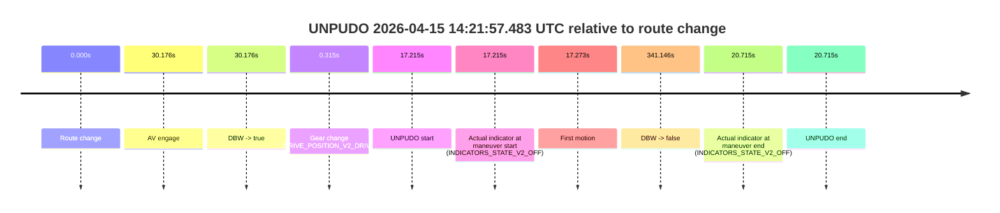
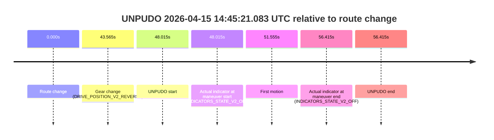

# Run Report: fme10003/2026-04-15--13-44-28--gen2-av-c7446f84-5bfc-4d1e-8fcb-7e31a47a0695

| Field | Value |
|---|---|
| Run ID | `fme10003/2026-04-15--13-44-28--gen2-av-c7446f84-5bfc-4d1e-8fcb-7e31a47a0695` |
| Date | `2026-04-15` |
| Model(s) | `satisfied-amber-moose` |
| Author | `guy.geva` |
| Event count | `7` |

## unpudo 2026-04-15 13:58:51.483 UTC

| Field | Value |
|---|---|
| Model | `satisfied-amber-moose` |
| Author | `guy.geva` |
| Run ID | `fme10003/2026-04-15--13-44-28--gen2-av-c7446f84-5bfc-4d1e-8fcb-7e31a47a0695` |
| Date | `2026-04-15` |
| Time (UTC) | `13:58:51.483` |
| Event type | `unpudo` |
| Disengagement type | `failed_to_unpudo` |
| Route change | `found` |
| Console | [run](https://console.sso.wayve.ai/run/fme10003/2026-04-15--13-44-28--gen2-av-c7446f84-5bfc-4d1e-8fcb-7e31a47a0695?id=&time-unixus=1776261531483311) |
| Foxglove | [segment](https://app.foxglove.dev/wayve-on-prem/p/prj_0dX18KZdVHg1fmmI/view?ds=foxglove-stream&ds.deviceName=fme10003&ds.start=2026-04-15T13%3A58%3A36.818282Z&ds.end=2026-04-15T14%3A00%3A46.714980Z&layoutId=lay_0e7VD4WIKDQGU73Y&time=2026-04-15T13%3A58%3A51.483311Z) |

### Event card: accidental

- Accidental: AV ownership is present for less than `2s`, so this is treated as an accidental brush with the maneuver rather than a meaningful model attempt.

| Event | Time (UTC) | Delta from route change |
|---|---:|---:|
| Route change | 2026-04-15 13:58:46.818 | `0.000s` |
| AV engage | 2026-04-15 13:59:06.824 | `20.007s` |
| DBW -> true | 2026-04-15 13:59:06.824 | `20.007s` |
| Gear change (DRIVE_POSITION_V2_DRIVE) | 2026-04-15 13:58:47.183 | `0.365s` |
| UNPUDO start | 2026-04-15 13:58:51.483 | `4.665s` |
| Actual indicator at maneuver start (INDICATORS_STATE_V2_OFF) | 2026-04-15 13:58:51.483 | `4.665s` |
| First motion | 2026-04-15 13:58:51.522 | `4.704s` |
| DBW -> false | 2026-04-15 14:00:36.714 | `109.897s` |
| Actual indicator at maneuver end (INDICATORS_STATE_V2_RIGHT_ON) | 2026-04-15 13:58:59.383 | `12.565s` |
| UNPUDO end | 2026-04-15 13:58:59.383 | `12.565s` |

| Metric | Value |
|---|---|
| Outcome | `accidental` |
| Effective failure type | `none` |
| Route change status | `found` |
| DBW at event start | `false` |
| DBW at event end | `false` |
| Predicted gear at AV start | `DRIVE_POSITION_V2_DRIVE` |
| Actual gear at AV start | `DRIVE_POSITION_V2_DRIVE` |
| Predicted gear at event start | `DRIVE_POSITION_V2_DRIVE` |
| Actual gear at event start | `DRIVE_POSITION_V2_DRIVE` |
| Planned indicator direction | `INDICATORS_STATE_V2_OFF` |
| Controller indicator direction | `INDICATORS_STATE_V2_OFF` |
| Actual indicator direction | `INDICATORS_STATE_V2_OFF` |
| Actual indicator at maneuver end | `INDICATORS_STATE_V2_RIGHT_ON` |
| Driver accel help in AV | `false` |
| Driver accel help timestamp | `n/a` |
| Max accel pedal pct in AV | `0.0%` |
| Max brake pedal pct in AV | `0.0%` |
| Max speed mps in AV | `0.000` |
| Route -> AV | `20.007s` |
| AV -> event start | `-15.342s` |
| AV -> first motion | `-15.302s` |
| AV duration before disengagement | `89.890s` |
| Trajectory waypoint count | `37` |
| Driving-plan step count | `11` |

The scored portion starts from the AV-owned window, not from the pre-AV setup. Route-change search in the stopped pre-event segment was `found`, with the baseline therefore set to route change. At the event anchor the model predicts `DRIVE_POSITION_V2_DRIVE` and the actual gear is `DRIVE_POSITION_V2_DRIVE`. The effective model outcome is `accidental` because `the AV-owned portion is shorter than 2s`.

### Resolution

| Field | Value |
|---|---|
| Final outcome | `accidental` |
| Do we agree with this label? | `yes` |
| Source disengagement type | `failed_to_unpudo` |
| Resolved effective failure type | `none` |
| Confidence | `high` |

## unpudo 2026-04-15 14:02:38.433 UTC

| Field | Value |
|---|---|
| Model | `satisfied-amber-moose` |
| Author | `guy.geva` |
| Run ID | `fme10003/2026-04-15--13-44-28--gen2-av-c7446f84-5bfc-4d1e-8fcb-7e31a47a0695` |
| Date | `2026-04-15` |
| Time (UTC) | `14:02:38.433` |
| Event type | `unpudo` |
| Disengagement type | `failed_to_unpudo` |
| Route change | `found` |
| Console | [run](https://console.sso.wayve.ai/run/fme10003/2026-04-15--13-44-28--gen2-av-c7446f84-5bfc-4d1e-8fcb-7e31a47a0695?id=&time-unixus=1776261758433307) |
| Foxglove | [segment](https://app.foxglove.dev/wayve-on-prem/p/prj_0dX18KZdVHg1fmmI/view?ds=foxglove-stream&ds.deviceName=fme10003&ds.start=2026-04-15T14%3A02%3A08.268237Z&ds.end=2026-04-15T14%3A05%3A53.373850Z&layoutId=lay_0e7VD4WIKDQGU73Y&time=2026-04-15T14%3A02%3A38.433307Z) |

### Event card: accidental

- Accidental: AV ownership is present for less than `2s`, so this is treated as an accidental brush with the maneuver rather than a meaningful model attempt.

| Event | Time (UTC) | Delta from route change |
|---|---:|---:|
| Route change | 2026-04-15 14:02:18.268 | `0.000s` |
| AV engage | 2026-04-15 14:02:56.424 | `38.156s` |
| DBW -> true | 2026-04-15 14:02:56.424 | `38.156s` |
| Gear change (DRIVE_POSITION_V2_REVERSE) | 2026-04-15 14:02:33.333 | `15.065s` |
| UNPUDO start | 2026-04-15 14:02:38.433 | `20.165s` |
| Actual indicator at maneuver start (INDICATORS_STATE_V2_OFF) | 2026-04-15 14:02:38.433 | `20.165s` |
| First motion | 2026-04-15 14:02:40.581 | `22.314s` |
| DBW -> false | 2026-04-15 14:05:43.373 | `205.106s` |
| Actual indicator at maneuver end (INDICATORS_STATE_V2_OFF) | 2026-04-15 14:02:44.883 | `26.615s` |
| UNPUDO end | 2026-04-15 14:02:44.883 | `26.615s` |

| Metric | Value |
|---|---|
| Outcome | `accidental` |
| Effective failure type | `none` |
| Route change status | `found` |
| DBW at event start | `false` |
| DBW at event end | `false` |
| Predicted gear at AV start | `DRIVE_POSITION_V2_DRIVE` |
| Actual gear at AV start | `DRIVE_POSITION_V2_DRIVE` |
| Predicted gear at event start | `DRIVE_POSITION_V2_REVERSE` |
| Actual gear at event start | `DRIVE_POSITION_V2_REVERSE` |
| Planned indicator direction | `INDICATORS_STATE_V2_OFF` |
| Controller indicator direction | `INDICATORS_STATE_V2_OFF` |
| Actual indicator direction | `INDICATORS_STATE_V2_OFF` |
| Actual indicator at maneuver end | `INDICATORS_STATE_V2_OFF` |
| Driver accel help in AV | `false` |
| Driver accel help timestamp | `n/a` |
| Max accel pedal pct in AV | `0.0%` |
| Max brake pedal pct in AV | `0.0%` |
| Max speed mps in AV | `0.000` |
| Route -> AV | `38.156s` |
| AV -> event start | `-17.991s` |
| AV -> first motion | `-15.843s` |
| AV duration before disengagement | `166.949s` |
| Trajectory waypoint count | `38` |
| Driving-plan step count | `11` |

The scored portion starts from the AV-owned window, not from the pre-AV setup. Route-change search in the stopped pre-event segment was `found`, with the baseline therefore set to route change. At the event anchor the model predicts `DRIVE_POSITION_V2_REVERSE` and the actual gear is `DRIVE_POSITION_V2_REVERSE`. The effective model outcome is `accidental` because `the AV-owned portion is shorter than 2s`.

### Resolution

| Field | Value |
|---|---|
| Final outcome | `accidental` |
| Do we agree with this label? | `yes` |
| Source disengagement type | `failed_to_unpudo` |
| Resolved effective failure type | `none` |
| Confidence | `high` |

## unpudo 2026-04-15 14:05:43.983 UTC

| Field | Value |
|---|---|
| Model | `satisfied-amber-moose` |
| Author | `guy.geva` |
| Run ID | `fme10003/2026-04-15--13-44-28--gen2-av-c7446f84-5bfc-4d1e-8fcb-7e31a47a0695` |
| Date | `2026-04-15` |
| Time (UTC) | `14:05:43.983` |
| Event type | `unpudo` |
| Disengagement type | `uncategorised` |
| Route change | `found` |
| Console | [run](https://console.sso.wayve.ai/run/fme10003/2026-04-15--13-44-28--gen2-av-c7446f84-5bfc-4d1e-8fcb-7e31a47a0695?id=&time-unixus=1776261943983309) |
| Foxglove | [segment](https://app.foxglove.dev/wayve-on-prem/p/prj_0dX18KZdVHg1fmmI/view?ds=foxglove-stream&ds.deviceName=fme10003&ds.start=2026-04-15T14%3A05%3A30.518249Z&ds.end=2026-04-15T14%3A06%3A07.433292Z&layoutId=lay_0e7VD4WIKDQGU73Y&time=2026-04-15T14%3A05%3A43.983309Z) |

### Event card: non-av

- Non-AV: the detected unpudo starts outside AV ownership, so it is kept for coverage but excluded from model success / failure scoring.

| Event | Time (UTC) | Delta from route change |
|---|---:|---:|
| Route change | 2026-04-15 14:05:40.518 | `0.000s` |
| Gear change (DRIVE_POSITION_V2_DRIVE) | 2026-04-15 14:05:40.883 | `0.365s` |
| UNPUDO start | 2026-04-15 14:05:43.983 | `3.465s` |
| Actual indicator at maneuver start (INDICATORS_STATE_V2_OFF) | 2026-04-15 14:05:43.983 | `3.465s` |
| First motion | 2026-04-15 14:05:44.042 | `3.524s` |
| Actual indicator at maneuver end (INDICATORS_STATE_V2_OFF) | 2026-04-15 14:05:57.433 | `16.915s` |
| UNPUDO end | 2026-04-15 14:05:57.433 | `16.915s` |

| Metric | Value |
|---|---|
| Outcome | `non-av` |
| Effective failure type | `none` |
| Route change status | `found` |
| DBW at event start | `false` |
| DBW at event end | `false` |
| Predicted gear at AV start | `n/a` |
| Actual gear at AV start | `n/a` |
| Predicted gear at event start | `DRIVE_POSITION_V2_DRIVE` |
| Actual gear at event start | `DRIVE_POSITION_V2_DRIVE` |
| Planned indicator direction | `INDICATORS_STATE_V2_OFF` |
| Controller indicator direction | `INDICATORS_STATE_V2_OFF` |
| Actual indicator direction | `INDICATORS_STATE_V2_OFF` |
| Actual indicator at maneuver end | `INDICATORS_STATE_V2_OFF` |
| Driver accel help in AV | `false` |
| Driver accel help timestamp | `n/a` |
| Max accel pedal pct in AV | `0.0%` |
| Max brake pedal pct in AV | `0.0%` |
| Max speed mps in AV | `0.000` |
| Route -> AV | `n/a` |
| AV -> event start | `n/a` |
| AV -> first motion | `n/a` |
| AV duration before disengagement | `n/a` |
| Trajectory waypoint count | `37` |
| Driving-plan step count | `11` |

The scored portion starts from the AV-owned window, not from the pre-AV setup. Route-change search in the stopped pre-event segment was `found`, with the baseline therefore set to route change. At the event anchor the model predicts `DRIVE_POSITION_V2_DRIVE` and the actual gear is `DRIVE_POSITION_V2_DRIVE`. The effective model outcome is `non-av` because `the event does not begin in AV ownership`.

### Resolution

| Field | Value |
|---|---|
| Final outcome | `non-av` |
| Do we agree with this label? | `yes` |
| Source disengagement type | `uncategorised` |
| Resolved effective failure type | `none` |
| Confidence | `high` |

## unpudo 2026-04-15 14:21:57.483 UTC

| Field | Value |
|---|---|
| Model | `satisfied-amber-moose` |
| Author | `guy.geva` |
| Run ID | `fme10003/2026-04-15--13-44-28--gen2-av-c7446f84-5bfc-4d1e-8fcb-7e31a47a0695` |
| Date | `2026-04-15` |
| Time (UTC) | `14:21:57.483` |
| Event type | `unpudo` |
| Disengagement type | `failed_to_unpudo` |
| Route change | `found` |
| Console | [run](https://console.sso.wayve.ai/run/fme10003/2026-04-15--13-44-28--gen2-av-c7446f84-5bfc-4d1e-8fcb-7e31a47a0695?id=&time-unixus=1776262917483307) |
| Foxglove | [segment](https://app.foxglove.dev/wayve-on-prem/p/prj_0dX18KZdVHg1fmmI/view?ds=foxglove-stream&ds.deviceName=fme10003&ds.start=2026-04-15T14%3A21%3A30.268744Z&ds.end=2026-04-15T14%3A27%3A31.414932Z&layoutId=lay_0e7VD4WIKDQGU73Y&time=2026-04-15T14%3A21%3A57.483307Z) |

### Event card: accidental

- Accidental: AV ownership is present for less than `2s`, so this is treated as an accidental brush with the maneuver rather than a meaningful model attempt.

| Event | Time (UTC) | Delta from route change |
|---|---:|---:|
| Route change | 2026-04-15 14:21:40.268 | `0.000s` |
| AV engage | 2026-04-15 14:22:10.445 | `30.176s` |
| DBW -> true | 2026-04-15 14:22:10.445 | `30.176s` |
| Gear change (DRIVE_POSITION_V2_DRIVE) | 2026-04-15 14:21:40.583 | `0.315s` |
| UNPUDO start | 2026-04-15 14:21:57.483 | `17.215s` |
| Actual indicator at maneuver start (INDICATORS_STATE_V2_OFF) | 2026-04-15 14:21:57.483 | `17.215s` |
| First motion | 2026-04-15 14:21:57.542 | `17.273s` |
| DBW -> false | 2026-04-15 14:27:21.414 | `341.146s` |
| Actual indicator at maneuver end (INDICATORS_STATE_V2_OFF) | 2026-04-15 14:22:00.983 | `20.715s` |
| UNPUDO end | 2026-04-15 14:22:00.983 | `20.715s` |

| Metric | Value |
|---|---|
| Outcome | `accidental` |
| Effective failure type | `none` |
| Route change status | `found` |
| DBW at event start | `false` |
| DBW at event end | `false` |
| Predicted gear at AV start | `DRIVE_POSITION_V2_DRIVE` |
| Actual gear at AV start | `DRIVE_POSITION_V2_DRIVE` |
| Predicted gear at event start | `DRIVE_POSITION_V2_DRIVE` |
| Actual gear at event start | `DRIVE_POSITION_V2_DRIVE` |
| Planned indicator direction | `INDICATORS_STATE_V2_OFF` |
| Controller indicator direction | `INDICATORS_STATE_V2_OFF` |
| Actual indicator direction | `INDICATORS_STATE_V2_OFF` |
| Actual indicator at maneuver end | `INDICATORS_STATE_V2_OFF` |
| Driver accel help in AV | `false` |
| Driver accel help timestamp | `n/a` |
| Max accel pedal pct in AV | `0.0%` |
| Max brake pedal pct in AV | `0.0%` |
| Max speed mps in AV | `0.000` |
| Route -> AV | `30.176s` |
| AV -> event start | `-12.962s` |
| AV -> first motion | `-12.903s` |
| AV duration before disengagement | `310.970s` |
| Trajectory waypoint count | `37` |
| Driving-plan step count | `11` |

The scored portion starts from the AV-owned window, not from the pre-AV setup. Route-change search in the stopped pre-event segment was `found`, with the baseline therefore set to route change. At the event anchor the model predicts `DRIVE_POSITION_V2_DRIVE` and the actual gear is `DRIVE_POSITION_V2_DRIVE`. The effective model outcome is `accidental` because `the AV-owned portion is shorter than 2s`.

### Resolution

| Field | Value |
|---|---|
| Final outcome | `accidental` |
| Do we agree with this label? | `yes` |
| Source disengagement type | `failed_to_unpudo` |
| Resolved effective failure type | `none` |
| Confidence | `high` |

## unpudo 2026-04-15 14:28:35.883 UTC

| Field | Value |
|---|---|
| Model | `satisfied-amber-moose` |
| Author | `guy.geva` |
| Run ID | `fme10003/2026-04-15--13-44-28--gen2-av-c7446f84-5bfc-4d1e-8fcb-7e31a47a0695` |
| Date | `2026-04-15` |
| Time (UTC) | `14:28:35.883` |
| Event type | `unpudo` |
| Disengagement type | `failed_to_unpudo` |
| Route change | `found` |
| Console | [run](https://console.sso.wayve.ai/run/fme10003/2026-04-15--13-44-28--gen2-av-c7446f84-5bfc-4d1e-8fcb-7e31a47a0695?id=&time-unixus=1776263315883298) |
| Foxglove | [segment](https://app.foxglove.dev/wayve-on-prem/p/prj_0dX18KZdVHg1fmmI/view?ds=foxglove-stream&ds.deviceName=fme10003&ds.start=2026-04-15T14%3A27%3A33.668315Z&ds.end=2026-04-15T14%3A29%3A28.013055Z&layoutId=lay_0e7VD4WIKDQGU73Y&time=2026-04-15T14%3A28%3A35.883298Z) |

### Event card: accidental

- Accidental: AV ownership is present for less than `2s`, so this is treated as an accidental brush with the maneuver rather than a meaningful model attempt.

| Event | Time (UTC) | Delta from route change |
|---|---:|---:|
| Route change | 2026-04-15 14:27:43.668 | `0.000s` |
| AV engage | 2026-04-15 14:28:43.413 | `59.745s` |
| DBW -> true | 2026-04-15 14:28:43.413 | `59.745s` |
| Gear change (DRIVE_POSITION_V2_REVERSE) | 2026-04-15 14:28:27.883 | `44.215s` |
| UNPUDO start | 2026-04-15 14:28:35.883 | `52.215s` |
| Actual indicator at maneuver start (INDICATORS_STATE_V2_OFF) | 2026-04-15 14:28:35.883 | `52.215s` |
| First motion | 2026-04-15 14:28:38.062 | `54.395s` |
| DBW -> false | 2026-04-15 14:29:18.013 | `94.345s` |
| Actual indicator at maneuver end (INDICATORS_STATE_V2_OFF) | 2026-04-15 14:28:41.583 | `57.915s` |
| UNPUDO end | 2026-04-15 14:28:41.583 | `57.915s` |

| Metric | Value |
|---|---|
| Outcome | `accidental` |
| Effective failure type | `none` |
| Route change status | `found` |
| DBW at event start | `false` |
| DBW at event end | `false` |
| Predicted gear at AV start | `DRIVE_POSITION_V2_DRIVE` |
| Actual gear at AV start | `DRIVE_POSITION_V2_DRIVE` |
| Predicted gear at event start | `DRIVE_POSITION_V2_REVERSE` |
| Actual gear at event start | `DRIVE_POSITION_V2_REVERSE` |
| Planned indicator direction | `INDICATORS_STATE_V2_OFF` |
| Controller indicator direction | `INDICATORS_STATE_V2_OFF` |
| Actual indicator direction | `INDICATORS_STATE_V2_OFF` |
| Actual indicator at maneuver end | `INDICATORS_STATE_V2_OFF` |
| Driver accel help in AV | `false` |
| Driver accel help timestamp | `n/a` |
| Max accel pedal pct in AV | `0.0%` |
| Max brake pedal pct in AV | `0.0%` |
| Max speed mps in AV | `0.000` |
| Route -> AV | `59.745s` |
| AV -> event start | `-7.530s` |
| AV -> first motion | `-5.351s` |
| AV duration before disengagement | `34.599s` |
| Trajectory waypoint count | `37` |
| Driving-plan step count | `11` |

The scored portion starts from the AV-owned window, not from the pre-AV setup. Route-change search in the stopped pre-event segment was `found`, with the baseline therefore set to route change. At the event anchor the model predicts `DRIVE_POSITION_V2_REVERSE` and the actual gear is `DRIVE_POSITION_V2_REVERSE`. The effective model outcome is `accidental` because `the AV-owned portion is shorter than 2s`.

### Resolution

| Field | Value |
|---|---|
| Final outcome | `accidental` |
| Do we agree with this label? | `yes` |
| Source disengagement type | `failed_to_unpudo` |
| Resolved effective failure type | `none` |
| Confidence | `high` |

## unpudo 2026-04-15 14:29:18.583 UTC

| Field | Value |
|---|---|
| Model | `satisfied-amber-moose` |
| Author | `guy.geva` |
| Run ID | `fme10003/2026-04-15--13-44-28--gen2-av-c7446f84-5bfc-4d1e-8fcb-7e31a47a0695` |
| Date | `2026-04-15` |
| Time (UTC) | `14:29:18.583` |
| Event type | `unpudo` |
| Disengagement type | `failed_to_unpudo` |
| Route change | `found` |
| Console | [run](https://console.sso.wayve.ai/run/fme10003/2026-04-15--13-44-28--gen2-av-c7446f84-5bfc-4d1e-8fcb-7e31a47a0695?id=&time-unixus=1776263358583319) |
| Foxglove | [segment](https://app.foxglove.dev/wayve-on-prem/p/prj_0dX18KZdVHg1fmmI/view?ds=foxglove-stream&ds.deviceName=fme10003&ds.start=2026-04-15T14%3A27%3A33.668315Z&ds.end=2026-04-15T14%3A37%3A14.973880Z&layoutId=lay_0e7VD4WIKDQGU73Y&time=2026-04-15T14%3A29%3A18.583319Z) |

### Event card: accidental

- Accidental: AV ownership is present for less than `2s`, so this is treated as an accidental brush with the maneuver rather than a meaningful model attempt.

| Event | Time (UTC) | Delta from route change |
|---|---:|---:|
| Route change | 2026-04-15 14:27:43.668 | `0.000s` |
| AV engage | 2026-04-15 14:29:28.855 | `105.187s` |
| DBW -> true | 2026-04-15 14:29:28.855 | `105.187s` |
| Gear change (DRIVE_POSITION_V2_DRIVE) | 2026-04-15 14:29:08.983 | `85.315s` |
| UNPUDO start | 2026-04-15 14:29:18.583 | `94.915s` |
| Actual indicator at maneuver start (INDICATORS_STATE_V2_OFF) | 2026-04-15 14:29:18.583 | `94.915s` |
| First motion | 2026-04-15 14:29:18.622 | `94.954s` |
| DBW -> false | 2026-04-15 14:37:04.973 | `561.306s` |
| Actual indicator at maneuver end (INDICATORS_STATE_V2_RIGHT_ON) | 2026-04-15 14:29:21.883 | `98.215s` |
| UNPUDO end | 2026-04-15 14:29:21.883 | `98.215s` |

| Metric | Value |
|---|---|
| Outcome | `accidental` |
| Effective failure type | `none` |
| Route change status | `found` |
| DBW at event start | `false` |
| DBW at event end | `false` |
| Predicted gear at AV start | `DRIVE_POSITION_V2_DRIVE` |
| Actual gear at AV start | `DRIVE_POSITION_V2_DRIVE` |
| Predicted gear at event start | `DRIVE_POSITION_V2_DRIVE` |
| Actual gear at event start | `DRIVE_POSITION_V2_DRIVE` |
| Planned indicator direction | `INDICATORS_STATE_V2_RIGHT_ON` |
| Controller indicator direction | `INDICATORS_STATE_V2_RIGHT_ON` |
| Actual indicator direction | `INDICATORS_STATE_V2_OFF` |
| Actual indicator at maneuver end | `INDICATORS_STATE_V2_RIGHT_ON` |
| Driver accel help in AV | `false` |
| Driver accel help timestamp | `n/a` |
| Max accel pedal pct in AV | `0.0%` |
| Max brake pedal pct in AV | `0.0%` |
| Max speed mps in AV | `0.000` |
| Route -> AV | `105.187s` |
| AV -> event start | `-10.272s` |
| AV -> first motion | `-10.233s` |
| AV duration before disengagement | `456.119s` |
| Trajectory waypoint count | `37` |
| Driving-plan step count | `11` |

The scored portion starts from the AV-owned window, not from the pre-AV setup. Route-change search in the stopped pre-event segment was `found`, with the baseline therefore set to route change. At the event anchor the model predicts `DRIVE_POSITION_V2_DRIVE` and the actual gear is `DRIVE_POSITION_V2_DRIVE`. The effective model outcome is `accidental` because `the AV-owned portion is shorter than 2s`.

### Resolution

| Field | Value |
|---|---|
| Final outcome | `accidental` |
| Do we agree with this label? | `yes` |
| Source disengagement type | `failed_to_unpudo` |
| Resolved effective failure type | `none` |
| Confidence | `high` |

## unpudo 2026-04-15 14:45:21.083 UTC

| Field | Value |
|---|---|
| Model | `satisfied-amber-moose` |
| Author | `guy.geva` |
| Run ID | `fme10003/2026-04-15--13-44-28--gen2-av-c7446f84-5bfc-4d1e-8fcb-7e31a47a0695` |
| Date | `2026-04-15` |
| Time (UTC) | `14:45:21.083` |
| Event type | `unpudo` |
| Disengagement type | `none observed` |
| Route change | `found` |
| Console | [run](https://console.sso.wayve.ai/run/fme10003/2026-04-15--13-44-28--gen2-av-c7446f84-5bfc-4d1e-8fcb-7e31a47a0695?id=&time-unixus=1776264321083316) |
| Foxglove | [segment](https://app.foxglove.dev/wayve-on-prem/p/prj_0dX18KZdVHg1fmmI/view?ds=foxglove-stream&ds.deviceName=fme10003&ds.start=2026-04-15T14%3A44%3A23.068265Z&ds.end=2026-04-15T14%3A45%3A39.483300Z&layoutId=lay_0e7VD4WIKDQGU73Y&time=2026-04-15T14%3A45%3A21.083316Z) |

### Event card: non-av

- Non-AV: the detected unpudo starts outside AV ownership, so it is kept for coverage but excluded from model success / failure scoring.

| Event | Time (UTC) | Delta from route change |
|---|---:|---:|
| Route change | 2026-04-15 14:44:33.068 | `0.000s` |
| Gear change (DRIVE_POSITION_V2_REVERSE) | 2026-04-15 14:45:16.633 | `43.565s` |
| UNPUDO start | 2026-04-15 14:45:21.083 | `48.015s` |
| Actual indicator at maneuver start (INDICATORS_STATE_V2_OFF) | 2026-04-15 14:45:21.083 | `48.015s` |
| First motion | 2026-04-15 14:45:24.622 | `51.555s` |
| Actual indicator at maneuver end (INDICATORS_STATE_V2_OFF) | 2026-04-15 14:45:29.483 | `56.415s` |
| UNPUDO end | 2026-04-15 14:45:29.483 | `56.415s` |

| Metric | Value |
|---|---|
| Outcome | `non-av` |
| Effective failure type | `none` |
| Route change status | `found` |
| DBW at event start | `false` |
| DBW at event end | `false` |
| Predicted gear at AV start | `n/a` |
| Actual gear at AV start | `n/a` |
| Predicted gear at event start | `DRIVE_POSITION_V2_REVERSE` |
| Actual gear at event start | `DRIVE_POSITION_V2_REVERSE` |
| Planned indicator direction | `INDICATORS_STATE_V2_OFF` |
| Controller indicator direction | `INDICATORS_STATE_V2_OFF` |
| Actual indicator direction | `INDICATORS_STATE_V2_OFF` |
| Actual indicator at maneuver end | `INDICATORS_STATE_V2_OFF` |
| Driver accel help in AV | `false` |
| Driver accel help timestamp | `n/a` |
| Max accel pedal pct in AV | `0.0%` |
| Max brake pedal pct in AV | `0.0%` |
| Max speed mps in AV | `0.000` |
| Route -> AV | `n/a` |
| AV -> event start | `n/a` |
| AV -> first motion | `n/a` |
| AV duration before disengagement | `n/a` |
| Trajectory waypoint count | `37` |
| Driving-plan step count | `11` |

The scored portion starts from the AV-owned window, not from the pre-AV setup. Route-change search in the stopped pre-event segment was `found`, with the baseline therefore set to route change. At the event anchor the model predicts `DRIVE_POSITION_V2_REVERSE` and the actual gear is `DRIVE_POSITION_V2_REVERSE`. The effective model outcome is `non-av` because `the event does not begin in AV ownership`.

### Resolution

| Field | Value |
|---|---|
| Final outcome | `non-av` |
| Do we agree with this label? | `yes` |
| Source disengagement type | `none observed` |
| Resolved effective failure type | `none` |
| Confidence | `high` |
