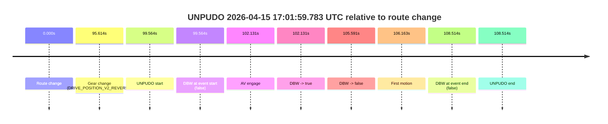
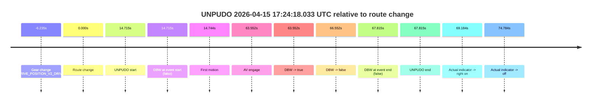

# Run Report: fme10003/2026-04-15--16-39-04--gen2-av-dc4a83c8-b9f1-4631-9221-86607051fb18

| Field | Value |
|---|---|
| Run ID | `fme10003/2026-04-15--16-39-04--gen2-av-dc4a83c8-b9f1-4631-9221-86607051fb18` |
| Date | `2026-04-15` |
| Model(s) | `armadillo-amethyst-squeaky` |
| Author | `guy.geva` |
| Event count | `2` |

## unpudo 2026-04-15 17:01:59.783 UTC

| Field | Value |
|---|---|
| Model | `armadillo-amethyst-squeaky` |
| Author | `guy.geva` |
| Run ID | `fme10003/2026-04-15--16-39-04--gen2-av-dc4a83c8-b9f1-4631-9221-86607051fb18` |
| Date | `2026-04-15` |
| Time (UTC) | `17:01:59.783` |
| Event type | `unpudo` |
| Disengagement type | `failed_to_unpudo` |
| Route change | `found` |
| Console | [run](https://console.sso.wayve.ai/run/fme10003/2026-04-15--16-39-04--gen2-av-dc4a83c8-b9f1-4631-9221-86607051fb18?id=&time-unixus=1776272519783305) |
| Foxglove | [segment](https://app.foxglove.dev/wayve-on-prem/p/prj_0dX18KZdVHg1fmmI/view?ds=foxglove-stream&ds.deviceName=fme10003&ds.start=2026-04-15T17%3A00%3A10.219101Z&ds.end=2026-04-15T17%3A02%3A18.733314Z&layoutId=lay_0e7VD4WIKDQGU73Y&time=2026-04-15T17%3A01%3A59.783305Z) |

### Event card: fail

- Fail: AV owns part of the segment, but the event still resolves as a model-performance failure under the AV-only scoring rule.

| Event | Time (UTC) | Delta from route change |
|---|---:|---:|
| Route change | 2026-04-15 17:00:20.219 | `0.000s` |
| Gear change (DRIVE_POSITION_V2_REVERSE) | 2026-04-15 17:01:55.833 | `95.614s` |
| UNPUDO start | 2026-04-15 17:01:59.783 | `99.564s` |
| DBW at event start (false) | 2026-04-15 17:01:59.783 | `99.564s` |
| AV engage | 2026-04-15 17:02:02.349 | `102.131s` |
| DBW -> true | 2026-04-15 17:02:02.349 | `102.131s` |
| DBW -> false | 2026-04-15 17:02:05.809 | `105.591s` |
| First motion | 2026-04-15 17:02:06.381 | `106.163s` |
| DBW at event end (false) | 2026-04-15 17:02:08.733 | `108.514s` |
| UNPUDO end | 2026-04-15 17:02:08.733 | `108.514s` |

| Metric | Value |
|---|---|
| Outcome | `fail` |
| Effective failure type | `failed_to_unpudo` |
| Route change status | `found` |
| DBW at event start | `false` |
| DBW at event end | `false` |
| Predicted gear at AV start | `DRIVE_POSITION_V2_DRIVE` |
| Actual gear at AV start | `DRIVE_POSITION_V2_DRIVE` |
| Predicted gear at event start | `DRIVE_POSITION_V2_REVERSE` |
| Actual gear at event start | `DRIVE_POSITION_V2_REVERSE` |
| Planned indicator direction | `INDICATORS_STATE_V2_OFF` |
| Controller indicator direction | `INDICATORS_STATE_V2_OFF` |
| Actual indicator direction | `INDICATORS_STATE_V2_OFF` |
| Actual indicator at maneuver end | `INDICATORS_STATE_V2_OFF` |
| Driver accel help in AV | `false` |
| Driver accel help timestamp | `n/a` |
| Max accel pedal pct in AV | `0.0%` |
| Max brake pedal pct in AV | `10.8%` |
| Max speed mps in AV | `0.000` |
| Success timing baseline | `route change` |
| Route -> AV | `102.131s` |
| AV -> event start | `-2.566s` |
| AV -> first motion | `4.032s` |
| Success baseline -> event start | `99.564s` |
| Success baseline -> first motion | `106.163s` |
| AV duration before disengagement | `3.460s` |
| Trajectory waypoint count | `37` |
| Driving-plan step count | `11` |

The scored portion starts from the AV-owned window, not from the pre-AV setup. Route-change search in the stopped pre-event segment was `found`, with the baseline therefore set to route change. At the event anchor the model predicts `DRIVE_POSITION_V2_REVERSE` and the actual gear is `DRIVE_POSITION_V2_REVERSE`. The effective model outcome is `fail` because `failed_to_unpudo`.

### Resolution

| Field | Value |
|---|---|
| Final outcome | `fail` |
| Do we agree with this label? | `yes` |
| Source disengagement type | `failed_to_unpudo` |
| Resolved effective failure type | `failed_to_unpudo` |
| Confidence | `high` |

## unpudo 2026-04-15 17:24:18.033 UTC

| Field | Value |
|---|---|
| Model | `armadillo-amethyst-squeaky` |
| Author | `guy.geva` |
| Run ID | `fme10003/2026-04-15--16-39-04--gen2-av-dc4a83c8-b9f1-4631-9221-86607051fb18` |
| Date | `2026-04-15` |
| Time (UTC) | `17:24:18.033` |
| Event type | `unpudo` |
| Disengagement type | `failed_to_unpudo` |
| Route change | `found` |
| Console | [run](https://console.sso.wayve.ai/run/fme10003/2026-04-15--16-39-04--gen2-av-dc4a83c8-b9f1-4631-9221-86607051fb18?id=&time-unixus=1776273858033315) |
| Foxglove | [segment](https://app.foxglove.dev/wayve-on-prem/p/prj_0dX18KZdVHg1fmmI/view?ds=foxglove-stream&ds.deviceName=fme10003&ds.start=2026-04-15T17%3A23%3A47.083290Z&ds.end=2026-04-15T17%3A25%3A21.133313Z&layoutId=lay_0e7VD4WIKDQGU73Y&time=2026-04-15T17%3A24%3A18.033315Z) |

### Event card: fail

- Fail: AV owns part of the segment, but the event still resolves as a model-performance failure under the AV-only scoring rule.

| Event | Time (UTC) | Delta from route change |
|---|---:|---:|
| Gear change (DRIVE_POSITION_V2_DRIVE) | 2026-04-15 17:23:57.083 | `-6.235s` |
| Route change | 2026-04-15 17:24:03.318 | `0.000s` |
| UNPUDO start | 2026-04-15 17:24:18.033 | `14.715s` |
| DBW at event start (false) | 2026-04-15 17:24:18.033 | `14.715s` |
| First motion | 2026-04-15 17:24:18.062 | `14.744s` |
| AV engage | 2026-04-15 17:25:06.869 | `63.552s` |
| DBW -> true | 2026-04-15 17:25:06.869 | `63.552s` |
| DBW -> false | 2026-04-15 17:25:09.869 | `66.552s` |
| DBW at event end (false) | 2026-04-15 17:25:11.133 | `67.815s` |
| UNPUDO end | 2026-04-15 17:25:11.133 | `67.815s` |
| Actual indicator -> right on | 2026-04-15 17:25:12.502 | `69.184s` |
| Actual indicator -> off | 2026-04-15 17:25:18.102 | `74.784s` |

| Metric | Value |
|---|---|
| Outcome | `fail` |
| Effective failure type | `failed_to_unpudo` |
| Route change status | `found` |
| DBW at event start | `false` |
| DBW at event end | `false` |
| Predicted gear at AV start | `DRIVE_POSITION_V2_DRIVE` |
| Actual gear at AV start | `DRIVE_POSITION_V2_DRIVE` |
| Predicted gear at event start | `DRIVE_POSITION_V2_DRIVE` |
| Actual gear at event start | `DRIVE_POSITION_V2_DRIVE` |
| Planned indicator direction | `INDICATORS_STATE_V2_OFF` |
| Controller indicator direction | `INDICATORS_STATE_V2_OFF` |
| Actual indicator direction | `INDICATORS_STATE_V2_OFF` |
| Actual indicator at maneuver end | `INDICATORS_STATE_V2_OFF` |
| Driver accel help in AV | `false` |
| Driver accel help timestamp | `n/a` |
| Max accel pedal pct in AV | `0.0%` |
| Max brake pedal pct in AV | `8.0%` |
| Max speed mps in AV | `0.000` |
| Success timing baseline | `route change` |
| Route -> AV | `63.552s` |
| AV -> event start | `-48.836s` |
| AV -> first motion | `-48.807s` |
| Success baseline -> event start | `14.715s` |
| Success baseline -> first motion | `14.744s` |
| AV duration before disengagement | `3.000s` |
| Trajectory waypoint count | `36` |
| Driving-plan step count | `11` |

The scored portion starts from the AV-owned window, not from the pre-AV setup. Route-change search in the stopped pre-event segment was `found`, with the baseline therefore set to route change. At the event anchor the model predicts `DRIVE_POSITION_V2_DRIVE` and the actual gear is `DRIVE_POSITION_V2_DRIVE`. The effective model outcome is `fail` because `failed_to_unpudo`.

### Resolution

| Field | Value |
|---|---|
| Final outcome | `fail` |
| Do we agree with this label? | `yes` |
| Source disengagement type | `failed_to_unpudo` |
| Resolved effective failure type | `failed_to_unpudo` |
| Confidence | `high` |
