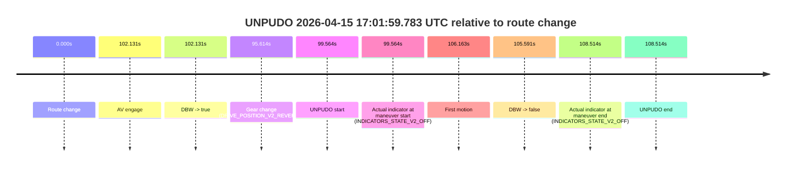
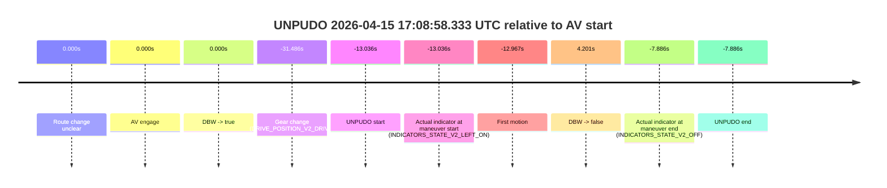
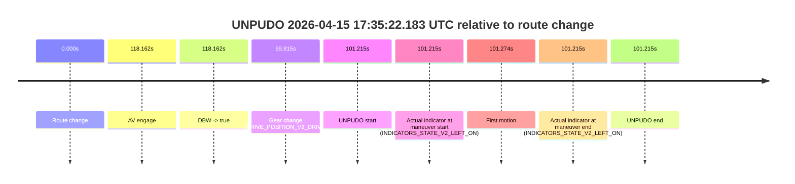

# Run Report: fme10003/2026-04-15--16-39-04--gen2-av-dc4a83c8-b9f1-4631-9221-86607051fb18

| Field | Value |
|---|---|
| Run ID | `fme10003/2026-04-15--16-39-04--gen2-av-dc4a83c8-b9f1-4631-9221-86607051fb18` |
| Date | `2026-04-15` |
| Model(s) | `armadillo-amethyst-squeaky` |
| Author | `guy.geva` |
| Event count | `5` |

## unpudo 2026-04-15 17:01:59.783 UTC

| Field | Value |
|---|---|
| Model | `armadillo-amethyst-squeaky` |
| Author | `guy.geva` |
| Run ID | `fme10003/2026-04-15--16-39-04--gen2-av-dc4a83c8-b9f1-4631-9221-86607051fb18` |
| Date | `2026-04-15` |
| Time (UTC) | `17:01:59.783` |
| Event type | `unpudo` |
| Disengagement type | `failed_to_unpudo` |
| Route change | `found` |
| Console | [run](https://console.sso.wayve.ai/run/fme10003/2026-04-15--16-39-04--gen2-av-dc4a83c8-b9f1-4631-9221-86607051fb18?id=&time-unixus=1776272519783305) |
| Foxglove | [segment](https://app.foxglove.dev/wayve-on-prem/p/prj_0dX18KZdVHg1fmmI/view?ds=foxglove-stream&ds.deviceName=fme10003&ds.start=2026-04-15T17%3A00%3A10.219101Z&ds.end=2026-04-15T17%3A02%3A18.733314Z&layoutId=lay_0e7VD4WIKDQGU73Y&time=2026-04-15T17%3A01%3A59.783305Z) |

### Event card: non-av

- Non-AV: the detected unpudo starts outside AV ownership, so it is kept for coverage but excluded from model success / failure scoring.

| Event | Time (UTC) | Delta from route change |
|---|---:|---:|
| Route change | 2026-04-15 17:00:20.219 | `0.000s` |
| AV engage | 2026-04-15 17:02:02.349 | `102.131s` |
| DBW -> true | 2026-04-15 17:02:02.349 | `102.131s` |
| Gear change (DRIVE_POSITION_V2_REVERSE) | 2026-04-15 17:01:55.833 | `95.614s` |
| UNPUDO start | 2026-04-15 17:01:59.783 | `99.564s` |
| Actual indicator at maneuver start (INDICATORS_STATE_V2_OFF) | 2026-04-15 17:01:59.783 | `99.564s` |
| First motion | 2026-04-15 17:02:06.381 | `106.163s` |
| DBW -> false | 2026-04-15 17:02:05.809 | `105.591s` |
| Actual indicator at maneuver end (INDICATORS_STATE_V2_OFF) | 2026-04-15 17:02:08.733 | `108.514s` |
| UNPUDO end | 2026-04-15 17:02:08.733 | `108.514s` |

| Metric | Value |
|---|---|
| Outcome | `non-av` |
| Effective failure type | `none` |
| Route change status | `found` |
| DBW at event start | `false` |
| DBW at event end | `false` |
| Predicted gear at AV start | `DRIVE_POSITION_V2_DRIVE` |
| Actual gear at AV start | `DRIVE_POSITION_V2_DRIVE` |
| Predicted gear at event start | `DRIVE_POSITION_V2_REVERSE` |
| Actual gear at event start | `DRIVE_POSITION_V2_REVERSE` |
| Planned indicator direction | `INDICATORS_STATE_V2_OFF` |
| Controller indicator direction | `INDICATORS_STATE_V2_OFF` |
| Actual indicator direction | `INDICATORS_STATE_V2_OFF` |
| Actual indicator at maneuver end | `INDICATORS_STATE_V2_OFF` |
| Driver accel help in AV | `false` |
| Driver accel help timestamp | `n/a` |
| Max accel pedal pct in AV | `0.0%` |
| Max brake pedal pct in AV | `10.8%` |
| Max speed mps in AV | `0.000` |
| Route -> AV | `102.131s` |
| AV -> event start | `-2.566s` |
| AV -> first motion | `4.032s` |
| AV duration before disengagement | `3.460s` |
| Trajectory waypoint count | `37` |
| Driving-plan step count | `11` |

The scored portion starts from the AV-owned window, not from the pre-AV setup. Route-change search in the stopped pre-event segment was `found`, with the baseline therefore set to route change. At the event anchor the model predicts `DRIVE_POSITION_V2_REVERSE` and the actual gear is `DRIVE_POSITION_V2_REVERSE`. The effective model outcome is `non-av` because `the event does not begin in AV ownership`.

### Resolution

| Field | Value |
|---|---|
| Final outcome | `non-av` |
| Do we agree with this label? | `yes` |
| Source disengagement type | `failed_to_unpudo` |
| Resolved effective failure type | `none` |
| Confidence | `high` |

## unpudo 2026-04-15 17:03:37.283 UTC

| Field | Value |
|---|---|
| Model | `armadillo-amethyst-squeaky` |
| Author | `guy.geva` |
| Run ID | `fme10003/2026-04-15--16-39-04--gen2-av-dc4a83c8-b9f1-4631-9221-86607051fb18` |
| Date | `2026-04-15` |
| Time (UTC) | `17:03:37.283` |
| Event type | `unpudo` |
| Disengagement type | `failed_to_unpudo` |
| Route change | `found` |
| Console | [run](https://console.sso.wayve.ai/run/fme10003/2026-04-15--16-39-04--gen2-av-dc4a83c8-b9f1-4631-9221-86607051fb18?id=&time-unixus=1776272617283301) |
| Foxglove | [segment](https://app.foxglove.dev/wayve-on-prem/p/prj_0dX18KZdVHg1fmmI/view?ds=foxglove-stream&ds.deviceName=fme10003&ds.start=2026-04-15T17%3A01%3A40.968223Z&ds.end=2026-04-15T17%3A04%3A58.029118Z&layoutId=lay_0e7VD4WIKDQGU73Y&time=2026-04-15T17%3A03%3A37.283301Z) |

### Event card: accidental

- Accidental: AV ownership is present for less than `2s`, so this is treated as an accidental brush with the maneuver rather than a meaningful model attempt.

| Event | Time (UTC) | Delta from route change |
|---|---:|---:|
| Route change | 2026-04-15 17:01:50.968 | `0.000s` |
| AV engage | 2026-04-15 17:03:46.369 | `115.401s` |
| DBW -> true | 2026-04-15 17:03:46.369 | `115.401s` |
| Gear change (DRIVE_POSITION_V2_DRIVE) | 2026-04-15 17:03:33.383 | `102.415s` |
| UNPUDO start | 2026-04-15 17:03:37.283 | `106.315s` |
| Actual indicator at maneuver start (INDICATORS_STATE_V2_OFF) | 2026-04-15 17:03:37.283 | `106.315s` |
| First motion | 2026-04-15 17:03:37.302 | `106.334s` |
| DBW -> false | 2026-04-15 17:04:48.029 | `177.061s` |
| Actual indicator at maneuver end (INDICATORS_STATE_V2_OFF) | 2026-04-15 17:03:40.333 | `109.365s` |
| UNPUDO end | 2026-04-15 17:03:40.333 | `109.365s` |

| Metric | Value |
|---|---|
| Outcome | `accidental` |
| Effective failure type | `none` |
| Route change status | `found` |
| DBW at event start | `false` |
| DBW at event end | `false` |
| Predicted gear at AV start | `DRIVE_POSITION_V2_DRIVE` |
| Actual gear at AV start | `DRIVE_POSITION_V2_DRIVE` |
| Predicted gear at event start | `DRIVE_POSITION_V2_DRIVE` |
| Actual gear at event start | `DRIVE_POSITION_V2_DRIVE` |
| Planned indicator direction | `INDICATORS_STATE_V2_LEFT_ON` |
| Controller indicator direction | `INDICATORS_STATE_V2_LEFT_ON` |
| Actual indicator direction | `INDICATORS_STATE_V2_OFF` |
| Actual indicator at maneuver end | `INDICATORS_STATE_V2_OFF` |
| Driver accel help in AV | `false` |
| Driver accel help timestamp | `n/a` |
| Max accel pedal pct in AV | `0.0%` |
| Max brake pedal pct in AV | `0.0%` |
| Max speed mps in AV | `0.000` |
| Route -> AV | `115.401s` |
| AV -> event start | `-9.086s` |
| AV -> first motion | `-9.067s` |
| AV duration before disengagement | `61.660s` |
| Trajectory waypoint count | `37` |
| Driving-plan step count | `11` |

The scored portion starts from the AV-owned window, not from the pre-AV setup. Route-change search in the stopped pre-event segment was `found`, with the baseline therefore set to route change. At the event anchor the model predicts `DRIVE_POSITION_V2_DRIVE` and the actual gear is `DRIVE_POSITION_V2_DRIVE`. The effective model outcome is `accidental` because `the AV-owned portion is shorter than 2s`.

### Resolution

| Field | Value |
|---|---|
| Final outcome | `accidental` |
| Do we agree with this label? | `yes` |
| Source disengagement type | `failed_to_unpudo` |
| Resolved effective failure type | `none` |
| Confidence | `high` |

## unpudo 2026-04-15 17:08:58.333 UTC

| Field | Value |
|---|---|
| Model | `armadillo-amethyst-squeaky` |
| Author | `guy.geva` |
| Run ID | `fme10003/2026-04-15--16-39-04--gen2-av-dc4a83c8-b9f1-4631-9221-86607051fb18` |
| Date | `2026-04-15` |
| Time (UTC) | `17:08:58.333` |
| Event type | `unpudo` |
| Disengagement type | `none observed` |
| Route change | `unclear` |
| Console | [run](https://console.sso.wayve.ai/run/fme10003/2026-04-15--16-39-04--gen2-av-dc4a83c8-b9f1-4631-9221-86607051fb18?id=&time-unixus=1776272938333313) |
| Foxglove | [segment](https://app.foxglove.dev/wayve-on-prem/p/prj_0dX18KZdVHg1fmmI/view?ds=foxglove-stream&ds.deviceName=fme10003&ds.start=2026-04-15T17%3A08%3A29.883313Z&ds.end=2026-04-15T17%3A09%3A25.570304Z&layoutId=lay_0e7VD4WIKDQGU73Y&time=2026-04-15T17%3A08%3A58.333313Z) |

### Event card: accidental

- Accidental: AV ownership is present for less than `2s`, so this is treated as an accidental brush with the maneuver rather than a meaningful model attempt.

| Event | Time (UTC) | Delta from AV start |
|---|---:|---:|
| Route change unclear | 2026-04-15 17:09:11.369 | `0.000s` |
| AV engage | 2026-04-15 17:09:11.369 | `0.000s` |
| DBW -> true | 2026-04-15 17:09:11.369 | `0.000s` |
| Gear change (DRIVE_POSITION_V2_DRIVE) | 2026-04-15 17:08:39.883 | `-31.486s` |
| UNPUDO start | 2026-04-15 17:08:58.333 | `-13.036s` |
| Actual indicator at maneuver start (INDICATORS_STATE_V2_LEFT_ON) | 2026-04-15 17:08:58.333 | `-13.036s` |
| First motion | 2026-04-15 17:08:58.402 | `-12.967s` |
| DBW -> false | 2026-04-15 17:09:15.570 | `4.201s` |
| Actual indicator at maneuver end (INDICATORS_STATE_V2_OFF) | 2026-04-15 17:09:03.483 | `-7.886s` |
| UNPUDO end | 2026-04-15 17:09:03.483 | `-7.886s` |

| Metric | Value |
|---|---|
| Outcome | `accidental` |
| Effective failure type | `none` |
| Route change status | `unclear` |
| DBW at event start | `false` |
| DBW at event end | `false` |
| Predicted gear at AV start | `DRIVE_POSITION_V2_DRIVE` |
| Actual gear at AV start | `DRIVE_POSITION_V2_DRIVE` |
| Predicted gear at event start | `DRIVE_POSITION_V2_DRIVE` |
| Actual gear at event start | `DRIVE_POSITION_V2_DRIVE` |
| Planned indicator direction | `INDICATORS_STATE_V2_LEFT_ON` |
| Controller indicator direction | `INDICATORS_STATE_V2_LEFT_ON` |
| Actual indicator direction | `INDICATORS_STATE_V2_LEFT_ON` |
| Actual indicator at maneuver end | `INDICATORS_STATE_V2_OFF` |
| Driver accel help in AV | `false` |
| Driver accel help timestamp | `n/a` |
| Max accel pedal pct in AV | `0.0%` |
| Max brake pedal pct in AV | `0.0%` |
| Max speed mps in AV | `0.000` |
| Route -> AV | `n/a` |
| AV -> event start | `-13.036s` |
| AV -> first motion | `-12.967s` |
| AV duration before disengagement | `4.201s` |
| Trajectory waypoint count | `36` |
| Driving-plan step count | `11` |

The scored portion starts from the AV-owned window, not from the pre-AV setup. Route-change search in the stopped pre-event segment was `unclear`, with the baseline therefore set to AV start. At the event anchor the model predicts `DRIVE_POSITION_V2_DRIVE` and the actual gear is `DRIVE_POSITION_V2_DRIVE`. The effective model outcome is `accidental` because `the AV-owned portion is shorter than 2s`.

### Resolution

| Field | Value |
|---|---|
| Final outcome | `accidental` |
| Do we agree with this label? | `yes` |
| Source disengagement type | `none observed` |
| Resolved effective failure type | `none` |
| Confidence | `medium` |

## unpudo 2026-04-15 17:24:18.033 UTC

| Field | Value |
|---|---|
| Model | `armadillo-amethyst-squeaky` |
| Author | `guy.geva` |
| Run ID | `fme10003/2026-04-15--16-39-04--gen2-av-dc4a83c8-b9f1-4631-9221-86607051fb18` |
| Date | `2026-04-15` |
| Time (UTC) | `17:24:18.033` |
| Event type | `unpudo` |
| Disengagement type | `failed_to_unpudo` |
| Route change | `found` |
| Console | [run](https://console.sso.wayve.ai/run/fme10003/2026-04-15--16-39-04--gen2-av-dc4a83c8-b9f1-4631-9221-86607051fb18?id=&time-unixus=1776273858033315) |
| Foxglove | [segment](https://app.foxglove.dev/wayve-on-prem/p/prj_0dX18KZdVHg1fmmI/view?ds=foxglove-stream&ds.deviceName=fme10003&ds.start=2026-04-15T17%3A23%3A47.083290Z&ds.end=2026-04-15T17%3A25%3A21.133313Z&layoutId=lay_0e7VD4WIKDQGU73Y&time=2026-04-15T17%3A24%3A18.033315Z) |

### Event card: non-av

- Non-AV: the detected unpudo starts outside AV ownership, so it is kept for coverage but excluded from model success / failure scoring.

| Event | Time (UTC) | Delta from route change |
|---|---:|---:|
| Route change | 2026-04-15 17:24:03.318 | `0.000s` |
| AV engage | 2026-04-15 17:25:06.869 | `63.552s` |
| DBW -> true | 2026-04-15 17:25:06.869 | `63.552s` |
| Gear change (DRIVE_POSITION_V2_DRIVE) | 2026-04-15 17:23:57.083 | `-6.235s` |
| UNPUDO start | 2026-04-15 17:24:18.033 | `14.715s` |
| Actual indicator at maneuver start (INDICATORS_STATE_V2_OFF) | 2026-04-15 17:24:18.033 | `14.715s` |
| First motion | 2026-04-15 17:24:18.062 | `14.744s` |
| DBW -> false | 2026-04-15 17:25:09.869 | `66.552s` |
| Actual indicator at maneuver end (INDICATORS_STATE_V2_OFF) | 2026-04-15 17:25:11.133 | `67.815s` |
| UNPUDO end | 2026-04-15 17:25:11.133 | `67.815s` |

| Metric | Value |
|---|---|
| Outcome | `non-av` |
| Effective failure type | `none` |
| Route change status | `found` |
| DBW at event start | `false` |
| DBW at event end | `false` |
| Predicted gear at AV start | `DRIVE_POSITION_V2_DRIVE` |
| Actual gear at AV start | `DRIVE_POSITION_V2_DRIVE` |
| Predicted gear at event start | `DRIVE_POSITION_V2_DRIVE` |
| Actual gear at event start | `DRIVE_POSITION_V2_DRIVE` |
| Planned indicator direction | `INDICATORS_STATE_V2_OFF` |
| Controller indicator direction | `INDICATORS_STATE_V2_OFF` |
| Actual indicator direction | `INDICATORS_STATE_V2_OFF` |
| Actual indicator at maneuver end | `INDICATORS_STATE_V2_OFF` |
| Driver accel help in AV | `false` |
| Driver accel help timestamp | `n/a` |
| Max accel pedal pct in AV | `0.0%` |
| Max brake pedal pct in AV | `8.0%` |
| Max speed mps in AV | `0.000` |
| Route -> AV | `63.552s` |
| AV -> event start | `-48.836s` |
| AV -> first motion | `-48.807s` |
| AV duration before disengagement | `3.000s` |
| Trajectory waypoint count | `36` |
| Driving-plan step count | `11` |

The scored portion starts from the AV-owned window, not from the pre-AV setup. Route-change search in the stopped pre-event segment was `found`, with the baseline therefore set to route change. At the event anchor the model predicts `DRIVE_POSITION_V2_DRIVE` and the actual gear is `DRIVE_POSITION_V2_DRIVE`. The effective model outcome is `non-av` because `the event does not begin in AV ownership`.

### Resolution

| Field | Value |
|---|---|
| Final outcome | `non-av` |
| Do we agree with this label? | `yes` |
| Source disengagement type | `failed_to_unpudo` |
| Resolved effective failure type | `none` |
| Confidence | `high` |

## unpudo 2026-04-15 17:35:22.183 UTC

| Field | Value |
|---|---|
| Model | `armadillo-amethyst-squeaky` |
| Author | `guy.geva` |
| Run ID | `fme10003/2026-04-15--16-39-04--gen2-av-dc4a83c8-b9f1-4631-9221-86607051fb18` |
| Date | `2026-04-15` |
| Time (UTC) | `17:35:22.183` |
| Event type | `unpudo` |
| Disengagement type | `none observed` |
| Route change | `found` |
| Console | [run](https://console.sso.wayve.ai/run/fme10003/2026-04-15--16-39-04--gen2-av-dc4a83c8-b9f1-4631-9221-86607051fb18?id=&time-unixus=1776274522183308) |
| Foxglove | [segment](https://app.foxglove.dev/wayve-on-prem/p/prj_0dX18KZdVHg1fmmI/view?ds=foxglove-stream&ds.deviceName=fme10003&ds.start=2026-04-15T17%3A33%3A30.968285Z&ds.end=2026-04-15T17%3A35%3A32.183308Z&layoutId=lay_0e7VD4WIKDQGU73Y&time=2026-04-15T17%3A35%3A22.183308Z) |

### Event card: accidental

- Accidental: AV ownership is present for less than `2s`, so this is treated as an accidental brush with the maneuver rather than a meaningful model attempt.

| Event | Time (UTC) | Delta from route change |
|---|---:|---:|
| Route change | 2026-04-15 17:33:40.968 | `0.000s` |
| AV engage | 2026-04-15 17:35:39.130 | `118.162s` |
| DBW -> true | 2026-04-15 17:35:39.130 | `118.162s` |
| Gear change (DRIVE_POSITION_V2_DRIVE) | 2026-04-15 17:35:20.783 | `99.815s` |
| UNPUDO start | 2026-04-15 17:35:22.183 | `101.215s` |
| Actual indicator at maneuver start (INDICATORS_STATE_V2_LEFT_ON) | 2026-04-15 17:35:22.183 | `101.215s` |
| First motion | 2026-04-15 17:35:22.241 | `101.274s` |
| Actual indicator at maneuver end (INDICATORS_STATE_V2_LEFT_ON) | 2026-04-15 17:35:22.183 | `101.215s` |
| UNPUDO end | 2026-04-15 17:35:22.183 | `101.215s` |

| Metric | Value |
|---|---|
| Outcome | `accidental` |
| Effective failure type | `none` |
| Route change status | `found` |
| DBW at event start | `false` |
| DBW at event end | `false` |
| Predicted gear at AV start | `DRIVE_POSITION_V2_DRIVE` |
| Actual gear at AV start | `DRIVE_POSITION_V2_DRIVE` |
| Predicted gear at event start | `DRIVE_POSITION_V2_DRIVE` |
| Actual gear at event start | `DRIVE_POSITION_V2_DRIVE` |
| Planned indicator direction | `INDICATORS_STATE_V2_LEFT_ON` |
| Controller indicator direction | `INDICATORS_STATE_V2_LEFT_ON` |
| Actual indicator direction | `INDICATORS_STATE_V2_LEFT_ON` |
| Actual indicator at maneuver end | `INDICATORS_STATE_V2_LEFT_ON` |
| Driver accel help in AV | `false` |
| Driver accel help timestamp | `n/a` |
| Max accel pedal pct in AV | `0.0%` |
| Max brake pedal pct in AV | `0.0%` |
| Max speed mps in AV | `0.000` |
| Route -> AV | `118.162s` |
| AV -> event start | `-16.947s` |
| AV -> first motion | `-16.888s` |
| AV duration before disengagement | `n/a` |
| Trajectory waypoint count | `37` |
| Driving-plan step count | `11` |

The scored portion starts from the AV-owned window, not from the pre-AV setup. Route-change search in the stopped pre-event segment was `found`, with the baseline therefore set to route change. At the event anchor the model predicts `DRIVE_POSITION_V2_DRIVE` and the actual gear is `DRIVE_POSITION_V2_DRIVE`. The effective model outcome is `accidental` because `the AV-owned portion is shorter than 2s`.

### Resolution

| Field | Value |
|---|---|
| Final outcome | `accidental` |
| Do we agree with this label? | `yes` |
| Source disengagement type | `none observed` |
| Resolved effective failure type | `none` |
| Confidence | `high` |
