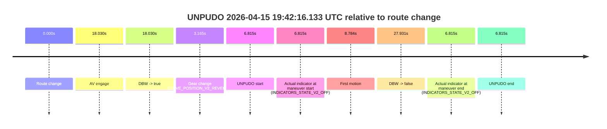
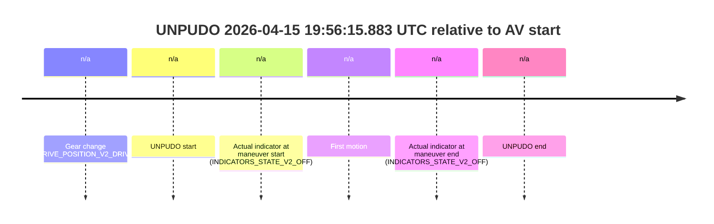
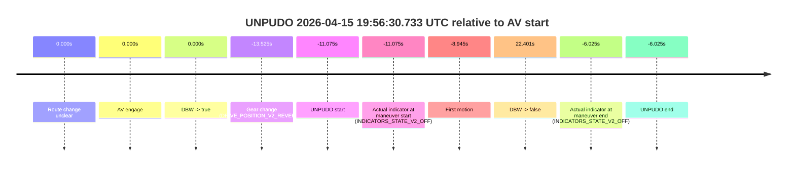
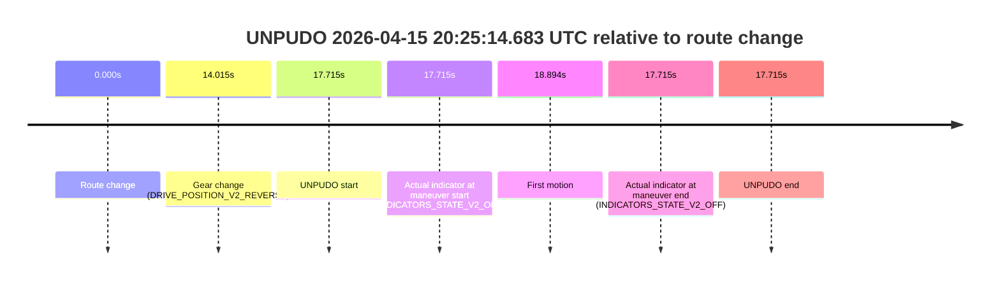

# Run Report: fme10003/2026-04-15--19-34-16--gen2-av-8481d26e-3425-477f-b61e-96afaf1a62b6

| Field | Value |
|---|---|
| Run ID | `fme10003/2026-04-15--19-34-16--gen2-av-8481d26e-3425-477f-b61e-96afaf1a62b6` |
| Date | `2026-04-15` |
| Model(s) | `apricot-crocodile-uproarious` |
| Author | `guy.geva` |
| Event count | `4` |

## unpudo 2026-04-15 19:42:16.133 UTC

| Field | Value |
|---|---|
| Model | `apricot-crocodile-uproarious` |
| Author | `guy.geva` |
| Run ID | `fme10003/2026-04-15--19-34-16--gen2-av-8481d26e-3425-477f-b61e-96afaf1a62b6` |
| Date | `2026-04-15` |
| Time (UTC) | `19:42:16.133` |
| Event type | `unpudo` |
| Disengagement type | `failed_to_unpudo` |
| Route change | `found` |
| Console | [run](https://console.sso.wayve.ai/run/fme10003/2026-04-15--19-34-16--gen2-av-8481d26e-3425-477f-b61e-96afaf1a62b6?id=&time-unixus=1776282136133310) |
| Foxglove | [segment](https://app.foxglove.dev/wayve-on-prem/p/prj_0dX18KZdVHg1fmmI/view?ds=foxglove-stream&ds.deviceName=fme10003&ds.start=2026-04-15T19%3A41%3A59.318279Z&ds.end=2026-04-15T19%3A42%3A47.249145Z&layoutId=lay_0e7VD4WIKDQGU73Y&time=2026-04-15T19%3A42%3A16.133310Z) |

### Event card: fail

- Fail: AV owns part of the segment, but the event still resolves as a model-performance failure under the AV-only scoring rule.

| Event | Time (UTC) | Delta from route change |
|---|---:|---:|
| Route change | 2026-04-15 19:42:09.318 | `0.000s` |
| AV engage | 2026-04-15 19:42:27.347 | `18.030s` |
| DBW -> true | 2026-04-15 19:42:27.347 | `18.030s` |
| Gear change (DRIVE_POSITION_V2_REVERSE) | 2026-04-15 19:42:12.483 | `3.165s` |
| UNPUDO start | 2026-04-15 19:42:16.133 | `6.815s` |
| Actual indicator at maneuver start (INDICATORS_STATE_V2_OFF) | 2026-04-15 19:42:16.133 | `6.815s` |
| First motion | 2026-04-15 19:42:18.102 | `8.784s` |
| DBW -> false | 2026-04-15 19:42:37.249 | `27.931s` |
| Actual indicator at maneuver end (INDICATORS_STATE_V2_OFF) | 2026-04-15 19:42:16.133 | `6.815s` |
| UNPUDO end | 2026-04-15 19:42:16.133 | `6.815s` |

| Metric | Value |
|---|---|
| Outcome | `fail` |
| Effective failure type | `failed_to_unpudo` |
| Route change status | `found` |
| DBW at event start | `false` |
| DBW at event end | `false` |
| Predicted gear at AV start | `DRIVE_POSITION_V2_DRIVE` |
| Actual gear at AV start | `DRIVE_POSITION_V2_DRIVE` |
| Predicted gear at event start | `DRIVE_POSITION_V2_REVERSE` |
| Actual gear at event start | `DRIVE_POSITION_V2_REVERSE` |
| Planned indicator direction | `INDICATORS_STATE_V2_OFF` |
| Controller indicator direction | `INDICATORS_STATE_V2_OFF` |
| Actual indicator direction | `INDICATORS_STATE_V2_OFF` |
| Actual indicator at maneuver end | `INDICATORS_STATE_V2_OFF` |
| Driver accel help in AV | `false` |
| Driver accel help timestamp | `n/a` |
| Max accel pedal pct in AV | `0.0%` |
| Max brake pedal pct in AV | `0.0%` |
| Max speed mps in AV | `0.000` |
| Route -> AV | `18.030s` |
| AV -> event start | `-11.215s` |
| AV -> first motion | `-9.246s` |
| AV duration before disengagement | `9.901s` |
| Trajectory waypoint count | `36` |
| Driving-plan step count | `11` |

The scored portion starts from the AV-owned window, not from the pre-AV setup. Route-change search in the stopped pre-event segment was `found`, with the baseline therefore set to route change. At the event anchor the model predicts `DRIVE_POSITION_V2_REVERSE` and the actual gear is `DRIVE_POSITION_V2_REVERSE`. The effective model outcome is `fail` because `failed_to_unpudo`.

### Resolution

| Field | Value |
|---|---|
| Final outcome | `fail` |
| Do we agree with this label? | `yes` |
| Source disengagement type | `failed_to_unpudo` |
| Resolved effective failure type | `failed_to_unpudo` |
| Confidence | `high` |

## unpudo 2026-04-15 19:56:15.883 UTC

| Field | Value |
|---|---|
| Model | `apricot-crocodile-uproarious` |
| Author | `guy.geva` |
| Run ID | `fme10003/2026-04-15--19-34-16--gen2-av-8481d26e-3425-477f-b61e-96afaf1a62b6` |
| Date | `2026-04-15` |
| Time (UTC) | `19:56:15.883` |
| Event type | `unpudo` |
| Disengagement type | `failed_to_unpudo` |
| Route change | `unclear` |
| Console | [run](https://console.sso.wayve.ai/run/fme10003/2026-04-15--19-34-16--gen2-av-8481d26e-3425-477f-b61e-96afaf1a62b6?id=&time-unixus=1776282975883311) |
| Foxglove | [segment](https://app.foxglove.dev/wayve-on-prem/p/prj_0dX18KZdVHg1fmmI/view?ds=foxglove-stream&ds.deviceName=fme10003&ds.start=2026-04-15T19%3A56%3A04.733317Z&ds.end=2026-04-15T19%3A56%3A29.533298Z&layoutId=lay_0e7VD4WIKDQGU73Y&time=2026-04-15T19%3A56%3A15.883311Z) |

### Event card: fail

- Fail: AV owns part of the segment, but the event still resolves as a model-performance failure under the AV-only scoring rule.

| Event | Time (UTC) | Delta from AV start |
|---|---:|---:|
| Gear change (DRIVE_POSITION_V2_DRIVE) | 2026-04-15 19:56:14.733 | `n/a` |
| UNPUDO start | 2026-04-15 19:56:15.883 | `n/a` |
| Actual indicator at maneuver start (INDICATORS_STATE_V2_OFF) | 2026-04-15 19:56:15.883 | `n/a` |
| First motion | 2026-04-15 19:56:15.921 | `n/a` |
| Actual indicator at maneuver end (INDICATORS_STATE_V2_OFF) | 2026-04-15 19:56:19.533 | `n/a` |
| UNPUDO end | 2026-04-15 19:56:19.533 | `n/a` |

| Metric | Value |
|---|---|
| Outcome | `fail` |
| Effective failure type | `failed_to_unpudo` |
| Route change status | `unclear` |
| DBW at event start | `false` |
| DBW at event end | `false` |
| Predicted gear at AV start | `n/a` |
| Actual gear at AV start | `n/a` |
| Predicted gear at event start | `DRIVE_POSITION_V2_PARK` |
| Actual gear at event start | `DRIVE_POSITION_V2_DRIVE` |
| Planned indicator direction | `INDICATORS_STATE_V2_OFF` |
| Controller indicator direction | `INDICATORS_STATE_V2_OFF` |
| Actual indicator direction | `INDICATORS_STATE_V2_OFF` |
| Actual indicator at maneuver end | `INDICATORS_STATE_V2_OFF` |
| Driver accel help in AV | `false` |
| Driver accel help timestamp | `n/a` |
| Max accel pedal pct in AV | `0.0%` |
| Max brake pedal pct in AV | `0.0%` |
| Max speed mps in AV | `0.000` |
| Route -> AV | `n/a` |
| AV -> event start | `n/a` |
| AV -> first motion | `n/a` |
| AV duration before disengagement | `n/a` |
| Trajectory waypoint count | `36` |
| Driving-plan step count | `11` |

The scored portion starts from the AV-owned window, not from the pre-AV setup. Route-change search in the stopped pre-event segment was `unclear`, with the baseline therefore set to AV start. At the event anchor the model predicts `DRIVE_POSITION_V2_PARK` and the actual gear is `DRIVE_POSITION_V2_DRIVE`. The effective model outcome is `fail` because `failed_to_unpudo`.

### Resolution

| Field | Value |
|---|---|
| Final outcome | `fail` |
| Do we agree with this label? | `yes` |
| Source disengagement type | `failed_to_unpudo` |
| Resolved effective failure type | `failed_to_unpudo` |
| Confidence | `medium` |

## unpudo 2026-04-15 19:56:30.733 UTC

| Field | Value |
|---|---|
| Model | `apricot-crocodile-uproarious` |
| Author | `guy.geva` |
| Run ID | `fme10003/2026-04-15--19-34-16--gen2-av-8481d26e-3425-477f-b61e-96afaf1a62b6` |
| Date | `2026-04-15` |
| Time (UTC) | `19:56:30.733` |
| Event type | `unpudo` |
| Disengagement type | `none observed` |
| Route change | `unclear` |
| Console | [run](https://console.sso.wayve.ai/run/fme10003/2026-04-15--19-34-16--gen2-av-8481d26e-3425-477f-b61e-96afaf1a62b6?id=&time-unixus=1776282990733317) |
| Foxglove | [segment](https://app.foxglove.dev/wayve-on-prem/p/prj_0dX18KZdVHg1fmmI/view?ds=foxglove-stream&ds.deviceName=fme10003&ds.start=2026-04-15T19%3A56%3A18.283305Z&ds.end=2026-04-15T19%3A57%3A14.208853Z&layoutId=lay_0e7VD4WIKDQGU73Y&time=2026-04-15T19%3A56%3A30.733317Z) |

### Event card: fail

- Fail: the credited unpudo does not stay AV-owned. The event window starts with DBW false, and the maneuver outcome lands outside a clean AV-owned segment.

| Event | Time (UTC) | Delta from AV start |
|---|---:|---:|
| Route change unclear | 2026-04-15 19:56:41.808 | `0.000s` |
| AV engage | 2026-04-15 19:56:41.808 | `0.000s` |
| DBW -> true | 2026-04-15 19:56:41.808 | `0.000s` |
| Gear change (DRIVE_POSITION_V2_REVERSE) | 2026-04-15 19:56:28.283 | `-13.525s` |
| UNPUDO start | 2026-04-15 19:56:30.733 | `-11.075s` |
| Actual indicator at maneuver start (INDICATORS_STATE_V2_OFF) | 2026-04-15 19:56:30.733 | `-11.075s` |
| First motion | 2026-04-15 19:56:32.862 | `-8.945s` |
| DBW -> false | 2026-04-15 19:57:04.208 | `22.401s` |
| Actual indicator at maneuver end (INDICATORS_STATE_V2_OFF) | 2026-04-15 19:56:35.783 | `-6.025s` |
| UNPUDO end | 2026-04-15 19:56:35.783 | `-6.025s` |

| Metric | Value |
|---|---|
| Outcome | `fail` |
| Effective failure type | `completed_outside_av` |
| Route change status | `unclear` |
| DBW at event start | `false` |
| DBW at event end | `false` |
| Predicted gear at AV start | `DRIVE_POSITION_V2_DRIVE` |
| Actual gear at AV start | `DRIVE_POSITION_V2_DRIVE` |
| Predicted gear at event start | `DRIVE_POSITION_V2_REVERSE` |
| Actual gear at event start | `DRIVE_POSITION_V2_REVERSE` |
| Planned indicator direction | `INDICATORS_STATE_V2_OFF` |
| Controller indicator direction | `INDICATORS_STATE_V2_OFF` |
| Actual indicator direction | `INDICATORS_STATE_V2_OFF` |
| Actual indicator at maneuver end | `INDICATORS_STATE_V2_OFF` |
| Driver accel help in AV | `false` |
| Driver accel help timestamp | `n/a` |
| Max accel pedal pct in AV | `0.0%` |
| Max brake pedal pct in AV | `0.0%` |
| Max speed mps in AV | `0.000` |
| Route -> AV | `n/a` |
| AV -> event start | `-11.075s` |
| AV -> first motion | `-8.945s` |
| AV duration before disengagement | `22.401s` |
| Trajectory waypoint count | `36` |
| Driving-plan step count | `11` |

The scored portion starts from the AV-owned window, not from the pre-AV setup. Route-change search in the stopped pre-event segment was `unclear`, with the baseline therefore set to AV start. At the event anchor the model predicts `DRIVE_POSITION_V2_REVERSE` and the actual gear is `DRIVE_POSITION_V2_REVERSE`. The effective model outcome is `fail` because `completed_outside_av`.

### Resolution

| Field | Value |
|---|---|
| Final outcome | `fail` |
| Do we agree with this label? | `yes` |
| Source disengagement type | `none observed` |
| Resolved effective failure type | `completed_outside_av` |
| Confidence | `medium` |

## unpudo 2026-04-15 20:25:14.683 UTC

| Field | Value |
|---|---|
| Model | `apricot-crocodile-uproarious` |
| Author | `guy.geva` |
| Run ID | `fme10003/2026-04-15--19-34-16--gen2-av-8481d26e-3425-477f-b61e-96afaf1a62b6` |
| Date | `2026-04-15` |
| Time (UTC) | `20:25:14.683` |
| Event type | `unpudo` |
| Disengagement type | `none observed` |
| Route change | `found` |
| Console | [run](https://console.sso.wayve.ai/run/fme10003/2026-04-15--19-34-16--gen2-av-8481d26e-3425-477f-b61e-96afaf1a62b6?id=&time-unixus=1776284714683312) |
| Foxglove | [segment](https://app.foxglove.dev/wayve-on-prem/p/prj_0dX18KZdVHg1fmmI/view?ds=foxglove-stream&ds.deviceName=fme10003&ds.start=2026-04-15T20%3A24%3A46.968273Z&ds.end=2026-04-15T20%3A25%3A24.683312Z&layoutId=lay_0e7VD4WIKDQGU73Y&time=2026-04-15T20%3A25%3A14.683312Z) |

### Event card: fail

- Fail: the credited unpudo does not stay AV-owned. The event window starts with DBW false, and the maneuver outcome lands outside a clean AV-owned segment.

| Event | Time (UTC) | Delta from route change |
|---|---:|---:|
| Route change | 2026-04-15 20:24:56.968 | `0.000s` |
| Gear change (DRIVE_POSITION_V2_REVERSE) | 2026-04-15 20:25:10.983 | `14.015s` |
| UNPUDO start | 2026-04-15 20:25:14.683 | `17.715s` |
| Actual indicator at maneuver start (INDICATORS_STATE_V2_OFF) | 2026-04-15 20:25:14.683 | `17.715s` |
| First motion | 2026-04-15 20:25:15.862 | `18.894s` |
| Actual indicator at maneuver end (INDICATORS_STATE_V2_OFF) | 2026-04-15 20:25:14.683 | `17.715s` |
| UNPUDO end | 2026-04-15 20:25:14.683 | `17.715s` |

| Metric | Value |
|---|---|
| Outcome | `fail` |
| Effective failure type | `not_av_owned` |
| Route change status | `found` |
| DBW at event start | `false` |
| DBW at event end | `false` |
| Predicted gear at AV start | `n/a` |
| Actual gear at AV start | `n/a` |
| Predicted gear at event start | `DRIVE_POSITION_V2_REVERSE` |
| Actual gear at event start | `DRIVE_POSITION_V2_REVERSE` |
| Planned indicator direction | `INDICATORS_STATE_V2_OFF` |
| Controller indicator direction | `INDICATORS_STATE_V2_OFF` |
| Actual indicator direction | `INDICATORS_STATE_V2_OFF` |
| Actual indicator at maneuver end | `INDICATORS_STATE_V2_OFF` |
| Driver accel help in AV | `false` |
| Driver accel help timestamp | `n/a` |
| Max accel pedal pct in AV | `0.0%` |
| Max brake pedal pct in AV | `0.0%` |
| Max speed mps in AV | `0.000` |
| Route -> AV | `n/a` |
| AV -> event start | `n/a` |
| AV -> first motion | `n/a` |
| AV duration before disengagement | `n/a` |
| Trajectory waypoint count | `37` |
| Driving-plan step count | `11` |

The scored portion starts from the AV-owned window, not from the pre-AV setup. Route-change search in the stopped pre-event segment was `found`, with the baseline therefore set to route change. At the event anchor the model predicts `DRIVE_POSITION_V2_REVERSE` and the actual gear is `DRIVE_POSITION_V2_REVERSE`. The effective model outcome is `fail` because `not_av_owned`.

### Resolution

| Field | Value |
|---|---|
| Final outcome | `fail` |
| Do we agree with this label? | `yes` |
| Source disengagement type | `none observed` |
| Resolved effective failure type | `not_av_owned` |
| Confidence | `high` |
