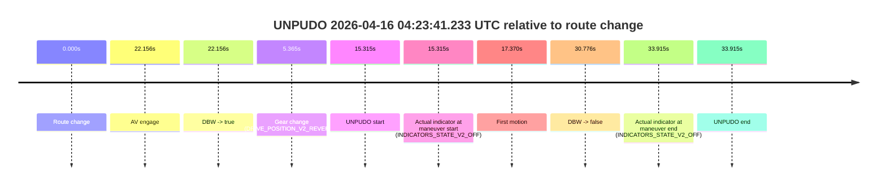
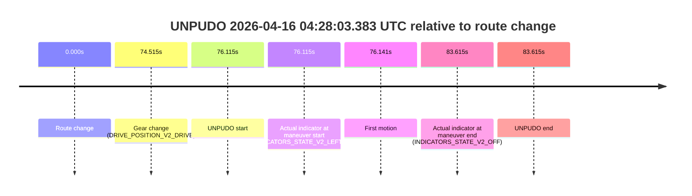

# Run Report: fme10003/2026-04-16--03-45-16--gen2-av-75e32f72-33ff-4f6f-b277-7087ddb4e567

| Field | Value |
|---|---|
| Run ID | `fme10003/2026-04-16--03-45-16--gen2-av-75e32f72-33ff-4f6f-b277-7087ddb4e567` |
| Date | `2026-04-16` |
| Model(s) | `armadillo-amethyst-squeaky` |
| Author | `guy.geva` |
| Event count | `5` |

## unpudo 2026-04-16 04:00:24.533 UTC

| Field | Value |
|---|---|
| Model | `armadillo-amethyst-squeaky` |
| Author | `guy.geva` |
| Run ID | `fme10003/2026-04-16--03-45-16--gen2-av-75e32f72-33ff-4f6f-b277-7087ddb4e567` |
| Date | `2026-04-16` |
| Time (UTC) | `04:00:24.533` |
| Event type | `unpudo` |
| Disengagement type | `failed_to_unpudo` |
| Route change | `found` |
| Console | [run](https://console.sso.wayve.ai/run/fme10003/2026-04-16--03-45-16--gen2-av-75e32f72-33ff-4f6f-b277-7087ddb4e567?id=&time-unixus=1776312024533305) |
| Foxglove | [segment](https://app.foxglove.dev/wayve-on-prem/p/prj_0dX18KZdVHg1fmmI/view?ds=foxglove-stream&ds.deviceName=fme10003&ds.start=2026-04-16T04%3A00%3A02.483303Z&ds.end=2026-04-16T04%3A01%3A01.674419Z&layoutId=lay_0e7VD4WIKDQGU73Y&time=2026-04-16T04%3A00%3A24.533305Z) |

### Event card: non-av

- Non-AV: there is no AV-owned portion anywhere inside the detected unpudo timeline, so it is kept for coverage but excluded from model success / failure scoring.

| Event | Time (UTC) | Delta from route change |
|---|---:|---:|
| Route change | 2026-04-16 04:00:18.468 | `0.000s` |
| AV engage | 2026-04-16 04:00:34.354 | `15.886s` |
| DBW -> true | 2026-04-16 04:00:34.354 | `15.886s` |
| Gear change (DRIVE_POSITION_V2_DRIVE) | 2026-04-16 04:00:12.483 | `-5.985s` |
| UNPUDO start | 2026-04-16 04:00:24.533 | `6.065s` |
| Actual indicator at maneuver start (INDICATORS_STATE_V2_OFF) | 2026-04-16 04:00:24.533 | `6.065s` |
| First motion | 2026-04-16 04:00:24.568 | `6.100s` |
| DBW -> false | 2026-04-16 04:00:51.674 | `33.206s` |
| Actual indicator at maneuver end (INDICATORS_STATE_V2_OFF) | 2026-04-16 04:00:27.933 | `9.465s` |
| UNPUDO end | 2026-04-16 04:00:27.933 | `9.465s` |

| Metric | Value |
|---|---|
| Outcome | `non-av` |
| Effective failure type | `none` |
| Route change status | `found` |
| DBW at event start | `false` |
| DBW at event end | `false` |
| Predicted gear at AV start | `DRIVE_POSITION_V2_DRIVE` |
| Actual gear at AV start | `DRIVE_POSITION_V2_DRIVE` |
| Predicted gear at event start | `DRIVE_POSITION_V2_DRIVE` |
| Actual gear at event start | `DRIVE_POSITION_V2_DRIVE` |
| Planned indicator direction | `INDICATORS_STATE_V2_LEFT_ON` |
| Controller indicator direction | `INDICATORS_STATE_V2_LEFT_ON` |
| Actual indicator direction | `INDICATORS_STATE_V2_OFF` |
| Actual indicator at maneuver end | `INDICATORS_STATE_V2_OFF` |
| Driver accel help in AV | `false` |
| Driver accel help timestamp | `n/a` |
| Max accel pedal pct in AV | `0.0%` |
| Max brake pedal pct in AV | `0.0%` |
| Max speed mps in AV | `0.000` |
| Route -> AV | `15.886s` |
| AV -> event start | `-9.821s` |
| AV -> first motion | `-9.786s` |
| AV duration before disengagement | `17.320s` |
| Trajectory waypoint count | `36` |
| Driving-plan step count | `11` |

The scored portion starts from the AV-owned window, not from the pre-AV setup. Route-change search in the stopped pre-event segment was `found`, with the baseline therefore set to route change. At the event anchor the model predicts `DRIVE_POSITION_V2_DRIVE` and the actual gear is `DRIVE_POSITION_V2_DRIVE`. The effective model outcome is `non-av` because `there is no AV-owned overlap inside the event timeline`.

### Resolution

| Field | Value |
|---|---|
| Final outcome | `non-av` |
| Do we agree with this label? | `yes` |
| Source disengagement type | `failed_to_unpudo` |
| Resolved effective failure type | `none` |
| Confidence | `high` |

## unpudo 2026-04-16 04:02:22.083 UTC

| Field | Value |
|---|---|
| Model | `armadillo-amethyst-squeaky` |
| Author | `guy.geva` |
| Run ID | `fme10003/2026-04-16--03-45-16--gen2-av-75e32f72-33ff-4f6f-b277-7087ddb4e567` |
| Date | `2026-04-16` |
| Time (UTC) | `04:02:22.083` |
| Event type | `unpudo` |
| Disengagement type | `failed_to_unpudo` |
| Route change | `found` |
| Console | [run](https://console.sso.wayve.ai/run/fme10003/2026-04-16--03-45-16--gen2-av-75e32f72-33ff-4f6f-b277-7087ddb4e567?id=&time-unixus=1776312142083313) |
| Foxglove | [segment](https://app.foxglove.dev/wayve-on-prem/p/prj_0dX18KZdVHg1fmmI/view?ds=foxglove-stream&ds.deviceName=fme10003&ds.start=2026-04-16T04%3A01%3A46.718266Z&ds.end=2026-04-16T04%3A02%3A35.483298Z&layoutId=lay_0e7VD4WIKDQGU73Y&time=2026-04-16T04%3A02%3A22.083313Z) |

### Event card: accidental

- Accidental: AV ownership is present for less than `2s`, so this is treated as an accidental brush with the maneuver rather than a meaningful model attempt.

| Event | Time (UTC) | Delta from route change |
|---|---:|---:|
| Route change | 2026-04-16 04:01:56.718 | `0.000s` |
| AV engage | 2026-04-16 04:02:17.714 | `20.996s` |
| DBW -> true | 2026-04-16 04:02:17.714 | `20.996s` |
| Gear change (DRIVE_POSITION_V2_DRIVE) | 2026-04-16 04:02:18.183 | `21.465s` |
| UNPUDO start | 2026-04-16 04:02:22.083 | `25.365s` |
| Actual indicator at maneuver start (INDICATORS_STATE_V2_OFF) | 2026-04-16 04:02:22.083 | `25.365s` |
| First motion | 2026-04-16 04:02:22.108 | `25.390s` |
| DBW -> false | 2026-04-16 04:02:22.114 | `25.396s` |
| Actual indicator at maneuver end (INDICATORS_STATE_V2_OFF) | 2026-04-16 04:02:25.483 | `28.765s` |
| UNPUDO end | 2026-04-16 04:02:25.483 | `28.765s` |

| Metric | Value |
|---|---|
| Outcome | `accidental` |
| Effective failure type | `none` |
| Route change status | `found` |
| DBW at event start | `true` |
| DBW at event end | `false` |
| Predicted gear at AV start | `DRIVE_POSITION_V2_DRIVE` |
| Actual gear at AV start | `DRIVE_POSITION_V2_PARK` |
| Predicted gear at event start | `DRIVE_POSITION_V2_DRIVE` |
| Actual gear at event start | `DRIVE_POSITION_V2_DRIVE` |
| Planned indicator direction | `INDICATORS_STATE_V2_RIGHT_ON` |
| Controller indicator direction | `INDICATORS_STATE_V2_RIGHT_ON` |
| Actual indicator direction | `INDICATORS_STATE_V2_OFF` |
| Actual indicator at maneuver end | `INDICATORS_STATE_V2_OFF` |
| Driver accel help in AV | `false` |
| Driver accel help timestamp | `n/a` |
| Max accel pedal pct in AV | `0.0%` |
| Max brake pedal pct in AV | `0.0%` |
| Max speed mps in AV | `0.114` |
| Route -> AV | `20.996s` |
| AV -> event start | `4.369s` |
| AV -> first motion | `4.394s` |
| AV duration before disengagement | `4.400s` |
| Trajectory waypoint count | `37` |
| Driving-plan step count | `11` |

The scored portion starts from the AV-owned window, not from the pre-AV setup. Route-change search in the stopped pre-event segment was `found`, with the baseline therefore set to route change. At the event anchor the model predicts `DRIVE_POSITION_V2_DRIVE` and the actual gear is `DRIVE_POSITION_V2_DRIVE`. The effective model outcome is `accidental` because `the AV-owned portion is shorter than 2s`.

### Resolution

| Field | Value |
|---|---|
| Final outcome | `accidental` |
| Do we agree with this label? | `yes` |
| Source disengagement type | `failed_to_unpudo` |
| Resolved effective failure type | `none` |
| Confidence | `high` |

## unpudo 2026-04-16 04:23:41.233 UTC

| Field | Value |
|---|---|
| Model | `armadillo-amethyst-squeaky` |
| Author | `guy.geva` |
| Run ID | `fme10003/2026-04-16--03-45-16--gen2-av-75e32f72-33ff-4f6f-b277-7087ddb4e567` |
| Date | `2026-04-16` |
| Time (UTC) | `04:23:41.233` |
| Event type | `unpudo` |
| Disengagement type | `failed_to_unpudo` |
| Route change | `found` |
| Console | [run](https://console.sso.wayve.ai/run/fme10003/2026-04-16--03-45-16--gen2-av-75e32f72-33ff-4f6f-b277-7087ddb4e567?id=&time-unixus=1776313421233304) |
| Foxglove | [segment](https://app.foxglove.dev/wayve-on-prem/p/prj_0dX18KZdVHg1fmmI/view?ds=foxglove-stream&ds.deviceName=fme10003&ds.start=2026-04-16T04%3A23%3A15.918232Z&ds.end=2026-04-16T04%3A24%3A09.833310Z&layoutId=lay_0e7VD4WIKDQGU73Y&time=2026-04-16T04%3A23%3A41.233304Z) |

### Event card: fail

- Fail: AV owns part of the segment, but the event still resolves as a model-performance failure under the AV-only scoring rule.

| Event | Time (UTC) | Delta from route change |
|---|---:|---:|
| Route change | 2026-04-16 04:23:25.918 | `0.000s` |
| AV engage | 2026-04-16 04:23:48.074 | `22.156s` |
| DBW -> true | 2026-04-16 04:23:48.074 | `22.156s` |
| Gear change (DRIVE_POSITION_V2_REVERSE) | 2026-04-16 04:23:31.283 | `5.365s` |
| UNPUDO start | 2026-04-16 04:23:41.233 | `15.315s` |
| Actual indicator at maneuver start (INDICATORS_STATE_V2_OFF) | 2026-04-16 04:23:41.233 | `15.315s` |
| First motion | 2026-04-16 04:23:43.288 | `17.370s` |
| DBW -> false | 2026-04-16 04:23:56.694 | `30.776s` |
| Actual indicator at maneuver end (INDICATORS_STATE_V2_OFF) | 2026-04-16 04:23:59.833 | `33.915s` |
| UNPUDO end | 2026-04-16 04:23:59.833 | `33.915s` |

| Metric | Value |
|---|---|
| Outcome | `fail` |
| Effective failure type | `failed_to_unpudo` |
| Route change status | `found` |
| DBW at event start | `false` |
| DBW at event end | `false` |
| Predicted gear at AV start | `DRIVE_POSITION_V2_DRIVE` |
| Actual gear at AV start | `DRIVE_POSITION_V2_REVERSE` |
| Predicted gear at event start | `DRIVE_POSITION_V2_REVERSE` |
| Actual gear at event start | `DRIVE_POSITION_V2_REVERSE` |
| Planned indicator direction | `INDICATORS_STATE_V2_OFF` |
| Controller indicator direction | `INDICATORS_STATE_V2_OFF` |
| Actual indicator direction | `INDICATORS_STATE_V2_OFF` |
| Actual indicator at maneuver end | `INDICATORS_STATE_V2_OFF` |
| Driver accel help in AV | `false` |
| Driver accel help timestamp | `n/a` |
| Max accel pedal pct in AV | `0.0%` |
| Max brake pedal pct in AV | `13.9%` |
| Max speed mps in AV | `0.000` |
| Route -> AV | `22.156s` |
| AV -> event start | `-6.841s` |
| AV -> first motion | `-4.786s` |
| AV duration before disengagement | `8.621s` |
| Trajectory waypoint count | `36` |
| Driving-plan step count | `11` |

The scored portion starts from the AV-owned window, not from the pre-AV setup. Route-change search in the stopped pre-event segment was `found`, with the baseline therefore set to route change. At the event anchor the model predicts `DRIVE_POSITION_V2_REVERSE` and the actual gear is `DRIVE_POSITION_V2_REVERSE`. The effective model outcome is `fail` because `failed_to_unpudo`.

### Resolution

| Field | Value |
|---|---|
| Final outcome | `fail` |
| Do we agree with this label? | `yes` |
| Source disengagement type | `failed_to_unpudo` |
| Resolved effective failure type | `failed_to_unpudo` |
| Confidence | `high` |

## unpudo 2026-04-16 04:26:48.833 UTC

| Field | Value |
|---|---|
| Model | `armadillo-amethyst-squeaky` |
| Author | `guy.geva` |
| Run ID | `fme10003/2026-04-16--03-45-16--gen2-av-75e32f72-33ff-4f6f-b277-7087ddb4e567` |
| Date | `2026-04-16` |
| Time (UTC) | `04:26:48.833` |
| Event type | `unpudo` |
| Disengagement type | `uncategorised` |
| Route change | `found` |
| Console | [run](https://console.sso.wayve.ai/run/fme10003/2026-04-16--03-45-16--gen2-av-75e32f72-33ff-4f6f-b277-7087ddb4e567?id=&time-unixus=1776313608833308) |
| Foxglove | [segment](https://app.foxglove.dev/wayve-on-prem/p/prj_0dX18KZdVHg1fmmI/view?ds=foxglove-stream&ds.deviceName=fme10003&ds.start=2026-04-16T04%3A25%3A14.268254Z&ds.end=2026-04-16T04%3A27%3A14.333300Z&layoutId=lay_0e7VD4WIKDQGU73Y&time=2026-04-16T04%3A26%3A48.833308Z) |

### Event card: fail

- Fail: AV owns part of the segment, but the event still resolves as a model-performance failure under the AV-only scoring rule.

| Event | Time (UTC) | Delta from route change |
|---|---:|---:|
| Route change | 2026-04-16 04:25:24.268 | `0.000s` |
| AV engage | 2026-04-16 04:26:55.834 | `91.567s` |
| DBW -> true | 2026-04-16 04:26:55.834 | `91.567s` |
| Gear change (DRIVE_POSITION_V2_DRIVE) | 2026-04-16 04:26:46.383 | `82.115s` |
| UNPUDO start | 2026-04-16 04:26:48.833 | `84.565s` |
| Actual indicator at maneuver start (INDICATORS_STATE_V2_OFF) | 2026-04-16 04:26:48.833 | `84.565s` |
| First motion | 2026-04-16 04:27:00.708 | `96.440s` |
| DBW -> false | 2026-04-16 04:27:00.114 | `95.847s` |
| Actual indicator at maneuver end (INDICATORS_STATE_V2_OFF) | 2026-04-16 04:27:04.333 | `100.065s` |
| UNPUDO end | 2026-04-16 04:27:04.333 | `100.065s` |

| Metric | Value |
|---|---|
| Outcome | `fail` |
| Effective failure type | `uncategorised` |
| Route change status | `found` |
| DBW at event start | `false` |
| DBW at event end | `false` |
| Predicted gear at AV start | `DRIVE_POSITION_V2_DRIVE` |
| Actual gear at AV start | `DRIVE_POSITION_V2_DRIVE` |
| Predicted gear at event start | `DRIVE_POSITION_V2_DRIVE` |
| Actual gear at event start | `DRIVE_POSITION_V2_DRIVE` |
| Planned indicator direction | `INDICATORS_STATE_V2_LEFT_ON` |
| Controller indicator direction | `INDICATORS_STATE_V2_LEFT_ON` |
| Actual indicator direction | `INDICATORS_STATE_V2_OFF` |
| Actual indicator at maneuver end | `INDICATORS_STATE_V2_OFF` |
| Driver accel help in AV | `false` |
| Driver accel help timestamp | `n/a` |
| Max accel pedal pct in AV | `0.0%` |
| Max brake pedal pct in AV | `15.8%` |
| Max speed mps in AV | `0.000` |
| Route -> AV | `91.567s` |
| AV -> event start | `-7.002s` |
| AV -> first motion | `4.874s` |
| AV duration before disengagement | `4.280s` |
| Trajectory waypoint count | `36` |
| Driving-plan step count | `11` |

The scored portion starts from the AV-owned window, not from the pre-AV setup. Route-change search in the stopped pre-event segment was `found`, with the baseline therefore set to route change. At the event anchor the model predicts `DRIVE_POSITION_V2_DRIVE` and the actual gear is `DRIVE_POSITION_V2_DRIVE`. The effective model outcome is `fail` because `uncategorised`.

### Resolution

| Field | Value |
|---|---|
| Final outcome | `fail` |
| Do we agree with this label? | `yes` |
| Source disengagement type | `uncategorised` |
| Resolved effective failure type | `uncategorised` |
| Confidence | `high` |

## unpudo 2026-04-16 04:28:03.383 UTC

| Field | Value |
|---|---|
| Model | `armadillo-amethyst-squeaky` |
| Author | `guy.geva` |
| Run ID | `fme10003/2026-04-16--03-45-16--gen2-av-75e32f72-33ff-4f6f-b277-7087ddb4e567` |
| Date | `2026-04-16` |
| Time (UTC) | `04:28:03.383` |
| Event type | `unpudo` |
| Disengagement type | `failed_to_pudo` |
| Route change | `found` |
| Console | [run](https://console.sso.wayve.ai/run/fme10003/2026-04-16--03-45-16--gen2-av-75e32f72-33ff-4f6f-b277-7087ddb4e567?id=&time-unixus=1776313683383324) |
| Foxglove | [segment](https://app.foxglove.dev/wayve-on-prem/p/prj_0dX18KZdVHg1fmmI/view?ds=foxglove-stream&ds.deviceName=fme10003&ds.start=2026-04-16T04%3A26%3A37.268247Z&ds.end=2026-04-16T04%3A28%3A20.883320Z&layoutId=lay_0e7VD4WIKDQGU73Y&time=2026-04-16T04%3A28%3A03.383324Z) |

### Event card: non-av

- Non-AV: there is no AV-owned portion anywhere inside the detected unpudo timeline, so it is kept for coverage but excluded from model success / failure scoring.

| Event | Time (UTC) | Delta from route change |
|---|---:|---:|
| Route change | 2026-04-16 04:26:47.268 | `0.000s` |
| Gear change (DRIVE_POSITION_V2_DRIVE) | 2026-04-16 04:28:01.783 | `74.515s` |
| UNPUDO start | 2026-04-16 04:28:03.383 | `76.115s` |
| Actual indicator at maneuver start (INDICATORS_STATE_V2_LEFT_ON) | 2026-04-16 04:28:03.383 | `76.115s` |
| First motion | 2026-04-16 04:28:03.408 | `76.141s` |
| Actual indicator at maneuver end (INDICATORS_STATE_V2_OFF) | 2026-04-16 04:28:10.883 | `83.615s` |
| UNPUDO end | 2026-04-16 04:28:10.883 | `83.615s` |

| Metric | Value |
|---|---|
| Outcome | `non-av` |
| Effective failure type | `none` |
| Route change status | `found` |
| DBW at event start | `false` |
| DBW at event end | `false` |
| Predicted gear at AV start | `n/a` |
| Actual gear at AV start | `n/a` |
| Predicted gear at event start | `DRIVE_POSITION_V2_DRIVE` |
| Actual gear at event start | `DRIVE_POSITION_V2_DRIVE` |
| Planned indicator direction | `INDICATORS_STATE_V2_LEFT_ON` |
| Controller indicator direction | `INDICATORS_STATE_V2_LEFT_ON` |
| Actual indicator direction | `INDICATORS_STATE_V2_LEFT_ON` |
| Actual indicator at maneuver end | `INDICATORS_STATE_V2_OFF` |
| Driver accel help in AV | `false` |
| Driver accel help timestamp | `n/a` |
| Max accel pedal pct in AV | `0.0%` |
| Max brake pedal pct in AV | `0.0%` |
| Max speed mps in AV | `0.000` |
| Route -> AV | `n/a` |
| AV -> event start | `n/a` |
| AV -> first motion | `n/a` |
| AV duration before disengagement | `n/a` |
| Trajectory waypoint count | `37` |
| Driving-plan step count | `11` |

The scored portion starts from the AV-owned window, not from the pre-AV setup. Route-change search in the stopped pre-event segment was `found`, with the baseline therefore set to route change. At the event anchor the model predicts `DRIVE_POSITION_V2_DRIVE` and the actual gear is `DRIVE_POSITION_V2_DRIVE`. The effective model outcome is `non-av` because `there is no AV-owned overlap inside the event timeline`.

### Resolution

| Field | Value |
|---|---|
| Final outcome | `non-av` |
| Do we agree with this label? | `yes` |
| Source disengagement type | `failed_to_pudo` |
| Resolved effective failure type | `none` |
| Confidence | `high` |
