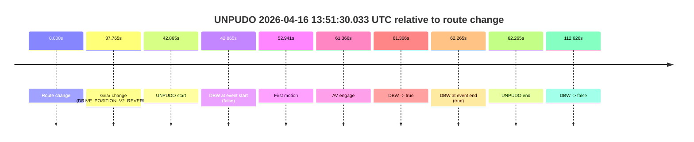
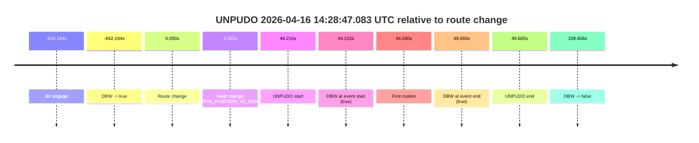

# Run Report: fme10003/2026-04-16--13-36-03--gen2-av-2f9a996c-038c-44b8-b604-a44d2703c25b

| Field | Value |
|---|---|
| Run ID | `fme10003/2026-04-16--13-36-03--gen2-av-2f9a996c-038c-44b8-b604-a44d2703c25b` |
| Date | `2026-04-16` |
| Model(s) | `armadillo-amethyst-squeaky` |
| Author | `guy.geva` |
| Event count | `4` |

## unpudo 2026-04-16 13:51:30.033 UTC

| Field | Value |
|---|---|
| Model | `armadillo-amethyst-squeaky` |
| Author | `guy.geva` |
| Run ID | `fme10003/2026-04-16--13-36-03--gen2-av-2f9a996c-038c-44b8-b604-a44d2703c25b` |
| Date | `2026-04-16` |
| Time (UTC) | `13:51:30.033` |
| Event type | `unpudo` |
| Disengagement type | `none observed` |
| Route change | `found` |
| Console | [run](https://console.sso.wayve.ai/run/fme10003/2026-04-16--13-36-03--gen2-av-2f9a996c-038c-44b8-b604-a44d2703c25b?id=&time-unixus=1776347490033319) |
| Foxglove | [segment](https://app.foxglove.dev/wayve-on-prem/p/prj_0dX18KZdVHg1fmmI/view?ds=foxglove-stream&ds.deviceName=fme10003&ds.start=2026-04-16T13%3A50%3A37.168290Z&ds.end=2026-04-16T13%3A52%3A49.794225Z&layoutId=lay_0e7VD4WIKDQGU73Y&time=2026-04-16T13%3A51%3A30.033319Z) |

### Event card: accidental

- Accidental: AV ownership is present for less than `2s`, so this is treated as an accidental brush with the maneuver rather than a meaningful model attempt.

| Event | Time (UTC) | Delta from route change |
|---|---:|---:|
| Route change | 2026-04-16 13:50:47.168 | `0.000s` |
| Gear change (DRIVE_POSITION_V2_REVERSE) | 2026-04-16 13:51:24.933 | `37.765s` |
| UNPUDO start | 2026-04-16 13:51:30.033 | `42.865s` |
| DBW at event start (false) | 2026-04-16 13:51:30.033 | `42.865s` |
| First motion | 2026-04-16 13:51:40.109 | `52.941s` |
| AV engage | 2026-04-16 13:51:48.534 | `61.366s` |
| DBW -> true | 2026-04-16 13:51:48.534 | `61.366s` |
| DBW at event end (true) | 2026-04-16 13:51:49.433 | `62.265s` |
| UNPUDO end | 2026-04-16 13:51:49.433 | `62.265s` |
| DBW -> false | 2026-04-16 13:52:39.794 | `112.626s` |

| Metric | Value |
|---|---|
| Outcome | `accidental` |
| Effective failure type | `none` |
| Route change status | `found` |
| DBW at event start | `false` |
| DBW at event end | `true` |
| Predicted gear at AV start | `DRIVE_POSITION_V2_DRIVE` |
| Actual gear at AV start | `DRIVE_POSITION_V2_DRIVE` |
| Predicted gear at event start | `DRIVE_POSITION_V2_REVERSE` |
| Actual gear at event start | `DRIVE_POSITION_V2_REVERSE` |
| Planned indicator direction | `INDICATORS_STATE_V2_OFF` |
| Controller indicator direction | `INDICATORS_STATE_V2_OFF` |
| Actual indicator direction | `INDICATORS_STATE_V2_OFF` |
| Actual indicator at maneuver end | `INDICATORS_STATE_V2_OFF` |
| Driver accel help in AV | `false` |
| Driver accel help timestamp | `n/a` |
| Max accel pedal pct in AV | `0.0%` |
| Max brake pedal pct in AV | `0.0%` |
| Max speed mps in AV | `2.256` |
| Success timing baseline | `route change` |
| Route -> AV | `61.366s` |
| AV -> event start | `-18.501s` |
| AV -> first motion | `-8.425s` |
| Success baseline -> event start | `42.865s` |
| Success baseline -> first motion | `52.941s` |
| AV duration before disengagement | `51.260s` |
| Trajectory waypoint count | `36` |
| Driving-plan step count | `11` |

The scored portion starts from the AV-owned window, not from the pre-AV setup. Route-change search in the stopped pre-event segment was `found`, with the baseline therefore set to route change. At the event anchor the model predicts `DRIVE_POSITION_V2_REVERSE` and the actual gear is `DRIVE_POSITION_V2_REVERSE`. The effective model outcome is `accidental` because `the AV-owned portion is shorter than 2s`.

### Resolution

| Field | Value |
|---|---|
| Final outcome | `accidental` |
| Do we agree with this label? | `yes` |
| Source disengagement type | `none observed` |
| Resolved effective failure type | `none` |
| Confidence | `high` |

## unpudo 2026-04-16 14:05:52.183 UTC

| Field | Value |
|---|---|
| Model | `armadillo-amethyst-squeaky` |
| Author | `guy.geva` |
| Run ID | `fme10003/2026-04-16--13-36-03--gen2-av-2f9a996c-038c-44b8-b604-a44d2703c25b` |
| Date | `2026-04-16` |
| Time (UTC) | `14:05:52.183` |
| Event type | `unpudo` |
| Disengagement type | `failed_to_unpudo` |
| Route change | `found` |
| Console | [run](https://console.sso.wayve.ai/run/fme10003/2026-04-16--13-36-03--gen2-av-2f9a996c-038c-44b8-b604-a44d2703c25b?id=&time-unixus=1776348352183304) |
| Foxglove | [segment](https://app.foxglove.dev/wayve-on-prem/p/prj_0dX18KZdVHg1fmmI/view?ds=foxglove-stream&ds.deviceName=fme10003&ds.start=2026-04-16T14%3A03%3A49.118242Z&ds.end=2026-04-16T14%3A08%3A25.094743Z&layoutId=lay_0e7VD4WIKDQGU73Y&time=2026-04-16T14%3A05%3A52.183304Z) |

### Event card: fail

- Fail: AV owns part of the segment, but the event still resolves as a model-performance failure under the AV-only scoring rule.

| Event | Time (UTC) | Delta from route change |
|---|---:|---:|
| Route change | 2026-04-16 14:03:59.118 | `0.000s` |
| Gear change (DRIVE_POSITION_V2_REVERSE) | 2026-04-16 14:05:48.233 | `109.115s` |
| UNPUDO start | 2026-04-16 14:05:52.183 | `113.065s` |
| DBW at event start (false) | 2026-04-16 14:05:52.183 | `113.065s` |
| First motion | 2026-04-16 14:05:57.248 | `118.130s` |
| AV engage | 2026-04-16 14:06:36.594 | `157.476s` |
| DBW -> true | 2026-04-16 14:06:36.594 | `157.476s` |
| DBW at event end (true) | 2026-04-16 14:06:45.433 | `166.315s` |
| UNPUDO end | 2026-04-16 14:06:45.433 | `166.315s` |
| DBW -> false | 2026-04-16 14:08:15.094 | `255.977s` |

| Metric | Value |
|---|---|
| Outcome | `fail` |
| Effective failure type | `failed_to_unpudo` |
| Route change status | `found` |
| DBW at event start | `false` |
| DBW at event end | `true` |
| Predicted gear at AV start | `DRIVE_POSITION_V2_PARK` |
| Actual gear at AV start | `DRIVE_POSITION_V2_PARK` |
| Predicted gear at event start | `DRIVE_POSITION_V2_REVERSE` |
| Actual gear at event start | `DRIVE_POSITION_V2_REVERSE` |
| Planned indicator direction | `INDICATORS_STATE_V2_OFF` |
| Controller indicator direction | `INDICATORS_STATE_V2_OFF` |
| Actual indicator direction | `INDICATORS_STATE_V2_OFF` |
| Actual indicator at maneuver end | `INDICATORS_STATE_V2_OFF` |
| Driver accel help in AV | `false` |
| Driver accel help timestamp | `n/a` |
| Max accel pedal pct in AV | `0.0%` |
| Max brake pedal pct in AV | `8.0%` |
| Max speed mps in AV | `2.258` |
| Success timing baseline | `route change` |
| Route -> AV | `157.476s` |
| AV -> event start | `-44.411s` |
| AV -> first motion | `-39.346s` |
| Success baseline -> event start | `113.065s` |
| Success baseline -> first motion | `118.130s` |
| AV duration before disengagement | `98.500s` |
| Trajectory waypoint count | `37` |
| Driving-plan step count | `11` |

The scored portion starts from the AV-owned window, not from the pre-AV setup. Route-change search in the stopped pre-event segment was `found`, with the baseline therefore set to route change. At the event anchor the model predicts `DRIVE_POSITION_V2_REVERSE` and the actual gear is `DRIVE_POSITION_V2_REVERSE`. The effective model outcome is `fail` because `failed_to_unpudo`.

### Resolution

| Field | Value |
|---|---|
| Final outcome | `fail` |
| Do we agree with this label? | `yes` |
| Source disengagement type | `failed_to_unpudo` |
| Resolved effective failure type | `failed_to_unpudo` |
| Confidence | `high` |

## unpudo 2026-04-16 14:28:47.083 UTC

| Field | Value |
|---|---|
| Model | `armadillo-amethyst-squeaky` |
| Author | `guy.geva` |
| Run ID | `fme10003/2026-04-16--13-36-03--gen2-av-2f9a996c-038c-44b8-b604-a44d2703c25b` |
| Date | `2026-04-16` |
| Time (UTC) | `14:28:47.083` |
| Event type | `unpudo` |
| Disengagement type | `none observed` |
| Route change | `found` |
| Console | [run](https://console.sso.wayve.ai/run/fme10003/2026-04-16--13-36-03--gen2-av-2f9a996c-038c-44b8-b604-a44d2703c25b?id=&time-unixus=1776349727083314) |
| Foxglove | [segment](https://app.foxglove.dev/wayve-on-prem/p/prj_0dX18KZdVHg1fmmI/view?ds=foxglove-stream&ds.deviceName=fme10003&ds.start=2026-04-16T14%3A17%3A10.674427Z&ds.end=2026-04-16T14%3A30%3A02.274654Z&layoutId=lay_0e7VD4WIKDQGU73Y&time=2026-04-16T14%3A28%3A47.083314Z) |

### Event card: pass

- Pass: AV owns the credited unpudo through the official event window, the gear state is aligned at the anchor, and the vehicle moves without driver accelerator help in AV.

| Event | Time (UTC) | Delta from route change |
|---|---:|---:|
| AV engage | 2026-04-16 14:17:20.674 | `-642.194s` |
| DBW -> true | 2026-04-16 14:17:20.674 | `-642.194s` |
| Route change | 2026-04-16 14:28:02.868 | `0.000s` |
| Gear change (DRIVE_POSITION_V2_DRIVE) | 2026-04-16 14:28:06.133 | `3.265s` |
| UNPUDO start | 2026-04-16 14:28:47.083 | `44.215s` |
| DBW at event start (true) | 2026-04-16 14:28:47.083 | `44.215s` |
| First motion | 2026-04-16 14:28:47.128 | `44.260s` |
| DBW at event end (true) | 2026-04-16 14:28:52.533 | `49.665s` |
| UNPUDO end | 2026-04-16 14:28:52.533 | `49.665s` |
| DBW -> false | 2026-04-16 14:29:52.274 | `109.406s` |

| Metric | Value |
|---|---|
| Outcome | `pass` |
| Effective failure type | `none` |
| Route change status | `found` |
| DBW at event start | `true` |
| DBW at event end | `true` |
| Predicted gear at AV start | `DRIVE_POSITION_V2_PARK` |
| Actual gear at AV start | `DRIVE_POSITION_V2_PARK` |
| Predicted gear at event start | `DRIVE_POSITION_V2_DRIVE` |
| Actual gear at event start | `DRIVE_POSITION_V2_DRIVE` |
| Planned indicator direction | `INDICATORS_STATE_V2_OFF` |
| Controller indicator direction | `INDICATORS_STATE_V2_OFF` |
| Actual indicator direction | `INDICATORS_STATE_V2_OFF` |
| Actual indicator at maneuver end | `INDICATORS_STATE_V2_OFF` |
| Driver accel help in AV | `false` |
| Driver accel help timestamp | `n/a` |
| Max accel pedal pct in AV | `0.0%` |
| Max brake pedal pct in AV | `0.0%` |
| Max speed mps in AV | `2.764` |
| Success timing baseline | `AV start` |
| Route -> AV | `-642.194s` |
| AV -> event start | `686.409s` |
| AV -> first motion | `686.454s` |
| Success baseline -> event start | `686.409s` |
| Success baseline -> first motion | `686.454s` |
| AV duration before disengagement | `751.600s` |
| Trajectory waypoint count | `37` |
| Driving-plan step count | `11` |

The scored portion starts from the AV-owned window, not from the pre-AV setup. Route-change search in the stopped pre-event segment was `found`, with the baseline therefore set to route change. At the event anchor the model predicts `DRIVE_POSITION_V2_DRIVE` and the actual gear is `DRIVE_POSITION_V2_DRIVE`. The effective model outcome is `pass` because `the credited maneuver stays AV-owned through the official event end`.

### Resolution

| Field | Value |
|---|---|
| Final outcome | `pass` |
| Do we agree with this label? | `yes` |
| Source disengagement type | `none observed` |
| Resolved effective failure type | `none` |
| Confidence | `high` |

## unpudo 2026-04-16 14:42:07.383 UTC

| Field | Value |
|---|---|
| Model | `armadillo-amethyst-squeaky` |
| Author | `guy.geva` |
| Run ID | `fme10003/2026-04-16--13-36-03--gen2-av-2f9a996c-038c-44b8-b604-a44d2703c25b` |
| Date | `2026-04-16` |
| Time (UTC) | `14:42:07.383` |
| Event type | `unpudo` |
| Disengagement type | `none observed` |
| Route change | `found` |
| Console | [run](https://console.sso.wayve.ai/run/fme10003/2026-04-16--13-36-03--gen2-av-2f9a996c-038c-44b8-b604-a44d2703c25b?id=&time-unixus=1776350527383299) |
| Foxglove | [segment](https://app.foxglove.dev/wayve-on-prem/p/prj_0dX18KZdVHg1fmmI/view?ds=foxglove-stream&ds.deviceName=fme10003&ds.start=2026-04-16T14%3A40%3A52.334921Z&ds.end=2026-04-16T14%3A42%3A49.255174Z&layoutId=lay_0e7VD4WIKDQGU73Y&time=2026-04-16T14%3A42%3A07.383299Z) |

### Event card: pass

- Pass: AV owns the credited unpudo through the official event window, the gear state is aligned at the anchor, and the vehicle moves without driver accelerator help in AV.

| Event | Time (UTC) | Delta from route change |
|---|---:|---:|
| AV engage | 2026-04-16 14:41:02.334 | `-59.833s` |
| DBW -> true | 2026-04-16 14:41:02.334 | `-59.833s` |
| Route change | 2026-04-16 14:42:02.168 | `0.000s` |
| Gear change (DRIVE_POSITION_V2_DRIVE) | 2026-04-16 14:42:03.833 | `1.665s` |
| UNPUDO start | 2026-04-16 14:42:07.383 | `5.215s` |
| DBW at event start (true) | 2026-04-16 14:42:07.383 | `5.215s` |
| First motion | 2026-04-16 14:42:07.428 | `5.260s` |
| DBW at event end (true) | 2026-04-16 14:42:11.883 | `9.715s` |
| UNPUDO end | 2026-04-16 14:42:11.883 | `9.715s` |
| DBW -> false | 2026-04-16 14:42:39.255 | `37.087s` |

| Metric | Value |
|---|---|
| Outcome | `pass` |
| Effective failure type | `none` |
| Route change status | `found` |
| DBW at event start | `true` |
| DBW at event end | `true` |
| Predicted gear at AV start | `DRIVE_POSITION_V2_DRIVE` |
| Actual gear at AV start | `DRIVE_POSITION_V2_DRIVE` |
| Predicted gear at event start | `DRIVE_POSITION_V2_DRIVE` |
| Actual gear at event start | `DRIVE_POSITION_V2_DRIVE` |
| Planned indicator direction | `INDICATORS_STATE_V2_OFF` |
| Controller indicator direction | `INDICATORS_STATE_V2_OFF` |
| Actual indicator direction | `INDICATORS_STATE_V2_OFF` |
| Actual indicator at maneuver end | `INDICATORS_STATE_V2_OFF` |
| Driver accel help in AV | `false` |
| Driver accel help timestamp | `n/a` |
| Max accel pedal pct in AV | `0.0%` |
| Max brake pedal pct in AV | `0.0%` |
| Max speed mps in AV | `3.022` |
| Success timing baseline | `AV start` |
| Route -> AV | `-59.833s` |
| AV -> event start | `65.048s` |
| AV -> first motion | `65.093s` |
| Success baseline -> event start | `65.048s` |
| Success baseline -> first motion | `65.093s` |
| AV duration before disengagement | `96.920s` |
| Trajectory waypoint count | `37` |
| Driving-plan step count | `11` |

The scored portion starts from the AV-owned window, not from the pre-AV setup. Route-change search in the stopped pre-event segment was `found`, with the baseline therefore set to route change. At the event anchor the model predicts `DRIVE_POSITION_V2_DRIVE` and the actual gear is `DRIVE_POSITION_V2_DRIVE`. The effective model outcome is `pass` because `the credited maneuver stays AV-owned through the official event end`.

### Resolution

| Field | Value |
|---|---|
| Final outcome | `pass` |
| Do we agree with this label? | `yes` |
| Source disengagement type | `none observed` |
| Resolved effective failure type | `none` |
| Confidence | `high` |
