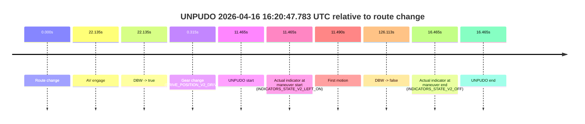
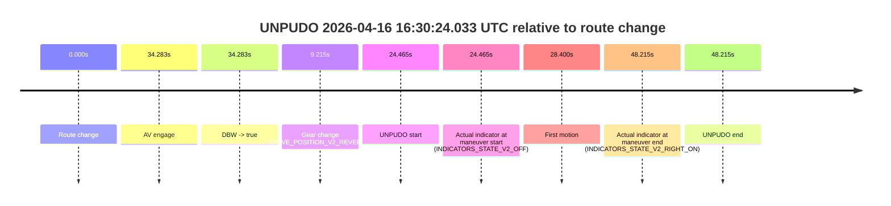

# Run Report: fme10003/2026-04-16--16-00-26--gen2-av-b2b497ed-62ed-4450-835c-049d249cc2df

| Field | Value |
|---|---|
| Run ID | `fme10003/2026-04-16--16-00-26--gen2-av-b2b497ed-62ed-4450-835c-049d249cc2df` |
| Date | `2026-04-16` |
| Model(s) | `plum-timeless-beaver` |
| Author | `peng.tang` |
| Event count | `3` |

## unpudo 2026-04-16 16:20:47.783 UTC

| Field | Value |
|---|---|
| Model | `plum-timeless-beaver` |
| Author | `peng.tang` |
| Run ID | `fme10003/2026-04-16--16-00-26--gen2-av-b2b497ed-62ed-4450-835c-049d249cc2df` |
| Date | `2026-04-16` |
| Time (UTC) | `16:20:47.783` |
| Event type | `unpudo` |
| Disengagement type | `failed_to_unpudo` |
| Route change | `found` |
| Console | [run](https://console.sso.wayve.ai/run/fme10003/2026-04-16--16-00-26--gen2-av-b2b497ed-62ed-4450-835c-049d249cc2df?id=&time-unixus=1776356447783321) |
| Foxglove | [segment](https://app.foxglove.dev/wayve-on-prem/p/prj_0dX18KZdVHg1fmmI/view?ds=foxglove-stream&ds.deviceName=fme10003&ds.start=2026-04-16T16%3A20%3A26.318291Z&ds.end=2026-04-16T16%3A22%3A52.431781Z&layoutId=lay_0e7VD4WIKDQGU73Y&time=2026-04-16T16%3A20%3A47.783321Z) |

### Event card: accidental

- Accidental: AV ownership is present for less than `2s`, so this is treated as an accidental brush with the maneuver rather than a meaningful model attempt.

| Event | Time (UTC) | Delta from route change |
|---|---:|---:|
| Route change | 2026-04-16 16:20:36.318 | `0.000s` |
| AV engage | 2026-04-16 16:20:58.452 | `22.135s` |
| DBW -> true | 2026-04-16 16:20:58.452 | `22.135s` |
| Gear change (DRIVE_POSITION_V2_DRIVE) | 2026-04-16 16:20:36.633 | `0.315s` |
| UNPUDO start | 2026-04-16 16:20:47.783 | `11.465s` |
| Actual indicator at maneuver start (INDICATORS_STATE_V2_LEFT_ON) | 2026-04-16 16:20:47.783 | `11.465s` |
| First motion | 2026-04-16 16:20:47.808 | `11.490s` |
| DBW -> false | 2026-04-16 16:22:42.431 | `126.113s` |
| Actual indicator at maneuver end (INDICATORS_STATE_V2_OFF) | 2026-04-16 16:20:52.783 | `16.465s` |
| UNPUDO end | 2026-04-16 16:20:52.783 | `16.465s` |

| Metric | Value |
|---|---|
| Outcome | `accidental` |
| Effective failure type | `none` |
| Route change status | `found` |
| DBW at event start | `false` |
| DBW at event end | `false` |
| Predicted gear at AV start | `DRIVE_POSITION_V2_DRIVE` |
| Actual gear at AV start | `DRIVE_POSITION_V2_DRIVE` |
| Predicted gear at event start | `DRIVE_POSITION_V2_DRIVE` |
| Actual gear at event start | `DRIVE_POSITION_V2_DRIVE` |
| Planned indicator direction | `INDICATORS_STATE_V2_OFF` |
| Controller indicator direction | `INDICATORS_STATE_V2_OFF` |
| Actual indicator direction | `INDICATORS_STATE_V2_LEFT_ON` |
| Actual indicator at maneuver end | `INDICATORS_STATE_V2_OFF` |
| Driver accel help in AV | `false` |
| Driver accel help timestamp | `n/a` |
| Max accel pedal pct in AV | `0.0%` |
| Max brake pedal pct in AV | `0.0%` |
| Max speed mps in AV | `0.000` |
| Route -> AV | `22.135s` |
| AV -> event start | `-10.669s` |
| AV -> first motion | `-10.644s` |
| AV duration before disengagement | `103.979s` |
| Trajectory waypoint count | `37` |
| Driving-plan step count | `11` |

The scored portion starts from the AV-owned window, not from the pre-AV setup. Route-change search in the stopped pre-event segment was `found`, with the baseline therefore set to route change. At the event anchor the model predicts `DRIVE_POSITION_V2_DRIVE` and the actual gear is `DRIVE_POSITION_V2_DRIVE`. The effective model outcome is `accidental` because `the AV-owned portion is shorter than 2s`.

### Resolution

| Field | Value |
|---|---|
| Final outcome | `accidental` |
| Do we agree with this label? | `yes` |
| Source disengagement type | `failed_to_unpudo` |
| Resolved effective failure type | `none` |
| Confidence | `high` |

## unpudo 2026-04-16 16:24:01.183 UTC

| Field | Value |
|---|---|
| Model | `plum-timeless-beaver` |
| Author | `peng.tang` |
| Run ID | `fme10003/2026-04-16--16-00-26--gen2-av-b2b497ed-62ed-4450-835c-049d249cc2df` |
| Date | `2026-04-16` |
| Time (UTC) | `16:24:01.183` |
| Event type | `unpudo` |
| Disengagement type | `uncategorised` |
| Route change | `found` |
| Console | [run](https://console.sso.wayve.ai/run/fme10003/2026-04-16--16-00-26--gen2-av-b2b497ed-62ed-4450-835c-049d249cc2df?id=&time-unixus=1776356641183311) |
| Foxglove | [segment](https://app.foxglove.dev/wayve-on-prem/p/prj_0dX18KZdVHg1fmmI/view?ds=foxglove-stream&ds.deviceName=fme10003&ds.start=2026-04-16T16%3A23%3A23.018232Z&ds.end=2026-04-16T16%3A24%3A52.592621Z&layoutId=lay_0e7VD4WIKDQGU73Y&time=2026-04-16T16%3A24%3A01.183311Z) |

### Event card: accidental

- Accidental: AV ownership is present for less than `2s`, so this is treated as an accidental brush with the maneuver rather than a meaningful model attempt.

| Event | Time (UTC) | Delta from route change |
|---|---:|---:|
| Route change | 2026-04-16 16:23:33.018 | `0.000s` |
| AV engage | 2026-04-16 16:24:10.492 | `37.474s` |
| DBW -> true | 2026-04-16 16:24:10.492 | `37.474s` |
| Gear change (DRIVE_POSITION_V2_DRIVE) | 2026-04-16 16:23:48.133 | `15.115s` |
| UNPUDO start | 2026-04-16 16:24:01.183 | `28.165s` |
| Actual indicator at maneuver start (INDICATORS_STATE_V2_LEFT_ON) | 2026-04-16 16:24:01.183 | `28.165s` |
| First motion | 2026-04-16 16:24:01.288 | `28.270s` |
| DBW -> false | 2026-04-16 16:24:42.592 | `69.574s` |
| Actual indicator at maneuver end (INDICATORS_STATE_V2_OFF) | 2026-04-16 16:24:05.633 | `32.615s` |
| UNPUDO end | 2026-04-16 16:24:05.633 | `32.615s` |

| Metric | Value |
|---|---|
| Outcome | `accidental` |
| Effective failure type | `none` |
| Route change status | `found` |
| DBW at event start | `false` |
| DBW at event end | `false` |
| Predicted gear at AV start | `DRIVE_POSITION_V2_DRIVE` |
| Actual gear at AV start | `DRIVE_POSITION_V2_DRIVE` |
| Predicted gear at event start | `DRIVE_POSITION_V2_DRIVE` |
| Actual gear at event start | `DRIVE_POSITION_V2_DRIVE` |
| Planned indicator direction | `INDICATORS_STATE_V2_OFF` |
| Controller indicator direction | `INDICATORS_STATE_V2_OFF` |
| Actual indicator direction | `INDICATORS_STATE_V2_LEFT_ON` |
| Actual indicator at maneuver end | `INDICATORS_STATE_V2_OFF` |
| Driver accel help in AV | `false` |
| Driver accel help timestamp | `n/a` |
| Max accel pedal pct in AV | `0.0%` |
| Max brake pedal pct in AV | `0.0%` |
| Max speed mps in AV | `0.000` |
| Route -> AV | `37.474s` |
| AV -> event start | `-9.309s` |
| AV -> first motion | `-9.204s` |
| AV duration before disengagement | `32.100s` |
| Trajectory waypoint count | `37` |
| Driving-plan step count | `11` |

The scored portion starts from the AV-owned window, not from the pre-AV setup. Route-change search in the stopped pre-event segment was `found`, with the baseline therefore set to route change. At the event anchor the model predicts `DRIVE_POSITION_V2_DRIVE` and the actual gear is `DRIVE_POSITION_V2_DRIVE`. The effective model outcome is `accidental` because `the AV-owned portion is shorter than 2s`.

### Resolution

| Field | Value |
|---|---|
| Final outcome | `accidental` |
| Do we agree with this label? | `yes` |
| Source disengagement type | `uncategorised` |
| Resolved effective failure type | `none` |
| Confidence | `high` |

## unpudo 2026-04-16 16:30:24.033 UTC

| Field | Value |
|---|---|
| Model | `plum-timeless-beaver` |
| Author | `peng.tang` |
| Run ID | `fme10003/2026-04-16--16-00-26--gen2-av-b2b497ed-62ed-4450-835c-049d249cc2df` |
| Date | `2026-04-16` |
| Time (UTC) | `16:30:24.033` |
| Event type | `unpudo` |
| Disengagement type | `failed_to_unpudo` |
| Route change | `found` |
| Console | [run](https://console.sso.wayve.ai/run/fme10003/2026-04-16--16-00-26--gen2-av-b2b497ed-62ed-4450-835c-049d249cc2df?id=&time-unixus=1776357024033298) |
| Foxglove | [segment](https://app.foxglove.dev/wayve-on-prem/p/prj_0dX18KZdVHg1fmmI/view?ds=foxglove-stream&ds.deviceName=fme10003&ds.start=2026-04-16T16%3A29%3A49.568251Z&ds.end=2026-04-16T16%3A30%3A57.783298Z&layoutId=lay_0e7VD4WIKDQGU73Y&time=2026-04-16T16%3A30%3A24.033298Z) |

### Event card: non-av

- Non-AV: the detected unpudo starts outside AV ownership, so it is kept for coverage but excluded from model success / failure scoring.

| Event | Time (UTC) | Delta from route change |
|---|---:|---:|
| Route change | 2026-04-16 16:29:59.568 | `0.000s` |
| AV engage | 2026-04-16 16:30:33.851 | `34.283s` |
| DBW -> true | 2026-04-16 16:30:33.851 | `34.283s` |
| Gear change (DRIVE_POSITION_V2_REVERSE) | 2026-04-16 16:30:08.783 | `9.215s` |
| UNPUDO start | 2026-04-16 16:30:24.033 | `24.465s` |
| Actual indicator at maneuver start (INDICATORS_STATE_V2_OFF) | 2026-04-16 16:30:24.033 | `24.465s` |
| First motion | 2026-04-16 16:30:27.968 | `28.400s` |
| Actual indicator at maneuver end (INDICATORS_STATE_V2_RIGHT_ON) | 2026-04-16 16:30:47.783 | `48.215s` |
| UNPUDO end | 2026-04-16 16:30:47.783 | `48.215s` |

| Metric | Value |
|---|---|
| Outcome | `non-av` |
| Effective failure type | `none` |
| Route change status | `found` |
| DBW at event start | `false` |
| DBW at event end | `true` |
| Predicted gear at AV start | `DRIVE_POSITION_V2_DRIVE` |
| Actual gear at AV start | `DRIVE_POSITION_V2_DRIVE` |
| Predicted gear at event start | `DRIVE_POSITION_V2_REVERSE` |
| Actual gear at event start | `DRIVE_POSITION_V2_REVERSE` |
| Planned indicator direction | `INDICATORS_STATE_V2_OFF` |
| Controller indicator direction | `INDICATORS_STATE_V2_OFF` |
| Actual indicator direction | `INDICATORS_STATE_V2_OFF` |
| Actual indicator at maneuver end | `INDICATORS_STATE_V2_RIGHT_ON` |
| Driver accel help in AV | `false` |
| Driver accel help timestamp | `n/a` |
| Max accel pedal pct in AV | `0.0%` |
| Max brake pedal pct in AV | `8.0%` |
| Max speed mps in AV | `0.344` |
| Route -> AV | `34.283s` |
| AV -> event start | `-9.818s` |
| AV -> first motion | `-5.883s` |
| AV duration before disengagement | `n/a` |
| Trajectory waypoint count | `36` |
| Driving-plan step count | `11` |

The scored portion starts from the AV-owned window, not from the pre-AV setup. Route-change search in the stopped pre-event segment was `found`, with the baseline therefore set to route change. At the event anchor the model predicts `DRIVE_POSITION_V2_REVERSE` and the actual gear is `DRIVE_POSITION_V2_REVERSE`. The effective model outcome is `non-av` because `the event does not begin in AV ownership`.

### Resolution

| Field | Value |
|---|---|
| Final outcome | `non-av` |
| Do we agree with this label? | `yes` |
| Source disengagement type | `failed_to_unpudo` |
| Resolved effective failure type | `none` |
| Confidence | `high` |
