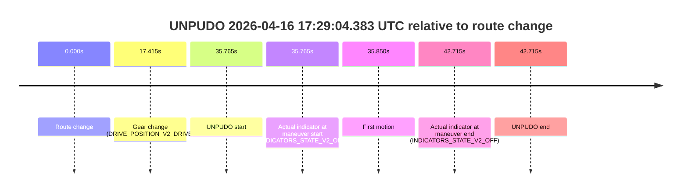
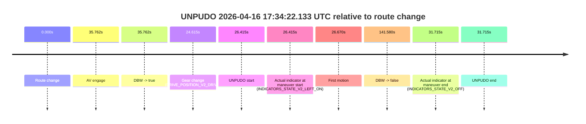
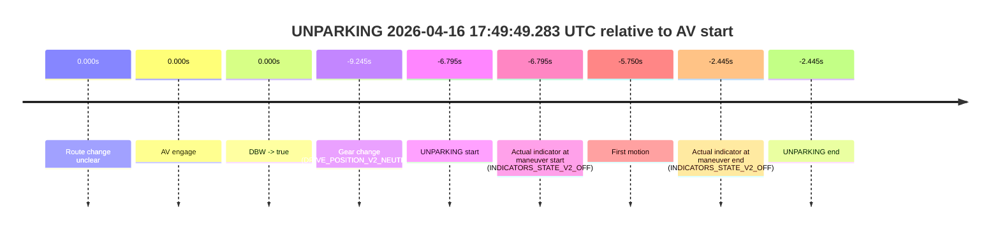

# Run Report: fme10003/2026-04-16--17-10-04--gen2-av-710efb27-5236-4149-83e6-8719d31d0743

| Field | Value |
|---|---|
| Run ID | `fme10003/2026-04-16--17-10-04--gen2-av-710efb27-5236-4149-83e6-8719d31d0743` |
| Date | `2026-04-16` |
| Model(s) | `plum-timeless-beaver` |
| Author | `peng.tang` |
| Event count | `6` |

## unpudo 2026-04-16 17:23:43.233 UTC

| Field | Value |
|---|---|
| Model | `plum-timeless-beaver` |
| Author | `peng.tang` |
| Run ID | `fme10003/2026-04-16--17-10-04--gen2-av-710efb27-5236-4149-83e6-8719d31d0743` |
| Date | `2026-04-16` |
| Time (UTC) | `17:23:43.233` |
| Event type | `unpudo` |
| Disengagement type | `failed_to_unpudo` |
| Route change | `found` |
| Console | [run](https://console.sso.wayve.ai/run/fme10003/2026-04-16--17-10-04--gen2-av-710efb27-5236-4149-83e6-8719d31d0743?id=&time-unixus=1776360223233297) |
| Foxglove | [segment](https://app.foxglove.dev/wayve-on-prem/p/prj_0dX18KZdVHg1fmmI/view?ds=foxglove-stream&ds.deviceName=fme10003&ds.start=2026-04-16T17%3A23%3A14.519052Z&ds.end=2026-04-16T17%3A28%3A02.879575Z&layoutId=lay_0e7VD4WIKDQGU73Y&time=2026-04-16T17%3A23%3A43.233297Z) |

### Event card: accidental

- Accidental: AV ownership is present for less than `2s`, so this is treated as an accidental brush with the maneuver rather than a meaningful model attempt.

| Event | Time (UTC) | Delta from route change |
|---|---:|---:|
| Route change | 2026-04-16 17:23:24.519 | `0.000s` |
| AV engage | 2026-04-16 17:23:50.658 | `26.139s` |
| DBW -> true | 2026-04-16 17:23:50.658 | `26.139s` |
| Gear change (DRIVE_POSITION_V2_DRIVE) | 2026-04-16 17:23:28.883 | `4.364s` |
| UNPUDO start | 2026-04-16 17:23:43.233 | `18.714s` |
| Actual indicator at maneuver start (INDICATORS_STATE_V2_OFF) | 2026-04-16 17:23:43.233 | `18.714s` |
| First motion | 2026-04-16 17:23:43.268 | `18.749s` |
| DBW -> false | 2026-04-16 17:27:52.879 | `268.361s` |
| Actual indicator at maneuver end (INDICATORS_STATE_V2_OFF) | 2026-04-16 17:23:47.883 | `23.364s` |
| UNPUDO end | 2026-04-16 17:23:47.883 | `23.364s` |

| Metric | Value |
|---|---|
| Outcome | `accidental` |
| Effective failure type | `none` |
| Route change status | `found` |
| DBW at event start | `false` |
| DBW at event end | `false` |
| Predicted gear at AV start | `DRIVE_POSITION_V2_DRIVE` |
| Actual gear at AV start | `DRIVE_POSITION_V2_DRIVE` |
| Predicted gear at event start | `DRIVE_POSITION_V2_DRIVE` |
| Actual gear at event start | `DRIVE_POSITION_V2_DRIVE` |
| Planned indicator direction | `INDICATORS_STATE_V2_OFF` |
| Controller indicator direction | `INDICATORS_STATE_V2_OFF` |
| Actual indicator direction | `INDICATORS_STATE_V2_OFF` |
| Actual indicator at maneuver end | `INDICATORS_STATE_V2_OFF` |
| Driver accel help in AV | `false` |
| Driver accel help timestamp | `n/a` |
| Max accel pedal pct in AV | `0.0%` |
| Max brake pedal pct in AV | `0.0%` |
| Max speed mps in AV | `0.000` |
| Route -> AV | `26.139s` |
| AV -> event start | `-7.425s` |
| AV -> first motion | `-7.390s` |
| AV duration before disengagement | `242.221s` |
| Trajectory waypoint count | `37` |
| Driving-plan step count | `11` |

The scored portion starts from the AV-owned window, not from the pre-AV setup. Route-change search in the stopped pre-event segment was `found`, with the baseline therefore set to route change. At the event anchor the model predicts `DRIVE_POSITION_V2_DRIVE` and the actual gear is `DRIVE_POSITION_V2_DRIVE`. The effective model outcome is `accidental` because `the AV-owned portion is shorter than 2s`.

### Resolution

| Field | Value |
|---|---|
| Final outcome | `accidental` |
| Do we agree with this label? | `yes` |
| Source disengagement type | `failed_to_unpudo` |
| Resolved effective failure type | `none` |
| Confidence | `high` |

## unpudo 2026-04-16 17:29:04.383 UTC

| Field | Value |
|---|---|
| Model | `plum-timeless-beaver` |
| Author | `peng.tang` |
| Run ID | `fme10003/2026-04-16--17-10-04--gen2-av-710efb27-5236-4149-83e6-8719d31d0743` |
| Date | `2026-04-16` |
| Time (UTC) | `17:29:04.383` |
| Event type | `unpudo` |
| Disengagement type | `failed_to_unpudo` |
| Route change | `found` |
| Console | [run](https://console.sso.wayve.ai/run/fme10003/2026-04-16--17-10-04--gen2-av-710efb27-5236-4149-83e6-8719d31d0743?id=&time-unixus=1776360544383308) |
| Foxglove | [segment](https://app.foxglove.dev/wayve-on-prem/p/prj_0dX18KZdVHg1fmmI/view?ds=foxglove-stream&ds.deviceName=fme10003&ds.start=2026-04-16T17%3A28%3A18.618261Z&ds.end=2026-04-16T17%3A29%3A21.333316Z&layoutId=lay_0e7VD4WIKDQGU73Y&time=2026-04-16T17%3A29%3A04.383308Z) |

### Event card: non-av

- Non-AV: the detected unpudo starts outside AV ownership, so it is kept for coverage but excluded from model success / failure scoring.

| Event | Time (UTC) | Delta from route change |
|---|---:|---:|
| Route change | 2026-04-16 17:28:28.618 | `0.000s` |
| Gear change (DRIVE_POSITION_V2_DRIVE) | 2026-04-16 17:28:46.033 | `17.415s` |
| UNPUDO start | 2026-04-16 17:29:04.383 | `35.765s` |
| Actual indicator at maneuver start (INDICATORS_STATE_V2_OFF) | 2026-04-16 17:29:04.383 | `35.765s` |
| First motion | 2026-04-16 17:29:04.468 | `35.850s` |
| Actual indicator at maneuver end (INDICATORS_STATE_V2_OFF) | 2026-04-16 17:29:11.333 | `42.715s` |
| UNPUDO end | 2026-04-16 17:29:11.333 | `42.715s` |

| Metric | Value |
|---|---|
| Outcome | `non-av` |
| Effective failure type | `none` |
| Route change status | `found` |
| DBW at event start | `false` |
| DBW at event end | `false` |
| Predicted gear at AV start | `n/a` |
| Actual gear at AV start | `n/a` |
| Predicted gear at event start | `DRIVE_POSITION_V2_DRIVE` |
| Actual gear at event start | `DRIVE_POSITION_V2_DRIVE` |
| Planned indicator direction | `INDICATORS_STATE_V2_LEFT_ON` |
| Controller indicator direction | `INDICATORS_STATE_V2_LEFT_ON` |
| Actual indicator direction | `INDICATORS_STATE_V2_OFF` |
| Actual indicator at maneuver end | `INDICATORS_STATE_V2_OFF` |
| Driver accel help in AV | `false` |
| Driver accel help timestamp | `n/a` |
| Max accel pedal pct in AV | `0.0%` |
| Max brake pedal pct in AV | `0.0%` |
| Max speed mps in AV | `0.000` |
| Route -> AV | `n/a` |
| AV -> event start | `n/a` |
| AV -> first motion | `n/a` |
| AV duration before disengagement | `n/a` |
| Trajectory waypoint count | `37` |
| Driving-plan step count | `11` |

The scored portion starts from the AV-owned window, not from the pre-AV setup. Route-change search in the stopped pre-event segment was `found`, with the baseline therefore set to route change. At the event anchor the model predicts `DRIVE_POSITION_V2_DRIVE` and the actual gear is `DRIVE_POSITION_V2_DRIVE`. The effective model outcome is `non-av` because `the event does not begin in AV ownership`.

### Resolution

| Field | Value |
|---|---|
| Final outcome | `non-av` |
| Do we agree with this label? | `yes` |
| Source disengagement type | `failed_to_unpudo` |
| Resolved effective failure type | `none` |
| Confidence | `high` |

## unpudo 2026-04-16 17:31:58.233 UTC

| Field | Value |
|---|---|
| Model | `plum-timeless-beaver` |
| Author | `peng.tang` |
| Run ID | `fme10003/2026-04-16--17-10-04--gen2-av-710efb27-5236-4149-83e6-8719d31d0743` |
| Date | `2026-04-16` |
| Time (UTC) | `17:31:58.233` |
| Event type | `unpudo` |
| Disengagement type | `failed_to_unpudo` |
| Route change | `found` |
| Console | [run](https://console.sso.wayve.ai/run/fme10003/2026-04-16--17-10-04--gen2-av-710efb27-5236-4149-83e6-8719d31d0743?id=&time-unixus=1776360718233292) |
| Foxglove | [segment](https://app.foxglove.dev/wayve-on-prem/p/prj_0dX18KZdVHg1fmmI/view?ds=foxglove-stream&ds.deviceName=fme10003&ds.start=2026-04-16T17%3A31%3A16.218254Z&ds.end=2026-04-16T17%3A33%3A42.518144Z&layoutId=lay_0e7VD4WIKDQGU73Y&time=2026-04-16T17%3A31%3A58.233292Z) |

### Event card: accidental

- Accidental: AV ownership is present for less than `2s`, so this is treated as an accidental brush with the maneuver rather than a meaningful model attempt.

| Event | Time (UTC) | Delta from route change |
|---|---:|---:|
| Route change | 2026-04-16 17:31:26.218 | `0.000s` |
| AV engage | 2026-04-16 17:32:29.578 | `63.360s` |
| DBW -> true | 2026-04-16 17:32:29.578 | `63.360s` |
| Gear change (DRIVE_POSITION_V2_DRIVE) | 2026-04-16 17:31:50.533 | `24.315s` |
| UNPUDO start | 2026-04-16 17:31:58.233 | `32.015s` |
| Actual indicator at maneuver start (INDICATORS_STATE_V2_OFF) | 2026-04-16 17:31:58.233 | `32.015s` |
| First motion | 2026-04-16 17:31:58.268 | `32.050s` |
| DBW -> false | 2026-04-16 17:33:32.518 | `126.300s` |
| Actual indicator at maneuver end (INDICATORS_STATE_V2_RIGHT_ON) | 2026-04-16 17:32:24.033 | `57.815s` |
| UNPUDO end | 2026-04-16 17:32:24.033 | `57.815s` |

| Metric | Value |
|---|---|
| Outcome | `accidental` |
| Effective failure type | `none` |
| Route change status | `found` |
| DBW at event start | `false` |
| DBW at event end | `false` |
| Predicted gear at AV start | `DRIVE_POSITION_V2_DRIVE` |
| Actual gear at AV start | `DRIVE_POSITION_V2_DRIVE` |
| Predicted gear at event start | `DRIVE_POSITION_V2_DRIVE` |
| Actual gear at event start | `DRIVE_POSITION_V2_DRIVE` |
| Planned indicator direction | `INDICATORS_STATE_V2_OFF` |
| Controller indicator direction | `INDICATORS_STATE_V2_OFF` |
| Actual indicator direction | `INDICATORS_STATE_V2_OFF` |
| Actual indicator at maneuver end | `INDICATORS_STATE_V2_RIGHT_ON` |
| Driver accel help in AV | `false` |
| Driver accel help timestamp | `n/a` |
| Max accel pedal pct in AV | `0.0%` |
| Max brake pedal pct in AV | `0.0%` |
| Max speed mps in AV | `0.000` |
| Route -> AV | `63.360s` |
| AV -> event start | `-31.345s` |
| AV -> first motion | `-31.310s` |
| AV duration before disengagement | `62.940s` |
| Trajectory waypoint count | `36` |
| Driving-plan step count | `11` |

The scored portion starts from the AV-owned window, not from the pre-AV setup. Route-change search in the stopped pre-event segment was `found`, with the baseline therefore set to route change. At the event anchor the model predicts `DRIVE_POSITION_V2_DRIVE` and the actual gear is `DRIVE_POSITION_V2_DRIVE`. The effective model outcome is `accidental` because `the AV-owned portion is shorter than 2s`.

### Resolution

| Field | Value |
|---|---|
| Final outcome | `accidental` |
| Do we agree with this label? | `yes` |
| Source disengagement type | `failed_to_unpudo` |
| Resolved effective failure type | `none` |
| Confidence | `high` |

## unpudo 2026-04-16 17:34:22.133 UTC

| Field | Value |
|---|---|
| Model | `plum-timeless-beaver` |
| Author | `peng.tang` |
| Run ID | `fme10003/2026-04-16--17-10-04--gen2-av-710efb27-5236-4149-83e6-8719d31d0743` |
| Date | `2026-04-16` |
| Time (UTC) | `17:34:22.133` |
| Event type | `unpudo` |
| Disengagement type | `uncategorised` |
| Route change | `found` |
| Console | [run](https://console.sso.wayve.ai/run/fme10003/2026-04-16--17-10-04--gen2-av-710efb27-5236-4149-83e6-8719d31d0743?id=&time-unixus=1776360862133305) |
| Foxglove | [segment](https://app.foxglove.dev/wayve-on-prem/p/prj_0dX18KZdVHg1fmmI/view?ds=foxglove-stream&ds.deviceName=fme10003&ds.start=2026-04-16T17%3A33%3A45.718232Z&ds.end=2026-04-16T17%3A36%3A27.298303Z&layoutId=lay_0e7VD4WIKDQGU73Y&time=2026-04-16T17%3A34%3A22.133305Z) |

### Event card: accidental

- Accidental: AV ownership is present for less than `2s`, so this is treated as an accidental brush with the maneuver rather than a meaningful model attempt.

| Event | Time (UTC) | Delta from route change |
|---|---:|---:|
| Route change | 2026-04-16 17:33:55.718 | `0.000s` |
| AV engage | 2026-04-16 17:34:31.479 | `35.762s` |
| DBW -> true | 2026-04-16 17:34:31.479 | `35.762s` |
| Gear change (DRIVE_POSITION_V2_DRIVE) | 2026-04-16 17:34:20.333 | `24.615s` |
| UNPUDO start | 2026-04-16 17:34:22.133 | `26.415s` |
| Actual indicator at maneuver start (INDICATORS_STATE_V2_LEFT_ON) | 2026-04-16 17:34:22.133 | `26.415s` |
| First motion | 2026-04-16 17:34:22.388 | `26.670s` |
| DBW -> false | 2026-04-16 17:36:17.298 | `141.580s` |
| Actual indicator at maneuver end (INDICATORS_STATE_V2_OFF) | 2026-04-16 17:34:27.433 | `31.715s` |
| UNPUDO end | 2026-04-16 17:34:27.433 | `31.715s` |

| Metric | Value |
|---|---|
| Outcome | `accidental` |
| Effective failure type | `none` |
| Route change status | `found` |
| DBW at event start | `false` |
| DBW at event end | `false` |
| Predicted gear at AV start | `DRIVE_POSITION_V2_DRIVE` |
| Actual gear at AV start | `DRIVE_POSITION_V2_DRIVE` |
| Predicted gear at event start | `DRIVE_POSITION_V2_DRIVE` |
| Actual gear at event start | `DRIVE_POSITION_V2_DRIVE` |
| Planned indicator direction | `INDICATORS_STATE_V2_OFF` |
| Controller indicator direction | `INDICATORS_STATE_V2_OFF` |
| Actual indicator direction | `INDICATORS_STATE_V2_LEFT_ON` |
| Actual indicator at maneuver end | `INDICATORS_STATE_V2_OFF` |
| Driver accel help in AV | `false` |
| Driver accel help timestamp | `n/a` |
| Max accel pedal pct in AV | `0.0%` |
| Max brake pedal pct in AV | `0.0%` |
| Max speed mps in AV | `0.000` |
| Route -> AV | `35.762s` |
| AV -> event start | `-9.346s` |
| AV -> first motion | `-9.091s` |
| AV duration before disengagement | `105.819s` |
| Trajectory waypoint count | `36` |
| Driving-plan step count | `11` |

The scored portion starts from the AV-owned window, not from the pre-AV setup. Route-change search in the stopped pre-event segment was `found`, with the baseline therefore set to route change. At the event anchor the model predicts `DRIVE_POSITION_V2_DRIVE` and the actual gear is `DRIVE_POSITION_V2_DRIVE`. The effective model outcome is `accidental` because `the AV-owned portion is shorter than 2s`.

### Resolution

| Field | Value |
|---|---|
| Final outcome | `accidental` |
| Do we agree with this label? | `yes` |
| Source disengagement type | `uncategorised` |
| Resolved effective failure type | `none` |
| Confidence | `high` |

## unpudo 2026-04-16 17:36:24.833 UTC

| Field | Value |
|---|---|
| Model | `plum-timeless-beaver` |
| Author | `peng.tang` |
| Run ID | `fme10003/2026-04-16--17-10-04--gen2-av-710efb27-5236-4149-83e6-8719d31d0743` |
| Date | `2026-04-16` |
| Time (UTC) | `17:36:24.833` |
| Event type | `unpudo` |
| Disengagement type | `uncategorised` |
| Route change | `found` |
| Console | [run](https://console.sso.wayve.ai/run/fme10003/2026-04-16--17-10-04--gen2-av-710efb27-5236-4149-83e6-8719d31d0743?id=&time-unixus=1776360984833309) |
| Foxglove | [segment](https://app.foxglove.dev/wayve-on-prem/p/prj_0dX18KZdVHg1fmmI/view?ds=foxglove-stream&ds.deviceName=fme10003&ds.start=2026-04-16T17%3A35%3A54.968403Z&ds.end=2026-04-16T17%3A39%3A16.059564Z&layoutId=lay_0e7VD4WIKDQGU73Y&time=2026-04-16T17%3A36%3A24.833309Z) |

### Event card: accidental

- Accidental: AV ownership is present for less than `2s`, so this is treated as an accidental brush with the maneuver rather than a meaningful model attempt.

| Event | Time (UTC) | Delta from route change |
|---|---:|---:|
| Route change | 2026-04-16 17:36:04.968 | `0.000s` |
| AV engage | 2026-04-16 17:36:36.039 | `31.071s` |
| DBW -> true | 2026-04-16 17:36:36.039 | `31.071s` |
| Gear change (DRIVE_POSITION_V2_DRIVE) | 2026-04-16 17:36:21.983 | `17.015s` |
| UNPUDO start | 2026-04-16 17:36:24.833 | `19.865s` |
| Actual indicator at maneuver start (INDICATORS_STATE_V2_LEFT_ON) | 2026-04-16 17:36:24.833 | `19.865s` |
| First motion | 2026-04-16 17:36:24.868 | `19.900s` |
| DBW -> false | 2026-04-16 17:39:06.059 | `181.091s` |
| Actual indicator at maneuver end (INDICATORS_STATE_V2_OFF) | 2026-04-16 17:36:31.883 | `26.915s` |
| UNPUDO end | 2026-04-16 17:36:31.883 | `26.915s` |

| Metric | Value |
|---|---|
| Outcome | `accidental` |
| Effective failure type | `none` |
| Route change status | `found` |
| DBW at event start | `false` |
| DBW at event end | `false` |
| Predicted gear at AV start | `DRIVE_POSITION_V2_DRIVE` |
| Actual gear at AV start | `DRIVE_POSITION_V2_DRIVE` |
| Predicted gear at event start | `DRIVE_POSITION_V2_DRIVE` |
| Actual gear at event start | `DRIVE_POSITION_V2_DRIVE` |
| Planned indicator direction | `INDICATORS_STATE_V2_LEFT_ON` |
| Controller indicator direction | `INDICATORS_STATE_V2_LEFT_ON` |
| Actual indicator direction | `INDICATORS_STATE_V2_LEFT_ON` |
| Actual indicator at maneuver end | `INDICATORS_STATE_V2_OFF` |
| Driver accel help in AV | `false` |
| Driver accel help timestamp | `n/a` |
| Max accel pedal pct in AV | `0.0%` |
| Max brake pedal pct in AV | `0.0%` |
| Max speed mps in AV | `0.000` |
| Route -> AV | `31.071s` |
| AV -> event start | `-11.206s` |
| AV -> first motion | `-11.171s` |
| AV duration before disengagement | `150.020s` |
| Trajectory waypoint count | `36` |
| Driving-plan step count | `11` |

The scored portion starts from the AV-owned window, not from the pre-AV setup. Route-change search in the stopped pre-event segment was `found`, with the baseline therefore set to route change. At the event anchor the model predicts `DRIVE_POSITION_V2_DRIVE` and the actual gear is `DRIVE_POSITION_V2_DRIVE`. The effective model outcome is `accidental` because `the AV-owned portion is shorter than 2s`.

### Resolution

| Field | Value |
|---|---|
| Final outcome | `accidental` |
| Do we agree with this label? | `yes` |
| Source disengagement type | `uncategorised` |
| Resolved effective failure type | `none` |
| Confidence | `high` |

## unparking 2026-04-16 17:49:49.283 UTC

| Field | Value |
|---|---|
| Model | `plum-timeless-beaver` |
| Author | `peng.tang` |
| Run ID | `fme10003/2026-04-16--17-10-04--gen2-av-710efb27-5236-4149-83e6-8719d31d0743` |
| Date | `2026-04-16` |
| Time (UTC) | `17:49:49.283` |
| Event type | `unparking` |
| Disengagement type | `failed_to_slow` |
| Route change | `unclear` |
| Console | [run](https://console.sso.wayve.ai/run/fme10003/2026-04-16--17-10-04--gen2-av-710efb27-5236-4149-83e6-8719d31d0743?id=&time-unixus=1776361789283302) |
| Foxglove | [segment](https://app.foxglove.dev/wayve-on-prem/p/prj_0dX18KZdVHg1fmmI/view?ds=foxglove-stream&ds.deviceName=fme10003&ds.start=2026-04-16T17%3A49%3A36.833298Z&ds.end=2026-04-16T17%3A50%3A03.633305Z&layoutId=lay_0e7VD4WIKDQGU73Y&time=2026-04-16T17%3A49%3A49.283302Z) |

### Event card: accidental

- Accidental: AV ownership is present for less than `2s`, so this is treated as an accidental brush with the maneuver rather than a meaningful model attempt.

| Event | Time (UTC) | Delta from AV start |
|---|---:|---:|
| Route change unclear | 2026-04-16 17:49:56.078 | `0.000s` |
| AV engage | 2026-04-16 17:49:56.078 | `0.000s` |
| DBW -> true | 2026-04-16 17:49:56.078 | `0.000s` |
| Gear change (DRIVE_POSITION_V2_NEUTRAL) | 2026-04-16 17:49:46.833 | `-9.245s` |
| UNPARKING start | 2026-04-16 17:49:49.283 | `-6.795s` |
| Actual indicator at maneuver start (INDICATORS_STATE_V2_OFF) | 2026-04-16 17:49:49.283 | `-6.795s` |
| First motion | 2026-04-16 17:49:50.328 | `-5.750s` |
| Actual indicator at maneuver end (INDICATORS_STATE_V2_OFF) | 2026-04-16 17:49:53.633 | `-2.445s` |
| UNPARKING end | 2026-04-16 17:49:53.633 | `-2.445s` |

| Metric | Value |
|---|---|
| Outcome | `accidental` |
| Effective failure type | `none` |
| Route change status | `unclear` |
| DBW at event start | `false` |
| DBW at event end | `false` |
| Predicted gear at AV start | `DRIVE_POSITION_V2_DRIVE` |
| Actual gear at AV start | `DRIVE_POSITION_V2_DRIVE` |
| Predicted gear at event start | `DRIVE_POSITION_V2_REVERSE` |
| Actual gear at event start | `DRIVE_POSITION_V2_NEUTRAL` |
| Planned indicator direction | `INDICATORS_STATE_V2_OFF` |
| Controller indicator direction | `INDICATORS_STATE_V2_OFF` |
| Actual indicator direction | `INDICATORS_STATE_V2_OFF` |
| Actual indicator at maneuver end | `INDICATORS_STATE_V2_OFF` |
| Driver accel help in AV | `false` |
| Driver accel help timestamp | `n/a` |
| Max accel pedal pct in AV | `0.0%` |
| Max brake pedal pct in AV | `0.0%` |
| Max speed mps in AV | `0.000` |
| Route -> AV | `n/a` |
| AV -> event start | `-6.795s` |
| AV -> first motion | `-5.750s` |
| AV duration before disengagement | `n/a` |
| Trajectory waypoint count | `37` |
| Driving-plan step count | `11` |

The scored portion starts from the AV-owned window, not from the pre-AV setup. Route-change search in the stopped pre-event segment was `unclear`, with the baseline therefore set to AV start. At the event anchor the model predicts `DRIVE_POSITION_V2_REVERSE` and the actual gear is `DRIVE_POSITION_V2_NEUTRAL`. The effective model outcome is `accidental` because `the AV-owned portion is shorter than 2s`.

### Resolution

| Field | Value |
|---|---|
| Final outcome | `accidental` |
| Do we agree with this label? | `yes` |
| Source disengagement type | `failed_to_slow` |
| Resolved effective failure type | `none` |
| Confidence | `medium` |
