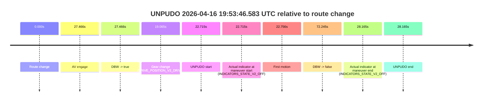
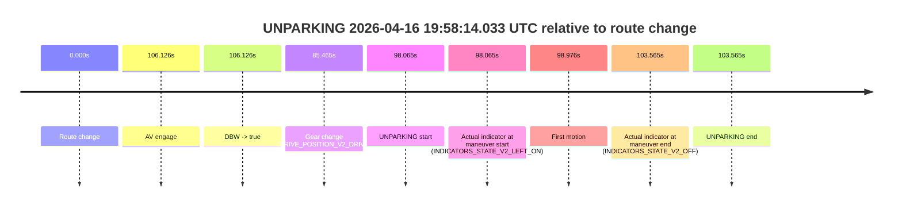

# Run Report: fme10003/2026-04-16--19-24-49--gen2-av-efcae025-505c-4f56-8e93-d7a303dfafcb

| Field | Value |
|---|---|
| Run ID | `fme10003/2026-04-16--19-24-49--gen2-av-efcae025-505c-4f56-8e93-d7a303dfafcb` |
| Date | `2026-04-16` |
| Model(s) | `apricot-crocodile-uproarious` |
| Author | `guy.geva` |
| Event count | `5` |

## unpudo 2026-04-16 19:31:33.933 UTC

| Field | Value |
|---|---|
| Model | `apricot-crocodile-uproarious` |
| Author | `guy.geva` |
| Run ID | `fme10003/2026-04-16--19-24-49--gen2-av-efcae025-505c-4f56-8e93-d7a303dfafcb` |
| Date | `2026-04-16` |
| Time (UTC) | `19:31:33.933` |
| Event type | `unpudo` |
| Disengagement type | `failed_to_unpudo` |
| Route change | `found` |
| Console | [run](https://console.sso.wayve.ai/run/fme10003/2026-04-16--19-24-49--gen2-av-efcae025-505c-4f56-8e93-d7a303dfafcb?id=&time-unixus=1776367893933292) |
| Foxglove | [segment](https://app.foxglove.dev/wayve-on-prem/p/prj_0dX18KZdVHg1fmmI/view?ds=foxglove-stream&ds.deviceName=fme10003&ds.start=2026-04-16T19%3A31%3A09.618277Z&ds.end=2026-04-16T19%3A34%3A27.912928Z&layoutId=lay_0e7VD4WIKDQGU73Y&time=2026-04-16T19%3A31%3A33.933292Z) |

### Event card: non-av

- Non-AV: there is no AV-owned portion anywhere inside the detected unpudo timeline, so it is kept for coverage but excluded from model success / failure scoring.

| Event | Time (UTC) | Delta from route change |
|---|---:|---:|
| Route change | 2026-04-16 19:31:19.618 | `0.000s` |
| AV engage | 2026-04-16 19:31:42.734 | `23.116s` |
| DBW -> true | 2026-04-16 19:31:42.734 | `23.116s` |
| Gear change (DRIVE_POSITION_V2_DRIVE) | 2026-04-16 19:31:19.933 | `0.315s` |
| UNPUDO start | 2026-04-16 19:31:33.933 | `14.315s` |
| Actual indicator at maneuver start (INDICATORS_STATE_V2_LEFT_ON) | 2026-04-16 19:31:33.933 | `14.315s` |
| First motion | 2026-04-16 19:31:33.964 | `14.346s` |
| DBW -> false | 2026-04-16 19:34:17.912 | `178.295s` |
| Actual indicator at maneuver end (INDICATORS_STATE_V2_OFF) | 2026-04-16 19:31:41.133 | `21.515s` |
| UNPUDO end | 2026-04-16 19:31:41.133 | `21.515s` |

| Metric | Value |
|---|---|
| Outcome | `non-av` |
| Effective failure type | `none` |
| Route change status | `found` |
| DBW at event start | `false` |
| DBW at event end | `false` |
| Predicted gear at AV start | `DRIVE_POSITION_V2_DRIVE` |
| Actual gear at AV start | `DRIVE_POSITION_V2_DRIVE` |
| Predicted gear at event start | `DRIVE_POSITION_V2_DRIVE` |
| Actual gear at event start | `DRIVE_POSITION_V2_DRIVE` |
| Planned indicator direction | `INDICATORS_STATE_V2_RIGHT_ON` |
| Controller indicator direction | `INDICATORS_STATE_V2_RIGHT_ON` |
| Actual indicator direction | `INDICATORS_STATE_V2_LEFT_ON` |
| Actual indicator at maneuver end | `INDICATORS_STATE_V2_OFF` |
| Driver accel help in AV | `false` |
| Driver accel help timestamp | `n/a` |
| Max accel pedal pct in AV | `0.0%` |
| Max brake pedal pct in AV | `0.0%` |
| Max speed mps in AV | `0.000` |
| Route -> AV | `23.116s` |
| AV -> event start | `-8.801s` |
| AV -> first motion | `-8.771s` |
| AV duration before disengagement | `155.178s` |
| Trajectory waypoint count | `36` |
| Driving-plan step count | `11` |

The scored portion starts from the AV-owned window, not from the pre-AV setup. Route-change search in the stopped pre-event segment was `found`, with the baseline therefore set to route change. At the event anchor the model predicts `DRIVE_POSITION_V2_DRIVE` and the actual gear is `DRIVE_POSITION_V2_DRIVE`. The effective model outcome is `non-av` because `there is no AV-owned overlap inside the event timeline`.

### Resolution

| Field | Value |
|---|---|
| Final outcome | `non-av` |
| Do we agree with this label? | `yes` |
| Source disengagement type | `failed_to_unpudo` |
| Resolved effective failure type | `none` |
| Confidence | `high` |

## unpudo 2026-04-16 19:40:24.483 UTC

| Field | Value |
|---|---|
| Model | `apricot-crocodile-uproarious` |
| Author | `guy.geva` |
| Run ID | `fme10003/2026-04-16--19-24-49--gen2-av-efcae025-505c-4f56-8e93-d7a303dfafcb` |
| Date | `2026-04-16` |
| Time (UTC) | `19:40:24.483` |
| Event type | `unpudo` |
| Disengagement type | `failed_to_unpudo` |
| Route change | `found` |
| Console | [run](https://console.sso.wayve.ai/run/fme10003/2026-04-16--19-24-49--gen2-av-efcae025-505c-4f56-8e93-d7a303dfafcb?id=&time-unixus=1776368424483289) |
| Foxglove | [segment](https://app.foxglove.dev/wayve-on-prem/p/prj_0dX18KZdVHg1fmmI/view?ds=foxglove-stream&ds.deviceName=fme10003&ds.start=2026-04-16T19%3A40%3A02.618684Z&ds.end=2026-04-16T19%3A40%3A58.334672Z&layoutId=lay_0e7VD4WIKDQGU73Y&time=2026-04-16T19%3A40%3A24.483289Z) |

### Event card: non-av

- Non-AV: there is no AV-owned portion anywhere inside the detected unpudo timeline, so it is kept for coverage but excluded from model success / failure scoring.

| Event | Time (UTC) | Delta from route change |
|---|---:|---:|
| Route change | 2026-04-16 19:40:12.618 | `0.000s` |
| AV engage | 2026-04-16 19:40:30.674 | `18.056s` |
| DBW -> true | 2026-04-16 19:40:30.674 | `18.056s` |
| Gear change (DRIVE_POSITION_V2_DRIVE) | 2026-04-16 19:40:12.933 | `0.315s` |
| UNPUDO start | 2026-04-16 19:40:24.483 | `11.865s` |
| Actual indicator at maneuver start (INDICATORS_STATE_V2_LEFT_ON) | 2026-04-16 19:40:24.483 | `11.865s` |
| First motion | 2026-04-16 19:40:24.524 | `11.905s` |
| DBW -> false | 2026-04-16 19:40:48.334 | `35.716s` |
| Actual indicator at maneuver end (INDICATORS_STATE_V2_OFF) | 2026-04-16 19:40:28.233 | `15.615s` |
| UNPUDO end | 2026-04-16 19:40:28.233 | `15.615s` |

| Metric | Value |
|---|---|
| Outcome | `non-av` |
| Effective failure type | `none` |
| Route change status | `found` |
| DBW at event start | `false` |
| DBW at event end | `false` |
| Predicted gear at AV start | `DRIVE_POSITION_V2_DRIVE` |
| Actual gear at AV start | `DRIVE_POSITION_V2_DRIVE` |
| Predicted gear at event start | `DRIVE_POSITION_V2_DRIVE` |
| Actual gear at event start | `DRIVE_POSITION_V2_DRIVE` |
| Planned indicator direction | `INDICATORS_STATE_V2_LEFT_ON` |
| Controller indicator direction | `INDICATORS_STATE_V2_LEFT_ON` |
| Actual indicator direction | `INDICATORS_STATE_V2_LEFT_ON` |
| Actual indicator at maneuver end | `INDICATORS_STATE_V2_OFF` |
| Driver accel help in AV | `false` |
| Driver accel help timestamp | `n/a` |
| Max accel pedal pct in AV | `0.0%` |
| Max brake pedal pct in AV | `0.0%` |
| Max speed mps in AV | `0.000` |
| Route -> AV | `18.056s` |
| AV -> event start | `-6.191s` |
| AV -> first motion | `-6.151s` |
| AV duration before disengagement | `17.660s` |
| Trajectory waypoint count | `37` |
| Driving-plan step count | `11` |

The scored portion starts from the AV-owned window, not from the pre-AV setup. Route-change search in the stopped pre-event segment was `found`, with the baseline therefore set to route change. At the event anchor the model predicts `DRIVE_POSITION_V2_DRIVE` and the actual gear is `DRIVE_POSITION_V2_DRIVE`. The effective model outcome is `non-av` because `there is no AV-owned overlap inside the event timeline`.

### Resolution

| Field | Value |
|---|---|
| Final outcome | `non-av` |
| Do we agree with this label? | `yes` |
| Source disengagement type | `failed_to_unpudo` |
| Resolved effective failure type | `none` |
| Confidence | `high` |

## unpudo 2026-04-16 19:51:48.383 UTC

| Field | Value |
|---|---|
| Model | `apricot-crocodile-uproarious` |
| Author | `guy.geva` |
| Run ID | `fme10003/2026-04-16--19-24-49--gen2-av-efcae025-505c-4f56-8e93-d7a303dfafcb` |
| Date | `2026-04-16` |
| Time (UTC) | `19:51:48.383` |
| Event type | `unpudo` |
| Disengagement type | `uncategorised` |
| Route change | `found` |
| Console | [run](https://console.sso.wayve.ai/run/fme10003/2026-04-16--19-24-49--gen2-av-efcae025-505c-4f56-8e93-d7a303dfafcb?id=&time-unixus=1776369108383299) |
| Foxglove | [segment](https://app.foxglove.dev/wayve-on-prem/p/prj_0dX18KZdVHg1fmmI/view?ds=foxglove-stream&ds.deviceName=fme10003&ds.start=2026-04-16T19%3A51%3A01.118256Z&ds.end=2026-04-16T19%3A53%3A39.094149Z&layoutId=lay_0e7VD4WIKDQGU73Y&time=2026-04-16T19%3A51%3A48.383299Z) |

### Event card: non-av

- Non-AV: there is no AV-owned portion anywhere inside the detected unpudo timeline, so it is kept for coverage but excluded from model success / failure scoring.

| Event | Time (UTC) | Delta from route change |
|---|---:|---:|
| Route change | 2026-04-16 19:51:11.118 | `0.000s` |
| AV engage | 2026-04-16 19:51:56.294 | `45.176s` |
| DBW -> true | 2026-04-16 19:51:56.294 | `45.176s` |
| Gear change (DRIVE_POSITION_V2_DRIVE) | 2026-04-16 19:51:45.283 | `34.165s` |
| UNPUDO start | 2026-04-16 19:51:48.383 | `37.265s` |
| Actual indicator at maneuver start (INDICATORS_STATE_V2_LEFT_ON) | 2026-04-16 19:51:48.383 | `37.265s` |
| First motion | 2026-04-16 19:51:48.584 | `37.466s` |
| DBW -> false | 2026-04-16 19:53:29.094 | `137.976s` |
| Actual indicator at maneuver end (INDICATORS_STATE_V2_OFF) | 2026-04-16 19:51:53.433 | `42.315s` |
| UNPUDO end | 2026-04-16 19:51:53.433 | `42.315s` |

| Metric | Value |
|---|---|
| Outcome | `non-av` |
| Effective failure type | `none` |
| Route change status | `found` |
| DBW at event start | `false` |
| DBW at event end | `false` |
| Predicted gear at AV start | `DRIVE_POSITION_V2_DRIVE` |
| Actual gear at AV start | `DRIVE_POSITION_V2_DRIVE` |
| Predicted gear at event start | `DRIVE_POSITION_V2_DRIVE` |
| Actual gear at event start | `DRIVE_POSITION_V2_DRIVE` |
| Planned indicator direction | `INDICATORS_STATE_V2_LEFT_ON` |
| Controller indicator direction | `INDICATORS_STATE_V2_LEFT_ON` |
| Actual indicator direction | `INDICATORS_STATE_V2_LEFT_ON` |
| Actual indicator at maneuver end | `INDICATORS_STATE_V2_OFF` |
| Driver accel help in AV | `false` |
| Driver accel help timestamp | `n/a` |
| Max accel pedal pct in AV | `0.0%` |
| Max brake pedal pct in AV | `0.0%` |
| Max speed mps in AV | `0.000` |
| Route -> AV | `45.176s` |
| AV -> event start | `-7.911s` |
| AV -> first motion | `-7.710s` |
| AV duration before disengagement | `92.800s` |
| Trajectory waypoint count | `37` |
| Driving-plan step count | `11` |

The scored portion starts from the AV-owned window, not from the pre-AV setup. Route-change search in the stopped pre-event segment was `found`, with the baseline therefore set to route change. At the event anchor the model predicts `DRIVE_POSITION_V2_DRIVE` and the actual gear is `DRIVE_POSITION_V2_DRIVE`. The effective model outcome is `non-av` because `there is no AV-owned overlap inside the event timeline`.

### Resolution

| Field | Value |
|---|---|
| Final outcome | `non-av` |
| Do we agree with this label? | `yes` |
| Source disengagement type | `uncategorised` |
| Resolved effective failure type | `none` |
| Confidence | `high` |

## unpudo 2026-04-16 19:53:46.583 UTC

| Field | Value |
|---|---|
| Model | `apricot-crocodile-uproarious` |
| Author | `guy.geva` |
| Run ID | `fme10003/2026-04-16--19-24-49--gen2-av-efcae025-505c-4f56-8e93-d7a303dfafcb` |
| Date | `2026-04-16` |
| Time (UTC) | `19:53:46.583` |
| Event type | `unpudo` |
| Disengagement type | `none observed` |
| Route change | `found` |
| Console | [run](https://console.sso.wayve.ai/run/fme10003/2026-04-16--19-24-49--gen2-av-efcae025-505c-4f56-8e93-d7a303dfafcb?id=&time-unixus=1776369226583314) |
| Foxglove | [segment](https://app.foxglove.dev/wayve-on-prem/p/prj_0dX18KZdVHg1fmmI/view?ds=foxglove-stream&ds.deviceName=fme10003&ds.start=2026-04-16T19%3A53%3A13.868327Z&ds.end=2026-04-16T19%3A54%3A46.113502Z&layoutId=lay_0e7VD4WIKDQGU73Y&time=2026-04-16T19%3A53%3A46.583314Z) |

### Event card: accidental

- Accidental: AV ownership is present for less than `2s`, so this is treated as an accidental brush with the maneuver rather than a meaningful model attempt.

| Event | Time (UTC) | Delta from route change |
|---|---:|---:|
| Route change | 2026-04-16 19:53:23.868 | `0.000s` |
| AV engage | 2026-04-16 19:53:51.334 | `27.466s` |
| DBW -> true | 2026-04-16 19:53:51.334 | `27.466s` |
| Gear change (DRIVE_POSITION_V2_DRIVE) | 2026-04-16 19:53:42.933 | `19.065s` |
| UNPUDO start | 2026-04-16 19:53:46.583 | `22.715s` |
| Actual indicator at maneuver start (INDICATORS_STATE_V2_OFF) | 2026-04-16 19:53:46.583 | `22.715s` |
| First motion | 2026-04-16 19:53:46.624 | `22.756s` |
| DBW -> false | 2026-04-16 19:54:36.113 | `72.245s` |
| Actual indicator at maneuver end (INDICATORS_STATE_V2_OFF) | 2026-04-16 19:53:52.033 | `28.165s` |
| UNPUDO end | 2026-04-16 19:53:52.033 | `28.165s` |

| Metric | Value |
|---|---|
| Outcome | `accidental` |
| Effective failure type | `none` |
| Route change status | `found` |
| DBW at event start | `false` |
| DBW at event end | `true` |
| Predicted gear at AV start | `DRIVE_POSITION_V2_DRIVE` |
| Actual gear at AV start | `DRIVE_POSITION_V2_DRIVE` |
| Predicted gear at event start | `DRIVE_POSITION_V2_DRIVE` |
| Actual gear at event start | `DRIVE_POSITION_V2_DRIVE` |
| Planned indicator direction | `INDICATORS_STATE_V2_OFF` |
| Controller indicator direction | `INDICATORS_STATE_V2_OFF` |
| Actual indicator direction | `INDICATORS_STATE_V2_OFF` |
| Actual indicator at maneuver end | `INDICATORS_STATE_V2_OFF` |
| Driver accel help in AV | `false` |
| Driver accel help timestamp | `n/a` |
| Max accel pedal pct in AV | `0.0%` |
| Max brake pedal pct in AV | `0.0%` |
| Max speed mps in AV | `3.081` |
| Route -> AV | `27.466s` |
| AV -> event start | `-4.751s` |
| AV -> first motion | `-4.711s` |
| AV duration before disengagement | `44.779s` |
| Trajectory waypoint count | `37` |
| Driving-plan step count | `11` |

The scored portion starts from the AV-owned window, not from the pre-AV setup. Route-change search in the stopped pre-event segment was `found`, with the baseline therefore set to route change. At the event anchor the model predicts `DRIVE_POSITION_V2_DRIVE` and the actual gear is `DRIVE_POSITION_V2_DRIVE`. The effective model outcome is `accidental` because `the AV-owned portion is shorter than 2s`.

### Resolution

| Field | Value |
|---|---|
| Final outcome | `accidental` |
| Do we agree with this label? | `yes` |
| Source disengagement type | `none observed` |
| Resolved effective failure type | `none` |
| Confidence | `high` |

## unparking 2026-04-16 19:58:14.033 UTC

| Field | Value |
|---|---|
| Model | `apricot-crocodile-uproarious` |
| Author | `guy.geva` |
| Run ID | `fme10003/2026-04-16--19-24-49--gen2-av-efcae025-505c-4f56-8e93-d7a303dfafcb` |
| Date | `2026-04-16` |
| Time (UTC) | `19:58:14.033` |
| Event type | `unparking` |
| Disengagement type | `failed_to_unpudo` |
| Route change | `found` |
| Console | [run](https://console.sso.wayve.ai/run/fme10003/2026-04-16--19-24-49--gen2-av-efcae025-505c-4f56-8e93-d7a303dfafcb?id=&time-unixus=1776369494033311) |
| Foxglove | [segment](https://app.foxglove.dev/wayve-on-prem/p/prj_0dX18KZdVHg1fmmI/view?ds=foxglove-stream&ds.deviceName=fme10003&ds.start=2026-04-16T19%3A56%3A25.968248Z&ds.end=2026-04-16T19%3A58%3A29.533314Z&layoutId=lay_0e7VD4WIKDQGU73Y&time=2026-04-16T19%3A58%3A14.033311Z) |

### Event card: non-av

- Non-AV: there is no AV-owned portion anywhere inside the detected unparking timeline, so it is kept for coverage but excluded from model success / failure scoring.

| Event | Time (UTC) | Delta from route change |
|---|---:|---:|
| Route change | 2026-04-16 19:56:35.968 | `0.000s` |
| AV engage | 2026-04-16 19:58:22.094 | `106.126s` |
| DBW -> true | 2026-04-16 19:58:22.094 | `106.126s` |
| Gear change (DRIVE_POSITION_V2_DRIVE) | 2026-04-16 19:58:01.433 | `85.465s` |
| UNPARKING start | 2026-04-16 19:58:14.033 | `98.065s` |
| Actual indicator at maneuver start (INDICATORS_STATE_V2_LEFT_ON) | 2026-04-16 19:58:14.033 | `98.065s` |
| First motion | 2026-04-16 19:58:14.944 | `98.976s` |
| Actual indicator at maneuver end (INDICATORS_STATE_V2_OFF) | 2026-04-16 19:58:19.533 | `103.565s` |
| UNPARKING end | 2026-04-16 19:58:19.533 | `103.565s` |

| Metric | Value |
|---|---|
| Outcome | `non-av` |
| Effective failure type | `none` |
| Route change status | `found` |
| DBW at event start | `false` |
| DBW at event end | `false` |
| Predicted gear at AV start | `DRIVE_POSITION_V2_DRIVE` |
| Actual gear at AV start | `DRIVE_POSITION_V2_DRIVE` |
| Predicted gear at event start | `DRIVE_POSITION_V2_DRIVE` |
| Actual gear at event start | `DRIVE_POSITION_V2_DRIVE` |
| Planned indicator direction | `INDICATORS_STATE_V2_RIGHT_ON` |
| Controller indicator direction | `INDICATORS_STATE_V2_RIGHT_ON` |
| Actual indicator direction | `INDICATORS_STATE_V2_LEFT_ON` |
| Actual indicator at maneuver end | `INDICATORS_STATE_V2_OFF` |
| Driver accel help in AV | `false` |
| Driver accel help timestamp | `n/a` |
| Max accel pedal pct in AV | `0.0%` |
| Max brake pedal pct in AV | `0.0%` |
| Max speed mps in AV | `0.000` |
| Route -> AV | `106.126s` |
| AV -> event start | `-8.061s` |
| AV -> first motion | `-7.151s` |
| AV duration before disengagement | `n/a` |
| Trajectory waypoint count | `36` |
| Driving-plan step count | `11` |

The scored portion starts from the AV-owned window, not from the pre-AV setup. Route-change search in the stopped pre-event segment was `found`, with the baseline therefore set to route change. At the event anchor the model predicts `DRIVE_POSITION_V2_DRIVE` and the actual gear is `DRIVE_POSITION_V2_DRIVE`. The effective model outcome is `non-av` because `there is no AV-owned overlap inside the event timeline`.

### Resolution

| Field | Value |
|---|---|
| Final outcome | `non-av` |
| Do we agree with this label? | `yes` |
| Source disengagement type | `failed_to_unpudo` |
| Resolved effective failure type | `none` |
| Confidence | `high` |
