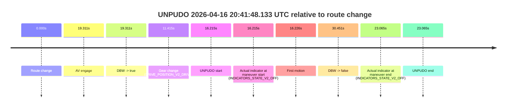
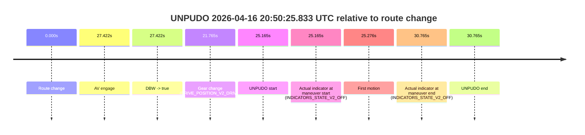

# Run Report: fme10003/2026-04-16--20-29-29--gen2-av-ecba793c-ace7-49f6-aa3b-9d7071a240c4

| Field | Value |
|---|---|
| Run ID | `fme10003/2026-04-16--20-29-29--gen2-av-ecba793c-ace7-49f6-aa3b-9d7071a240c4` |
| Date | `2026-04-16` |
| Model(s) | `apricot-crocodile-uproarious` |
| Author | `guy.geva` |
| Event count | `2` |

## unpudo 2026-04-16 20:41:48.133 UTC

| Field | Value |
|---|---|
| Model | `apricot-crocodile-uproarious` |
| Author | `guy.geva` |
| Run ID | `fme10003/2026-04-16--20-29-29--gen2-av-ecba793c-ace7-49f6-aa3b-9d7071a240c4` |
| Date | `2026-04-16` |
| Time (UTC) | `20:41:48.133` |
| Event type | `unpudo` |
| Disengagement type | `failed_to_unpudo` |
| Route change | `found` |
| Console | [run](https://console.sso.wayve.ai/run/fme10003/2026-04-16--20-29-29--gen2-av-ecba793c-ace7-49f6-aa3b-9d7071a240c4?id=&time-unixus=1776372108133310) |
| Foxglove | [segment](https://app.foxglove.dev/wayve-on-prem/p/prj_0dX18KZdVHg1fmmI/view?ds=foxglove-stream&ds.deviceName=fme10003&ds.start=2026-04-16T20%3A41%3A21.918315Z&ds.end=2026-04-16T20%3A42%3A12.369160Z&layoutId=lay_0e7VD4WIKDQGU73Y&time=2026-04-16T20%3A41%3A48.133310Z) |

### Event card: fail

- Fail: AV owns part of the segment, but the event still resolves as a model-performance failure under the AV-only scoring rule.

| Event | Time (UTC) | Delta from route change |
|---|---:|---:|
| Route change | 2026-04-16 20:41:31.918 | `0.000s` |
| AV engage | 2026-04-16 20:41:51.229 | `19.311s` |
| DBW -> true | 2026-04-16 20:41:51.229 | `19.311s` |
| Gear change (DRIVE_POSITION_V2_DRIVE) | 2026-04-16 20:41:43.333 | `11.415s` |
| UNPUDO start | 2026-04-16 20:41:48.133 | `16.215s` |
| Actual indicator at maneuver start (INDICATORS_STATE_V2_OFF) | 2026-04-16 20:41:48.133 | `16.215s` |
| First motion | 2026-04-16 20:41:48.144 | `16.226s` |
| DBW -> false | 2026-04-16 20:42:02.369 | `30.451s` |
| Actual indicator at maneuver end (INDICATORS_STATE_V2_OFF) | 2026-04-16 20:41:54.983 | `23.065s` |
| UNPUDO end | 2026-04-16 20:41:54.983 | `23.065s` |

| Metric | Value |
|---|---|
| Outcome | `fail` |
| Effective failure type | `failed_to_unpudo` |
| Route change status | `found` |
| DBW at event start | `false` |
| DBW at event end | `true` |
| Predicted gear at AV start | `DRIVE_POSITION_V2_DRIVE` |
| Actual gear at AV start | `DRIVE_POSITION_V2_DRIVE` |
| Predicted gear at event start | `DRIVE_POSITION_V2_DRIVE` |
| Actual gear at event start | `DRIVE_POSITION_V2_DRIVE` |
| Planned indicator direction | `INDICATORS_STATE_V2_OFF` |
| Controller indicator direction | `INDICATORS_STATE_V2_OFF` |
| Actual indicator direction | `INDICATORS_STATE_V2_OFF` |
| Actual indicator at maneuver end | `INDICATORS_STATE_V2_OFF` |
| Driver accel help in AV | `false` |
| Driver accel help timestamp | `n/a` |
| Max accel pedal pct in AV | `0.0%` |
| Max brake pedal pct in AV | `0.0%` |
| Max speed mps in AV | `2.250` |
| Route -> AV | `19.311s` |
| AV -> event start | `-3.096s` |
| AV -> first motion | `-3.085s` |
| AV duration before disengagement | `11.140s` |
| Trajectory waypoint count | `36` |
| Driving-plan step count | `11` |

The scored portion starts from the AV-owned window, not from the pre-AV setup. Route-change search in the stopped pre-event segment was `found`, with the baseline therefore set to route change. At the event anchor the model predicts `DRIVE_POSITION_V2_DRIVE` and the actual gear is `DRIVE_POSITION_V2_DRIVE`. The effective model outcome is `fail` because `failed_to_unpudo`.

### Resolution

| Field | Value |
|---|---|
| Final outcome | `fail` |
| Do we agree with this label? | `yes` |
| Source disengagement type | `failed_to_unpudo` |
| Resolved effective failure type | `failed_to_unpudo` |
| Confidence | `high` |

## unpudo 2026-04-16 20:50:25.833 UTC

| Field | Value |
|---|---|
| Model | `apricot-crocodile-uproarious` |
| Author | `guy.geva` |
| Run ID | `fme10003/2026-04-16--20-29-29--gen2-av-ecba793c-ace7-49f6-aa3b-9d7071a240c4` |
| Date | `2026-04-16` |
| Time (UTC) | `20:50:25.833` |
| Event type | `unpudo` |
| Disengagement type | `uncategorised` |
| Route change | `found` |
| Console | [run](https://console.sso.wayve.ai/run/fme10003/2026-04-16--20-29-29--gen2-av-ecba793c-ace7-49f6-aa3b-9d7071a240c4?id=&time-unixus=1776372625833298) |
| Foxglove | [segment](https://app.foxglove.dev/wayve-on-prem/p/prj_0dX18KZdVHg1fmmI/view?ds=foxglove-stream&ds.deviceName=fme10003&ds.start=2026-04-16T20%3A49%3A50.668493Z&ds.end=2026-04-16T20%3A50%3A41.433306Z&layoutId=lay_0e7VD4WIKDQGU73Y&time=2026-04-16T20%3A50%3A25.833298Z) |

### Event card: fail

- Fail: AV owns part of the segment, but the event still resolves as a model-performance failure under the AV-only scoring rule.

| Event | Time (UTC) | Delta from route change |
|---|---:|---:|
| Route change | 2026-04-16 20:50:00.668 | `0.000s` |
| AV engage | 2026-04-16 20:50:28.090 | `27.422s` |
| DBW -> true | 2026-04-16 20:50:28.090 | `27.422s` |
| Gear change (DRIVE_POSITION_V2_DRIVE) | 2026-04-16 20:50:22.433 | `21.765s` |
| UNPUDO start | 2026-04-16 20:50:25.833 | `25.165s` |
| Actual indicator at maneuver start (INDICATORS_STATE_V2_OFF) | 2026-04-16 20:50:25.833 | `25.165s` |
| First motion | 2026-04-16 20:50:25.944 | `25.276s` |
| Actual indicator at maneuver end (INDICATORS_STATE_V2_OFF) | 2026-04-16 20:50:31.433 | `30.765s` |
| UNPUDO end | 2026-04-16 20:50:31.433 | `30.765s` |

| Metric | Value |
|---|---|
| Outcome | `fail` |
| Effective failure type | `uncategorised` |
| Route change status | `found` |
| DBW at event start | `false` |
| DBW at event end | `true` |
| Predicted gear at AV start | `DRIVE_POSITION_V2_DRIVE` |
| Actual gear at AV start | `DRIVE_POSITION_V2_DRIVE` |
| Predicted gear at event start | `DRIVE_POSITION_V2_DRIVE` |
| Actual gear at event start | `DRIVE_POSITION_V2_DRIVE` |
| Planned indicator direction | `INDICATORS_STATE_V2_OFF` |
| Controller indicator direction | `INDICATORS_STATE_V2_OFF` |
| Actual indicator direction | `INDICATORS_STATE_V2_OFF` |
| Actual indicator at maneuver end | `INDICATORS_STATE_V2_OFF` |
| Driver accel help in AV | `false` |
| Driver accel help timestamp | `n/a` |
| Max accel pedal pct in AV | `0.0%` |
| Max brake pedal pct in AV | `0.0%` |
| Max speed mps in AV | `2.625` |
| Route -> AV | `27.422s` |
| AV -> event start | `-2.257s` |
| AV -> first motion | `-2.146s` |
| AV duration before disengagement | `n/a` |
| Trajectory waypoint count | `36` |
| Driving-plan step count | `11` |

The scored portion starts from the AV-owned window, not from the pre-AV setup. Route-change search in the stopped pre-event segment was `found`, with the baseline therefore set to route change. At the event anchor the model predicts `DRIVE_POSITION_V2_DRIVE` and the actual gear is `DRIVE_POSITION_V2_DRIVE`. The effective model outcome is `fail` because `uncategorised`.

### Resolution

| Field | Value |
|---|---|
| Final outcome | `fail` |
| Do we agree with this label? | `yes` |
| Source disengagement type | `uncategorised` |
| Resolved effective failure type | `uncategorised` |
| Confidence | `high` |
