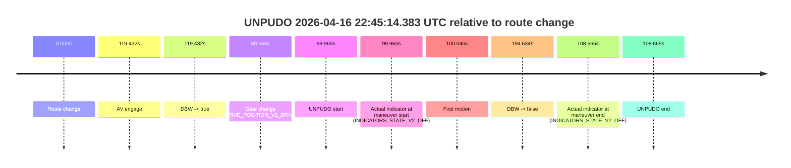
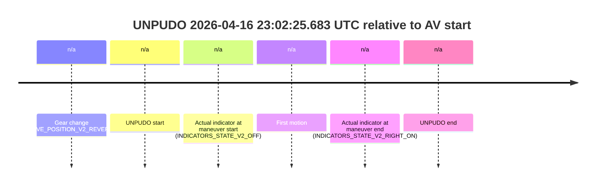

# Run Report: fme10003/2026-04-16--22-10-00--gen2-av-cc9f1ba9-bc10-4268-8f6a-b23c3d200b82

| Field | Value |
|---|---|
| Run ID | `fme10003/2026-04-16--22-10-00--gen2-av-cc9f1ba9-bc10-4268-8f6a-b23c3d200b82` |
| Date | `2026-04-16` |
| Model(s) | `plum-timeless-beaver` |
| Author | `peng.tang` |
| Event count | `2` |

## unpudo 2026-04-16 22:45:14.383 UTC

| Field | Value |
|---|---|
| Model | `plum-timeless-beaver` |
| Author | `peng.tang` |
| Run ID | `fme10003/2026-04-16--22-10-00--gen2-av-cc9f1ba9-bc10-4268-8f6a-b23c3d200b82` |
| Date | `2026-04-16` |
| Time (UTC) | `22:45:14.383` |
| Event type | `unpudo` |
| Disengagement type | `failed_to_unpudo` |
| Route change | `found` |
| Console | [run](https://console.sso.wayve.ai/run/fme10003/2026-04-16--22-10-00--gen2-av-cc9f1ba9-bc10-4268-8f6a-b23c3d200b82?id=&time-unixus=1776379514383322) |
| Foxglove | [segment](https://app.foxglove.dev/wayve-on-prem/p/prj_0dX18KZdVHg1fmmI/view?ds=foxglove-stream&ds.deviceName=fme10003&ds.start=2026-04-16T22%3A43%3A24.418261Z&ds.end=2026-04-16T22%3A46%3A59.051881Z&layoutId=lay_0e7VD4WIKDQGU73Y&time=2026-04-16T22%3A45%3A14.383322Z) |

### Event card: accidental

- Accidental: AV ownership is present for less than `2s`, so this is treated as an accidental brush with the maneuver rather than a meaningful model attempt.

| Event | Time (UTC) | Delta from route change |
|---|---:|---:|
| Route change | 2026-04-16 22:43:34.418 | `0.000s` |
| AV engage | 2026-04-16 22:45:33.850 | `119.432s` |
| DBW -> true | 2026-04-16 22:45:33.850 | `119.432s` |
| Gear change (DRIVE_POSITION_V2_DRIVE) | 2026-04-16 22:45:03.483 | `89.065s` |
| UNPUDO start | 2026-04-16 22:45:14.383 | `99.965s` |
| Actual indicator at maneuver start (INDICATORS_STATE_V2_OFF) | 2026-04-16 22:45:14.383 | `99.965s` |
| First motion | 2026-04-16 22:45:14.464 | `100.046s` |
| DBW -> false | 2026-04-16 22:46:49.051 | `194.634s` |
| Actual indicator at maneuver end (INDICATORS_STATE_V2_OFF) | 2026-04-16 22:45:23.083 | `108.665s` |
| UNPUDO end | 2026-04-16 22:45:23.083 | `108.665s` |

| Metric | Value |
|---|---|
| Outcome | `accidental` |
| Effective failure type | `none` |
| Route change status | `found` |
| DBW at event start | `false` |
| DBW at event end | `false` |
| Predicted gear at AV start | `DRIVE_POSITION_V2_DRIVE` |
| Actual gear at AV start | `DRIVE_POSITION_V2_DRIVE` |
| Predicted gear at event start | `DRIVE_POSITION_V2_DRIVE` |
| Actual gear at event start | `DRIVE_POSITION_V2_DRIVE` |
| Planned indicator direction | `INDICATORS_STATE_V2_OFF` |
| Controller indicator direction | `INDICATORS_STATE_V2_OFF` |
| Actual indicator direction | `INDICATORS_STATE_V2_OFF` |
| Actual indicator at maneuver end | `INDICATORS_STATE_V2_OFF` |
| Driver accel help in AV | `false` |
| Driver accel help timestamp | `n/a` |
| Max accel pedal pct in AV | `0.0%` |
| Max brake pedal pct in AV | `0.0%` |
| Max speed mps in AV | `0.000` |
| Route -> AV | `119.432s` |
| AV -> event start | `-19.467s` |
| AV -> first motion | `-19.386s` |
| AV duration before disengagement | `75.201s` |
| Trajectory waypoint count | `37` |
| Driving-plan step count | `11` |

The scored portion starts from the AV-owned window, not from the pre-AV setup. Route-change search in the stopped pre-event segment was `found`, with the baseline therefore set to route change. At the event anchor the model predicts `DRIVE_POSITION_V2_DRIVE` and the actual gear is `DRIVE_POSITION_V2_DRIVE`. The effective model outcome is `accidental` because `the AV-owned portion is shorter than 2s`.

### Resolution

| Field | Value |
|---|---|
| Final outcome | `accidental` |
| Do we agree with this label? | `yes` |
| Source disengagement type | `failed_to_unpudo` |
| Resolved effective failure type | `none` |
| Confidence | `high` |

## unpudo 2026-04-16 23:02:25.683 UTC

| Field | Value |
|---|---|
| Model | `plum-timeless-beaver` |
| Author | `peng.tang` |
| Run ID | `fme10003/2026-04-16--22-10-00--gen2-av-cc9f1ba9-bc10-4268-8f6a-b23c3d200b82` |
| Date | `2026-04-16` |
| Time (UTC) | `23:02:25.683` |
| Event type | `unpudo` |
| Disengagement type | `failed_to_unpudo` |
| Route change | `not found` |
| Console | [run](https://console.sso.wayve.ai/run/fme10003/2026-04-16--22-10-00--gen2-av-cc9f1ba9-bc10-4268-8f6a-b23c3d200b82?id=&time-unixus=1776380545683310) |
| Foxglove | [segment](https://app.foxglove.dev/wayve-on-prem/p/prj_0dX18KZdVHg1fmmI/view?ds=foxglove-stream&ds.deviceName=fme10003&ds.start=2026-04-16T23%3A02%3A02.883321Z&ds.end=2026-04-16T23%3A02%3A54.883300Z&layoutId=lay_0e7VD4WIKDQGU73Y&time=2026-04-16T23%3A02%3A25.683310Z) |

### Event card: non-av

- Non-AV: the detected unpudo starts outside AV ownership, so it is kept for coverage but excluded from model success / failure scoring.

| Event | Time (UTC) | Delta from AV start |
|---|---:|---:|
| Gear change (DRIVE_POSITION_V2_REVERSE) | 2026-04-16 23:02:12.883 | `n/a` |
| UNPUDO start | 2026-04-16 23:02:25.683 | `n/a` |
| Actual indicator at maneuver start (INDICATORS_STATE_V2_OFF) | 2026-04-16 23:02:25.683 | `n/a` |
| First motion | 2026-04-16 23:02:33.344 | `n/a` |
| Actual indicator at maneuver end (INDICATORS_STATE_V2_RIGHT_ON) | 2026-04-16 23:02:44.883 | `n/a` |
| UNPUDO end | 2026-04-16 23:02:44.883 | `n/a` |

| Metric | Value |
|---|---|
| Outcome | `non-av` |
| Effective failure type | `none` |
| Route change status | `not found` |
| DBW at event start | `false` |
| DBW at event end | `false` |
| Predicted gear at AV start | `n/a` |
| Actual gear at AV start | `n/a` |
| Predicted gear at event start | `DRIVE_POSITION_V2_REVERSE` |
| Actual gear at event start | `DRIVE_POSITION_V2_REVERSE` |
| Planned indicator direction | `INDICATORS_STATE_V2_OFF` |
| Controller indicator direction | `INDICATORS_STATE_V2_OFF` |
| Actual indicator direction | `INDICATORS_STATE_V2_OFF` |
| Actual indicator at maneuver end | `INDICATORS_STATE_V2_RIGHT_ON` |
| Driver accel help in AV | `false` |
| Driver accel help timestamp | `n/a` |
| Max accel pedal pct in AV | `0.0%` |
| Max brake pedal pct in AV | `0.0%` |
| Max speed mps in AV | `0.000` |
| Route -> AV | `n/a` |
| AV -> event start | `n/a` |
| AV -> first motion | `n/a` |
| AV duration before disengagement | `n/a` |
| Trajectory waypoint count | `37` |
| Driving-plan step count | `11` |

The scored portion starts from the AV-owned window, not from the pre-AV setup. Route-change search in the stopped pre-event segment was `not found`, with the baseline therefore set to AV start. At the event anchor the model predicts `DRIVE_POSITION_V2_REVERSE` and the actual gear is `DRIVE_POSITION_V2_REVERSE`. The effective model outcome is `non-av` because `the event does not begin in AV ownership`.

### Resolution

| Field | Value |
|---|---|
| Final outcome | `non-av` |
| Do we agree with this label? | `yes` |
| Source disengagement type | `failed_to_unpudo` |
| Resolved effective failure type | `none` |
| Confidence | `high` |
