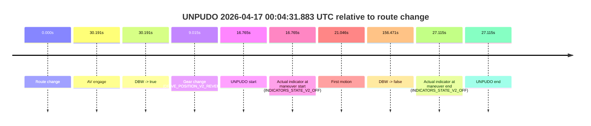
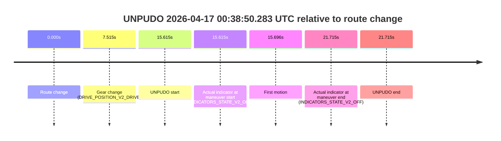
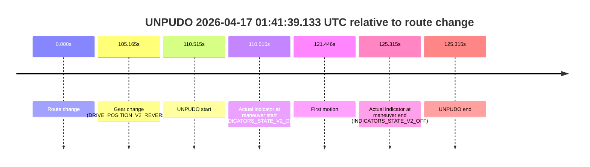

# Run Report: fme10003/2026-04-16--23-55-52--gen2-av-c91fd6fa-85b3-4efe-9205-b4b463237fde

| Field | Value |
|---|---|
| Run ID | `fme10003/2026-04-16--23-55-52--gen2-av-c91fd6fa-85b3-4efe-9205-b4b463237fde` |
| Date | `2026-04-16` |
| Model(s) | `plum-timeless-beaver` |
| Author | `peng.tang` |
| Event count | `5` |

## unpudo 2026-04-17 00:04:31.883 UTC

| Field | Value |
|---|---|
| Model | `plum-timeless-beaver` |
| Author | `peng.tang` |
| Run ID | `fme10003/2026-04-16--23-55-52--gen2-av-c91fd6fa-85b3-4efe-9205-b4b463237fde` |
| Date | `2026-04-16` |
| Time (UTC) | `00:04:31.883` |
| Event type | `unpudo` |
| Disengagement type | `failed_to_unpudo` |
| Route change | `found` |
| Console | [run](https://console.sso.wayve.ai/run/fme10003/2026-04-16--23-55-52--gen2-av-c91fd6fa-85b3-4efe-9205-b4b463237fde?id=&time-unixus=1776384271883311) |
| Foxglove | [segment](https://app.foxglove.dev/wayve-on-prem/p/prj_0dX18KZdVHg1fmmI/view?ds=foxglove-stream&ds.deviceName=fme10003&ds.start=2026-04-17T00%3A04%3A05.118259Z&ds.end=2026-04-17T00%3A07%3A01.589499Z&layoutId=lay_0e7VD4WIKDQGU73Y&time=2026-04-17T00%3A04%3A31.883311Z) |

### Event card: non-av

- Non-AV: there is no AV-owned portion anywhere inside the detected unpudo timeline, so it is kept for coverage but excluded from model success / failure scoring.

| Event | Time (UTC) | Delta from route change |
|---|---:|---:|
| Route change | 2026-04-17 00:04:15.118 | `0.000s` |
| AV engage | 2026-04-17 00:04:45.309 | `30.191s` |
| DBW -> true | 2026-04-17 00:04:45.309 | `30.191s` |
| Gear change (DRIVE_POSITION_V2_REVERSE) | 2026-04-17 00:04:24.133 | `9.015s` |
| UNPUDO start | 2026-04-17 00:04:31.883 | `16.765s` |
| Actual indicator at maneuver start (INDICATORS_STATE_V2_OFF) | 2026-04-17 00:04:31.883 | `16.765s` |
| First motion | 2026-04-17 00:04:36.164 | `21.046s` |
| DBW -> false | 2026-04-17 00:06:51.589 | `156.471s` |
| Actual indicator at maneuver end (INDICATORS_STATE_V2_OFF) | 2026-04-17 00:04:42.233 | `27.115s` |
| UNPUDO end | 2026-04-17 00:04:42.233 | `27.115s` |

| Metric | Value |
|---|---|
| Outcome | `non-av` |
| Effective failure type | `none` |
| Route change status | `found` |
| DBW at event start | `false` |
| DBW at event end | `false` |
| Predicted gear at AV start | `DRIVE_POSITION_V2_DRIVE` |
| Actual gear at AV start | `DRIVE_POSITION_V2_DRIVE` |
| Predicted gear at event start | `DRIVE_POSITION_V2_REVERSE` |
| Actual gear at event start | `DRIVE_POSITION_V2_REVERSE` |
| Planned indicator direction | `INDICATORS_STATE_V2_OFF` |
| Controller indicator direction | `INDICATORS_STATE_V2_OFF` |
| Actual indicator direction | `INDICATORS_STATE_V2_OFF` |
| Actual indicator at maneuver end | `INDICATORS_STATE_V2_OFF` |
| Driver accel help in AV | `false` |
| Driver accel help timestamp | `n/a` |
| Max accel pedal pct in AV | `0.0%` |
| Max brake pedal pct in AV | `0.0%` |
| Max speed mps in AV | `0.000` |
| Route -> AV | `30.191s` |
| AV -> event start | `-13.426s` |
| AV -> first motion | `-9.145s` |
| AV duration before disengagement | `126.280s` |
| Trajectory waypoint count | `37` |
| Driving-plan step count | `11` |

The scored portion starts from the AV-owned window, not from the pre-AV setup. Route-change search in the stopped pre-event segment was `found`, with the baseline therefore set to route change. At the event anchor the model predicts `DRIVE_POSITION_V2_REVERSE` and the actual gear is `DRIVE_POSITION_V2_REVERSE`. The effective model outcome is `non-av` because `there is no AV-owned overlap inside the event timeline`.

### Resolution

| Field | Value |
|---|---|
| Final outcome | `non-av` |
| Do we agree with this label? | `yes` |
| Source disengagement type | `failed_to_unpudo` |
| Resolved effective failure type | `none` |
| Confidence | `high` |

## unpudo 2026-04-17 00:27:50.533 UTC

| Field | Value |
|---|---|
| Model | `plum-timeless-beaver` |
| Author | `peng.tang` |
| Run ID | `fme10003/2026-04-16--23-55-52--gen2-av-c91fd6fa-85b3-4efe-9205-b4b463237fde` |
| Date | `2026-04-16` |
| Time (UTC) | `00:27:50.533` |
| Event type | `unpudo` |
| Disengagement type | `failed_to_unpudo` |
| Route change | `found` |
| Console | [run](https://console.sso.wayve.ai/run/fme10003/2026-04-16--23-55-52--gen2-av-c91fd6fa-85b3-4efe-9205-b4b463237fde?id=&time-unixus=1776385670533317) |
| Foxglove | [segment](https://app.foxglove.dev/wayve-on-prem/p/prj_0dX18KZdVHg1fmmI/view?ds=foxglove-stream&ds.deviceName=fme10003&ds.start=2026-04-17T00%3A27%3A20.168224Z&ds.end=2026-04-17T00%3A30%3A59.029437Z&layoutId=lay_0e7VD4WIKDQGU73Y&time=2026-04-17T00%3A27%3A50.533317Z) |

### Event card: non-av

- Non-AV: there is no AV-owned portion anywhere inside the detected unpudo timeline, so it is kept for coverage but excluded from model success / failure scoring.

| Event | Time (UTC) | Delta from route change |
|---|---:|---:|
| Route change | 2026-04-17 00:27:30.168 | `0.000s` |
| AV engage | 2026-04-17 00:28:19.789 | `49.621s` |
| DBW -> true | 2026-04-17 00:28:19.789 | `49.621s` |
| Gear change (DRIVE_POSITION_V2_REVERSE) | 2026-04-17 00:27:39.033 | `8.865s` |
| UNPUDO start | 2026-04-17 00:27:50.533 | `20.365s` |
| Actual indicator at maneuver start (INDICATORS_STATE_V2_OFF) | 2026-04-17 00:27:50.533 | `20.365s` |
| First motion | 2026-04-17 00:28:12.204 | `42.036s` |
| DBW -> false | 2026-04-17 00:30:49.029 | `198.861s` |
| Actual indicator at maneuver end (INDICATORS_STATE_V2_OFF) | 2026-04-17 00:28:15.733 | `45.565s` |
| UNPUDO end | 2026-04-17 00:28:15.733 | `45.565s` |

| Metric | Value |
|---|---|
| Outcome | `non-av` |
| Effective failure type | `none` |
| Route change status | `found` |
| DBW at event start | `false` |
| DBW at event end | `false` |
| Predicted gear at AV start | `DRIVE_POSITION_V2_DRIVE` |
| Actual gear at AV start | `DRIVE_POSITION_V2_DRIVE` |
| Predicted gear at event start | `DRIVE_POSITION_V2_REVERSE` |
| Actual gear at event start | `DRIVE_POSITION_V2_REVERSE` |
| Planned indicator direction | `INDICATORS_STATE_V2_OFF` |
| Controller indicator direction | `INDICATORS_STATE_V2_OFF` |
| Actual indicator direction | `INDICATORS_STATE_V2_OFF` |
| Actual indicator at maneuver end | `INDICATORS_STATE_V2_OFF` |
| Driver accel help in AV | `false` |
| Driver accel help timestamp | `n/a` |
| Max accel pedal pct in AV | `0.0%` |
| Max brake pedal pct in AV | `0.0%` |
| Max speed mps in AV | `0.000` |
| Route -> AV | `49.621s` |
| AV -> event start | `-29.256s` |
| AV -> first motion | `-7.585s` |
| AV duration before disengagement | `149.240s` |
| Trajectory waypoint count | `36` |
| Driving-plan step count | `11` |

The scored portion starts from the AV-owned window, not from the pre-AV setup. Route-change search in the stopped pre-event segment was `found`, with the baseline therefore set to route change. At the event anchor the model predicts `DRIVE_POSITION_V2_REVERSE` and the actual gear is `DRIVE_POSITION_V2_REVERSE`. The effective model outcome is `non-av` because `there is no AV-owned overlap inside the event timeline`.

### Resolution

| Field | Value |
|---|---|
| Final outcome | `non-av` |
| Do we agree with this label? | `yes` |
| Source disengagement type | `failed_to_unpudo` |
| Resolved effective failure type | `none` |
| Confidence | `high` |

## unpudo 2026-04-17 00:38:50.283 UTC

| Field | Value |
|---|---|
| Model | `plum-timeless-beaver` |
| Author | `peng.tang` |
| Run ID | `fme10003/2026-04-16--23-55-52--gen2-av-c91fd6fa-85b3-4efe-9205-b4b463237fde` |
| Date | `2026-04-16` |
| Time (UTC) | `00:38:50.283` |
| Event type | `unpudo` |
| Disengagement type | `failed_to_unpudo` |
| Route change | `found` |
| Console | [run](https://console.sso.wayve.ai/run/fme10003/2026-04-16--23-55-52--gen2-av-c91fd6fa-85b3-4efe-9205-b4b463237fde?id=&time-unixus=1776386330283288) |
| Foxglove | [segment](https://app.foxglove.dev/wayve-on-prem/p/prj_0dX18KZdVHg1fmmI/view?ds=foxglove-stream&ds.deviceName=fme10003&ds.start=2026-04-17T00%3A38%3A24.668261Z&ds.end=2026-04-17T00%3A39%3A06.383303Z&layoutId=lay_0e7VD4WIKDQGU73Y&time=2026-04-17T00%3A38%3A50.283288Z) |

### Event card: non-av

- Non-AV: there is no AV-owned portion anywhere inside the detected unpudo timeline, so it is kept for coverage but excluded from model success / failure scoring.

| Event | Time (UTC) | Delta from route change |
|---|---:|---:|
| Route change | 2026-04-17 00:38:34.668 | `0.000s` |
| Gear change (DRIVE_POSITION_V2_DRIVE) | 2026-04-17 00:38:42.183 | `7.515s` |
| UNPUDO start | 2026-04-17 00:38:50.283 | `15.615s` |
| Actual indicator at maneuver start (INDICATORS_STATE_V2_OFF) | 2026-04-17 00:38:50.283 | `15.615s` |
| First motion | 2026-04-17 00:38:50.364 | `15.696s` |
| Actual indicator at maneuver end (INDICATORS_STATE_V2_OFF) | 2026-04-17 00:38:56.383 | `21.715s` |
| UNPUDO end | 2026-04-17 00:38:56.383 | `21.715s` |

| Metric | Value |
|---|---|
| Outcome | `non-av` |
| Effective failure type | `none` |
| Route change status | `found` |
| DBW at event start | `false` |
| DBW at event end | `false` |
| Predicted gear at AV start | `n/a` |
| Actual gear at AV start | `n/a` |
| Predicted gear at event start | `DRIVE_POSITION_V2_DRIVE` |
| Actual gear at event start | `DRIVE_POSITION_V2_DRIVE` |
| Planned indicator direction | `INDICATORS_STATE_V2_OFF` |
| Controller indicator direction | `INDICATORS_STATE_V2_OFF` |
| Actual indicator direction | `INDICATORS_STATE_V2_OFF` |
| Actual indicator at maneuver end | `INDICATORS_STATE_V2_OFF` |
| Driver accel help in AV | `false` |
| Driver accel help timestamp | `n/a` |
| Max accel pedal pct in AV | `0.0%` |
| Max brake pedal pct in AV | `0.0%` |
| Max speed mps in AV | `0.000` |
| Route -> AV | `n/a` |
| AV -> event start | `n/a` |
| AV -> first motion | `n/a` |
| AV duration before disengagement | `n/a` |
| Trajectory waypoint count | `37` |
| Driving-plan step count | `11` |

The scored portion starts from the AV-owned window, not from the pre-AV setup. Route-change search in the stopped pre-event segment was `found`, with the baseline therefore set to route change. At the event anchor the model predicts `DRIVE_POSITION_V2_DRIVE` and the actual gear is `DRIVE_POSITION_V2_DRIVE`. The effective model outcome is `non-av` because `there is no AV-owned overlap inside the event timeline`.

### Resolution

| Field | Value |
|---|---|
| Final outcome | `non-av` |
| Do we agree with this label? | `yes` |
| Source disengagement type | `failed_to_unpudo` |
| Resolved effective failure type | `none` |
| Confidence | `high` |

## unpudo 2026-04-17 01:41:39.133 UTC

| Field | Value |
|---|---|
| Model | `plum-timeless-beaver` |
| Author | `peng.tang` |
| Run ID | `fme10003/2026-04-16--23-55-52--gen2-av-c91fd6fa-85b3-4efe-9205-b4b463237fde` |
| Date | `2026-04-16` |
| Time (UTC) | `01:41:39.133` |
| Event type | `unpudo` |
| Disengagement type | `failed_to_unpudo` |
| Route change | `found` |
| Console | [run](https://console.sso.wayve.ai/run/fme10003/2026-04-16--23-55-52--gen2-av-c91fd6fa-85b3-4efe-9205-b4b463237fde?id=&time-unixus=1776390099133293) |
| Foxglove | [segment](https://app.foxglove.dev/wayve-on-prem/p/prj_0dX18KZdVHg1fmmI/view?ds=foxglove-stream&ds.deviceName=fme10003&ds.start=2026-04-17T01%3A39%3A38.618237Z&ds.end=2026-04-17T01%3A42%3A03.933306Z&layoutId=lay_0e7VD4WIKDQGU73Y&time=2026-04-17T01%3A41%3A39.133293Z) |

### Event card: non-av

- Non-AV: there is no AV-owned portion anywhere inside the detected unpudo timeline, so it is kept for coverage but excluded from model success / failure scoring.

| Event | Time (UTC) | Delta from route change |
|---|---:|---:|
| Route change | 2026-04-17 01:39:48.618 | `0.000s` |
| Gear change (DRIVE_POSITION_V2_REVERSE) | 2026-04-17 01:41:33.783 | `105.165s` |
| UNPUDO start | 2026-04-17 01:41:39.133 | `110.515s` |
| Actual indicator at maneuver start (INDICATORS_STATE_V2_OFF) | 2026-04-17 01:41:39.133 | `110.515s` |
| First motion | 2026-04-17 01:41:50.064 | `121.446s` |
| Actual indicator at maneuver end (INDICATORS_STATE_V2_OFF) | 2026-04-17 01:41:53.933 | `125.315s` |
| UNPUDO end | 2026-04-17 01:41:53.933 | `125.315s` |

| Metric | Value |
|---|---|
| Outcome | `non-av` |
| Effective failure type | `none` |
| Route change status | `found` |
| DBW at event start | `false` |
| DBW at event end | `false` |
| Predicted gear at AV start | `n/a` |
| Actual gear at AV start | `n/a` |
| Predicted gear at event start | `DRIVE_POSITION_V2_REVERSE` |
| Actual gear at event start | `DRIVE_POSITION_V2_REVERSE` |
| Planned indicator direction | `INDICATORS_STATE_V2_OFF` |
| Controller indicator direction | `INDICATORS_STATE_V2_OFF` |
| Actual indicator direction | `INDICATORS_STATE_V2_OFF` |
| Actual indicator at maneuver end | `INDICATORS_STATE_V2_OFF` |
| Driver accel help in AV | `false` |
| Driver accel help timestamp | `n/a` |
| Max accel pedal pct in AV | `0.0%` |
| Max brake pedal pct in AV | `0.0%` |
| Max speed mps in AV | `0.000` |
| Route -> AV | `n/a` |
| AV -> event start | `n/a` |
| AV -> first motion | `n/a` |
| AV duration before disengagement | `n/a` |
| Trajectory waypoint count | `36` |
| Driving-plan step count | `11` |

The scored portion starts from the AV-owned window, not from the pre-AV setup. Route-change search in the stopped pre-event segment was `found`, with the baseline therefore set to route change. At the event anchor the model predicts `DRIVE_POSITION_V2_REVERSE` and the actual gear is `DRIVE_POSITION_V2_REVERSE`. The effective model outcome is `non-av` because `there is no AV-owned overlap inside the event timeline`.

### Resolution

| Field | Value |
|---|---|
| Final outcome | `non-av` |
| Do we agree with this label? | `yes` |
| Source disengagement type | `failed_to_unpudo` |
| Resolved effective failure type | `none` |
| Confidence | `high` |

## unpudo 2026-04-17 01:43:55.683 UTC

| Field | Value |
|---|---|
| Model | `plum-timeless-beaver` |
| Author | `peng.tang` |
| Run ID | `fme10003/2026-04-16--23-55-52--gen2-av-c91fd6fa-85b3-4efe-9205-b4b463237fde` |
| Date | `2026-04-16` |
| Time (UTC) | `01:43:55.683` |
| Event type | `unpudo` |
| Disengagement type | `none observed` |
| Route change | `found` |
| Console | [run](https://console.sso.wayve.ai/run/fme10003/2026-04-16--23-55-52--gen2-av-c91fd6fa-85b3-4efe-9205-b4b463237fde?id=&time-unixus=1776390235683305) |
| Foxglove | [segment](https://app.foxglove.dev/wayve-on-prem/p/prj_0dX18KZdVHg1fmmI/view?ds=foxglove-stream&ds.deviceName=fme10003&ds.start=2026-04-17T01%3A42%3A17.018303Z&ds.end=2026-04-17T01%3A44%3A05.683305Z&layoutId=lay_0e7VD4WIKDQGU73Y&time=2026-04-17T01%3A43%3A55.683305Z) |

### Event card: non-av

- Non-AV: there is no AV-owned portion anywhere inside the detected unpudo timeline, so it is kept for coverage but excluded from model success / failure scoring.

| Event | Time (UTC) | Delta from route change |
|---|---:|---:|
| Route change | 2026-04-17 01:42:27.018 | `0.000s` |
| Gear change (DRIVE_POSITION_V2_REVERSE) | 2026-04-17 01:43:47.333 | `80.315s` |
| UNPUDO start | 2026-04-17 01:43:55.683 | `88.665s` |
| Actual indicator at maneuver start (INDICATORS_STATE_V2_OFF) | 2026-04-17 01:43:55.683 | `88.665s` |
| First motion | 2026-04-17 01:44:04.784 | `97.766s` |
| Actual indicator at maneuver end (INDICATORS_STATE_V2_OFF) | 2026-04-17 01:43:55.683 | `88.665s` |
| UNPUDO end | 2026-04-17 01:43:55.683 | `88.665s` |

| Metric | Value |
|---|---|
| Outcome | `non-av` |
| Effective failure type | `none` |
| Route change status | `found` |
| DBW at event start | `false` |
| DBW at event end | `false` |
| Predicted gear at AV start | `n/a` |
| Actual gear at AV start | `n/a` |
| Predicted gear at event start | `DRIVE_POSITION_V2_REVERSE` |
| Actual gear at event start | `DRIVE_POSITION_V2_REVERSE` |
| Planned indicator direction | `INDICATORS_STATE_V2_OFF` |
| Controller indicator direction | `INDICATORS_STATE_V2_OFF` |
| Actual indicator direction | `INDICATORS_STATE_V2_OFF` |
| Actual indicator at maneuver end | `INDICATORS_STATE_V2_OFF` |
| Driver accel help in AV | `false` |
| Driver accel help timestamp | `n/a` |
| Max accel pedal pct in AV | `0.0%` |
| Max brake pedal pct in AV | `0.0%` |
| Max speed mps in AV | `0.000` |
| Route -> AV | `n/a` |
| AV -> event start | `n/a` |
| AV -> first motion | `n/a` |
| AV duration before disengagement | `n/a` |
| Trajectory waypoint count | `37` |
| Driving-plan step count | `11` |

The scored portion starts from the AV-owned window, not from the pre-AV setup. Route-change search in the stopped pre-event segment was `found`, with the baseline therefore set to route change. At the event anchor the model predicts `DRIVE_POSITION_V2_REVERSE` and the actual gear is `DRIVE_POSITION_V2_REVERSE`. The effective model outcome is `non-av` because `there is no AV-owned overlap inside the event timeline`.

### Resolution

| Field | Value |
|---|---|
| Final outcome | `non-av` |
| Do we agree with this label? | `yes` |
| Source disengagement type | `none observed` |
| Resolved effective failure type | `none` |
| Confidence | `high` |
