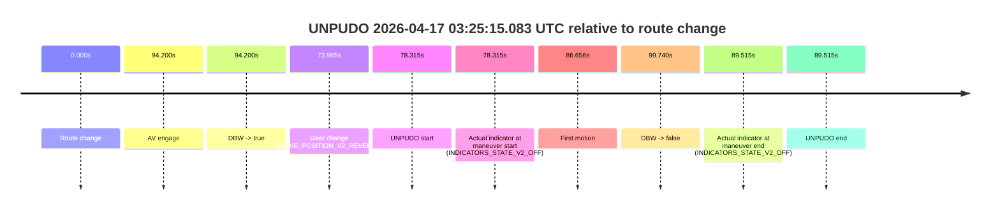
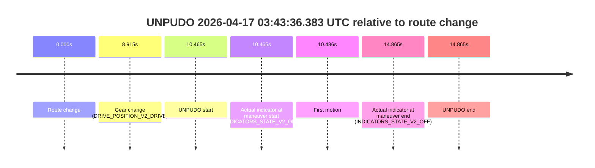
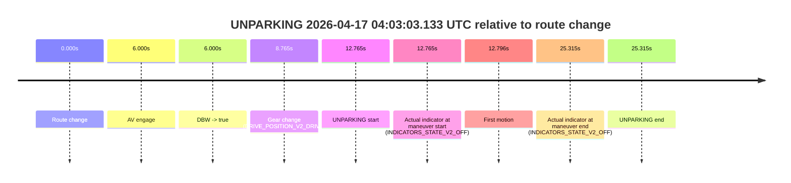

# Run Report: fme10003/2026-04-17--02-42-19--gen2-av-188a141e-4d8d-4369-9830-3cbd631fdcfc

| Field | Value |
|---|---|
| Run ID | `fme10003/2026-04-17--02-42-19--gen2-av-188a141e-4d8d-4369-9830-3cbd631fdcfc` |
| Date | `2026-04-17` |
| Model(s) | `armadillo-amethyst-squeaky` |
| Author | `guy.geva` |
| Event count | `6` |

## unpudo 2026-04-17 02:53:29.433 UTC

| Field | Value |
|---|---|
| Model | `armadillo-amethyst-squeaky` |
| Author | `guy.geva` |
| Run ID | `fme10003/2026-04-17--02-42-19--gen2-av-188a141e-4d8d-4369-9830-3cbd631fdcfc` |
| Date | `2026-04-17` |
| Time (UTC) | `02:53:29.433` |
| Event type | `unpudo` |
| Disengagement type | `failed_to_unpudo` |
| Route change | `found` |
| Console | [run](https://console.sso.wayve.ai/run/fme10003/2026-04-17--02-42-19--gen2-av-188a141e-4d8d-4369-9830-3cbd631fdcfc?id=&time-unixus=1776394409433312) |
| Foxglove | [segment](https://app.foxglove.dev/wayve-on-prem/p/prj_0dX18KZdVHg1fmmI/view?ds=foxglove-stream&ds.deviceName=fme10003&ds.start=2026-04-17T02%3A52%3A31.068262Z&ds.end=2026-04-17T02%3A54%3A06.569712Z&layoutId=lay_0e7VD4WIKDQGU73Y&time=2026-04-17T02%3A53%3A29.433312Z) |

### Event card: accidental

- Accidental: AV ownership is present for less than `2s`, so this is treated as an accidental brush with the maneuver rather than a meaningful model attempt.

| Event | Time (UTC) | Delta from route change |
|---|---:|---:|
| Route change | 2026-04-17 02:52:41.068 | `0.000s` |
| AV engage | 2026-04-17 02:53:44.908 | `63.840s` |
| DBW -> true | 2026-04-17 02:53:44.908 | `63.840s` |
| Gear change (DRIVE_POSITION_V2_REVERSE) | 2026-04-17 02:53:19.033 | `37.965s` |
| UNPUDO start | 2026-04-17 02:53:29.433 | `48.365s` |
| Actual indicator at maneuver start (INDICATORS_STATE_V2_OFF) | 2026-04-17 02:53:29.433 | `48.365s` |
| First motion | 2026-04-17 02:53:35.724 | `54.657s` |
| DBW -> false | 2026-04-17 02:53:56.569 | `75.501s` |
| Actual indicator at maneuver end (INDICATORS_STATE_V2_OFF) | 2026-04-17 02:53:41.533 | `60.465s` |
| UNPUDO end | 2026-04-17 02:53:41.533 | `60.465s` |

| Metric | Value |
|---|---|
| Outcome | `accidental` |
| Effective failure type | `none` |
| Route change status | `found` |
| DBW at event start | `false` |
| DBW at event end | `false` |
| Predicted gear at AV start | `DRIVE_POSITION_V2_DRIVE` |
| Actual gear at AV start | `DRIVE_POSITION_V2_DRIVE` |
| Predicted gear at event start | `DRIVE_POSITION_V2_REVERSE` |
| Actual gear at event start | `DRIVE_POSITION_V2_REVERSE` |
| Planned indicator direction | `INDICATORS_STATE_V2_LEFT_ON` |
| Controller indicator direction | `INDICATORS_STATE_V2_LEFT_ON` |
| Actual indicator direction | `INDICATORS_STATE_V2_OFF` |
| Actual indicator at maneuver end | `INDICATORS_STATE_V2_OFF` |
| Driver accel help in AV | `false` |
| Driver accel help timestamp | `n/a` |
| Max accel pedal pct in AV | `0.0%` |
| Max brake pedal pct in AV | `0.0%` |
| Max speed mps in AV | `0.000` |
| Route -> AV | `63.840s` |
| AV -> event start | `-15.475s` |
| AV -> first motion | `-9.184s` |
| AV duration before disengagement | `11.661s` |
| Trajectory waypoint count | `36` |
| Driving-plan step count | `11` |

The scored portion starts from the AV-owned window, not from the pre-AV setup. Route-change search in the stopped pre-event segment was `found`, with the baseline therefore set to route change. At the event anchor the model predicts `DRIVE_POSITION_V2_REVERSE` and the actual gear is `DRIVE_POSITION_V2_REVERSE`. The effective model outcome is `accidental` because `the AV-owned portion is shorter than 2s`.

### Resolution

| Field | Value |
|---|---|
| Final outcome | `accidental` |
| Do we agree with this label? | `yes` |
| Source disengagement type | `failed_to_unpudo` |
| Resolved effective failure type | `none` |
| Confidence | `high` |

## unpudo 2026-04-17 02:58:40.433 UTC

| Field | Value |
|---|---|
| Model | `armadillo-amethyst-squeaky` |
| Author | `guy.geva` |
| Run ID | `fme10003/2026-04-17--02-42-19--gen2-av-188a141e-4d8d-4369-9830-3cbd631fdcfc` |
| Date | `2026-04-17` |
| Time (UTC) | `02:58:40.433` |
| Event type | `unpudo` |
| Disengagement type | `none observed` |
| Route change | `found` |
| Console | [run](https://console.sso.wayve.ai/run/fme10003/2026-04-17--02-42-19--gen2-av-188a141e-4d8d-4369-9830-3cbd631fdcfc?id=&time-unixus=1776394720433299) |
| Foxglove | [segment](https://app.foxglove.dev/wayve-on-prem/p/prj_0dX18KZdVHg1fmmI/view?ds=foxglove-stream&ds.deviceName=fme10003&ds.start=2026-04-17T02%3A58%3A04.568295Z&ds.end=2026-04-17T02%3A59%3A27.748537Z&layoutId=lay_0e7VD4WIKDQGU73Y&time=2026-04-17T02%3A58%3A40.433299Z) |

### Event card: pass

- Pass: AV owns the credited unpudo through the official event window, the gear state is aligned at the anchor, and the vehicle moves without driver accelerator help in AV.

| Event | Time (UTC) | Delta from route change |
|---|---:|---:|
| Route change | 2026-04-17 02:58:14.568 | `0.000s` |
| AV engage | 2026-04-17 02:58:34.708 | `20.140s` |
| DBW -> true | 2026-04-17 02:58:34.708 | `20.140s` |
| Gear change (DRIVE_POSITION_V2_DRIVE) | 2026-04-17 02:58:36.383 | `21.815s` |
| UNPUDO start | 2026-04-17 02:58:40.433 | `25.865s` |
| Actual indicator at maneuver start (INDICATORS_STATE_V2_OFF) | 2026-04-17 02:58:40.433 | `25.865s` |
| First motion | 2026-04-17 02:58:40.444 | `25.876s` |
| DBW -> false | 2026-04-17 02:59:17.748 | `63.180s` |
| Actual indicator at maneuver end (INDICATORS_STATE_V2_OFF) | 2026-04-17 02:58:44.633 | `30.065s` |
| UNPUDO end | 2026-04-17 02:58:44.633 | `30.065s` |

| Metric | Value |
|---|---|
| Outcome | `pass` |
| Effective failure type | `none` |
| Route change status | `found` |
| DBW at event start | `true` |
| DBW at event end | `true` |
| Predicted gear at AV start | `DRIVE_POSITION_V2_PARK` |
| Actual gear at AV start | `DRIVE_POSITION_V2_PARK` |
| Predicted gear at event start | `DRIVE_POSITION_V2_DRIVE` |
| Actual gear at event start | `DRIVE_POSITION_V2_DRIVE` |
| Planned indicator direction | `INDICATORS_STATE_V2_OFF` |
| Controller indicator direction | `INDICATORS_STATE_V2_OFF` |
| Actual indicator direction | `INDICATORS_STATE_V2_OFF` |
| Actual indicator at maneuver end | `INDICATORS_STATE_V2_OFF` |
| Driver accel help in AV | `false` |
| Driver accel help timestamp | `n/a` |
| Max accel pedal pct in AV | `0.0%` |
| Max brake pedal pct in AV | `8.0%` |
| Max speed mps in AV | `3.197` |
| Route -> AV | `20.140s` |
| AV -> event start | `5.725s` |
| AV -> first motion | `5.736s` |
| AV duration before disengagement | `43.040s` |
| Trajectory waypoint count | `36` |
| Driving-plan step count | `11` |

The scored portion starts from the AV-owned window, not from the pre-AV setup. Route-change search in the stopped pre-event segment was `found`, with the baseline therefore set to route change. At the event anchor the model predicts `DRIVE_POSITION_V2_DRIVE` and the actual gear is `DRIVE_POSITION_V2_DRIVE`. The effective model outcome is `pass` because `the credited maneuver stays AV-owned through the official event end`.

### Resolution

| Field | Value |
|---|---|
| Final outcome | `pass` |
| Do we agree with this label? | `yes` |
| Source disengagement type | `none observed` |
| Resolved effective failure type | `none` |
| Confidence | `high` |

## unpudo 2026-04-17 03:15:34.333 UTC

| Field | Value |
|---|---|
| Model | `armadillo-amethyst-squeaky` |
| Author | `guy.geva` |
| Run ID | `fme10003/2026-04-17--02-42-19--gen2-av-188a141e-4d8d-4369-9830-3cbd631fdcfc` |
| Date | `2026-04-17` |
| Time (UTC) | `03:15:34.333` |
| Event type | `unpudo` |
| Disengagement type | `none observed` |
| Route change | `found` |
| Console | [run](https://console.sso.wayve.ai/run/fme10003/2026-04-17--02-42-19--gen2-av-188a141e-4d8d-4369-9830-3cbd631fdcfc?id=&time-unixus=1776395734333296) |
| Foxglove | [segment](https://app.foxglove.dev/wayve-on-prem/p/prj_0dX18KZdVHg1fmmI/view?ds=foxglove-stream&ds.deviceName=fme10003&ds.start=2026-04-17T03%3A13%3A41.808442Z&ds.end=2026-04-17T03%3A18%3A16.628913Z&layoutId=lay_0e7VD4WIKDQGU73Y&time=2026-04-17T03%3A15%3A34.333296Z) |

### Event card: pass

- Pass: AV owns the credited unpudo through the official event window, the gear state is aligned at the anchor, and the vehicle moves without driver accelerator help in AV.

| Event | Time (UTC) | Delta from route change |
|---|---:|---:|
| Route change | 2026-04-17 03:15:13.318 | `0.000s` |
| AV engage | 2026-04-17 03:13:51.808 | `-81.510s` |
| DBW -> true | 2026-04-17 03:13:51.808 | `-81.510s` |
| Gear change (DRIVE_POSITION_V2_DRIVE) | 2026-04-17 03:15:27.233 | `13.915s` |
| UNPUDO start | 2026-04-17 03:15:34.333 | `21.015s` |
| Actual indicator at maneuver start (INDICATORS_STATE_V2_OFF) | 2026-04-17 03:15:34.333 | `21.015s` |
| First motion | 2026-04-17 03:15:34.364 | `21.046s` |
| DBW -> false | 2026-04-17 03:18:06.628 | `173.311s` |
| Actual indicator at maneuver end (INDICATORS_STATE_V2_OFF) | 2026-04-17 03:15:42.233 | `28.915s` |
| UNPUDO end | 2026-04-17 03:15:42.233 | `28.915s` |

| Metric | Value |
|---|---|
| Outcome | `pass` |
| Effective failure type | `none` |
| Route change status | `found` |
| DBW at event start | `true` |
| DBW at event end | `true` |
| Predicted gear at AV start | `DRIVE_POSITION_V2_DRIVE` |
| Actual gear at AV start | `DRIVE_POSITION_V2_DRIVE` |
| Predicted gear at event start | `DRIVE_POSITION_V2_DRIVE` |
| Actual gear at event start | `DRIVE_POSITION_V2_DRIVE` |
| Planned indicator direction | `INDICATORS_STATE_V2_RIGHT_ON` |
| Controller indicator direction | `INDICATORS_STATE_V2_RIGHT_ON` |
| Actual indicator direction | `INDICATORS_STATE_V2_OFF` |
| Actual indicator at maneuver end | `INDICATORS_STATE_V2_OFF` |
| Driver accel help in AV | `false` |
| Driver accel help timestamp | `n/a` |
| Max accel pedal pct in AV | `0.0%` |
| Max brake pedal pct in AV | `9.7%` |
| Max speed mps in AV | `14.300` |
| Route -> AV | `-81.510s` |
| AV -> event start | `102.525s` |
| AV -> first motion | `102.556s` |
| AV duration before disengagement | `254.820s` |
| Trajectory waypoint count | `36` |
| Driving-plan step count | `11` |

The scored portion starts from the AV-owned window, not from the pre-AV setup. Route-change search in the stopped pre-event segment was `found`, with the baseline therefore set to route change. At the event anchor the model predicts `DRIVE_POSITION_V2_DRIVE` and the actual gear is `DRIVE_POSITION_V2_DRIVE`. The effective model outcome is `pass` because `the credited maneuver stays AV-owned through the official event end`.

### Resolution

| Field | Value |
|---|---|
| Final outcome | `pass` |
| Do we agree with this label? | `yes` |
| Source disengagement type | `none observed` |
| Resolved effective failure type | `none` |
| Confidence | `high` |

## unpudo 2026-04-17 03:25:15.083 UTC

| Field | Value |
|---|---|
| Model | `armadillo-amethyst-squeaky` |
| Author | `guy.geva` |
| Run ID | `fme10003/2026-04-17--02-42-19--gen2-av-188a141e-4d8d-4369-9830-3cbd631fdcfc` |
| Date | `2026-04-17` |
| Time (UTC) | `03:25:15.083` |
| Event type | `unpudo` |
| Disengagement type | `none observed` |
| Route change | `found` |
| Console | [run](https://console.sso.wayve.ai/run/fme10003/2026-04-17--02-42-19--gen2-av-188a141e-4d8d-4369-9830-3cbd631fdcfc?id=&time-unixus=1776396315083294) |
| Foxglove | [segment](https://app.foxglove.dev/wayve-on-prem/p/prj_0dX18KZdVHg1fmmI/view?ds=foxglove-stream&ds.deviceName=fme10003&ds.start=2026-04-17T03%3A23%3A46.768370Z&ds.end=2026-04-17T03%3A25%3A46.508576Z&layoutId=lay_0e7VD4WIKDQGU73Y&time=2026-04-17T03%3A25%3A15.083294Z) |

### Event card: accidental

- Accidental: AV ownership is present for less than `2s`, so this is treated as an accidental brush with the maneuver rather than a meaningful model attempt.

| Event | Time (UTC) | Delta from route change |
|---|---:|---:|
| Route change | 2026-04-17 03:23:56.768 | `0.000s` |
| AV engage | 2026-04-17 03:25:30.968 | `94.200s` |
| DBW -> true | 2026-04-17 03:25:30.968 | `94.200s` |
| Gear change (DRIVE_POSITION_V2_REVERSE) | 2026-04-17 03:25:10.733 | `73.965s` |
| UNPUDO start | 2026-04-17 03:25:15.083 | `78.315s` |
| Actual indicator at maneuver start (INDICATORS_STATE_V2_OFF) | 2026-04-17 03:25:15.083 | `78.315s` |
| First motion | 2026-04-17 03:25:23.424 | `86.656s` |
| DBW -> false | 2026-04-17 03:25:36.508 | `99.740s` |
| Actual indicator at maneuver end (INDICATORS_STATE_V2_OFF) | 2026-04-17 03:25:26.283 | `89.515s` |
| UNPUDO end | 2026-04-17 03:25:26.283 | `89.515s` |

| Metric | Value |
|---|---|
| Outcome | `accidental` |
| Effective failure type | `none` |
| Route change status | `found` |
| DBW at event start | `false` |
| DBW at event end | `false` |
| Predicted gear at AV start | `DRIVE_POSITION_V2_DRIVE` |
| Actual gear at AV start | `DRIVE_POSITION_V2_DRIVE` |
| Predicted gear at event start | `DRIVE_POSITION_V2_REVERSE` |
| Actual gear at event start | `DRIVE_POSITION_V2_REVERSE` |
| Planned indicator direction | `INDICATORS_STATE_V2_OFF` |
| Controller indicator direction | `INDICATORS_STATE_V2_OFF` |
| Actual indicator direction | `INDICATORS_STATE_V2_OFF` |
| Actual indicator at maneuver end | `INDICATORS_STATE_V2_OFF` |
| Driver accel help in AV | `false` |
| Driver accel help timestamp | `n/a` |
| Max accel pedal pct in AV | `0.0%` |
| Max brake pedal pct in AV | `0.0%` |
| Max speed mps in AV | `0.000` |
| Route -> AV | `94.200s` |
| AV -> event start | `-15.885s` |
| AV -> first motion | `-7.544s` |
| AV duration before disengagement | `5.540s` |
| Trajectory waypoint count | `37` |
| Driving-plan step count | `11` |

The scored portion starts from the AV-owned window, not from the pre-AV setup. Route-change search in the stopped pre-event segment was `found`, with the baseline therefore set to route change. At the event anchor the model predicts `DRIVE_POSITION_V2_REVERSE` and the actual gear is `DRIVE_POSITION_V2_REVERSE`. The effective model outcome is `accidental` because `the AV-owned portion is shorter than 2s`.

### Resolution

| Field | Value |
|---|---|
| Final outcome | `accidental` |
| Do we agree with this label? | `yes` |
| Source disengagement type | `none observed` |
| Resolved effective failure type | `none` |
| Confidence | `high` |

## unpudo 2026-04-17 03:43:36.383 UTC

| Field | Value |
|---|---|
| Model | `armadillo-amethyst-squeaky` |
| Author | `guy.geva` |
| Run ID | `fme10003/2026-04-17--02-42-19--gen2-av-188a141e-4d8d-4369-9830-3cbd631fdcfc` |
| Date | `2026-04-17` |
| Time (UTC) | `03:43:36.383` |
| Event type | `unpudo` |
| Disengagement type | `none observed` |
| Route change | `found` |
| Console | [run](https://console.sso.wayve.ai/run/fme10003/2026-04-17--02-42-19--gen2-av-188a141e-4d8d-4369-9830-3cbd631fdcfc?id=&time-unixus=1776397416383314) |
| Foxglove | [segment](https://app.foxglove.dev/wayve-on-prem/p/prj_0dX18KZdVHg1fmmI/view?ds=foxglove-stream&ds.deviceName=fme10003&ds.start=2026-04-17T03%3A43%3A15.918225Z&ds.end=2026-04-17T03%3A43%3A50.783307Z&layoutId=lay_0e7VD4WIKDQGU73Y&time=2026-04-17T03%3A43%3A36.383314Z) |

### Event card: non-av

- Non-AV: the detected unpudo starts outside AV ownership, so it is kept for coverage but excluded from model success / failure scoring.

| Event | Time (UTC) | Delta from route change |
|---|---:|---:|
| Route change | 2026-04-17 03:43:25.918 | `0.000s` |
| Gear change (DRIVE_POSITION_V2_DRIVE) | 2026-04-17 03:43:34.833 | `8.915s` |
| UNPUDO start | 2026-04-17 03:43:36.383 | `10.465s` |
| Actual indicator at maneuver start (INDICATORS_STATE_V2_OFF) | 2026-04-17 03:43:36.383 | `10.465s` |
| First motion | 2026-04-17 03:43:36.404 | `10.486s` |
| Actual indicator at maneuver end (INDICATORS_STATE_V2_OFF) | 2026-04-17 03:43:40.783 | `14.865s` |
| UNPUDO end | 2026-04-17 03:43:40.783 | `14.865s` |

| Metric | Value |
|---|---|
| Outcome | `non-av` |
| Effective failure type | `none` |
| Route change status | `found` |
| DBW at event start | `false` |
| DBW at event end | `false` |
| Predicted gear at AV start | `n/a` |
| Actual gear at AV start | `n/a` |
| Predicted gear at event start | `DRIVE_POSITION_V2_DRIVE` |
| Actual gear at event start | `DRIVE_POSITION_V2_DRIVE` |
| Planned indicator direction | `INDICATORS_STATE_V2_OFF` |
| Controller indicator direction | `INDICATORS_STATE_V2_OFF` |
| Actual indicator direction | `INDICATORS_STATE_V2_OFF` |
| Actual indicator at maneuver end | `INDICATORS_STATE_V2_OFF` |
| Driver accel help in AV | `false` |
| Driver accel help timestamp | `n/a` |
| Max accel pedal pct in AV | `0.0%` |
| Max brake pedal pct in AV | `0.0%` |
| Max speed mps in AV | `0.000` |
| Route -> AV | `n/a` |
| AV -> event start | `n/a` |
| AV -> first motion | `n/a` |
| AV duration before disengagement | `n/a` |
| Trajectory waypoint count | `37` |
| Driving-plan step count | `11` |

The scored portion starts from the AV-owned window, not from the pre-AV setup. Route-change search in the stopped pre-event segment was `found`, with the baseline therefore set to route change. At the event anchor the model predicts `DRIVE_POSITION_V2_DRIVE` and the actual gear is `DRIVE_POSITION_V2_DRIVE`. The effective model outcome is `non-av` because `the event does not begin in AV ownership`.

### Resolution

| Field | Value |
|---|---|
| Final outcome | `non-av` |
| Do we agree with this label? | `yes` |
| Source disengagement type | `none observed` |
| Resolved effective failure type | `none` |
| Confidence | `high` |

## unparking 2026-04-17 04:03:03.133 UTC

| Field | Value |
|---|---|
| Model | `armadillo-amethyst-squeaky` |
| Author | `guy.geva` |
| Run ID | `fme10003/2026-04-17--02-42-19--gen2-av-188a141e-4d8d-4369-9830-3cbd631fdcfc` |
| Date | `2026-04-17` |
| Time (UTC) | `04:03:03.133` |
| Event type | `unparking` |
| Disengagement type | `none observed` |
| Route change | `found` |
| Console | [run](https://console.sso.wayve.ai/run/fme10003/2026-04-17--02-42-19--gen2-av-188a141e-4d8d-4369-9830-3cbd631fdcfc?id=&time-unixus=1776398583133311) |
| Foxglove | [segment](https://app.foxglove.dev/wayve-on-prem/p/prj_0dX18KZdVHg1fmmI/view?ds=foxglove-stream&ds.deviceName=fme10003&ds.start=2026-04-17T04%3A02%3A40.368255Z&ds.end=2026-04-17T04%3A03%3A25.683300Z&layoutId=lay_0e7VD4WIKDQGU73Y&time=2026-04-17T04%3A03%3A03.133311Z) |

### Event card: pass

- Pass: AV owns the credited unparking through the official event window, the gear state is aligned at the anchor, and the vehicle moves without driver accelerator help in AV.

| Event | Time (UTC) | Delta from route change |
|---|---:|---:|
| Route change | 2026-04-17 04:02:50.368 | `0.000s` |
| AV engage | 2026-04-17 04:02:56.368 | `6.000s` |
| DBW -> true | 2026-04-17 04:02:56.368 | `6.000s` |
| Gear change (DRIVE_POSITION_V2_DRIVE) | 2026-04-17 04:02:59.133 | `8.765s` |
| UNPARKING start | 2026-04-17 04:03:03.133 | `12.765s` |
| Actual indicator at maneuver start (INDICATORS_STATE_V2_OFF) | 2026-04-17 04:03:03.133 | `12.765s` |
| First motion | 2026-04-17 04:03:03.164 | `12.796s` |
| Actual indicator at maneuver end (INDICATORS_STATE_V2_OFF) | 2026-04-17 04:03:15.683 | `25.315s` |
| UNPARKING end | 2026-04-17 04:03:15.683 | `25.315s` |

| Metric | Value |
|---|---|
| Outcome | `pass` |
| Effective failure type | `none` |
| Route change status | `found` |
| DBW at event start | `true` |
| DBW at event end | `true` |
| Predicted gear at AV start | `DRIVE_POSITION_V2_PARK` |
| Actual gear at AV start | `DRIVE_POSITION_V2_PARK` |
| Predicted gear at event start | `DRIVE_POSITION_V2_DRIVE` |
| Actual gear at event start | `DRIVE_POSITION_V2_DRIVE` |
| Planned indicator direction | `INDICATORS_STATE_V2_OFF` |
| Controller indicator direction | `INDICATORS_STATE_V2_OFF` |
| Actual indicator direction | `INDICATORS_STATE_V2_OFF` |
| Actual indicator at maneuver end | `INDICATORS_STATE_V2_OFF` |
| Driver accel help in AV | `false` |
| Driver accel help timestamp | `n/a` |
| Max accel pedal pct in AV | `0.0%` |
| Max brake pedal pct in AV | `8.0%` |
| Max speed mps in AV | `2.253` |
| Route -> AV | `6.000s` |
| AV -> event start | `6.765s` |
| AV -> first motion | `6.796s` |
| AV duration before disengagement | `n/a` |
| Trajectory waypoint count | `36` |
| Driving-plan step count | `11` |

The scored portion starts from the AV-owned window, not from the pre-AV setup. Route-change search in the stopped pre-event segment was `found`, with the baseline therefore set to route change. At the event anchor the model predicts `DRIVE_POSITION_V2_DRIVE` and the actual gear is `DRIVE_POSITION_V2_DRIVE`. The effective model outcome is `pass` because `the credited maneuver stays AV-owned through the official event end`.

### Resolution

| Field | Value |
|---|---|
| Final outcome | `pass` |
| Do we agree with this label? | `yes` |
| Source disengagement type | `none observed` |
| Resolved effective failure type | `none` |
| Confidence | `high` |
