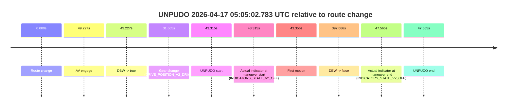
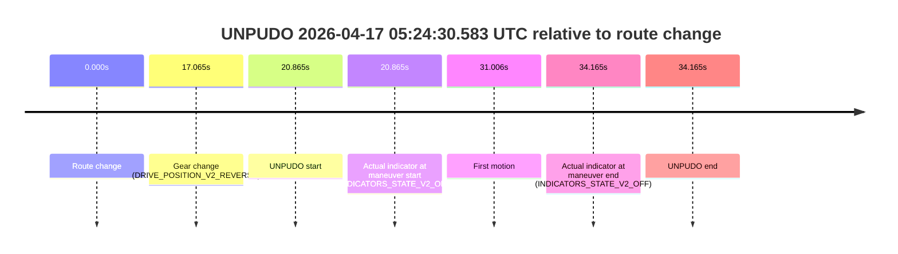
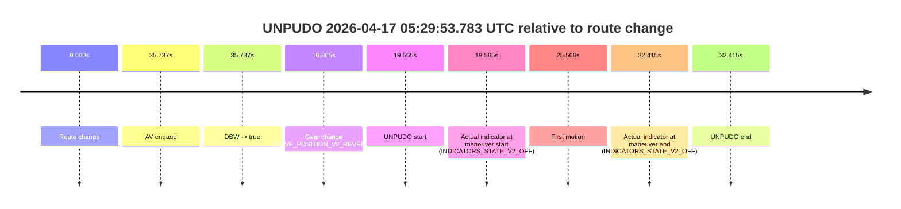

# Run Report: fme10003/2026-04-17--04-34-41--gen2-av-491206b0-76f0-4475-8898-328de5a4739d

| Field | Value |
|---|---|
| Run ID | `fme10003/2026-04-17--04-34-41--gen2-av-491206b0-76f0-4475-8898-328de5a4739d` |
| Date | `2026-04-17` |
| Model(s) | `satisfied-amber-moose` |
| Author | `guy.geva` |
| Event count | `4` |

## unpudo 2026-04-17 05:05:02.783 UTC

| Field | Value |
|---|---|
| Model | `satisfied-amber-moose` |
| Author | `guy.geva` |
| Run ID | `fme10003/2026-04-17--04-34-41--gen2-av-491206b0-76f0-4475-8898-328de5a4739d` |
| Date | `2026-04-17` |
| Time (UTC) | `05:05:02.783` |
| Event type | `unpudo` |
| Disengagement type | `failed_to_unpudo` |
| Route change | `found` |
| Console | [run](https://console.sso.wayve.ai/run/fme10003/2026-04-17--04-34-41--gen2-av-491206b0-76f0-4475-8898-328de5a4739d?id=&time-unixus=1776402302783315) |
| Foxglove | [segment](https://app.foxglove.dev/wayve-on-prem/p/prj_0dX18KZdVHg1fmmI/view?ds=foxglove-stream&ds.deviceName=fme10003&ds.start=2026-04-17T05%3A04%3A09.468407Z&ds.end=2026-04-17T05%3A11%3A01.534577Z&layoutId=lay_0e7VD4WIKDQGU73Y&time=2026-04-17T05%3A05%3A02.783315Z) |

### Event card: fail

- Fail: AV owns part of the segment, but the event still resolves as a model-performance failure under the AV-only scoring rule.

| Event | Time (UTC) | Delta from route change |
|---|---:|---:|
| Route change | 2026-04-17 05:04:19.468 | `0.000s` |
| AV engage | 2026-04-17 05:05:08.695 | `49.227s` |
| DBW -> true | 2026-04-17 05:05:08.695 | `49.227s` |
| Gear change (DRIVE_POSITION_V2_DRIVE) | 2026-04-17 05:04:51.133 | `31.665s` |
| UNPUDO start | 2026-04-17 05:05:02.783 | `43.315s` |
| Actual indicator at maneuver start (INDICATORS_STATE_V2_OFF) | 2026-04-17 05:05:02.783 | `43.315s` |
| First motion | 2026-04-17 05:05:02.824 | `43.356s` |
| DBW -> false | 2026-04-17 05:10:51.534 | `392.066s` |
| Actual indicator at maneuver end (INDICATORS_STATE_V2_OFF) | 2026-04-17 05:05:07.033 | `47.565s` |
| UNPUDO end | 2026-04-17 05:05:07.033 | `47.565s` |

| Metric | Value |
|---|---|
| Outcome | `fail` |
| Effective failure type | `failed_to_unpudo` |
| Route change status | `found` |
| DBW at event start | `false` |
| DBW at event end | `false` |
| Predicted gear at AV start | `DRIVE_POSITION_V2_DRIVE` |
| Actual gear at AV start | `DRIVE_POSITION_V2_DRIVE` |
| Predicted gear at event start | `DRIVE_POSITION_V2_DRIVE` |
| Actual gear at event start | `DRIVE_POSITION_V2_DRIVE` |
| Planned indicator direction | `INDICATORS_STATE_V2_LEFT_ON` |
| Controller indicator direction | `INDICATORS_STATE_V2_LEFT_ON` |
| Actual indicator direction | `INDICATORS_STATE_V2_OFF` |
| Actual indicator at maneuver end | `INDICATORS_STATE_V2_OFF` |
| Driver accel help in AV | `false` |
| Driver accel help timestamp | `n/a` |
| Max accel pedal pct in AV | `0.0%` |
| Max brake pedal pct in AV | `0.0%` |
| Max speed mps in AV | `0.000` |
| Route -> AV | `49.227s` |
| AV -> event start | `-5.912s` |
| AV -> first motion | `-5.871s` |
| AV duration before disengagement | `342.839s` |
| Trajectory waypoint count | `36` |
| Driving-plan step count | `11` |

The scored portion starts from the AV-owned window, not from the pre-AV setup. Route-change search in the stopped pre-event segment was `found`, with the baseline therefore set to route change. At the event anchor the model predicts `DRIVE_POSITION_V2_DRIVE` and the actual gear is `DRIVE_POSITION_V2_DRIVE`. The effective model outcome is `fail` because `failed_to_unpudo`.

### Resolution

| Field | Value |
|---|---|
| Final outcome | `fail` |
| Do we agree with this label? | `yes` |
| Source disengagement type | `failed_to_unpudo` |
| Resolved effective failure type | `failed_to_unpudo` |
| Confidence | `high` |

## unpudo 2026-04-17 05:11:40.833 UTC

| Field | Value |
|---|---|
| Model | `satisfied-amber-moose` |
| Author | `guy.geva` |
| Run ID | `fme10003/2026-04-17--04-34-41--gen2-av-491206b0-76f0-4475-8898-328de5a4739d` |
| Date | `2026-04-17` |
| Time (UTC) | `05:11:40.833` |
| Event type | `unpudo` |
| Disengagement type | `failed_to_unpudo` |
| Route change | `found` |
| Console | [run](https://console.sso.wayve.ai/run/fme10003/2026-04-17--04-34-41--gen2-av-491206b0-76f0-4475-8898-328de5a4739d?id=&time-unixus=1776402700833293) |
| Foxglove | [segment](https://app.foxglove.dev/wayve-on-prem/p/prj_0dX18KZdVHg1fmmI/view?ds=foxglove-stream&ds.deviceName=fme10003&ds.start=2026-04-17T05%3A10%3A29.768231Z&ds.end=2026-04-17T05%3A17%3A59.335500Z&layoutId=lay_0e7VD4WIKDQGU73Y&time=2026-04-17T05%3A11%3A40.833293Z) |

### Event card: fail

- Fail: AV owns part of the segment, but the event still resolves as a model-performance failure under the AV-only scoring rule.

| Event | Time (UTC) | Delta from route change |
|---|---:|---:|
| Route change | 2026-04-17 05:10:39.768 | `0.000s` |
| AV engage | 2026-04-17 05:11:47.535 | `67.767s` |
| DBW -> true | 2026-04-17 05:11:47.535 | `67.767s` |
| Gear change (DRIVE_POSITION_V2_DRIVE) | 2026-04-17 05:11:27.133 | `47.365s` |
| UNPUDO start | 2026-04-17 05:11:40.833 | `61.065s` |
| Actual indicator at maneuver start (INDICATORS_STATE_V2_OFF) | 2026-04-17 05:11:40.833 | `61.065s` |
| First motion | 2026-04-17 05:11:40.884 | `61.116s` |
| DBW -> false | 2026-04-17 05:17:49.335 | `429.567s` |
| Actual indicator at maneuver end (INDICATORS_STATE_V2_OFF) | 2026-04-17 05:11:45.083 | `65.315s` |
| UNPUDO end | 2026-04-17 05:11:45.083 | `65.315s` |

| Metric | Value |
|---|---|
| Outcome | `fail` |
| Effective failure type | `failed_to_unpudo` |
| Route change status | `found` |
| DBW at event start | `false` |
| DBW at event end | `false` |
| Predicted gear at AV start | `DRIVE_POSITION_V2_DRIVE` |
| Actual gear at AV start | `DRIVE_POSITION_V2_DRIVE` |
| Predicted gear at event start | `DRIVE_POSITION_V2_DRIVE` |
| Actual gear at event start | `DRIVE_POSITION_V2_DRIVE` |
| Planned indicator direction | `INDICATORS_STATE_V2_LEFT_ON` |
| Controller indicator direction | `INDICATORS_STATE_V2_LEFT_ON` |
| Actual indicator direction | `INDICATORS_STATE_V2_OFF` |
| Actual indicator at maneuver end | `INDICATORS_STATE_V2_OFF` |
| Driver accel help in AV | `false` |
| Driver accel help timestamp | `n/a` |
| Max accel pedal pct in AV | `0.0%` |
| Max brake pedal pct in AV | `0.0%` |
| Max speed mps in AV | `0.000` |
| Route -> AV | `67.767s` |
| AV -> event start | `-6.702s` |
| AV -> first motion | `-6.651s` |
| AV duration before disengagement | `361.800s` |
| Trajectory waypoint count | `35` |
| Driving-plan step count | `11` |

The scored portion starts from the AV-owned window, not from the pre-AV setup. Route-change search in the stopped pre-event segment was `found`, with the baseline therefore set to route change. At the event anchor the model predicts `DRIVE_POSITION_V2_DRIVE` and the actual gear is `DRIVE_POSITION_V2_DRIVE`. The effective model outcome is `fail` because `failed_to_unpudo`.

### Resolution

| Field | Value |
|---|---|
| Final outcome | `fail` |
| Do we agree with this label? | `yes` |
| Source disengagement type | `failed_to_unpudo` |
| Resolved effective failure type | `failed_to_unpudo` |
| Confidence | `high` |

## unpudo 2026-04-17 05:24:30.583 UTC

| Field | Value |
|---|---|
| Model | `satisfied-amber-moose` |
| Author | `guy.geva` |
| Run ID | `fme10003/2026-04-17--04-34-41--gen2-av-491206b0-76f0-4475-8898-328de5a4739d` |
| Date | `2026-04-17` |
| Time (UTC) | `05:24:30.583` |
| Event type | `unpudo` |
| Disengagement type | `failed_to_unpudo` |
| Route change | `found` |
| Console | [run](https://console.sso.wayve.ai/run/fme10003/2026-04-17--04-34-41--gen2-av-491206b0-76f0-4475-8898-328de5a4739d?id=&time-unixus=1776403470583320) |
| Foxglove | [segment](https://app.foxglove.dev/wayve-on-prem/p/prj_0dX18KZdVHg1fmmI/view?ds=foxglove-stream&ds.deviceName=fme10003&ds.start=2026-04-17T05%3A23%3A59.718264Z&ds.end=2026-04-17T05%3A24%3A53.883302Z&layoutId=lay_0e7VD4WIKDQGU73Y&time=2026-04-17T05%3A24%3A30.583320Z) |

### Event card: fail

- Fail: AV owns part of the segment, but the event still resolves as a model-performance failure under the AV-only scoring rule.

| Event | Time (UTC) | Delta from route change |
|---|---:|---:|
| Route change | 2026-04-17 05:24:09.718 | `0.000s` |
| Gear change (DRIVE_POSITION_V2_REVERSE) | 2026-04-17 05:24:26.783 | `17.065s` |
| UNPUDO start | 2026-04-17 05:24:30.583 | `20.865s` |
| Actual indicator at maneuver start (INDICATORS_STATE_V2_OFF) | 2026-04-17 05:24:30.583 | `20.865s` |
| First motion | 2026-04-17 05:24:40.724 | `31.006s` |
| Actual indicator at maneuver end (INDICATORS_STATE_V2_OFF) | 2026-04-17 05:24:43.883 | `34.165s` |
| UNPUDO end | 2026-04-17 05:24:43.883 | `34.165s` |

| Metric | Value |
|---|---|
| Outcome | `fail` |
| Effective failure type | `failed_to_unpudo` |
| Route change status | `found` |
| DBW at event start | `false` |
| DBW at event end | `false` |
| Predicted gear at AV start | `n/a` |
| Actual gear at AV start | `n/a` |
| Predicted gear at event start | `DRIVE_POSITION_V2_REVERSE` |
| Actual gear at event start | `DRIVE_POSITION_V2_REVERSE` |
| Planned indicator direction | `INDICATORS_STATE_V2_OFF` |
| Controller indicator direction | `INDICATORS_STATE_V2_OFF` |
| Actual indicator direction | `INDICATORS_STATE_V2_OFF` |
| Actual indicator at maneuver end | `INDICATORS_STATE_V2_OFF` |
| Driver accel help in AV | `false` |
| Driver accel help timestamp | `n/a` |
| Max accel pedal pct in AV | `0.0%` |
| Max brake pedal pct in AV | `0.0%` |
| Max speed mps in AV | `0.000` |
| Route -> AV | `n/a` |
| AV -> event start | `n/a` |
| AV -> first motion | `n/a` |
| AV duration before disengagement | `n/a` |
| Trajectory waypoint count | `36` |
| Driving-plan step count | `11` |

The scored portion starts from the AV-owned window, not from the pre-AV setup. Route-change search in the stopped pre-event segment was `found`, with the baseline therefore set to route change. At the event anchor the model predicts `DRIVE_POSITION_V2_REVERSE` and the actual gear is `DRIVE_POSITION_V2_REVERSE`. The effective model outcome is `fail` because `failed_to_unpudo`.

### Resolution

| Field | Value |
|---|---|
| Final outcome | `fail` |
| Do we agree with this label? | `yes` |
| Source disengagement type | `failed_to_unpudo` |
| Resolved effective failure type | `failed_to_unpudo` |
| Confidence | `high` |

## unpudo 2026-04-17 05:29:53.783 UTC

| Field | Value |
|---|---|
| Model | `satisfied-amber-moose` |
| Author | `guy.geva` |
| Run ID | `fme10003/2026-04-17--04-34-41--gen2-av-491206b0-76f0-4475-8898-328de5a4739d` |
| Date | `2026-04-17` |
| Time (UTC) | `05:29:53.783` |
| Event type | `unpudo` |
| Disengagement type | `none observed` |
| Route change | `found` |
| Console | [run](https://console.sso.wayve.ai/run/fme10003/2026-04-17--04-34-41--gen2-av-491206b0-76f0-4475-8898-328de5a4739d?id=&time-unixus=1776403793783298) |
| Foxglove | [segment](https://app.foxglove.dev/wayve-on-prem/p/prj_0dX18KZdVHg1fmmI/view?ds=foxglove-stream&ds.deviceName=fme10003&ds.start=2026-04-17T05%3A29%3A24.218266Z&ds.end=2026-04-17T05%3A30%3A16.633303Z&layoutId=lay_0e7VD4WIKDQGU73Y&time=2026-04-17T05%3A29%3A53.783298Z) |

### Event card: fail

- Fail: the credited unpudo does not stay AV-owned. The event window starts with DBW false, and the maneuver outcome lands outside a clean AV-owned segment.

| Event | Time (UTC) | Delta from route change |
|---|---:|---:|
| Route change | 2026-04-17 05:29:34.218 | `0.000s` |
| AV engage | 2026-04-17 05:30:09.955 | `35.737s` |
| DBW -> true | 2026-04-17 05:30:09.955 | `35.737s` |
| Gear change (DRIVE_POSITION_V2_REVERSE) | 2026-04-17 05:29:45.083 | `10.865s` |
| UNPUDO start | 2026-04-17 05:29:53.783 | `19.565s` |
| Actual indicator at maneuver start (INDICATORS_STATE_V2_OFF) | 2026-04-17 05:29:53.783 | `19.565s` |
| First motion | 2026-04-17 05:29:59.784 | `25.566s` |
| Actual indicator at maneuver end (INDICATORS_STATE_V2_OFF) | 2026-04-17 05:30:06.633 | `32.415s` |
| UNPUDO end | 2026-04-17 05:30:06.633 | `32.415s` |

| Metric | Value |
|---|---|
| Outcome | `fail` |
| Effective failure type | `completed_outside_av` |
| Route change status | `found` |
| DBW at event start | `false` |
| DBW at event end | `false` |
| Predicted gear at AV start | `DRIVE_POSITION_V2_DRIVE` |
| Actual gear at AV start | `DRIVE_POSITION_V2_DRIVE` |
| Predicted gear at event start | `DRIVE_POSITION_V2_REVERSE` |
| Actual gear at event start | `DRIVE_POSITION_V2_REVERSE` |
| Planned indicator direction | `INDICATORS_STATE_V2_OFF` |
| Controller indicator direction | `INDICATORS_STATE_V2_OFF` |
| Actual indicator direction | `INDICATORS_STATE_V2_OFF` |
| Actual indicator at maneuver end | `INDICATORS_STATE_V2_OFF` |
| Driver accel help in AV | `false` |
| Driver accel help timestamp | `n/a` |
| Max accel pedal pct in AV | `0.0%` |
| Max brake pedal pct in AV | `0.0%` |
| Max speed mps in AV | `0.000` |
| Route -> AV | `35.737s` |
| AV -> event start | `-16.172s` |
| AV -> first motion | `-10.171s` |
| AV duration before disengagement | `n/a` |
| Trajectory waypoint count | `36` |
| Driving-plan step count | `11` |

The scored portion starts from the AV-owned window, not from the pre-AV setup. Route-change search in the stopped pre-event segment was `found`, with the baseline therefore set to route change. At the event anchor the model predicts `DRIVE_POSITION_V2_REVERSE` and the actual gear is `DRIVE_POSITION_V2_REVERSE`. The effective model outcome is `fail` because `completed_outside_av`.

### Resolution

| Field | Value |
|---|---|
| Final outcome | `fail` |
| Do we agree with this label? | `yes` |
| Source disengagement type | `none observed` |
| Resolved effective failure type | `completed_outside_av` |
| Confidence | `high` |
