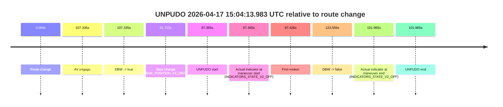
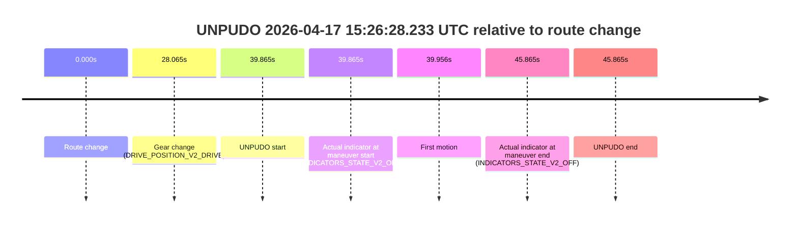

# Run Report: fme10003/2026-04-17--14-46-32--gen2-av-453457b7-473e-453c-875d-9adb73447f33

| Field | Value |
|---|---|
| Run ID | `fme10003/2026-04-17--14-46-32--gen2-av-453457b7-473e-453c-875d-9adb73447f33` |
| Date | `2026-04-17` |
| Model(s) | `apricot-crocodile-uproarious` |
| Author | `guy.geva` |
| Event count | `2` |

## unpudo 2026-04-17 15:04:13.983 UTC

| Field | Value |
|---|---|
| Model | `apricot-crocodile-uproarious` |
| Author | `guy.geva` |
| Run ID | `fme10003/2026-04-17--14-46-32--gen2-av-453457b7-473e-453c-875d-9adb73447f33` |
| Date | `2026-04-17` |
| Time (UTC) | `15:04:13.983` |
| Event type | `unpudo` |
| Disengagement type | `failed_to_unpudo` |
| Route change | `found` |
| Console | [run](https://console.sso.wayve.ai/run/fme10003/2026-04-17--14-46-32--gen2-av-453457b7-473e-453c-875d-9adb73447f33?id=&time-unixus=1776438253983313) |
| Foxglove | [segment](https://app.foxglove.dev/wayve-on-prem/p/prj_0dX18KZdVHg1fmmI/view?ds=foxglove-stream&ds.deviceName=fme10003&ds.start=2026-04-17T15%3A02%3A26.618286Z&ds.end=2026-04-17T15%3A04%3A50.174024Z&layoutId=lay_0e7VD4WIKDQGU73Y&time=2026-04-17T15%3A04%3A13.983313Z) |

### Event card: accidental

- Accidental: AV ownership is present for less than `2s`, so this is treated as an accidental brush with the maneuver rather than a meaningful model attempt.

| Event | Time (UTC) | Delta from route change |
|---|---:|---:|
| Route change | 2026-04-17 15:02:36.618 | `0.000s` |
| AV engage | 2026-04-17 15:04:23.952 | `107.335s` |
| DBW -> true | 2026-04-17 15:04:23.952 | `107.335s` |
| Gear change (DRIVE_POSITION_V2_DRIVE) | 2026-04-17 15:04:08.333 | `91.715s` |
| UNPUDO start | 2026-04-17 15:04:13.983 | `97.365s` |
| Actual indicator at maneuver start (INDICATORS_STATE_V2_OFF) | 2026-04-17 15:04:13.983 | `97.365s` |
| First motion | 2026-04-17 15:04:14.044 | `97.426s` |
| DBW -> false | 2026-04-17 15:04:40.174 | `123.556s` |
| Actual indicator at maneuver end (INDICATORS_STATE_V2_OFF) | 2026-04-17 15:04:18.583 | `101.965s` |
| UNPUDO end | 2026-04-17 15:04:18.583 | `101.965s` |

| Metric | Value |
|---|---|
| Outcome | `accidental` |
| Effective failure type | `none` |
| Route change status | `found` |
| DBW at event start | `false` |
| DBW at event end | `false` |
| Predicted gear at AV start | `DRIVE_POSITION_V2_DRIVE` |
| Actual gear at AV start | `DRIVE_POSITION_V2_DRIVE` |
| Predicted gear at event start | `DRIVE_POSITION_V2_DRIVE` |
| Actual gear at event start | `DRIVE_POSITION_V2_DRIVE` |
| Planned indicator direction | `INDICATORS_STATE_V2_LEFT_ON` |
| Controller indicator direction | `INDICATORS_STATE_V2_LEFT_ON` |
| Actual indicator direction | `INDICATORS_STATE_V2_OFF` |
| Actual indicator at maneuver end | `INDICATORS_STATE_V2_OFF` |
| Driver accel help in AV | `false` |
| Driver accel help timestamp | `n/a` |
| Max accel pedal pct in AV | `0.0%` |
| Max brake pedal pct in AV | `0.0%` |
| Max speed mps in AV | `0.000` |
| Route -> AV | `107.335s` |
| AV -> event start | `-9.970s` |
| AV -> first motion | `-9.909s` |
| AV duration before disengagement | `16.221s` |
| Trajectory waypoint count | `37` |
| Driving-plan step count | `11` |

The scored portion starts from the AV-owned window, not from the pre-AV setup. Route-change search in the stopped pre-event segment was `found`, with the baseline therefore set to route change. At the event anchor the model predicts `DRIVE_POSITION_V2_DRIVE` and the actual gear is `DRIVE_POSITION_V2_DRIVE`. The effective model outcome is `accidental` because `the AV-owned portion is shorter than 2s`.

### Resolution

| Field | Value |
|---|---|
| Final outcome | `accidental` |
| Do we agree with this label? | `yes` |
| Source disengagement type | `failed_to_unpudo` |
| Resolved effective failure type | `none` |
| Confidence | `high` |

## unpudo 2026-04-17 15:26:28.233 UTC

| Field | Value |
|---|---|
| Model | `apricot-crocodile-uproarious` |
| Author | `guy.geva` |
| Run ID | `fme10003/2026-04-17--14-46-32--gen2-av-453457b7-473e-453c-875d-9adb73447f33` |
| Date | `2026-04-17` |
| Time (UTC) | `15:26:28.233` |
| Event type | `unpudo` |
| Disengagement type | `failed_to_unpudo` |
| Route change | `found` |
| Console | [run](https://console.sso.wayve.ai/run/fme10003/2026-04-17--14-46-32--gen2-av-453457b7-473e-453c-875d-9adb73447f33?id=&time-unixus=1776439588233296) |
| Foxglove | [segment](https://app.foxglove.dev/wayve-on-prem/p/prj_0dX18KZdVHg1fmmI/view?ds=foxglove-stream&ds.deviceName=fme10003&ds.start=2026-04-17T15%3A25%3A38.368294Z&ds.end=2026-04-17T15%3A26%3A44.233291Z&layoutId=lay_0e7VD4WIKDQGU73Y&time=2026-04-17T15%3A26%3A28.233296Z) |

### Event card: non-av

- Non-AV: the detected unpudo starts outside AV ownership, so it is kept for coverage but excluded from model success / failure scoring.

| Event | Time (UTC) | Delta from route change |
|---|---:|---:|
| Route change | 2026-04-17 15:25:48.368 | `0.000s` |
| Gear change (DRIVE_POSITION_V2_DRIVE) | 2026-04-17 15:26:16.433 | `28.065s` |
| UNPUDO start | 2026-04-17 15:26:28.233 | `39.865s` |
| Actual indicator at maneuver start (INDICATORS_STATE_V2_OFF) | 2026-04-17 15:26:28.233 | `39.865s` |
| First motion | 2026-04-17 15:26:28.324 | `39.956s` |
| Actual indicator at maneuver end (INDICATORS_STATE_V2_OFF) | 2026-04-17 15:26:34.233 | `45.865s` |
| UNPUDO end | 2026-04-17 15:26:34.233 | `45.865s` |

| Metric | Value |
|---|---|
| Outcome | `non-av` |
| Effective failure type | `none` |
| Route change status | `found` |
| DBW at event start | `false` |
| DBW at event end | `false` |
| Predicted gear at AV start | `n/a` |
| Actual gear at AV start | `n/a` |
| Predicted gear at event start | `DRIVE_POSITION_V2_DRIVE` |
| Actual gear at event start | `DRIVE_POSITION_V2_DRIVE` |
| Planned indicator direction | `INDICATORS_STATE_V2_LEFT_ON` |
| Controller indicator direction | `INDICATORS_STATE_V2_LEFT_ON` |
| Actual indicator direction | `INDICATORS_STATE_V2_OFF` |
| Actual indicator at maneuver end | `INDICATORS_STATE_V2_OFF` |
| Driver accel help in AV | `false` |
| Driver accel help timestamp | `n/a` |
| Max accel pedal pct in AV | `0.0%` |
| Max brake pedal pct in AV | `0.0%` |
| Max speed mps in AV | `0.000` |
| Route -> AV | `n/a` |
| AV -> event start | `n/a` |
| AV -> first motion | `n/a` |
| AV duration before disengagement | `n/a` |
| Trajectory waypoint count | `36` |
| Driving-plan step count | `11` |

The scored portion starts from the AV-owned window, not from the pre-AV setup. Route-change search in the stopped pre-event segment was `found`, with the baseline therefore set to route change. At the event anchor the model predicts `DRIVE_POSITION_V2_DRIVE` and the actual gear is `DRIVE_POSITION_V2_DRIVE`. The effective model outcome is `non-av` because `the event does not begin in AV ownership`.

### Resolution

| Field | Value |
|---|---|
| Final outcome | `non-av` |
| Do we agree with this label? | `yes` |
| Source disengagement type | `failed_to_unpudo` |
| Resolved effective failure type | `none` |
| Confidence | `high` |
