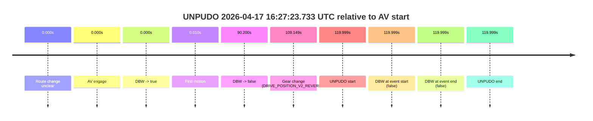
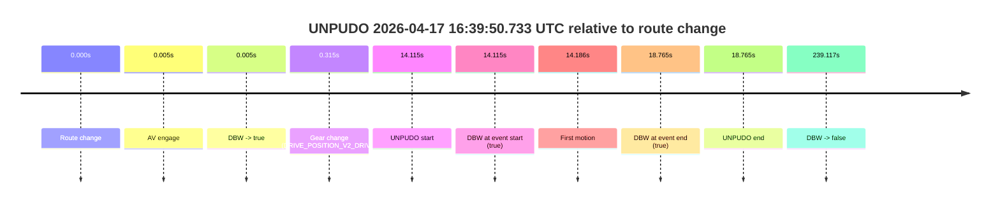
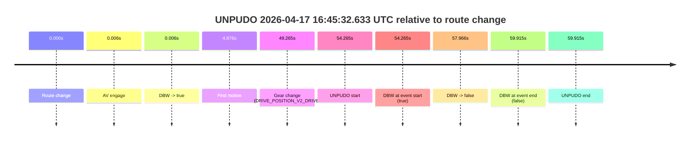

# Run Report: fme10003/2026-04-17--16-12-38--gen2-av-45669217-ec41-4dba-9e0c-e591852a503b

| Field | Value |
|---|---|
| Run ID | `fme10003/2026-04-17--16-12-38--gen2-av-45669217-ec41-4dba-9e0c-e591852a503b` |
| Date | `2026-04-17` |
| Model(s) | `eel-teal-outspoken` |
| Author | `zak` |
| Event count | `6` |

## unpudo 2026-04-17 16:27:23.733 UTC

| Field | Value |
|---|---|
| Model | `eel-teal-outspoken` |
| Author | `zak` |
| Run ID | `fme10003/2026-04-17--16-12-38--gen2-av-45669217-ec41-4dba-9e0c-e591852a503b` |
| Date | `2026-04-17` |
| Time (UTC) | `16:27:23.733` |
| Event type | `unpudo` |
| Disengagement type | `none observed` |
| Route change | `unclear` |
| Console | [run](https://console.sso.wayve.ai/run/fme10003/2026-04-17--16-12-38--gen2-av-45669217-ec41-4dba-9e0c-e591852a503b?id=&time-unixus=1776443243733298) |
| Foxglove | [segment](https://app.foxglove.dev/wayve-on-prem/p/prj_0dX18KZdVHg1fmmI/view?ds=foxglove-stream&ds.deviceName=fme10003&ds.start=2026-04-17T16%3A25%3A13.734306Z&ds.end=2026-04-17T16%3A27%3A33.733298Z&layoutId=lay_0e7VD4WIKDQGU73Y&time=2026-04-17T16%3A27%3A23.733298Z) |

### Event card: fail

- Fail: the credited unpudo does not stay AV-owned. The event window starts with DBW false, and the maneuver outcome lands outside a clean AV-owned segment.

| Event | Time (UTC) | Delta from AV start |
|---|---:|---:|
| Route change unclear | 2026-04-17 16:25:23.734 | `0.000s` |
| AV engage | 2026-04-17 16:25:23.734 | `0.000s` |
| DBW -> true | 2026-04-17 16:25:23.734 | `0.000s` |
| First motion | 2026-04-17 16:25:23.744 | `0.010s` |
| DBW -> false | 2026-04-17 16:26:53.934 | `90.200s` |
| Gear change (DRIVE_POSITION_V2_REVERSE) | 2026-04-17 16:27:12.883 | `109.149s` |
| UNPUDO start | 2026-04-17 16:27:23.733 | `119.999s` |
| DBW at event start (false) | 2026-04-17 16:27:23.733 | `119.999s` |
| DBW at event end (false) | 2026-04-17 16:27:23.733 | `119.999s` |
| UNPUDO end | 2026-04-17 16:27:23.733 | `119.999s` |

| Metric | Value |
|---|---|
| Outcome | `fail` |
| Effective failure type | `not_av_owned` |
| Route change status | `unclear` |
| DBW at event start | `false` |
| DBW at event end | `false` |
| Predicted gear at AV start | `DRIVE_POSITION_V2_DRIVE` |
| Actual gear at AV start | `DRIVE_POSITION_V2_DRIVE` |
| Predicted gear at event start | `DRIVE_POSITION_V2_REVERSE` |
| Actual gear at event start | `DRIVE_POSITION_V2_REVERSE` |
| Planned indicator direction | `INDICATORS_STATE_V2_OFF` |
| Controller indicator direction | `INDICATORS_STATE_V2_OFF` |
| Actual indicator direction | `INDICATORS_STATE_V2_OFF` |
| Actual indicator at maneuver end | `INDICATORS_STATE_V2_OFF` |
| Driver accel help in AV | `false` |
| Driver accel help timestamp | `n/a` |
| Max accel pedal pct in AV | `0.0%` |
| Max brake pedal pct in AV | `28.9%` |
| Max speed mps in AV | `15.731` |
| Success timing baseline | `AV start` |
| Route -> AV | `n/a` |
| AV -> event start | `119.999s` |
| AV -> first motion | `0.010s` |
| Success baseline -> event start | `119.999s` |
| Success baseline -> first motion | `0.010s` |
| AV duration before disengagement | `90.200s` |
| Trajectory waypoint count | `38` |
| Driving-plan step count | `11` |

The scored portion starts from the AV-owned window, not from the pre-AV setup. Route-change search in the stopped pre-event segment was `unclear`, with the baseline therefore set to AV start. At the event anchor the model predicts `DRIVE_POSITION_V2_REVERSE` and the actual gear is `DRIVE_POSITION_V2_REVERSE`. The effective model outcome is `fail` because `not_av_owned.`

### Resolution

| Field | Value |
|---|---|
| Final outcome | `fail` |
| Do we agree with this label? | `yes` |
| Source disengagement type | `none observed` |
| Resolved effective failure type | `not_av_owned` |
| Confidence | `medium` |

## unpudo 2026-04-17 16:39:50.733 UTC

| Field | Value |
|---|---|
| Model | `eel-teal-outspoken` |
| Author | `zak` |
| Run ID | `fme10003/2026-04-17--16-12-38--gen2-av-45669217-ec41-4dba-9e0c-e591852a503b` |
| Date | `2026-04-17` |
| Time (UTC) | `16:39:50.733` |
| Event type | `unpudo` |
| Disengagement type | `none observed` |
| Route change | `found` |
| Console | [run](https://console.sso.wayve.ai/run/fme10003/2026-04-17--16-12-38--gen2-av-45669217-ec41-4dba-9e0c-e591852a503b?id=&time-unixus=1776443990733293) |
| Foxglove | [segment](https://app.foxglove.dev/wayve-on-prem/p/prj_0dX18KZdVHg1fmmI/view?ds=foxglove-stream&ds.deviceName=fme10003&ds.start=2026-04-17T16%3A39%3A26.618302Z&ds.end=2026-04-17T16%3A43%3A45.734859Z&layoutId=lay_0e7VD4WIKDQGU73Y&time=2026-04-17T16%3A39%3A50.733293Z) |

### Event card: pass

- Pass: AV owns the credited unpudo from route change through the official unpudo window, the gear state is aligned at the anchor, and the vehicle moves without driver accelerator help in AV.

| Event | Time (UTC) | Delta from route change |
|---|---:|---:|
| Route change | 2026-04-17 16:39:36.618 | `0.000s` |
| AV engage | 2026-04-17 16:39:36.623 | `0.005s` |
| DBW -> true | 2026-04-17 16:39:36.623 | `0.005s` |
| Gear change (DRIVE_POSITION_V2_DRIVE) | 2026-04-17 16:39:36.933 | `0.315s` |
| UNPUDO start | 2026-04-17 16:39:50.733 | `14.115s` |
| DBW at event start (true) | 2026-04-17 16:39:50.733 | `14.115s` |
| First motion | 2026-04-17 16:39:50.804 | `14.186s` |
| DBW at event end (true) | 2026-04-17 16:39:55.383 | `18.765s` |
| UNPUDO end | 2026-04-17 16:39:55.383 | `18.765s` |
| DBW -> false | 2026-04-17 16:43:35.734 | `239.117s` |

| Metric | Value |
|---|---|
| Outcome | `pass` |
| Effective failure type | `none` |
| Route change status | `found` |
| DBW at event start | `true` |
| DBW at event end | `true` |
| Predicted gear at AV start | `DRIVE_POSITION_V2_PARK` |
| Actual gear at AV start | `DRIVE_POSITION_V2_PARK` |
| Predicted gear at event start | `DRIVE_POSITION_V2_DRIVE` |
| Actual gear at event start | `DRIVE_POSITION_V2_DRIVE` |
| Planned indicator direction | `INDICATORS_STATE_V2_LEFT_ON` |
| Controller indicator direction | `INDICATORS_STATE_V2_LEFT_ON` |
| Actual indicator direction | `INDICATORS_STATE_V2_OFF` |
| Actual indicator at maneuver end | `INDICATORS_STATE_V2_OFF` |
| Driver accel help in AV | `false` |
| Driver accel help timestamp | `n/a` |
| Max accel pedal pct in AV | `0.0%` |
| Max brake pedal pct in AV | `8.0%` |
| Max speed mps in AV | `4.164` |
| Success timing baseline | `route change` |
| Route -> AV | `0.005s` |
| AV -> event start | `14.110s` |
| AV -> first motion | `14.181s` |
| Success baseline -> event start | `14.115s` |
| Success baseline -> first motion | `14.186s` |
| AV duration before disengagement | `239.111s` |
| Trajectory waypoint count | `38` |
| Driving-plan step count | `11` |

The scored portion starts from the AV-owned window, not from the pre-AV setup. Route-change search in the stopped pre-event segment was `found`, with the baseline therefore set to route change. At the event anchor the model predicts `DRIVE_POSITION_V2_DRIVE` and the actual gear is `DRIVE_POSITION_V2_DRIVE`. The effective model outcome is `pass` because `the credited unpudo stays AV-owned through the official unpudo window.`

### Resolution

| Field | Value |
|---|---|
| Final outcome | `pass` |
| Do we agree with this label? | `yes` |
| Source disengagement type | `none observed` |
| Resolved effective failure type | `none` |
| Confidence | `high` |

## unpudo 2026-04-17 16:43:08.583 UTC

| Field | Value |
|---|---|
| Model | `eel-teal-outspoken` |
| Author | `zak` |
| Run ID | `fme10003/2026-04-17--16-12-38--gen2-av-45669217-ec41-4dba-9e0c-e591852a503b` |
| Date | `2026-04-17` |
| Time (UTC) | `16:43:08.583` |
| Event type | `unpudo` |
| Disengagement type | `none observed` |
| Route change | `found` |
| Console | [run](https://console.sso.wayve.ai/run/fme10003/2026-04-17--16-12-38--gen2-av-45669217-ec41-4dba-9e0c-e591852a503b?id=&time-unixus=1776444188583300) |
| Foxglove | [segment](https://app.foxglove.dev/wayve-on-prem/p/prj_0dX18KZdVHg1fmmI/view?ds=foxglove-stream&ds.deviceName=fme10003&ds.start=2026-04-17T16%3A42%3A19.968279Z&ds.end=2026-04-17T16%3A43%3A45.734859Z&layoutId=lay_0e7VD4WIKDQGU73Y&time=2026-04-17T16%3A43%3A08.583300Z) |

### Event card: pass

- Pass: AV owns the credited unpudo from route change through the official unpudo window, the gear state is aligned at the anchor, and the vehicle moves without driver accelerator help in AV.

| Event | Time (UTC) | Delta from route change |
|---|---:|---:|
| Route change | 2026-04-17 16:42:29.968 | `0.000s` |
| AV engage | 2026-04-17 16:42:29.974 | `0.006s` |
| DBW -> true | 2026-04-17 16:42:29.974 | `0.006s` |
| Gear change (DRIVE_POSITION_V2_DRIVE) | 2026-04-17 16:42:30.233 | `0.265s` |
| UNPUDO start | 2026-04-17 16:43:08.583 | `38.615s` |
| DBW at event start (true) | 2026-04-17 16:43:08.583 | `38.615s` |
| First motion | 2026-04-17 16:43:08.664 | `38.696s` |
| DBW at event end (true) | 2026-04-17 16:43:14.733 | `44.765s` |
| UNPUDO end | 2026-04-17 16:43:14.733 | `44.765s` |
| DBW -> false | 2026-04-17 16:43:35.734 | `65.767s` |

| Metric | Value |
|---|---|
| Outcome | `pass` |
| Effective failure type | `none` |
| Route change status | `found` |
| DBW at event start | `true` |
| DBW at event end | `true` |
| Predicted gear at AV start | `DRIVE_POSITION_V2_PARK` |
| Actual gear at AV start | `DRIVE_POSITION_V2_PARK` |
| Predicted gear at event start | `DRIVE_POSITION_V2_DRIVE` |
| Actual gear at event start | `DRIVE_POSITION_V2_DRIVE` |
| Planned indicator direction | `INDICATORS_STATE_V2_LEFT_ON` |
| Controller indicator direction | `INDICATORS_STATE_V2_LEFT_ON` |
| Actual indicator direction | `INDICATORS_STATE_V2_OFF` |
| Actual indicator at maneuver end | `INDICATORS_STATE_V2_OFF` |
| Driver accel help in AV | `false` |
| Driver accel help timestamp | `n/a` |
| Max accel pedal pct in AV | `0.0%` |
| Max brake pedal pct in AV | `8.0%` |
| Max speed mps in AV | `3.125` |
| Success timing baseline | `route change` |
| Route -> AV | `0.006s` |
| AV -> event start | `38.609s` |
| AV -> first motion | `38.690s` |
| Success baseline -> event start | `38.615s` |
| Success baseline -> first motion | `38.696s` |
| AV duration before disengagement | `65.760s` |
| Trajectory waypoint count | `37` |
| Driving-plan step count | `11` |

The scored portion starts from the AV-owned window, not from the pre-AV setup. Route-change search in the stopped pre-event segment was `found`, with the baseline therefore set to route change. At the event anchor the model predicts `DRIVE_POSITION_V2_DRIVE` and the actual gear is `DRIVE_POSITION_V2_DRIVE`. The effective model outcome is `pass` because `the credited unpudo stays AV-owned through the official unpudo window.`

### Resolution

| Field | Value |
|---|---|
| Final outcome | `pass` |
| Do we agree with this label? | `yes` |
| Source disengagement type | `none observed` |
| Resolved effective failure type | `none` |
| Confidence | `high` |

## unpudo 2026-04-17 16:44:43.183 UTC

| Field | Value |
|---|---|
| Model | `eel-teal-outspoken` |
| Author | `zak` |
| Run ID | `fme10003/2026-04-17--16-12-38--gen2-av-45669217-ec41-4dba-9e0c-e591852a503b` |
| Date | `2026-04-17` |
| Time (UTC) | `16:44:43.183` |
| Event type | `unpudo` |
| Disengagement type | `none observed` |
| Route change | `found` |
| Console | [run](https://console.sso.wayve.ai/run/fme10003/2026-04-17--16-12-38--gen2-av-45669217-ec41-4dba-9e0c-e591852a503b?id=&time-unixus=1776444283183290) |
| Foxglove | [segment](https://app.foxglove.dev/wayve-on-prem/p/prj_0dX18KZdVHg1fmmI/view?ds=foxglove-stream&ds.deviceName=fme10003&ds.start=2026-04-17T16%3A44%3A28.368241Z&ds.end=2026-04-17T16%3A45%3A46.334415Z&layoutId=lay_0e7VD4WIKDQGU73Y&time=2026-04-17T16%3A44%3A43.183290Z) |

### Event card: pass

- Pass: AV owns the credited unpudo from route change through the official unpudo window, the gear state is aligned at the anchor, and the vehicle moves without driver accelerator help in AV.

| Event | Time (UTC) | Delta from route change |
|---|---:|---:|
| Route change | 2026-04-17 16:44:38.368 | `0.000s` |
| AV engage | 2026-04-17 16:44:38.374 | `0.006s` |
| DBW -> true | 2026-04-17 16:44:38.374 | `0.006s` |
| Gear change (DRIVE_POSITION_V2_DRIVE) | 2026-04-17 16:44:38.733 | `0.365s` |
| UNPUDO start | 2026-04-17 16:44:43.183 | `4.815s` |
| DBW at event start (true) | 2026-04-17 16:44:43.183 | `4.815s` |
| First motion | 2026-04-17 16:44:43.244 | `4.876s` |
| DBW at event end (true) | 2026-04-17 16:44:47.833 | `9.465s` |
| UNPUDO end | 2026-04-17 16:44:47.833 | `9.465s` |
| DBW -> false | 2026-04-17 16:45:36.334 | `57.966s` |

| Metric | Value |
|---|---|
| Outcome | `pass` |
| Effective failure type | `none` |
| Route change status | `found` |
| DBW at event start | `true` |
| DBW at event end | `true` |
| Predicted gear at AV start | `DRIVE_POSITION_V2_PARK` |
| Actual gear at AV start | `DRIVE_POSITION_V2_PARK` |
| Predicted gear at event start | `DRIVE_POSITION_V2_DRIVE` |
| Actual gear at event start | `DRIVE_POSITION_V2_DRIVE` |
| Planned indicator direction | `INDICATORS_STATE_V2_LEFT_ON` |
| Controller indicator direction | `INDICATORS_STATE_V2_LEFT_ON` |
| Actual indicator direction | `INDICATORS_STATE_V2_OFF` |
| Actual indicator at maneuver end | `INDICATORS_STATE_V2_OFF` |
| Driver accel help in AV | `false` |
| Driver accel help timestamp | `n/a` |
| Max accel pedal pct in AV | `0.0%` |
| Max brake pedal pct in AV | `8.0%` |
| Max speed mps in AV | `4.628` |
| Success timing baseline | `route change` |
| Route -> AV | `0.006s` |
| AV -> event start | `4.809s` |
| AV -> first motion | `4.870s` |
| Success baseline -> event start | `4.815s` |
| Success baseline -> first motion | `4.876s` |
| AV duration before disengagement | `57.960s` |
| Trajectory waypoint count | `37` |
| Driving-plan step count | `11` |

The scored portion starts from the AV-owned window, not from the pre-AV setup. Route-change search in the stopped pre-event segment was `found`, with the baseline therefore set to route change. At the event anchor the model predicts `DRIVE_POSITION_V2_DRIVE` and the actual gear is `DRIVE_POSITION_V2_DRIVE`. The effective model outcome is `pass` because `the credited unpudo stays AV-owned through the official unpudo window.`

### Resolution

| Field | Value |
|---|---|
| Final outcome | `pass` |
| Do we agree with this label? | `yes` |
| Source disengagement type | `none observed` |
| Resolved effective failure type | `none` |
| Confidence | `high` |

## unpudo 2026-04-17 16:45:32.633 UTC

| Field | Value |
|---|---|
| Model | `eel-teal-outspoken` |
| Author | `zak` |
| Run ID | `fme10003/2026-04-17--16-12-38--gen2-av-45669217-ec41-4dba-9e0c-e591852a503b` |
| Date | `2026-04-17` |
| Time (UTC) | `16:45:32.633` |
| Event type | `unpudo` |
| Disengagement type | `failed_to_unpudo` |
| Route change | `found` |
| Console | [run](https://console.sso.wayve.ai/run/fme10003/2026-04-17--16-12-38--gen2-av-45669217-ec41-4dba-9e0c-e591852a503b?id=&time-unixus=1776444332633302) |
| Foxglove | [segment](https://app.foxglove.dev/wayve-on-prem/p/prj_0dX18KZdVHg1fmmI/view?ds=foxglove-stream&ds.deviceName=fme10003&ds.start=2026-04-17T16%3A44%3A28.368241Z&ds.end=2026-04-17T16%3A45%3A48.283312Z&layoutId=lay_0e7VD4WIKDQGU73Y&time=2026-04-17T16%3A45%3A32.633302Z) |

### Event card: fail

- Fail: AV owns part of the segment, but the event still resolves as a model-performance failure under the AV-only scoring rule.

| Event | Time (UTC) | Delta from route change |
|---|---:|---:|
| Route change | 2026-04-17 16:44:38.368 | `0.000s` |
| AV engage | 2026-04-17 16:44:38.374 | `0.006s` |
| DBW -> true | 2026-04-17 16:44:38.374 | `0.006s` |
| First motion | 2026-04-17 16:44:43.244 | `4.876s` |
| Gear change (DRIVE_POSITION_V2_DRIVE) | 2026-04-17 16:45:27.633 | `49.265s` |
| UNPUDO start | 2026-04-17 16:45:32.633 | `54.265s` |
| DBW at event start (true) | 2026-04-17 16:45:32.633 | `54.265s` |
| DBW -> false | 2026-04-17 16:45:36.334 | `57.966s` |
| DBW at event end (false) | 2026-04-17 16:45:38.283 | `59.915s` |
| UNPUDO end | 2026-04-17 16:45:38.283 | `59.915s` |

| Metric | Value |
|---|---|
| Outcome | `fail` |
| Effective failure type | `failed_to_unpudo` |
| Route change status | `found` |
| DBW at event start | `true` |
| DBW at event end | `false` |
| Predicted gear at AV start | `DRIVE_POSITION_V2_PARK` |
| Actual gear at AV start | `DRIVE_POSITION_V2_PARK` |
| Predicted gear at event start | `DRIVE_POSITION_V2_DRIVE` |
| Actual gear at event start | `DRIVE_POSITION_V2_DRIVE` |
| Planned indicator direction | `INDICATORS_STATE_V2_LEFT_ON` |
| Controller indicator direction | `INDICATORS_STATE_V2_LEFT_ON` |
| Actual indicator direction | `INDICATORS_STATE_V2_OFF` |
| Actual indicator at maneuver end | `INDICATORS_STATE_V2_OFF` |
| Driver accel help in AV | `false` |
| Driver accel help timestamp | `n/a` |
| Max accel pedal pct in AV | `0.0%` |
| Max brake pedal pct in AV | `8.0%` |
| Max speed mps in AV | `6.797` |
| Success timing baseline | `route change` |
| Route -> AV | `0.006s` |
| AV -> event start | `54.259s` |
| AV -> first motion | `4.870s` |
| Success baseline -> event start | `54.265s` |
| Success baseline -> first motion | `4.876s` |
| AV duration before disengagement | `57.960s` |
| Trajectory waypoint count | `38` |
| Driving-plan step count | `11` |

The scored portion starts from the AV-owned window, not from the pre-AV setup. Route-change search in the stopped pre-event segment was `found`, with the baseline therefore set to route change. At the event anchor the model predicts `DRIVE_POSITION_V2_DRIVE` and the actual gear is `DRIVE_POSITION_V2_DRIVE`. The effective model outcome is `fail` because `failed_to_unpudo.`

### Resolution

| Field | Value |
|---|---|
| Final outcome | `fail` |
| Do we agree with this label? | `yes` |
| Source disengagement type | `failed_to_unpudo` |
| Resolved effective failure type | `failed_to_unpudo` |
| Confidence | `high` |

## unpudo 2026-04-17 17:15:06.833 UTC

| Field | Value |
|---|---|
| Model | `eel-teal-outspoken` |
| Author | `zak` |
| Run ID | `fme10003/2026-04-17--16-12-38--gen2-av-45669217-ec41-4dba-9e0c-e591852a503b` |
| Date | `2026-04-17` |
| Time (UTC) | `17:15:06.833` |
| Event type | `unpudo` |
| Disengagement type | `none observed` |
| Route change | `unclear` |
| Console | [run](https://console.sso.wayve.ai/run/fme10003/2026-04-17--16-12-38--gen2-av-45669217-ec41-4dba-9e0c-e591852a503b?id=&time-unixus=1776446106833305) |
| Foxglove | [segment](https://app.foxglove.dev/wayve-on-prem/p/prj_0dX18KZdVHg1fmmI/view?ds=foxglove-stream&ds.deviceName=fme10003&ds.start=2026-04-17T17%3A12%3A56.833661Z&ds.end=2026-04-17T17%3A15%3A16.833305Z&layoutId=lay_0e7VD4WIKDQGU73Y&time=2026-04-17T17%3A15%3A06.833305Z) |

### Event card: fail

- Fail: the credited unpudo does not stay AV-owned. The event window starts with DBW false, and the maneuver outcome lands outside a clean AV-owned segment.

| Event | Time (UTC) | Delta from AV start |
|---|---:|---:|
| Route change unclear | 2026-04-17 17:13:06.833 | `0.000s` |
| AV engage | 2026-04-17 17:13:06.833 | `0.000s` |
| DBW -> true | 2026-04-17 17:13:06.833 | `0.000s` |
| First motion | 2026-04-17 17:13:06.844 | `0.011s` |
| DBW -> false | 2026-04-17 17:14:49.474 | `102.641s` |
| Gear change (DRIVE_POSITION_V2_REVERSE) | 2026-04-17 17:15:02.533 | `115.700s` |
| UNPUDO start | 2026-04-17 17:15:06.833 | `120.000s` |
| DBW at event start (false) | 2026-04-17 17:15:06.833 | `120.000s` |
| DBW at event end (false) | 2026-04-17 17:15:06.833 | `120.000s` |
| UNPUDO end | 2026-04-17 17:15:06.833 | `120.000s` |

| Metric | Value |
|---|---|
| Outcome | `fail` |
| Effective failure type | `not_av_owned` |
| Route change status | `unclear` |
| DBW at event start | `false` |
| DBW at event end | `false` |
| Predicted gear at AV start | `DRIVE_POSITION_V2_DRIVE` |
| Actual gear at AV start | `DRIVE_POSITION_V2_DRIVE` |
| Predicted gear at event start | `DRIVE_POSITION_V2_REVERSE` |
| Actual gear at event start | `DRIVE_POSITION_V2_REVERSE` |
| Planned indicator direction | `INDICATORS_STATE_V2_OFF` |
| Controller indicator direction | `INDICATORS_STATE_V2_OFF` |
| Actual indicator direction | `INDICATORS_STATE_V2_OFF` |
| Actual indicator at maneuver end | `INDICATORS_STATE_V2_OFF` |
| Driver accel help in AV | `false` |
| Driver accel help timestamp | `n/a` |
| Max accel pedal pct in AV | `0.0%` |
| Max brake pedal pct in AV | `8.0%` |
| Max speed mps in AV | `12.067` |
| Success timing baseline | `AV start` |
| Route -> AV | `n/a` |
| AV -> event start | `120.000s` |
| AV -> first motion | `0.011s` |
| Success baseline -> event start | `120.000s` |
| Success baseline -> first motion | `0.011s` |
| AV duration before disengagement | `102.641s` |
| Trajectory waypoint count | `38` |
| Driving-plan step count | `11` |

The scored portion starts from the AV-owned window, not from the pre-AV setup. Route-change search in the stopped pre-event segment was `unclear`, with the baseline therefore set to AV start. At the event anchor the model predicts `DRIVE_POSITION_V2_REVERSE` and the actual gear is `DRIVE_POSITION_V2_REVERSE`. The effective model outcome is `fail` because `not_av_owned.`

### Resolution

| Field | Value |
|---|---|
| Final outcome | `fail` |
| Do we agree with this label? | `yes` |
| Source disengagement type | `none observed` |
| Resolved effective failure type | `not_av_owned` |
| Confidence | `medium` |
