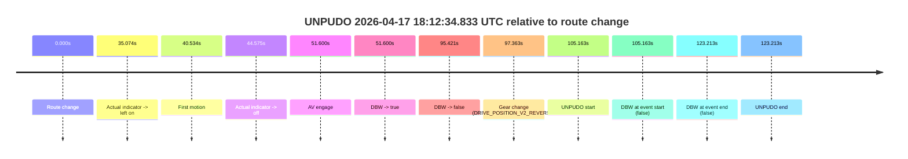
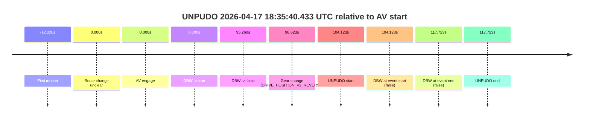

# Run Report: fme10003/2026-04-17--17-56-09--gen2-av-665d7037-2186-463c-9a63-7211f1adbc45

| Field | Value |
|---|---|
| Run ID | `fme10003/2026-04-17--17-56-09--gen2-av-665d7037-2186-463c-9a63-7211f1adbc45` |
| Date | `2026-04-17` |
| Model(s) | `eel-teal-outspoken` |
| Author | `zak` |
| Event count | `2` |

## unpudo 2026-04-17 18:12:34.833 UTC

| Field | Value |
|---|---|
| Model | `eel-teal-outspoken` |
| Author | `zak` |
| Run ID | `fme10003/2026-04-17--17-56-09--gen2-av-665d7037-2186-463c-9a63-7211f1adbc45` |
| Date | `2026-04-17` |
| Time (UTC) | `18:12:34.833` |
| Event type | `unpudo` |
| Disengagement type | `uncategorised` |
| Route change | `found` |
| Console | [run](https://console.sso.wayve.ai/run/fme10003/2026-04-17--17-56-09--gen2-av-665d7037-2186-463c-9a63-7211f1adbc45?id=&time-unixus=1776449554833299) |
| Foxglove | [segment](https://app.foxglove.dev/wayve-on-prem/p/prj_0dX18KZdVHg1fmmI/view?ds=foxglove-stream&ds.deviceName=fme10003&ds.start=2026-04-17T18%3A10%3A39.670165Z&ds.end=2026-04-17T18%3A13%3A02.883296Z&layoutId=lay_0e7VD4WIKDQGU73Y&time=2026-04-17T18%3A12%3A34.833299Z) |

### Event card: fail

- Fail: AV owns part of the segment, but the event still resolves as a model-performance failure under the AV-only scoring rule.

| Event | Time (UTC) | Delta from route change |
|---|---:|---:|
| Route change | 2026-04-17 18:10:49.670 | `0.000s` |
| Actual indicator -> left on | 2026-04-17 18:11:24.744 | `35.074s` |
| First motion | 2026-04-17 18:11:30.204 | `40.534s` |
| Actual indicator -> off | 2026-04-17 18:11:34.244 | `44.575s` |
| AV engage | 2026-04-17 18:11:41.270 | `51.600s` |
| DBW -> true | 2026-04-17 18:11:41.270 | `51.600s` |
| DBW -> false | 2026-04-17 18:12:25.090 | `95.421s` |
| Gear change (DRIVE_POSITION_V2_REVERSE) | 2026-04-17 18:12:27.033 | `97.363s` |
| UNPUDO start | 2026-04-17 18:12:34.833 | `105.163s` |
| DBW at event start (false) | 2026-04-17 18:12:34.833 | `105.163s` |
| DBW at event end (false) | 2026-04-17 18:12:52.883 | `123.213s` |
| UNPUDO end | 2026-04-17 18:12:52.883 | `123.213s` |

| Metric | Value |
|---|---|
| Outcome | `fail` |
| Effective failure type | `uncategorised` |
| Route change status | `found` |
| DBW at event start | `false` |
| DBW at event end | `false` |
| Predicted gear at AV start | `DRIVE_POSITION_V2_DRIVE` |
| Actual gear at AV start | `DRIVE_POSITION_V2_DRIVE` |
| Predicted gear at event start | `DRIVE_POSITION_V2_REVERSE` |
| Actual gear at event start | `DRIVE_POSITION_V2_REVERSE` |
| Planned indicator direction | `INDICATORS_STATE_V2_OFF` |
| Controller indicator direction | `INDICATORS_STATE_V2_OFF` |
| Actual indicator direction | `INDICATORS_STATE_V2_OFF` |
| Actual indicator at maneuver end | `INDICATORS_STATE_V2_OFF` |
| Driver accel help in AV | `false` |
| Driver accel help timestamp | `n/a` |
| Max accel pedal pct in AV | `0.0%` |
| Max brake pedal pct in AV | `8.4%` |
| Max speed mps in AV | `7.583` |
| Success timing baseline | `route change` |
| Route -> AV | `51.600s` |
| AV -> event start | `53.563s` |
| AV -> first motion | `-11.066s` |
| Success baseline -> event start | `105.163s` |
| Success baseline -> first motion | `40.534s` |
| AV duration before disengagement | `43.820s` |
| Trajectory waypoint count | `38` |
| Driving-plan step count | `11` |

The scored portion starts from the AV-owned window, not from the pre-AV setup. Route-change search in the stopped pre-event segment was `found`, with the baseline therefore set to route change. At the event anchor the model predicts `DRIVE_POSITION_V2_REVERSE` and the actual gear is `DRIVE_POSITION_V2_REVERSE`. The effective model outcome is `fail` because `uncategorised.`

### Resolution

| Field | Value |
|---|---|
| Final outcome | `fail` |
| Do we agree with this label? | `yes` |
| Source disengagement type | `uncategorised` |
| Resolved effective failure type | `uncategorised` |
| Confidence | `high` |

## unpudo 2026-04-17 18:35:40.433 UTC

| Field | Value |
|---|---|
| Model | `eel-teal-outspoken` |
| Author | `zak` |
| Run ID | `fme10003/2026-04-17--17-56-09--gen2-av-665d7037-2186-463c-9a63-7211f1adbc45` |
| Date | `2026-04-17` |
| Time (UTC) | `18:35:40.433` |
| Event type | `unpudo` |
| Disengagement type | `uncategorised` |
| Route change | `unclear` |
| Console | [run](https://console.sso.wayve.ai/run/fme10003/2026-04-17--17-56-09--gen2-av-665d7037-2186-463c-9a63-7211f1adbc45?id=&time-unixus=1776450940433307) |
| Foxglove | [segment](https://app.foxglove.dev/wayve-on-prem/p/prj_0dX18KZdVHg1fmmI/view?ds=foxglove-stream&ds.deviceName=fme10003&ds.start=2026-04-17T18%3A33%3A46.310420Z&ds.end=2026-04-17T18%3A36%3A04.033315Z&layoutId=lay_0e7VD4WIKDQGU73Y&time=2026-04-17T18%3A35%3A40.433307Z) |

### Event card: fail

- Fail: AV owns part of the segment, but the event still resolves as a model-performance failure under the AV-only scoring rule.

| Event | Time (UTC) | Delta from AV start |
|---|---:|---:|
| First motion | 2026-04-17 18:33:44.284 | `-12.026s` |
| Route change unclear | 2026-04-17 18:33:56.310 | `0.000s` |
| AV engage | 2026-04-17 18:33:56.310 | `0.000s` |
| DBW -> true | 2026-04-17 18:33:56.310 | `0.000s` |
| DBW -> false | 2026-04-17 18:35:31.570 | `95.260s` |
| Gear change (DRIVE_POSITION_V2_REVERSE) | 2026-04-17 18:35:32.933 | `96.623s` |
| UNPUDO start | 2026-04-17 18:35:40.433 | `104.123s` |
| DBW at event start (false) | 2026-04-17 18:35:40.433 | `104.123s` |
| DBW at event end (false) | 2026-04-17 18:35:54.033 | `117.723s` |
| UNPUDO end | 2026-04-17 18:35:54.033 | `117.723s` |

| Metric | Value |
|---|---|
| Outcome | `fail` |
| Effective failure type | `uncategorised` |
| Route change status | `unclear` |
| DBW at event start | `false` |
| DBW at event end | `false` |
| Predicted gear at AV start | `DRIVE_POSITION_V2_DRIVE` |
| Actual gear at AV start | `DRIVE_POSITION_V2_DRIVE` |
| Predicted gear at event start | `DRIVE_POSITION_V2_REVERSE` |
| Actual gear at event start | `DRIVE_POSITION_V2_REVERSE` |
| Planned indicator direction | `INDICATORS_STATE_V2_OFF` |
| Controller indicator direction | `INDICATORS_STATE_V2_OFF` |
| Actual indicator direction | `INDICATORS_STATE_V2_OFF` |
| Actual indicator at maneuver end | `INDICATORS_STATE_V2_OFF` |
| Driver accel help in AV | `false` |
| Driver accel help timestamp | `n/a` |
| Max accel pedal pct in AV | `0.0%` |
| Max brake pedal pct in AV | `8.0%` |
| Max speed mps in AV | `10.322` |
| Success timing baseline | `AV start` |
| Route -> AV | `n/a` |
| AV -> event start | `104.123s` |
| AV -> first motion | `-12.026s` |
| Success baseline -> event start | `104.123s` |
| Success baseline -> first motion | `-12.026s` |
| AV duration before disengagement | `95.260s` |
| Trajectory waypoint count | `38` |
| Driving-plan step count | `11` |

The scored portion starts from the AV-owned window, not from the pre-AV setup. Route-change search in the stopped pre-event segment was `unclear`, with the baseline therefore set to AV start. At the event anchor the model predicts `DRIVE_POSITION_V2_REVERSE` and the actual gear is `DRIVE_POSITION_V2_REVERSE`. The effective model outcome is `fail` because `uncategorised.`

### Resolution

| Field | Value |
|---|---|
| Final outcome | `fail` |
| Do we agree with this label? | `yes` |
| Source disengagement type | `uncategorised` |
| Resolved effective failure type | `uncategorised` |
| Confidence | `medium` |
