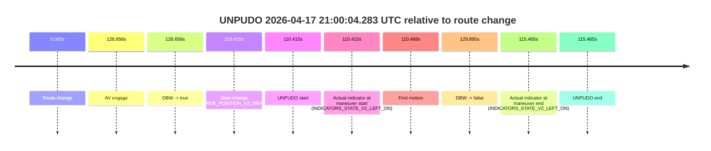
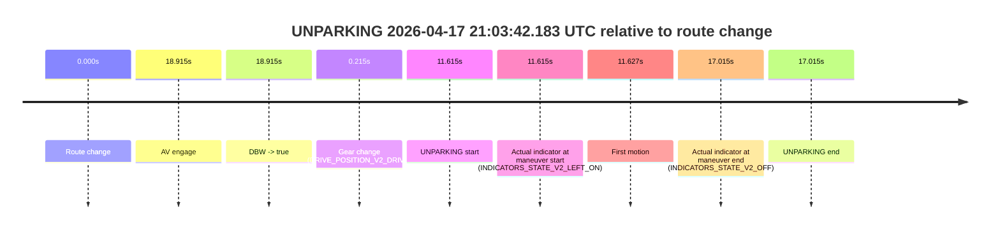

# Run Report: fme10003/2026-04-17--20-37-34--gen2-av-b3a0d942-0b2f-4c7c-a929-a8cbcdecb8cb

| Field | Value |
|---|---|
| Run ID | `fme10003/2026-04-17--20-37-34--gen2-av-b3a0d942-0b2f-4c7c-a929-a8cbcdecb8cb` |
| Date | `2026-04-17` |
| Model(s) | `plum-timeless-beaver` |
| Author | `peng.tang` |
| Event count | `3` |

## unpudo 2026-04-17 20:54:13.533 UTC

| Field | Value |
|---|---|
| Model | `plum-timeless-beaver` |
| Author | `peng.tang` |
| Run ID | `fme10003/2026-04-17--20-37-34--gen2-av-b3a0d942-0b2f-4c7c-a929-a8cbcdecb8cb` |
| Date | `2026-04-17` |
| Time (UTC) | `20:54:13.533` |
| Event type | `unpudo` |
| Disengagement type | `failed_to_unpudo` |
| Route change | `found` |
| Console | [run](https://console.sso.wayve.ai/run/fme10003/2026-04-17--20-37-34--gen2-av-b3a0d942-0b2f-4c7c-a929-a8cbcdecb8cb?id=&time-unixus=1776459253533315) |
| Foxglove | [segment](https://app.foxglove.dev/wayve-on-prem/p/prj_0dX18KZdVHg1fmmI/view?ds=foxglove-stream&ds.deviceName=fme10003&ds.start=2026-04-17T20%3A53%3A39.268270Z&ds.end=2026-04-17T20%3A56%3A35.303244Z&layoutId=lay_0e7VD4WIKDQGU73Y&time=2026-04-17T20%3A54%3A13.533315Z) |

### Event card: accidental

- Accidental: AV ownership is present for less than `2s`, so this is treated as an accidental brush with the maneuver rather than a meaningful model attempt.

| Event | Time (UTC) | Delta from route change |
|---|---:|---:|
| Route change | 2026-04-17 20:53:49.268 | `0.000s` |
| AV engage | 2026-04-17 20:54:23.144 | `33.876s` |
| DBW -> true | 2026-04-17 20:54:23.144 | `33.876s` |
| Gear change (DRIVE_POSITION_V2_DRIVE) | 2026-04-17 20:53:49.483 | `0.215s` |
| UNPUDO start | 2026-04-17 20:54:13.533 | `24.265s` |
| Actual indicator at maneuver start (INDICATORS_STATE_V2_LEFT_ON) | 2026-04-17 20:54:13.533 | `24.265s` |
| First motion | 2026-04-17 20:54:13.576 | `24.308s` |
| DBW -> false | 2026-04-17 20:56:25.303 | `156.035s` |
| Actual indicator at maneuver end (INDICATORS_STATE_V2_OFF) | 2026-04-17 20:54:17.783 | `28.515s` |
| UNPUDO end | 2026-04-17 20:54:17.783 | `28.515s` |

| Metric | Value |
|---|---|
| Outcome | `accidental` |
| Effective failure type | `none` |
| Route change status | `found` |
| DBW at event start | `false` |
| DBW at event end | `false` |
| Predicted gear at AV start | `DRIVE_POSITION_V2_DRIVE` |
| Actual gear at AV start | `DRIVE_POSITION_V2_DRIVE` |
| Predicted gear at event start | `DRIVE_POSITION_V2_DRIVE` |
| Actual gear at event start | `DRIVE_POSITION_V2_DRIVE` |
| Planned indicator direction | `INDICATORS_STATE_V2_OFF` |
| Controller indicator direction | `INDICATORS_STATE_V2_OFF` |
| Actual indicator direction | `INDICATORS_STATE_V2_LEFT_ON` |
| Actual indicator at maneuver end | `INDICATORS_STATE_V2_OFF` |
| Driver accel help in AV | `false` |
| Driver accel help timestamp | `n/a` |
| Max accel pedal pct in AV | `0.0%` |
| Max brake pedal pct in AV | `0.0%` |
| Max speed mps in AV | `0.000` |
| Route -> AV | `33.876s` |
| AV -> event start | `-9.611s` |
| AV -> first motion | `-9.568s` |
| AV duration before disengagement | `122.159s` |
| Trajectory waypoint count | `36` |
| Driving-plan step count | `11` |

The scored portion starts from the AV-owned window, not from the pre-AV setup. Route-change search in the stopped pre-event segment was `found`, with the baseline therefore set to route change. At the event anchor the model predicts `DRIVE_POSITION_V2_DRIVE` and the actual gear is `DRIVE_POSITION_V2_DRIVE`. The effective model outcome is `accidental` because `the AV-owned portion is shorter than 2s`.

### Resolution

| Field | Value |
|---|---|
| Final outcome | `accidental` |
| Do we agree with this label? | `yes` |
| Source disengagement type | `failed_to_unpudo` |
| Resolved effective failure type | `none` |
| Confidence | `high` |

## unpudo 2026-04-17 21:00:04.283 UTC

| Field | Value |
|---|---|
| Model | `plum-timeless-beaver` |
| Author | `peng.tang` |
| Run ID | `fme10003/2026-04-17--20-37-34--gen2-av-b3a0d942-0b2f-4c7c-a929-a8cbcdecb8cb` |
| Date | `2026-04-17` |
| Time (UTC) | `21:00:04.283` |
| Event type | `unpudo` |
| Disengagement type | `failed_to_unpudo` |
| Route change | `found` |
| Console | [run](https://console.sso.wayve.ai/run/fme10003/2026-04-17--20-37-34--gen2-av-b3a0d942-0b2f-4c7c-a929-a8cbcdecb8cb?id=&time-unixus=1776459604283316) |
| Foxglove | [segment](https://app.foxglove.dev/wayve-on-prem/p/prj_0dX18KZdVHg1fmmI/view?ds=foxglove-stream&ds.deviceName=fme10003&ds.start=2026-04-17T20%3A58%3A03.868259Z&ds.end=2026-04-17T21%3A00%3A33.763707Z&layoutId=lay_0e7VD4WIKDQGU73Y&time=2026-04-17T21%3A00%3A04.283316Z) |

### Event card: accidental

- Accidental: AV ownership is present for less than `2s`, so this is treated as an accidental brush with the maneuver rather than a meaningful model attempt.

| Event | Time (UTC) | Delta from route change |
|---|---:|---:|
| Route change | 2026-04-17 20:58:13.868 | `0.000s` |
| AV engage | 2026-04-17 21:00:20.524 | `126.656s` |
| DBW -> true | 2026-04-17 21:00:20.524 | `126.656s` |
| Gear change (DRIVE_POSITION_V2_DRIVE) | 2026-04-17 20:59:57.283 | `103.415s` |
| UNPUDO start | 2026-04-17 21:00:04.283 | `110.415s` |
| Actual indicator at maneuver start (INDICATORS_STATE_V2_LEFT_ON) | 2026-04-17 21:00:04.283 | `110.415s` |
| First motion | 2026-04-17 21:00:04.335 | `110.468s` |
| DBW -> false | 2026-04-17 21:00:23.763 | `129.895s` |
| Actual indicator at maneuver end (INDICATORS_STATE_V2_LEFT_ON) | 2026-04-17 21:00:09.333 | `115.465s` |
| UNPUDO end | 2026-04-17 21:00:09.333 | `115.465s` |

| Metric | Value |
|---|---|
| Outcome | `accidental` |
| Effective failure type | `none` |
| Route change status | `found` |
| DBW at event start | `false` |
| DBW at event end | `false` |
| Predicted gear at AV start | `DRIVE_POSITION_V2_DRIVE` |
| Actual gear at AV start | `DRIVE_POSITION_V2_DRIVE` |
| Predicted gear at event start | `DRIVE_POSITION_V2_DRIVE` |
| Actual gear at event start | `DRIVE_POSITION_V2_DRIVE` |
| Planned indicator direction | `INDICATORS_STATE_V2_OFF` |
| Controller indicator direction | `INDICATORS_STATE_V2_OFF` |
| Actual indicator direction | `INDICATORS_STATE_V2_LEFT_ON` |
| Actual indicator at maneuver end | `INDICATORS_STATE_V2_LEFT_ON` |
| Driver accel help in AV | `false` |
| Driver accel help timestamp | `n/a` |
| Max accel pedal pct in AV | `0.0%` |
| Max brake pedal pct in AV | `0.0%` |
| Max speed mps in AV | `0.000` |
| Route -> AV | `126.656s` |
| AV -> event start | `-16.241s` |
| AV -> first motion | `-16.189s` |
| AV duration before disengagement | `3.239s` |
| Trajectory waypoint count | `37` |
| Driving-plan step count | `11` |

The scored portion starts from the AV-owned window, not from the pre-AV setup. Route-change search in the stopped pre-event segment was `found`, with the baseline therefore set to route change. At the event anchor the model predicts `DRIVE_POSITION_V2_DRIVE` and the actual gear is `DRIVE_POSITION_V2_DRIVE`. The effective model outcome is `accidental` because `the AV-owned portion is shorter than 2s`.

### Resolution

| Field | Value |
|---|---|
| Final outcome | `accidental` |
| Do we agree with this label? | `yes` |
| Source disengagement type | `failed_to_unpudo` |
| Resolved effective failure type | `none` |
| Confidence | `high` |

## unparking 2026-04-17 21:03:42.183 UTC

| Field | Value |
|---|---|
| Model | `plum-timeless-beaver` |
| Author | `peng.tang` |
| Run ID | `fme10003/2026-04-17--20-37-34--gen2-av-b3a0d942-0b2f-4c7c-a929-a8cbcdecb8cb` |
| Date | `2026-04-17` |
| Time (UTC) | `21:03:42.183` |
| Event type | `unparking` |
| Disengagement type | `failed_to_unpudo` |
| Route change | `found` |
| Console | [run](https://console.sso.wayve.ai/run/fme10003/2026-04-17--20-37-34--gen2-av-b3a0d942-0b2f-4c7c-a929-a8cbcdecb8cb?id=&time-unixus=1776459822183312) |
| Foxglove | [segment](https://app.foxglove.dev/wayve-on-prem/p/prj_0dX18KZdVHg1fmmI/view?ds=foxglove-stream&ds.deviceName=fme10003&ds.start=2026-04-17T21%3A03%3A20.568258Z&ds.end=2026-04-17T21%3A03%3A57.583304Z&layoutId=lay_0e7VD4WIKDQGU73Y&time=2026-04-17T21%3A03%3A42.183312Z) |

### Event card: accidental

- Accidental: AV ownership is present for less than `2s`, so this is treated as an accidental brush with the maneuver rather than a meaningful model attempt.

| Event | Time (UTC) | Delta from route change |
|---|---:|---:|
| Route change | 2026-04-17 21:03:30.568 | `0.000s` |
| AV engage | 2026-04-17 21:03:49.483 | `18.915s` |
| DBW -> true | 2026-04-17 21:03:49.483 | `18.915s` |
| Gear change (DRIVE_POSITION_V2_DRIVE) | 2026-04-17 21:03:30.783 | `0.215s` |
| UNPARKING start | 2026-04-17 21:03:42.183 | `11.615s` |
| Actual indicator at maneuver start (INDICATORS_STATE_V2_LEFT_ON) | 2026-04-17 21:03:42.183 | `11.615s` |
| First motion | 2026-04-17 21:03:42.195 | `11.627s` |
| Actual indicator at maneuver end (INDICATORS_STATE_V2_OFF) | 2026-04-17 21:03:47.583 | `17.015s` |
| UNPARKING end | 2026-04-17 21:03:47.583 | `17.015s` |

| Metric | Value |
|---|---|
| Outcome | `accidental` |
| Effective failure type | `none` |
| Route change status | `found` |
| DBW at event start | `false` |
| DBW at event end | `false` |
| Predicted gear at AV start | `DRIVE_POSITION_V2_DRIVE` |
| Actual gear at AV start | `DRIVE_POSITION_V2_DRIVE` |
| Predicted gear at event start | `DRIVE_POSITION_V2_DRIVE` |
| Actual gear at event start | `DRIVE_POSITION_V2_DRIVE` |
| Planned indicator direction | `INDICATORS_STATE_V2_OFF` |
| Controller indicator direction | `INDICATORS_STATE_V2_OFF` |
| Actual indicator direction | `INDICATORS_STATE_V2_LEFT_ON` |
| Actual indicator at maneuver end | `INDICATORS_STATE_V2_OFF` |
| Driver accel help in AV | `false` |
| Driver accel help timestamp | `n/a` |
| Max accel pedal pct in AV | `0.0%` |
| Max brake pedal pct in AV | `0.0%` |
| Max speed mps in AV | `0.000` |
| Route -> AV | `18.915s` |
| AV -> event start | `-7.300s` |
| AV -> first motion | `-7.287s` |
| AV duration before disengagement | `n/a` |
| Trajectory waypoint count | `37` |
| Driving-plan step count | `11` |

The scored portion starts from the AV-owned window, not from the pre-AV setup. Route-change search in the stopped pre-event segment was `found`, with the baseline therefore set to route change. At the event anchor the model predicts `DRIVE_POSITION_V2_DRIVE` and the actual gear is `DRIVE_POSITION_V2_DRIVE`. The effective model outcome is `accidental` because `the AV-owned portion is shorter than 2s`.

### Resolution

| Field | Value |
|---|---|
| Final outcome | `accidental` |
| Do we agree with this label? | `yes` |
| Source disengagement type | `failed_to_unpudo` |
| Resolved effective failure type | `none` |
| Confidence | `high` |
