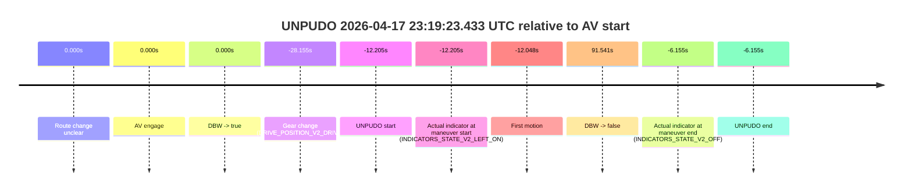
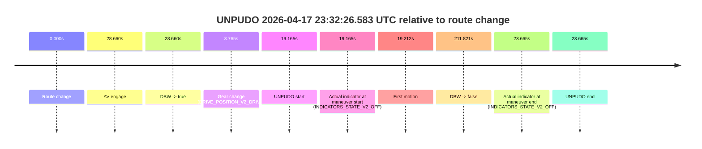
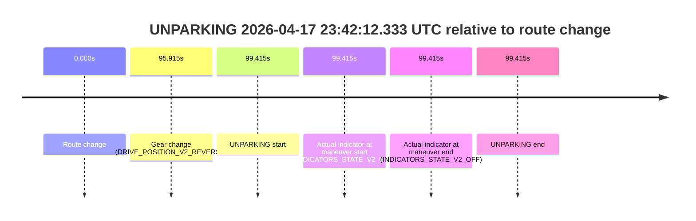

# Run Report: fme10003/2026-04-17--22-28-26--gen2-av-4ef72ce3-7261-4899-9667-caf57f88c433

| Field | Value |
|---|---|
| Run ID | `fme10003/2026-04-17--22-28-26--gen2-av-4ef72ce3-7261-4899-9667-caf57f88c433` |
| Date | `2026-04-17` |
| Model(s) | `plum-timeless-beaver` |
| Author | `peng.tang` |
| Event count | `3` |

## unpudo 2026-04-17 23:19:23.433 UTC

| Field | Value |
|---|---|
| Model | `plum-timeless-beaver` |
| Author | `peng.tang` |
| Run ID | `fme10003/2026-04-17--22-28-26--gen2-av-4ef72ce3-7261-4899-9667-caf57f88c433` |
| Date | `2026-04-17` |
| Time (UTC) | `23:19:23.433` |
| Event type | `unpudo` |
| Disengagement type | `failed_to_unpudo` |
| Route change | `unclear` |
| Console | [run](https://console.sso.wayve.ai/run/fme10003/2026-04-17--22-28-26--gen2-av-4ef72ce3-7261-4899-9667-caf57f88c433?id=&time-unixus=1776467963433299) |
| Foxglove | [segment](https://app.foxglove.dev/wayve-on-prem/p/prj_0dX18KZdVHg1fmmI/view?ds=foxglove-stream&ds.deviceName=fme10003&ds.start=2026-04-17T23%3A18%3A57.483289Z&ds.end=2026-04-17T23%3A21%3A17.179316Z&layoutId=lay_0e7VD4WIKDQGU73Y&time=2026-04-17T23%3A19%3A23.433299Z) |

### Event card: non-av

- Non-AV: there is no AV-owned portion anywhere inside the detected unpudo timeline, so it is kept for coverage but excluded from model success / failure scoring.

| Event | Time (UTC) | Delta from AV start |
|---|---:|---:|
| Route change unclear | 2026-04-17 23:19:35.637 | `0.000s` |
| AV engage | 2026-04-17 23:19:35.637 | `0.000s` |
| DBW -> true | 2026-04-17 23:19:35.637 | `0.000s` |
| Gear change (DRIVE_POSITION_V2_DRIVE) | 2026-04-17 23:19:07.483 | `-28.155s` |
| UNPUDO start | 2026-04-17 23:19:23.433 | `-12.205s` |
| Actual indicator at maneuver start (INDICATORS_STATE_V2_LEFT_ON) | 2026-04-17 23:19:23.433 | `-12.205s` |
| First motion | 2026-04-17 23:19:23.589 | `-12.048s` |
| DBW -> false | 2026-04-17 23:21:07.179 | `91.541s` |
| Actual indicator at maneuver end (INDICATORS_STATE_V2_OFF) | 2026-04-17 23:19:29.483 | `-6.155s` |
| UNPUDO end | 2026-04-17 23:19:29.483 | `-6.155s` |

| Metric | Value |
|---|---|
| Outcome | `non-av` |
| Effective failure type | `none` |
| Route change status | `unclear` |
| DBW at event start | `false` |
| DBW at event end | `false` |
| Predicted gear at AV start | `DRIVE_POSITION_V2_DRIVE` |
| Actual gear at AV start | `DRIVE_POSITION_V2_DRIVE` |
| Predicted gear at event start | `DRIVE_POSITION_V2_DRIVE` |
| Actual gear at event start | `DRIVE_POSITION_V2_DRIVE` |
| Planned indicator direction | `INDICATORS_STATE_V2_LEFT_ON` |
| Controller indicator direction | `INDICATORS_STATE_V2_LEFT_ON` |
| Actual indicator direction | `INDICATORS_STATE_V2_LEFT_ON` |
| Actual indicator at maneuver end | `INDICATORS_STATE_V2_OFF` |
| Driver accel help in AV | `false` |
| Driver accel help timestamp | `n/a` |
| Max accel pedal pct in AV | `0.0%` |
| Max brake pedal pct in AV | `0.0%` |
| Max speed mps in AV | `0.000` |
| Route -> AV | `n/a` |
| AV -> event start | `-12.205s` |
| AV -> first motion | `-12.048s` |
| AV duration before disengagement | `91.541s` |
| Trajectory waypoint count | `35` |
| Driving-plan step count | `11` |

The scored portion starts from the AV-owned window, not from the pre-AV setup. Route-change search in the stopped pre-event segment was `unclear`, with the baseline therefore set to AV start. At the event anchor the model predicts `DRIVE_POSITION_V2_DRIVE` and the actual gear is `DRIVE_POSITION_V2_DRIVE`. The effective model outcome is `non-av` because `there is no AV-owned overlap inside the event timeline`.

### Resolution

| Field | Value |
|---|---|
| Final outcome | `non-av` |
| Do we agree with this label? | `yes` |
| Source disengagement type | `failed_to_unpudo` |
| Resolved effective failure type | `none` |
| Confidence | `medium` |

## unpudo 2026-04-17 23:32:26.583 UTC

| Field | Value |
|---|---|
| Model | `plum-timeless-beaver` |
| Author | `peng.tang` |
| Run ID | `fme10003/2026-04-17--22-28-26--gen2-av-4ef72ce3-7261-4899-9667-caf57f88c433` |
| Date | `2026-04-17` |
| Time (UTC) | `23:32:26.583` |
| Event type | `unpudo` |
| Disengagement type | `failed_to_unpudo` |
| Route change | `found` |
| Console | [run](https://console.sso.wayve.ai/run/fme10003/2026-04-17--22-28-26--gen2-av-4ef72ce3-7261-4899-9667-caf57f88c433?id=&time-unixus=1776468746583306) |
| Foxglove | [segment](https://app.foxglove.dev/wayve-on-prem/p/prj_0dX18KZdVHg1fmmI/view?ds=foxglove-stream&ds.deviceName=fme10003&ds.start=2026-04-17T23%3A31%3A57.418263Z&ds.end=2026-04-17T23%3A35%3A49.238967Z&layoutId=lay_0e7VD4WIKDQGU73Y&time=2026-04-17T23%3A32%3A26.583306Z) |

### Event card: non-av

- Non-AV: there is no AV-owned portion anywhere inside the detected unpudo timeline, so it is kept for coverage but excluded from model success / failure scoring.

| Event | Time (UTC) | Delta from route change |
|---|---:|---:|
| Route change | 2026-04-17 23:32:07.418 | `0.000s` |
| AV engage | 2026-04-17 23:32:36.077 | `28.660s` |
| DBW -> true | 2026-04-17 23:32:36.077 | `28.660s` |
| Gear change (DRIVE_POSITION_V2_DRIVE) | 2026-04-17 23:32:11.183 | `3.765s` |
| UNPUDO start | 2026-04-17 23:32:26.583 | `19.165s` |
| Actual indicator at maneuver start (INDICATORS_STATE_V2_OFF) | 2026-04-17 23:32:26.583 | `19.165s` |
| First motion | 2026-04-17 23:32:26.629 | `19.212s` |
| DBW -> false | 2026-04-17 23:35:39.238 | `211.821s` |
| Actual indicator at maneuver end (INDICATORS_STATE_V2_OFF) | 2026-04-17 23:32:31.083 | `23.665s` |
| UNPUDO end | 2026-04-17 23:32:31.083 | `23.665s` |

| Metric | Value |
|---|---|
| Outcome | `non-av` |
| Effective failure type | `none` |
| Route change status | `found` |
| DBW at event start | `false` |
| DBW at event end | `false` |
| Predicted gear at AV start | `DRIVE_POSITION_V2_DRIVE` |
| Actual gear at AV start | `DRIVE_POSITION_V2_DRIVE` |
| Predicted gear at event start | `DRIVE_POSITION_V2_DRIVE` |
| Actual gear at event start | `DRIVE_POSITION_V2_DRIVE` |
| Planned indicator direction | `INDICATORS_STATE_V2_LEFT_ON` |
| Controller indicator direction | `INDICATORS_STATE_V2_LEFT_ON` |
| Actual indicator direction | `INDICATORS_STATE_V2_OFF` |
| Actual indicator at maneuver end | `INDICATORS_STATE_V2_OFF` |
| Driver accel help in AV | `false` |
| Driver accel help timestamp | `n/a` |
| Max accel pedal pct in AV | `0.0%` |
| Max brake pedal pct in AV | `0.0%` |
| Max speed mps in AV | `0.000` |
| Route -> AV | `28.660s` |
| AV -> event start | `-9.495s` |
| AV -> first motion | `-9.448s` |
| AV duration before disengagement | `183.161s` |
| Trajectory waypoint count | `37` |
| Driving-plan step count | `11` |

The scored portion starts from the AV-owned window, not from the pre-AV setup. Route-change search in the stopped pre-event segment was `found`, with the baseline therefore set to route change. At the event anchor the model predicts `DRIVE_POSITION_V2_DRIVE` and the actual gear is `DRIVE_POSITION_V2_DRIVE`. The effective model outcome is `non-av` because `there is no AV-owned overlap inside the event timeline`.

### Resolution

| Field | Value |
|---|---|
| Final outcome | `non-av` |
| Do we agree with this label? | `yes` |
| Source disengagement type | `failed_to_unpudo` |
| Resolved effective failure type | `none` |
| Confidence | `high` |

## unparking 2026-04-17 23:42:12.333 UTC

| Field | Value |
|---|---|
| Model | `plum-timeless-beaver` |
| Author | `peng.tang` |
| Run ID | `fme10003/2026-04-17--22-28-26--gen2-av-4ef72ce3-7261-4899-9667-caf57f88c433` |
| Date | `2026-04-17` |
| Time (UTC) | `23:42:12.333` |
| Event type | `unparking` |
| Disengagement type | `none observed` |
| Route change | `found` |
| Console | [run](https://console.sso.wayve.ai/run/fme10003/2026-04-17--22-28-26--gen2-av-4ef72ce3-7261-4899-9667-caf57f88c433?id=&time-unixus=1776469332333291) |
| Foxglove | [segment](https://app.foxglove.dev/wayve-on-prem/p/prj_0dX18KZdVHg1fmmI/view?ds=foxglove-stream&ds.deviceName=fme10003&ds.start=2026-04-17T23%3A40%3A22.918246Z&ds.end=2026-04-17T23%3A42%3A22.333291Z&layoutId=lay_0e7VD4WIKDQGU73Y&time=2026-04-17T23%3A42%3A12.333291Z) |

### Event card: non-av

- Non-AV: there is no AV-owned portion anywhere inside the detected unparking timeline, so it is kept for coverage but excluded from model success / failure scoring.

| Event | Time (UTC) | Delta from route change |
|---|---:|---:|
| Route change | 2026-04-17 23:40:32.918 | `0.000s` |
| Gear change (DRIVE_POSITION_V2_REVERSE) | 2026-04-17 23:42:08.833 | `95.915s` |
| UNPARKING start | 2026-04-17 23:42:12.333 | `99.415s` |
| Actual indicator at maneuver start (INDICATORS_STATE_V2_OFF) | 2026-04-17 23:42:12.333 | `99.415s` |
| Actual indicator at maneuver end (INDICATORS_STATE_V2_OFF) | 2026-04-17 23:42:12.333 | `99.415s` |
| UNPARKING end | 2026-04-17 23:42:12.333 | `99.415s` |

| Metric | Value |
|---|---|
| Outcome | `non-av` |
| Effective failure type | `none` |
| Route change status | `found` |
| DBW at event start | `false` |
| DBW at event end | `false` |
| Predicted gear at AV start | `n/a` |
| Actual gear at AV start | `n/a` |
| Predicted gear at event start | `DRIVE_POSITION_V2_REVERSE` |
| Actual gear at event start | `DRIVE_POSITION_V2_REVERSE` |
| Planned indicator direction | `INDICATORS_STATE_V2_OFF` |
| Controller indicator direction | `INDICATORS_STATE_V2_OFF` |
| Actual indicator direction | `INDICATORS_STATE_V2_OFF` |
| Actual indicator at maneuver end | `INDICATORS_STATE_V2_OFF` |
| Driver accel help in AV | `false` |
| Driver accel help timestamp | `n/a` |
| Max accel pedal pct in AV | `0.0%` |
| Max brake pedal pct in AV | `0.0%` |
| Max speed mps in AV | `0.000` |
| Route -> AV | `n/a` |
| AV -> event start | `n/a` |
| AV -> first motion | `n/a` |
| AV duration before disengagement | `n/a` |
| Trajectory waypoint count | `36` |
| Driving-plan step count | `11` |

The scored portion starts from the AV-owned window, not from the pre-AV setup. Route-change search in the stopped pre-event segment was `found`, with the baseline therefore set to route change. At the event anchor the model predicts `DRIVE_POSITION_V2_REVERSE` and the actual gear is `DRIVE_POSITION_V2_REVERSE`. The effective model outcome is `non-av` because `there is no AV-owned overlap inside the event timeline`.

### Resolution

| Field | Value |
|---|---|
| Final outcome | `non-av` |
| Do we agree with this label? | `yes` |
| Source disengagement type | `none observed` |
| Resolved effective failure type | `none` |
| Confidence | `high` |
