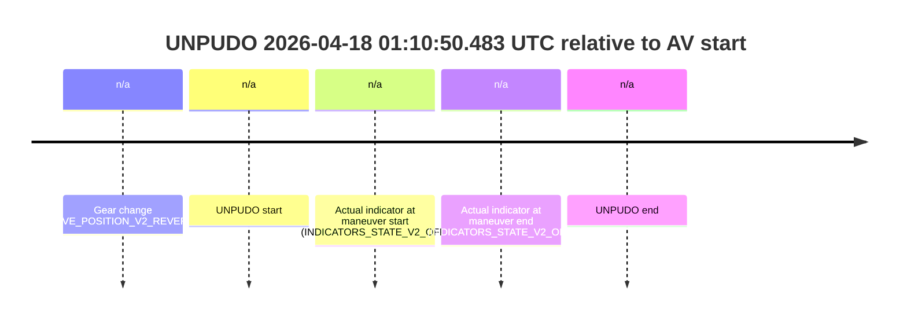
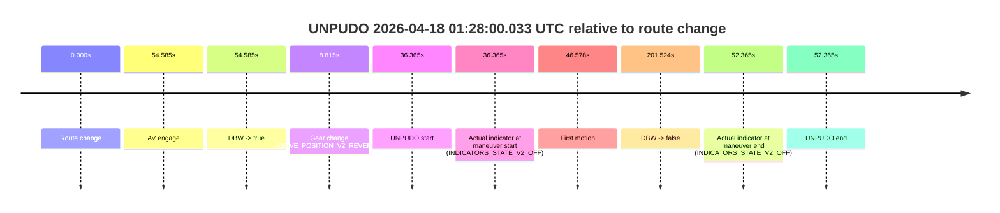
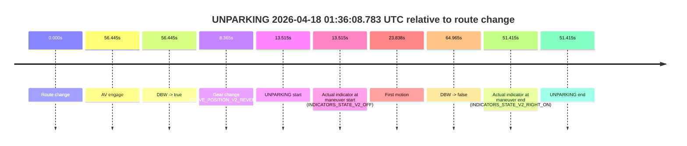
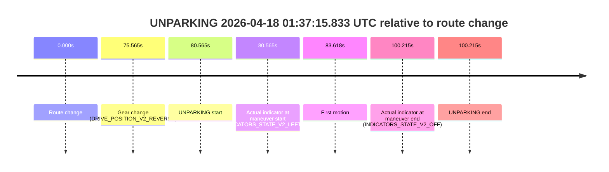

# Run Report: fme10003/2026-04-18--00-51-21--gen2-av-c159d67f-ec2e-4844-95af-efd3c1511555

| Field | Value |
|---|---|
| Run ID | `fme10003/2026-04-18--00-51-21--gen2-av-c159d67f-ec2e-4844-95af-efd3c1511555` |
| Date | `2026-04-18` |
| Model(s) | `plum-timeless-beaver` |
| Author | `peng.tang` |
| Event count | `4` |

## unpudo 2026-04-18 01:10:50.483 UTC

| Field | Value |
|---|---|
| Model | `plum-timeless-beaver` |
| Author | `peng.tang` |
| Run ID | `fme10003/2026-04-18--00-51-21--gen2-av-c159d67f-ec2e-4844-95af-efd3c1511555` |
| Date | `2026-04-18` |
| Time (UTC) | `01:10:50.483` |
| Event type | `unpudo` |
| Disengagement type | `none observed` |
| Route change | `unclear` |
| Console | [run](https://console.sso.wayve.ai/run/fme10003/2026-04-18--00-51-21--gen2-av-c159d67f-ec2e-4844-95af-efd3c1511555?id=&time-unixus=1776474650483295) |
| Foxglove | [segment](https://app.foxglove.dev/wayve-on-prem/p/prj_0dX18KZdVHg1fmmI/view?ds=foxglove-stream&ds.deviceName=fme10003&ds.start=2026-04-18T01%3A10%3A37.383292Z&ds.end=2026-04-18T01%3A11%3A00.483295Z&layoutId=lay_0e7VD4WIKDQGU73Y&time=2026-04-18T01%3A10%3A50.483295Z) |

### Event card: non-av

- Non-AV: there is no AV-owned portion anywhere inside the detected unpudo timeline, so it is kept for coverage but excluded from model success / failure scoring.

| Event | Time (UTC) | Delta from AV start |
|---|---:|---:|
| Gear change (DRIVE_POSITION_V2_REVERSE) | 2026-04-18 01:10:47.383 | `n/a` |
| UNPUDO start | 2026-04-18 01:10:50.483 | `n/a` |
| Actual indicator at maneuver start (INDICATORS_STATE_V2_OFF) | 2026-04-18 01:10:50.483 | `n/a` |
| Actual indicator at maneuver end (INDICATORS_STATE_V2_OFF) | 2026-04-18 01:10:50.483 | `n/a` |
| UNPUDO end | 2026-04-18 01:10:50.483 | `n/a` |

| Metric | Value |
|---|---|
| Outcome | `non-av` |
| Effective failure type | `none` |
| Route change status | `unclear` |
| DBW at event start | `false` |
| DBW at event end | `false` |
| Predicted gear at AV start | `n/a` |
| Actual gear at AV start | `n/a` |
| Predicted gear at event start | `DRIVE_POSITION_V2_REVERSE` |
| Actual gear at event start | `DRIVE_POSITION_V2_REVERSE` |
| Planned indicator direction | `INDICATORS_STATE_V2_OFF` |
| Controller indicator direction | `INDICATORS_STATE_V2_OFF` |
| Actual indicator direction | `INDICATORS_STATE_V2_OFF` |
| Actual indicator at maneuver end | `INDICATORS_STATE_V2_OFF` |
| Driver accel help in AV | `false` |
| Driver accel help timestamp | `n/a` |
| Max accel pedal pct in AV | `0.0%` |
| Max brake pedal pct in AV | `0.0%` |
| Max speed mps in AV | `0.000` |
| Route -> AV | `n/a` |
| AV -> event start | `n/a` |
| AV -> first motion | `n/a` |
| AV duration before disengagement | `n/a` |
| Trajectory waypoint count | `37` |
| Driving-plan step count | `11` |

The scored portion starts from the AV-owned window, not from the pre-AV setup. Route-change search in the stopped pre-event segment was `unclear`, with the baseline therefore set to AV start. At the event anchor the model predicts `DRIVE_POSITION_V2_REVERSE` and the actual gear is `DRIVE_POSITION_V2_REVERSE`. The effective model outcome is `non-av` because `there is no AV-owned overlap inside the event timeline`.

### Resolution

| Field | Value |
|---|---|
| Final outcome | `non-av` |
| Do we agree with this label? | `yes` |
| Source disengagement type | `none observed` |
| Resolved effective failure type | `none` |
| Confidence | `medium` |

## unpudo 2026-04-18 01:28:00.033 UTC

| Field | Value |
|---|---|
| Model | `plum-timeless-beaver` |
| Author | `peng.tang` |
| Run ID | `fme10003/2026-04-18--00-51-21--gen2-av-c159d67f-ec2e-4844-95af-efd3c1511555` |
| Date | `2026-04-18` |
| Time (UTC) | `01:28:00.033` |
| Event type | `unpudo` |
| Disengagement type | `failed_to_unpudo` |
| Route change | `found` |
| Console | [run](https://console.sso.wayve.ai/run/fme10003/2026-04-18--00-51-21--gen2-av-c159d67f-ec2e-4844-95af-efd3c1511555?id=&time-unixus=1776475680033297) |
| Foxglove | [segment](https://app.foxglove.dev/wayve-on-prem/p/prj_0dX18KZdVHg1fmmI/view?ds=foxglove-stream&ds.deviceName=fme10003&ds.start=2026-04-18T01%3A27%3A13.668286Z&ds.end=2026-04-18T01%3A30%3A55.192763Z&layoutId=lay_0e7VD4WIKDQGU73Y&time=2026-04-18T01%3A28%3A00.033297Z) |

### Event card: non-av

- Non-AV: there is no AV-owned portion anywhere inside the detected unpudo timeline, so it is kept for coverage but excluded from model success / failure scoring.

| Event | Time (UTC) | Delta from route change |
|---|---:|---:|
| Route change | 2026-04-18 01:27:23.668 | `0.000s` |
| AV engage | 2026-04-18 01:28:18.253 | `54.585s` |
| DBW -> true | 2026-04-18 01:28:18.253 | `54.585s` |
| Gear change (DRIVE_POSITION_V2_REVERSE) | 2026-04-18 01:27:32.483 | `8.815s` |
| UNPUDO start | 2026-04-18 01:28:00.033 | `36.365s` |
| Actual indicator at maneuver start (INDICATORS_STATE_V2_OFF) | 2026-04-18 01:28:00.033 | `36.365s` |
| First motion | 2026-04-18 01:28:10.246 | `46.578s` |
| DBW -> false | 2026-04-18 01:30:45.192 | `201.524s` |
| Actual indicator at maneuver end (INDICATORS_STATE_V2_OFF) | 2026-04-18 01:28:16.033 | `52.365s` |
| UNPUDO end | 2026-04-18 01:28:16.033 | `52.365s` |

| Metric | Value |
|---|---|
| Outcome | `non-av` |
| Effective failure type | `none` |
| Route change status | `found` |
| DBW at event start | `false` |
| DBW at event end | `false` |
| Predicted gear at AV start | `DRIVE_POSITION_V2_DRIVE` |
| Actual gear at AV start | `DRIVE_POSITION_V2_DRIVE` |
| Predicted gear at event start | `DRIVE_POSITION_V2_REVERSE` |
| Actual gear at event start | `DRIVE_POSITION_V2_REVERSE` |
| Planned indicator direction | `INDICATORS_STATE_V2_OFF` |
| Controller indicator direction | `INDICATORS_STATE_V2_OFF` |
| Actual indicator direction | `INDICATORS_STATE_V2_OFF` |
| Actual indicator at maneuver end | `INDICATORS_STATE_V2_OFF` |
| Driver accel help in AV | `false` |
| Driver accel help timestamp | `n/a` |
| Max accel pedal pct in AV | `0.0%` |
| Max brake pedal pct in AV | `0.0%` |
| Max speed mps in AV | `0.000` |
| Route -> AV | `54.585s` |
| AV -> event start | `-18.220s` |
| AV -> first motion | `-8.007s` |
| AV duration before disengagement | `146.939s` |
| Trajectory waypoint count | `36` |
| Driving-plan step count | `11` |

The scored portion starts from the AV-owned window, not from the pre-AV setup. Route-change search in the stopped pre-event segment was `found`, with the baseline therefore set to route change. At the event anchor the model predicts `DRIVE_POSITION_V2_REVERSE` and the actual gear is `DRIVE_POSITION_V2_REVERSE`. The effective model outcome is `non-av` because `there is no AV-owned overlap inside the event timeline`.

### Resolution

| Field | Value |
|---|---|
| Final outcome | `non-av` |
| Do we agree with this label? | `yes` |
| Source disengagement type | `failed_to_unpudo` |
| Resolved effective failure type | `none` |
| Confidence | `high` |

## unparking 2026-04-18 01:36:08.783 UTC

| Field | Value |
|---|---|
| Model | `plum-timeless-beaver` |
| Author | `peng.tang` |
| Run ID | `fme10003/2026-04-18--00-51-21--gen2-av-c159d67f-ec2e-4844-95af-efd3c1511555` |
| Date | `2026-04-18` |
| Time (UTC) | `01:36:08.783` |
| Event type | `unparking` |
| Disengagement type | `none observed` |
| Route change | `found` |
| Console | [run](https://console.sso.wayve.ai/run/fme10003/2026-04-18--00-51-21--gen2-av-c159d67f-ec2e-4844-95af-efd3c1511555?id=&time-unixus=1776476168783310) |
| Foxglove | [segment](https://app.foxglove.dev/wayve-on-prem/p/prj_0dX18KZdVHg1fmmI/view?ds=foxglove-stream&ds.deviceName=fme10003&ds.start=2026-04-18T01%3A35%3A45.268262Z&ds.end=2026-04-18T01%3A37%3A10.233231Z&layoutId=lay_0e7VD4WIKDQGU73Y&time=2026-04-18T01%3A36%3A08.783310Z) |

### Event card: non-av

- Non-AV: there is no AV-owned portion anywhere inside the detected unparking timeline, so it is kept for coverage but excluded from model success / failure scoring.

| Event | Time (UTC) | Delta from route change |
|---|---:|---:|
| Route change | 2026-04-18 01:35:55.268 | `0.000s` |
| AV engage | 2026-04-18 01:36:51.713 | `56.445s` |
| DBW -> true | 2026-04-18 01:36:51.713 | `56.445s` |
| Gear change (DRIVE_POSITION_V2_REVERSE) | 2026-04-18 01:36:03.633 | `8.365s` |
| UNPARKING start | 2026-04-18 01:36:08.783 | `13.515s` |
| Actual indicator at maneuver start (INDICATORS_STATE_V2_OFF) | 2026-04-18 01:36:08.783 | `13.515s` |
| First motion | 2026-04-18 01:36:19.106 | `23.838s` |
| DBW -> false | 2026-04-18 01:37:00.233 | `64.965s` |
| Actual indicator at maneuver end (INDICATORS_STATE_V2_RIGHT_ON) | 2026-04-18 01:36:46.683 | `51.415s` |
| UNPARKING end | 2026-04-18 01:36:46.683 | `51.415s` |

| Metric | Value |
|---|---|
| Outcome | `non-av` |
| Effective failure type | `none` |
| Route change status | `found` |
| DBW at event start | `false` |
| DBW at event end | `false` |
| Predicted gear at AV start | `DRIVE_POSITION_V2_DRIVE` |
| Actual gear at AV start | `DRIVE_POSITION_V2_DRIVE` |
| Predicted gear at event start | `DRIVE_POSITION_V2_REVERSE` |
| Actual gear at event start | `DRIVE_POSITION_V2_REVERSE` |
| Planned indicator direction | `INDICATORS_STATE_V2_OFF` |
| Controller indicator direction | `INDICATORS_STATE_V2_OFF` |
| Actual indicator direction | `INDICATORS_STATE_V2_OFF` |
| Actual indicator at maneuver end | `INDICATORS_STATE_V2_RIGHT_ON` |
| Driver accel help in AV | `false` |
| Driver accel help timestamp | `n/a` |
| Max accel pedal pct in AV | `0.0%` |
| Max brake pedal pct in AV | `0.0%` |
| Max speed mps in AV | `0.000` |
| Route -> AV | `56.445s` |
| AV -> event start | `-42.930s` |
| AV -> first motion | `-32.607s` |
| AV duration before disengagement | `8.520s` |
| Trajectory waypoint count | `37` |
| Driving-plan step count | `11` |

The scored portion starts from the AV-owned window, not from the pre-AV setup. Route-change search in the stopped pre-event segment was `found`, with the baseline therefore set to route change. At the event anchor the model predicts `DRIVE_POSITION_V2_REVERSE` and the actual gear is `DRIVE_POSITION_V2_REVERSE`. The effective model outcome is `non-av` because `there is no AV-owned overlap inside the event timeline`.

### Resolution

| Field | Value |
|---|---|
| Final outcome | `non-av` |
| Do we agree with this label? | `yes` |
| Source disengagement type | `none observed` |
| Resolved effective failure type | `none` |
| Confidence | `high` |

## unparking 2026-04-18 01:37:15.833 UTC

| Field | Value |
|---|---|
| Model | `plum-timeless-beaver` |
| Author | `peng.tang` |
| Run ID | `fme10003/2026-04-18--00-51-21--gen2-av-c159d67f-ec2e-4844-95af-efd3c1511555` |
| Date | `2026-04-18` |
| Time (UTC) | `01:37:15.833` |
| Event type | `unparking` |
| Disengagement type | `none observed` |
| Route change | `found` |
| Console | [run](https://console.sso.wayve.ai/run/fme10003/2026-04-18--00-51-21--gen2-av-c159d67f-ec2e-4844-95af-efd3c1511555?id=&time-unixus=1776476235833303) |
| Foxglove | [segment](https://app.foxglove.dev/wayve-on-prem/p/prj_0dX18KZdVHg1fmmI/view?ds=foxglove-stream&ds.deviceName=fme10003&ds.start=2026-04-18T01%3A35%3A45.268262Z&ds.end=2026-04-18T01%3A37%3A45.483316Z&layoutId=lay_0e7VD4WIKDQGU73Y&time=2026-04-18T01%3A37%3A15.833303Z) |

### Event card: non-av

- Non-AV: there is no AV-owned portion anywhere inside the detected unparking timeline, so it is kept for coverage but excluded from model success / failure scoring.

| Event | Time (UTC) | Delta from route change |
|---|---:|---:|
| Route change | 2026-04-18 01:35:55.268 | `0.000s` |
| Gear change (DRIVE_POSITION_V2_REVERSE) | 2026-04-18 01:37:10.833 | `75.565s` |
| UNPARKING start | 2026-04-18 01:37:15.833 | `80.565s` |
| Actual indicator at maneuver start (INDICATORS_STATE_V2_LEFT_ON) | 2026-04-18 01:37:15.833 | `80.565s` |
| First motion | 2026-04-18 01:37:18.886 | `83.618s` |
| Actual indicator at maneuver end (INDICATORS_STATE_V2_OFF) | 2026-04-18 01:37:35.483 | `100.215s` |
| UNPARKING end | 2026-04-18 01:37:35.483 | `100.215s` |

| Metric | Value |
|---|---|
| Outcome | `non-av` |
| Effective failure type | `none` |
| Route change status | `found` |
| DBW at event start | `false` |
| DBW at event end | `false` |
| Predicted gear at AV start | `n/a` |
| Actual gear at AV start | `n/a` |
| Predicted gear at event start | `DRIVE_POSITION_V2_REVERSE` |
| Actual gear at event start | `DRIVE_POSITION_V2_REVERSE` |
| Planned indicator direction | `INDICATORS_STATE_V2_OFF` |
| Controller indicator direction | `INDICATORS_STATE_V2_OFF` |
| Actual indicator direction | `INDICATORS_STATE_V2_LEFT_ON` |
| Actual indicator at maneuver end | `INDICATORS_STATE_V2_OFF` |
| Driver accel help in AV | `false` |
| Driver accel help timestamp | `n/a` |
| Max accel pedal pct in AV | `0.0%` |
| Max brake pedal pct in AV | `0.0%` |
| Max speed mps in AV | `0.000` |
| Route -> AV | `n/a` |
| AV -> event start | `n/a` |
| AV -> first motion | `n/a` |
| AV duration before disengagement | `n/a` |
| Trajectory waypoint count | `36` |
| Driving-plan step count | `11` |

The scored portion starts from the AV-owned window, not from the pre-AV setup. Route-change search in the stopped pre-event segment was `found`, with the baseline therefore set to route change. At the event anchor the model predicts `DRIVE_POSITION_V2_REVERSE` and the actual gear is `DRIVE_POSITION_V2_REVERSE`. The effective model outcome is `non-av` because `there is no AV-owned overlap inside the event timeline`.

### Resolution

| Field | Value |
|---|---|
| Final outcome | `non-av` |
| Do we agree with this label? | `yes` |
| Source disengagement type | `none observed` |
| Resolved effective failure type | `none` |
| Confidence | `high` |
