# Run Report: fme10003/2026-04-18--02-47-41--gen2-av-8858cd5c-761b-4219-adaf-0d47252e47fd

| Field | Value |
|---|---|
| Run ID | `fme10003/2026-04-18--02-47-41--gen2-av-8858cd5c-761b-4219-adaf-0d47252e47fd` |
| Date | `2026-04-18` |
| Model(s) | `armadillo-amethyst-squeaky` |
| Author | `guy.geva` |
| Event count | `13` |

## unpudo 2026-04-18 03:15:55.433 UTC

| Field | Value |
|---|---|
| Model | `armadillo-amethyst-squeaky` |
| Author | `guy.geva` |
| Run ID | `fme10003/2026-04-18--02-47-41--gen2-av-8858cd5c-761b-4219-adaf-0d47252e47fd` |
| Date | `2026-04-18` |
| Time (UTC) | `03:15:55.433` |
| Event type | `unpudo` |
| Disengagement type | `failed_to_unpudo` |
| Route change | `found` |
| Console | [run](https://console.sso.wayve.ai/run/fme10003/2026-04-18--02-47-41--gen2-av-8858cd5c-761b-4219-adaf-0d47252e47fd?id=&time-unixus=1776482155433310) |
| Foxglove | [segment](https://app.foxglove.dev/wayve-on-prem/p/prj_0dX18KZdVHg1fmmI/view?ds=foxglove-stream&ds.deviceName=fme10003&ds.start=2026-04-18T03%3A14%3A06.468413Z&ds.end=2026-04-18T03%3A16%3A05.433310Z&layoutId=lay_0e7VD4WIKDQGU73Y&time=2026-04-18T03%3A15%3A55.433310Z) |

### Event card: fail

- Fail: AV owns part of the segment, but the event still resolves as a model-performance failure under the AV-only scoring rule.

| Event | Time (UTC) | Delta from route change |
|---|---:|---:|
| Route change | 2026-04-18 03:14:16.468 | `0.000s` |
| AV engage | 2026-04-18 03:14:16.477 | `0.009s` |
| DBW -> true | 2026-04-18 03:14:16.477 | `0.009s` |
| First motion | 2026-04-18 03:14:24.565 | `8.098s` |
| Gear change (DRIVE_POSITION_V2_REVERSE) | 2026-04-18 03:15:43.233 | `86.765s` |
| DBW -> false | 2026-04-18 03:15:47.837 | `91.369s` |
| UNPUDO start | 2026-04-18 03:15:55.433 | `98.965s` |
| DBW at event start (false) | 2026-04-18 03:15:55.433 | `98.965s` |
| DBW at event end (false) | 2026-04-18 03:15:55.433 | `98.965s` |
| UNPUDO end | 2026-04-18 03:15:55.433 | `98.965s` |

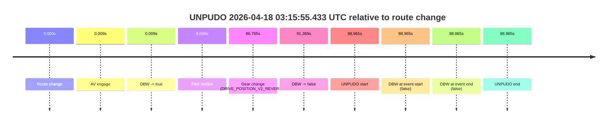

| Metric | Value |
|---|---|
| Outcome | `fail` |
| Effective failure type | `failed_to_unpudo` |
| Route change status | `found` |
| DBW at event start | `false` |
| DBW at event end | `false` |
| Predicted gear at AV start | `DRIVE_POSITION_V2_PARK` |
| Actual gear at AV start | `DRIVE_POSITION_V2_PARK` |
| Predicted gear at event start | `DRIVE_POSITION_V2_REVERSE` |
| Actual gear at event start | `DRIVE_POSITION_V2_REVERSE` |
| Planned indicator direction | `INDICATORS_STATE_V2_OFF` |
| Controller indicator direction | `INDICATORS_STATE_V2_OFF` |
| Actual indicator direction | `INDICATORS_STATE_V2_OFF` |
| Actual indicator at maneuver end | `INDICATORS_STATE_V2_OFF` |
| Driver accel help in AV | `false` |
| Driver accel help timestamp | `n/a` |
| Max accel pedal pct in AV | `0.0%` |
| Max brake pedal pct in AV | `30.2%` |
| Max speed mps in AV | `14.603` |
| Success timing baseline | `route change` |
| Route -> AV | `0.009s` |
| AV -> event start | `98.956s` |
| AV -> first motion | `8.089s` |
| Success baseline -> event start | `98.965s` |
| Success baseline -> first motion | `8.098s` |
| AV duration before disengagement | `91.360s` |
| Trajectory waypoint count | `37` |
| Driving-plan step count | `11` |

The scored portion starts from the AV-owned window, not from the pre-AV setup. Route-change search in the stopped pre-event segment was `found`, with the baseline therefore set to route change. At the event anchor the model predicts `DRIVE_POSITION_V2_REVERSE` and the actual gear is `DRIVE_POSITION_V2_REVERSE`. The effective model outcome is `fail` because `failed_to_unpudo.`

### Resolution

| Field | Value |
|---|---|
| Final outcome | `fail` |
| Do we agree with this label? | `yes` |
| Source disengagement type | `failed_to_unpudo` |
| Resolved effective failure type | `failed_to_unpudo` |
| Confidence | `high` |

## unpudo 2026-04-18 03:16:46.383 UTC

| Field | Value |
|---|---|
| Model | `armadillo-amethyst-squeaky` |
| Author | `guy.geva` |
| Run ID | `fme10003/2026-04-18--02-47-41--gen2-av-8858cd5c-761b-4219-adaf-0d47252e47fd` |
| Date | `2026-04-18` |
| Time (UTC) | `03:16:46.383` |
| Event type | `unpudo` |
| Disengagement type | `none observed` |
| Route change | `found` |
| Console | [run](https://console.sso.wayve.ai/run/fme10003/2026-04-18--02-47-41--gen2-av-8858cd5c-761b-4219-adaf-0d47252e47fd?id=&time-unixus=1776482206383293) |
| Foxglove | [segment](https://app.foxglove.dev/wayve-on-prem/p/prj_0dX18KZdVHg1fmmI/view?ds=foxglove-stream&ds.deviceName=fme10003&ds.start=2026-04-18T03%3A15%3A15.768252Z&ds.end=2026-04-18T03%3A17%3A01.433312Z&layoutId=lay_0e7VD4WIKDQGU73Y&time=2026-04-18T03%3A16%3A46.383293Z) |

### Event card: fail

- Fail: the credited unpudo does not stay AV-owned. The event window starts with DBW false, and the maneuver outcome lands outside a clean AV-owned segment.

| Event | Time (UTC) | Delta from route change |
|---|---:|---:|
| Route change | 2026-04-18 03:15:25.768 | `0.000s` |
| AV engage | 2026-04-18 03:15:25.777 | `0.009s` |
| DBW -> true | 2026-04-18 03:15:25.777 | `0.009s` |
| DBW -> false | 2026-04-18 03:15:47.837 | `22.069s` |
| Gear change (DRIVE_POSITION_V2_DRIVE) | 2026-04-18 03:16:46.383 | `80.615s` |
| UNPUDO start | 2026-04-18 03:16:46.383 | `80.615s` |
| DBW at event start (false) | 2026-04-18 03:16:46.383 | `80.615s` |
| Actual indicator -> left on | 2026-04-18 03:16:47.085 | `81.318s` |
| Actual indicator -> off | 2026-04-18 03:16:48.945 | `83.178s` |
| DBW at event end (false) | 2026-04-18 03:16:51.433 | `85.665s` |
| UNPUDO end | 2026-04-18 03:16:51.433 | `85.665s` |

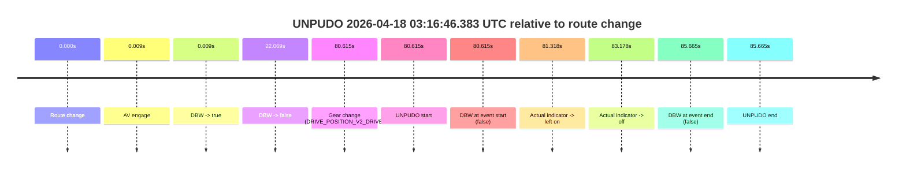

| Metric | Value |
|---|---|
| Outcome | `fail` |
| Effective failure type | `not_av_owned` |
| Route change status | `found` |
| DBW at event start | `false` |
| DBW at event end | `false` |
| Predicted gear at AV start | `DRIVE_POSITION_V2_PARK` |
| Actual gear at AV start | `DRIVE_POSITION_V2_PARK` |
| Predicted gear at event start | `DRIVE_POSITION_V2_REVERSE` |
| Actual gear at event start | `DRIVE_POSITION_V2_DRIVE` |
| Planned indicator direction | `INDICATORS_STATE_V2_OFF` |
| Controller indicator direction | `INDICATORS_STATE_V2_OFF` |
| Actual indicator direction | `INDICATORS_STATE_V2_OFF` |
| Actual indicator at maneuver end | `INDICATORS_STATE_V2_OFF` |
| Driver accel help in AV | `false` |
| Driver accel help timestamp | `n/a` |
| Max accel pedal pct in AV | `0.0%` |
| Max brake pedal pct in AV | `8.0%` |
| Max speed mps in AV | `0.000` |
| Success timing baseline | `route change` |
| Route -> AV | `0.009s` |
| AV -> event start | `80.606s` |
| AV -> first motion | `n/a` |
| Success baseline -> event start | `80.615s` |
| Success baseline -> first motion | `n/a` |
| AV duration before disengagement | `22.060s` |
| Trajectory waypoint count | `36` |
| Driving-plan step count | `11` |

The scored portion starts from the AV-owned window, not from the pre-AV setup. Route-change search in the stopped pre-event segment was `found`, with the baseline therefore set to route change. At the event anchor the model predicts `DRIVE_POSITION_V2_REVERSE` and the actual gear is `DRIVE_POSITION_V2_DRIVE`. The effective model outcome is `fail` because `not_av_owned.`

### Resolution

| Field | Value |
|---|---|
| Final outcome | `fail` |
| Do we agree with this label? | `yes` |
| Source disengagement type | `none observed` |
| Resolved effective failure type | `not_av_owned` |
| Confidence | `high` |

## unpudo 2026-04-18 03:18:03.833 UTC

| Field | Value |
|---|---|
| Model | `armadillo-amethyst-squeaky` |
| Author | `guy.geva` |
| Run ID | `fme10003/2026-04-18--02-47-41--gen2-av-8858cd5c-761b-4219-adaf-0d47252e47fd` |
| Date | `2026-04-18` |
| Time (UTC) | `03:18:03.833` |
| Event type | `unpudo` |
| Disengagement type | `failed_to_unpudo` |
| Route change | `found` |
| Console | [run](https://console.sso.wayve.ai/run/fme10003/2026-04-18--02-47-41--gen2-av-8858cd5c-761b-4219-adaf-0d47252e47fd?id=&time-unixus=1776482283833291) |
| Foxglove | [segment](https://app.foxglove.dev/wayve-on-prem/p/prj_0dX18KZdVHg1fmmI/view?ds=foxglove-stream&ds.deviceName=fme10003&ds.start=2026-04-18T03%3A17%3A42.368448Z&ds.end=2026-04-18T03%3A18%3A17.683290Z&layoutId=lay_0e7VD4WIKDQGU73Y&time=2026-04-18T03%3A18%3A03.833291Z) |

### Event card: fail

- Fail: AV owns part of the segment, but the event still resolves as a model-performance failure under the AV-only scoring rule.

| Event | Time (UTC) | Delta from route change |
|---|---:|---:|
| Route change | 2026-04-18 03:17:52.368 | `0.000s` |
| AV engage | 2026-04-18 03:17:52.377 | `0.009s` |
| DBW -> true | 2026-04-18 03:17:52.377 | `0.009s` |
| Gear change (DRIVE_POSITION_V2_DRIVE) | 2026-04-18 03:17:56.583 | `4.215s` |
| DBW -> false | 2026-04-18 03:18:03.017 | `10.649s` |
| UNPUDO start | 2026-04-18 03:18:03.833 | `11.465s` |
| DBW at event start (false) | 2026-04-18 03:18:03.833 | `11.465s` |
| DBW at event end (false) | 2026-04-18 03:18:07.683 | `15.315s` |
| UNPUDO end | 2026-04-18 03:18:07.683 | `15.315s` |
| Actual indicator -> left on | 2026-04-18 03:18:07.786 | `15.418s` |
| Actual indicator -> off | 2026-04-18 03:18:09.686 | `17.318s` |

| Metric | Value |
|---|---|
| Outcome | `fail` |
| Effective failure type | `failed_to_unpudo` |
| Route change status | `found` |
| DBW at event start | `false` |
| DBW at event end | `false` |
| Predicted gear at AV start | `DRIVE_POSITION_V2_PARK` |
| Actual gear at AV start | `DRIVE_POSITION_V2_PARK` |
| Predicted gear at event start | `DRIVE_POSITION_V2_DRIVE` |
| Actual gear at event start | `DRIVE_POSITION_V2_DRIVE` |
| Planned indicator direction | `INDICATORS_STATE_V2_LEFT_ON` |
| Controller indicator direction | `INDICATORS_STATE_V2_LEFT_ON` |
| Actual indicator direction | `INDICATORS_STATE_V2_OFF` |
| Actual indicator at maneuver end | `INDICATORS_STATE_V2_OFF` |
| Driver accel help in AV | `false` |
| Driver accel help timestamp | `n/a` |
| Max accel pedal pct in AV | `0.0%` |
| Max brake pedal pct in AV | `8.0%` |
| Max speed mps in AV | `0.000` |
| Success timing baseline | `route change` |
| Route -> AV | `0.009s` |
| AV -> event start | `11.456s` |
| AV -> first motion | `n/a` |
| Success baseline -> event start | `11.465s` |
| Success baseline -> first motion | `n/a` |
| AV duration before disengagement | `10.640s` |
| Trajectory waypoint count | `37` |
| Driving-plan step count | `11` |

The scored portion starts from the AV-owned window, not from the pre-AV setup. Route-change search in the stopped pre-event segment was `found`, with the baseline therefore set to route change. At the event anchor the model predicts `DRIVE_POSITION_V2_DRIVE` and the actual gear is `DRIVE_POSITION_V2_DRIVE`. The effective model outcome is `fail` because `failed_to_unpudo.`

### Resolution

| Field | Value |
|---|---|
| Final outcome | `fail` |
| Do we agree with this label? | `yes` |
| Source disengagement type | `failed_to_unpudo` |
| Resolved effective failure type | `failed_to_unpudo` |
| Confidence | `high` |

## unpudo 2026-04-18 03:23:21.483 UTC

| Field | Value |
|---|---|
| Model | `armadillo-amethyst-squeaky` |
| Author | `guy.geva` |
| Run ID | `fme10003/2026-04-18--02-47-41--gen2-av-8858cd5c-761b-4219-adaf-0d47252e47fd` |
| Date | `2026-04-18` |
| Time (UTC) | `03:23:21.483` |
| Event type | `unpudo` |
| Disengagement type | `failed_to_unpudo` |
| Route change | `found` |
| Console | [run](https://console.sso.wayve.ai/run/fme10003/2026-04-18--02-47-41--gen2-av-8858cd5c-761b-4219-adaf-0d47252e47fd?id=&time-unixus=1776482601483315) |
| Foxglove | [segment](https://app.foxglove.dev/wayve-on-prem/p/prj_0dX18KZdVHg1fmmI/view?ds=foxglove-stream&ds.deviceName=fme10003&ds.start=2026-04-18T03%3A21%3A26.618255Z&ds.end=2026-04-18T03%3A23%3A35.583319Z&layoutId=lay_0e7VD4WIKDQGU73Y&time=2026-04-18T03%3A23%3A21.483315Z) |

### Event card: fail

- Fail: AV owns part of the segment, but the event still resolves as a model-performance failure under the AV-only scoring rule.

| Event | Time (UTC) | Delta from route change |
|---|---:|---:|
| Route change | 2026-04-18 03:21:36.618 | `0.000s` |
| First motion | 2026-04-18 03:21:55.126 | `18.508s` |
| AV engage | 2026-04-18 03:22:15.278 | `38.660s` |
| DBW -> true | 2026-04-18 03:22:15.278 | `38.660s` |
| Gear change (DRIVE_POSITION_V2_DRIVE) | 2026-04-18 03:23:16.133 | `99.515s` |
| DBW -> false | 2026-04-18 03:23:20.717 | `104.099s` |
| Actual indicator -> left on | 2026-04-18 03:23:21.145 | `104.528s` |
| UNPUDO start | 2026-04-18 03:23:21.483 | `104.865s` |
| DBW at event start (false) | 2026-04-18 03:23:21.483 | `104.865s` |
| Actual indicator -> off | 2026-04-18 03:23:23.046 | `106.428s` |
| DBW at event end (false) | 2026-04-18 03:23:25.583 | `108.965s` |
| UNPUDO end | 2026-04-18 03:23:25.583 | `108.965s` |

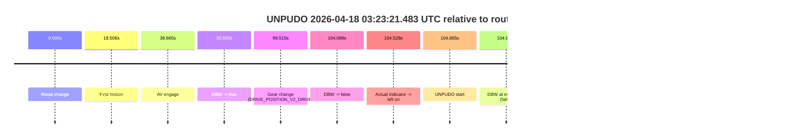

| Metric | Value |
|---|---|
| Outcome | `fail` |
| Effective failure type | `failed_to_unpudo` |
| Route change status | `found` |
| DBW at event start | `false` |
| DBW at event end | `false` |
| Predicted gear at AV start | `DRIVE_POSITION_V2_DRIVE` |
| Actual gear at AV start | `DRIVE_POSITION_V2_DRIVE` |
| Predicted gear at event start | `DRIVE_POSITION_V2_DRIVE` |
| Actual gear at event start | `DRIVE_POSITION_V2_DRIVE` |
| Planned indicator direction | `INDICATORS_STATE_V2_RIGHT_ON` |
| Controller indicator direction | `INDICATORS_STATE_V2_RIGHT_ON` |
| Actual indicator direction | `INDICATORS_STATE_V2_LEFT_ON` |
| Actual indicator at maneuver end | `INDICATORS_STATE_V2_OFF` |
| Driver accel help in AV | `false` |
| Driver accel help timestamp | `n/a` |
| Max accel pedal pct in AV | `0.0%` |
| Max brake pedal pct in AV | `15.0%` |
| Max speed mps in AV | `15.164` |
| Success timing baseline | `route change` |
| Route -> AV | `38.660s` |
| AV -> event start | `66.205s` |
| AV -> first motion | `-20.152s` |
| Success baseline -> event start | `104.865s` |
| Success baseline -> first motion | `18.508s` |
| AV duration before disengagement | `65.439s` |
| Trajectory waypoint count | `36` |
| Driving-plan step count | `11` |

The scored portion starts from the AV-owned window, not from the pre-AV setup. Route-change search in the stopped pre-event segment was `found`, with the baseline therefore set to route change. At the event anchor the model predicts `DRIVE_POSITION_V2_DRIVE` and the actual gear is `DRIVE_POSITION_V2_DRIVE`. The effective model outcome is `fail` because `failed_to_unpudo.`

### Resolution

| Field | Value |
|---|---|
| Final outcome | `fail` |
| Do we agree with this label? | `yes` |
| Source disengagement type | `failed_to_unpudo` |
| Resolved effective failure type | `failed_to_unpudo` |
| Confidence | `high` |

## unpudo 2026-04-18 03:27:17.533 UTC

| Field | Value |
|---|---|
| Model | `armadillo-amethyst-squeaky` |
| Author | `guy.geva` |
| Run ID | `fme10003/2026-04-18--02-47-41--gen2-av-8858cd5c-761b-4219-adaf-0d47252e47fd` |
| Date | `2026-04-18` |
| Time (UTC) | `03:27:17.533` |
| Event type | `unpudo` |
| Disengagement type | `late_turn` |
| Route change | `found` |
| Console | [run](https://console.sso.wayve.ai/run/fme10003/2026-04-18--02-47-41--gen2-av-8858cd5c-761b-4219-adaf-0d47252e47fd?id=&time-unixus=1776482837533317) |
| Foxglove | [segment](https://app.foxglove.dev/wayve-on-prem/p/prj_0dX18KZdVHg1fmmI/view?ds=foxglove-stream&ds.deviceName=fme10003&ds.start=2026-04-18T03%3A26%3A20.718304Z&ds.end=2026-04-18T03%3A27%3A37.533316Z&layoutId=lay_0e7VD4WIKDQGU73Y&time=2026-04-18T03%3A27%3A17.533317Z) |

### Event card: fail

- Fail: AV owns part of the segment, but the event still resolves as a model-performance failure under the AV-only scoring rule.

| Event | Time (UTC) | Delta from route change |
|---|---:|---:|
| Route change | 2026-04-18 03:26:30.718 | `0.000s` |
| First motion | 2026-04-18 03:26:30.725 | `0.008s` |
| AV engage | 2026-04-18 03:26:55.277 | `24.559s` |
| DBW -> true | 2026-04-18 03:26:55.277 | `24.559s` |
| DBW -> false | 2026-04-18 03:27:04.818 | `34.100s` |
| Gear change (DRIVE_POSITION_V2_REVERSE) | 2026-04-18 03:27:08.333 | `37.615s` |
| UNPUDO start | 2026-04-18 03:27:17.533 | `46.815s` |
| DBW at event start (false) | 2026-04-18 03:27:17.533 | `46.815s` |
| Actual indicator -> left on | 2026-04-18 03:27:20.185 | `49.468s` |
| Actual indicator -> off | 2026-04-18 03:27:22.085 | `51.368s` |
| DBW at event end (false) | 2026-04-18 03:27:27.533 | `56.815s` |
| UNPUDO end | 2026-04-18 03:27:27.533 | `56.815s` |

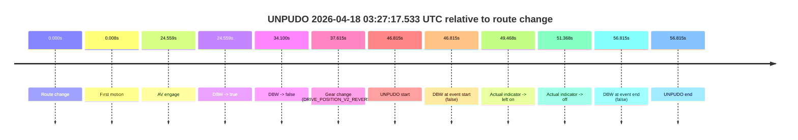

| Metric | Value |
|---|---|
| Outcome | `fail` |
| Effective failure type | `late_turn` |
| Route change status | `found` |
| DBW at event start | `false` |
| DBW at event end | `false` |
| Predicted gear at AV start | `DRIVE_POSITION_V2_DRIVE` |
| Actual gear at AV start | `DRIVE_POSITION_V2_DRIVE` |
| Predicted gear at event start | `DRIVE_POSITION_V2_REVERSE` |
| Actual gear at event start | `DRIVE_POSITION_V2_REVERSE` |
| Planned indicator direction | `INDICATORS_STATE_V2_OFF` |
| Controller indicator direction | `INDICATORS_STATE_V2_OFF` |
| Actual indicator direction | `INDICATORS_STATE_V2_OFF` |
| Actual indicator at maneuver end | `INDICATORS_STATE_V2_OFF` |
| Driver accel help in AV | `false` |
| Driver accel help timestamp | `n/a` |
| Max accel pedal pct in AV | `0.0%` |
| Max brake pedal pct in AV | `0.0%` |
| Max speed mps in AV | `4.411` |
| Success timing baseline | `route change` |
| Route -> AV | `24.559s` |
| AV -> event start | `22.256s` |
| AV -> first motion | `-24.551s` |
| Success baseline -> event start | `46.815s` |
| Success baseline -> first motion | `0.008s` |
| AV duration before disengagement | `9.541s` |
| Trajectory waypoint count | `35` |
| Driving-plan step count | `11` |

The scored portion starts from the AV-owned window, not from the pre-AV setup. Route-change search in the stopped pre-event segment was `found`, with the baseline therefore set to route change. At the event anchor the model predicts `DRIVE_POSITION_V2_REVERSE` and the actual gear is `DRIVE_POSITION_V2_REVERSE`. The effective model outcome is `fail` because `late_turn.`

### Resolution

| Field | Value |
|---|---|
| Final outcome | `fail` |
| Do we agree with this label? | `yes` |
| Source disengagement type | `late_turn` |
| Resolved effective failure type | `late_turn` |
| Confidence | `high` |

## unpudo 2026-04-18 03:28:37.833 UTC

| Field | Value |
|---|---|
| Model | `armadillo-amethyst-squeaky` |
| Author | `guy.geva` |
| Run ID | `fme10003/2026-04-18--02-47-41--gen2-av-8858cd5c-761b-4219-adaf-0d47252e47fd` |
| Date | `2026-04-18` |
| Time (UTC) | `03:28:37.833` |
| Event type | `unpudo` |
| Disengagement type | `none observed` |
| Route change | `found` |
| Console | [run](https://console.sso.wayve.ai/run/fme10003/2026-04-18--02-47-41--gen2-av-8858cd5c-761b-4219-adaf-0d47252e47fd?id=&time-unixus=1776482917833294) |
| Foxglove | [segment](https://app.foxglove.dev/wayve-on-prem/p/prj_0dX18KZdVHg1fmmI/view?ds=foxglove-stream&ds.deviceName=fme10003&ds.start=2026-04-18T03%3A27%3A09.718313Z&ds.end=2026-04-18T03%3A28%3A47.833294Z&layoutId=lay_0e7VD4WIKDQGU73Y&time=2026-04-18T03%3A28%3A37.833294Z) |

### Event card: fail

- Fail: the credited unpudo does not stay AV-owned. The event window starts with DBW false, and the maneuver outcome lands outside a clean AV-owned segment.

| Event | Time (UTC) | Delta from route change |
|---|---:|---:|
| Route change | 2026-04-18 03:27:19.718 | `0.000s` |
| Actual indicator -> left on | 2026-04-18 03:27:20.185 | `0.468s` |
| First motion | 2026-04-18 03:27:21.726 | `2.008s` |
| Actual indicator -> off | 2026-04-18 03:27:22.085 | `2.368s` |
| AV engage | 2026-04-18 03:27:28.917 | `9.199s` |
| DBW -> true | 2026-04-18 03:27:28.917 | `9.199s` |
| DBW -> false | 2026-04-18 03:28:05.237 | `45.519s` |
| Gear change (DRIVE_POSITION_V2_REVERSE) | 2026-04-18 03:28:31.783 | `72.065s` |
| UNPUDO start | 2026-04-18 03:28:37.833 | `78.115s` |
| DBW at event start (false) | 2026-04-18 03:28:37.833 | `78.115s` |
| DBW at event end (false) | 2026-04-18 03:28:37.833 | `78.115s` |
| UNPUDO end | 2026-04-18 03:28:37.833 | `78.115s` |

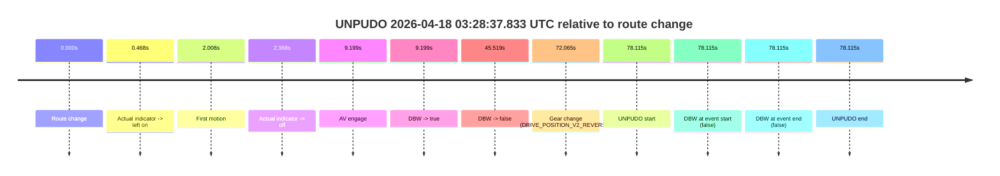

| Metric | Value |
|---|---|
| Outcome | `fail` |
| Effective failure type | `completed_outside_av` |
| Route change status | `found` |
| DBW at event start | `false` |
| DBW at event end | `false` |
| Predicted gear at AV start | `DRIVE_POSITION_V2_DRIVE` |
| Actual gear at AV start | `DRIVE_POSITION_V2_DRIVE` |
| Predicted gear at event start | `DRIVE_POSITION_V2_REVERSE` |
| Actual gear at event start | `DRIVE_POSITION_V2_REVERSE` |
| Planned indicator direction | `INDICATORS_STATE_V2_OFF` |
| Controller indicator direction | `INDICATORS_STATE_V2_OFF` |
| Actual indicator direction | `INDICATORS_STATE_V2_OFF` |
| Actual indicator at maneuver end | `INDICATORS_STATE_V2_OFF` |
| Driver accel help in AV | `false` |
| Driver accel help timestamp | `n/a` |
| Max accel pedal pct in AV | `0.0%` |
| Max brake pedal pct in AV | `10.3%` |
| Max speed mps in AV | `6.942` |
| Success timing baseline | `route change` |
| Route -> AV | `9.199s` |
| AV -> event start | `68.916s` |
| AV -> first motion | `-7.191s` |
| Success baseline -> event start | `78.115s` |
| Success baseline -> first motion | `2.008s` |
| AV duration before disengagement | `36.320s` |
| Trajectory waypoint count | `37` |
| Driving-plan step count | `11` |

The scored portion starts from the AV-owned window, not from the pre-AV setup. Route-change search in the stopped pre-event segment was `found`, with the baseline therefore set to route change. At the event anchor the model predicts `DRIVE_POSITION_V2_REVERSE` and the actual gear is `DRIVE_POSITION_V2_REVERSE`. The effective model outcome is `fail` because `completed_outside_av.`

### Resolution

| Field | Value |
|---|---|
| Final outcome | `fail` |
| Do we agree with this label? | `yes` |
| Source disengagement type | `none observed` |
| Resolved effective failure type | `completed_outside_av` |
| Confidence | `high` |

## unpudo 2026-04-18 03:38:55.783 UTC

| Field | Value |
|---|---|
| Model | `armadillo-amethyst-squeaky` |
| Author | `guy.geva` |
| Run ID | `fme10003/2026-04-18--02-47-41--gen2-av-8858cd5c-761b-4219-adaf-0d47252e47fd` |
| Date | `2026-04-18` |
| Time (UTC) | `03:38:55.783` |
| Event type | `unpudo` |
| Disengagement type | `failed_to_pudo` |
| Route change | `unclear` |
| Console | [run](https://console.sso.wayve.ai/run/fme10003/2026-04-18--02-47-41--gen2-av-8858cd5c-761b-4219-adaf-0d47252e47fd?id=&time-unixus=1776483535783300) |
| Foxglove | [segment](https://app.foxglove.dev/wayve-on-prem/p/prj_0dX18KZdVHg1fmmI/view?ds=foxglove-stream&ds.deviceName=fme10003&ds.start=2026-04-18T03%3A37%3A43.258301Z&ds.end=2026-04-18T03%3A39%3A21.333316Z&layoutId=lay_0e7VD4WIKDQGU73Y&time=2026-04-18T03%3A38%3A55.783300Z) |

### Event card: fail

- Fail: AV owns part of the segment, but the event still resolves as a model-performance failure under the AV-only scoring rule.

| Event | Time (UTC) | Delta from AV start |
|---|---:|---:|
| First motion | 2026-04-18 03:36:55.786 | `-57.472s` |
| Route change unclear | 2026-04-18 03:37:53.258 | `0.000s` |
| AV engage | 2026-04-18 03:37:53.258 | `0.000s` |
| DBW -> true | 2026-04-18 03:37:53.258 | `0.000s` |
| DBW -> false | 2026-04-18 03:38:48.778 | `55.520s` |
| Gear change (DRIVE_POSITION_V2_REVERSE) | 2026-04-18 03:38:51.933 | `58.675s` |
| UNPUDO start | 2026-04-18 03:38:55.783 | `62.525s` |
| DBW at event start (false) | 2026-04-18 03:38:55.783 | `62.525s` |
| DBW at event end (false) | 2026-04-18 03:39:11.333 | `78.075s` |
| UNPUDO end | 2026-04-18 03:39:11.333 | `78.075s` |

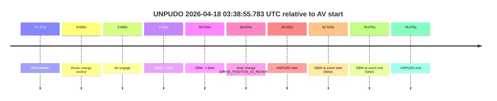

| Metric | Value |
|---|---|
| Outcome | `fail` |
| Effective failure type | `failed_to_pudo` |
| Route change status | `unclear` |
| DBW at event start | `false` |
| DBW at event end | `false` |
| Predicted gear at AV start | `DRIVE_POSITION_V2_DRIVE` |
| Actual gear at AV start | `DRIVE_POSITION_V2_DRIVE` |
| Predicted gear at event start | `DRIVE_POSITION_V2_REVERSE` |
| Actual gear at event start | `DRIVE_POSITION_V2_REVERSE` |
| Planned indicator direction | `INDICATORS_STATE_V2_OFF` |
| Controller indicator direction | `INDICATORS_STATE_V2_OFF` |
| Actual indicator direction | `INDICATORS_STATE_V2_OFF` |
| Actual indicator at maneuver end | `INDICATORS_STATE_V2_OFF` |
| Driver accel help in AV | `false` |
| Driver accel help timestamp | `n/a` |
| Max accel pedal pct in AV | `0.0%` |
| Max brake pedal pct in AV | `8.0%` |
| Max speed mps in AV | `11.364` |
| Success timing baseline | `AV start` |
| Route -> AV | `n/a` |
| AV -> event start | `62.525s` |
| AV -> first motion | `-57.472s` |
| Success baseline -> event start | `62.525s` |
| Success baseline -> first motion | `-57.472s` |
| AV duration before disengagement | `55.520s` |
| Trajectory waypoint count | `36` |
| Driving-plan step count | `11` |

The scored portion starts from the AV-owned window, not from the pre-AV setup. Route-change search in the stopped pre-event segment was `unclear`, with the baseline therefore set to AV start. At the event anchor the model predicts `DRIVE_POSITION_V2_REVERSE` and the actual gear is `DRIVE_POSITION_V2_REVERSE`. The effective model outcome is `fail` because `failed_to_pudo.`

### Resolution

| Field | Value |
|---|---|
| Final outcome | `fail` |
| Do we agree with this label? | `yes` |
| Source disengagement type | `failed_to_pudo` |
| Resolved effective failure type | `failed_to_pudo` |
| Confidence | `medium` |

## unpudo 2026-04-18 03:39:32.183 UTC

| Field | Value |
|---|---|
| Model | `armadillo-amethyst-squeaky` |
| Author | `guy.geva` |
| Run ID | `fme10003/2026-04-18--02-47-41--gen2-av-8858cd5c-761b-4219-adaf-0d47252e47fd` |
| Date | `2026-04-18` |
| Time (UTC) | `03:39:32.183` |
| Event type | `unpudo` |
| Disengagement type | `none observed` |
| Route change | `unclear` |
| Console | [run](https://console.sso.wayve.ai/run/fme10003/2026-04-18--02-47-41--gen2-av-8858cd5c-761b-4219-adaf-0d47252e47fd?id=&time-unixus=1776483572183291) |
| Foxglove | [segment](https://app.foxglove.dev/wayve-on-prem/p/prj_0dX18KZdVHg1fmmI/view?ds=foxglove-stream&ds.deviceName=fme10003&ds.start=2026-04-18T03%3A37%3A43.258301Z&ds.end=2026-04-18T03%3A39%3A42.183291Z&layoutId=lay_0e7VD4WIKDQGU73Y&time=2026-04-18T03%3A39%3A32.183291Z) |

### Event card: fail

- Fail: the credited unpudo does not stay AV-owned. The event window starts with DBW false, and the maneuver outcome lands outside a clean AV-owned segment.

| Event | Time (UTC) | Delta from AV start |
|---|---:|---:|
| First motion | 2026-04-18 03:37:32.186 | `-21.072s` |
| Route change unclear | 2026-04-18 03:37:53.258 | `0.000s` |
| AV engage | 2026-04-18 03:37:53.258 | `0.000s` |
| DBW -> true | 2026-04-18 03:37:53.258 | `0.000s` |
| DBW -> false | 2026-04-18 03:38:48.778 | `55.520s` |
| Gear change (DRIVE_POSITION_V2_REVERSE) | 2026-04-18 03:39:30.983 | `97.725s` |
| UNPUDO start | 2026-04-18 03:39:32.183 | `98.925s` |
| DBW at event start (false) | 2026-04-18 03:39:32.183 | `98.925s` |
| DBW at event end (false) | 2026-04-18 03:39:32.183 | `98.925s` |
| UNPUDO end | 2026-04-18 03:39:32.183 | `98.925s` |

| Metric | Value |
|---|---|
| Outcome | `fail` |
| Effective failure type | `completed_outside_av` |
| Route change status | `unclear` |
| DBW at event start | `false` |
| DBW at event end | `false` |
| Predicted gear at AV start | `DRIVE_POSITION_V2_DRIVE` |
| Actual gear at AV start | `DRIVE_POSITION_V2_DRIVE` |
| Predicted gear at event start | `DRIVE_POSITION_V2_REVERSE` |
| Actual gear at event start | `DRIVE_POSITION_V2_REVERSE` |
| Planned indicator direction | `INDICATORS_STATE_V2_OFF` |
| Controller indicator direction | `INDICATORS_STATE_V2_OFF` |
| Actual indicator direction | `INDICATORS_STATE_V2_OFF` |
| Actual indicator at maneuver end | `INDICATORS_STATE_V2_OFF` |
| Driver accel help in AV | `false` |
| Driver accel help timestamp | `n/a` |
| Max accel pedal pct in AV | `0.0%` |
| Max brake pedal pct in AV | `8.0%` |
| Max speed mps in AV | `11.364` |
| Success timing baseline | `AV start` |
| Route -> AV | `n/a` |
| AV -> event start | `98.925s` |
| AV -> first motion | `-21.072s` |
| Success baseline -> event start | `98.925s` |
| Success baseline -> first motion | `-21.072s` |
| AV duration before disengagement | `55.520s` |
| Trajectory waypoint count | `36` |
| Driving-plan step count | `11` |

The scored portion starts from the AV-owned window, not from the pre-AV setup. Route-change search in the stopped pre-event segment was `unclear`, with the baseline therefore set to AV start. At the event anchor the model predicts `DRIVE_POSITION_V2_REVERSE` and the actual gear is `DRIVE_POSITION_V2_REVERSE`. The effective model outcome is `fail` because `completed_outside_av.`

### Resolution

| Field | Value |
|---|---|
| Final outcome | `fail` |
| Do we agree with this label? | `yes` |
| Source disengagement type | `none observed` |
| Resolved effective failure type | `completed_outside_av` |
| Confidence | `medium` |

## unpudo 2026-04-18 03:43:51.233 UTC

| Field | Value |
|---|---|
| Model | `armadillo-amethyst-squeaky` |
| Author | `guy.geva` |
| Run ID | `fme10003/2026-04-18--02-47-41--gen2-av-8858cd5c-761b-4219-adaf-0d47252e47fd` |
| Date | `2026-04-18` |
| Time (UTC) | `03:43:51.233` |
| Event type | `unpudo` |
| Disengagement type | `failed_to_unpudo` |
| Route change | `found` |
| Console | [run](https://console.sso.wayve.ai/run/fme10003/2026-04-18--02-47-41--gen2-av-8858cd5c-761b-4219-adaf-0d47252e47fd?id=&time-unixus=1776483831233322) |
| Foxglove | [segment](https://app.foxglove.dev/wayve-on-prem/p/prj_0dX18KZdVHg1fmmI/view?ds=foxglove-stream&ds.deviceName=fme10003&ds.start=2026-04-18T03%3A43%3A24.918275Z&ds.end=2026-04-18T03%3A44%3A09.133312Z&layoutId=lay_0e7VD4WIKDQGU73Y&time=2026-04-18T03%3A43%3A51.233322Z) |

### Event card: fail

- Fail: AV owns part of the segment, but the event still resolves as a model-performance failure under the AV-only scoring rule.

| Event | Time (UTC) | Delta from route change |
|---|---:|---:|
| Route change | 2026-04-18 03:43:34.918 | `0.000s` |
| AV engage | 2026-04-18 03:43:34.927 | `0.009s` |
| DBW -> true | 2026-04-18 03:43:34.927 | `0.009s` |
| Gear change (DRIVE_POSITION_V2_DRIVE) | 2026-04-18 03:43:44.633 | `9.715s` |
| DBW -> false | 2026-04-18 03:43:49.037 | `14.119s` |
| Actual indicator -> left on | 2026-04-18 03:43:49.706 | `14.788s` |
| UNPUDO start | 2026-04-18 03:43:51.233 | `16.315s` |
| DBW at event start (false) | 2026-04-18 03:43:51.233 | `16.315s` |
| Actual indicator -> off | 2026-04-18 03:43:54.286 | `19.368s` |
| Actual indicator -> left on | 2026-04-18 03:43:58.206 | `23.288s` |
| DBW at event end (false) | 2026-04-18 03:43:59.133 | `24.215s` |
| UNPUDO end | 2026-04-18 03:43:59.133 | `24.215s` |
| Actual indicator -> off | 2026-04-18 03:44:00.105 | `25.188s` |

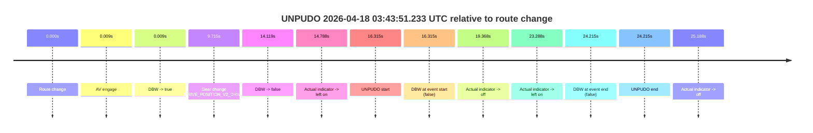

| Metric | Value |
|---|---|
| Outcome | `fail` |
| Effective failure type | `failed_to_unpudo` |
| Route change status | `found` |
| DBW at event start | `false` |
| DBW at event end | `false` |
| Predicted gear at AV start | `DRIVE_POSITION_V2_PARK` |
| Actual gear at AV start | `DRIVE_POSITION_V2_PARK` |
| Predicted gear at event start | `DRIVE_POSITION_V2_DRIVE` |
| Actual gear at event start | `DRIVE_POSITION_V2_DRIVE` |
| Planned indicator direction | `INDICATORS_STATE_V2_RIGHT_ON` |
| Controller indicator direction | `INDICATORS_STATE_V2_RIGHT_ON` |
| Actual indicator direction | `INDICATORS_STATE_V2_LEFT_ON` |
| Actual indicator at maneuver end | `INDICATORS_STATE_V2_LEFT_ON` |
| Driver accel help in AV | `false` |
| Driver accel help timestamp | `n/a` |
| Max accel pedal pct in AV | `0.0%` |
| Max brake pedal pct in AV | `8.0%` |
| Max speed mps in AV | `0.000` |
| Success timing baseline | `route change` |
| Route -> AV | `0.009s` |
| AV -> event start | `16.306s` |
| AV -> first motion | `n/a` |
| Success baseline -> event start | `16.315s` |
| Success baseline -> first motion | `n/a` |
| AV duration before disengagement | `14.110s` |
| Trajectory waypoint count | `37` |
| Driving-plan step count | `11` |

The scored portion starts from the AV-owned window, not from the pre-AV setup. Route-change search in the stopped pre-event segment was `found`, with the baseline therefore set to route change. At the event anchor the model predicts `DRIVE_POSITION_V2_DRIVE` and the actual gear is `DRIVE_POSITION_V2_DRIVE`. The effective model outcome is `fail` because `failed_to_unpudo.`

### Resolution

| Field | Value |
|---|---|
| Final outcome | `fail` |
| Do we agree with this label? | `yes` |
| Source disengagement type | `failed_to_unpudo` |
| Resolved effective failure type | `failed_to_unpudo` |
| Confidence | `high` |

## unpudo 2026-04-18 03:45:15.083 UTC

| Field | Value |
|---|---|
| Model | `armadillo-amethyst-squeaky` |
| Author | `guy.geva` |
| Run ID | `fme10003/2026-04-18--02-47-41--gen2-av-8858cd5c-761b-4219-adaf-0d47252e47fd` |
| Date | `2026-04-18` |
| Time (UTC) | `03:45:15.083` |
| Event type | `unpudo` |
| Disengagement type | `none observed` |
| Route change | `found` |
| Console | [run](https://console.sso.wayve.ai/run/fme10003/2026-04-18--02-47-41--gen2-av-8858cd5c-761b-4219-adaf-0d47252e47fd?id=&time-unixus=1776483915083315) |
| Foxglove | [segment](https://app.foxglove.dev/wayve-on-prem/p/prj_0dX18KZdVHg1fmmI/view?ds=foxglove-stream&ds.deviceName=fme10003&ds.start=2026-04-18T03%3A43%3A24.918275Z&ds.end=2026-04-18T03%3A45%3A38.983302Z&layoutId=lay_0e7VD4WIKDQGU73Y&time=2026-04-18T03%3A45%3A15.083315Z) |

### Event card: fail

- Fail: the credited unpudo does not stay AV-owned. The event window starts with DBW false, and the maneuver outcome lands outside a clean AV-owned segment.

| Event | Time (UTC) | Delta from route change |
|---|---:|---:|
| Route change | 2026-04-18 03:43:34.918 | `0.000s` |
| AV engage | 2026-04-18 03:43:34.927 | `0.009s` |
| DBW -> true | 2026-04-18 03:43:34.927 | `0.009s` |
| DBW -> false | 2026-04-18 03:43:49.037 | `14.119s` |
| Actual indicator -> left on | 2026-04-18 03:43:49.706 | `14.788s` |
| Actual indicator -> off | 2026-04-18 03:43:54.286 | `19.368s` |
| Actual indicator -> left on | 2026-04-18 03:43:58.206 | `23.288s` |
| Actual indicator -> off | 2026-04-18 03:44:00.105 | `25.188s` |
| Actual indicator -> left on | 2026-04-18 03:44:29.206 | `54.288s` |
| Actual indicator -> off | 2026-04-18 03:44:31.105 | `56.188s` |
| Actual indicator -> left on | 2026-04-18 03:44:34.806 | `59.888s` |
| Actual indicator -> off | 2026-04-18 03:44:48.205 | `73.288s` |
| Actual indicator -> right on | 2026-04-18 03:44:49.685 | `74.768s` |
| Actual indicator -> off | 2026-04-18 03:44:51.585 | `76.668s` |
| Actual indicator -> left on | 2026-04-18 03:45:02.205 | `87.288s` |
| Actual indicator -> off | 2026-04-18 03:45:04.106 | `89.188s` |
| Gear change (DRIVE_POSITION_V2_REVERSE) | 2026-04-18 03:45:08.133 | `93.215s` |
| UNPUDO start | 2026-04-18 03:45:15.083 | `100.165s` |
| DBW at event start (false) | 2026-04-18 03:45:15.083 | `100.165s` |
| DBW at event end (false) | 2026-04-18 03:45:28.983 | `114.065s` |
| UNPUDO end | 2026-04-18 03:45:28.983 | `114.065s` |

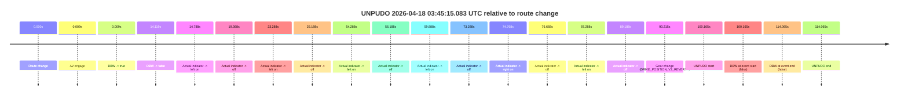

| Metric | Value |
|---|---|
| Outcome | `fail` |
| Effective failure type | `not_av_owned` |
| Route change status | `found` |
| DBW at event start | `false` |
| DBW at event end | `false` |
| Predicted gear at AV start | `DRIVE_POSITION_V2_PARK` |
| Actual gear at AV start | `DRIVE_POSITION_V2_PARK` |
| Predicted gear at event start | `DRIVE_POSITION_V2_REVERSE` |
| Actual gear at event start | `DRIVE_POSITION_V2_REVERSE` |
| Planned indicator direction | `INDICATORS_STATE_V2_OFF` |
| Controller indicator direction | `INDICATORS_STATE_V2_OFF` |
| Actual indicator direction | `INDICATORS_STATE_V2_OFF` |
| Actual indicator at maneuver end | `INDICATORS_STATE_V2_OFF` |
| Driver accel help in AV | `false` |
| Driver accel help timestamp | `n/a` |
| Max accel pedal pct in AV | `0.0%` |
| Max brake pedal pct in AV | `8.0%` |
| Max speed mps in AV | `0.000` |
| Success timing baseline | `route change` |
| Route -> AV | `0.009s` |
| AV -> event start | `100.156s` |
| AV -> first motion | `n/a` |
| Success baseline -> event start | `100.165s` |
| Success baseline -> first motion | `n/a` |
| AV duration before disengagement | `14.110s` |
| Trajectory waypoint count | `36` |
| Driving-plan step count | `11` |

The scored portion starts from the AV-owned window, not from the pre-AV setup. Route-change search in the stopped pre-event segment was `found`, with the baseline therefore set to route change. At the event anchor the model predicts `DRIVE_POSITION_V2_REVERSE` and the actual gear is `DRIVE_POSITION_V2_REVERSE`. The effective model outcome is `fail` because `not_av_owned.`

### Resolution

| Field | Value |
|---|---|
| Final outcome | `fail` |
| Do we agree with this label? | `yes` |
| Source disengagement type | `none observed` |
| Resolved effective failure type | `not_av_owned` |
| Confidence | `high` |

## unpudo 2026-04-18 03:48:23.033 UTC

| Field | Value |
|---|---|
| Model | `armadillo-amethyst-squeaky` |
| Author | `guy.geva` |
| Run ID | `fme10003/2026-04-18--02-47-41--gen2-av-8858cd5c-761b-4219-adaf-0d47252e47fd` |
| Date | `2026-04-18` |
| Time (UTC) | `03:48:23.033` |
| Event type | `unpudo` |
| Disengagement type | `failed_to_unpudo` |
| Route change | `found` |
| Console | [run](https://console.sso.wayve.ai/run/fme10003/2026-04-18--02-47-41--gen2-av-8858cd5c-761b-4219-adaf-0d47252e47fd?id=&time-unixus=1776484103033310) |
| Foxglove | [segment](https://app.foxglove.dev/wayve-on-prem/p/prj_0dX18KZdVHg1fmmI/view?ds=foxglove-stream&ds.deviceName=fme10003&ds.start=2026-04-18T03%3A47%3A53.868282Z&ds.end=2026-04-18T03%3A48%3A40.583301Z&layoutId=lay_0e7VD4WIKDQGU73Y&time=2026-04-18T03%3A48%3A23.033310Z) |

### Event card: fail

- Fail: AV owns part of the segment, but the event still resolves as a model-performance failure under the AV-only scoring rule.

| Event | Time (UTC) | Delta from route change |
|---|---:|---:|
| Route change | 2026-04-18 03:48:03.868 | `0.000s` |
| AV engage | 2026-04-18 03:48:14.897 | `11.029s` |
| DBW -> true | 2026-04-18 03:48:14.897 | `11.029s` |
| Gear change (DRIVE_POSITION_V2_DRIVE) | 2026-04-18 03:48:17.633 | `13.765s` |
| DBW -> false | 2026-04-18 03:48:22.057 | `18.189s` |
| UNPUDO start | 2026-04-18 03:48:23.033 | `19.165s` |
| DBW at event start (false) | 2026-04-18 03:48:23.033 | `19.165s` |
| Actual indicator -> left on | 2026-04-18 03:48:23.566 | `19.698s` |
| Actual indicator -> off | 2026-04-18 03:48:25.466 | `21.598s` |
| DBW at event end (false) | 2026-04-18 03:48:30.583 | `26.715s` |
| UNPUDO end | 2026-04-18 03:48:30.583 | `26.715s` |
| Actual indicator -> right on | 2026-04-18 03:48:48.665 | `44.798s` |

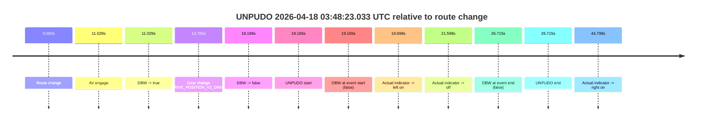

| Metric | Value |
|---|---|
| Outcome | `fail` |
| Effective failure type | `failed_to_unpudo` |
| Route change status | `found` |
| DBW at event start | `false` |
| DBW at event end | `false` |
| Predicted gear at AV start | `DRIVE_POSITION_V2_PARK` |
| Actual gear at AV start | `DRIVE_POSITION_V2_PARK` |
| Predicted gear at event start | `DRIVE_POSITION_V2_DRIVE` |
| Actual gear at event start | `DRIVE_POSITION_V2_DRIVE` |
| Planned indicator direction | `INDICATORS_STATE_V2_OFF` |
| Controller indicator direction | `INDICATORS_STATE_V2_OFF` |
| Actual indicator direction | `INDICATORS_STATE_V2_OFF` |
| Actual indicator at maneuver end | `INDICATORS_STATE_V2_OFF` |
| Driver accel help in AV | `false` |
| Driver accel help timestamp | `n/a` |
| Max accel pedal pct in AV | `0.0%` |
| Max brake pedal pct in AV | `8.0%` |
| Max speed mps in AV | `0.000` |
| Success timing baseline | `route change` |
| Route -> AV | `11.029s` |
| AV -> event start | `8.136s` |
| AV -> first motion | `n/a` |
| Success baseline -> event start | `19.165s` |
| Success baseline -> first motion | `n/a` |
| AV duration before disengagement | `7.160s` |
| Trajectory waypoint count | `37` |
| Driving-plan step count | `11` |

The scored portion starts from the AV-owned window, not from the pre-AV setup. Route-change search in the stopped pre-event segment was `found`, with the baseline therefore set to route change. At the event anchor the model predicts `DRIVE_POSITION_V2_DRIVE` and the actual gear is `DRIVE_POSITION_V2_DRIVE`. The effective model outcome is `fail` because `failed_to_unpudo.`

### Resolution

| Field | Value |
|---|---|
| Final outcome | `fail` |
| Do we agree with this label? | `yes` |
| Source disengagement type | `failed_to_unpudo` |
| Resolved effective failure type | `failed_to_unpudo` |
| Confidence | `high` |

## unpudo 2026-04-18 04:02:30.333 UTC

| Field | Value |
|---|---|
| Model | `armadillo-amethyst-squeaky` |
| Author | `guy.geva` |
| Run ID | `fme10003/2026-04-18--02-47-41--gen2-av-8858cd5c-761b-4219-adaf-0d47252e47fd` |
| Date | `2026-04-18` |
| Time (UTC) | `04:02:30.333` |
| Event type | `unpudo` |
| Disengagement type | `none observed` |
| Route change | `found` |
| Console | [run](https://console.sso.wayve.ai/run/fme10003/2026-04-18--02-47-41--gen2-av-8858cd5c-761b-4219-adaf-0d47252e47fd?id=&time-unixus=1776484950333313) |
| Foxglove | [segment](https://app.foxglove.dev/wayve-on-prem/p/prj_0dX18KZdVHg1fmmI/view?ds=foxglove-stream&ds.deviceName=fme10003&ds.start=2026-04-18T04%3A00%3A29.018279Z&ds.end=2026-04-18T04%3A02%3A40.333313Z&layoutId=lay_0e7VD4WIKDQGU73Y&time=2026-04-18T04%3A02%3A30.333313Z) |

### Event card: fail

- Fail: the credited unpudo does not stay AV-owned. The event window starts with DBW false, and the maneuver outcome lands outside a clean AV-owned segment.

| Event | Time (UTC) | Delta from route change |
|---|---:|---:|
| Route change | 2026-04-18 04:00:39.018 | `0.000s` |
| First motion | 2026-04-18 04:00:46.806 | `7.788s` |
| Actual indicator -> left on | 2026-04-18 04:01:11.726 | `32.708s` |
| Actual indicator -> off | 2026-04-18 04:01:13.626 | `34.608s` |
| Actual indicator -> right on | 2026-04-18 04:01:22.125 | `43.108s` |
| Actual indicator -> off | 2026-04-18 04:01:30.925 | `51.908s` |
| AV engage | 2026-04-18 04:01:34.398 | `55.380s` |
| DBW -> true | 2026-04-18 04:01:34.398 | `55.380s` |
| DBW -> false | 2026-04-18 04:02:10.457 | `91.439s` |
| Actual indicator -> left on | 2026-04-18 04:02:13.245 | `94.228s` |
| Actual indicator -> off | 2026-04-18 04:02:15.145 | `96.128s` |
| Gear change (DRIVE_POSITION_V2_REVERSE) | 2026-04-18 04:02:24.533 | `105.515s` |
| UNPUDO start | 2026-04-18 04:02:30.333 | `111.315s` |
| DBW at event start (false) | 2026-04-18 04:02:30.333 | `111.315s` |
| DBW at event end (false) | 2026-04-18 04:02:30.333 | `111.315s` |
| UNPUDO end | 2026-04-18 04:02:30.333 | `111.315s` |

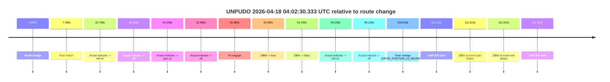

| Metric | Value |
|---|---|
| Outcome | `fail` |
| Effective failure type | `completed_outside_av` |
| Route change status | `found` |
| DBW at event start | `false` |
| DBW at event end | `false` |
| Predicted gear at AV start | `DRIVE_POSITION_V2_DRIVE` |
| Actual gear at AV start | `DRIVE_POSITION_V2_DRIVE` |
| Predicted gear at event start | `DRIVE_POSITION_V2_REVERSE` |
| Actual gear at event start | `DRIVE_POSITION_V2_REVERSE` |
| Planned indicator direction | `INDICATORS_STATE_V2_OFF` |
| Controller indicator direction | `INDICATORS_STATE_V2_OFF` |
| Actual indicator direction | `INDICATORS_STATE_V2_OFF` |
| Actual indicator at maneuver end | `INDICATORS_STATE_V2_OFF` |
| Driver accel help in AV | `false` |
| Driver accel help timestamp | `n/a` |
| Max accel pedal pct in AV | `0.0%` |
| Max brake pedal pct in AV | `0.8%` |
| Max speed mps in AV | `11.169` |
| Success timing baseline | `route change` |
| Route -> AV | `55.380s` |
| AV -> event start | `55.935s` |
| AV -> first motion | `-47.592s` |
| Success baseline -> event start | `111.315s` |
| Success baseline -> first motion | `7.788s` |
| AV duration before disengagement | `36.059s` |
| Trajectory waypoint count | `35` |
| Driving-plan step count | `11` |

The scored portion starts from the AV-owned window, not from the pre-AV setup. Route-change search in the stopped pre-event segment was `found`, with the baseline therefore set to route change. At the event anchor the model predicts `DRIVE_POSITION_V2_REVERSE` and the actual gear is `DRIVE_POSITION_V2_REVERSE`. The effective model outcome is `fail` because `completed_outside_av.`

### Resolution

| Field | Value |
|---|---|
| Final outcome | `fail` |
| Do we agree with this label? | `yes` |
| Source disengagement type | `none observed` |
| Resolved effective failure type | `completed_outside_av` |
| Confidence | `high` |

## unpudo 2026-04-18 04:03:30.233 UTC

| Field | Value |
|---|---|
| Model | `armadillo-amethyst-squeaky` |
| Author | `guy.geva` |
| Run ID | `fme10003/2026-04-18--02-47-41--gen2-av-8858cd5c-761b-4219-adaf-0d47252e47fd` |
| Date | `2026-04-18` |
| Time (UTC) | `04:03:30.233` |
| Event type | `unpudo` |
| Disengagement type | `failed_to_unpudo` |
| Route change | `found` |
| Console | [run](https://console.sso.wayve.ai/run/fme10003/2026-04-18--02-47-41--gen2-av-8858cd5c-761b-4219-adaf-0d47252e47fd?id=&time-unixus=1776485010233311) |
| Foxglove | [segment](https://app.foxglove.dev/wayve-on-prem/p/prj_0dX18KZdVHg1fmmI/view?ds=foxglove-stream&ds.deviceName=fme10003&ds.start=2026-04-18T04%3A03%3A07.768633Z&ds.end=2026-04-18T04%3A03%3A47.033315Z&layoutId=lay_0e7VD4WIKDQGU73Y&time=2026-04-18T04%3A03%3A30.233311Z) |

### Event card: fail

- Fail: AV owns part of the segment, but the event still resolves as a model-performance failure under the AV-only scoring rule.

| Event | Time (UTC) | Delta from route change |
|---|---:|---:|
| Route change | 2026-04-18 04:03:17.768 | `0.000s` |
| AV engage | 2026-04-18 04:03:23.317 | `5.549s` |
| DBW -> true | 2026-04-18 04:03:23.317 | `5.549s` |
| Gear change (DRIVE_POSITION_V2_DRIVE) | 2026-04-18 04:03:25.133 | `7.365s` |
| DBW -> false | 2026-04-18 04:03:28.917 | `11.149s` |
| UNPUDO start | 2026-04-18 04:03:30.233 | `12.465s` |
| DBW at event start (false) | 2026-04-18 04:03:30.233 | `12.465s` |
| DBW at event end (false) | 2026-04-18 04:03:37.033 | `19.265s` |
| UNPUDO end | 2026-04-18 04:03:37.033 | `19.265s` |
| Actual indicator -> right on | 2026-04-18 04:03:47.846 | `30.078s` |
| Actual indicator -> off | 2026-04-18 04:03:49.726 | `31.957s` |

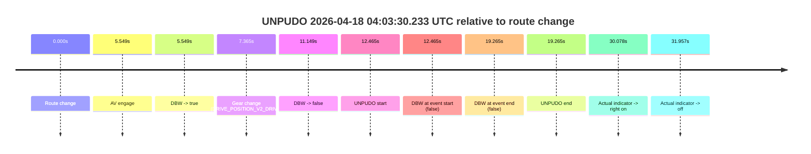

| Metric | Value |
|---|---|
| Outcome | `fail` |
| Effective failure type | `failed_to_unpudo` |
| Route change status | `found` |
| DBW at event start | `false` |
| DBW at event end | `false` |
| Predicted gear at AV start | `DRIVE_POSITION_V2_PARK` |
| Actual gear at AV start | `DRIVE_POSITION_V2_PARK` |
| Predicted gear at event start | `DRIVE_POSITION_V2_DRIVE` |
| Actual gear at event start | `DRIVE_POSITION_V2_DRIVE` |
| Planned indicator direction | `INDICATORS_STATE_V2_OFF` |
| Controller indicator direction | `INDICATORS_STATE_V2_OFF` |
| Actual indicator direction | `INDICATORS_STATE_V2_OFF` |
| Actual indicator at maneuver end | `INDICATORS_STATE_V2_OFF` |
| Driver accel help in AV | `false` |
| Driver accel help timestamp | `n/a` |
| Max accel pedal pct in AV | `0.0%` |
| Max brake pedal pct in AV | `8.0%` |
| Max speed mps in AV | `0.000` |
| Success timing baseline | `route change` |
| Route -> AV | `5.549s` |
| AV -> event start | `6.916s` |
| AV -> first motion | `n/a` |
| Success baseline -> event start | `12.465s` |
| Success baseline -> first motion | `n/a` |
| AV duration before disengagement | `5.600s` |
| Trajectory waypoint count | `35` |
| Driving-plan step count | `11` |

The scored portion starts from the AV-owned window, not from the pre-AV setup. Route-change search in the stopped pre-event segment was `found`, with the baseline therefore set to route change. At the event anchor the model predicts `DRIVE_POSITION_V2_DRIVE` and the actual gear is `DRIVE_POSITION_V2_DRIVE`. The effective model outcome is `fail` because `failed_to_unpudo.`

### Resolution

| Field | Value |
|---|---|
| Final outcome | `fail` |
| Do we agree with this label? | `yes` |
| Source disengagement type | `failed_to_unpudo` |
| Resolved effective failure type | `failed_to_unpudo` |
| Confidence | `high` |
