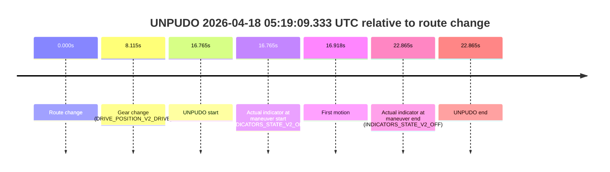
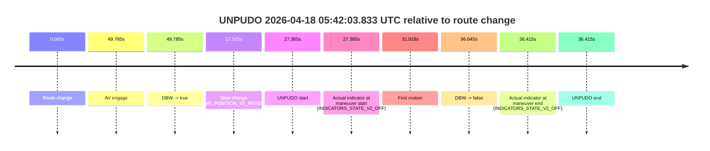
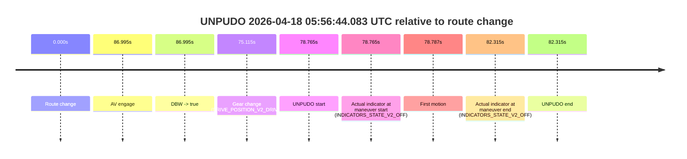

# Run Report: fme10003/2026-04-18--05-02-35--gen2-av-ebec6976-58e8-43c8-bb48-2b44b9d1649d

| Field | Value |
|---|---|
| Run ID | `fme10003/2026-04-18--05-02-35--gen2-av-ebec6976-58e8-43c8-bb48-2b44b9d1649d` |
| Date | `2026-04-18` |
| Model(s) | `satisfied-amber-moose` |
| Author | `guy.geva` |
| Event count | `10` |

## unpudo 2026-04-18 05:13:53.783 UTC

| Field | Value |
|---|---|
| Model | `satisfied-amber-moose` |
| Author | `guy.geva` |
| Run ID | `fme10003/2026-04-18--05-02-35--gen2-av-ebec6976-58e8-43c8-bb48-2b44b9d1649d` |
| Date | `2026-04-18` |
| Time (UTC) | `05:13:53.783` |
| Event type | `unpudo` |
| Disengagement type | `failed_to_unpudo` |
| Route change | `found` |
| Console | [run](https://console.sso.wayve.ai/run/fme10003/2026-04-18--05-02-35--gen2-av-ebec6976-58e8-43c8-bb48-2b44b9d1649d?id=&time-unixus=1776489233783296) |
| Foxglove | [segment](https://app.foxglove.dev/wayve-on-prem/p/prj_0dX18KZdVHg1fmmI/view?ds=foxglove-stream&ds.deviceName=fme10003&ds.start=2026-04-18T05%3A13%3A29.818257Z&ds.end=2026-04-18T05%3A16%3A02.832546Z&layoutId=lay_0e7VD4WIKDQGU73Y&time=2026-04-18T05%3A13%3A53.783296Z) |

### Event card: accidental

- Accidental: AV ownership is present for less than `2s`, so this is treated as an accidental brush with the maneuver rather than a meaningful model attempt.

| Event | Time (UTC) | Delta from route change |
|---|---:|---:|
| Route change | 2026-04-18 05:13:39.818 | `0.000s` |
| AV engage | 2026-04-18 05:14:11.413 | `31.595s` |
| DBW -> true | 2026-04-18 05:14:11.413 | `31.595s` |
| Gear change (DRIVE_POSITION_V2_DRIVE) | 2026-04-18 05:13:47.883 | `8.065s` |
| UNPUDO start | 2026-04-18 05:13:53.783 | `13.965s` |
| Actual indicator at maneuver start (INDICATORS_STATE_V2_LEFT_ON) | 2026-04-18 05:13:53.783 | `13.965s` |
| First motion | 2026-04-18 05:14:05.085 | `25.267s` |
| DBW -> false | 2026-04-18 05:15:52.832 | `133.014s` |
| Actual indicator at maneuver end (INDICATORS_STATE_V2_OFF) | 2026-04-18 05:14:08.433 | `28.615s` |
| UNPUDO end | 2026-04-18 05:14:08.433 | `28.615s` |

| Metric | Value |
|---|---|
| Outcome | `accidental` |
| Effective failure type | `none` |
| Route change status | `found` |
| DBW at event start | `false` |
| DBW at event end | `false` |
| Predicted gear at AV start | `DRIVE_POSITION_V2_DRIVE` |
| Actual gear at AV start | `DRIVE_POSITION_V2_DRIVE` |
| Predicted gear at event start | `DRIVE_POSITION_V2_DRIVE` |
| Actual gear at event start | `DRIVE_POSITION_V2_DRIVE` |
| Planned indicator direction | `INDICATORS_STATE_V2_OFF` |
| Controller indicator direction | `INDICATORS_STATE_V2_OFF` |
| Actual indicator direction | `INDICATORS_STATE_V2_LEFT_ON` |
| Actual indicator at maneuver end | `INDICATORS_STATE_V2_OFF` |
| Driver accel help in AV | `false` |
| Driver accel help timestamp | `n/a` |
| Max accel pedal pct in AV | `0.0%` |
| Max brake pedal pct in AV | `0.0%` |
| Max speed mps in AV | `0.000` |
| Route -> AV | `31.595s` |
| AV -> event start | `-17.630s` |
| AV -> first motion | `-6.328s` |
| AV duration before disengagement | `101.419s` |
| Trajectory waypoint count | `37` |
| Driving-plan step count | `11` |

The scored portion starts from the AV-owned window, not from the pre-AV setup. Route-change search in the stopped pre-event segment was `found`, with the baseline therefore set to route change. At the event anchor the model predicts `DRIVE_POSITION_V2_DRIVE` and the actual gear is `DRIVE_POSITION_V2_DRIVE`. The effective model outcome is `accidental` because `the AV-owned portion is shorter than 2s`.

### Resolution

| Field | Value |
|---|---|
| Final outcome | `accidental` |
| Do we agree with this label? | `yes` |
| Source disengagement type | `failed_to_unpudo` |
| Resolved effective failure type | `none` |
| Confidence | `high` |

## unpudo 2026-04-18 05:15:53.433 UTC

| Field | Value |
|---|---|
| Model | `satisfied-amber-moose` |
| Author | `guy.geva` |
| Run ID | `fme10003/2026-04-18--05-02-35--gen2-av-ebec6976-58e8-43c8-bb48-2b44b9d1649d` |
| Date | `2026-04-18` |
| Time (UTC) | `05:15:53.433` |
| Event type | `unpudo` |
| Disengagement type | `failed_to_unpudo` |
| Route change | `found` |
| Console | [run](https://console.sso.wayve.ai/run/fme10003/2026-04-18--05-02-35--gen2-av-ebec6976-58e8-43c8-bb48-2b44b9d1649d?id=&time-unixus=1776489353433299) |
| Foxglove | [segment](https://app.foxglove.dev/wayve-on-prem/p/prj_0dX18KZdVHg1fmmI/view?ds=foxglove-stream&ds.deviceName=fme10003&ds.start=2026-04-18T05%3A15%3A31.418273Z&ds.end=2026-04-18T05%3A19%3A17.933425Z&layoutId=lay_0e7VD4WIKDQGU73Y&time=2026-04-18T05%3A15%3A53.433299Z) |

### Event card: accidental

- Accidental: AV ownership is present for less than `2s`, so this is treated as an accidental brush with the maneuver rather than a meaningful model attempt.

| Event | Time (UTC) | Delta from route change |
|---|---:|---:|
| Route change | 2026-04-18 05:15:41.418 | `0.000s` |
| AV engage | 2026-04-18 05:15:58.834 | `17.416s` |
| DBW -> true | 2026-04-18 05:15:58.834 | `17.416s` |
| Gear change (DRIVE_POSITION_V2_DRIVE) | 2026-04-18 05:15:46.083 | `4.665s` |
| UNPUDO start | 2026-04-18 05:15:53.433 | `12.015s` |
| Actual indicator at maneuver start (INDICATORS_STATE_V2_OFF) | 2026-04-18 05:15:53.433 | `12.015s` |
| First motion | 2026-04-18 05:15:53.485 | `12.068s` |
| DBW -> false | 2026-04-18 05:19:07.933 | `206.515s` |
| Actual indicator at maneuver end (INDICATORS_STATE_V2_OFF) | 2026-04-18 05:15:57.533 | `16.115s` |
| UNPUDO end | 2026-04-18 05:15:57.533 | `16.115s` |

| Metric | Value |
|---|---|
| Outcome | `accidental` |
| Effective failure type | `none` |
| Route change status | `found` |
| DBW at event start | `false` |
| DBW at event end | `false` |
| Predicted gear at AV start | `DRIVE_POSITION_V2_DRIVE` |
| Actual gear at AV start | `DRIVE_POSITION_V2_DRIVE` |
| Predicted gear at event start | `DRIVE_POSITION_V2_DRIVE` |
| Actual gear at event start | `DRIVE_POSITION_V2_DRIVE` |
| Planned indicator direction | `INDICATORS_STATE_V2_LEFT_ON` |
| Controller indicator direction | `INDICATORS_STATE_V2_LEFT_ON` |
| Actual indicator direction | `INDICATORS_STATE_V2_OFF` |
| Actual indicator at maneuver end | `INDICATORS_STATE_V2_OFF` |
| Driver accel help in AV | `false` |
| Driver accel help timestamp | `n/a` |
| Max accel pedal pct in AV | `0.0%` |
| Max brake pedal pct in AV | `0.0%` |
| Max speed mps in AV | `0.000` |
| Route -> AV | `17.416s` |
| AV -> event start | `-5.401s` |
| AV -> first motion | `-5.348s` |
| AV duration before disengagement | `189.099s` |
| Trajectory waypoint count | `36` |
| Driving-plan step count | `11` |

The scored portion starts from the AV-owned window, not from the pre-AV setup. Route-change search in the stopped pre-event segment was `found`, with the baseline therefore set to route change. At the event anchor the model predicts `DRIVE_POSITION_V2_DRIVE` and the actual gear is `DRIVE_POSITION_V2_DRIVE`. The effective model outcome is `accidental` because `the AV-owned portion is shorter than 2s`.

### Resolution

| Field | Value |
|---|---|
| Final outcome | `accidental` |
| Do we agree with this label? | `yes` |
| Source disengagement type | `failed_to_unpudo` |
| Resolved effective failure type | `none` |
| Confidence | `high` |

## unpudo 2026-04-18 05:19:09.333 UTC

| Field | Value |
|---|---|
| Model | `satisfied-amber-moose` |
| Author | `guy.geva` |
| Run ID | `fme10003/2026-04-18--05-02-35--gen2-av-ebec6976-58e8-43c8-bb48-2b44b9d1649d` |
| Date | `2026-04-18` |
| Time (UTC) | `05:19:09.333` |
| Event type | `unpudo` |
| Disengagement type | `failed_to_unpudo` |
| Route change | `found` |
| Console | [run](https://console.sso.wayve.ai/run/fme10003/2026-04-18--05-02-35--gen2-av-ebec6976-58e8-43c8-bb48-2b44b9d1649d?id=&time-unixus=1776489549333304) |
| Foxglove | [segment](https://app.foxglove.dev/wayve-on-prem/p/prj_0dX18KZdVHg1fmmI/view?ds=foxglove-stream&ds.deviceName=fme10003&ds.start=2026-04-18T05%3A18%3A42.568266Z&ds.end=2026-04-18T05%3A19%3A25.433297Z&layoutId=lay_0e7VD4WIKDQGU73Y&time=2026-04-18T05%3A19%3A09.333304Z) |

### Event card: non-av

- Non-AV: the detected unpudo starts outside AV ownership, so it is kept for coverage but excluded from model success / failure scoring.

| Event | Time (UTC) | Delta from route change |
|---|---:|---:|
| Route change | 2026-04-18 05:18:52.568 | `0.000s` |
| Gear change (DRIVE_POSITION_V2_DRIVE) | 2026-04-18 05:19:00.683 | `8.115s` |
| UNPUDO start | 2026-04-18 05:19:09.333 | `16.765s` |
| Actual indicator at maneuver start (INDICATORS_STATE_V2_OFF) | 2026-04-18 05:19:09.333 | `16.765s` |
| First motion | 2026-04-18 05:19:09.485 | `16.918s` |
| Actual indicator at maneuver end (INDICATORS_STATE_V2_OFF) | 2026-04-18 05:19:15.433 | `22.865s` |
| UNPUDO end | 2026-04-18 05:19:15.433 | `22.865s` |

| Metric | Value |
|---|---|
| Outcome | `non-av` |
| Effective failure type | `none` |
| Route change status | `found` |
| DBW at event start | `false` |
| DBW at event end | `false` |
| Predicted gear at AV start | `n/a` |
| Actual gear at AV start | `n/a` |
| Predicted gear at event start | `DRIVE_POSITION_V2_DRIVE` |
| Actual gear at event start | `DRIVE_POSITION_V2_DRIVE` |
| Planned indicator direction | `INDICATORS_STATE_V2_OFF` |
| Controller indicator direction | `INDICATORS_STATE_V2_OFF` |
| Actual indicator direction | `INDICATORS_STATE_V2_OFF` |
| Actual indicator at maneuver end | `INDICATORS_STATE_V2_OFF` |
| Driver accel help in AV | `false` |
| Driver accel help timestamp | `n/a` |
| Max accel pedal pct in AV | `0.0%` |
| Max brake pedal pct in AV | `0.0%` |
| Max speed mps in AV | `0.000` |
| Route -> AV | `n/a` |
| AV -> event start | `n/a` |
| AV -> first motion | `n/a` |
| AV duration before disengagement | `n/a` |
| Trajectory waypoint count | `36` |
| Driving-plan step count | `11` |

The scored portion starts from the AV-owned window, not from the pre-AV setup. Route-change search in the stopped pre-event segment was `found`, with the baseline therefore set to route change. At the event anchor the model predicts `DRIVE_POSITION_V2_DRIVE` and the actual gear is `DRIVE_POSITION_V2_DRIVE`. The effective model outcome is `non-av` because `the event does not begin in AV ownership`.

### Resolution

| Field | Value |
|---|---|
| Final outcome | `non-av` |
| Do we agree with this label? | `yes` |
| Source disengagement type | `failed_to_unpudo` |
| Resolved effective failure type | `none` |
| Confidence | `high` |

## unpudo 2026-04-18 05:19:26.033 UTC

| Field | Value |
|---|---|
| Model | `satisfied-amber-moose` |
| Author | `guy.geva` |
| Run ID | `fme10003/2026-04-18--05-02-35--gen2-av-ebec6976-58e8-43c8-bb48-2b44b9d1649d` |
| Date | `2026-04-18` |
| Time (UTC) | `05:19:26.033` |
| Event type | `unpudo` |
| Disengagement type | `none observed` |
| Route change | `found` |
| Console | [run](https://console.sso.wayve.ai/run/fme10003/2026-04-18--05-02-35--gen2-av-ebec6976-58e8-43c8-bb48-2b44b9d1649d?id=&time-unixus=1776489566033305) |
| Foxglove | [segment](https://app.foxglove.dev/wayve-on-prem/p/prj_0dX18KZdVHg1fmmI/view?ds=foxglove-stream&ds.deviceName=fme10003&ds.start=2026-04-18T05%3A18%3A42.568266Z&ds.end=2026-04-18T05%3A20%3A48.035039Z&layoutId=lay_0e7VD4WIKDQGU73Y&time=2026-04-18T05%3A19%3A26.033305Z) |

### Event card: accidental

- Accidental: AV ownership is present for less than `2s`, so this is treated as an accidental brush with the maneuver rather than a meaningful model attempt.

| Event | Time (UTC) | Delta from route change |
|---|---:|---:|
| Route change | 2026-04-18 05:18:52.568 | `0.000s` |
| AV engage | 2026-04-18 05:19:44.274 | `51.706s` |
| DBW -> true | 2026-04-18 05:19:44.274 | `51.706s` |
| Gear change (DRIVE_POSITION_V2_REVERSE) | 2026-04-18 05:19:21.433 | `28.865s` |
| UNPUDO start | 2026-04-18 05:19:26.033 | `33.465s` |
| Actual indicator at maneuver start (INDICATORS_STATE_V2_OFF) | 2026-04-18 05:19:26.033 | `33.465s` |
| First motion | 2026-04-18 05:19:33.285 | `40.718s` |
| DBW -> false | 2026-04-18 05:20:38.035 | `105.467s` |
| Actual indicator at maneuver end (INDICATORS_STATE_V2_OFF) | 2026-04-18 05:19:41.533 | `48.965s` |
| UNPUDO end | 2026-04-18 05:19:41.533 | `48.965s` |

| Metric | Value |
|---|---|
| Outcome | `accidental` |
| Effective failure type | `none` |
| Route change status | `found` |
| DBW at event start | `false` |
| DBW at event end | `false` |
| Predicted gear at AV start | `DRIVE_POSITION_V2_DRIVE` |
| Actual gear at AV start | `DRIVE_POSITION_V2_DRIVE` |
| Predicted gear at event start | `DRIVE_POSITION_V2_REVERSE` |
| Actual gear at event start | `DRIVE_POSITION_V2_REVERSE` |
| Planned indicator direction | `INDICATORS_STATE_V2_OFF` |
| Controller indicator direction | `INDICATORS_STATE_V2_OFF` |
| Actual indicator direction | `INDICATORS_STATE_V2_OFF` |
| Actual indicator at maneuver end | `INDICATORS_STATE_V2_OFF` |
| Driver accel help in AV | `false` |
| Driver accel help timestamp | `n/a` |
| Max accel pedal pct in AV | `0.0%` |
| Max brake pedal pct in AV | `0.0%` |
| Max speed mps in AV | `0.000` |
| Route -> AV | `51.706s` |
| AV -> event start | `-18.241s` |
| AV -> first motion | `-10.989s` |
| AV duration before disengagement | `53.760s` |
| Trajectory waypoint count | `36` |
| Driving-plan step count | `11` |

The scored portion starts from the AV-owned window, not from the pre-AV setup. Route-change search in the stopped pre-event segment was `found`, with the baseline therefore set to route change. At the event anchor the model predicts `DRIVE_POSITION_V2_REVERSE` and the actual gear is `DRIVE_POSITION_V2_REVERSE`. The effective model outcome is `accidental` because `the AV-owned portion is shorter than 2s`.

### Resolution

| Field | Value |
|---|---|
| Final outcome | `accidental` |
| Do we agree with this label? | `yes` |
| Source disengagement type | `none observed` |
| Resolved effective failure type | `none` |
| Confidence | `high` |

## unpudo 2026-04-18 05:35:35.683 UTC

| Field | Value |
|---|---|
| Model | `satisfied-amber-moose` |
| Author | `guy.geva` |
| Run ID | `fme10003/2026-04-18--05-02-35--gen2-av-ebec6976-58e8-43c8-bb48-2b44b9d1649d` |
| Date | `2026-04-18` |
| Time (UTC) | `05:35:35.683` |
| Event type | `unpudo` |
| Disengagement type | `failed_to_unpudo` |
| Route change | `found` |
| Console | [run](https://console.sso.wayve.ai/run/fme10003/2026-04-18--05-02-35--gen2-av-ebec6976-58e8-43c8-bb48-2b44b9d1649d?id=&time-unixus=1776490535683313) |
| Foxglove | [segment](https://app.foxglove.dev/wayve-on-prem/p/prj_0dX18KZdVHg1fmmI/view?ds=foxglove-stream&ds.deviceName=fme10003&ds.start=2026-04-18T05%3A35%3A17.168490Z&ds.end=2026-04-18T05%3A36%3A36.053402Z&layoutId=lay_0e7VD4WIKDQGU73Y&time=2026-04-18T05%3A35%3A35.683313Z) |

### Event card: accidental

- Accidental: AV ownership is present for less than `2s`, so this is treated as an accidental brush with the maneuver rather than a meaningful model attempt.

| Event | Time (UTC) | Delta from route change |
|---|---:|---:|
| Route change | 2026-04-18 05:35:27.168 | `0.000s` |
| AV engage | 2026-04-18 05:35:43.153 | `15.985s` |
| DBW -> true | 2026-04-18 05:35:43.153 | `15.985s` |
| Gear change (DRIVE_POSITION_V2_DRIVE) | 2026-04-18 05:35:28.983 | `1.815s` |
| UNPUDO start | 2026-04-18 05:35:35.683 | `8.515s` |
| Actual indicator at maneuver start (INDICATORS_STATE_V2_OFF) | 2026-04-18 05:35:35.683 | `8.515s` |
| First motion | 2026-04-18 05:35:35.725 | `8.557s` |
| DBW -> false | 2026-04-18 05:36:26.053 | `58.885s` |
| Actual indicator at maneuver end (INDICATORS_STATE_V2_OFF) | 2026-04-18 05:35:40.033 | `12.865s` |
| UNPUDO end | 2026-04-18 05:35:40.033 | `12.865s` |

| Metric | Value |
|---|---|
| Outcome | `accidental` |
| Effective failure type | `none` |
| Route change status | `found` |
| DBW at event start | `false` |
| DBW at event end | `false` |
| Predicted gear at AV start | `DRIVE_POSITION_V2_DRIVE` |
| Actual gear at AV start | `DRIVE_POSITION_V2_DRIVE` |
| Predicted gear at event start | `DRIVE_POSITION_V2_DRIVE` |
| Actual gear at event start | `DRIVE_POSITION_V2_DRIVE` |
| Planned indicator direction | `INDICATORS_STATE_V2_LEFT_ON` |
| Controller indicator direction | `INDICATORS_STATE_V2_LEFT_ON` |
| Actual indicator direction | `INDICATORS_STATE_V2_OFF` |
| Actual indicator at maneuver end | `INDICATORS_STATE_V2_OFF` |
| Driver accel help in AV | `false` |
| Driver accel help timestamp | `n/a` |
| Max accel pedal pct in AV | `0.0%` |
| Max brake pedal pct in AV | `0.0%` |
| Max speed mps in AV | `0.000` |
| Route -> AV | `15.985s` |
| AV -> event start | `-7.470s` |
| AV -> first motion | `-7.428s` |
| AV duration before disengagement | `42.900s` |
| Trajectory waypoint count | `37` |
| Driving-plan step count | `11` |

The scored portion starts from the AV-owned window, not from the pre-AV setup. Route-change search in the stopped pre-event segment was `found`, with the baseline therefore set to route change. At the event anchor the model predicts `DRIVE_POSITION_V2_DRIVE` and the actual gear is `DRIVE_POSITION_V2_DRIVE`. The effective model outcome is `accidental` because `the AV-owned portion is shorter than 2s`.

### Resolution

| Field | Value |
|---|---|
| Final outcome | `accidental` |
| Do we agree with this label? | `yes` |
| Source disengagement type | `failed_to_unpudo` |
| Resolved effective failure type | `none` |
| Confidence | `high` |

## unpudo 2026-04-18 05:36:26.933 UTC

| Field | Value |
|---|---|
| Model | `satisfied-amber-moose` |
| Author | `guy.geva` |
| Run ID | `fme10003/2026-04-18--05-02-35--gen2-av-ebec6976-58e8-43c8-bb48-2b44b9d1649d` |
| Date | `2026-04-18` |
| Time (UTC) | `05:36:26.933` |
| Event type | `unpudo` |
| Disengagement type | `failed_to_unpudo` |
| Route change | `found` |
| Console | [run](https://console.sso.wayve.ai/run/fme10003/2026-04-18--05-02-35--gen2-av-ebec6976-58e8-43c8-bb48-2b44b9d1649d?id=&time-unixus=1776490586933300) |
| Foxglove | [segment](https://app.foxglove.dev/wayve-on-prem/p/prj_0dX18KZdVHg1fmmI/view?ds=foxglove-stream&ds.deviceName=fme10003&ds.start=2026-04-18T05%3A35%3A17.168490Z&ds.end=2026-04-18T05%3A38%3A25.914040Z&layoutId=lay_0e7VD4WIKDQGU73Y&time=2026-04-18T05%3A36%3A26.933300Z) |

### Event card: accidental

- Accidental: AV ownership is present for less than `2s`, so this is treated as an accidental brush with the maneuver rather than a meaningful model attempt.

| Event | Time (UTC) | Delta from route change |
|---|---:|---:|
| Route change | 2026-04-18 05:35:27.168 | `0.000s` |
| AV engage | 2026-04-18 05:36:34.014 | `66.846s` |
| DBW -> true | 2026-04-18 05:36:34.014 | `66.846s` |
| Gear change (DRIVE_POSITION_V2_DRIVE) | 2026-04-18 05:36:20.033 | `52.865s` |
| UNPUDO start | 2026-04-18 05:36:26.933 | `59.765s` |
| Actual indicator at maneuver start (INDICATORS_STATE_V2_OFF) | 2026-04-18 05:36:26.933 | `59.765s` |
| First motion | 2026-04-18 05:36:26.985 | `59.817s` |
| DBW -> false | 2026-04-18 05:38:15.914 | `168.746s` |
| Actual indicator at maneuver end (INDICATORS_STATE_V2_OFF) | 2026-04-18 05:36:31.233 | `64.065s` |
| UNPUDO end | 2026-04-18 05:36:31.233 | `64.065s` |

| Metric | Value |
|---|---|
| Outcome | `accidental` |
| Effective failure type | `none` |
| Route change status | `found` |
| DBW at event start | `false` |
| DBW at event end | `false` |
| Predicted gear at AV start | `DRIVE_POSITION_V2_DRIVE` |
| Actual gear at AV start | `DRIVE_POSITION_V2_DRIVE` |
| Predicted gear at event start | `DRIVE_POSITION_V2_DRIVE` |
| Actual gear at event start | `DRIVE_POSITION_V2_DRIVE` |
| Planned indicator direction | `INDICATORS_STATE_V2_LEFT_ON` |
| Controller indicator direction | `INDICATORS_STATE_V2_LEFT_ON` |
| Actual indicator direction | `INDICATORS_STATE_V2_OFF` |
| Actual indicator at maneuver end | `INDICATORS_STATE_V2_OFF` |
| Driver accel help in AV | `false` |
| Driver accel help timestamp | `n/a` |
| Max accel pedal pct in AV | `0.0%` |
| Max brake pedal pct in AV | `0.0%` |
| Max speed mps in AV | `0.000` |
| Route -> AV | `66.846s` |
| AV -> event start | `-7.081s` |
| AV -> first motion | `-7.029s` |
| AV duration before disengagement | `101.900s` |
| Trajectory waypoint count | `36` |
| Driving-plan step count | `11` |

The scored portion starts from the AV-owned window, not from the pre-AV setup. Route-change search in the stopped pre-event segment was `found`, with the baseline therefore set to route change. At the event anchor the model predicts `DRIVE_POSITION_V2_DRIVE` and the actual gear is `DRIVE_POSITION_V2_DRIVE`. The effective model outcome is `accidental` because `the AV-owned portion is shorter than 2s`.

### Resolution

| Field | Value |
|---|---|
| Final outcome | `accidental` |
| Do we agree with this label? | `yes` |
| Source disengagement type | `failed_to_unpudo` |
| Resolved effective failure type | `none` |
| Confidence | `high` |

## unpudo 2026-04-18 05:38:16.483 UTC

| Field | Value |
|---|---|
| Model | `satisfied-amber-moose` |
| Author | `guy.geva` |
| Run ID | `fme10003/2026-04-18--05-02-35--gen2-av-ebec6976-58e8-43c8-bb48-2b44b9d1649d` |
| Date | `2026-04-18` |
| Time (UTC) | `05:38:16.483` |
| Event type | `unpudo` |
| Disengagement type | `failed_to_unpudo` |
| Route change | `found` |
| Console | [run](https://console.sso.wayve.ai/run/fme10003/2026-04-18--05-02-35--gen2-av-ebec6976-58e8-43c8-bb48-2b44b9d1649d?id=&time-unixus=1776490696483313) |
| Foxglove | [segment](https://app.foxglove.dev/wayve-on-prem/p/prj_0dX18KZdVHg1fmmI/view?ds=foxglove-stream&ds.deviceName=fme10003&ds.start=2026-04-18T05%3A36%3A07.968260Z&ds.end=2026-04-18T05%3A39%3A21.553102Z&layoutId=lay_0e7VD4WIKDQGU73Y&time=2026-04-18T05%3A38%3A16.483313Z) |

### Event card: accidental

- Accidental: AV ownership is present for less than `2s`, so this is treated as an accidental brush with the maneuver rather than a meaningful model attempt.

| Event | Time (UTC) | Delta from route change |
|---|---:|---:|
| Route change | 2026-04-18 05:36:17.968 | `0.000s` |
| AV engage | 2026-04-18 05:38:24.952 | `126.984s` |
| DBW -> true | 2026-04-18 05:38:24.952 | `126.984s` |
| Gear change (DRIVE_POSITION_V2_DRIVE) | 2026-04-18 05:38:11.183 | `113.215s` |
| UNPUDO start | 2026-04-18 05:38:16.483 | `118.515s` |
| Actual indicator at maneuver start (INDICATORS_STATE_V2_OFF) | 2026-04-18 05:38:16.483 | `118.515s` |
| First motion | 2026-04-18 05:38:16.525 | `118.557s` |
| DBW -> false | 2026-04-18 05:39:11.553 | `173.585s` |
| Actual indicator at maneuver end (INDICATORS_STATE_V2_RIGHT_ON) | 2026-04-18 05:38:20.633 | `122.665s` |
| UNPUDO end | 2026-04-18 05:38:20.633 | `122.665s` |

| Metric | Value |
|---|---|
| Outcome | `accidental` |
| Effective failure type | `none` |
| Route change status | `found` |
| DBW at event start | `false` |
| DBW at event end | `false` |
| Predicted gear at AV start | `DRIVE_POSITION_V2_DRIVE` |
| Actual gear at AV start | `DRIVE_POSITION_V2_DRIVE` |
| Predicted gear at event start | `DRIVE_POSITION_V2_DRIVE` |
| Actual gear at event start | `DRIVE_POSITION_V2_DRIVE` |
| Planned indicator direction | `INDICATORS_STATE_V2_OFF` |
| Controller indicator direction | `INDICATORS_STATE_V2_LEFT_ON` |
| Actual indicator direction | `INDICATORS_STATE_V2_OFF` |
| Actual indicator at maneuver end | `INDICATORS_STATE_V2_RIGHT_ON` |
| Driver accel help in AV | `false` |
| Driver accel help timestamp | `n/a` |
| Max accel pedal pct in AV | `0.0%` |
| Max brake pedal pct in AV | `0.0%` |
| Max speed mps in AV | `0.000` |
| Route -> AV | `126.984s` |
| AV -> event start | `-8.469s` |
| AV -> first motion | `-8.427s` |
| AV duration before disengagement | `46.601s` |
| Trajectory waypoint count | `37` |
| Driving-plan step count | `11` |

The scored portion starts from the AV-owned window, not from the pre-AV setup. Route-change search in the stopped pre-event segment was `found`, with the baseline therefore set to route change. At the event anchor the model predicts `DRIVE_POSITION_V2_DRIVE` and the actual gear is `DRIVE_POSITION_V2_DRIVE`. The effective model outcome is `accidental` because `the AV-owned portion is shorter than 2s`.

### Resolution

| Field | Value |
|---|---|
| Final outcome | `accidental` |
| Do we agree with this label? | `yes` |
| Source disengagement type | `failed_to_unpudo` |
| Resolved effective failure type | `none` |
| Confidence | `high` |

## unpudo 2026-04-18 05:39:40.683 UTC

| Field | Value |
|---|---|
| Model | `satisfied-amber-moose` |
| Author | `guy.geva` |
| Run ID | `fme10003/2026-04-18--05-02-35--gen2-av-ebec6976-58e8-43c8-bb48-2b44b9d1649d` |
| Date | `2026-04-18` |
| Time (UTC) | `05:39:40.683` |
| Event type | `unpudo` |
| Disengagement type | `none observed` |
| Route change | `found` |
| Console | [run](https://console.sso.wayve.ai/run/fme10003/2026-04-18--05-02-35--gen2-av-ebec6976-58e8-43c8-bb48-2b44b9d1649d?id=&time-unixus=1776490780683302) |
| Foxglove | [segment](https://app.foxglove.dev/wayve-on-prem/p/prj_0dX18KZdVHg1fmmI/view?ds=foxglove-stream&ds.deviceName=fme10003&ds.start=2026-04-18T05%3A37%3A52.818374Z&ds.end=2026-04-18T05%3A41%3A18.314200Z&layoutId=lay_0e7VD4WIKDQGU73Y&time=2026-04-18T05%3A39%3A40.683302Z) |

### Event card: accidental

- Accidental: AV ownership is present for less than `2s`, so this is treated as an accidental brush with the maneuver rather than a meaningful model attempt.

| Event | Time (UTC) | Delta from route change |
|---|---:|---:|
| Route change | 2026-04-18 05:38:02.818 | `0.000s` |
| AV engage | 2026-04-18 05:40:41.513 | `158.695s` |
| DBW -> true | 2026-04-18 05:40:41.513 | `158.695s` |
| Gear change (DRIVE_POSITION_V2_DRIVE) | 2026-04-18 05:39:32.333 | `89.515s` |
| UNPUDO start | 2026-04-18 05:39:40.683 | `97.865s` |
| Actual indicator at maneuver start (INDICATORS_STATE_V2_OFF) | 2026-04-18 05:39:40.683 | `97.865s` |
| First motion | 2026-04-18 05:39:40.725 | `97.908s` |
| DBW -> false | 2026-04-18 05:41:08.314 | `185.496s` |
| Actual indicator at maneuver end (INDICATORS_STATE_V2_RIGHT_ON) | 2026-04-18 05:40:35.983 | `153.165s` |
| UNPUDO end | 2026-04-18 05:40:35.983 | `153.165s` |

| Metric | Value |
|---|---|
| Outcome | `accidental` |
| Effective failure type | `none` |
| Route change status | `found` |
| DBW at event start | `false` |
| DBW at event end | `false` |
| Predicted gear at AV start | `DRIVE_POSITION_V2_DRIVE` |
| Actual gear at AV start | `DRIVE_POSITION_V2_DRIVE` |
| Predicted gear at event start | `DRIVE_POSITION_V2_DRIVE` |
| Actual gear at event start | `DRIVE_POSITION_V2_DRIVE` |
| Planned indicator direction | `INDICATORS_STATE_V2_OFF` |
| Controller indicator direction | `INDICATORS_STATE_V2_OFF` |
| Actual indicator direction | `INDICATORS_STATE_V2_OFF` |
| Actual indicator at maneuver end | `INDICATORS_STATE_V2_RIGHT_ON` |
| Driver accel help in AV | `false` |
| Driver accel help timestamp | `n/a` |
| Max accel pedal pct in AV | `0.0%` |
| Max brake pedal pct in AV | `0.0%` |
| Max speed mps in AV | `0.000` |
| Route -> AV | `158.695s` |
| AV -> event start | `-60.830s` |
| AV -> first motion | `-60.788s` |
| AV duration before disengagement | `26.801s` |
| Trajectory waypoint count | `37` |
| Driving-plan step count | `11` |

The scored portion starts from the AV-owned window, not from the pre-AV setup. Route-change search in the stopped pre-event segment was `found`, with the baseline therefore set to route change. At the event anchor the model predicts `DRIVE_POSITION_V2_DRIVE` and the actual gear is `DRIVE_POSITION_V2_DRIVE`. The effective model outcome is `accidental` because `the AV-owned portion is shorter than 2s`.

### Resolution

| Field | Value |
|---|---|
| Final outcome | `accidental` |
| Do we agree with this label? | `yes` |
| Source disengagement type | `none observed` |
| Resolved effective failure type | `none` |
| Confidence | `high` |

## unpudo 2026-04-18 05:42:03.833 UTC

| Field | Value |
|---|---|
| Model | `satisfied-amber-moose` |
| Author | `guy.geva` |
| Run ID | `fme10003/2026-04-18--05-02-35--gen2-av-ebec6976-58e8-43c8-bb48-2b44b9d1649d` |
| Date | `2026-04-18` |
| Time (UTC) | `05:42:03.833` |
| Event type | `unpudo` |
| Disengagement type | `failed_to_unpudo` |
| Route change | `found` |
| Console | [run](https://console.sso.wayve.ai/run/fme10003/2026-04-18--05-02-35--gen2-av-ebec6976-58e8-43c8-bb48-2b44b9d1649d?id=&time-unixus=1776490923833314) |
| Foxglove | [segment](https://app.foxglove.dev/wayve-on-prem/p/prj_0dX18KZdVHg1fmmI/view?ds=foxglove-stream&ds.deviceName=fme10003&ds.start=2026-04-18T05%3A41%3A26.468291Z&ds.end=2026-04-18T05%3A43%3A23.113336Z&layoutId=lay_0e7VD4WIKDQGU73Y&time=2026-04-18T05%3A42%3A03.833314Z) |

### Event card: accidental

- Accidental: AV ownership is present for less than `2s`, so this is treated as an accidental brush with the maneuver rather than a meaningful model attempt.

| Event | Time (UTC) | Delta from route change |
|---|---:|---:|
| Route change | 2026-04-18 05:41:36.468 | `0.000s` |
| AV engage | 2026-04-18 05:42:26.253 | `49.785s` |
| DBW -> true | 2026-04-18 05:42:26.253 | `49.785s` |
| Gear change (DRIVE_POSITION_V2_REVERSE) | 2026-04-18 05:41:54.033 | `17.565s` |
| UNPUDO start | 2026-04-18 05:42:03.833 | `27.365s` |
| Actual indicator at maneuver start (INDICATORS_STATE_V2_OFF) | 2026-04-18 05:42:03.833 | `27.365s` |
| First motion | 2026-04-18 05:42:08.386 | `31.918s` |
| DBW -> false | 2026-04-18 05:43:13.113 | `96.645s` |
| Actual indicator at maneuver end (INDICATORS_STATE_V2_OFF) | 2026-04-18 05:42:12.883 | `36.415s` |
| UNPUDO end | 2026-04-18 05:42:12.883 | `36.415s` |

| Metric | Value |
|---|---|
| Outcome | `accidental` |
| Effective failure type | `none` |
| Route change status | `found` |
| DBW at event start | `false` |
| DBW at event end | `false` |
| Predicted gear at AV start | `DRIVE_POSITION_V2_DRIVE` |
| Actual gear at AV start | `DRIVE_POSITION_V2_DRIVE` |
| Predicted gear at event start | `DRIVE_POSITION_V2_REVERSE` |
| Actual gear at event start | `DRIVE_POSITION_V2_REVERSE` |
| Planned indicator direction | `INDICATORS_STATE_V2_OFF` |
| Controller indicator direction | `INDICATORS_STATE_V2_OFF` |
| Actual indicator direction | `INDICATORS_STATE_V2_OFF` |
| Actual indicator at maneuver end | `INDICATORS_STATE_V2_OFF` |
| Driver accel help in AV | `false` |
| Driver accel help timestamp | `n/a` |
| Max accel pedal pct in AV | `0.0%` |
| Max brake pedal pct in AV | `0.0%` |
| Max speed mps in AV | `0.000` |
| Route -> AV | `49.785s` |
| AV -> event start | `-22.420s` |
| AV -> first motion | `-17.867s` |
| AV duration before disengagement | `46.860s` |
| Trajectory waypoint count | `38` |
| Driving-plan step count | `11` |

The scored portion starts from the AV-owned window, not from the pre-AV setup. Route-change search in the stopped pre-event segment was `found`, with the baseline therefore set to route change. At the event anchor the model predicts `DRIVE_POSITION_V2_REVERSE` and the actual gear is `DRIVE_POSITION_V2_REVERSE`. The effective model outcome is `accidental` because `the AV-owned portion is shorter than 2s`.

### Resolution

| Field | Value |
|---|---|
| Final outcome | `accidental` |
| Do we agree with this label? | `yes` |
| Source disengagement type | `failed_to_unpudo` |
| Resolved effective failure type | `none` |
| Confidence | `high` |

## unpudo 2026-04-18 05:56:44.083 UTC

| Field | Value |
|---|---|
| Model | `satisfied-amber-moose` |
| Author | `guy.geva` |
| Run ID | `fme10003/2026-04-18--05-02-35--gen2-av-ebec6976-58e8-43c8-bb48-2b44b9d1649d` |
| Date | `2026-04-18` |
| Time (UTC) | `05:56:44.083` |
| Event type | `unpudo` |
| Disengagement type | `failed_to_unpudo` |
| Route change | `found` |
| Console | [run](https://console.sso.wayve.ai/run/fme10003/2026-04-18--05-02-35--gen2-av-ebec6976-58e8-43c8-bb48-2b44b9d1649d?id=&time-unixus=1776491804083314) |
| Foxglove | [segment](https://app.foxglove.dev/wayve-on-prem/p/prj_0dX18KZdVHg1fmmI/view?ds=foxglove-stream&ds.deviceName=fme10003&ds.start=2026-04-18T05%3A55%3A15.318246Z&ds.end=2026-04-18T05%3A56%3A57.633304Z&layoutId=lay_0e7VD4WIKDQGU73Y&time=2026-04-18T05%3A56%3A44.083314Z) |

### Event card: accidental

- Accidental: AV ownership is present for less than `2s`, so this is treated as an accidental brush with the maneuver rather than a meaningful model attempt.

| Event | Time (UTC) | Delta from route change |
|---|---:|---:|
| Route change | 2026-04-18 05:55:25.318 | `0.000s` |
| AV engage | 2026-04-18 05:56:52.313 | `86.995s` |
| DBW -> true | 2026-04-18 05:56:52.313 | `86.995s` |
| Gear change (DRIVE_POSITION_V2_DRIVE) | 2026-04-18 05:56:40.433 | `75.115s` |
| UNPUDO start | 2026-04-18 05:56:44.083 | `78.765s` |
| Actual indicator at maneuver start (INDICATORS_STATE_V2_OFF) | 2026-04-18 05:56:44.083 | `78.765s` |
| First motion | 2026-04-18 05:56:44.105 | `78.787s` |
| Actual indicator at maneuver end (INDICATORS_STATE_V2_OFF) | 2026-04-18 05:56:47.633 | `82.315s` |
| UNPUDO end | 2026-04-18 05:56:47.633 | `82.315s` |

| Metric | Value |
|---|---|
| Outcome | `accidental` |
| Effective failure type | `none` |
| Route change status | `found` |
| DBW at event start | `false` |
| DBW at event end | `false` |
| Predicted gear at AV start | `DRIVE_POSITION_V2_DRIVE` |
| Actual gear at AV start | `DRIVE_POSITION_V2_DRIVE` |
| Predicted gear at event start | `DRIVE_POSITION_V2_DRIVE` |
| Actual gear at event start | `DRIVE_POSITION_V2_DRIVE` |
| Planned indicator direction | `INDICATORS_STATE_V2_RIGHT_ON` |
| Controller indicator direction | `INDICATORS_STATE_V2_RIGHT_ON` |
| Actual indicator direction | `INDICATORS_STATE_V2_OFF` |
| Actual indicator at maneuver end | `INDICATORS_STATE_V2_OFF` |
| Driver accel help in AV | `false` |
| Driver accel help timestamp | `n/a` |
| Max accel pedal pct in AV | `0.0%` |
| Max brake pedal pct in AV | `0.0%` |
| Max speed mps in AV | `0.000` |
| Route -> AV | `86.995s` |
| AV -> event start | `-8.230s` |
| AV -> first motion | `-8.207s` |
| AV duration before disengagement | `n/a` |
| Trajectory waypoint count | `37` |
| Driving-plan step count | `11` |

The scored portion starts from the AV-owned window, not from the pre-AV setup. Route-change search in the stopped pre-event segment was `found`, with the baseline therefore set to route change. At the event anchor the model predicts `DRIVE_POSITION_V2_DRIVE` and the actual gear is `DRIVE_POSITION_V2_DRIVE`. The effective model outcome is `accidental` because `the AV-owned portion is shorter than 2s`.

### Resolution

| Field | Value |
|---|---|
| Final outcome | `accidental` |
| Do we agree with this label? | `yes` |
| Source disengagement type | `failed_to_unpudo` |
| Resolved effective failure type | `none` |
| Confidence | `high` |
