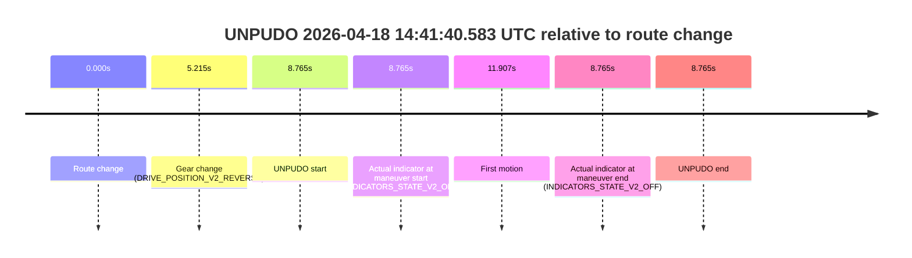
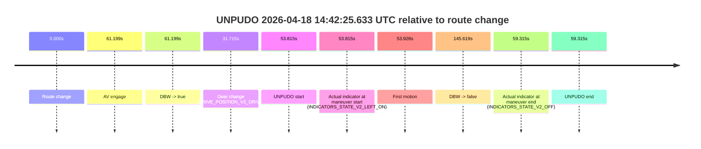
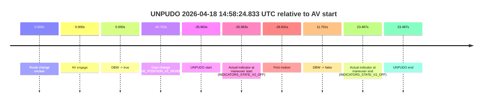

# Run Report: fme10003/2026-04-18--13-36-11--gen2-av-16575f5d-e34c-4b97-87d4-72134bba9341

| Field | Value |
|---|---|
| Run ID | `fme10003/2026-04-18--13-36-11--gen2-av-16575f5d-e34c-4b97-87d4-72134bba9341` |
| Date | `2026-04-18` |
| Model(s) | `plum-timeless-beaver` |
| Author | `peng.tang` |
| Event count | `16` |

## unpudo 2026-04-18 13:59:46.183 UTC

| Field | Value |
|---|---|
| Model | `plum-timeless-beaver` |
| Author | `peng.tang` |
| Run ID | `fme10003/2026-04-18--13-36-11--gen2-av-16575f5d-e34c-4b97-87d4-72134bba9341` |
| Date | `2026-04-18` |
| Time (UTC) | `13:59:46.183` |
| Event type | `unpudo` |
| Disengagement type | `failed_to_unpudo` |
| Route change | `found` |
| Console | [run](https://console.sso.wayve.ai/run/fme10003/2026-04-18--13-36-11--gen2-av-16575f5d-e34c-4b97-87d4-72134bba9341?id=&time-unixus=1776520786183295) |
| Foxglove | [segment](https://app.foxglove.dev/wayve-on-prem/p/prj_0dX18KZdVHg1fmmI/view?ds=foxglove-stream&ds.deviceName=fme10003&ds.start=2026-04-18T13%3A59%3A14.218261Z&ds.end=2026-04-18T14%3A01%3A27.716725Z&layoutId=lay_0e7VD4WIKDQGU73Y&time=2026-04-18T13%3A59%3A46.183295Z) |

### Event card: accidental

- Accidental: AV ownership is present for less than `2s`, so this is treated as an accidental brush with the maneuver rather than a meaningful model attempt.

| Event | Time (UTC) | Delta from route change |
|---|---:|---:|
| Route change | 2026-04-18 13:59:24.218 | `0.000s` |
| AV engage | 2026-04-18 14:00:01.276 | `37.058s` |
| DBW -> true | 2026-04-18 14:00:01.276 | `37.058s` |
| Gear change (DRIVE_POSITION_V2_DRIVE) | 2026-04-18 13:59:24.533 | `0.315s` |
| UNPUDO start | 2026-04-18 13:59:46.183 | `21.965s` |
| Actual indicator at maneuver start (INDICATORS_STATE_V2_OFF) | 2026-04-18 13:59:46.183 | `21.965s` |
| First motion | 2026-04-18 13:59:46.205 | `21.987s` |
| DBW -> false | 2026-04-18 14:01:17.716 | `113.498s` |
| Actual indicator at maneuver end (INDICATORS_STATE_V2_OFF) | 2026-04-18 13:59:51.933 | `27.715s` |
| UNPUDO end | 2026-04-18 13:59:51.933 | `27.715s` |

| Metric | Value |
|---|---|
| Outcome | `accidental` |
| Effective failure type | `none` |
| Route change status | `found` |
| DBW at event start | `false` |
| DBW at event end | `false` |
| Predicted gear at AV start | `DRIVE_POSITION_V2_DRIVE` |
| Actual gear at AV start | `DRIVE_POSITION_V2_DRIVE` |
| Predicted gear at event start | `DRIVE_POSITION_V2_DRIVE` |
| Actual gear at event start | `DRIVE_POSITION_V2_DRIVE` |
| Planned indicator direction | `INDICATORS_STATE_V2_OFF` |
| Controller indicator direction | `INDICATORS_STATE_V2_OFF` |
| Actual indicator direction | `INDICATORS_STATE_V2_OFF` |
| Actual indicator at maneuver end | `INDICATORS_STATE_V2_OFF` |
| Driver accel help in AV | `false` |
| Driver accel help timestamp | `n/a` |
| Max accel pedal pct in AV | `0.0%` |
| Max brake pedal pct in AV | `0.0%` |
| Max speed mps in AV | `0.000` |
| Route -> AV | `37.058s` |
| AV -> event start | `-15.093s` |
| AV -> first motion | `-15.070s` |
| AV duration before disengagement | `76.441s` |
| Trajectory waypoint count | `36` |
| Driving-plan step count | `11` |

The scored portion starts from the AV-owned window, not from the pre-AV setup. Route-change search in the stopped pre-event segment was `found`, with the baseline therefore set to route change. At the event anchor the model predicts `DRIVE_POSITION_V2_DRIVE` and the actual gear is `DRIVE_POSITION_V2_DRIVE`. The effective model outcome is `accidental` because `the AV-owned portion is shorter than 2s`.

### Resolution

| Field | Value |
|---|---|
| Final outcome | `accidental` |
| Do we agree with this label? | `yes` |
| Source disengagement type | `failed_to_unpudo` |
| Resolved effective failure type | `none` |
| Confidence | `high` |

## unpudo 2026-04-18 14:01:18.483 UTC

| Field | Value |
|---|---|
| Model | `plum-timeless-beaver` |
| Author | `peng.tang` |
| Run ID | `fme10003/2026-04-18--13-36-11--gen2-av-16575f5d-e34c-4b97-87d4-72134bba9341` |
| Date | `2026-04-18` |
| Time (UTC) | `14:01:18.483` |
| Event type | `unpudo` |
| Disengagement type | `failed_to_unpudo` |
| Route change | `found` |
| Console | [run](https://console.sso.wayve.ai/run/fme10003/2026-04-18--13-36-11--gen2-av-16575f5d-e34c-4b97-87d4-72134bba9341?id=&time-unixus=1776520878483296) |
| Foxglove | [segment](https://app.foxglove.dev/wayve-on-prem/p/prj_0dX18KZdVHg1fmmI/view?ds=foxglove-stream&ds.deviceName=fme10003&ds.start=2026-04-18T13%3A59%3A14.218261Z&ds.end=2026-04-18T14%3A02%3A22.976741Z&layoutId=lay_0e7VD4WIKDQGU73Y&time=2026-04-18T14%3A01%3A18.483296Z) |

### Event card: accidental

- Accidental: AV ownership is present for less than `2s`, so this is treated as an accidental brush with the maneuver rather than a meaningful model attempt.

| Event | Time (UTC) | Delta from route change |
|---|---:|---:|
| Route change | 2026-04-18 13:59:24.218 | `0.000s` |
| AV engage | 2026-04-18 14:01:31.076 | `126.858s` |
| DBW -> true | 2026-04-18 14:01:31.076 | `126.858s` |
| Gear change (DRIVE_POSITION_V2_DRIVE) | 2026-04-18 14:00:57.183 | `92.965s` |
| UNPUDO start | 2026-04-18 14:01:18.483 | `114.265s` |
| Actual indicator at maneuver start (INDICATORS_STATE_V2_OFF) | 2026-04-18 14:01:18.483 | `114.265s` |
| First motion | 2026-04-18 14:01:18.645 | `114.427s` |
| DBW -> false | 2026-04-18 14:02:12.976 | `168.758s` |
| Actual indicator at maneuver end (INDICATORS_STATE_V2_OFF) | 2026-04-18 14:01:25.383 | `121.165s` |
| UNPUDO end | 2026-04-18 14:01:25.383 | `121.165s` |

| Metric | Value |
|---|---|
| Outcome | `accidental` |
| Effective failure type | `none` |
| Route change status | `found` |
| DBW at event start | `false` |
| DBW at event end | `false` |
| Predicted gear at AV start | `DRIVE_POSITION_V2_DRIVE` |
| Actual gear at AV start | `DRIVE_POSITION_V2_DRIVE` |
| Predicted gear at event start | `DRIVE_POSITION_V2_DRIVE` |
| Actual gear at event start | `DRIVE_POSITION_V2_DRIVE` |
| Planned indicator direction | `INDICATORS_STATE_V2_OFF` |
| Controller indicator direction | `INDICATORS_STATE_V2_OFF` |
| Actual indicator direction | `INDICATORS_STATE_V2_OFF` |
| Actual indicator at maneuver end | `INDICATORS_STATE_V2_OFF` |
| Driver accel help in AV | `false` |
| Driver accel help timestamp | `n/a` |
| Max accel pedal pct in AV | `0.0%` |
| Max brake pedal pct in AV | `0.0%` |
| Max speed mps in AV | `0.000` |
| Route -> AV | `126.858s` |
| AV -> event start | `-12.593s` |
| AV -> first motion | `-12.431s` |
| AV duration before disengagement | `41.901s` |
| Trajectory waypoint count | `36` |
| Driving-plan step count | `11` |

The scored portion starts from the AV-owned window, not from the pre-AV setup. Route-change search in the stopped pre-event segment was `found`, with the baseline therefore set to route change. At the event anchor the model predicts `DRIVE_POSITION_V2_DRIVE` and the actual gear is `DRIVE_POSITION_V2_DRIVE`. The effective model outcome is `accidental` because `the AV-owned portion is shorter than 2s`.

### Resolution

| Field | Value |
|---|---|
| Final outcome | `accidental` |
| Do we agree with this label? | `yes` |
| Source disengagement type | `failed_to_unpudo` |
| Resolved effective failure type | `none` |
| Confidence | `high` |

## unpudo 2026-04-18 14:03:19.433 UTC

| Field | Value |
|---|---|
| Model | `plum-timeless-beaver` |
| Author | `peng.tang` |
| Run ID | `fme10003/2026-04-18--13-36-11--gen2-av-16575f5d-e34c-4b97-87d4-72134bba9341` |
| Date | `2026-04-18` |
| Time (UTC) | `14:03:19.433` |
| Event type | `unpudo` |
| Disengagement type | `failed_to_unpudo` |
| Route change | `found` |
| Console | [run](https://console.sso.wayve.ai/run/fme10003/2026-04-18--13-36-11--gen2-av-16575f5d-e34c-4b97-87d4-72134bba9341?id=&time-unixus=1776520999433315) |
| Foxglove | [segment](https://app.foxglove.dev/wayve-on-prem/p/prj_0dX18KZdVHg1fmmI/view?ds=foxglove-stream&ds.deviceName=fme10003&ds.start=2026-04-18T14%3A02%3A32.668288Z&ds.end=2026-04-18T14%3A06%3A49.418395Z&layoutId=lay_0e7VD4WIKDQGU73Y&time=2026-04-18T14%3A03%3A19.433315Z) |

### Event card: accidental

- Accidental: AV ownership is present for less than `2s`, so this is treated as an accidental brush with the maneuver rather than a meaningful model attempt.

| Event | Time (UTC) | Delta from route change |
|---|---:|---:|
| Route change | 2026-04-18 14:02:42.668 | `0.000s` |
| AV engage | 2026-04-18 14:03:28.536 | `45.868s` |
| DBW -> true | 2026-04-18 14:03:28.536 | `45.868s` |
| Gear change (DRIVE_POSITION_V2_DRIVE) | 2026-04-18 14:03:01.883 | `19.215s` |
| UNPUDO start | 2026-04-18 14:03:19.433 | `36.765s` |
| Actual indicator at maneuver start (INDICATORS_STATE_V2_LEFT_ON) | 2026-04-18 14:03:19.433 | `36.765s` |
| First motion | 2026-04-18 14:03:19.465 | `36.797s` |
| DBW -> false | 2026-04-18 14:06:39.418 | `236.750s` |
| Actual indicator at maneuver end (INDICATORS_STATE_V2_LEFT_ON) | 2026-04-18 14:03:23.883 | `41.215s` |
| UNPUDO end | 2026-04-18 14:03:23.883 | `41.215s` |

| Metric | Value |
|---|---|
| Outcome | `accidental` |
| Effective failure type | `none` |
| Route change status | `found` |
| DBW at event start | `false` |
| DBW at event end | `false` |
| Predicted gear at AV start | `DRIVE_POSITION_V2_DRIVE` |
| Actual gear at AV start | `DRIVE_POSITION_V2_DRIVE` |
| Predicted gear at event start | `DRIVE_POSITION_V2_DRIVE` |
| Actual gear at event start | `DRIVE_POSITION_V2_DRIVE` |
| Planned indicator direction | `INDICATORS_STATE_V2_OFF` |
| Controller indicator direction | `INDICATORS_STATE_V2_OFF` |
| Actual indicator direction | `INDICATORS_STATE_V2_LEFT_ON` |
| Actual indicator at maneuver end | `INDICATORS_STATE_V2_LEFT_ON` |
| Driver accel help in AV | `false` |
| Driver accel help timestamp | `n/a` |
| Max accel pedal pct in AV | `0.0%` |
| Max brake pedal pct in AV | `0.0%` |
| Max speed mps in AV | `0.000` |
| Route -> AV | `45.868s` |
| AV -> event start | `-9.103s` |
| AV -> first motion | `-9.070s` |
| AV duration before disengagement | `190.882s` |
| Trajectory waypoint count | `35` |
| Driving-plan step count | `11` |

The scored portion starts from the AV-owned window, not from the pre-AV setup. Route-change search in the stopped pre-event segment was `found`, with the baseline therefore set to route change. At the event anchor the model predicts `DRIVE_POSITION_V2_DRIVE` and the actual gear is `DRIVE_POSITION_V2_DRIVE`. The effective model outcome is `accidental` because `the AV-owned portion is shorter than 2s`.

### Resolution

| Field | Value |
|---|---|
| Final outcome | `accidental` |
| Do we agree with this label? | `yes` |
| Source disengagement type | `failed_to_unpudo` |
| Resolved effective failure type | `none` |
| Confidence | `high` |

## unpudo 2026-04-18 14:07:26.633 UTC

| Field | Value |
|---|---|
| Model | `plum-timeless-beaver` |
| Author | `peng.tang` |
| Run ID | `fme10003/2026-04-18--13-36-11--gen2-av-16575f5d-e34c-4b97-87d4-72134bba9341` |
| Date | `2026-04-18` |
| Time (UTC) | `14:07:26.633` |
| Event type | `unpudo` |
| Disengagement type | `failed_to_unpudo` |
| Route change | `found` |
| Console | [run](https://console.sso.wayve.ai/run/fme10003/2026-04-18--13-36-11--gen2-av-16575f5d-e34c-4b97-87d4-72134bba9341?id=&time-unixus=1776521246633298) |
| Foxglove | [segment](https://app.foxglove.dev/wayve-on-prem/p/prj_0dX18KZdVHg1fmmI/view?ds=foxglove-stream&ds.deviceName=fme10003&ds.start=2026-04-18T14%3A06%3A47.868332Z&ds.end=2026-04-18T14%3A12%3A00.877609Z&layoutId=lay_0e7VD4WIKDQGU73Y&time=2026-04-18T14%3A07%3A26.633298Z) |

### Event card: accidental

- Accidental: AV ownership is present for less than `2s`, so this is treated as an accidental brush with the maneuver rather than a meaningful model attempt.

| Event | Time (UTC) | Delta from route change |
|---|---:|---:|
| Route change | 2026-04-18 14:06:57.868 | `0.000s` |
| AV engage | 2026-04-18 14:07:36.197 | `38.329s` |
| DBW -> true | 2026-04-18 14:07:36.197 | `38.329s` |
| Gear change (DRIVE_POSITION_V2_DRIVE) | 2026-04-18 14:07:17.083 | `19.215s` |
| UNPUDO start | 2026-04-18 14:07:26.633 | `28.765s` |
| Actual indicator at maneuver start (INDICATORS_STATE_V2_OFF) | 2026-04-18 14:07:26.633 | `28.765s` |
| First motion | 2026-04-18 14:07:26.685 | `28.818s` |
| DBW -> false | 2026-04-18 14:11:50.877 | `293.009s` |
| Actual indicator at maneuver end (INDICATORS_STATE_V2_OFF) | 2026-04-18 14:07:36.983 | `39.115s` |
| UNPUDO end | 2026-04-18 14:07:36.983 | `39.115s` |

| Metric | Value |
|---|---|
| Outcome | `accidental` |
| Effective failure type | `none` |
| Route change status | `found` |
| DBW at event start | `false` |
| DBW at event end | `true` |
| Predicted gear at AV start | `DRIVE_POSITION_V2_DRIVE` |
| Actual gear at AV start | `DRIVE_POSITION_V2_DRIVE` |
| Predicted gear at event start | `DRIVE_POSITION_V2_DRIVE` |
| Actual gear at event start | `DRIVE_POSITION_V2_DRIVE` |
| Planned indicator direction | `INDICATORS_STATE_V2_OFF` |
| Controller indicator direction | `INDICATORS_STATE_V2_OFF` |
| Actual indicator direction | `INDICATORS_STATE_V2_OFF` |
| Actual indicator at maneuver end | `INDICATORS_STATE_V2_OFF` |
| Driver accel help in AV | `false` |
| Driver accel help timestamp | `n/a` |
| Max accel pedal pct in AV | `0.0%` |
| Max brake pedal pct in AV | `0.0%` |
| Max speed mps in AV | `2.256` |
| Route -> AV | `38.329s` |
| AV -> event start | `-9.564s` |
| AV -> first motion | `-9.511s` |
| AV duration before disengagement | `254.680s` |
| Trajectory waypoint count | `37` |
| Driving-plan step count | `11` |

The scored portion starts from the AV-owned window, not from the pre-AV setup. Route-change search in the stopped pre-event segment was `found`, with the baseline therefore set to route change. At the event anchor the model predicts `DRIVE_POSITION_V2_DRIVE` and the actual gear is `DRIVE_POSITION_V2_DRIVE`. The effective model outcome is `accidental` because `the AV-owned portion is shorter than 2s`.

### Resolution

| Field | Value |
|---|---|
| Final outcome | `accidental` |
| Do we agree with this label? | `yes` |
| Source disengagement type | `failed_to_unpudo` |
| Resolved effective failure type | `none` |
| Confidence | `high` |

## unpudo 2026-04-18 14:11:51.533 UTC

| Field | Value |
|---|---|
| Model | `plum-timeless-beaver` |
| Author | `peng.tang` |
| Run ID | `fme10003/2026-04-18--13-36-11--gen2-av-16575f5d-e34c-4b97-87d4-72134bba9341` |
| Date | `2026-04-18` |
| Time (UTC) | `14:11:51.533` |
| Event type | `unpudo` |
| Disengagement type | `failed_to_unpudo` |
| Route change | `found` |
| Console | [run](https://console.sso.wayve.ai/run/fme10003/2026-04-18--13-36-11--gen2-av-16575f5d-e34c-4b97-87d4-72134bba9341?id=&time-unixus=1776521511533319) |
| Foxglove | [segment](https://app.foxglove.dev/wayve-on-prem/p/prj_0dX18KZdVHg1fmmI/view?ds=foxglove-stream&ds.deviceName=fme10003&ds.start=2026-04-18T14%3A09%3A57.718361Z&ds.end=2026-04-18T14%3A13%3A33.177359Z&layoutId=lay_0e7VD4WIKDQGU73Y&time=2026-04-18T14%3A11%3A51.533319Z) |

### Event card: non-av

- Non-AV: the detected unpudo starts outside AV ownership, so it is kept for coverage but excluded from model success / failure scoring.

| Event | Time (UTC) | Delta from route change |
|---|---:|---:|
| Route change | 2026-04-18 14:10:07.718 | `0.000s` |
| AV engage | 2026-04-18 14:11:58.036 | `110.318s` |
| DBW -> true | 2026-04-18 14:11:58.036 | `110.318s` |
| Gear change (DRIVE_POSITION_V2_DRIVE) | 2026-04-18 14:11:32.633 | `84.915s` |
| UNPUDO start | 2026-04-18 14:11:51.533 | `103.815s` |
| Actual indicator at maneuver start (INDICATORS_STATE_V2_OFF) | 2026-04-18 14:11:51.533 | `103.815s` |
| First motion | 2026-04-18 14:11:51.605 | `103.887s` |
| DBW -> false | 2026-04-18 14:13:23.177 | `195.459s` |
| Actual indicator at maneuver end (INDICATORS_STATE_V2_OFF) | 2026-04-18 14:12:08.033 | `120.315s` |
| UNPUDO end | 2026-04-18 14:12:08.033 | `120.315s` |

| Metric | Value |
|---|---|
| Outcome | `non-av` |
| Effective failure type | `none` |
| Route change status | `found` |
| DBW at event start | `false` |
| DBW at event end | `true` |
| Predicted gear at AV start | `DRIVE_POSITION_V2_DRIVE` |
| Actual gear at AV start | `DRIVE_POSITION_V2_DRIVE` |
| Predicted gear at event start | `DRIVE_POSITION_V2_DRIVE` |
| Actual gear at event start | `DRIVE_POSITION_V2_DRIVE` |
| Planned indicator direction | `INDICATORS_STATE_V2_OFF` |
| Controller indicator direction | `INDICATORS_STATE_V2_OFF` |
| Actual indicator direction | `INDICATORS_STATE_V2_OFF` |
| Actual indicator at maneuver end | `INDICATORS_STATE_V2_OFF` |
| Driver accel help in AV | `false` |
| Driver accel help timestamp | `n/a` |
| Max accel pedal pct in AV | `0.0%` |
| Max brake pedal pct in AV | `0.0%` |
| Max speed mps in AV | `2.322` |
| Route -> AV | `110.318s` |
| AV -> event start | `-6.503s` |
| AV -> first motion | `-6.430s` |
| AV duration before disengagement | `85.141s` |
| Trajectory waypoint count | `35` |
| Driving-plan step count | `11` |

The scored portion starts from the AV-owned window, not from the pre-AV setup. Route-change search in the stopped pre-event segment was `found`, with the baseline therefore set to route change. At the event anchor the model predicts `DRIVE_POSITION_V2_DRIVE` and the actual gear is `DRIVE_POSITION_V2_DRIVE`. The effective model outcome is `non-av` because `the event does not begin in AV ownership`.

### Resolution

| Field | Value |
|---|---|
| Final outcome | `non-av` |
| Do we agree with this label? | `yes` |
| Source disengagement type | `failed_to_unpudo` |
| Resolved effective failure type | `none` |
| Confidence | `high` |

## unpudo 2026-04-18 14:13:24.083 UTC

| Field | Value |
|---|---|
| Model | `plum-timeless-beaver` |
| Author | `peng.tang` |
| Run ID | `fme10003/2026-04-18--13-36-11--gen2-av-16575f5d-e34c-4b97-87d4-72134bba9341` |
| Date | `2026-04-18` |
| Time (UTC) | `14:13:24.083` |
| Event type | `unpudo` |
| Disengagement type | `failed_to_unpudo` |
| Route change | `found` |
| Console | [run](https://console.sso.wayve.ai/run/fme10003/2026-04-18--13-36-11--gen2-av-16575f5d-e34c-4b97-87d4-72134bba9341?id=&time-unixus=1776521604083297) |
| Foxglove | [segment](https://app.foxglove.dev/wayve-on-prem/p/prj_0dX18KZdVHg1fmmI/view?ds=foxglove-stream&ds.deviceName=fme10003&ds.start=2026-04-18T14%3A11%3A22.318253Z&ds.end=2026-04-18T14%3A15%3A13.176858Z&layoutId=lay_0e7VD4WIKDQGU73Y&time=2026-04-18T14%3A13%3A24.083297Z) |

### Event card: non-av

- Non-AV: the detected unpudo starts outside AV ownership, so it is kept for coverage but excluded from model success / failure scoring.

| Event | Time (UTC) | Delta from route change |
|---|---:|---:|
| Route change | 2026-04-18 14:11:32.318 | `0.000s` |
| AV engage | 2026-04-18 14:13:35.636 | `123.318s` |
| DBW -> true | 2026-04-18 14:13:35.636 | `123.318s` |
| Gear change (DRIVE_POSITION_V2_DRIVE) | 2026-04-18 14:13:11.233 | `98.915s` |
| UNPUDO start | 2026-04-18 14:13:24.083 | `111.765s` |
| Actual indicator at maneuver start (INDICATORS_STATE_V2_OFF) | 2026-04-18 14:13:24.083 | `111.765s` |
| First motion | 2026-04-18 14:13:24.145 | `111.827s` |
| DBW -> false | 2026-04-18 14:15:03.176 | `210.859s` |
| Actual indicator at maneuver end (INDICATORS_STATE_V2_OFF) | 2026-04-18 14:13:41.733 | `129.415s` |
| UNPUDO end | 2026-04-18 14:13:41.733 | `129.415s` |

| Metric | Value |
|---|---|
| Outcome | `non-av` |
| Effective failure type | `none` |
| Route change status | `found` |
| DBW at event start | `false` |
| DBW at event end | `true` |
| Predicted gear at AV start | `DRIVE_POSITION_V2_DRIVE` |
| Actual gear at AV start | `DRIVE_POSITION_V2_DRIVE` |
| Predicted gear at event start | `DRIVE_POSITION_V2_DRIVE` |
| Actual gear at event start | `DRIVE_POSITION_V2_DRIVE` |
| Planned indicator direction | `INDICATORS_STATE_V2_OFF` |
| Controller indicator direction | `INDICATORS_STATE_V2_OFF` |
| Actual indicator direction | `INDICATORS_STATE_V2_OFF` |
| Actual indicator at maneuver end | `INDICATORS_STATE_V2_OFF` |
| Driver accel help in AV | `false` |
| Driver accel help timestamp | `n/a` |
| Max accel pedal pct in AV | `0.0%` |
| Max brake pedal pct in AV | `5.2%` |
| Max speed mps in AV | `2.372` |
| Route -> AV | `123.318s` |
| AV -> event start | `-11.553s` |
| AV -> first motion | `-11.491s` |
| AV duration before disengagement | `87.541s` |
| Trajectory waypoint count | `36` |
| Driving-plan step count | `11` |

The scored portion starts from the AV-owned window, not from the pre-AV setup. Route-change search in the stopped pre-event segment was `found`, with the baseline therefore set to route change. At the event anchor the model predicts `DRIVE_POSITION_V2_DRIVE` and the actual gear is `DRIVE_POSITION_V2_DRIVE`. The effective model outcome is `non-av` because `the event does not begin in AV ownership`.

### Resolution

| Field | Value |
|---|---|
| Final outcome | `non-av` |
| Do we agree with this label? | `yes` |
| Source disengagement type | `failed_to_unpudo` |
| Resolved effective failure type | `none` |
| Confidence | `high` |

## unpudo 2026-04-18 14:25:10.233 UTC

| Field | Value |
|---|---|
| Model | `plum-timeless-beaver` |
| Author | `peng.tang` |
| Run ID | `fme10003/2026-04-18--13-36-11--gen2-av-16575f5d-e34c-4b97-87d4-72134bba9341` |
| Date | `2026-04-18` |
| Time (UTC) | `14:25:10.233` |
| Event type | `unpudo` |
| Disengagement type | `failed_to_unpudo` |
| Route change | `found` |
| Console | [run](https://console.sso.wayve.ai/run/fme10003/2026-04-18--13-36-11--gen2-av-16575f5d-e34c-4b97-87d4-72134bba9341?id=&time-unixus=1776522310233292) |
| Foxglove | [segment](https://app.foxglove.dev/wayve-on-prem/p/prj_0dX18KZdVHg1fmmI/view?ds=foxglove-stream&ds.deviceName=fme10003&ds.start=2026-04-18T14%3A23%3A20.168807Z&ds.end=2026-04-18T14%3A27%3A12.497658Z&layoutId=lay_0e7VD4WIKDQGU73Y&time=2026-04-18T14%3A25%3A10.233292Z) |

### Event card: accidental

- Accidental: AV ownership is present for less than `2s`, so this is treated as an accidental brush with the maneuver rather than a meaningful model attempt.

| Event | Time (UTC) | Delta from route change |
|---|---:|---:|
| Route change | 2026-04-18 14:23:30.168 | `0.000s` |
| AV engage | 2026-04-18 14:25:19.016 | `108.847s` |
| DBW -> true | 2026-04-18 14:25:19.016 | `108.847s` |
| Gear change (DRIVE_POSITION_V2_DRIVE) | 2026-04-18 14:24:48.233 | `78.065s` |
| UNPUDO start | 2026-04-18 14:25:10.233 | `100.064s` |
| Actual indicator at maneuver start (INDICATORS_STATE_V2_OFF) | 2026-04-18 14:25:10.233 | `100.064s` |
| First motion | 2026-04-18 14:25:10.265 | `100.097s` |
| DBW -> false | 2026-04-18 14:27:02.497 | `212.329s` |
| Actual indicator at maneuver end (INDICATORS_STATE_V2_OFF) | 2026-04-18 14:25:16.133 | `105.965s` |
| UNPUDO end | 2026-04-18 14:25:16.133 | `105.965s` |

| Metric | Value |
|---|---|
| Outcome | `accidental` |
| Effective failure type | `none` |
| Route change status | `found` |
| DBW at event start | `false` |
| DBW at event end | `false` |
| Predicted gear at AV start | `DRIVE_POSITION_V2_DRIVE` |
| Actual gear at AV start | `DRIVE_POSITION_V2_DRIVE` |
| Predicted gear at event start | `DRIVE_POSITION_V2_DRIVE` |
| Actual gear at event start | `DRIVE_POSITION_V2_DRIVE` |
| Planned indicator direction | `INDICATORS_STATE_V2_LEFT_ON` |
| Controller indicator direction | `INDICATORS_STATE_V2_LEFT_ON` |
| Actual indicator direction | `INDICATORS_STATE_V2_OFF` |
| Actual indicator at maneuver end | `INDICATORS_STATE_V2_OFF` |
| Driver accel help in AV | `false` |
| Driver accel help timestamp | `n/a` |
| Max accel pedal pct in AV | `0.0%` |
| Max brake pedal pct in AV | `0.0%` |
| Max speed mps in AV | `0.000` |
| Route -> AV | `108.847s` |
| AV -> event start | `-8.783s` |
| AV -> first motion | `-8.750s` |
| AV duration before disengagement | `103.482s` |
| Trajectory waypoint count | `37` |
| Driving-plan step count | `11` |

The scored portion starts from the AV-owned window, not from the pre-AV setup. Route-change search in the stopped pre-event segment was `found`, with the baseline therefore set to route change. At the event anchor the model predicts `DRIVE_POSITION_V2_DRIVE` and the actual gear is `DRIVE_POSITION_V2_DRIVE`. The effective model outcome is `accidental` because `the AV-owned portion is shorter than 2s`.

### Resolution

| Field | Value |
|---|---|
| Final outcome | `accidental` |
| Do we agree with this label? | `yes` |
| Source disengagement type | `failed_to_unpudo` |
| Resolved effective failure type | `none` |
| Confidence | `high` |

## unpudo 2026-04-18 14:29:36.633 UTC

| Field | Value |
|---|---|
| Model | `plum-timeless-beaver` |
| Author | `peng.tang` |
| Run ID | `fme10003/2026-04-18--13-36-11--gen2-av-16575f5d-e34c-4b97-87d4-72134bba9341` |
| Date | `2026-04-18` |
| Time (UTC) | `14:29:36.633` |
| Event type | `unpudo` |
| Disengagement type | `failed_to_unpudo` |
| Route change | `found` |
| Console | [run](https://console.sso.wayve.ai/run/fme10003/2026-04-18--13-36-11--gen2-av-16575f5d-e34c-4b97-87d4-72134bba9341?id=&time-unixus=1776522576633313) |
| Foxglove | [segment](https://app.foxglove.dev/wayve-on-prem/p/prj_0dX18KZdVHg1fmmI/view?ds=foxglove-stream&ds.deviceName=fme10003&ds.start=2026-04-18T14%3A29%3A05.268260Z&ds.end=2026-04-18T14%3A30%3A46.116167Z&layoutId=lay_0e7VD4WIKDQGU73Y&time=2026-04-18T14%3A29%3A36.633313Z) |

### Event card: non-av

- Non-AV: the detected unpudo starts outside AV ownership, so it is kept for coverage but excluded from model success / failure scoring.

| Event | Time (UTC) | Delta from route change |
|---|---:|---:|
| Route change | 2026-04-18 14:29:15.268 | `0.000s` |
| AV engage | 2026-04-18 14:29:41.556 | `26.288s` |
| DBW -> true | 2026-04-18 14:29:41.556 | `26.288s` |
| Gear change (DRIVE_POSITION_V2_DRIVE) | 2026-04-18 14:29:15.533 | `0.265s` |
| UNPUDO start | 2026-04-18 14:29:36.633 | `21.365s` |
| Actual indicator at maneuver start (INDICATORS_STATE_V2_OFF) | 2026-04-18 14:29:36.633 | `21.365s` |
| First motion | 2026-04-18 14:29:36.665 | `21.397s` |
| DBW -> false | 2026-04-18 14:30:36.116 | `80.848s` |
| Actual indicator at maneuver end (INDICATORS_STATE_V2_OFF) | 2026-04-18 14:29:43.783 | `28.515s` |
| UNPUDO end | 2026-04-18 14:29:43.783 | `28.515s` |

| Metric | Value |
|---|---|
| Outcome | `non-av` |
| Effective failure type | `none` |
| Route change status | `found` |
| DBW at event start | `false` |
| DBW at event end | `true` |
| Predicted gear at AV start | `DRIVE_POSITION_V2_DRIVE` |
| Actual gear at AV start | `DRIVE_POSITION_V2_DRIVE` |
| Predicted gear at event start | `DRIVE_POSITION_V2_DRIVE` |
| Actual gear at event start | `DRIVE_POSITION_V2_DRIVE` |
| Planned indicator direction | `INDICATORS_STATE_V2_OFF` |
| Controller indicator direction | `INDICATORS_STATE_V2_OFF` |
| Actual indicator direction | `INDICATORS_STATE_V2_OFF` |
| Actual indicator at maneuver end | `INDICATORS_STATE_V2_OFF` |
| Driver accel help in AV | `false` |
| Driver accel help timestamp | `n/a` |
| Max accel pedal pct in AV | `0.0%` |
| Max brake pedal pct in AV | `0.0%` |
| Max speed mps in AV | `2.481` |
| Route -> AV | `26.288s` |
| AV -> event start | `-4.923s` |
| AV -> first motion | `-4.891s` |
| AV duration before disengagement | `54.560s` |
| Trajectory waypoint count | `37` |
| Driving-plan step count | `11` |

The scored portion starts from the AV-owned window, not from the pre-AV setup. Route-change search in the stopped pre-event segment was `found`, with the baseline therefore set to route change. At the event anchor the model predicts `DRIVE_POSITION_V2_DRIVE` and the actual gear is `DRIVE_POSITION_V2_DRIVE`. The effective model outcome is `non-av` because `the event does not begin in AV ownership`.

### Resolution

| Field | Value |
|---|---|
| Final outcome | `non-av` |
| Do we agree with this label? | `yes` |
| Source disengagement type | `failed_to_unpudo` |
| Resolved effective failure type | `none` |
| Confidence | `high` |

## unpudo 2026-04-18 14:41:40.583 UTC

| Field | Value |
|---|---|
| Model | `plum-timeless-beaver` |
| Author | `peng.tang` |
| Run ID | `fme10003/2026-04-18--13-36-11--gen2-av-16575f5d-e34c-4b97-87d4-72134bba9341` |
| Date | `2026-04-18` |
| Time (UTC) | `14:41:40.583` |
| Event type | `unpudo` |
| Disengagement type | `none observed` |
| Route change | `found` |
| Console | [run](https://console.sso.wayve.ai/run/fme10003/2026-04-18--13-36-11--gen2-av-16575f5d-e34c-4b97-87d4-72134bba9341?id=&time-unixus=1776523300583311) |
| Foxglove | [segment](https://app.foxglove.dev/wayve-on-prem/p/prj_0dX18KZdVHg1fmmI/view?ds=foxglove-stream&ds.deviceName=fme10003&ds.start=2026-04-18T14%3A41%3A21.818251Z&ds.end=2026-04-18T14%3A41%3A50.583311Z&layoutId=lay_0e7VD4WIKDQGU73Y&time=2026-04-18T14%3A41%3A40.583311Z) |

### Event card: non-av

- Non-AV: the detected unpudo starts outside AV ownership, so it is kept for coverage but excluded from model success / failure scoring.

| Event | Time (UTC) | Delta from route change |
|---|---:|---:|
| Route change | 2026-04-18 14:41:31.818 | `0.000s` |
| Gear change (DRIVE_POSITION_V2_REVERSE) | 2026-04-18 14:41:37.033 | `5.215s` |
| UNPUDO start | 2026-04-18 14:41:40.583 | `8.765s` |
| Actual indicator at maneuver start (INDICATORS_STATE_V2_OFF) | 2026-04-18 14:41:40.583 | `8.765s` |
| First motion | 2026-04-18 14:41:43.725 | `11.907s` |
| Actual indicator at maneuver end (INDICATORS_STATE_V2_OFF) | 2026-04-18 14:41:40.583 | `8.765s` |
| UNPUDO end | 2026-04-18 14:41:40.583 | `8.765s` |

| Metric | Value |
|---|---|
| Outcome | `non-av` |
| Effective failure type | `none` |
| Route change status | `found` |
| DBW at event start | `false` |
| DBW at event end | `false` |
| Predicted gear at AV start | `n/a` |
| Actual gear at AV start | `n/a` |
| Predicted gear at event start | `DRIVE_POSITION_V2_REVERSE` |
| Actual gear at event start | `DRIVE_POSITION_V2_REVERSE` |
| Planned indicator direction | `INDICATORS_STATE_V2_OFF` |
| Controller indicator direction | `INDICATORS_STATE_V2_OFF` |
| Actual indicator direction | `INDICATORS_STATE_V2_OFF` |
| Actual indicator at maneuver end | `INDICATORS_STATE_V2_OFF` |
| Driver accel help in AV | `false` |
| Driver accel help timestamp | `n/a` |
| Max accel pedal pct in AV | `0.0%` |
| Max brake pedal pct in AV | `0.0%` |
| Max speed mps in AV | `0.000` |
| Route -> AV | `n/a` |
| AV -> event start | `n/a` |
| AV -> first motion | `n/a` |
| AV duration before disengagement | `n/a` |
| Trajectory waypoint count | `36` |
| Driving-plan step count | `11` |

The scored portion starts from the AV-owned window, not from the pre-AV setup. Route-change search in the stopped pre-event segment was `found`, with the baseline therefore set to route change. At the event anchor the model predicts `DRIVE_POSITION_V2_REVERSE` and the actual gear is `DRIVE_POSITION_V2_REVERSE`. The effective model outcome is `non-av` because `the event does not begin in AV ownership`.

### Resolution

| Field | Value |
|---|---|
| Final outcome | `non-av` |
| Do we agree with this label? | `yes` |
| Source disengagement type | `none observed` |
| Resolved effective failure type | `none` |
| Confidence | `high` |

## unpudo 2026-04-18 14:42:25.633 UTC

| Field | Value |
|---|---|
| Model | `plum-timeless-beaver` |
| Author | `peng.tang` |
| Run ID | `fme10003/2026-04-18--13-36-11--gen2-av-16575f5d-e34c-4b97-87d4-72134bba9341` |
| Date | `2026-04-18` |
| Time (UTC) | `14:42:25.633` |
| Event type | `unpudo` |
| Disengagement type | `failed_to_unpudo` |
| Route change | `found` |
| Console | [run](https://console.sso.wayve.ai/run/fme10003/2026-04-18--13-36-11--gen2-av-16575f5d-e34c-4b97-87d4-72134bba9341?id=&time-unixus=1776523345633321) |
| Foxglove | [segment](https://app.foxglove.dev/wayve-on-prem/p/prj_0dX18KZdVHg1fmmI/view?ds=foxglove-stream&ds.deviceName=fme10003&ds.start=2026-04-18T14%3A41%3A21.818251Z&ds.end=2026-04-18T14%3A44%3A07.437318Z&layoutId=lay_0e7VD4WIKDQGU73Y&time=2026-04-18T14%3A42%3A25.633321Z) |

### Event card: accidental

- Accidental: AV ownership is present for less than `2s`, so this is treated as an accidental brush with the maneuver rather than a meaningful model attempt.

| Event | Time (UTC) | Delta from route change |
|---|---:|---:|
| Route change | 2026-04-18 14:41:31.818 | `0.000s` |
| AV engage | 2026-04-18 14:42:33.017 | `61.199s` |
| DBW -> true | 2026-04-18 14:42:33.017 | `61.199s` |
| Gear change (DRIVE_POSITION_V2_DRIVE) | 2026-04-18 14:42:03.533 | `31.715s` |
| UNPUDO start | 2026-04-18 14:42:25.633 | `53.815s` |
| Actual indicator at maneuver start (INDICATORS_STATE_V2_LEFT_ON) | 2026-04-18 14:42:25.633 | `53.815s` |
| First motion | 2026-04-18 14:42:25.745 | `53.928s` |
| DBW -> false | 2026-04-18 14:43:57.437 | `145.619s` |
| Actual indicator at maneuver end (INDICATORS_STATE_V2_OFF) | 2026-04-18 14:42:31.133 | `59.315s` |
| UNPUDO end | 2026-04-18 14:42:31.133 | `59.315s` |

| Metric | Value |
|---|---|
| Outcome | `accidental` |
| Effective failure type | `none` |
| Route change status | `found` |
| DBW at event start | `false` |
| DBW at event end | `false` |
| Predicted gear at AV start | `DRIVE_POSITION_V2_DRIVE` |
| Actual gear at AV start | `DRIVE_POSITION_V2_DRIVE` |
| Predicted gear at event start | `DRIVE_POSITION_V2_DRIVE` |
| Actual gear at event start | `DRIVE_POSITION_V2_DRIVE` |
| Planned indicator direction | `INDICATORS_STATE_V2_OFF` |
| Controller indicator direction | `INDICATORS_STATE_V2_OFF` |
| Actual indicator direction | `INDICATORS_STATE_V2_LEFT_ON` |
| Actual indicator at maneuver end | `INDICATORS_STATE_V2_OFF` |
| Driver accel help in AV | `false` |
| Driver accel help timestamp | `n/a` |
| Max accel pedal pct in AV | `0.0%` |
| Max brake pedal pct in AV | `0.0%` |
| Max speed mps in AV | `0.000` |
| Route -> AV | `61.199s` |
| AV -> event start | `-7.384s` |
| AV -> first motion | `-7.271s` |
| AV duration before disengagement | `84.420s` |
| Trajectory waypoint count | `37` |
| Driving-plan step count | `11` |

The scored portion starts from the AV-owned window, not from the pre-AV setup. Route-change search in the stopped pre-event segment was `found`, with the baseline therefore set to route change. At the event anchor the model predicts `DRIVE_POSITION_V2_DRIVE` and the actual gear is `DRIVE_POSITION_V2_DRIVE`. The effective model outcome is `accidental` because `the AV-owned portion is shorter than 2s`.

### Resolution

| Field | Value |
|---|---|
| Final outcome | `accidental` |
| Do we agree with this label? | `yes` |
| Source disengagement type | `failed_to_unpudo` |
| Resolved effective failure type | `none` |
| Confidence | `high` |

## unpudo 2026-04-18 14:43:58.233 UTC

| Field | Value |
|---|---|
| Model | `plum-timeless-beaver` |
| Author | `peng.tang` |
| Run ID | `fme10003/2026-04-18--13-36-11--gen2-av-16575f5d-e34c-4b97-87d4-72134bba9341` |
| Date | `2026-04-18` |
| Time (UTC) | `14:43:58.233` |
| Event type | `unpudo` |
| Disengagement type | `failed_to_unpudo` |
| Route change | `found` |
| Console | [run](https://console.sso.wayve.ai/run/fme10003/2026-04-18--13-36-11--gen2-av-16575f5d-e34c-4b97-87d4-72134bba9341?id=&time-unixus=1776523438233297) |
| Foxglove | [segment](https://app.foxglove.dev/wayve-on-prem/p/prj_0dX18KZdVHg1fmmI/view?ds=foxglove-stream&ds.deviceName=fme10003&ds.start=2026-04-18T14%3A41%3A58.468261Z&ds.end=2026-04-18T14%3A44%3A55.197264Z&layoutId=lay_0e7VD4WIKDQGU73Y&time=2026-04-18T14%3A43%3A58.233297Z) |

### Event card: accidental

- Accidental: AV ownership is present for less than `2s`, so this is treated as an accidental brush with the maneuver rather than a meaningful model attempt.

| Event | Time (UTC) | Delta from route change |
|---|---:|---:|
| Route change | 2026-04-18 14:42:08.468 | `0.000s` |
| AV engage | 2026-04-18 14:44:22.136 | `133.668s` |
| DBW -> true | 2026-04-18 14:44:22.136 | `133.668s` |
| Gear change (DRIVE_POSITION_V2_DRIVE) | 2026-04-18 14:43:41.733 | `93.265s` |
| UNPUDO start | 2026-04-18 14:43:58.233 | `109.765s` |
| Actual indicator at maneuver start (INDICATORS_STATE_V2_OFF) | 2026-04-18 14:43:58.233 | `109.765s` |
| First motion | 2026-04-18 14:43:58.285 | `109.817s` |
| DBW -> false | 2026-04-18 14:44:45.197 | `156.729s` |
| Actual indicator at maneuver end (INDICATORS_STATE_V2_OFF) | 2026-04-18 14:44:04.583 | `116.115s` |
| UNPUDO end | 2026-04-18 14:44:04.583 | `116.115s` |

| Metric | Value |
|---|---|
| Outcome | `accidental` |
| Effective failure type | `none` |
| Route change status | `found` |
| DBW at event start | `false` |
| DBW at event end | `false` |
| Predicted gear at AV start | `DRIVE_POSITION_V2_DRIVE` |
| Actual gear at AV start | `DRIVE_POSITION_V2_DRIVE` |
| Predicted gear at event start | `DRIVE_POSITION_V2_DRIVE` |
| Actual gear at event start | `DRIVE_POSITION_V2_DRIVE` |
| Planned indicator direction | `INDICATORS_STATE_V2_OFF` |
| Controller indicator direction | `INDICATORS_STATE_V2_OFF` |
| Actual indicator direction | `INDICATORS_STATE_V2_OFF` |
| Actual indicator at maneuver end | `INDICATORS_STATE_V2_OFF` |
| Driver accel help in AV | `false` |
| Driver accel help timestamp | `n/a` |
| Max accel pedal pct in AV | `0.0%` |
| Max brake pedal pct in AV | `0.0%` |
| Max speed mps in AV | `0.000` |
| Route -> AV | `133.668s` |
| AV -> event start | `-23.903s` |
| AV -> first motion | `-23.850s` |
| AV duration before disengagement | `23.061s` |
| Trajectory waypoint count | `35` |
| Driving-plan step count | `11` |

The scored portion starts from the AV-owned window, not from the pre-AV setup. Route-change search in the stopped pre-event segment was `found`, with the baseline therefore set to route change. At the event anchor the model predicts `DRIVE_POSITION_V2_DRIVE` and the actual gear is `DRIVE_POSITION_V2_DRIVE`. The effective model outcome is `accidental` because `the AV-owned portion is shorter than 2s`.

### Resolution

| Field | Value |
|---|---|
| Final outcome | `accidental` |
| Do we agree with this label? | `yes` |
| Source disengagement type | `failed_to_unpudo` |
| Resolved effective failure type | `none` |
| Confidence | `high` |

## unpudo 2026-04-18 14:46:05.133 UTC

| Field | Value |
|---|---|
| Model | `plum-timeless-beaver` |
| Author | `peng.tang` |
| Run ID | `fme10003/2026-04-18--13-36-11--gen2-av-16575f5d-e34c-4b97-87d4-72134bba9341` |
| Date | `2026-04-18` |
| Time (UTC) | `14:46:05.133` |
| Event type | `unpudo` |
| Disengagement type | `failed_to_unpudo` |
| Route change | `found` |
| Console | [run](https://console.sso.wayve.ai/run/fme10003/2026-04-18--13-36-11--gen2-av-16575f5d-e34c-4b97-87d4-72134bba9341?id=&time-unixus=1776523565133317) |
| Foxglove | [segment](https://app.foxglove.dev/wayve-on-prem/p/prj_0dX18KZdVHg1fmmI/view?ds=foxglove-stream&ds.deviceName=fme10003&ds.start=2026-04-18T14%3A44%3A52.268276Z&ds.end=2026-04-18T14%3A51%3A00.375474Z&layoutId=lay_0e7VD4WIKDQGU73Y&time=2026-04-18T14%3A46%3A05.133317Z) |

### Event card: accidental

- Accidental: AV ownership is present for less than `2s`, so this is treated as an accidental brush with the maneuver rather than a meaningful model attempt.

| Event | Time (UTC) | Delta from route change |
|---|---:|---:|
| Route change | 2026-04-18 14:45:02.268 | `0.000s` |
| AV engage | 2026-04-18 14:46:11.377 | `69.109s` |
| DBW -> true | 2026-04-18 14:46:11.377 | `69.109s` |
| Gear change (DRIVE_POSITION_V2_DRIVE) | 2026-04-18 14:45:55.533 | `53.265s` |
| UNPUDO start | 2026-04-18 14:46:05.133 | `62.865s` |
| Actual indicator at maneuver start (INDICATORS_STATE_V2_OFF) | 2026-04-18 14:46:05.133 | `62.865s` |
| First motion | 2026-04-18 14:46:05.185 | `62.918s` |
| DBW -> false | 2026-04-18 14:50:50.375 | `348.107s` |
| Actual indicator at maneuver end (INDICATORS_STATE_V2_OFF) | 2026-04-18 14:46:10.833 | `68.565s` |
| UNPUDO end | 2026-04-18 14:46:10.833 | `68.565s` |

| Metric | Value |
|---|---|
| Outcome | `accidental` |
| Effective failure type | `none` |
| Route change status | `found` |
| DBW at event start | `false` |
| DBW at event end | `false` |
| Predicted gear at AV start | `DRIVE_POSITION_V2_DRIVE` |
| Actual gear at AV start | `DRIVE_POSITION_V2_DRIVE` |
| Predicted gear at event start | `DRIVE_POSITION_V2_DRIVE` |
| Actual gear at event start | `DRIVE_POSITION_V2_DRIVE` |
| Planned indicator direction | `INDICATORS_STATE_V2_OFF` |
| Controller indicator direction | `INDICATORS_STATE_V2_OFF` |
| Actual indicator direction | `INDICATORS_STATE_V2_OFF` |
| Actual indicator at maneuver end | `INDICATORS_STATE_V2_OFF` |
| Driver accel help in AV | `false` |
| Driver accel help timestamp | `n/a` |
| Max accel pedal pct in AV | `0.0%` |
| Max brake pedal pct in AV | `0.0%` |
| Max speed mps in AV | `0.000` |
| Route -> AV | `69.109s` |
| AV -> event start | `-6.244s` |
| AV -> first motion | `-6.191s` |
| AV duration before disengagement | `278.998s` |
| Trajectory waypoint count | `35` |
| Driving-plan step count | `11` |

The scored portion starts from the AV-owned window, not from the pre-AV setup. Route-change search in the stopped pre-event segment was `found`, with the baseline therefore set to route change. At the event anchor the model predicts `DRIVE_POSITION_V2_DRIVE` and the actual gear is `DRIVE_POSITION_V2_DRIVE`. The effective model outcome is `accidental` because `the AV-owned portion is shorter than 2s`.

### Resolution

| Field | Value |
|---|---|
| Final outcome | `accidental` |
| Do we agree with this label? | `yes` |
| Source disengagement type | `failed_to_unpudo` |
| Resolved effective failure type | `none` |
| Confidence | `high` |

## unpudo 2026-04-18 14:56:07.733 UTC

| Field | Value |
|---|---|
| Model | `plum-timeless-beaver` |
| Author | `peng.tang` |
| Run ID | `fme10003/2026-04-18--13-36-11--gen2-av-16575f5d-e34c-4b97-87d4-72134bba9341` |
| Date | `2026-04-18` |
| Time (UTC) | `14:56:07.733` |
| Event type | `unpudo` |
| Disengagement type | `failed_to_unpudo` |
| Route change | `found` |
| Console | [run](https://console.sso.wayve.ai/run/fme10003/2026-04-18--13-36-11--gen2-av-16575f5d-e34c-4b97-87d4-72134bba9341?id=&time-unixus=1776524167733315) |
| Foxglove | [segment](https://app.foxglove.dev/wayve-on-prem/p/prj_0dX18KZdVHg1fmmI/view?ds=foxglove-stream&ds.deviceName=fme10003&ds.start=2026-04-18T14%3A55%3A33.168260Z&ds.end=2026-04-18T14%3A58%3A15.455495Z&layoutId=lay_0e7VD4WIKDQGU73Y&time=2026-04-18T14%3A56%3A07.733315Z) |

### Event card: accidental

- Accidental: AV ownership is present for less than `2s`, so this is treated as an accidental brush with the maneuver rather than a meaningful model attempt.

| Event | Time (UTC) | Delta from route change |
|---|---:|---:|
| Route change | 2026-04-18 14:55:43.168 | `0.000s` |
| AV engage | 2026-04-18 14:56:18.636 | `35.468s` |
| DBW -> true | 2026-04-18 14:56:18.636 | `35.468s` |
| Gear change (DRIVE_POSITION_V2_DRIVE) | 2026-04-18 14:55:43.533 | `0.365s` |
| UNPUDO start | 2026-04-18 14:56:07.733 | `24.565s` |
| Actual indicator at maneuver start (INDICATORS_STATE_V2_LEFT_ON) | 2026-04-18 14:56:07.733 | `24.565s` |
| First motion | 2026-04-18 14:56:07.785 | `24.618s` |
| DBW -> false | 2026-04-18 14:58:05.455 | `142.287s` |
| Actual indicator at maneuver end (INDICATORS_STATE_V2_OFF) | 2026-04-18 14:56:13.633 | `30.465s` |
| UNPUDO end | 2026-04-18 14:56:13.633 | `30.465s` |

| Metric | Value |
|---|---|
| Outcome | `accidental` |
| Effective failure type | `none` |
| Route change status | `found` |
| DBW at event start | `false` |
| DBW at event end | `false` |
| Predicted gear at AV start | `DRIVE_POSITION_V2_DRIVE` |
| Actual gear at AV start | `DRIVE_POSITION_V2_DRIVE` |
| Predicted gear at event start | `DRIVE_POSITION_V2_DRIVE` |
| Actual gear at event start | `DRIVE_POSITION_V2_DRIVE` |
| Planned indicator direction | `INDICATORS_STATE_V2_OFF` |
| Controller indicator direction | `INDICATORS_STATE_V2_OFF` |
| Actual indicator direction | `INDICATORS_STATE_V2_LEFT_ON` |
| Actual indicator at maneuver end | `INDICATORS_STATE_V2_OFF` |
| Driver accel help in AV | `false` |
| Driver accel help timestamp | `n/a` |
| Max accel pedal pct in AV | `0.0%` |
| Max brake pedal pct in AV | `0.0%` |
| Max speed mps in AV | `0.000` |
| Route -> AV | `35.468s` |
| AV -> event start | `-10.903s` |
| AV -> first motion | `-10.850s` |
| AV duration before disengagement | `106.819s` |
| Trajectory waypoint count | `37` |
| Driving-plan step count | `11` |

The scored portion starts from the AV-owned window, not from the pre-AV setup. Route-change search in the stopped pre-event segment was `found`, with the baseline therefore set to route change. At the event anchor the model predicts `DRIVE_POSITION_V2_DRIVE` and the actual gear is `DRIVE_POSITION_V2_DRIVE`. The effective model outcome is `accidental` because `the AV-owned portion is shorter than 2s`.

### Resolution

| Field | Value |
|---|---|
| Final outcome | `accidental` |
| Do we agree with this label? | `yes` |
| Source disengagement type | `failed_to_unpudo` |
| Resolved effective failure type | `none` |
| Confidence | `high` |

## unpudo 2026-04-18 14:58:24.833 UTC

| Field | Value |
|---|---|
| Model | `plum-timeless-beaver` |
| Author | `peng.tang` |
| Run ID | `fme10003/2026-04-18--13-36-11--gen2-av-16575f5d-e34c-4b97-87d4-72134bba9341` |
| Date | `2026-04-18` |
| Time (UTC) | `14:58:24.833` |
| Event type | `unpudo` |
| Disengagement type | `uncategorised` |
| Route change | `unclear` |
| Console | [run](https://console.sso.wayve.ai/run/fme10003/2026-04-18--13-36-11--gen2-av-16575f5d-e34c-4b97-87d4-72134bba9341?id=&time-unixus=1776524304833295) |
| Foxglove | [segment](https://app.foxglove.dev/wayve-on-prem/p/prj_0dX18KZdVHg1fmmI/view?ds=foxglove-stream&ds.deviceName=fme10003&ds.start=2026-04-18T14%3A58%3A04.033316Z&ds.end=2026-04-18T14%3A59%3A34.283293Z&layoutId=lay_0e7VD4WIKDQGU73Y&time=2026-04-18T14%3A58%3A24.833295Z) |

### Event card: non-av

- Non-AV: the detected unpudo starts outside AV ownership, so it is kept for coverage but excluded from model success / failure scoring.

| Event | Time (UTC) | Delta from AV start |
|---|---:|---:|
| Route change unclear | 2026-04-18 14:59:00.796 | `0.000s` |
| AV engage | 2026-04-18 14:59:00.796 | `0.000s` |
| DBW -> true | 2026-04-18 14:59:00.796 | `0.000s` |
| Gear change (DRIVE_POSITION_V2_REVERSE) | 2026-04-18 14:58:14.033 | `-46.763s` |
| UNPUDO start | 2026-04-18 14:58:24.833 | `-35.963s` |
| Actual indicator at maneuver start (INDICATORS_STATE_V2_OFF) | 2026-04-18 14:58:24.833 | `-35.963s` |
| First motion | 2026-04-18 14:58:33.965 | `-26.831s` |
| DBW -> false | 2026-04-18 14:59:12.497 | `11.701s` |
| Actual indicator at maneuver end (INDICATORS_STATE_V2_OFF) | 2026-04-18 14:59:24.283 | `23.487s` |
| UNPUDO end | 2026-04-18 14:59:24.283 | `23.487s` |

| Metric | Value |
|---|---|
| Outcome | `non-av` |
| Effective failure type | `none` |
| Route change status | `unclear` |
| DBW at event start | `false` |
| DBW at event end | `true` |
| Predicted gear at AV start | `DRIVE_POSITION_V2_DRIVE` |
| Actual gear at AV start | `DRIVE_POSITION_V2_PARK` |
| Predicted gear at event start | `DRIVE_POSITION_V2_REVERSE` |
| Actual gear at event start | `DRIVE_POSITION_V2_REVERSE` |
| Planned indicator direction | `INDICATORS_STATE_V2_OFF` |
| Controller indicator direction | `INDICATORS_STATE_V2_OFF` |
| Actual indicator direction | `INDICATORS_STATE_V2_OFF` |
| Actual indicator at maneuver end | `INDICATORS_STATE_V2_OFF` |
| Driver accel help in AV | `false` |
| Driver accel help timestamp | `n/a` |
| Max accel pedal pct in AV | `0.0%` |
| Max brake pedal pct in AV | `8.0%` |
| Max speed mps in AV | `0.000` |
| Route -> AV | `n/a` |
| AV -> event start | `-35.963s` |
| AV -> first motion | `-26.831s` |
| AV duration before disengagement | `11.701s` |
| Trajectory waypoint count | `35` |
| Driving-plan step count | `11` |

The scored portion starts from the AV-owned window, not from the pre-AV setup. Route-change search in the stopped pre-event segment was `unclear`, with the baseline therefore set to AV start. At the event anchor the model predicts `DRIVE_POSITION_V2_REVERSE` and the actual gear is `DRIVE_POSITION_V2_REVERSE`. The effective model outcome is `non-av` because `the event does not begin in AV ownership`.

### Resolution

| Field | Value |
|---|---|
| Final outcome | `non-av` |
| Do we agree with this label? | `yes` |
| Source disengagement type | `uncategorised` |
| Resolved effective failure type | `none` |
| Confidence | `medium` |

## unpudo 2026-04-18 15:01:14.083 UTC

| Field | Value |
|---|---|
| Model | `plum-timeless-beaver` |
| Author | `peng.tang` |
| Run ID | `fme10003/2026-04-18--13-36-11--gen2-av-16575f5d-e34c-4b97-87d4-72134bba9341` |
| Date | `2026-04-18` |
| Time (UTC) | `15:01:14.083` |
| Event type | `unpudo` |
| Disengagement type | `failed_to_unpudo` |
| Route change | `found` |
| Console | [run](https://console.sso.wayve.ai/run/fme10003/2026-04-18--13-36-11--gen2-av-16575f5d-e34c-4b97-87d4-72134bba9341?id=&time-unixus=1776524474083310) |
| Foxglove | [segment](https://app.foxglove.dev/wayve-on-prem/p/prj_0dX18KZdVHg1fmmI/view?ds=foxglove-stream&ds.deviceName=fme10003&ds.start=2026-04-18T15%3A00%3A52.418249Z&ds.end=2026-04-18T15%3A02%3A39.835460Z&layoutId=lay_0e7VD4WIKDQGU73Y&time=2026-04-18T15%3A01%3A14.083310Z) |

### Event card: accidental

- Accidental: AV ownership is present for less than `2s`, so this is treated as an accidental brush with the maneuver rather than a meaningful model attempt.

| Event | Time (UTC) | Delta from route change |
|---|---:|---:|
| Route change | 2026-04-18 15:01:02.418 | `0.000s` |
| AV engage | 2026-04-18 15:01:28.716 | `26.298s` |
| DBW -> true | 2026-04-18 15:01:28.716 | `26.298s` |
| Gear change (DRIVE_POSITION_V2_DRIVE) | 2026-04-18 15:01:02.733 | `0.315s` |
| UNPUDO start | 2026-04-18 15:01:14.083 | `11.665s` |
| Actual indicator at maneuver start (INDICATORS_STATE_V2_OFF) | 2026-04-18 15:01:14.083 | `11.665s` |
| First motion | 2026-04-18 15:01:14.146 | `11.728s` |
| DBW -> false | 2026-04-18 15:02:29.835 | `87.417s` |
| Actual indicator at maneuver end (INDICATORS_STATE_V2_RIGHT_ON) | 2026-04-18 15:01:22.533 | `20.115s` |
| UNPUDO end | 2026-04-18 15:01:22.533 | `20.115s` |

| Metric | Value |
|---|---|
| Outcome | `accidental` |
| Effective failure type | `none` |
| Route change status | `found` |
| DBW at event start | `false` |
| DBW at event end | `false` |
| Predicted gear at AV start | `DRIVE_POSITION_V2_DRIVE` |
| Actual gear at AV start | `DRIVE_POSITION_V2_DRIVE` |
| Predicted gear at event start | `DRIVE_POSITION_V2_DRIVE` |
| Actual gear at event start | `DRIVE_POSITION_V2_DRIVE` |
| Planned indicator direction | `INDICATORS_STATE_V2_LEFT_ON` |
| Controller indicator direction | `INDICATORS_STATE_V2_LEFT_ON` |
| Actual indicator direction | `INDICATORS_STATE_V2_OFF` |
| Actual indicator at maneuver end | `INDICATORS_STATE_V2_RIGHT_ON` |
| Driver accel help in AV | `false` |
| Driver accel help timestamp | `n/a` |
| Max accel pedal pct in AV | `0.0%` |
| Max brake pedal pct in AV | `0.0%` |
| Max speed mps in AV | `0.000` |
| Route -> AV | `26.298s` |
| AV -> event start | `-14.633s` |
| AV -> first motion | `-14.570s` |
| AV duration before disengagement | `61.119s` |
| Trajectory waypoint count | `36` |
| Driving-plan step count | `11` |

The scored portion starts from the AV-owned window, not from the pre-AV setup. Route-change search in the stopped pre-event segment was `found`, with the baseline therefore set to route change. At the event anchor the model predicts `DRIVE_POSITION_V2_DRIVE` and the actual gear is `DRIVE_POSITION_V2_DRIVE`. The effective model outcome is `accidental` because `the AV-owned portion is shorter than 2s`.

### Resolution

| Field | Value |
|---|---|
| Final outcome | `accidental` |
| Do we agree with this label? | `yes` |
| Source disengagement type | `failed_to_unpudo` |
| Resolved effective failure type | `none` |
| Confidence | `high` |

## unpudo 2026-04-18 15:02:46.833 UTC

| Field | Value |
|---|---|
| Model | `plum-timeless-beaver` |
| Author | `peng.tang` |
| Run ID | `fme10003/2026-04-18--13-36-11--gen2-av-16575f5d-e34c-4b97-87d4-72134bba9341` |
| Date | `2026-04-18` |
| Time (UTC) | `15:02:46.833` |
| Event type | `unpudo` |
| Disengagement type | `none observed` |
| Route change | `found` |
| Console | [run](https://console.sso.wayve.ai/run/fme10003/2026-04-18--13-36-11--gen2-av-16575f5d-e34c-4b97-87d4-72134bba9341?id=&time-unixus=1776524566833301) |
| Foxglove | [segment](https://app.foxglove.dev/wayve-on-prem/p/prj_0dX18KZdVHg1fmmI/view?ds=foxglove-stream&ds.deviceName=fme10003&ds.start=2026-04-18T15%3A00%3A52.418249Z&ds.end=2026-04-18T15%3A02%3A56.833301Z&layoutId=lay_0e7VD4WIKDQGU73Y&time=2026-04-18T15%3A02%3A46.833301Z) |

### Event card: non-av

- Non-AV: the detected unpudo starts outside AV ownership, so it is kept for coverage but excluded from model success / failure scoring.

| Event | Time (UTC) | Delta from route change |
|---|---:|---:|
| Route change | 2026-04-18 15:01:02.418 | `0.000s` |
| Gear change (DRIVE_POSITION_V2_DRIVE) | 2026-04-18 15:02:44.733 | `102.315s` |
| UNPUDO start | 2026-04-18 15:02:46.833 | `104.415s` |
| Actual indicator at maneuver start (INDICATORS_STATE_V2_OFF) | 2026-04-18 15:02:46.833 | `104.415s` |
| First motion | 2026-04-18 15:02:46.945 | `104.527s` |
| Actual indicator at maneuver end (INDICATORS_STATE_V2_OFF) | 2026-04-18 15:02:46.833 | `104.415s` |
| UNPUDO end | 2026-04-18 15:02:46.833 | `104.415s` |

| Metric | Value |
|---|---|
| Outcome | `non-av` |
| Effective failure type | `none` |
| Route change status | `found` |
| DBW at event start | `false` |
| DBW at event end | `false` |
| Predicted gear at AV start | `n/a` |
| Actual gear at AV start | `n/a` |
| Predicted gear at event start | `DRIVE_POSITION_V2_DRIVE` |
| Actual gear at event start | `DRIVE_POSITION_V2_DRIVE` |
| Planned indicator direction | `INDICATORS_STATE_V2_OFF` |
| Controller indicator direction | `INDICATORS_STATE_V2_OFF` |
| Actual indicator direction | `INDICATORS_STATE_V2_OFF` |
| Actual indicator at maneuver end | `INDICATORS_STATE_V2_OFF` |
| Driver accel help in AV | `false` |
| Driver accel help timestamp | `n/a` |
| Max accel pedal pct in AV | `0.0%` |
| Max brake pedal pct in AV | `0.0%` |
| Max speed mps in AV | `0.000` |
| Route -> AV | `n/a` |
| AV -> event start | `n/a` |
| AV -> first motion | `n/a` |
| AV duration before disengagement | `n/a` |
| Trajectory waypoint count | `35` |
| Driving-plan step count | `11` |

The scored portion starts from the AV-owned window, not from the pre-AV setup. Route-change search in the stopped pre-event segment was `found`, with the baseline therefore set to route change. At the event anchor the model predicts `DRIVE_POSITION_V2_DRIVE` and the actual gear is `DRIVE_POSITION_V2_DRIVE`. The effective model outcome is `non-av` because `the event does not begin in AV ownership`.

### Resolution

| Field | Value |
|---|---|
| Final outcome | `non-av` |
| Do we agree with this label? | `yes` |
| Source disengagement type | `none observed` |
| Resolved effective failure type | `none` |
| Confidence | `high` |
