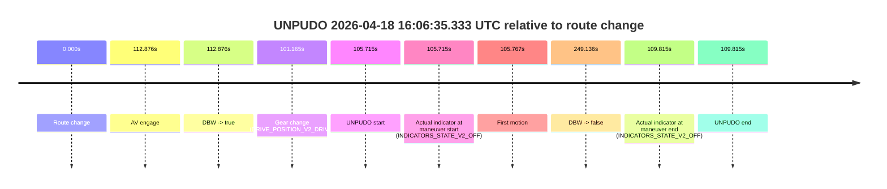
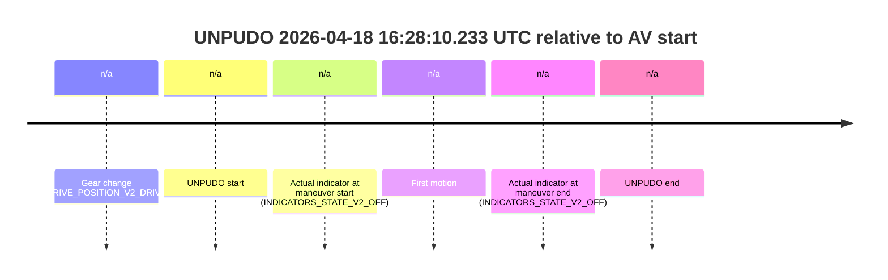
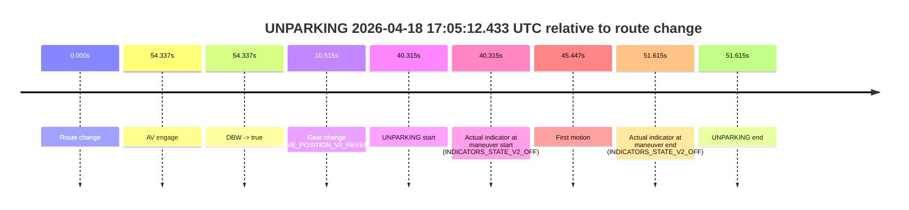

# Run Report: fme10003/2026-04-18--15-31-29--gen2-av-0a9602f5-09da-4760-a83f-84ac5081d7d9

| Field | Value |
|---|---|
| Run ID | `fme10003/2026-04-18--15-31-29--gen2-av-0a9602f5-09da-4760-a83f-84ac5081d7d9` |
| Date | `2026-04-18` |
| Model(s) | `armadillo-amethyst-squeaky` |
| Author | `guy.geva` |
| Event count | `15` |

## unpudo 2026-04-18 16:06:35.333 UTC

| Field | Value |
|---|---|
| Model | `armadillo-amethyst-squeaky` |
| Author | `guy.geva` |
| Run ID | `fme10003/2026-04-18--15-31-29--gen2-av-0a9602f5-09da-4760-a83f-84ac5081d7d9` |
| Date | `2026-04-18` |
| Time (UTC) | `16:06:35.333` |
| Event type | `unpudo` |
| Disengagement type | `failed_to_unpudo` |
| Route change | `found` |
| Console | [run](https://console.sso.wayve.ai/run/fme10003/2026-04-18--15-31-29--gen2-av-0a9602f5-09da-4760-a83f-84ac5081d7d9?id=&time-unixus=1776528395333293) |
| Foxglove | [segment](https://app.foxglove.dev/wayve-on-prem/p/prj_0dX18KZdVHg1fmmI/view?ds=foxglove-stream&ds.deviceName=fme10003&ds.start=2026-04-18T16%3A04%3A39.618243Z&ds.end=2026-04-18T16%3A09%3A08.754693Z&layoutId=lay_0e7VD4WIKDQGU73Y&time=2026-04-18T16%3A06%3A35.333293Z) |

### Event card: fail

- Fail: AV owns part of the segment, but the event still resolves as a model-performance failure under the AV-only scoring rule.

| Event | Time (UTC) | Delta from route change |
|---|---:|---:|
| Route change | 2026-04-18 16:04:49.618 | `0.000s` |
| AV engage | 2026-04-18 16:06:42.494 | `112.876s` |
| DBW -> true | 2026-04-18 16:06:42.494 | `112.876s` |
| Gear change (DRIVE_POSITION_V2_DRIVE) | 2026-04-18 16:06:30.783 | `101.165s` |
| UNPUDO start | 2026-04-18 16:06:35.333 | `105.715s` |
| Actual indicator at maneuver start (INDICATORS_STATE_V2_OFF) | 2026-04-18 16:06:35.333 | `105.715s` |
| First motion | 2026-04-18 16:06:35.385 | `105.767s` |
| DBW -> false | 2026-04-18 16:08:58.754 | `249.136s` |
| Actual indicator at maneuver end (INDICATORS_STATE_V2_OFF) | 2026-04-18 16:06:39.433 | `109.815s` |
| UNPUDO end | 2026-04-18 16:06:39.433 | `109.815s` |

| Metric | Value |
|---|---|
| Outcome | `fail` |
| Effective failure type | `failed_to_unpudo` |
| Route change status | `found` |
| DBW at event start | `false` |
| DBW at event end | `false` |
| Predicted gear at AV start | `DRIVE_POSITION_V2_DRIVE` |
| Actual gear at AV start | `DRIVE_POSITION_V2_DRIVE` |
| Predicted gear at event start | `DRIVE_POSITION_V2_DRIVE` |
| Actual gear at event start | `DRIVE_POSITION_V2_DRIVE` |
| Planned indicator direction | `INDICATORS_STATE_V2_LEFT_ON` |
| Controller indicator direction | `INDICATORS_STATE_V2_LEFT_ON` |
| Actual indicator direction | `INDICATORS_STATE_V2_OFF` |
| Actual indicator at maneuver end | `INDICATORS_STATE_V2_OFF` |
| Driver accel help in AV | `false` |
| Driver accel help timestamp | `n/a` |
| Max accel pedal pct in AV | `0.0%` |
| Max brake pedal pct in AV | `0.0%` |
| Max speed mps in AV | `0.000` |
| Route -> AV | `112.876s` |
| AV -> event start | `-7.161s` |
| AV -> first motion | `-7.109s` |
| AV duration before disengagement | `136.260s` |
| Trajectory waypoint count | `36` |
| Driving-plan step count | `11` |

The scored portion starts from the AV-owned window, not from the pre-AV setup. Route-change search in the stopped pre-event segment was `found`, with the baseline therefore set to route change. At the event anchor the model predicts `DRIVE_POSITION_V2_DRIVE` and the actual gear is `DRIVE_POSITION_V2_DRIVE`. The effective model outcome is `fail` because `failed_to_unpudo`.

### Resolution

| Field | Value |
|---|---|
| Final outcome | `fail` |
| Do we agree with this label? | `yes` |
| Source disengagement type | `failed_to_unpudo` |
| Resolved effective failure type | `failed_to_unpudo` |
| Confidence | `high` |

## unpudo 2026-04-18 16:08:59.433 UTC

| Field | Value |
|---|---|
| Model | `armadillo-amethyst-squeaky` |
| Author | `guy.geva` |
| Run ID | `fme10003/2026-04-18--15-31-29--gen2-av-0a9602f5-09da-4760-a83f-84ac5081d7d9` |
| Date | `2026-04-18` |
| Time (UTC) | `16:08:59.433` |
| Event type | `unpudo` |
| Disengagement type | `failed_to_unpudo` |
| Route change | `found` |
| Console | [run](https://console.sso.wayve.ai/run/fme10003/2026-04-18--15-31-29--gen2-av-0a9602f5-09da-4760-a83f-84ac5081d7d9?id=&time-unixus=1776528539433297) |
| Foxglove | [segment](https://app.foxglove.dev/wayve-on-prem/p/prj_0dX18KZdVHg1fmmI/view?ds=foxglove-stream&ds.deviceName=fme10003&ds.start=2026-04-18T16%3A07%3A16.868263Z&ds.end=2026-04-18T16%3A11%3A17.294860Z&layoutId=lay_0e7VD4WIKDQGU73Y&time=2026-04-18T16%3A08%3A59.433297Z) |

### Event card: fail

- Fail: AV owns part of the segment, but the event still resolves as a model-performance failure under the AV-only scoring rule.

| Event | Time (UTC) | Delta from route change |
|---|---:|---:|
| Route change | 2026-04-18 16:07:26.868 | `0.000s` |
| AV engage | 2026-04-18 16:09:07.914 | `101.046s` |
| DBW -> true | 2026-04-18 16:09:07.914 | `101.046s` |
| Gear change (DRIVE_POSITION_V2_DRIVE) | 2026-04-18 16:08:40.883 | `74.015s` |
| UNPUDO start | 2026-04-18 16:08:59.433 | `92.565s` |
| Actual indicator at maneuver start (INDICATORS_STATE_V2_OFF) | 2026-04-18 16:08:59.433 | `92.565s` |
| First motion | 2026-04-18 16:08:59.445 | `92.577s` |
| DBW -> false | 2026-04-18 16:11:07.294 | `220.427s` |
| Actual indicator at maneuver end (INDICATORS_STATE_V2_OFF) | 2026-04-18 16:09:04.733 | `97.865s` |
| UNPUDO end | 2026-04-18 16:09:04.733 | `97.865s` |

| Metric | Value |
|---|---|
| Outcome | `fail` |
| Effective failure type | `failed_to_unpudo` |
| Route change status | `found` |
| DBW at event start | `false` |
| DBW at event end | `false` |
| Predicted gear at AV start | `DRIVE_POSITION_V2_DRIVE` |
| Actual gear at AV start | `DRIVE_POSITION_V2_DRIVE` |
| Predicted gear at event start | `DRIVE_POSITION_V2_DRIVE` |
| Actual gear at event start | `DRIVE_POSITION_V2_DRIVE` |
| Planned indicator direction | `INDICATORS_STATE_V2_LEFT_ON` |
| Controller indicator direction | `INDICATORS_STATE_V2_LEFT_ON` |
| Actual indicator direction | `INDICATORS_STATE_V2_OFF` |
| Actual indicator at maneuver end | `INDICATORS_STATE_V2_OFF` |
| Driver accel help in AV | `false` |
| Driver accel help timestamp | `n/a` |
| Max accel pedal pct in AV | `0.0%` |
| Max brake pedal pct in AV | `0.0%` |
| Max speed mps in AV | `0.000` |
| Route -> AV | `101.046s` |
| AV -> event start | `-8.481s` |
| AV -> first motion | `-8.469s` |
| AV duration before disengagement | `119.381s` |
| Trajectory waypoint count | `36` |
| Driving-plan step count | `11` |

The scored portion starts from the AV-owned window, not from the pre-AV setup. Route-change search in the stopped pre-event segment was `found`, with the baseline therefore set to route change. At the event anchor the model predicts `DRIVE_POSITION_V2_DRIVE` and the actual gear is `DRIVE_POSITION_V2_DRIVE`. The effective model outcome is `fail` because `failed_to_unpudo`.

### Resolution

| Field | Value |
|---|---|
| Final outcome | `fail` |
| Do we agree with this label? | `yes` |
| Source disengagement type | `failed_to_unpudo` |
| Resolved effective failure type | `failed_to_unpudo` |
| Confidence | `high` |

## unpudo 2026-04-18 16:11:37.383 UTC

| Field | Value |
|---|---|
| Model | `armadillo-amethyst-squeaky` |
| Author | `guy.geva` |
| Run ID | `fme10003/2026-04-18--15-31-29--gen2-av-0a9602f5-09da-4760-a83f-84ac5081d7d9` |
| Date | `2026-04-18` |
| Time (UTC) | `16:11:37.383` |
| Event type | `unpudo` |
| Disengagement type | `failed_to_unpudo` |
| Route change | `found` |
| Console | [run](https://console.sso.wayve.ai/run/fme10003/2026-04-18--15-31-29--gen2-av-0a9602f5-09da-4760-a83f-84ac5081d7d9?id=&time-unixus=1776528697383297) |
| Foxglove | [segment](https://app.foxglove.dev/wayve-on-prem/p/prj_0dX18KZdVHg1fmmI/view?ds=foxglove-stream&ds.deviceName=fme10003&ds.start=2026-04-18T16%3A09%3A40.318238Z&ds.end=2026-04-18T16%3A14%3A20.194569Z&layoutId=lay_0e7VD4WIKDQGU73Y&time=2026-04-18T16%3A11%3A37.383297Z) |

### Event card: fail

- Fail: AV owns part of the segment, but the event still resolves as a model-performance failure under the AV-only scoring rule.

| Event | Time (UTC) | Delta from route change |
|---|---:|---:|
| Route change | 2026-04-18 16:09:50.318 | `0.000s` |
| AV engage | 2026-04-18 16:11:44.075 | `113.757s` |
| DBW -> true | 2026-04-18 16:11:44.075 | `113.757s` |
| Gear change (DRIVE_POSITION_V2_DRIVE) | 2026-04-18 16:11:29.883 | `99.565s` |
| UNPUDO start | 2026-04-18 16:11:37.383 | `107.065s` |
| Actual indicator at maneuver start (INDICATORS_STATE_V2_OFF) | 2026-04-18 16:11:37.383 | `107.065s` |
| First motion | 2026-04-18 16:11:37.405 | `107.087s` |
| DBW -> false | 2026-04-18 16:14:10.194 | `259.876s` |
| Actual indicator at maneuver end (INDICATORS_STATE_V2_OFF) | 2026-04-18 16:11:42.233 | `111.915s` |
| UNPUDO end | 2026-04-18 16:11:42.233 | `111.915s` |

| Metric | Value |
|---|---|
| Outcome | `fail` |
| Effective failure type | `failed_to_unpudo` |
| Route change status | `found` |
| DBW at event start | `false` |
| DBW at event end | `false` |
| Predicted gear at AV start | `DRIVE_POSITION_V2_DRIVE` |
| Actual gear at AV start | `DRIVE_POSITION_V2_DRIVE` |
| Predicted gear at event start | `DRIVE_POSITION_V2_DRIVE` |
| Actual gear at event start | `DRIVE_POSITION_V2_DRIVE` |
| Planned indicator direction | `INDICATORS_STATE_V2_LEFT_ON` |
| Controller indicator direction | `INDICATORS_STATE_V2_LEFT_ON` |
| Actual indicator direction | `INDICATORS_STATE_V2_OFF` |
| Actual indicator at maneuver end | `INDICATORS_STATE_V2_OFF` |
| Driver accel help in AV | `false` |
| Driver accel help timestamp | `n/a` |
| Max accel pedal pct in AV | `0.0%` |
| Max brake pedal pct in AV | `0.0%` |
| Max speed mps in AV | `0.000` |
| Route -> AV | `113.757s` |
| AV -> event start | `-6.692s` |
| AV -> first motion | `-6.670s` |
| AV duration before disengagement | `146.119s` |
| Trajectory waypoint count | `37` |
| Driving-plan step count | `11` |

The scored portion starts from the AV-owned window, not from the pre-AV setup. Route-change search in the stopped pre-event segment was `found`, with the baseline therefore set to route change. At the event anchor the model predicts `DRIVE_POSITION_V2_DRIVE` and the actual gear is `DRIVE_POSITION_V2_DRIVE`. The effective model outcome is `fail` because `failed_to_unpudo`.

### Resolution

| Field | Value |
|---|---|
| Final outcome | `fail` |
| Do we agree with this label? | `yes` |
| Source disengagement type | `failed_to_unpudo` |
| Resolved effective failure type | `failed_to_unpudo` |
| Confidence | `high` |

## unpudo 2026-04-18 16:14:44.633 UTC

| Field | Value |
|---|---|
| Model | `armadillo-amethyst-squeaky` |
| Author | `guy.geva` |
| Run ID | `fme10003/2026-04-18--15-31-29--gen2-av-0a9602f5-09da-4760-a83f-84ac5081d7d9` |
| Date | `2026-04-18` |
| Time (UTC) | `16:14:44.633` |
| Event type | `unpudo` |
| Disengagement type | `failed_to_unpudo` |
| Route change | `found` |
| Console | [run](https://console.sso.wayve.ai/run/fme10003/2026-04-18--15-31-29--gen2-av-0a9602f5-09da-4760-a83f-84ac5081d7d9?id=&time-unixus=1776528884633295) |
| Foxglove | [segment](https://app.foxglove.dev/wayve-on-prem/p/prj_0dX18KZdVHg1fmmI/view?ds=foxglove-stream&ds.deviceName=fme10003&ds.start=2026-04-18T16%3A14%3A19.168269Z&ds.end=2026-04-18T16%3A16%3A13.834465Z&layoutId=lay_0e7VD4WIKDQGU73Y&time=2026-04-18T16%3A14%3A44.633295Z) |

### Event card: fail

- Fail: AV owns part of the segment, but the event still resolves as a model-performance failure under the AV-only scoring rule.

| Event | Time (UTC) | Delta from route change |
|---|---:|---:|
| Route change | 2026-04-18 16:14:29.168 | `0.000s` |
| AV engage | 2026-04-18 16:14:51.294 | `22.126s` |
| DBW -> true | 2026-04-18 16:14:51.294 | `22.126s` |
| Gear change (DRIVE_POSITION_V2_DRIVE) | 2026-04-18 16:14:39.583 | `10.415s` |
| UNPUDO start | 2026-04-18 16:14:44.633 | `15.465s` |
| Actual indicator at maneuver start (INDICATORS_STATE_V2_OFF) | 2026-04-18 16:14:44.633 | `15.465s` |
| First motion | 2026-04-18 16:14:44.665 | `15.497s` |
| DBW -> false | 2026-04-18 16:16:03.834 | `94.666s` |
| Actual indicator at maneuver end (INDICATORS_STATE_V2_OFF) | 2026-04-18 16:14:51.633 | `22.465s` |
| UNPUDO end | 2026-04-18 16:14:51.633 | `22.465s` |

| Metric | Value |
|---|---|
| Outcome | `fail` |
| Effective failure type | `failed_to_unpudo` |
| Route change status | `found` |
| DBW at event start | `false` |
| DBW at event end | `true` |
| Predicted gear at AV start | `DRIVE_POSITION_V2_DRIVE` |
| Actual gear at AV start | `DRIVE_POSITION_V2_DRIVE` |
| Predicted gear at event start | `DRIVE_POSITION_V2_DRIVE` |
| Actual gear at event start | `DRIVE_POSITION_V2_DRIVE` |
| Planned indicator direction | `INDICATORS_STATE_V2_OFF` |
| Controller indicator direction | `INDICATORS_STATE_V2_OFF` |
| Actual indicator direction | `INDICATORS_STATE_V2_OFF` |
| Actual indicator at maneuver end | `INDICATORS_STATE_V2_OFF` |
| Driver accel help in AV | `false` |
| Driver accel help timestamp | `n/a` |
| Max accel pedal pct in AV | `0.0%` |
| Max brake pedal pct in AV | `0.0%` |
| Max speed mps in AV | `2.239` |
| Route -> AV | `22.126s` |
| AV -> event start | `-6.661s` |
| AV -> first motion | `-6.629s` |
| AV duration before disengagement | `72.540s` |
| Trajectory waypoint count | `36` |
| Driving-plan step count | `11` |

The scored portion starts from the AV-owned window, not from the pre-AV setup. Route-change search in the stopped pre-event segment was `found`, with the baseline therefore set to route change. At the event anchor the model predicts `DRIVE_POSITION_V2_DRIVE` and the actual gear is `DRIVE_POSITION_V2_DRIVE`. The effective model outcome is `fail` because `failed_to_unpudo`.

### Resolution

| Field | Value |
|---|---|
| Final outcome | `fail` |
| Do we agree with this label? | `yes` |
| Source disengagement type | `failed_to_unpudo` |
| Resolved effective failure type | `failed_to_unpudo` |
| Confidence | `high` |

## unpudo 2026-04-18 16:16:32.183 UTC

| Field | Value |
|---|---|
| Model | `armadillo-amethyst-squeaky` |
| Author | `guy.geva` |
| Run ID | `fme10003/2026-04-18--15-31-29--gen2-av-0a9602f5-09da-4760-a83f-84ac5081d7d9` |
| Date | `2026-04-18` |
| Time (UTC) | `16:16:32.183` |
| Event type | `unpudo` |
| Disengagement type | `none observed` |
| Route change | `found` |
| Console | [run](https://console.sso.wayve.ai/run/fme10003/2026-04-18--15-31-29--gen2-av-0a9602f5-09da-4760-a83f-84ac5081d7d9?id=&time-unixus=1776528992183320) |
| Foxglove | [segment](https://app.foxglove.dev/wayve-on-prem/p/prj_0dX18KZdVHg1fmmI/view?ds=foxglove-stream&ds.deviceName=fme10003&ds.start=2026-04-18T16%3A16%3A04.268376Z&ds.end=2026-04-18T16%3A19%3A12.674319Z&layoutId=lay_0e7VD4WIKDQGU73Y&time=2026-04-18T16%3A16%3A32.183320Z) |

### Event card: pass

- Pass: AV owns the credited unpudo through the official event window, the gear state is aligned at the anchor, and the vehicle moves without driver accelerator help in AV.

| Event | Time (UTC) | Delta from route change |
|---|---:|---:|
| Route change | 2026-04-18 16:16:14.268 | `0.000s` |
| AV engage | 2026-04-18 16:16:18.214 | `3.946s` |
| DBW -> true | 2026-04-18 16:16:18.214 | `3.946s` |
| Gear change (DRIVE_POSITION_V2_DRIVE) | 2026-04-18 16:16:18.583 | `4.315s` |
| UNPUDO start | 2026-04-18 16:16:32.183 | `17.915s` |
| Actual indicator at maneuver start (INDICATORS_STATE_V2_OFF) | 2026-04-18 16:16:32.183 | `17.915s` |
| First motion | 2026-04-18 16:16:32.285 | `18.017s` |
| DBW -> false | 2026-04-18 16:19:02.674 | `168.406s` |
| Actual indicator at maneuver end (INDICATORS_STATE_V2_OFF) | 2026-04-18 16:16:42.283 | `28.015s` |
| UNPUDO end | 2026-04-18 16:16:42.283 | `28.015s` |

| Metric | Value |
|---|---|
| Outcome | `pass` |
| Effective failure type | `none` |
| Route change status | `found` |
| DBW at event start | `true` |
| DBW at event end | `true` |
| Predicted gear at AV start | `DRIVE_POSITION_V2_DRIVE` |
| Actual gear at AV start | `DRIVE_POSITION_V2_PARK` |
| Predicted gear at event start | `DRIVE_POSITION_V2_DRIVE` |
| Actual gear at event start | `DRIVE_POSITION_V2_DRIVE` |
| Planned indicator direction | `INDICATORS_STATE_V2_OFF` |
| Controller indicator direction | `INDICATORS_STATE_V2_OFF` |
| Actual indicator direction | `INDICATORS_STATE_V2_OFF` |
| Actual indicator at maneuver end | `INDICATORS_STATE_V2_OFF` |
| Driver accel help in AV | `false` |
| Driver accel help timestamp | `n/a` |
| Max accel pedal pct in AV | `0.0%` |
| Max brake pedal pct in AV | `8.3%` |
| Max speed mps in AV | `2.239` |
| Route -> AV | `3.946s` |
| AV -> event start | `13.969s` |
| AV -> first motion | `14.071s` |
| AV duration before disengagement | `164.460s` |
| Trajectory waypoint count | `37` |
| Driving-plan step count | `11` |

The scored portion starts from the AV-owned window, not from the pre-AV setup. Route-change search in the stopped pre-event segment was `found`, with the baseline therefore set to route change. At the event anchor the model predicts `DRIVE_POSITION_V2_DRIVE` and the actual gear is `DRIVE_POSITION_V2_DRIVE`. The effective model outcome is `pass` because `the credited maneuver stays AV-owned through the official event end`.

### Resolution

| Field | Value |
|---|---|
| Final outcome | `pass` |
| Do we agree with this label? | `yes` |
| Source disengagement type | `none observed` |
| Resolved effective failure type | `none` |
| Confidence | `high` |

## unpudo 2026-04-18 16:24:26.183 UTC

| Field | Value |
|---|---|
| Model | `armadillo-amethyst-squeaky` |
| Author | `guy.geva` |
| Run ID | `fme10003/2026-04-18--15-31-29--gen2-av-0a9602f5-09da-4760-a83f-84ac5081d7d9` |
| Date | `2026-04-18` |
| Time (UTC) | `16:24:26.183` |
| Event type | `unpudo` |
| Disengagement type | `failed_to_unpudo` |
| Route change | `found` |
| Console | [run](https://console.sso.wayve.ai/run/fme10003/2026-04-18--15-31-29--gen2-av-0a9602f5-09da-4760-a83f-84ac5081d7d9?id=&time-unixus=1776529466183304) |
| Foxglove | [segment](https://app.foxglove.dev/wayve-on-prem/p/prj_0dX18KZdVHg1fmmI/view?ds=foxglove-stream&ds.deviceName=fme10003&ds.start=2026-04-18T16%3A23%3A54.318253Z&ds.end=2026-04-18T16%3A25%3A37.754238Z&layoutId=lay_0e7VD4WIKDQGU73Y&time=2026-04-18T16%3A24%3A26.183304Z) |

### Event card: fail

- Fail: AV owns part of the segment, but the event still resolves as a model-performance failure under the AV-only scoring rule.

| Event | Time (UTC) | Delta from route change |
|---|---:|---:|
| Route change | 2026-04-18 16:24:04.318 | `0.000s` |
| AV engage | 2026-04-18 16:24:39.914 | `35.596s` |
| DBW -> true | 2026-04-18 16:24:39.914 | `35.596s` |
| Gear change (DRIVE_POSITION_V2_DRIVE) | 2026-04-18 16:24:10.983 | `6.665s` |
| UNPUDO start | 2026-04-18 16:24:26.183 | `21.865s` |
| Actual indicator at maneuver start (INDICATORS_STATE_V2_OFF) | 2026-04-18 16:24:26.183 | `21.865s` |
| First motion | 2026-04-18 16:24:26.225 | `21.907s` |
| DBW -> false | 2026-04-18 16:25:27.754 | `83.436s` |
| Actual indicator at maneuver end (INDICATORS_STATE_V2_OFF) | 2026-04-18 16:24:30.583 | `26.265s` |
| UNPUDO end | 2026-04-18 16:24:30.583 | `26.265s` |

| Metric | Value |
|---|---|
| Outcome | `fail` |
| Effective failure type | `failed_to_unpudo` |
| Route change status | `found` |
| DBW at event start | `false` |
| DBW at event end | `false` |
| Predicted gear at AV start | `DRIVE_POSITION_V2_DRIVE` |
| Actual gear at AV start | `DRIVE_POSITION_V2_DRIVE` |
| Predicted gear at event start | `DRIVE_POSITION_V2_DRIVE` |
| Actual gear at event start | `DRIVE_POSITION_V2_DRIVE` |
| Planned indicator direction | `INDICATORS_STATE_V2_LEFT_ON` |
| Controller indicator direction | `INDICATORS_STATE_V2_LEFT_ON` |
| Actual indicator direction | `INDICATORS_STATE_V2_OFF` |
| Actual indicator at maneuver end | `INDICATORS_STATE_V2_OFF` |
| Driver accel help in AV | `false` |
| Driver accel help timestamp | `n/a` |
| Max accel pedal pct in AV | `0.0%` |
| Max brake pedal pct in AV | `0.0%` |
| Max speed mps in AV | `0.000` |
| Route -> AV | `35.596s` |
| AV -> event start | `-13.731s` |
| AV -> first motion | `-13.689s` |
| AV duration before disengagement | `47.840s` |
| Trajectory waypoint count | `37` |
| Driving-plan step count | `11` |

The scored portion starts from the AV-owned window, not from the pre-AV setup. Route-change search in the stopped pre-event segment was `found`, with the baseline therefore set to route change. At the event anchor the model predicts `DRIVE_POSITION_V2_DRIVE` and the actual gear is `DRIVE_POSITION_V2_DRIVE`. The effective model outcome is `fail` because `failed_to_unpudo`.

### Resolution

| Field | Value |
|---|---|
| Final outcome | `fail` |
| Do we agree with this label? | `yes` |
| Source disengagement type | `failed_to_unpudo` |
| Resolved effective failure type | `failed_to_unpudo` |
| Confidence | `high` |

## unpudo 2026-04-18 16:26:13.233 UTC

| Field | Value |
|---|---|
| Model | `armadillo-amethyst-squeaky` |
| Author | `guy.geva` |
| Run ID | `fme10003/2026-04-18--15-31-29--gen2-av-0a9602f5-09da-4760-a83f-84ac5081d7d9` |
| Date | `2026-04-18` |
| Time (UTC) | `16:26:13.233` |
| Event type | `unpudo` |
| Disengagement type | `none observed` |
| Route change | `found` |
| Console | [run](https://console.sso.wayve.ai/run/fme10003/2026-04-18--15-31-29--gen2-av-0a9602f5-09da-4760-a83f-84ac5081d7d9?id=&time-unixus=1776529573233293) |
| Foxglove | [segment](https://app.foxglove.dev/wayve-on-prem/p/prj_0dX18KZdVHg1fmmI/view?ds=foxglove-stream&ds.deviceName=fme10003&ds.start=2026-04-18T16%3A25%3A44.068283Z&ds.end=2026-04-18T16%3A28%3A10.174363Z&layoutId=lay_0e7VD4WIKDQGU73Y&time=2026-04-18T16%3A26%3A13.233293Z) |

### Event card: pass

- Pass: AV owns the credited unpudo through the official event window, the gear state is aligned at the anchor, and the vehicle moves without driver accelerator help in AV.

| Event | Time (UTC) | Delta from route change |
|---|---:|---:|
| Route change | 2026-04-18 16:25:54.068 | `0.000s` |
| AV engage | 2026-04-18 16:25:58.274 | `4.206s` |
| DBW -> true | 2026-04-18 16:25:58.274 | `4.206s` |
| Gear change (DRIVE_POSITION_V2_DRIVE) | 2026-04-18 16:25:58.783 | `4.715s` |
| UNPUDO start | 2026-04-18 16:26:13.233 | `19.165s` |
| Actual indicator at maneuver start (INDICATORS_STATE_V2_OFF) | 2026-04-18 16:26:13.233 | `19.165s` |
| First motion | 2026-04-18 16:26:13.285 | `19.217s` |
| DBW -> false | 2026-04-18 16:28:00.174 | `126.106s` |
| Actual indicator at maneuver end (INDICATORS_STATE_V2_OFF) | 2026-04-18 16:26:16.583 | `22.515s` |
| UNPUDO end | 2026-04-18 16:26:16.583 | `22.515s` |

| Metric | Value |
|---|---|
| Outcome | `pass` |
| Effective failure type | `none` |
| Route change status | `found` |
| DBW at event start | `true` |
| DBW at event end | `true` |
| Predicted gear at AV start | `DRIVE_POSITION_V2_DRIVE` |
| Actual gear at AV start | `DRIVE_POSITION_V2_PARK` |
| Predicted gear at event start | `DRIVE_POSITION_V2_DRIVE` |
| Actual gear at event start | `DRIVE_POSITION_V2_DRIVE` |
| Planned indicator direction | `INDICATORS_STATE_V2_LEFT_ON` |
| Controller indicator direction | `INDICATORS_STATE_V2_LEFT_ON` |
| Actual indicator direction | `INDICATORS_STATE_V2_OFF` |
| Actual indicator at maneuver end | `INDICATORS_STATE_V2_OFF` |
| Driver accel help in AV | `false` |
| Driver accel help timestamp | `n/a` |
| Max accel pedal pct in AV | `0.0%` |
| Max brake pedal pct in AV | `8.0%` |
| Max speed mps in AV | `5.822` |
| Route -> AV | `4.206s` |
| AV -> event start | `14.959s` |
| AV -> first motion | `15.011s` |
| AV duration before disengagement | `121.900s` |
| Trajectory waypoint count | `38` |
| Driving-plan step count | `11` |

The scored portion starts from the AV-owned window, not from the pre-AV setup. Route-change search in the stopped pre-event segment was `found`, with the baseline therefore set to route change. At the event anchor the model predicts `DRIVE_POSITION_V2_DRIVE` and the actual gear is `DRIVE_POSITION_V2_DRIVE`. The effective model outcome is `pass` because `the credited maneuver stays AV-owned through the official event end`.

### Resolution

| Field | Value |
|---|---|
| Final outcome | `pass` |
| Do we agree with this label? | `yes` |
| Source disengagement type | `none observed` |
| Resolved effective failure type | `none` |
| Confidence | `high` |

## unpudo 2026-04-18 16:28:10.233 UTC

| Field | Value |
|---|---|
| Model | `armadillo-amethyst-squeaky` |
| Author | `guy.geva` |
| Run ID | `fme10003/2026-04-18--15-31-29--gen2-av-0a9602f5-09da-4760-a83f-84ac5081d7d9` |
| Date | `2026-04-18` |
| Time (UTC) | `16:28:10.233` |
| Event type | `unpudo` |
| Disengagement type | `failed_to_pudo` |
| Route change | `unclear` |
| Console | [run](https://console.sso.wayve.ai/run/fme10003/2026-04-18--15-31-29--gen2-av-0a9602f5-09da-4760-a83f-84ac5081d7d9?id=&time-unixus=1776529690233293) |
| Foxglove | [segment](https://app.foxglove.dev/wayve-on-prem/p/prj_0dX18KZdVHg1fmmI/view?ds=foxglove-stream&ds.deviceName=fme10003&ds.start=2026-04-18T16%3A27%3A58.983299Z&ds.end=2026-04-18T16%3A28%3A20.233293Z&layoutId=lay_0e7VD4WIKDQGU73Y&time=2026-04-18T16%3A28%3A10.233293Z) |

### Event card: fail

- Fail: AV owns part of the segment, but the event still resolves as a model-performance failure under the AV-only scoring rule.

| Event | Time (UTC) | Delta from AV start |
|---|---:|---:|
| Gear change (DRIVE_POSITION_V2_DRIVE) | 2026-04-18 16:28:08.983 | `n/a` |
| UNPUDO start | 2026-04-18 16:28:10.233 | `n/a` |
| Actual indicator at maneuver start (INDICATORS_STATE_V2_OFF) | 2026-04-18 16:28:10.233 | `n/a` |
| First motion | 2026-04-18 16:28:10.265 | `n/a` |
| Actual indicator at maneuver end (INDICATORS_STATE_V2_OFF) | 2026-04-18 16:28:10.233 | `n/a` |
| UNPUDO end | 2026-04-18 16:28:10.233 | `n/a` |

| Metric | Value |
|---|---|
| Outcome | `fail` |
| Effective failure type | `failed_to_pudo` |
| Route change status | `unclear` |
| DBW at event start | `false` |
| DBW at event end | `false` |
| Predicted gear at AV start | `n/a` |
| Actual gear at AV start | `n/a` |
| Predicted gear at event start | `DRIVE_POSITION_V2_DRIVE` |
| Actual gear at event start | `DRIVE_POSITION_V2_DRIVE` |
| Planned indicator direction | `INDICATORS_STATE_V2_OFF` |
| Controller indicator direction | `INDICATORS_STATE_V2_OFF` |
| Actual indicator direction | `INDICATORS_STATE_V2_OFF` |
| Actual indicator at maneuver end | `INDICATORS_STATE_V2_OFF` |
| Driver accel help in AV | `false` |
| Driver accel help timestamp | `n/a` |
| Max accel pedal pct in AV | `0.0%` |
| Max brake pedal pct in AV | `0.0%` |
| Max speed mps in AV | `0.000` |
| Route -> AV | `n/a` |
| AV -> event start | `n/a` |
| AV -> first motion | `n/a` |
| AV duration before disengagement | `n/a` |
| Trajectory waypoint count | `38` |
| Driving-plan step count | `11` |

The scored portion starts from the AV-owned window, not from the pre-AV setup. Route-change search in the stopped pre-event segment was `unclear`, with the baseline therefore set to AV start. At the event anchor the model predicts `DRIVE_POSITION_V2_DRIVE` and the actual gear is `DRIVE_POSITION_V2_DRIVE`. The effective model outcome is `fail` because `failed_to_pudo`.

### Resolution

| Field | Value |
|---|---|
| Final outcome | `fail` |
| Do we agree with this label? | `yes` |
| Source disengagement type | `failed_to_pudo` |
| Resolved effective failure type | `failed_to_pudo` |
| Confidence | `medium` |

## unpudo 2026-04-18 16:30:53.483 UTC

| Field | Value |
|---|---|
| Model | `armadillo-amethyst-squeaky` |
| Author | `guy.geva` |
| Run ID | `fme10003/2026-04-18--15-31-29--gen2-av-0a9602f5-09da-4760-a83f-84ac5081d7d9` |
| Date | `2026-04-18` |
| Time (UTC) | `16:30:53.483` |
| Event type | `unpudo` |
| Disengagement type | `none observed` |
| Route change | `found` |
| Console | [run](https://console.sso.wayve.ai/run/fme10003/2026-04-18--15-31-29--gen2-av-0a9602f5-09da-4760-a83f-84ac5081d7d9?id=&time-unixus=1776529853483314) |
| Foxglove | [segment](https://app.foxglove.dev/wayve-on-prem/p/prj_0dX18KZdVHg1fmmI/view?ds=foxglove-stream&ds.deviceName=fme10003&ds.start=2026-04-18T16%3A28%3A54.918281Z&ds.end=2026-04-18T16%3A32%3A43.054364Z&layoutId=lay_0e7VD4WIKDQGU73Y&time=2026-04-18T16%3A30%3A53.483314Z) |

### Event card: pass

- Pass: AV owns the credited unpudo through the official event window, the gear state is aligned at the anchor, and the vehicle moves without driver accelerator help in AV.

| Event | Time (UTC) | Delta from route change |
|---|---:|---:|
| Route change | 2026-04-18 16:29:04.918 | `0.000s` |
| AV engage | 2026-04-18 16:30:46.834 | `101.916s` |
| DBW -> true | 2026-04-18 16:30:46.834 | `101.916s` |
| Gear change (DRIVE_POSITION_V2_DRIVE) | 2026-04-18 16:30:47.283 | `102.365s` |
| UNPUDO start | 2026-04-18 16:30:53.483 | `108.565s` |
| Actual indicator at maneuver start (INDICATORS_STATE_V2_OFF) | 2026-04-18 16:30:53.483 | `108.565s` |
| First motion | 2026-04-18 16:30:53.505 | `108.587s` |
| DBW -> false | 2026-04-18 16:32:33.054 | `208.136s` |
| Actual indicator at maneuver end (INDICATORS_STATE_V2_OFF) | 2026-04-18 16:30:56.833 | `111.915s` |
| UNPUDO end | 2026-04-18 16:30:56.833 | `111.915s` |

| Metric | Value |
|---|---|
| Outcome | `pass` |
| Effective failure type | `none` |
| Route change status | `found` |
| DBW at event start | `true` |
| DBW at event end | `true` |
| Predicted gear at AV start | `DRIVE_POSITION_V2_DRIVE` |
| Actual gear at AV start | `DRIVE_POSITION_V2_PARK` |
| Predicted gear at event start | `DRIVE_POSITION_V2_DRIVE` |
| Actual gear at event start | `DRIVE_POSITION_V2_DRIVE` |
| Planned indicator direction | `INDICATORS_STATE_V2_LEFT_ON` |
| Controller indicator direction | `INDICATORS_STATE_V2_LEFT_ON` |
| Actual indicator direction | `INDICATORS_STATE_V2_OFF` |
| Actual indicator at maneuver end | `INDICATORS_STATE_V2_OFF` |
| Driver accel help in AV | `false` |
| Driver accel help timestamp | `n/a` |
| Max accel pedal pct in AV | `0.0%` |
| Max brake pedal pct in AV | `8.0%` |
| Max speed mps in AV | `6.006` |
| Route -> AV | `101.916s` |
| AV -> event start | `6.649s` |
| AV -> first motion | `6.671s` |
| AV duration before disengagement | `106.220s` |
| Trajectory waypoint count | `37` |
| Driving-plan step count | `11` |

The scored portion starts from the AV-owned window, not from the pre-AV setup. Route-change search in the stopped pre-event segment was `found`, with the baseline therefore set to route change. At the event anchor the model predicts `DRIVE_POSITION_V2_DRIVE` and the actual gear is `DRIVE_POSITION_V2_DRIVE`. The effective model outcome is `pass` because `the credited maneuver stays AV-owned through the official event end`.

### Resolution

| Field | Value |
|---|---|
| Final outcome | `pass` |
| Do we agree with this label? | `yes` |
| Source disengagement type | `none observed` |
| Resolved effective failure type | `none` |
| Confidence | `high` |

## unpudo 2026-04-18 16:48:47.133 UTC

| Field | Value |
|---|---|
| Model | `armadillo-amethyst-squeaky` |
| Author | `guy.geva` |
| Run ID | `fme10003/2026-04-18--15-31-29--gen2-av-0a9602f5-09da-4760-a83f-84ac5081d7d9` |
| Date | `2026-04-18` |
| Time (UTC) | `16:48:47.133` |
| Event type | `unpudo` |
| Disengagement type | `failed_to_unpudo` |
| Route change | `found` |
| Console | [run](https://console.sso.wayve.ai/run/fme10003/2026-04-18--15-31-29--gen2-av-0a9602f5-09da-4760-a83f-84ac5081d7d9?id=&time-unixus=1776530927133302) |
| Foxglove | [segment](https://app.foxglove.dev/wayve-on-prem/p/prj_0dX18KZdVHg1fmmI/view?ds=foxglove-stream&ds.deviceName=fme10003&ds.start=2026-04-18T16%3A47%3A28.618261Z&ds.end=2026-04-18T16%3A51%3A10.275188Z&layoutId=lay_0e7VD4WIKDQGU73Y&time=2026-04-18T16%3A48%3A47.133302Z) |

### Event card: fail

- Fail: AV owns part of the segment, but the event still resolves as a model-performance failure under the AV-only scoring rule.

| Event | Time (UTC) | Delta from route change |
|---|---:|---:|
| Route change | 2026-04-18 16:47:38.618 | `0.000s` |
| AV engage | 2026-04-18 16:48:56.855 | `78.237s` |
| DBW -> true | 2026-04-18 16:48:56.855 | `78.237s` |
| Gear change (DRIVE_POSITION_V2_DRIVE) | 2026-04-18 16:48:34.433 | `55.815s` |
| UNPUDO start | 2026-04-18 16:48:47.133 | `68.515s` |
| Actual indicator at maneuver start (INDICATORS_STATE_V2_OFF) | 2026-04-18 16:48:47.133 | `68.515s` |
| First motion | 2026-04-18 16:48:47.205 | `68.587s` |
| DBW -> false | 2026-04-18 16:51:00.275 | `201.657s` |
| Actual indicator at maneuver end (INDICATORS_STATE_V2_OFF) | 2026-04-18 16:48:54.033 | `75.415s` |
| UNPUDO end | 2026-04-18 16:48:54.033 | `75.415s` |

| Metric | Value |
|---|---|
| Outcome | `fail` |
| Effective failure type | `failed_to_unpudo` |
| Route change status | `found` |
| DBW at event start | `false` |
| DBW at event end | `false` |
| Predicted gear at AV start | `DRIVE_POSITION_V2_DRIVE` |
| Actual gear at AV start | `DRIVE_POSITION_V2_DRIVE` |
| Predicted gear at event start | `DRIVE_POSITION_V2_DRIVE` |
| Actual gear at event start | `DRIVE_POSITION_V2_DRIVE` |
| Planned indicator direction | `INDICATORS_STATE_V2_LEFT_ON` |
| Controller indicator direction | `INDICATORS_STATE_V2_LEFT_ON` |
| Actual indicator direction | `INDICATORS_STATE_V2_OFF` |
| Actual indicator at maneuver end | `INDICATORS_STATE_V2_OFF` |
| Driver accel help in AV | `false` |
| Driver accel help timestamp | `n/a` |
| Max accel pedal pct in AV | `0.0%` |
| Max brake pedal pct in AV | `0.0%` |
| Max speed mps in AV | `0.000` |
| Route -> AV | `78.237s` |
| AV -> event start | `-9.722s` |
| AV -> first motion | `-9.650s` |
| AV duration before disengagement | `123.420s` |
| Trajectory waypoint count | `38` |
| Driving-plan step count | `11` |

The scored portion starts from the AV-owned window, not from the pre-AV setup. Route-change search in the stopped pre-event segment was `found`, with the baseline therefore set to route change. At the event anchor the model predicts `DRIVE_POSITION_V2_DRIVE` and the actual gear is `DRIVE_POSITION_V2_DRIVE`. The effective model outcome is `fail` because `failed_to_unpudo`.

### Resolution

| Field | Value |
|---|---|
| Final outcome | `fail` |
| Do we agree with this label? | `yes` |
| Source disengagement type | `failed_to_unpudo` |
| Resolved effective failure type | `failed_to_unpudo` |
| Confidence | `high` |

## unpudo 2026-04-18 16:51:14.883 UTC

| Field | Value |
|---|---|
| Model | `armadillo-amethyst-squeaky` |
| Author | `guy.geva` |
| Run ID | `fme10003/2026-04-18--15-31-29--gen2-av-0a9602f5-09da-4760-a83f-84ac5081d7d9` |
| Date | `2026-04-18` |
| Time (UTC) | `16:51:14.883` |
| Event type | `unpudo` |
| Disengagement type | `none observed` |
| Route change | `unclear` |
| Console | [run](https://console.sso.wayve.ai/run/fme10003/2026-04-18--15-31-29--gen2-av-0a9602f5-09da-4760-a83f-84ac5081d7d9?id=&time-unixus=1776531074883307) |
| Foxglove | [segment](https://app.foxglove.dev/wayve-on-prem/p/prj_0dX18KZdVHg1fmmI/view?ds=foxglove-stream&ds.deviceName=fme10003&ds.start=2026-04-18T16%3A51%3A04.883307Z&ds.end=2026-04-18T16%3A51%3A30.883297Z&layoutId=lay_0e7VD4WIKDQGU73Y&time=2026-04-18T16%3A51%3A14.883307Z) |

### Event card: fail

- Fail: the credited unpudo does not stay AV-owned. The event window starts with DBW false, and the maneuver outcome lands outside a clean AV-owned segment.

| Event | Time (UTC) | Delta from AV start |
|---|---:|---:|
| Gear change (DRIVE_POSITION_V2_DRIVE) | 2026-04-18 16:51:14.883 | `n/a` |
| UNPUDO start | 2026-04-18 16:51:14.883 | `n/a` |
| Actual indicator at maneuver start (INDICATORS_STATE_V2_OFF) | 2026-04-18 16:51:14.883 | `n/a` |
| First motion | 2026-04-18 16:51:16.245 | `n/a` |
| Actual indicator at maneuver end (INDICATORS_STATE_V2_OFF) | 2026-04-18 16:51:20.883 | `n/a` |
| UNPUDO end | 2026-04-18 16:51:20.883 | `n/a` |

| Metric | Value |
|---|---|
| Outcome | `fail` |
| Effective failure type | `not_av_owned` |
| Route change status | `unclear` |
| DBW at event start | `false` |
| DBW at event end | `false` |
| Predicted gear at AV start | `n/a` |
| Actual gear at AV start | `n/a` |
| Predicted gear at event start | `DRIVE_POSITION_V2_REVERSE` |
| Actual gear at event start | `DRIVE_POSITION_V2_DRIVE` |
| Planned indicator direction | `INDICATORS_STATE_V2_OFF` |
| Controller indicator direction | `INDICATORS_STATE_V2_OFF` |
| Actual indicator direction | `INDICATORS_STATE_V2_OFF` |
| Actual indicator at maneuver end | `INDICATORS_STATE_V2_OFF` |
| Driver accel help in AV | `false` |
| Driver accel help timestamp | `n/a` |
| Max accel pedal pct in AV | `0.0%` |
| Max brake pedal pct in AV | `0.0%` |
| Max speed mps in AV | `0.000` |
| Route -> AV | `n/a` |
| AV -> event start | `n/a` |
| AV -> first motion | `n/a` |
| AV duration before disengagement | `n/a` |
| Trajectory waypoint count | `37` |
| Driving-plan step count | `11` |

The scored portion starts from the AV-owned window, not from the pre-AV setup. Route-change search in the stopped pre-event segment was `unclear`, with the baseline therefore set to AV start. At the event anchor the model predicts `DRIVE_POSITION_V2_REVERSE` and the actual gear is `DRIVE_POSITION_V2_DRIVE`. The effective model outcome is `fail` because `not_av_owned`.

### Resolution

| Field | Value |
|---|---|
| Final outcome | `fail` |
| Do we agree with this label? | `yes` |
| Source disengagement type | `none observed` |
| Resolved effective failure type | `not_av_owned` |
| Confidence | `medium` |

## unpudo 2026-04-18 16:52:08.683 UTC

| Field | Value |
|---|---|
| Model | `armadillo-amethyst-squeaky` |
| Author | `guy.geva` |
| Run ID | `fme10003/2026-04-18--15-31-29--gen2-av-0a9602f5-09da-4760-a83f-84ac5081d7d9` |
| Date | `2026-04-18` |
| Time (UTC) | `16:52:08.683` |
| Event type | `unpudo` |
| Disengagement type | `failed_to_unpudo` |
| Route change | `found` |
| Console | [run](https://console.sso.wayve.ai/run/fme10003/2026-04-18--15-31-29--gen2-av-0a9602f5-09da-4760-a83f-84ac5081d7d9?id=&time-unixus=1776531128683302) |
| Foxglove | [segment](https://app.foxglove.dev/wayve-on-prem/p/prj_0dX18KZdVHg1fmmI/view?ds=foxglove-stream&ds.deviceName=fme10003&ds.start=2026-04-18T16%3A51%3A20.518330Z&ds.end=2026-04-18T16%3A52%3A48.733313Z&layoutId=lay_0e7VD4WIKDQGU73Y&time=2026-04-18T16%3A52%3A08.683302Z) |

### Event card: fail

- Fail: AV owns part of the segment, but the event still resolves as a model-performance failure under the AV-only scoring rule.

| Event | Time (UTC) | Delta from route change |
|---|---:|---:|
| Route change | 2026-04-18 16:51:30.518 | `0.000s` |
| AV engage | 2026-04-18 16:52:20.694 | `50.176s` |
| DBW -> true | 2026-04-18 16:52:20.694 | `50.176s` |
| Gear change (DRIVE_POSITION_V2_REVERSE) | 2026-04-18 16:51:54.833 | `24.315s` |
| UNPUDO start | 2026-04-18 16:52:08.683 | `38.165s` |
| Actual indicator at maneuver start (INDICATORS_STATE_V2_OFF) | 2026-04-18 16:52:08.683 | `38.165s` |
| First motion | 2026-04-18 16:52:33.845 | `63.327s` |
| DBW -> false | 2026-04-18 16:52:33.014 | `62.497s` |
| Actual indicator at maneuver end (INDICATORS_STATE_V2_OFF) | 2026-04-18 16:52:38.733 | `68.215s` |
| UNPUDO end | 2026-04-18 16:52:38.733 | `68.215s` |

| Metric | Value |
|---|---|
| Outcome | `fail` |
| Effective failure type | `failed_to_unpudo` |
| Route change status | `found` |
| DBW at event start | `false` |
| DBW at event end | `false` |
| Predicted gear at AV start | `DRIVE_POSITION_V2_DRIVE` |
| Actual gear at AV start | `DRIVE_POSITION_V2_PARK` |
| Predicted gear at event start | `DRIVE_POSITION_V2_REVERSE` |
| Actual gear at event start | `DRIVE_POSITION_V2_REVERSE` |
| Planned indicator direction | `INDICATORS_STATE_V2_OFF` |
| Controller indicator direction | `INDICATORS_STATE_V2_OFF` |
| Actual indicator direction | `INDICATORS_STATE_V2_OFF` |
| Actual indicator at maneuver end | `INDICATORS_STATE_V2_OFF` |
| Driver accel help in AV | `false` |
| Driver accel help timestamp | `n/a` |
| Max accel pedal pct in AV | `0.0%` |
| Max brake pedal pct in AV | `8.0%` |
| Max speed mps in AV | `0.000` |
| Route -> AV | `50.176s` |
| AV -> event start | `-12.011s` |
| AV -> first motion | `13.151s` |
| AV duration before disengagement | `12.321s` |
| Trajectory waypoint count | `37` |
| Driving-plan step count | `11` |

The scored portion starts from the AV-owned window, not from the pre-AV setup. Route-change search in the stopped pre-event segment was `found`, with the baseline therefore set to route change. At the event anchor the model predicts `DRIVE_POSITION_V2_REVERSE` and the actual gear is `DRIVE_POSITION_V2_REVERSE`. The effective model outcome is `fail` because `failed_to_unpudo`.

### Resolution

| Field | Value |
|---|---|
| Final outcome | `fail` |
| Do we agree with this label? | `yes` |
| Source disengagement type | `failed_to_unpudo` |
| Resolved effective failure type | `failed_to_unpudo` |
| Confidence | `high` |

## unpudo 2026-04-18 16:56:04.933 UTC

| Field | Value |
|---|---|
| Model | `armadillo-amethyst-squeaky` |
| Author | `guy.geva` |
| Run ID | `fme10003/2026-04-18--15-31-29--gen2-av-0a9602f5-09da-4760-a83f-84ac5081d7d9` |
| Date | `2026-04-18` |
| Time (UTC) | `16:56:04.933` |
| Event type | `unpudo` |
| Disengagement type | `failed_to_unpudo` |
| Route change | `found` |
| Console | [run](https://console.sso.wayve.ai/run/fme10003/2026-04-18--15-31-29--gen2-av-0a9602f5-09da-4760-a83f-84ac5081d7d9?id=&time-unixus=1776531364933306) |
| Foxglove | [segment](https://app.foxglove.dev/wayve-on-prem/p/prj_0dX18KZdVHg1fmmI/view?ds=foxglove-stream&ds.deviceName=fme10003&ds.start=2026-04-18T16%3A55%3A25.018452Z&ds.end=2026-04-18T17%3A00%3A05.374308Z&layoutId=lay_0e7VD4WIKDQGU73Y&time=2026-04-18T16%3A56%3A04.933306Z) |

### Event card: fail

- Fail: AV owns part of the segment, but the event still resolves as a model-performance failure under the AV-only scoring rule.

| Event | Time (UTC) | Delta from route change |
|---|---:|---:|
| Route change | 2026-04-18 16:55:35.018 | `0.000s` |
| AV engage | 2026-04-18 16:56:14.294 | `39.276s` |
| DBW -> true | 2026-04-18 16:56:14.294 | `39.276s` |
| Gear change (DRIVE_POSITION_V2_DRIVE) | 2026-04-18 16:55:42.533 | `7.515s` |
| UNPUDO start | 2026-04-18 16:56:04.933 | `29.915s` |
| Actual indicator at maneuver start (INDICATORS_STATE_V2_LEFT_ON) | 2026-04-18 16:56:04.933 | `29.915s` |
| First motion | 2026-04-18 16:56:04.985 | `29.967s` |
| DBW -> false | 2026-04-18 16:59:55.374 | `260.356s` |
| Actual indicator at maneuver end (INDICATORS_STATE_V2_OFF) | 2026-04-18 16:56:11.233 | `36.215s` |
| UNPUDO end | 2026-04-18 16:56:11.233 | `36.215s` |

| Metric | Value |
|---|---|
| Outcome | `fail` |
| Effective failure type | `failed_to_unpudo` |
| Route change status | `found` |
| DBW at event start | `false` |
| DBW at event end | `false` |
| Predicted gear at AV start | `DRIVE_POSITION_V2_DRIVE` |
| Actual gear at AV start | `DRIVE_POSITION_V2_DRIVE` |
| Predicted gear at event start | `DRIVE_POSITION_V2_DRIVE` |
| Actual gear at event start | `DRIVE_POSITION_V2_DRIVE` |
| Planned indicator direction | `INDICATORS_STATE_V2_OFF` |
| Controller indicator direction | `INDICATORS_STATE_V2_OFF` |
| Actual indicator direction | `INDICATORS_STATE_V2_LEFT_ON` |
| Actual indicator at maneuver end | `INDICATORS_STATE_V2_OFF` |
| Driver accel help in AV | `false` |
| Driver accel help timestamp | `n/a` |
| Max accel pedal pct in AV | `0.0%` |
| Max brake pedal pct in AV | `0.0%` |
| Max speed mps in AV | `0.000` |
| Route -> AV | `39.276s` |
| AV -> event start | `-9.361s` |
| AV -> first motion | `-9.309s` |
| AV duration before disengagement | `221.080s` |
| Trajectory waypoint count | `36` |
| Driving-plan step count | `11` |

The scored portion starts from the AV-owned window, not from the pre-AV setup. Route-change search in the stopped pre-event segment was `found`, with the baseline therefore set to route change. At the event anchor the model predicts `DRIVE_POSITION_V2_DRIVE` and the actual gear is `DRIVE_POSITION_V2_DRIVE`. The effective model outcome is `fail` because `failed_to_unpudo`.

### Resolution

| Field | Value |
|---|---|
| Final outcome | `fail` |
| Do we agree with this label? | `yes` |
| Source disengagement type | `failed_to_unpudo` |
| Resolved effective failure type | `failed_to_unpudo` |
| Confidence | `high` |

## unpudo 2026-04-18 17:01:00.883 UTC

| Field | Value |
|---|---|
| Model | `armadillo-amethyst-squeaky` |
| Author | `guy.geva` |
| Run ID | `fme10003/2026-04-18--15-31-29--gen2-av-0a9602f5-09da-4760-a83f-84ac5081d7d9` |
| Date | `2026-04-18` |
| Time (UTC) | `17:01:00.883` |
| Event type | `unpudo` |
| Disengagement type | `none observed` |
| Route change | `found` |
| Console | [run](https://console.sso.wayve.ai/run/fme10003/2026-04-18--15-31-29--gen2-av-0a9602f5-09da-4760-a83f-84ac5081d7d9?id=&time-unixus=1776531660883312) |
| Foxglove | [segment](https://app.foxglove.dev/wayve-on-prem/p/prj_0dX18KZdVHg1fmmI/view?ds=foxglove-stream&ds.deviceName=fme10003&ds.start=2026-04-18T17%3A00%3A01.668268Z&ds.end=2026-04-18T17%3A02%3A21.654913Z&layoutId=lay_0e7VD4WIKDQGU73Y&time=2026-04-18T17%3A01%3A00.883312Z) |

### Event card: pass

- Pass: AV owns the credited unpudo through the official event window, the gear state is aligned at the anchor, and the vehicle moves without driver accelerator help in AV.

| Event | Time (UTC) | Delta from route change |
|---|---:|---:|
| Route change | 2026-04-18 17:00:11.668 | `0.000s` |
| AV engage | 2026-04-18 17:00:52.854 | `41.186s` |
| DBW -> true | 2026-04-18 17:00:52.854 | `41.186s` |
| Gear change (DRIVE_POSITION_V2_DRIVE) | 2026-04-18 17:00:53.333 | `41.665s` |
| UNPUDO start | 2026-04-18 17:01:00.883 | `49.215s` |
| Actual indicator at maneuver start (INDICATORS_STATE_V2_OFF) | 2026-04-18 17:01:00.883 | `49.215s` |
| First motion | 2026-04-18 17:01:00.905 | `49.238s` |
| DBW -> false | 2026-04-18 17:02:11.654 | `119.987s` |
| Actual indicator at maneuver end (INDICATORS_STATE_V2_OFF) | 2026-04-18 17:01:04.283 | `52.615s` |
| UNPUDO end | 2026-04-18 17:01:04.283 | `52.615s` |

| Metric | Value |
|---|---|
| Outcome | `pass` |
| Effective failure type | `none` |
| Route change status | `found` |
| DBW at event start | `true` |
| DBW at event end | `true` |
| Predicted gear at AV start | `DRIVE_POSITION_V2_DRIVE` |
| Actual gear at AV start | `DRIVE_POSITION_V2_PARK` |
| Predicted gear at event start | `DRIVE_POSITION_V2_DRIVE` |
| Actual gear at event start | `DRIVE_POSITION_V2_DRIVE` |
| Planned indicator direction | `INDICATORS_STATE_V2_LEFT_ON` |
| Controller indicator direction | `INDICATORS_STATE_V2_LEFT_ON` |
| Actual indicator direction | `INDICATORS_STATE_V2_OFF` |
| Actual indicator at maneuver end | `INDICATORS_STATE_V2_OFF` |
| Driver accel help in AV | `false` |
| Driver accel help timestamp | `n/a` |
| Max accel pedal pct in AV | `0.0%` |
| Max brake pedal pct in AV | `8.0%` |
| Max speed mps in AV | `5.172` |
| Route -> AV | `41.186s` |
| AV -> event start | `8.029s` |
| AV -> first motion | `8.051s` |
| AV duration before disengagement | `78.801s` |
| Trajectory waypoint count | `37` |
| Driving-plan step count | `11` |

The scored portion starts from the AV-owned window, not from the pre-AV setup. Route-change search in the stopped pre-event segment was `found`, with the baseline therefore set to route change. At the event anchor the model predicts `DRIVE_POSITION_V2_DRIVE` and the actual gear is `DRIVE_POSITION_V2_DRIVE`. The effective model outcome is `pass` because `the credited maneuver stays AV-owned through the official event end`.

### Resolution

| Field | Value |
|---|---|
| Final outcome | `pass` |
| Do we agree with this label? | `yes` |
| Source disengagement type | `none observed` |
| Resolved effective failure type | `none` |
| Confidence | `high` |

## unparking 2026-04-18 17:05:12.433 UTC

| Field | Value |
|---|---|
| Model | `armadillo-amethyst-squeaky` |
| Author | `guy.geva` |
| Run ID | `fme10003/2026-04-18--15-31-29--gen2-av-0a9602f5-09da-4760-a83f-84ac5081d7d9` |
| Date | `2026-04-18` |
| Time (UTC) | `17:05:12.433` |
| Event type | `unparking` |
| Disengagement type | `failed_to_unpudo` |
| Route change | `found` |
| Console | [run](https://console.sso.wayve.ai/run/fme10003/2026-04-18--15-31-29--gen2-av-0a9602f5-09da-4760-a83f-84ac5081d7d9?id=&time-unixus=1776531912433298) |
| Foxglove | [segment](https://app.foxglove.dev/wayve-on-prem/p/prj_0dX18KZdVHg1fmmI/view?ds=foxglove-stream&ds.deviceName=fme10003&ds.start=2026-04-18T17%3A04%3A22.118256Z&ds.end=2026-04-18T17%3A05%3A33.733297Z&layoutId=lay_0e7VD4WIKDQGU73Y&time=2026-04-18T17%3A05%3A12.433298Z) |

### Event card: fail

- Fail: AV owns part of the segment, but the event still resolves as a model-performance failure under the AV-only scoring rule.

| Event | Time (UTC) | Delta from route change |
|---|---:|---:|
| Route change | 2026-04-18 17:04:32.118 | `0.000s` |
| AV engage | 2026-04-18 17:05:26.455 | `54.337s` |
| DBW -> true | 2026-04-18 17:05:26.455 | `54.337s` |
| Gear change (DRIVE_POSITION_V2_REVERSE) | 2026-04-18 17:04:42.633 | `10.515s` |
| UNPARKING start | 2026-04-18 17:05:12.433 | `40.315s` |
| Actual indicator at maneuver start (INDICATORS_STATE_V2_OFF) | 2026-04-18 17:05:12.433 | `40.315s` |
| First motion | 2026-04-18 17:05:17.565 | `45.447s` |
| Actual indicator at maneuver end (INDICATORS_STATE_V2_OFF) | 2026-04-18 17:05:23.733 | `51.615s` |
| UNPARKING end | 2026-04-18 17:05:23.733 | `51.615s` |

| Metric | Value |
|---|---|
| Outcome | `fail` |
| Effective failure type | `failed_to_unpudo` |
| Route change status | `found` |
| DBW at event start | `false` |
| DBW at event end | `false` |
| Predicted gear at AV start | `DRIVE_POSITION_V2_DRIVE` |
| Actual gear at AV start | `DRIVE_POSITION_V2_DRIVE` |
| Predicted gear at event start | `DRIVE_POSITION_V2_REVERSE` |
| Actual gear at event start | `DRIVE_POSITION_V2_REVERSE` |
| Planned indicator direction | `INDICATORS_STATE_V2_OFF` |
| Controller indicator direction | `INDICATORS_STATE_V2_OFF` |
| Actual indicator direction | `INDICATORS_STATE_V2_OFF` |
| Actual indicator at maneuver end | `INDICATORS_STATE_V2_OFF` |
| Driver accel help in AV | `false` |
| Driver accel help timestamp | `n/a` |
| Max accel pedal pct in AV | `0.0%` |
| Max brake pedal pct in AV | `0.0%` |
| Max speed mps in AV | `0.000` |
| Route -> AV | `54.337s` |
| AV -> event start | `-14.022s` |
| AV -> first motion | `-8.890s` |
| AV duration before disengagement | `n/a` |
| Trajectory waypoint count | `36` |
| Driving-plan step count | `11` |

The scored portion starts from the AV-owned window, not from the pre-AV setup. Route-change search in the stopped pre-event segment was `found`, with the baseline therefore set to route change. At the event anchor the model predicts `DRIVE_POSITION_V2_REVERSE` and the actual gear is `DRIVE_POSITION_V2_REVERSE`. The effective model outcome is `fail` because `failed_to_unpudo`.

### Resolution

| Field | Value |
|---|---|
| Final outcome | `fail` |
| Do we agree with this label? | `yes` |
| Source disengagement type | `failed_to_unpudo` |
| Resolved effective failure type | `failed_to_unpudo` |
| Confidence | `high` |
