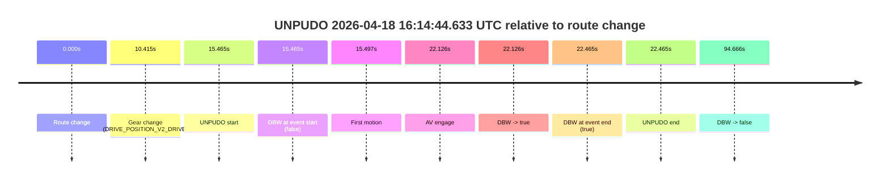
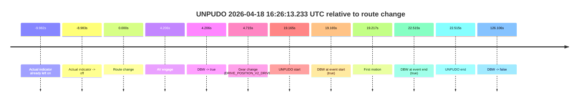
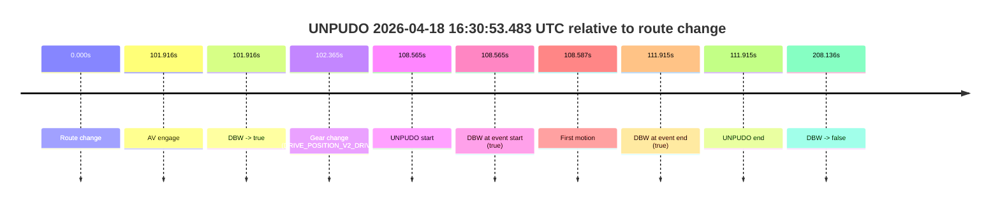
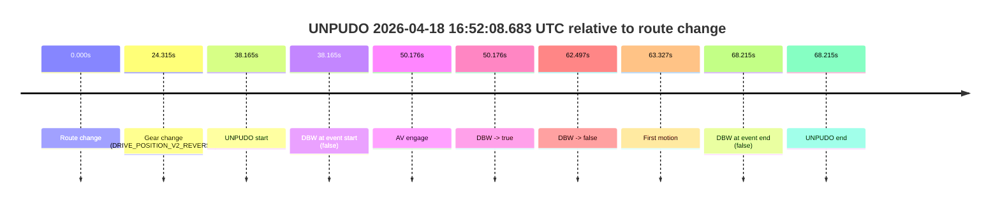
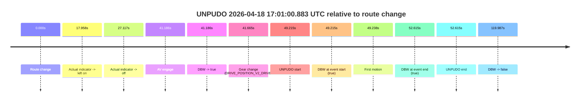

# Run Report: fme10003/2026-04-18--15-31-29--gen2-av-0a9602f5-09da-4760-a83f-84ac5081d7d9

| Field | Value |
|---|---|
| Run ID | `fme10003/2026-04-18--15-31-29--gen2-av-0a9602f5-09da-4760-a83f-84ac5081d7d9` |
| Date | `2026-04-18` |
| Model(s) | `armadillo-amethyst-squeaky` |
| Author | `guy.geva` |
| Event count | `6` |

## unpudo 2026-04-18 16:14:44.633 UTC

| Field | Value |
|---|---|
| Model | `armadillo-amethyst-squeaky` |
| Author | `guy.geva` |
| Run ID | `fme10003/2026-04-18--15-31-29--gen2-av-0a9602f5-09da-4760-a83f-84ac5081d7d9` |
| Date | `2026-04-18` |
| Time (UTC) | `16:14:44.633` |
| Event type | `unpudo` |
| Disengagement type | `failed_to_unpudo` |
| Route change | `found` |
| Console | [run](https://console.sso.wayve.ai/run/fme10003/2026-04-18--15-31-29--gen2-av-0a9602f5-09da-4760-a83f-84ac5081d7d9?id=&time-unixus=1776528884633295) |
| Foxglove | [segment](https://app.foxglove.dev/wayve-on-prem/p/prj_0dX18KZdVHg1fmmI/view?ds=foxglove-stream&ds.deviceName=fme10003&ds.start=2026-04-18T16%3A14%3A19.168269Z&ds.end=2026-04-18T16%3A16%3A13.834465Z&layoutId=lay_0e7VD4WIKDQGU73Y&time=2026-04-18T16%3A14%3A44.633295Z) |

### Event card: accidental

- Accidental: AV ownership is present for less than `2s`, so this is treated as an accidental brush with the maneuver rather than a meaningful model attempt.

| Event | Time (UTC) | Delta from route change |
|---|---:|---:|
| Route change | 2026-04-18 16:14:29.168 | `0.000s` |
| Gear change (DRIVE_POSITION_V2_DRIVE) | 2026-04-18 16:14:39.583 | `10.415s` |
| UNPUDO start | 2026-04-18 16:14:44.633 | `15.465s` |
| DBW at event start (false) | 2026-04-18 16:14:44.633 | `15.465s` |
| First motion | 2026-04-18 16:14:44.665 | `15.497s` |
| AV engage | 2026-04-18 16:14:51.294 | `22.126s` |
| DBW -> true | 2026-04-18 16:14:51.294 | `22.126s` |
| DBW at event end (true) | 2026-04-18 16:14:51.633 | `22.465s` |
| UNPUDO end | 2026-04-18 16:14:51.633 | `22.465s` |
| DBW -> false | 2026-04-18 16:16:03.834 | `94.666s` |

| Metric | Value |
|---|---|
| Outcome | `accidental` |
| Effective failure type | `none` |
| Route change status | `found` |
| DBW at event start | `false` |
| DBW at event end | `true` |
| Predicted gear at AV start | `DRIVE_POSITION_V2_DRIVE` |
| Actual gear at AV start | `DRIVE_POSITION_V2_DRIVE` |
| Predicted gear at event start | `DRIVE_POSITION_V2_DRIVE` |
| Actual gear at event start | `DRIVE_POSITION_V2_DRIVE` |
| Planned indicator direction | `INDICATORS_STATE_V2_OFF` |
| Controller indicator direction | `INDICATORS_STATE_V2_OFF` |
| Actual indicator direction | `INDICATORS_STATE_V2_OFF` |
| Actual indicator at maneuver end | `INDICATORS_STATE_V2_OFF` |
| Driver accel help in AV | `false` |
| Driver accel help timestamp | `n/a` |
| Max accel pedal pct in AV | `0.0%` |
| Max brake pedal pct in AV | `0.0%` |
| Max speed mps in AV | `2.239` |
| Success timing baseline | `route change` |
| Route -> AV | `22.126s` |
| AV -> event start | `-6.661s` |
| AV -> first motion | `-6.629s` |
| Success baseline -> event start | `15.465s` |
| Success baseline -> first motion | `15.497s` |
| AV duration before disengagement | `72.540s` |
| Trajectory waypoint count | `36` |
| Driving-plan step count | `11` |

The scored portion starts from the AV-owned window, not from the pre-AV setup. Route-change search in the stopped pre-event segment was `found`, with the baseline therefore set to route change. At the event anchor the model predicts `DRIVE_POSITION_V2_DRIVE` and the actual gear is `DRIVE_POSITION_V2_DRIVE`. The effective model outcome is `accidental` because `the AV-owned portion is shorter than 2s`.

### Resolution

| Field | Value |
|---|---|
| Final outcome | `accidental` |
| Do we agree with this label? | `yes` |
| Source disengagement type | `failed_to_unpudo` |
| Resolved effective failure type | `none` |
| Confidence | `high` |

## unpudo 2026-04-18 16:16:32.183 UTC

| Field | Value |
|---|---|
| Model | `armadillo-amethyst-squeaky` |
| Author | `guy.geva` |
| Run ID | `fme10003/2026-04-18--15-31-29--gen2-av-0a9602f5-09da-4760-a83f-84ac5081d7d9` |
| Date | `2026-04-18` |
| Time (UTC) | `16:16:32.183` |
| Event type | `unpudo` |
| Disengagement type | `none observed` |
| Route change | `found` |
| Console | [run](https://console.sso.wayve.ai/run/fme10003/2026-04-18--15-31-29--gen2-av-0a9602f5-09da-4760-a83f-84ac5081d7d9?id=&time-unixus=1776528992183320) |
| Foxglove | [segment](https://app.foxglove.dev/wayve-on-prem/p/prj_0dX18KZdVHg1fmmI/view?ds=foxglove-stream&ds.deviceName=fme10003&ds.start=2026-04-18T16%3A16%3A04.268376Z&ds.end=2026-04-18T16%3A19%3A12.674319Z&layoutId=lay_0e7VD4WIKDQGU73Y&time=2026-04-18T16%3A16%3A32.183320Z) |

### Event card: pass

- Pass: AV owns the credited unpudo through the official event window, the gear state is aligned at the anchor, and the vehicle moves without driver accelerator help in AV.

| Event | Time (UTC) | Delta from route change |
|---|---:|---:|
| Route change | 2026-04-18 16:16:14.268 | `0.000s` |
| AV engage | 2026-04-18 16:16:18.214 | `3.946s` |
| DBW -> true | 2026-04-18 16:16:18.214 | `3.946s` |
| Gear change (DRIVE_POSITION_V2_DRIVE) | 2026-04-18 16:16:18.583 | `4.315s` |
| UNPUDO start | 2026-04-18 16:16:32.183 | `17.915s` |
| DBW at event start (true) | 2026-04-18 16:16:32.183 | `17.915s` |
| First motion | 2026-04-18 16:16:32.285 | `18.017s` |
| DBW at event end (true) | 2026-04-18 16:16:42.283 | `28.015s` |
| UNPUDO end | 2026-04-18 16:16:42.283 | `28.015s` |
| DBW -> false | 2026-04-18 16:19:02.674 | `168.406s` |

| Metric | Value |
|---|---|
| Outcome | `pass` |
| Effective failure type | `none` |
| Route change status | `found` |
| DBW at event start | `true` |
| DBW at event end | `true` |
| Predicted gear at AV start | `DRIVE_POSITION_V2_DRIVE` |
| Actual gear at AV start | `DRIVE_POSITION_V2_PARK` |
| Predicted gear at event start | `DRIVE_POSITION_V2_DRIVE` |
| Actual gear at event start | `DRIVE_POSITION_V2_DRIVE` |
| Planned indicator direction | `INDICATORS_STATE_V2_OFF` |
| Controller indicator direction | `INDICATORS_STATE_V2_OFF` |
| Actual indicator direction | `INDICATORS_STATE_V2_OFF` |
| Actual indicator at maneuver end | `INDICATORS_STATE_V2_OFF` |
| Driver accel help in AV | `false` |
| Driver accel help timestamp | `n/a` |
| Max accel pedal pct in AV | `0.0%` |
| Max brake pedal pct in AV | `0.0%` |
| Max speed mps in AV | `2.239` |
| Success timing baseline | `route change` |
| Route -> AV | `3.946s` |
| AV -> event start | `13.969s` |
| AV -> first motion | `14.071s` |
| Success baseline -> event start | `17.915s` |
| Success baseline -> first motion | `18.017s` |
| AV duration before disengagement | `164.460s` |
| Trajectory waypoint count | `37` |
| Driving-plan step count | `11` |

The scored portion starts from the AV-owned window, not from the pre-AV setup. Route-change search in the stopped pre-event segment was `found`, with the baseline therefore set to route change. At the event anchor the model predicts `DRIVE_POSITION_V2_DRIVE` and the actual gear is `DRIVE_POSITION_V2_DRIVE`. The effective model outcome is `pass` because `the credited maneuver stays AV-owned through the official event end`.

### Resolution

| Field | Value |
|---|---|
| Final outcome | `pass` |
| Do we agree with this label? | `yes` |
| Source disengagement type | `none observed` |
| Resolved effective failure type | `none` |
| Confidence | `high` |

## unpudo 2026-04-18 16:26:13.233 UTC

| Field | Value |
|---|---|
| Model | `armadillo-amethyst-squeaky` |
| Author | `guy.geva` |
| Run ID | `fme10003/2026-04-18--15-31-29--gen2-av-0a9602f5-09da-4760-a83f-84ac5081d7d9` |
| Date | `2026-04-18` |
| Time (UTC) | `16:26:13.233` |
| Event type | `unpudo` |
| Disengagement type | `none observed` |
| Route change | `found` |
| Console | [run](https://console.sso.wayve.ai/run/fme10003/2026-04-18--15-31-29--gen2-av-0a9602f5-09da-4760-a83f-84ac5081d7d9?id=&time-unixus=1776529573233293) |
| Foxglove | [segment](https://app.foxglove.dev/wayve-on-prem/p/prj_0dX18KZdVHg1fmmI/view?ds=foxglove-stream&ds.deviceName=fme10003&ds.start=2026-04-18T16%3A25%3A44.068283Z&ds.end=2026-04-18T16%3A28%3A10.174363Z&layoutId=lay_0e7VD4WIKDQGU73Y&time=2026-04-18T16%3A26%3A13.233293Z) |

### Event card: pass

- Pass: AV owns the credited unpudo through the official event window, the gear state is aligned at the anchor, and the vehicle moves without driver accelerator help in AV.

| Event | Time (UTC) | Delta from route change |
|---|---:|---:|
| Actual indicator already left on | 2026-04-18 16:25:44.085 | `-9.982s` |
| Actual indicator -> off | 2026-04-18 16:25:45.085 | `-8.983s` |
| Route change | 2026-04-18 16:25:54.068 | `0.000s` |
| AV engage | 2026-04-18 16:25:58.274 | `4.206s` |
| DBW -> true | 2026-04-18 16:25:58.274 | `4.206s` |
| Gear change (DRIVE_POSITION_V2_DRIVE) | 2026-04-18 16:25:58.783 | `4.715s` |
| UNPUDO start | 2026-04-18 16:26:13.233 | `19.165s` |
| DBW at event start (true) | 2026-04-18 16:26:13.233 | `19.165s` |
| First motion | 2026-04-18 16:26:13.285 | `19.217s` |
| DBW at event end (true) | 2026-04-18 16:26:16.583 | `22.515s` |
| UNPUDO end | 2026-04-18 16:26:16.583 | `22.515s` |
| DBW -> false | 2026-04-18 16:28:00.174 | `126.106s` |

| Metric | Value |
|---|---|
| Outcome | `pass` |
| Effective failure type | `none` |
| Route change status | `found` |
| DBW at event start | `true` |
| DBW at event end | `true` |
| Predicted gear at AV start | `DRIVE_POSITION_V2_DRIVE` |
| Actual gear at AV start | `DRIVE_POSITION_V2_PARK` |
| Predicted gear at event start | `DRIVE_POSITION_V2_DRIVE` |
| Actual gear at event start | `DRIVE_POSITION_V2_DRIVE` |
| Planned indicator direction | `INDICATORS_STATE_V2_LEFT_ON` |
| Controller indicator direction | `INDICATORS_STATE_V2_LEFT_ON` |
| Actual indicator direction | `INDICATORS_STATE_V2_OFF` |
| Actual indicator at maneuver end | `INDICATORS_STATE_V2_OFF` |
| Driver accel help in AV | `false` |
| Driver accel help timestamp | `n/a` |
| Max accel pedal pct in AV | `0.0%` |
| Max brake pedal pct in AV | `0.0%` |
| Max speed mps in AV | `5.822` |
| Success timing baseline | `route change` |
| Route -> AV | `4.206s` |
| AV -> event start | `14.959s` |
| AV -> first motion | `15.011s` |
| Success baseline -> event start | `19.165s` |
| Success baseline -> first motion | `19.217s` |
| AV duration before disengagement | `121.900s` |
| Trajectory waypoint count | `38` |
| Driving-plan step count | `11` |

The scored portion starts from the AV-owned window, not from the pre-AV setup. Route-change search in the stopped pre-event segment was `found`, with the baseline therefore set to route change. At the event anchor the model predicts `DRIVE_POSITION_V2_DRIVE` and the actual gear is `DRIVE_POSITION_V2_DRIVE`. The effective model outcome is `pass` because `the credited maneuver stays AV-owned through the official event end`.

### Resolution

| Field | Value |
|---|---|
| Final outcome | `pass` |
| Do we agree with this label? | `yes` |
| Source disengagement type | `none observed` |
| Resolved effective failure type | `none` |
| Confidence | `high` |

## unpudo 2026-04-18 16:30:53.483 UTC

| Field | Value |
|---|---|
| Model | `armadillo-amethyst-squeaky` |
| Author | `guy.geva` |
| Run ID | `fme10003/2026-04-18--15-31-29--gen2-av-0a9602f5-09da-4760-a83f-84ac5081d7d9` |
| Date | `2026-04-18` |
| Time (UTC) | `16:30:53.483` |
| Event type | `unpudo` |
| Disengagement type | `none observed` |
| Route change | `found` |
| Console | [run](https://console.sso.wayve.ai/run/fme10003/2026-04-18--15-31-29--gen2-av-0a9602f5-09da-4760-a83f-84ac5081d7d9?id=&time-unixus=1776529853483314) |
| Foxglove | [segment](https://app.foxglove.dev/wayve-on-prem/p/prj_0dX18KZdVHg1fmmI/view?ds=foxglove-stream&ds.deviceName=fme10003&ds.start=2026-04-18T16%3A28%3A54.918281Z&ds.end=2026-04-18T16%3A32%3A43.054364Z&layoutId=lay_0e7VD4WIKDQGU73Y&time=2026-04-18T16%3A30%3A53.483314Z) |

### Event card: pass

- Pass: AV owns the credited unpudo through the official event window, the gear state is aligned at the anchor, and the vehicle moves without driver accelerator help in AV.

| Event | Time (UTC) | Delta from route change |
|---|---:|---:|
| Route change | 2026-04-18 16:29:04.918 | `0.000s` |
| AV engage | 2026-04-18 16:30:46.834 | `101.916s` |
| DBW -> true | 2026-04-18 16:30:46.834 | `101.916s` |
| Gear change (DRIVE_POSITION_V2_DRIVE) | 2026-04-18 16:30:47.283 | `102.365s` |
| UNPUDO start | 2026-04-18 16:30:53.483 | `108.565s` |
| DBW at event start (true) | 2026-04-18 16:30:53.483 | `108.565s` |
| First motion | 2026-04-18 16:30:53.505 | `108.587s` |
| DBW at event end (true) | 2026-04-18 16:30:56.833 | `111.915s` |
| UNPUDO end | 2026-04-18 16:30:56.833 | `111.915s` |
| DBW -> false | 2026-04-18 16:32:33.054 | `208.136s` |

| Metric | Value |
|---|---|
| Outcome | `pass` |
| Effective failure type | `none` |
| Route change status | `found` |
| DBW at event start | `true` |
| DBW at event end | `true` |
| Predicted gear at AV start | `DRIVE_POSITION_V2_DRIVE` |
| Actual gear at AV start | `DRIVE_POSITION_V2_PARK` |
| Predicted gear at event start | `DRIVE_POSITION_V2_DRIVE` |
| Actual gear at event start | `DRIVE_POSITION_V2_DRIVE` |
| Planned indicator direction | `INDICATORS_STATE_V2_LEFT_ON` |
| Controller indicator direction | `INDICATORS_STATE_V2_LEFT_ON` |
| Actual indicator direction | `INDICATORS_STATE_V2_OFF` |
| Actual indicator at maneuver end | `INDICATORS_STATE_V2_OFF` |
| Driver accel help in AV | `false` |
| Driver accel help timestamp | `n/a` |
| Max accel pedal pct in AV | `0.0%` |
| Max brake pedal pct in AV | `0.0%` |
| Max speed mps in AV | `6.006` |
| Success timing baseline | `route change` |
| Route -> AV | `101.916s` |
| AV -> event start | `6.649s` |
| AV -> first motion | `6.671s` |
| Success baseline -> event start | `108.565s` |
| Success baseline -> first motion | `108.587s` |
| AV duration before disengagement | `106.220s` |
| Trajectory waypoint count | `37` |
| Driving-plan step count | `11` |

The scored portion starts from the AV-owned window, not from the pre-AV setup. Route-change search in the stopped pre-event segment was `found`, with the baseline therefore set to route change. At the event anchor the model predicts `DRIVE_POSITION_V2_DRIVE` and the actual gear is `DRIVE_POSITION_V2_DRIVE`. The effective model outcome is `pass` because `the credited maneuver stays AV-owned through the official event end`.

### Resolution

| Field | Value |
|---|---|
| Final outcome | `pass` |
| Do we agree with this label? | `yes` |
| Source disengagement type | `none observed` |
| Resolved effective failure type | `none` |
| Confidence | `high` |

## unpudo 2026-04-18 16:52:08.683 UTC

| Field | Value |
|---|---|
| Model | `armadillo-amethyst-squeaky` |
| Author | `guy.geva` |
| Run ID | `fme10003/2026-04-18--15-31-29--gen2-av-0a9602f5-09da-4760-a83f-84ac5081d7d9` |
| Date | `2026-04-18` |
| Time (UTC) | `16:52:08.683` |
| Event type | `unpudo` |
| Disengagement type | `failed_to_unpudo` |
| Route change | `found` |
| Console | [run](https://console.sso.wayve.ai/run/fme10003/2026-04-18--15-31-29--gen2-av-0a9602f5-09da-4760-a83f-84ac5081d7d9?id=&time-unixus=1776531128683302) |
| Foxglove | [segment](https://app.foxglove.dev/wayve-on-prem/p/prj_0dX18KZdVHg1fmmI/view?ds=foxglove-stream&ds.deviceName=fme10003&ds.start=2026-04-18T16%3A51%3A20.518330Z&ds.end=2026-04-18T16%3A52%3A48.733313Z&layoutId=lay_0e7VD4WIKDQGU73Y&time=2026-04-18T16%3A52%3A08.683302Z) |

### Event card: fail

- Fail: AV owns part of the segment, but the event still resolves as a model-performance failure under the AV-only scoring rule.

| Event | Time (UTC) | Delta from route change |
|---|---:|---:|
| Route change | 2026-04-18 16:51:30.518 | `0.000s` |
| Gear change (DRIVE_POSITION_V2_REVERSE) | 2026-04-18 16:51:54.833 | `24.315s` |
| UNPUDO start | 2026-04-18 16:52:08.683 | `38.165s` |
| DBW at event start (false) | 2026-04-18 16:52:08.683 | `38.165s` |
| AV engage | 2026-04-18 16:52:20.694 | `50.176s` |
| DBW -> true | 2026-04-18 16:52:20.694 | `50.176s` |
| DBW -> false | 2026-04-18 16:52:33.014 | `62.497s` |
| First motion | 2026-04-18 16:52:33.845 | `63.327s` |
| DBW at event end (false) | 2026-04-18 16:52:38.733 | `68.215s` |
| UNPUDO end | 2026-04-18 16:52:38.733 | `68.215s` |

| Metric | Value |
|---|---|
| Outcome | `fail` |
| Effective failure type | `failed_to_unpudo` |
| Route change status | `found` |
| DBW at event start | `false` |
| DBW at event end | `false` |
| Predicted gear at AV start | `DRIVE_POSITION_V2_DRIVE` |
| Actual gear at AV start | `DRIVE_POSITION_V2_PARK` |
| Predicted gear at event start | `DRIVE_POSITION_V2_REVERSE` |
| Actual gear at event start | `DRIVE_POSITION_V2_REVERSE` |
| Planned indicator direction | `INDICATORS_STATE_V2_OFF` |
| Controller indicator direction | `INDICATORS_STATE_V2_OFF` |
| Actual indicator direction | `INDICATORS_STATE_V2_OFF` |
| Actual indicator at maneuver end | `INDICATORS_STATE_V2_OFF` |
| Driver accel help in AV | `false` |
| Driver accel help timestamp | `n/a` |
| Max accel pedal pct in AV | `0.0%` |
| Max brake pedal pct in AV | `8.0%` |
| Max speed mps in AV | `0.000` |
| Success timing baseline | `route change` |
| Route -> AV | `50.176s` |
| AV -> event start | `-12.011s` |
| AV -> first motion | `13.151s` |
| Success baseline -> event start | `38.165s` |
| Success baseline -> first motion | `63.327s` |
| AV duration before disengagement | `12.321s` |
| Trajectory waypoint count | `37` |
| Driving-plan step count | `11` |

The scored portion starts from the AV-owned window, not from the pre-AV setup. Route-change search in the stopped pre-event segment was `found`, with the baseline therefore set to route change. At the event anchor the model predicts `DRIVE_POSITION_V2_REVERSE` and the actual gear is `DRIVE_POSITION_V2_REVERSE`. The effective model outcome is `fail` because `failed_to_unpudo`.

### Resolution

| Field | Value |
|---|---|
| Final outcome | `fail` |
| Do we agree with this label? | `yes` |
| Source disengagement type | `failed_to_unpudo` |
| Resolved effective failure type | `failed_to_unpudo` |
| Confidence | `high` |

## unpudo 2026-04-18 17:01:00.883 UTC

| Field | Value |
|---|---|
| Model | `armadillo-amethyst-squeaky` |
| Author | `guy.geva` |
| Run ID | `fme10003/2026-04-18--15-31-29--gen2-av-0a9602f5-09da-4760-a83f-84ac5081d7d9` |
| Date | `2026-04-18` |
| Time (UTC) | `17:01:00.883` |
| Event type | `unpudo` |
| Disengagement type | `none observed` |
| Route change | `found` |
| Console | [run](https://console.sso.wayve.ai/run/fme10003/2026-04-18--15-31-29--gen2-av-0a9602f5-09da-4760-a83f-84ac5081d7d9?id=&time-unixus=1776531660883312) |
| Foxglove | [segment](https://app.foxglove.dev/wayve-on-prem/p/prj_0dX18KZdVHg1fmmI/view?ds=foxglove-stream&ds.deviceName=fme10003&ds.start=2026-04-18T17%3A00%3A01.668268Z&ds.end=2026-04-18T17%3A02%3A21.654913Z&layoutId=lay_0e7VD4WIKDQGU73Y&time=2026-04-18T17%3A01%3A00.883312Z) |

### Event card: pass

- Pass: AV owns the credited unpudo through the official event window, the gear state is aligned at the anchor, and the vehicle moves without driver accelerator help in AV.

| Event | Time (UTC) | Delta from route change |
|---|---:|---:|
| Route change | 2026-04-18 17:00:11.668 | `0.000s` |
| Actual indicator -> left on | 2026-04-18 17:00:29.625 | `17.958s` |
| Actual indicator -> off | 2026-04-18 17:00:38.785 | `27.117s` |
| AV engage | 2026-04-18 17:00:52.854 | `41.186s` |
| DBW -> true | 2026-04-18 17:00:52.854 | `41.186s` |
| Gear change (DRIVE_POSITION_V2_DRIVE) | 2026-04-18 17:00:53.333 | `41.665s` |
| UNPUDO start | 2026-04-18 17:01:00.883 | `49.215s` |
| DBW at event start (true) | 2026-04-18 17:01:00.883 | `49.215s` |
| First motion | 2026-04-18 17:01:00.905 | `49.238s` |
| DBW at event end (true) | 2026-04-18 17:01:04.283 | `52.615s` |
| UNPUDO end | 2026-04-18 17:01:04.283 | `52.615s` |
| DBW -> false | 2026-04-18 17:02:11.654 | `119.987s` |

| Metric | Value |
|---|---|
| Outcome | `pass` |
| Effective failure type | `none` |
| Route change status | `found` |
| DBW at event start | `true` |
| DBW at event end | `true` |
| Predicted gear at AV start | `DRIVE_POSITION_V2_DRIVE` |
| Actual gear at AV start | `DRIVE_POSITION_V2_PARK` |
| Predicted gear at event start | `DRIVE_POSITION_V2_DRIVE` |
| Actual gear at event start | `DRIVE_POSITION_V2_DRIVE` |
| Planned indicator direction | `INDICATORS_STATE_V2_LEFT_ON` |
| Controller indicator direction | `INDICATORS_STATE_V2_LEFT_ON` |
| Actual indicator direction | `INDICATORS_STATE_V2_OFF` |
| Actual indicator at maneuver end | `INDICATORS_STATE_V2_OFF` |
| Driver accel help in AV | `false` |
| Driver accel help timestamp | `n/a` |
| Max accel pedal pct in AV | `0.0%` |
| Max brake pedal pct in AV | `0.0%` |
| Max speed mps in AV | `5.172` |
| Success timing baseline | `route change` |
| Route -> AV | `41.186s` |
| AV -> event start | `8.029s` |
| AV -> first motion | `8.051s` |
| Success baseline -> event start | `49.215s` |
| Success baseline -> first motion | `49.238s` |
| AV duration before disengagement | `78.801s` |
| Trajectory waypoint count | `37` |
| Driving-plan step count | `11` |

The scored portion starts from the AV-owned window, not from the pre-AV setup. Route-change search in the stopped pre-event segment was `found`, with the baseline therefore set to route change. At the event anchor the model predicts `DRIVE_POSITION_V2_DRIVE` and the actual gear is `DRIVE_POSITION_V2_DRIVE`. The effective model outcome is `pass` because `the credited maneuver stays AV-owned through the official event end`.

### Resolution

| Field | Value |
|---|---|
| Final outcome | `pass` |
| Do we agree with this label? | `yes` |
| Source disengagement type | `none observed` |
| Resolved effective failure type | `none` |
| Confidence | `high` |
