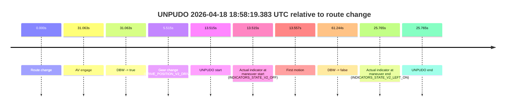
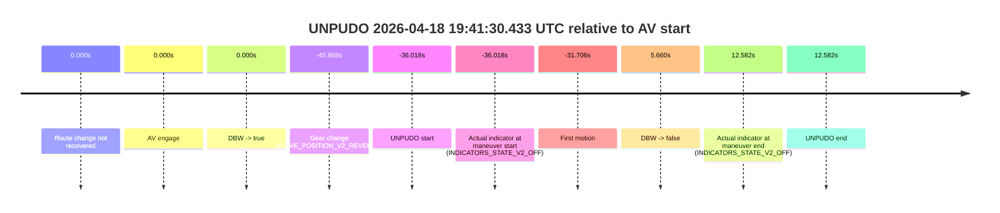

# Run Report: fme10003/2026-04-18--18-29-37--gen2-av-dc225df4-5835-4614-8b61-d23364f6d437

| Field | Value |
|---|---|
| Run ID | `fme10003/2026-04-18--18-29-37--gen2-av-dc225df4-5835-4614-8b61-d23364f6d437` |
| Date | `2026-04-18` |
| Model(s) | `satisfied-amber-moose` |
| Author | `guy.geva` |
| Event count | `14` |

## unpudo 2026-04-18 18:49:04.483 UTC

| Field | Value |
|---|---|
| Model | `satisfied-amber-moose` |
| Author | `guy.geva` |
| Run ID | `fme10003/2026-04-18--18-29-37--gen2-av-dc225df4-5835-4614-8b61-d23364f6d437` |
| Date | `2026-04-18` |
| Time (UTC) | `18:49:04.483` |
| Event type | `unpudo` |
| Disengagement type | `failed_to_unpudo` |
| Route change | `found` |
| Console | [run](https://console.sso.wayve.ai/run/fme10003/2026-04-18--18-29-37--gen2-av-dc225df4-5835-4614-8b61-d23364f6d437?id=&time-unixus=1776538144483308) |
| Foxglove | [segment](https://app.foxglove.dev/wayve-on-prem/p/prj_0dX18KZdVHg1fmmI/view?ds=foxglove-stream&ds.deviceName=fme10003&ds.start=2026-04-18T18%3A48%3A34.518230Z&ds.end=2026-04-18T18%3A49%3A52.751190Z&layoutId=lay_0e7VD4WIKDQGU73Y&time=2026-04-18T18%3A49%3A04.483308Z) |

### Event card: accidental

- Accidental: AV ownership is present for less than `2s`, so this is treated as an accidental brush with the maneuver rather than a meaningful model attempt.

| Event | Time (UTC) | Delta from route change |
|---|---:|---:|
| Route change | 2026-04-18 18:48:44.518 | `0.000s` |
| AV engage | 2026-04-18 18:49:13.650 | `29.133s` |
| DBW -> true | 2026-04-18 18:49:13.650 | `29.133s` |
| Gear change (DRIVE_POSITION_V2_DRIVE) | 2026-04-18 18:48:44.883 | `0.365s` |
| UNPUDO start | 2026-04-18 18:49:04.483 | `19.965s` |
| Actual indicator at maneuver start (INDICATORS_STATE_V2_OFF) | 2026-04-18 18:49:04.483 | `19.965s` |
| First motion | 2026-04-18 18:49:04.526 | `20.008s` |
| DBW -> false | 2026-04-18 18:49:42.751 | `58.233s` |
| Actual indicator at maneuver end (INDICATORS_STATE_V2_OFF) | 2026-04-18 18:49:11.133 | `26.615s` |
| UNPUDO end | 2026-04-18 18:49:11.133 | `26.615s` |

| Metric | Value |
|---|---|
| Outcome | `accidental` |
| Effective failure type | `none` |
| Route change status | `found` |
| DBW at event start | `false` |
| DBW at event end | `false` |
| Predicted gear at AV start | `DRIVE_POSITION_V2_DRIVE` |
| Actual gear at AV start | `DRIVE_POSITION_V2_DRIVE` |
| Predicted gear at event start | `DRIVE_POSITION_V2_DRIVE` |
| Actual gear at event start | `DRIVE_POSITION_V2_DRIVE` |
| Planned indicator direction | `INDICATORS_STATE_V2_LEFT_ON` |
| Controller indicator direction | `INDICATORS_STATE_V2_LEFT_ON` |
| Actual indicator direction | `INDICATORS_STATE_V2_OFF` |
| Actual indicator at maneuver end | `INDICATORS_STATE_V2_OFF` |
| Driver accel help in AV | `false` |
| Driver accel help timestamp | `n/a` |
| Max accel pedal pct in AV | `0.0%` |
| Max brake pedal pct in AV | `0.0%` |
| Max speed mps in AV | `0.000` |
| Route -> AV | `29.133s` |
| AV -> event start | `-9.168s` |
| AV -> first motion | `-9.125s` |
| AV duration before disengagement | `29.100s` |
| Trajectory waypoint count | `37` |
| Driving-plan step count | `11` |

The scored portion starts from the AV-owned window, not from the pre-AV setup. Route-change search in the stopped pre-event segment was `found`, with the baseline therefore set to route change. At the event anchor the model predicts `DRIVE_POSITION_V2_DRIVE` and the actual gear is `DRIVE_POSITION_V2_DRIVE`. The effective model outcome is `accidental` because `the AV-owned portion is shorter than 2s`.

### Resolution

| Field | Value |
|---|---|
| Final outcome | `accidental` |
| Do we agree with this label? | `yes` |
| Source disengagement type | `failed_to_unpudo` |
| Resolved effective failure type | `none` |
| Confidence | `high` |

## unpudo 2026-04-18 18:49:46.533 UTC

| Field | Value |
|---|---|
| Model | `satisfied-amber-moose` |
| Author | `guy.geva` |
| Run ID | `fme10003/2026-04-18--18-29-37--gen2-av-dc225df4-5835-4614-8b61-d23364f6d437` |
| Date | `2026-04-18` |
| Time (UTC) | `18:49:46.533` |
| Event type | `unpudo` |
| Disengagement type | `failed_to_unpudo` |
| Route change | `found` |
| Console | [run](https://console.sso.wayve.ai/run/fme10003/2026-04-18--18-29-37--gen2-av-dc225df4-5835-4614-8b61-d23364f6d437?id=&time-unixus=1776538186533316) |
| Foxglove | [segment](https://app.foxglove.dev/wayve-on-prem/p/prj_0dX18KZdVHg1fmmI/view?ds=foxglove-stream&ds.deviceName=fme10003&ds.start=2026-04-18T18%3A48%3A34.518230Z&ds.end=2026-04-18T18%3A50%3A15.383295Z&layoutId=lay_0e7VD4WIKDQGU73Y&time=2026-04-18T18%3A49%3A46.533316Z) |

### Event card: non-av

- Non-AV: the detected unpudo starts outside AV ownership, so it is kept for coverage but excluded from model success / failure scoring.

| Event | Time (UTC) | Delta from route change |
|---|---:|---:|
| Route change | 2026-04-18 18:48:44.518 | `0.000s` |
| AV engage | 2026-04-18 18:49:55.012 | `70.494s` |
| DBW -> true | 2026-04-18 18:49:55.012 | `70.494s` |
| Gear change (DRIVE_POSITION_V2_REVERSE) | 2026-04-18 18:49:37.783 | `53.265s` |
| UNPUDO start | 2026-04-18 18:49:46.533 | `62.015s` |
| Actual indicator at maneuver start (INDICATORS_STATE_V2_OFF) | 2026-04-18 18:49:46.533 | `62.015s` |
| First motion | 2026-04-18 18:50:01.165 | `76.647s` |
| DBW -> false | 2026-04-18 18:50:00.511 | `75.993s` |
| Actual indicator at maneuver end (INDICATORS_STATE_V2_OFF) | 2026-04-18 18:50:05.383 | `80.865s` |
| UNPUDO end | 2026-04-18 18:50:05.383 | `80.865s` |

| Metric | Value |
|---|---|
| Outcome | `non-av` |
| Effective failure type | `none` |
| Route change status | `found` |
| DBW at event start | `false` |
| DBW at event end | `false` |
| Predicted gear at AV start | `DRIVE_POSITION_V2_DRIVE` |
| Actual gear at AV start | `DRIVE_POSITION_V2_DRIVE` |
| Predicted gear at event start | `DRIVE_POSITION_V2_REVERSE` |
| Actual gear at event start | `DRIVE_POSITION_V2_REVERSE` |
| Planned indicator direction | `INDICATORS_STATE_V2_LEFT_ON` |
| Controller indicator direction | `INDICATORS_STATE_V2_LEFT_ON` |
| Actual indicator direction | `INDICATORS_STATE_V2_OFF` |
| Actual indicator at maneuver end | `INDICATORS_STATE_V2_OFF` |
| Driver accel help in AV | `false` |
| Driver accel help timestamp | `n/a` |
| Max accel pedal pct in AV | `0.0%` |
| Max brake pedal pct in AV | `8.0%` |
| Max speed mps in AV | `0.000` |
| Route -> AV | `70.494s` |
| AV -> event start | `-8.479s` |
| AV -> first motion | `6.153s` |
| AV duration before disengagement | `5.499s` |
| Trajectory waypoint count | `38` |
| Driving-plan step count | `11` |

The scored portion starts from the AV-owned window, not from the pre-AV setup. Route-change search in the stopped pre-event segment was `found`, with the baseline therefore set to route change. At the event anchor the model predicts `DRIVE_POSITION_V2_REVERSE` and the actual gear is `DRIVE_POSITION_V2_REVERSE`. The effective model outcome is `non-av` because `the event does not begin in AV ownership`.

### Resolution

| Field | Value |
|---|---|
| Final outcome | `non-av` |
| Do we agree with this label? | `yes` |
| Source disengagement type | `failed_to_unpudo` |
| Resolved effective failure type | `none` |
| Confidence | `high` |

## unpudo 2026-04-18 18:58:19.383 UTC

| Field | Value |
|---|---|
| Model | `satisfied-amber-moose` |
| Author | `guy.geva` |
| Run ID | `fme10003/2026-04-18--18-29-37--gen2-av-dc225df4-5835-4614-8b61-d23364f6d437` |
| Date | `2026-04-18` |
| Time (UTC) | `18:58:19.383` |
| Event type | `unpudo` |
| Disengagement type | `failed_to_unpudo` |
| Route change | `found` |
| Console | [run](https://console.sso.wayve.ai/run/fme10003/2026-04-18--18-29-37--gen2-av-dc225df4-5835-4614-8b61-d23364f6d437?id=&time-unixus=1776538699383315) |
| Foxglove | [segment](https://app.foxglove.dev/wayve-on-prem/p/prj_0dX18KZdVHg1fmmI/view?ds=foxglove-stream&ds.deviceName=fme10003&ds.start=2026-04-18T18%3A57%3A55.868247Z&ds.end=2026-04-18T18%3A59%3A17.112244Z&layoutId=lay_0e7VD4WIKDQGU73Y&time=2026-04-18T18%3A58%3A19.383315Z) |

### Event card: accidental

- Accidental: AV ownership is present for less than `2s`, so this is treated as an accidental brush with the maneuver rather than a meaningful model attempt.

| Event | Time (UTC) | Delta from route change |
|---|---:|---:|
| Route change | 2026-04-18 18:58:05.868 | `0.000s` |
| AV engage | 2026-04-18 18:58:36.931 | `31.063s` |
| DBW -> true | 2026-04-18 18:58:36.931 | `31.063s` |
| Gear change (DRIVE_POSITION_V2_DRIVE) | 2026-04-18 18:58:11.383 | `5.515s` |
| UNPUDO start | 2026-04-18 18:58:19.383 | `13.515s` |
| Actual indicator at maneuver start (INDICATORS_STATE_V2_OFF) | 2026-04-18 18:58:19.383 | `13.515s` |
| First motion | 2026-04-18 18:58:19.425 | `13.557s` |
| DBW -> false | 2026-04-18 18:59:07.112 | `61.244s` |
| Actual indicator at maneuver end (INDICATORS_STATE_V2_LEFT_ON) | 2026-04-18 18:58:31.633 | `25.765s` |
| UNPUDO end | 2026-04-18 18:58:31.633 | `25.765s` |

| Metric | Value |
|---|---|
| Outcome | `accidental` |
| Effective failure type | `none` |
| Route change status | `found` |
| DBW at event start | `false` |
| DBW at event end | `false` |
| Predicted gear at AV start | `DRIVE_POSITION_V2_DRIVE` |
| Actual gear at AV start | `DRIVE_POSITION_V2_DRIVE` |
| Predicted gear at event start | `DRIVE_POSITION_V2_DRIVE` |
| Actual gear at event start | `DRIVE_POSITION_V2_DRIVE` |
| Planned indicator direction | `INDICATORS_STATE_V2_RIGHT_ON` |
| Controller indicator direction | `INDICATORS_STATE_V2_RIGHT_ON` |
| Actual indicator direction | `INDICATORS_STATE_V2_OFF` |
| Actual indicator at maneuver end | `INDICATORS_STATE_V2_LEFT_ON` |
| Driver accel help in AV | `false` |
| Driver accel help timestamp | `n/a` |
| Max accel pedal pct in AV | `0.0%` |
| Max brake pedal pct in AV | `0.0%` |
| Max speed mps in AV | `0.000` |
| Route -> AV | `31.063s` |
| AV -> event start | `-17.548s` |
| AV -> first motion | `-17.505s` |
| AV duration before disengagement | `30.181s` |
| Trajectory waypoint count | `37` |
| Driving-plan step count | `11` |

The scored portion starts from the AV-owned window, not from the pre-AV setup. Route-change search in the stopped pre-event segment was `found`, with the baseline therefore set to route change. At the event anchor the model predicts `DRIVE_POSITION_V2_DRIVE` and the actual gear is `DRIVE_POSITION_V2_DRIVE`. The effective model outcome is `accidental` because `the AV-owned portion is shorter than 2s`.

### Resolution

| Field | Value |
|---|---|
| Final outcome | `accidental` |
| Do we agree with this label? | `yes` |
| Source disengagement type | `failed_to_unpudo` |
| Resolved effective failure type | `none` |
| Confidence | `high` |

## unpudo 2026-04-18 18:59:50.183 UTC

| Field | Value |
|---|---|
| Model | `satisfied-amber-moose` |
| Author | `guy.geva` |
| Run ID | `fme10003/2026-04-18--18-29-37--gen2-av-dc225df4-5835-4614-8b61-d23364f6d437` |
| Date | `2026-04-18` |
| Time (UTC) | `18:59:50.183` |
| Event type | `unpudo` |
| Disengagement type | `failed_to_unpudo` |
| Route change | `found` |
| Console | [run](https://console.sso.wayve.ai/run/fme10003/2026-04-18--18-29-37--gen2-av-dc225df4-5835-4614-8b61-d23364f6d437?id=&time-unixus=1776538790183293) |
| Foxglove | [segment](https://app.foxglove.dev/wayve-on-prem/p/prj_0dX18KZdVHg1fmmI/view?ds=foxglove-stream&ds.deviceName=fme10003&ds.start=2026-04-18T18%3A57%3A55.868247Z&ds.end=2026-04-18T19%3A03%3A02.051025Z&layoutId=lay_0e7VD4WIKDQGU73Y&time=2026-04-18T18%3A59%3A50.183293Z) |

### Event card: accidental

- Accidental: AV ownership is present for less than `2s`, so this is treated as an accidental brush with the maneuver rather than a meaningful model attempt.

| Event | Time (UTC) | Delta from route change |
|---|---:|---:|
| Route change | 2026-04-18 18:58:05.868 | `0.000s` |
| AV engage | 2026-04-18 19:00:33.830 | `147.963s` |
| DBW -> true | 2026-04-18 19:00:33.830 | `147.963s` |
| Gear change (DRIVE_POSITION_V2_REVERSE) | 2026-04-18 18:59:40.633 | `94.765s` |
| UNPUDO start | 2026-04-18 18:59:50.183 | `104.315s` |
| Actual indicator at maneuver start (INDICATORS_STATE_V2_OFF) | 2026-04-18 18:59:50.183 | `104.315s` |
| First motion | 2026-04-18 19:00:07.365 | `121.497s` |
| DBW -> false | 2026-04-18 19:02:52.051 | `286.183s` |
| Actual indicator at maneuver end (INDICATORS_STATE_V2_LEFT_ON) | 2026-04-18 19:00:27.633 | `141.765s` |
| UNPUDO end | 2026-04-18 19:00:27.633 | `141.765s` |

| Metric | Value |
|---|---|
| Outcome | `accidental` |
| Effective failure type | `none` |
| Route change status | `found` |
| DBW at event start | `false` |
| DBW at event end | `false` |
| Predicted gear at AV start | `DRIVE_POSITION_V2_DRIVE` |
| Actual gear at AV start | `DRIVE_POSITION_V2_DRIVE` |
| Predicted gear at event start | `DRIVE_POSITION_V2_REVERSE` |
| Actual gear at event start | `DRIVE_POSITION_V2_REVERSE` |
| Planned indicator direction | `INDICATORS_STATE_V2_OFF` |
| Controller indicator direction | `INDICATORS_STATE_V2_OFF` |
| Actual indicator direction | `INDICATORS_STATE_V2_OFF` |
| Actual indicator at maneuver end | `INDICATORS_STATE_V2_LEFT_ON` |
| Driver accel help in AV | `false` |
| Driver accel help timestamp | `n/a` |
| Max accel pedal pct in AV | `0.0%` |
| Max brake pedal pct in AV | `0.0%` |
| Max speed mps in AV | `0.000` |
| Route -> AV | `147.963s` |
| AV -> event start | `-43.648s` |
| AV -> first motion | `-26.465s` |
| AV duration before disengagement | `138.220s` |
| Trajectory waypoint count | `37` |
| Driving-plan step count | `11` |

The scored portion starts from the AV-owned window, not from the pre-AV setup. Route-change search in the stopped pre-event segment was `found`, with the baseline therefore set to route change. At the event anchor the model predicts `DRIVE_POSITION_V2_REVERSE` and the actual gear is `DRIVE_POSITION_V2_REVERSE`. The effective model outcome is `accidental` because `the AV-owned portion is shorter than 2s`.

### Resolution

| Field | Value |
|---|---|
| Final outcome | `accidental` |
| Do we agree with this label? | `yes` |
| Source disengagement type | `failed_to_unpudo` |
| Resolved effective failure type | `none` |
| Confidence | `high` |

## unpudo 2026-04-18 19:09:45.383 UTC

| Field | Value |
|---|---|
| Model | `satisfied-amber-moose` |
| Author | `guy.geva` |
| Run ID | `fme10003/2026-04-18--18-29-37--gen2-av-dc225df4-5835-4614-8b61-d23364f6d437` |
| Date | `2026-04-18` |
| Time (UTC) | `19:09:45.383` |
| Event type | `unpudo` |
| Disengagement type | `failed_to_unpudo` |
| Route change | `found` |
| Console | [run](https://console.sso.wayve.ai/run/fme10003/2026-04-18--18-29-37--gen2-av-dc225df4-5835-4614-8b61-d23364f6d437?id=&time-unixus=1776539385383313) |
| Foxglove | [segment](https://app.foxglove.dev/wayve-on-prem/p/prj_0dX18KZdVHg1fmmI/view?ds=foxglove-stream&ds.deviceName=fme10003&ds.start=2026-04-18T19%3A09%3A06.483313Z&ds.end=2026-04-18T19%3A13%3A31.891403Z&layoutId=lay_0e7VD4WIKDQGU73Y&time=2026-04-18T19%3A09%3A45.383313Z) |

### Event card: accidental

- Accidental: AV ownership is present for less than `2s`, so this is treated as an accidental brush with the maneuver rather than a meaningful model attempt.

| Event | Time (UTC) | Delta from route change |
|---|---:|---:|
| Route change | 2026-04-18 19:09:18.818 | `0.000s` |
| AV engage | 2026-04-18 19:09:52.530 | `33.713s` |
| DBW -> true | 2026-04-18 19:09:52.530 | `33.713s` |
| Gear change (DRIVE_POSITION_V2_DRIVE) | 2026-04-18 19:09:16.483 | `-2.335s` |
| UNPUDO start | 2026-04-18 19:09:45.383 | `26.565s` |
| Actual indicator at maneuver start (INDICATORS_STATE_V2_OFF) | 2026-04-18 19:09:45.383 | `26.565s` |
| First motion | 2026-04-18 19:09:45.465 | `26.647s` |
| DBW -> false | 2026-04-18 19:13:21.891 | `243.073s` |
| Actual indicator at maneuver end (INDICATORS_STATE_V2_OFF) | 2026-04-18 19:09:50.433 | `31.615s` |
| UNPUDO end | 2026-04-18 19:09:50.433 | `31.615s` |

| Metric | Value |
|---|---|
| Outcome | `accidental` |
| Effective failure type | `none` |
| Route change status | `found` |
| DBW at event start | `false` |
| DBW at event end | `false` |
| Predicted gear at AV start | `DRIVE_POSITION_V2_DRIVE` |
| Actual gear at AV start | `DRIVE_POSITION_V2_DRIVE` |
| Predicted gear at event start | `DRIVE_POSITION_V2_DRIVE` |
| Actual gear at event start | `DRIVE_POSITION_V2_DRIVE` |
| Planned indicator direction | `INDICATORS_STATE_V2_OFF` |
| Controller indicator direction | `INDICATORS_STATE_V2_OFF` |
| Actual indicator direction | `INDICATORS_STATE_V2_OFF` |
| Actual indicator at maneuver end | `INDICATORS_STATE_V2_OFF` |
| Driver accel help in AV | `false` |
| Driver accel help timestamp | `n/a` |
| Max accel pedal pct in AV | `0.0%` |
| Max brake pedal pct in AV | `0.0%` |
| Max speed mps in AV | `0.000` |
| Route -> AV | `33.713s` |
| AV -> event start | `-7.148s` |
| AV -> first motion | `-7.065s` |
| AV duration before disengagement | `209.360s` |
| Trajectory waypoint count | `37` |
| Driving-plan step count | `11` |

The scored portion starts from the AV-owned window, not from the pre-AV setup. Route-change search in the stopped pre-event segment was `found`, with the baseline therefore set to route change. At the event anchor the model predicts `DRIVE_POSITION_V2_DRIVE` and the actual gear is `DRIVE_POSITION_V2_DRIVE`. The effective model outcome is `accidental` because `the AV-owned portion is shorter than 2s`.

### Resolution

| Field | Value |
|---|---|
| Final outcome | `accidental` |
| Do we agree with this label? | `yes` |
| Source disengagement type | `failed_to_unpudo` |
| Resolved effective failure type | `none` |
| Confidence | `high` |

## unpudo 2026-04-18 19:14:02.083 UTC

| Field | Value |
|---|---|
| Model | `satisfied-amber-moose` |
| Author | `guy.geva` |
| Run ID | `fme10003/2026-04-18--18-29-37--gen2-av-dc225df4-5835-4614-8b61-d23364f6d437` |
| Date | `2026-04-18` |
| Time (UTC) | `19:14:02.083` |
| Event type | `unpudo` |
| Disengagement type | `uncategorised` |
| Route change | `found` |
| Console | [run](https://console.sso.wayve.ai/run/fme10003/2026-04-18--18-29-37--gen2-av-dc225df4-5835-4614-8b61-d23364f6d437?id=&time-unixus=1776539642083310) |
| Foxglove | [segment](https://app.foxglove.dev/wayve-on-prem/p/prj_0dX18KZdVHg1fmmI/view?ds=foxglove-stream&ds.deviceName=fme10003&ds.start=2026-04-18T19%3A13%3A07.768239Z&ds.end=2026-04-18T19%3A21%3A25.191158Z&layoutId=lay_0e7VD4WIKDQGU73Y&time=2026-04-18T19%3A14%3A02.083310Z) |

### Event card: accidental

- Accidental: AV ownership is present for less than `2s`, so this is treated as an accidental brush with the maneuver rather than a meaningful model attempt.

| Event | Time (UTC) | Delta from route change |
|---|---:|---:|
| Route change | 2026-04-18 19:13:17.768 | `0.000s` |
| AV engage | 2026-04-18 19:14:21.731 | `63.963s` |
| DBW -> true | 2026-04-18 19:14:21.731 | `63.963s` |
| Gear change (DRIVE_POSITION_V2_DRIVE) | 2026-04-18 19:13:41.583 | `23.815s` |
| UNPUDO start | 2026-04-18 19:14:02.083 | `44.315s` |
| Actual indicator at maneuver start (INDICATORS_STATE_V2_OFF) | 2026-04-18 19:14:02.083 | `44.315s` |
| First motion | 2026-04-18 19:14:05.685 | `47.917s` |
| DBW -> false | 2026-04-18 19:21:15.191 | `477.423s` |
| Actual indicator at maneuver end (INDICATORS_STATE_V2_OFF) | 2026-04-18 19:14:02.083 | `44.315s` |
| UNPUDO end | 2026-04-18 19:14:02.083 | `44.315s` |

| Metric | Value |
|---|---|
| Outcome | `accidental` |
| Effective failure type | `none` |
| Route change status | `found` |
| DBW at event start | `false` |
| DBW at event end | `false` |
| Predicted gear at AV start | `DRIVE_POSITION_V2_DRIVE` |
| Actual gear at AV start | `DRIVE_POSITION_V2_DRIVE` |
| Predicted gear at event start | `DRIVE_POSITION_V2_DRIVE` |
| Actual gear at event start | `DRIVE_POSITION_V2_DRIVE` |
| Planned indicator direction | `INDICATORS_STATE_V2_OFF` |
| Controller indicator direction | `INDICATORS_STATE_V2_OFF` |
| Actual indicator direction | `INDICATORS_STATE_V2_OFF` |
| Actual indicator at maneuver end | `INDICATORS_STATE_V2_OFF` |
| Driver accel help in AV | `false` |
| Driver accel help timestamp | `n/a` |
| Max accel pedal pct in AV | `0.0%` |
| Max brake pedal pct in AV | `0.0%` |
| Max speed mps in AV | `0.000` |
| Route -> AV | `63.963s` |
| AV -> event start | `-19.648s` |
| AV -> first motion | `-16.046s` |
| AV duration before disengagement | `413.460s` |
| Trajectory waypoint count | `37` |
| Driving-plan step count | `11` |

The scored portion starts from the AV-owned window, not from the pre-AV setup. Route-change search in the stopped pre-event segment was `found`, with the baseline therefore set to route change. At the event anchor the model predicts `DRIVE_POSITION_V2_DRIVE` and the actual gear is `DRIVE_POSITION_V2_DRIVE`. The effective model outcome is `accidental` because `the AV-owned portion is shorter than 2s`.

### Resolution

| Field | Value |
|---|---|
| Final outcome | `accidental` |
| Do we agree with this label? | `yes` |
| Source disengagement type | `uncategorised` |
| Resolved effective failure type | `none` |
| Confidence | `high` |

## unpudo 2026-04-18 19:14:47.233 UTC

| Field | Value |
|---|---|
| Model | `satisfied-amber-moose` |
| Author | `guy.geva` |
| Run ID | `fme10003/2026-04-18--18-29-37--gen2-av-dc225df4-5835-4614-8b61-d23364f6d437` |
| Date | `2026-04-18` |
| Time (UTC) | `19:14:47.233` |
| Event type | `unpudo` |
| Disengagement type | `none observed` |
| Route change | `found` |
| Console | [run](https://console.sso.wayve.ai/run/fme10003/2026-04-18--18-29-37--gen2-av-dc225df4-5835-4614-8b61-d23364f6d437?id=&time-unixus=1776539687233298) |
| Foxglove | [segment](https://app.foxglove.dev/wayve-on-prem/p/prj_0dX18KZdVHg1fmmI/view?ds=foxglove-stream&ds.deviceName=fme10003&ds.start=2026-04-18T19%3A13%3A07.768239Z&ds.end=2026-04-18T19%3A21%3A25.191158Z&layoutId=lay_0e7VD4WIKDQGU73Y&time=2026-04-18T19%3A14%3A47.233298Z) |

### Event card: pass

- Pass: AV owns the credited unpudo through the official event window, the gear state is aligned at the anchor, and the vehicle moves without driver accelerator help in AV.

| Event | Time (UTC) | Delta from route change |
|---|---:|---:|
| Route change | 2026-04-18 19:13:17.768 | `0.000s` |
| AV engage | 2026-04-18 19:14:21.731 | `63.963s` |
| DBW -> true | 2026-04-18 19:14:21.731 | `63.963s` |
| Gear change (DRIVE_POSITION_V2_DRIVE) | 2026-04-18 19:14:35.483 | `77.715s` |
| UNPUDO start | 2026-04-18 19:14:47.233 | `89.465s` |
| Actual indicator at maneuver start (INDICATORS_STATE_V2_OFF) | 2026-04-18 19:14:47.233 | `89.465s` |
| First motion | 2026-04-18 19:14:47.285 | `89.518s` |
| DBW -> false | 2026-04-18 19:21:15.191 | `477.423s` |
| Actual indicator at maneuver end (INDICATORS_STATE_V2_OFF) | 2026-04-18 19:14:52.033 | `94.265s` |
| UNPUDO end | 2026-04-18 19:14:52.033 | `94.265s` |

| Metric | Value |
|---|---|
| Outcome | `pass` |
| Effective failure type | `none` |
| Route change status | `found` |
| DBW at event start | `true` |
| DBW at event end | `true` |
| Predicted gear at AV start | `DRIVE_POSITION_V2_DRIVE` |
| Actual gear at AV start | `DRIVE_POSITION_V2_DRIVE` |
| Predicted gear at event start | `DRIVE_POSITION_V2_DRIVE` |
| Actual gear at event start | `DRIVE_POSITION_V2_DRIVE` |
| Planned indicator direction | `INDICATORS_STATE_V2_RIGHT_ON` |
| Controller indicator direction | `INDICATORS_STATE_V2_RIGHT_ON` |
| Actual indicator direction | `INDICATORS_STATE_V2_OFF` |
| Actual indicator at maneuver end | `INDICATORS_STATE_V2_OFF` |
| Driver accel help in AV | `false` |
| Driver accel help timestamp | `n/a` |
| Max accel pedal pct in AV | `0.0%` |
| Max brake pedal pct in AV | `10.3%` |
| Max speed mps in AV | `4.314` |
| Route -> AV | `63.963s` |
| AV -> event start | `25.502s` |
| AV -> first motion | `25.554s` |
| AV duration before disengagement | `413.460s` |
| Trajectory waypoint count | `36` |
| Driving-plan step count | `11` |

The scored portion starts from the AV-owned window, not from the pre-AV setup. Route-change search in the stopped pre-event segment was `found`, with the baseline therefore set to route change. At the event anchor the model predicts `DRIVE_POSITION_V2_DRIVE` and the actual gear is `DRIVE_POSITION_V2_DRIVE`. The effective model outcome is `pass` because `the credited maneuver stays AV-owned through the official event end`.

### Resolution

| Field | Value |
|---|---|
| Final outcome | `pass` |
| Do we agree with this label? | `yes` |
| Source disengagement type | `none observed` |
| Resolved effective failure type | `none` |
| Confidence | `high` |

## unpudo 2026-04-18 19:21:18.933 UTC

| Field | Value |
|---|---|
| Model | `satisfied-amber-moose` |
| Author | `guy.geva` |
| Run ID | `fme10003/2026-04-18--18-29-37--gen2-av-dc225df4-5835-4614-8b61-d23364f6d437` |
| Date | `2026-04-18` |
| Time (UTC) | `19:21:18.933` |
| Event type | `unpudo` |
| Disengagement type | `uncategorised` |
| Route change | `found` |
| Console | [run](https://console.sso.wayve.ai/run/fme10003/2026-04-18--18-29-37--gen2-av-dc225df4-5835-4614-8b61-d23364f6d437?id=&time-unixus=1776540078933311) |
| Foxglove | [segment](https://app.foxglove.dev/wayve-on-prem/p/prj_0dX18KZdVHg1fmmI/view?ds=foxglove-stream&ds.deviceName=fme10003&ds.start=2026-04-18T19%3A20%3A55.518353Z&ds.end=2026-04-18T19%3A22%3A02.033291Z&layoutId=lay_0e7VD4WIKDQGU73Y&time=2026-04-18T19%3A21%3A18.933311Z) |

### Event card: non-av

- Non-AV: the detected unpudo starts outside AV ownership, so it is kept for coverage but excluded from model success / failure scoring.

| Event | Time (UTC) | Delta from route change |
|---|---:|---:|
| Route change | 2026-04-18 19:21:05.518 | `0.000s` |
| AV engage | 2026-04-18 19:21:29.631 | `24.113s` |
| DBW -> true | 2026-04-18 19:21:29.631 | `24.113s` |
| Gear change (DRIVE_POSITION_V2_REVERSE) | 2026-04-18 19:21:05.783 | `0.265s` |
| UNPUDO start | 2026-04-18 19:21:18.933 | `13.415s` |
| Actual indicator at maneuver start (INDICATORS_STATE_V2_OFF) | 2026-04-18 19:21:18.933 | `13.415s` |
| First motion | 2026-04-18 19:21:46.026 | `40.508s` |
| DBW -> false | 2026-04-18 19:21:38.751 | `33.233s` |
| Actual indicator at maneuver end (INDICATORS_STATE_V2_OFF) | 2026-04-18 19:21:52.033 | `46.515s` |
| UNPUDO end | 2026-04-18 19:21:52.033 | `46.515s` |

| Metric | Value |
|---|---|
| Outcome | `non-av` |
| Effective failure type | `none` |
| Route change status | `found` |
| DBW at event start | `false` |
| DBW at event end | `true` |
| Predicted gear at AV start | `DRIVE_POSITION_V2_REVERSE` |
| Actual gear at AV start | `DRIVE_POSITION_V2_PARK` |
| Predicted gear at event start | `DRIVE_POSITION_V2_REVERSE` |
| Actual gear at event start | `DRIVE_POSITION_V2_REVERSE` |
| Planned indicator direction | `INDICATORS_STATE_V2_OFF` |
| Controller indicator direction | `INDICATORS_STATE_V2_OFF` |
| Actual indicator direction | `INDICATORS_STATE_V2_OFF` |
| Actual indicator at maneuver end | `INDICATORS_STATE_V2_OFF` |
| Driver accel help in AV | `false` |
| Driver accel help timestamp | `n/a` |
| Max accel pedal pct in AV | `0.0%` |
| Max brake pedal pct in AV | `8.0%` |
| Max speed mps in AV | `0.000` |
| Route -> AV | `24.113s` |
| AV -> event start | `-10.698s` |
| AV -> first motion | `16.395s` |
| AV duration before disengagement | `9.120s` |
| Trajectory waypoint count | `36` |
| Driving-plan step count | `11` |

The scored portion starts from the AV-owned window, not from the pre-AV setup. Route-change search in the stopped pre-event segment was `found`, with the baseline therefore set to route change. At the event anchor the model predicts `DRIVE_POSITION_V2_REVERSE` and the actual gear is `DRIVE_POSITION_V2_REVERSE`. The effective model outcome is `non-av` because `the event does not begin in AV ownership`.

### Resolution

| Field | Value |
|---|---|
| Final outcome | `non-av` |
| Do we agree with this label? | `yes` |
| Source disengagement type | `uncategorised` |
| Resolved effective failure type | `none` |
| Confidence | `high` |

## unpudo 2026-04-18 19:25:04.533 UTC

| Field | Value |
|---|---|
| Model | `satisfied-amber-moose` |
| Author | `guy.geva` |
| Run ID | `fme10003/2026-04-18--18-29-37--gen2-av-dc225df4-5835-4614-8b61-d23364f6d437` |
| Date | `2026-04-18` |
| Time (UTC) | `19:25:04.533` |
| Event type | `unpudo` |
| Disengagement type | `failed_to_unpudo` |
| Route change | `found` |
| Console | [run](https://console.sso.wayve.ai/run/fme10003/2026-04-18--18-29-37--gen2-av-dc225df4-5835-4614-8b61-d23364f6d437?id=&time-unixus=1776540304533296) |
| Foxglove | [segment](https://app.foxglove.dev/wayve-on-prem/p/prj_0dX18KZdVHg1fmmI/view?ds=foxglove-stream&ds.deviceName=fme10003&ds.start=2026-04-18T19%3A24%3A40.118260Z&ds.end=2026-04-18T19%3A26%3A02.411497Z&layoutId=lay_0e7VD4WIKDQGU73Y&time=2026-04-18T19%3A25%3A04.533296Z) |

### Event card: accidental

- Accidental: AV ownership is present for less than `2s`, so this is treated as an accidental brush with the maneuver rather than a meaningful model attempt.

| Event | Time (UTC) | Delta from route change |
|---|---:|---:|
| Route change | 2026-04-18 19:24:50.118 | `0.000s` |
| AV engage | 2026-04-18 19:25:11.092 | `20.974s` |
| DBW -> true | 2026-04-18 19:25:11.092 | `20.974s` |
| Gear change (DRIVE_POSITION_V2_DRIVE) | 2026-04-18 19:24:50.433 | `0.315s` |
| UNPUDO start | 2026-04-18 19:25:04.533 | `14.415s` |
| Actual indicator at maneuver start (INDICATORS_STATE_V2_OFF) | 2026-04-18 19:25:04.533 | `14.415s` |
| First motion | 2026-04-18 19:25:04.585 | `14.468s` |
| DBW -> false | 2026-04-18 19:25:52.411 | `62.293s` |
| Actual indicator at maneuver end (INDICATORS_STATE_V2_OFF) | 2026-04-18 19:25:11.633 | `21.515s` |
| UNPUDO end | 2026-04-18 19:25:11.633 | `21.515s` |

| Metric | Value |
|---|---|
| Outcome | `accidental` |
| Effective failure type | `none` |
| Route change status | `found` |
| DBW at event start | `false` |
| DBW at event end | `true` |
| Predicted gear at AV start | `DRIVE_POSITION_V2_DRIVE` |
| Actual gear at AV start | `DRIVE_POSITION_V2_DRIVE` |
| Predicted gear at event start | `DRIVE_POSITION_V2_DRIVE` |
| Actual gear at event start | `DRIVE_POSITION_V2_DRIVE` |
| Planned indicator direction | `INDICATORS_STATE_V2_OFF` |
| Controller indicator direction | `INDICATORS_STATE_V2_OFF` |
| Actual indicator direction | `INDICATORS_STATE_V2_OFF` |
| Actual indicator at maneuver end | `INDICATORS_STATE_V2_OFF` |
| Driver accel help in AV | `false` |
| Driver accel help timestamp | `n/a` |
| Max accel pedal pct in AV | `0.0%` |
| Max brake pedal pct in AV | `0.0%` |
| Max speed mps in AV | `2.239` |
| Route -> AV | `20.974s` |
| AV -> event start | `-6.559s` |
| AV -> first motion | `-6.506s` |
| AV duration before disengagement | `41.319s` |
| Trajectory waypoint count | `36` |
| Driving-plan step count | `11` |

The scored portion starts from the AV-owned window, not from the pre-AV setup. Route-change search in the stopped pre-event segment was `found`, with the baseline therefore set to route change. At the event anchor the model predicts `DRIVE_POSITION_V2_DRIVE` and the actual gear is `DRIVE_POSITION_V2_DRIVE`. The effective model outcome is `accidental` because `the AV-owned portion is shorter than 2s`.

### Resolution

| Field | Value |
|---|---|
| Final outcome | `accidental` |
| Do we agree with this label? | `yes` |
| Source disengagement type | `failed_to_unpudo` |
| Resolved effective failure type | `none` |
| Confidence | `high` |

## unpudo 2026-04-18 19:30:45.733 UTC

| Field | Value |
|---|---|
| Model | `satisfied-amber-moose` |
| Author | `guy.geva` |
| Run ID | `fme10003/2026-04-18--18-29-37--gen2-av-dc225df4-5835-4614-8b61-d23364f6d437` |
| Date | `2026-04-18` |
| Time (UTC) | `19:30:45.733` |
| Event type | `unpudo` |
| Disengagement type | `failed_to_unpudo` |
| Route change | `found` |
| Console | [run](https://console.sso.wayve.ai/run/fme10003/2026-04-18--18-29-37--gen2-av-dc225df4-5835-4614-8b61-d23364f6d437?id=&time-unixus=1776540645733306) |
| Foxglove | [segment](https://app.foxglove.dev/wayve-on-prem/p/prj_0dX18KZdVHg1fmmI/view?ds=foxglove-stream&ds.deviceName=fme10003&ds.start=2026-04-18T19%3A30%3A10.268260Z&ds.end=2026-04-18T19%3A35%3A51.851318Z&layoutId=lay_0e7VD4WIKDQGU73Y&time=2026-04-18T19%3A30%3A45.733306Z) |

### Event card: accidental

- Accidental: AV ownership is present for less than `2s`, so this is treated as an accidental brush with the maneuver rather than a meaningful model attempt.

| Event | Time (UTC) | Delta from route change |
|---|---:|---:|
| Route change | 2026-04-18 19:30:20.268 | `0.000s` |
| AV engage | 2026-04-18 19:30:52.611 | `32.343s` |
| DBW -> true | 2026-04-18 19:30:52.611 | `32.343s` |
| Gear change (DRIVE_POSITION_V2_DRIVE) | 2026-04-18 19:30:20.533 | `0.265s` |
| UNPUDO start | 2026-04-18 19:30:45.733 | `25.465s` |
| Actual indicator at maneuver start (INDICATORS_STATE_V2_OFF) | 2026-04-18 19:30:45.733 | `25.465s` |
| First motion | 2026-04-18 19:30:45.785 | `25.518s` |
| DBW -> false | 2026-04-18 19:35:41.851 | `321.583s` |
| Actual indicator at maneuver end (INDICATORS_STATE_V2_OFF) | 2026-04-18 19:30:52.133 | `31.865s` |
| UNPUDO end | 2026-04-18 19:30:52.133 | `31.865s` |

| Metric | Value |
|---|---|
| Outcome | `accidental` |
| Effective failure type | `none` |
| Route change status | `found` |
| DBW at event start | `false` |
| DBW at event end | `false` |
| Predicted gear at AV start | `DRIVE_POSITION_V2_DRIVE` |
| Actual gear at AV start | `DRIVE_POSITION_V2_DRIVE` |
| Predicted gear at event start | `DRIVE_POSITION_V2_DRIVE` |
| Actual gear at event start | `DRIVE_POSITION_V2_DRIVE` |
| Planned indicator direction | `INDICATORS_STATE_V2_OFF` |
| Controller indicator direction | `INDICATORS_STATE_V2_OFF` |
| Actual indicator direction | `INDICATORS_STATE_V2_OFF` |
| Actual indicator at maneuver end | `INDICATORS_STATE_V2_OFF` |
| Driver accel help in AV | `false` |
| Driver accel help timestamp | `n/a` |
| Max accel pedal pct in AV | `0.0%` |
| Max brake pedal pct in AV | `0.0%` |
| Max speed mps in AV | `0.000` |
| Route -> AV | `32.343s` |
| AV -> event start | `-6.878s` |
| AV -> first motion | `-6.825s` |
| AV duration before disengagement | `289.240s` |
| Trajectory waypoint count | `36` |
| Driving-plan step count | `11` |

The scored portion starts from the AV-owned window, not from the pre-AV setup. Route-change search in the stopped pre-event segment was `found`, with the baseline therefore set to route change. At the event anchor the model predicts `DRIVE_POSITION_V2_DRIVE` and the actual gear is `DRIVE_POSITION_V2_DRIVE`. The effective model outcome is `accidental` because `the AV-owned portion is shorter than 2s`.

### Resolution

| Field | Value |
|---|---|
| Final outcome | `accidental` |
| Do we agree with this label? | `yes` |
| Source disengagement type | `failed_to_unpudo` |
| Resolved effective failure type | `none` |
| Confidence | `high` |

## unpudo 2026-04-18 19:41:30.433 UTC

| Field | Value |
|---|---|
| Model | `satisfied-amber-moose` |
| Author | `guy.geva` |
| Run ID | `fme10003/2026-04-18--18-29-37--gen2-av-dc225df4-5835-4614-8b61-d23364f6d437` |
| Date | `2026-04-18` |
| Time (UTC) | `19:41:30.433` |
| Event type | `unpudo` |
| Disengagement type | `failed_to_accelerate` |
| Route change | `not found` |
| Console | [run](https://console.sso.wayve.ai/run/fme10003/2026-04-18--18-29-37--gen2-av-dc225df4-5835-4614-8b61-d23364f6d437?id=&time-unixus=1776541290433291) |
| Foxglove | [segment](https://app.foxglove.dev/wayve-on-prem/p/prj_0dX18KZdVHg1fmmI/view?ds=foxglove-stream&ds.deviceName=fme10003&ds.start=2026-04-18T19%3A41%3A10.583299Z&ds.end=2026-04-18T19%3A42%3A29.033298Z&layoutId=lay_0e7VD4WIKDQGU73Y&time=2026-04-18T19%3A41%3A30.433291Z) |

### Event card: non-av

- Non-AV: the detected unpudo starts outside AV ownership, so it is kept for coverage but excluded from model success / failure scoring.

| Event | Time (UTC) | Delta from AV start |
|---|---:|---:|
| Route change not recovered | 2026-04-18 19:42:06.451 | `0.000s` |
| AV engage | 2026-04-18 19:42:06.451 | `0.000s` |
| DBW -> true | 2026-04-18 19:42:06.451 | `0.000s` |
| Gear change (DRIVE_POSITION_V2_REVERSE) | 2026-04-18 19:41:20.583 | `-45.868s` |
| UNPUDO start | 2026-04-18 19:41:30.433 | `-36.018s` |
| Actual indicator at maneuver start (INDICATORS_STATE_V2_OFF) | 2026-04-18 19:41:30.433 | `-36.018s` |
| First motion | 2026-04-18 19:41:34.745 | `-31.706s` |
| DBW -> false | 2026-04-18 19:42:12.111 | `5.660s` |
| Actual indicator at maneuver end (INDICATORS_STATE_V2_OFF) | 2026-04-18 19:42:19.033 | `12.582s` |
| UNPUDO end | 2026-04-18 19:42:19.033 | `12.582s` |

| Metric | Value |
|---|---|
| Outcome | `non-av` |
| Effective failure type | `none` |
| Route change status | `not found` |
| DBW at event start | `false` |
| DBW at event end | `false` |
| Predicted gear at AV start | `DRIVE_POSITION_V2_DRIVE` |
| Actual gear at AV start | `DRIVE_POSITION_V2_DRIVE` |
| Predicted gear at event start | `DRIVE_POSITION_V2_REVERSE` |
| Actual gear at event start | `DRIVE_POSITION_V2_REVERSE` |
| Planned indicator direction | `INDICATORS_STATE_V2_OFF` |
| Controller indicator direction | `INDICATORS_STATE_V2_OFF` |
| Actual indicator direction | `INDICATORS_STATE_V2_OFF` |
| Actual indicator at maneuver end | `INDICATORS_STATE_V2_OFF` |
| Driver accel help in AV | `false` |
| Driver accel help timestamp | `n/a` |
| Max accel pedal pct in AV | `0.0%` |
| Max brake pedal pct in AV | `8.0%` |
| Max speed mps in AV | `0.000` |
| Route -> AV | `n/a` |
| AV -> event start | `-36.018s` |
| AV -> first motion | `-31.706s` |
| AV duration before disengagement | `5.660s` |
| Trajectory waypoint count | `36` |
| Driving-plan step count | `11` |

The scored portion starts from the AV-owned window, not from the pre-AV setup. Route-change search in the stopped pre-event segment was `not found`, with the baseline therefore set to AV start. At the event anchor the model predicts `DRIVE_POSITION_V2_REVERSE` and the actual gear is `DRIVE_POSITION_V2_REVERSE`. The effective model outcome is `non-av` because `the event does not begin in AV ownership`.

### Resolution

| Field | Value |
|---|---|
| Final outcome | `non-av` |
| Do we agree with this label? | `yes` |
| Source disengagement type | `failed_to_accelerate` |
| Resolved effective failure type | `none` |
| Confidence | `high` |

## unpudo 2026-04-18 19:55:34.833 UTC

| Field | Value |
|---|---|
| Model | `satisfied-amber-moose` |
| Author | `guy.geva` |
| Run ID | `fme10003/2026-04-18--18-29-37--gen2-av-dc225df4-5835-4614-8b61-d23364f6d437` |
| Date | `2026-04-18` |
| Time (UTC) | `19:55:34.833` |
| Event type | `unpudo` |
| Disengagement type | `failed_to_unpudo` |
| Route change | `found` |
| Console | [run](https://console.sso.wayve.ai/run/fme10003/2026-04-18--18-29-37--gen2-av-dc225df4-5835-4614-8b61-d23364f6d437?id=&time-unixus=1776542134833301) |
| Foxglove | [segment](https://app.foxglove.dev/wayve-on-prem/p/prj_0dX18KZdVHg1fmmI/view?ds=foxglove-stream&ds.deviceName=fme10003&ds.start=2026-04-18T19%3A54%3A53.868271Z&ds.end=2026-04-18T19%3A57%3A20.651285Z&layoutId=lay_0e7VD4WIKDQGU73Y&time=2026-04-18T19%3A55%3A34.833301Z) |

### Event card: non-av

- Non-AV: the detected unpudo starts outside AV ownership, so it is kept for coverage but excluded from model success / failure scoring.

| Event | Time (UTC) | Delta from route change |
|---|---:|---:|
| Route change | 2026-04-18 19:55:03.868 | `0.000s` |
| AV engage | 2026-04-18 19:55:56.370 | `52.503s` |
| DBW -> true | 2026-04-18 19:55:56.370 | `52.503s` |
| Gear change (DRIVE_POSITION_V2_DRIVE) | 2026-04-18 19:55:16.733 | `12.865s` |
| UNPUDO start | 2026-04-18 19:55:34.833 | `30.965s` |
| Actual indicator at maneuver start (INDICATORS_STATE_V2_OFF) | 2026-04-18 19:55:34.833 | `30.965s` |
| First motion | 2026-04-18 19:55:34.925 | `31.057s` |
| DBW -> false | 2026-04-18 19:57:10.651 | `126.783s` |
| Actual indicator at maneuver end (INDICATORS_STATE_V2_OFF) | 2026-04-18 19:56:04.433 | `60.565s` |
| UNPUDO end | 2026-04-18 19:56:04.433 | `60.565s` |

| Metric | Value |
|---|---|
| Outcome | `non-av` |
| Effective failure type | `none` |
| Route change status | `found` |
| DBW at event start | `false` |
| DBW at event end | `true` |
| Predicted gear at AV start | `DRIVE_POSITION_V2_DRIVE` |
| Actual gear at AV start | `DRIVE_POSITION_V2_DRIVE` |
| Predicted gear at event start | `DRIVE_POSITION_V2_DRIVE` |
| Actual gear at event start | `DRIVE_POSITION_V2_DRIVE` |
| Planned indicator direction | `INDICATORS_STATE_V2_RIGHT_ON` |
| Controller indicator direction | `INDICATORS_STATE_V2_RIGHT_ON` |
| Actual indicator direction | `INDICATORS_STATE_V2_OFF` |
| Actual indicator at maneuver end | `INDICATORS_STATE_V2_OFF` |
| Driver accel help in AV | `false` |
| Driver accel help timestamp | `n/a` |
| Max accel pedal pct in AV | `0.0%` |
| Max brake pedal pct in AV | `1.2%` |
| Max speed mps in AV | `2.250` |
| Route -> AV | `52.503s` |
| AV -> event start | `-21.538s` |
| AV -> first motion | `-21.445s` |
| AV duration before disengagement | `74.280s` |
| Trajectory waypoint count | `36` |
| Driving-plan step count | `11` |

The scored portion starts from the AV-owned window, not from the pre-AV setup. Route-change search in the stopped pre-event segment was `found`, with the baseline therefore set to route change. At the event anchor the model predicts `DRIVE_POSITION_V2_DRIVE` and the actual gear is `DRIVE_POSITION_V2_DRIVE`. The effective model outcome is `non-av` because `the event does not begin in AV ownership`.

### Resolution

| Field | Value |
|---|---|
| Final outcome | `non-av` |
| Do we agree with this label? | `yes` |
| Source disengagement type | `failed_to_unpudo` |
| Resolved effective failure type | `none` |
| Confidence | `high` |

## unpudo 2026-04-18 20:00:40.433 UTC

| Field | Value |
|---|---|
| Model | `satisfied-amber-moose` |
| Author | `guy.geva` |
| Run ID | `fme10003/2026-04-18--18-29-37--gen2-av-dc225df4-5835-4614-8b61-d23364f6d437` |
| Date | `2026-04-18` |
| Time (UTC) | `20:00:40.433` |
| Event type | `unpudo` |
| Disengagement type | `failed_to_unpudo` |
| Route change | `found` |
| Console | [run](https://console.sso.wayve.ai/run/fme10003/2026-04-18--18-29-37--gen2-av-dc225df4-5835-4614-8b61-d23364f6d437?id=&time-unixus=1776542440433304) |
| Foxglove | [segment](https://app.foxglove.dev/wayve-on-prem/p/prj_0dX18KZdVHg1fmmI/view?ds=foxglove-stream&ds.deviceName=fme10003&ds.start=2026-04-18T19%3A58%3A48.468564Z&ds.end=2026-04-18T20%3A02%3A16.251182Z&layoutId=lay_0e7VD4WIKDQGU73Y&time=2026-04-18T20%3A00%3A40.433304Z) |

### Event card: accidental

- Accidental: AV ownership is present for less than `2s`, so this is treated as an accidental brush with the maneuver rather than a meaningful model attempt.

| Event | Time (UTC) | Delta from route change |
|---|---:|---:|
| Route change | 2026-04-18 19:58:58.468 | `0.000s` |
| AV engage | 2026-04-18 20:00:59.032 | `120.564s` |
| DBW -> true | 2026-04-18 20:00:59.032 | `120.564s` |
| Gear change (DRIVE_POSITION_V2_REVERSE) | 2026-04-18 20:00:31.633 | `93.165s` |
| UNPUDO start | 2026-04-18 20:00:40.433 | `101.965s` |
| Actual indicator at maneuver start (INDICATORS_STATE_V2_OFF) | 2026-04-18 20:00:40.433 | `101.965s` |
| First motion | 2026-04-18 20:00:42.845 | `104.377s` |
| DBW -> false | 2026-04-18 20:02:06.251 | `187.783s` |
| Actual indicator at maneuver end (INDICATORS_STATE_V2_OFF) | 2026-04-18 20:00:53.233 | `114.765s` |
| UNPUDO end | 2026-04-18 20:00:53.233 | `114.765s` |

| Metric | Value |
|---|---|
| Outcome | `accidental` |
| Effective failure type | `none` |
| Route change status | `found` |
| DBW at event start | `false` |
| DBW at event end | `false` |
| Predicted gear at AV start | `DRIVE_POSITION_V2_DRIVE` |
| Actual gear at AV start | `DRIVE_POSITION_V2_DRIVE` |
| Predicted gear at event start | `DRIVE_POSITION_V2_DRIVE` |
| Actual gear at event start | `DRIVE_POSITION_V2_REVERSE` |
| Planned indicator direction | `INDICATORS_STATE_V2_LEFT_ON` |
| Controller indicator direction | `INDICATORS_STATE_V2_LEFT_ON` |
| Actual indicator direction | `INDICATORS_STATE_V2_OFF` |
| Actual indicator at maneuver end | `INDICATORS_STATE_V2_OFF` |
| Driver accel help in AV | `false` |
| Driver accel help timestamp | `n/a` |
| Max accel pedal pct in AV | `0.0%` |
| Max brake pedal pct in AV | `0.0%` |
| Max speed mps in AV | `0.000` |
| Route -> AV | `120.564s` |
| AV -> event start | `-18.599s` |
| AV -> first motion | `-16.187s` |
| AV duration before disengagement | `67.219s` |
| Trajectory waypoint count | `36` |
| Driving-plan step count | `11` |

The scored portion starts from the AV-owned window, not from the pre-AV setup. Route-change search in the stopped pre-event segment was `found`, with the baseline therefore set to route change. At the event anchor the model predicts `DRIVE_POSITION_V2_DRIVE` and the actual gear is `DRIVE_POSITION_V2_REVERSE`. The effective model outcome is `accidental` because `the AV-owned portion is shorter than 2s`.

### Resolution

| Field | Value |
|---|---|
| Final outcome | `accidental` |
| Do we agree with this label? | `yes` |
| Source disengagement type | `failed_to_unpudo` |
| Resolved effective failure type | `none` |
| Confidence | `high` |

## unpudo 2026-04-18 20:02:37.133 UTC

| Field | Value |
|---|---|
| Model | `satisfied-amber-moose` |
| Author | `guy.geva` |
| Run ID | `fme10003/2026-04-18--18-29-37--gen2-av-dc225df4-5835-4614-8b61-d23364f6d437` |
| Date | `2026-04-18` |
| Time (UTC) | `20:02:37.133` |
| Event type | `unpudo` |
| Disengagement type | `failed_to_unpudo` |
| Route change | `found` |
| Console | [run](https://console.sso.wayve.ai/run/fme10003/2026-04-18--18-29-37--gen2-av-dc225df4-5835-4614-8b61-d23364f6d437?id=&time-unixus=1776542557133295) |
| Foxglove | [segment](https://app.foxglove.dev/wayve-on-prem/p/prj_0dX18KZdVHg1fmmI/view?ds=foxglove-stream&ds.deviceName=fme10003&ds.start=2026-04-18T20%3A02%3A14.418246Z&ds.end=2026-04-18T20%3A03%3A13.283313Z&layoutId=lay_0e7VD4WIKDQGU73Y&time=2026-04-18T20%3A02%3A37.133295Z) |

### Event card: non-av

- Non-AV: the detected unpudo starts outside AV ownership, so it is kept for coverage but excluded from model success / failure scoring.

| Event | Time (UTC) | Delta from route change |
|---|---:|---:|
| Route change | 2026-04-18 20:02:24.418 | `0.000s` |
| AV engage | 2026-04-18 20:02:44.671 | `20.253s` |
| DBW -> true | 2026-04-18 20:02:44.671 | `20.253s` |
| Gear change (DRIVE_POSITION_V2_REVERSE) | 2026-04-18 20:02:32.983 | `8.565s` |
| UNPUDO start | 2026-04-18 20:02:37.133 | `12.715s` |
| Actual indicator at maneuver start (INDICATORS_STATE_V2_OFF) | 2026-04-18 20:02:37.133 | `12.715s` |
| First motion | 2026-04-18 20:02:58.825 | `34.407s` |
| DBW -> false | 2026-04-18 20:02:58.311 | `33.893s` |
| Actual indicator at maneuver end (INDICATORS_STATE_V2_OFF) | 2026-04-18 20:03:03.283 | `38.865s` |
| UNPUDO end | 2026-04-18 20:03:03.283 | `38.865s` |

| Metric | Value |
|---|---|
| Outcome | `non-av` |
| Effective failure type | `none` |
| Route change status | `found` |
| DBW at event start | `false` |
| DBW at event end | `false` |
| Predicted gear at AV start | `DRIVE_POSITION_V2_DRIVE` |
| Actual gear at AV start | `DRIVE_POSITION_V2_PARK` |
| Predicted gear at event start | `DRIVE_POSITION_V2_REVERSE` |
| Actual gear at event start | `DRIVE_POSITION_V2_REVERSE` |
| Planned indicator direction | `INDICATORS_STATE_V2_LEFT_ON` |
| Controller indicator direction | `INDICATORS_STATE_V2_LEFT_ON` |
| Actual indicator direction | `INDICATORS_STATE_V2_OFF` |
| Actual indicator at maneuver end | `INDICATORS_STATE_V2_OFF` |
| Driver accel help in AV | `false` |
| Driver accel help timestamp | `n/a` |
| Max accel pedal pct in AV | `0.0%` |
| Max brake pedal pct in AV | `8.0%` |
| Max speed mps in AV | `0.000` |
| Route -> AV | `20.253s` |
| AV -> event start | `-7.538s` |
| AV -> first motion | `14.154s` |
| AV duration before disengagement | `13.640s` |
| Trajectory waypoint count | `36` |
| Driving-plan step count | `11` |

The scored portion starts from the AV-owned window, not from the pre-AV setup. Route-change search in the stopped pre-event segment was `found`, with the baseline therefore set to route change. At the event anchor the model predicts `DRIVE_POSITION_V2_REVERSE` and the actual gear is `DRIVE_POSITION_V2_REVERSE`. The effective model outcome is `non-av` because `the event does not begin in AV ownership`.

### Resolution

| Field | Value |
|---|---|
| Final outcome | `non-av` |
| Do we agree with this label? | `yes` |
| Source disengagement type | `failed_to_unpudo` |
| Resolved effective failure type | `none` |
| Confidence | `high` |
