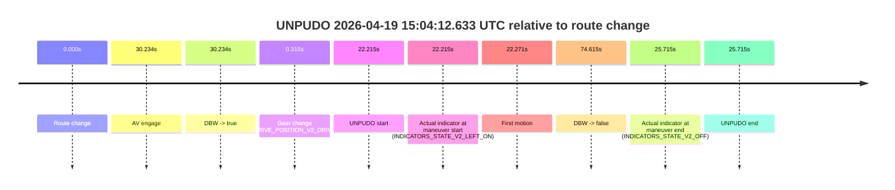
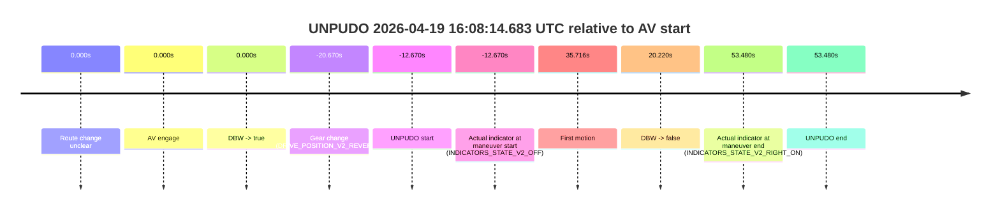
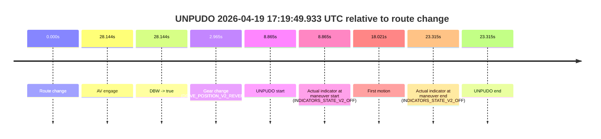

# Run Report: fme10003/2026-04-19--14-53-47--gen2-av-34562ed0-c72f-4c59-8956-dd2c3b278a32

| Field | Value |
|---|---|
| Run ID | `fme10003/2026-04-19--14-53-47--gen2-av-34562ed0-c72f-4c59-8956-dd2c3b278a32` |
| Date | `2026-04-19` |
| Model(s) | `plum-timeless-beaver` |
| Author | `peng.tang` |
| Event count | `16` |

## unpudo 2026-04-19 15:04:12.633 UTC

| Field | Value |
|---|---|
| Model | `plum-timeless-beaver` |
| Author | `peng.tang` |
| Run ID | `fme10003/2026-04-19--14-53-47--gen2-av-34562ed0-c72f-4c59-8956-dd2c3b278a32` |
| Date | `2026-04-19` |
| Time (UTC) | `15:04:12.633` |
| Event type | `unpudo` |
| Disengagement type | `none observed` |
| Route change | `found` |
| Console | [run](https://console.sso.wayve.ai/run/fme10003/2026-04-19--14-53-47--gen2-av-34562ed0-c72f-4c59-8956-dd2c3b278a32?id=&time-unixus=1776611052633328) |
| Foxglove | [segment](https://app.foxglove.dev/wayve-on-prem/p/prj_0dX18KZdVHg1fmmI/view?ds=foxglove-stream&ds.deviceName=fme10003&ds.start=2026-04-19T15%3A03%3A40.418241Z&ds.end=2026-04-19T15%3A05%3A15.033679Z&layoutId=lay_0e7VD4WIKDQGU73Y&time=2026-04-19T15%3A04%3A12.633328Z) |

### Event card: non-av

- Non-AV: there is no AV-owned portion anywhere inside the detected unpudo timeline, so it is kept for coverage but excluded from model success / failure scoring.

| Event | Time (UTC) | Delta from route change |
|---|---:|---:|
| Route change | 2026-04-19 15:03:50.418 | `0.000s` |
| AV engage | 2026-04-19 15:04:20.652 | `30.234s` |
| DBW -> true | 2026-04-19 15:04:20.652 | `30.234s` |
| Gear change (DRIVE_POSITION_V2_DRIVE) | 2026-04-19 15:03:50.733 | `0.315s` |
| UNPUDO start | 2026-04-19 15:04:12.633 | `22.215s` |
| Actual indicator at maneuver start (INDICATORS_STATE_V2_LEFT_ON) | 2026-04-19 15:04:12.633 | `22.215s` |
| First motion | 2026-04-19 15:04:12.689 | `22.271s` |
| DBW -> false | 2026-04-19 15:05:05.033 | `74.615s` |
| Actual indicator at maneuver end (INDICATORS_STATE_V2_OFF) | 2026-04-19 15:04:16.133 | `25.715s` |
| UNPUDO end | 2026-04-19 15:04:16.133 | `25.715s` |

| Metric | Value |
|---|---|
| Outcome | `non-av` |
| Effective failure type | `none` |
| Route change status | `found` |
| DBW at event start | `false` |
| DBW at event end | `false` |
| Predicted gear at AV start | `DRIVE_POSITION_V2_DRIVE` |
| Actual gear at AV start | `DRIVE_POSITION_V2_DRIVE` |
| Predicted gear at event start | `DRIVE_POSITION_V2_DRIVE` |
| Actual gear at event start | `DRIVE_POSITION_V2_DRIVE` |
| Planned indicator direction | `INDICATORS_STATE_V2_OFF` |
| Controller indicator direction | `INDICATORS_STATE_V2_OFF` |
| Actual indicator direction | `INDICATORS_STATE_V2_LEFT_ON` |
| Actual indicator at maneuver end | `INDICATORS_STATE_V2_OFF` |
| Driver accel help in AV | `false` |
| Driver accel help timestamp | `n/a` |
| Max accel pedal pct in AV | `0.0%` |
| Max brake pedal pct in AV | `0.0%` |
| Max speed mps in AV | `0.000` |
| Route -> AV | `30.234s` |
| AV -> event start | `-8.019s` |
| AV -> first motion | `-7.963s` |
| AV duration before disengagement | `44.381s` |
| Trajectory waypoint count | `38` |
| Driving-plan step count | `11` |

The scored portion starts from the AV-owned window, not from the pre-AV setup. Route-change search in the stopped pre-event segment was `found`, with the baseline therefore set to route change. At the event anchor the model predicts `DRIVE_POSITION_V2_DRIVE` and the actual gear is `DRIVE_POSITION_V2_DRIVE`. The effective model outcome is `non-av` because `there is no AV-owned overlap inside the event timeline`.

### Resolution

| Field | Value |
|---|---|
| Final outcome | `non-av` |
| Do we agree with this label? | `yes` |
| Source disengagement type | `none observed` |
| Resolved effective failure type | `none` |
| Confidence | `high` |

## unpudo 2026-04-19 15:05:05.683 UTC

| Field | Value |
|---|---|
| Model | `plum-timeless-beaver` |
| Author | `peng.tang` |
| Run ID | `fme10003/2026-04-19--14-53-47--gen2-av-34562ed0-c72f-4c59-8956-dd2c3b278a32` |
| Date | `2026-04-19` |
| Time (UTC) | `15:05:05.683` |
| Event type | `unpudo` |
| Disengagement type | `none observed` |
| Route change | `found` |
| Console | [run](https://console.sso.wayve.ai/run/fme10003/2026-04-19--14-53-47--gen2-av-34562ed0-c72f-4c59-8956-dd2c3b278a32?id=&time-unixus=1776611105683300) |
| Foxglove | [segment](https://app.foxglove.dev/wayve-on-prem/p/prj_0dX18KZdVHg1fmmI/view?ds=foxglove-stream&ds.deviceName=fme10003&ds.start=2026-04-19T15%3A03%3A40.418241Z&ds.end=2026-04-19T15%3A05%3A56.292574Z&layoutId=lay_0e7VD4WIKDQGU73Y&time=2026-04-19T15%3A05%3A05.683300Z) |

### Event card: non-av

- Non-AV: there is no AV-owned portion anywhere inside the detected unpudo timeline, so it is kept for coverage but excluded from model success / failure scoring.

| Event | Time (UTC) | Delta from route change |
|---|---:|---:|
| Route change | 2026-04-19 15:03:50.418 | `0.000s` |
| AV engage | 2026-04-19 15:05:24.852 | `94.435s` |
| DBW -> true | 2026-04-19 15:05:24.852 | `94.435s` |
| Gear change (DRIVE_POSITION_V2_DRIVE) | 2026-04-19 15:04:56.833 | `66.415s` |
| UNPUDO start | 2026-04-19 15:05:05.683 | `75.265s` |
| Actual indicator at maneuver start (INDICATORS_STATE_V2_LEFT_ON) | 2026-04-19 15:05:05.683 | `75.265s` |
| First motion | 2026-04-19 15:05:05.789 | `75.371s` |
| DBW -> false | 2026-04-19 15:05:46.292 | `115.874s` |
| Actual indicator at maneuver end (INDICATORS_STATE_V2_OFF) | 2026-04-19 15:05:12.383 | `81.965s` |
| UNPUDO end | 2026-04-19 15:05:12.383 | `81.965s` |

| Metric | Value |
|---|---|
| Outcome | `non-av` |
| Effective failure type | `none` |
| Route change status | `found` |
| DBW at event start | `false` |
| DBW at event end | `false` |
| Predicted gear at AV start | `DRIVE_POSITION_V2_DRIVE` |
| Actual gear at AV start | `DRIVE_POSITION_V2_DRIVE` |
| Predicted gear at event start | `DRIVE_POSITION_V2_DRIVE` |
| Actual gear at event start | `DRIVE_POSITION_V2_DRIVE` |
| Planned indicator direction | `INDICATORS_STATE_V2_OFF` |
| Controller indicator direction | `INDICATORS_STATE_V2_OFF` |
| Actual indicator direction | `INDICATORS_STATE_V2_LEFT_ON` |
| Actual indicator at maneuver end | `INDICATORS_STATE_V2_OFF` |
| Driver accel help in AV | `false` |
| Driver accel help timestamp | `n/a` |
| Max accel pedal pct in AV | `0.0%` |
| Max brake pedal pct in AV | `0.0%` |
| Max speed mps in AV | `0.000` |
| Route -> AV | `94.435s` |
| AV -> event start | `-19.170s` |
| AV -> first motion | `-19.064s` |
| AV duration before disengagement | `21.440s` |
| Trajectory waypoint count | `37` |
| Driving-plan step count | `11` |

The scored portion starts from the AV-owned window, not from the pre-AV setup. Route-change search in the stopped pre-event segment was `found`, with the baseline therefore set to route change. At the event anchor the model predicts `DRIVE_POSITION_V2_DRIVE` and the actual gear is `DRIVE_POSITION_V2_DRIVE`. The effective model outcome is `non-av` because `there is no AV-owned overlap inside the event timeline`.

### Resolution

| Field | Value |
|---|---|
| Final outcome | `non-av` |
| Do we agree with this label? | `yes` |
| Source disengagement type | `none observed` |
| Resolved effective failure type | `none` |
| Confidence | `high` |

## unpudo 2026-04-19 15:09:03.183 UTC

| Field | Value |
|---|---|
| Model | `plum-timeless-beaver` |
| Author | `peng.tang` |
| Run ID | `fme10003/2026-04-19--14-53-47--gen2-av-34562ed0-c72f-4c59-8956-dd2c3b278a32` |
| Date | `2026-04-19` |
| Time (UTC) | `15:09:03.183` |
| Event type | `unpudo` |
| Disengagement type | `none observed` |
| Route change | `found` |
| Console | [run](https://console.sso.wayve.ai/run/fme10003/2026-04-19--14-53-47--gen2-av-34562ed0-c72f-4c59-8956-dd2c3b278a32?id=&time-unixus=1776611343183308) |
| Foxglove | [segment](https://app.foxglove.dev/wayve-on-prem/p/prj_0dX18KZdVHg1fmmI/view?ds=foxglove-stream&ds.deviceName=fme10003&ds.start=2026-04-19T15%3A08%3A34.818268Z&ds.end=2026-04-19T15%3A09%3A34.583304Z&layoutId=lay_0e7VD4WIKDQGU73Y&time=2026-04-19T15%3A09%3A03.183308Z) |

### Event card: accidental

- Accidental: AV ownership is present for less than `2s`, so this is treated as an accidental brush with the maneuver rather than a meaningful model attempt.

| Event | Time (UTC) | Delta from route change |
|---|---:|---:|
| Route change | 2026-04-19 15:08:44.818 | `0.000s` |
| AV engage | 2026-04-19 15:08:52.792 | `7.974s` |
| DBW -> true | 2026-04-19 15:08:52.792 | `7.974s` |
| Gear change (DRIVE_POSITION_V2_REVERSE) | 2026-04-19 15:08:53.283 | `8.465s` |
| UNPUDO start | 2026-04-19 15:09:03.183 | `18.365s` |
| Actual indicator at maneuver start (INDICATORS_STATE_V2_OFF) | 2026-04-19 15:09:03.183 | `18.365s` |
| First motion | 2026-04-19 15:09:19.609 | `34.791s` |
| DBW -> false | 2026-04-19 15:09:03.253 | `18.435s` |
| Actual indicator at maneuver end (INDICATORS_STATE_V2_OFF) | 2026-04-19 15:09:24.583 | `39.765s` |
| UNPUDO end | 2026-04-19 15:09:24.583 | `39.765s` |

| Metric | Value |
|---|---|
| Outcome | `accidental` |
| Effective failure type | `none` |
| Route change status | `found` |
| DBW at event start | `true` |
| DBW at event end | `false` |
| Predicted gear at AV start | `DRIVE_POSITION_V2_REVERSE` |
| Actual gear at AV start | `DRIVE_POSITION_V2_PARK` |
| Predicted gear at event start | `DRIVE_POSITION_V2_REVERSE` |
| Actual gear at event start | `DRIVE_POSITION_V2_REVERSE` |
| Planned indicator direction | `INDICATORS_STATE_V2_OFF` |
| Controller indicator direction | `INDICATORS_STATE_V2_OFF` |
| Actual indicator direction | `INDICATORS_STATE_V2_OFF` |
| Actual indicator at maneuver end | `INDICATORS_STATE_V2_OFF` |
| Driver accel help in AV | `false` |
| Driver accel help timestamp | `n/a` |
| Max accel pedal pct in AV | `0.0%` |
| Max brake pedal pct in AV | `0.0%` |
| Max speed mps in AV | `-0.125` |
| Route -> AV | `7.974s` |
| AV -> event start | `10.391s` |
| AV -> first motion | `26.816s` |
| AV duration before disengagement | `10.460s` |
| Trajectory waypoint count | `37` |
| Driving-plan step count | `11` |

The scored portion starts from the AV-owned window, not from the pre-AV setup. Route-change search in the stopped pre-event segment was `found`, with the baseline therefore set to route change. At the event anchor the model predicts `DRIVE_POSITION_V2_REVERSE` and the actual gear is `DRIVE_POSITION_V2_REVERSE`. The effective model outcome is `accidental` because `the AV-owned portion is shorter than 2s`.

### Resolution

| Field | Value |
|---|---|
| Final outcome | `accidental` |
| Do we agree with this label? | `yes` |
| Source disengagement type | `none observed` |
| Resolved effective failure type | `none` |
| Confidence | `high` |

## unpudo 2026-04-19 15:13:00.883 UTC

| Field | Value |
|---|---|
| Model | `plum-timeless-beaver` |
| Author | `peng.tang` |
| Run ID | `fme10003/2026-04-19--14-53-47--gen2-av-34562ed0-c72f-4c59-8956-dd2c3b278a32` |
| Date | `2026-04-19` |
| Time (UTC) | `15:13:00.883` |
| Event type | `unpudo` |
| Disengagement type | `none observed` |
| Route change | `found` |
| Console | [run](https://console.sso.wayve.ai/run/fme10003/2026-04-19--14-53-47--gen2-av-34562ed0-c72f-4c59-8956-dd2c3b278a32?id=&time-unixus=1776611580883317) |
| Foxglove | [segment](https://app.foxglove.dev/wayve-on-prem/p/prj_0dX18KZdVHg1fmmI/view?ds=foxglove-stream&ds.deviceName=fme10003&ds.start=2026-04-19T15%3A12%3A23.568260Z&ds.end=2026-04-19T15%3A15%3A35.732622Z&layoutId=lay_0e7VD4WIKDQGU73Y&time=2026-04-19T15%3A13%3A00.883317Z) |

### Event card: non-av

- Non-AV: there is no AV-owned portion anywhere inside the detected unpudo timeline, so it is kept for coverage but excluded from model success / failure scoring.

| Event | Time (UTC) | Delta from route change |
|---|---:|---:|
| Route change | 2026-04-19 15:12:33.568 | `0.000s` |
| AV engage | 2026-04-19 15:13:09.512 | `35.944s` |
| DBW -> true | 2026-04-19 15:13:09.512 | `35.944s` |
| Gear change (DRIVE_POSITION_V2_DRIVE) | 2026-04-19 15:12:42.283 | `8.715s` |
| UNPUDO start | 2026-04-19 15:13:00.883 | `27.315s` |
| Actual indicator at maneuver start (INDICATORS_STATE_V2_OFF) | 2026-04-19 15:13:00.883 | `27.315s` |
| First motion | 2026-04-19 15:13:00.929 | `27.361s` |
| DBW -> false | 2026-04-19 15:15:25.732 | `172.164s` |
| Actual indicator at maneuver end (INDICATORS_STATE_V2_OFF) | 2026-04-19 15:13:06.483 | `32.915s` |
| UNPUDO end | 2026-04-19 15:13:06.483 | `32.915s` |

| Metric | Value |
|---|---|
| Outcome | `non-av` |
| Effective failure type | `none` |
| Route change status | `found` |
| DBW at event start | `false` |
| DBW at event end | `false` |
| Predicted gear at AV start | `DRIVE_POSITION_V2_DRIVE` |
| Actual gear at AV start | `DRIVE_POSITION_V2_DRIVE` |
| Predicted gear at event start | `DRIVE_POSITION_V2_DRIVE` |
| Actual gear at event start | `DRIVE_POSITION_V2_DRIVE` |
| Planned indicator direction | `INDICATORS_STATE_V2_LEFT_ON` |
| Controller indicator direction | `INDICATORS_STATE_V2_LEFT_ON` |
| Actual indicator direction | `INDICATORS_STATE_V2_OFF` |
| Actual indicator at maneuver end | `INDICATORS_STATE_V2_OFF` |
| Driver accel help in AV | `false` |
| Driver accel help timestamp | `n/a` |
| Max accel pedal pct in AV | `0.0%` |
| Max brake pedal pct in AV | `0.0%` |
| Max speed mps in AV | `0.000` |
| Route -> AV | `35.944s` |
| AV -> event start | `-8.629s` |
| AV -> first motion | `-8.583s` |
| AV duration before disengagement | `136.220s` |
| Trajectory waypoint count | `37` |
| Driving-plan step count | `11` |

The scored portion starts from the AV-owned window, not from the pre-AV setup. Route-change search in the stopped pre-event segment was `found`, with the baseline therefore set to route change. At the event anchor the model predicts `DRIVE_POSITION_V2_DRIVE` and the actual gear is `DRIVE_POSITION_V2_DRIVE`. The effective model outcome is `non-av` because `there is no AV-owned overlap inside the event timeline`.

### Resolution

| Field | Value |
|---|---|
| Final outcome | `non-av` |
| Do we agree with this label? | `yes` |
| Source disengagement type | `none observed` |
| Resolved effective failure type | `none` |
| Confidence | `high` |

## unpudo 2026-04-19 15:21:45.033 UTC

| Field | Value |
|---|---|
| Model | `plum-timeless-beaver` |
| Author | `peng.tang` |
| Run ID | `fme10003/2026-04-19--14-53-47--gen2-av-34562ed0-c72f-4c59-8956-dd2c3b278a32` |
| Date | `2026-04-19` |
| Time (UTC) | `15:21:45.033` |
| Event type | `unpudo` |
| Disengagement type | `none observed` |
| Route change | `found` |
| Console | [run](https://console.sso.wayve.ai/run/fme10003/2026-04-19--14-53-47--gen2-av-34562ed0-c72f-4c59-8956-dd2c3b278a32?id=&time-unixus=1776612105033299) |
| Foxglove | [segment](https://app.foxglove.dev/wayve-on-prem/p/prj_0dX18KZdVHg1fmmI/view?ds=foxglove-stream&ds.deviceName=fme10003&ds.start=2026-04-19T15%3A20%3A57.483307Z&ds.end=2026-04-19T15%3A23%3A11.372571Z&layoutId=lay_0e7VD4WIKDQGU73Y&time=2026-04-19T15%3A21%3A45.033299Z) |

### Event card: non-av

- Non-AV: there is no AV-owned portion anywhere inside the detected unpudo timeline, so it is kept for coverage but excluded from model success / failure scoring.

| Event | Time (UTC) | Delta from route change |
|---|---:|---:|
| Route change | 2026-04-19 15:21:25.118 | `0.000s` |
| AV engage | 2026-04-19 15:21:49.812 | `24.694s` |
| DBW -> true | 2026-04-19 15:21:49.812 | `24.694s` |
| Gear change (DRIVE_POSITION_V2_DRIVE) | 2026-04-19 15:21:07.483 | `-17.635s` |
| UNPUDO start | 2026-04-19 15:21:45.033 | `19.915s` |
| Actual indicator at maneuver start (INDICATORS_STATE_V2_LEFT_ON) | 2026-04-19 15:21:45.033 | `19.915s` |
| First motion | 2026-04-19 15:21:45.089 | `19.971s` |
| DBW -> false | 2026-04-19 15:23:01.372 | `96.254s` |
| Actual indicator at maneuver end (INDICATORS_STATE_V2_OFF) | 2026-04-19 15:21:48.833 | `23.715s` |
| UNPUDO end | 2026-04-19 15:21:48.833 | `23.715s` |

| Metric | Value |
|---|---|
| Outcome | `non-av` |
| Effective failure type | `none` |
| Route change status | `found` |
| DBW at event start | `false` |
| DBW at event end | `false` |
| Predicted gear at AV start | `DRIVE_POSITION_V2_DRIVE` |
| Actual gear at AV start | `DRIVE_POSITION_V2_DRIVE` |
| Predicted gear at event start | `DRIVE_POSITION_V2_DRIVE` |
| Actual gear at event start | `DRIVE_POSITION_V2_DRIVE` |
| Planned indicator direction | `INDICATORS_STATE_V2_RIGHT_ON` |
| Controller indicator direction | `INDICATORS_STATE_V2_RIGHT_ON` |
| Actual indicator direction | `INDICATORS_STATE_V2_LEFT_ON` |
| Actual indicator at maneuver end | `INDICATORS_STATE_V2_OFF` |
| Driver accel help in AV | `false` |
| Driver accel help timestamp | `n/a` |
| Max accel pedal pct in AV | `0.0%` |
| Max brake pedal pct in AV | `0.0%` |
| Max speed mps in AV | `0.000` |
| Route -> AV | `24.694s` |
| AV -> event start | `-4.779s` |
| AV -> first motion | `-4.723s` |
| AV duration before disengagement | `71.560s` |
| Trajectory waypoint count | `36` |
| Driving-plan step count | `11` |

The scored portion starts from the AV-owned window, not from the pre-AV setup. Route-change search in the stopped pre-event segment was `found`, with the baseline therefore set to route change. At the event anchor the model predicts `DRIVE_POSITION_V2_DRIVE` and the actual gear is `DRIVE_POSITION_V2_DRIVE`. The effective model outcome is `non-av` because `there is no AV-owned overlap inside the event timeline`.

### Resolution

| Field | Value |
|---|---|
| Final outcome | `non-av` |
| Do we agree with this label? | `yes` |
| Source disengagement type | `none observed` |
| Resolved effective failure type | `none` |
| Confidence | `high` |

## unpudo 2026-04-19 15:28:37.833 UTC

| Field | Value |
|---|---|
| Model | `plum-timeless-beaver` |
| Author | `peng.tang` |
| Run ID | `fme10003/2026-04-19--14-53-47--gen2-av-34562ed0-c72f-4c59-8956-dd2c3b278a32` |
| Date | `2026-04-19` |
| Time (UTC) | `15:28:37.833` |
| Event type | `unpudo` |
| Disengagement type | `none observed` |
| Route change | `found` |
| Console | [run](https://console.sso.wayve.ai/run/fme10003/2026-04-19--14-53-47--gen2-av-34562ed0-c72f-4c59-8956-dd2c3b278a32?id=&time-unixus=1776612517833322) |
| Foxglove | [segment](https://app.foxglove.dev/wayve-on-prem/p/prj_0dX18KZdVHg1fmmI/view?ds=foxglove-stream&ds.deviceName=fme10003&ds.start=2026-04-19T15%3A28%3A18.268325Z&ds.end=2026-04-19T15%3A34%3A47.172683Z&layoutId=lay_0e7VD4WIKDQGU73Y&time=2026-04-19T15%3A28%3A37.833322Z) |

### Event card: non-av

- Non-AV: there is no AV-owned portion anywhere inside the detected unpudo timeline, so it is kept for coverage but excluded from model success / failure scoring.

| Event | Time (UTC) | Delta from route change |
|---|---:|---:|
| Route change | 2026-04-19 15:28:28.268 | `0.000s` |
| AV engage | 2026-04-19 15:28:49.872 | `21.604s` |
| DBW -> true | 2026-04-19 15:28:49.872 | `21.604s` |
| Gear change (DRIVE_POSITION_V2_DRIVE) | 2026-04-19 15:28:28.583 | `0.315s` |
| UNPUDO start | 2026-04-19 15:28:37.833 | `9.565s` |
| Actual indicator at maneuver start (INDICATORS_STATE_V2_LEFT_ON) | 2026-04-19 15:28:37.833 | `9.565s` |
| First motion | 2026-04-19 15:28:37.949 | `9.681s` |
| DBW -> false | 2026-04-19 15:34:37.172 | `368.904s` |
| Actual indicator at maneuver end (INDICATORS_STATE_V2_OFF) | 2026-04-19 15:28:43.633 | `15.365s` |
| UNPUDO end | 2026-04-19 15:28:43.633 | `15.365s` |

| Metric | Value |
|---|---|
| Outcome | `non-av` |
| Effective failure type | `none` |
| Route change status | `found` |
| DBW at event start | `false` |
| DBW at event end | `false` |
| Predicted gear at AV start | `DRIVE_POSITION_V2_DRIVE` |
| Actual gear at AV start | `DRIVE_POSITION_V2_DRIVE` |
| Predicted gear at event start | `DRIVE_POSITION_V2_DRIVE` |
| Actual gear at event start | `DRIVE_POSITION_V2_DRIVE` |
| Planned indicator direction | `INDICATORS_STATE_V2_OFF` |
| Controller indicator direction | `INDICATORS_STATE_V2_OFF` |
| Actual indicator direction | `INDICATORS_STATE_V2_LEFT_ON` |
| Actual indicator at maneuver end | `INDICATORS_STATE_V2_OFF` |
| Driver accel help in AV | `false` |
| Driver accel help timestamp | `n/a` |
| Max accel pedal pct in AV | `0.0%` |
| Max brake pedal pct in AV | `0.0%` |
| Max speed mps in AV | `0.000` |
| Route -> AV | `21.604s` |
| AV -> event start | `-12.039s` |
| AV -> first motion | `-11.923s` |
| AV duration before disengagement | `347.300s` |
| Trajectory waypoint count | `38` |
| Driving-plan step count | `11` |

The scored portion starts from the AV-owned window, not from the pre-AV setup. Route-change search in the stopped pre-event segment was `found`, with the baseline therefore set to route change. At the event anchor the model predicts `DRIVE_POSITION_V2_DRIVE` and the actual gear is `DRIVE_POSITION_V2_DRIVE`. The effective model outcome is `non-av` because `there is no AV-owned overlap inside the event timeline`.

### Resolution

| Field | Value |
|---|---|
| Final outcome | `non-av` |
| Do we agree with this label? | `yes` |
| Source disengagement type | `none observed` |
| Resolved effective failure type | `none` |
| Confidence | `high` |

## unpudo 2026-04-19 16:08:14.683 UTC

| Field | Value |
|---|---|
| Model | `plum-timeless-beaver` |
| Author | `peng.tang` |
| Run ID | `fme10003/2026-04-19--14-53-47--gen2-av-34562ed0-c72f-4c59-8956-dd2c3b278a32` |
| Date | `2026-04-19` |
| Time (UTC) | `16:08:14.683` |
| Event type | `unpudo` |
| Disengagement type | `none observed` |
| Route change | `unclear` |
| Console | [run](https://console.sso.wayve.ai/run/fme10003/2026-04-19--14-53-47--gen2-av-34562ed0-c72f-4c59-8956-dd2c3b278a32?id=&time-unixus=1776614894683314) |
| Foxglove | [segment](https://app.foxglove.dev/wayve-on-prem/p/prj_0dX18KZdVHg1fmmI/view?ds=foxglove-stream&ds.deviceName=fme10003&ds.start=2026-04-19T16%3A07%3A56.683297Z&ds.end=2026-04-19T16%3A09%3A30.833324Z&layoutId=lay_0e7VD4WIKDQGU73Y&time=2026-04-19T16%3A08%3A14.683314Z) |

### Event card: fail

- Fail: the credited unpudo does not stay AV-owned. The event window starts with DBW false, and the maneuver outcome lands outside a clean AV-owned segment.

| Event | Time (UTC) | Delta from AV start |
|---|---:|---:|
| Route change unclear | 2026-04-19 16:08:27.352 | `0.000s` |
| AV engage | 2026-04-19 16:08:27.352 | `0.000s` |
| DBW -> true | 2026-04-19 16:08:27.352 | `0.000s` |
| Gear change (DRIVE_POSITION_V2_REVERSE) | 2026-04-19 16:08:06.683 | `-20.670s` |
| UNPUDO start | 2026-04-19 16:08:14.683 | `-12.670s` |
| Actual indicator at maneuver start (INDICATORS_STATE_V2_OFF) | 2026-04-19 16:08:14.683 | `-12.670s` |
| First motion | 2026-04-19 16:09:03.069 | `35.716s` |
| DBW -> false | 2026-04-19 16:08:47.572 | `20.220s` |
| Actual indicator at maneuver end (INDICATORS_STATE_V2_RIGHT_ON) | 2026-04-19 16:09:20.833 | `53.480s` |
| UNPUDO end | 2026-04-19 16:09:20.833 | `53.480s` |

| Metric | Value |
|---|---|
| Outcome | `fail` |
| Effective failure type | `not_av_owned` |
| Route change status | `unclear` |
| DBW at event start | `false` |
| DBW at event end | `false` |
| Predicted gear at AV start | `DRIVE_POSITION_V2_REVERSE` |
| Actual gear at AV start | `DRIVE_POSITION_V2_PARK` |
| Predicted gear at event start | `DRIVE_POSITION_V2_REVERSE` |
| Actual gear at event start | `DRIVE_POSITION_V2_REVERSE` |
| Planned indicator direction | `INDICATORS_STATE_V2_OFF` |
| Controller indicator direction | `INDICATORS_STATE_V2_OFF` |
| Actual indicator direction | `INDICATORS_STATE_V2_OFF` |
| Actual indicator at maneuver end | `INDICATORS_STATE_V2_RIGHT_ON` |
| Driver accel help in AV | `false` |
| Driver accel help timestamp | `n/a` |
| Max accel pedal pct in AV | `0.0%` |
| Max brake pedal pct in AV | `9.4%` |
| Max speed mps in AV | `0.000` |
| Route -> AV | `n/a` |
| AV -> event start | `-12.670s` |
| AV -> first motion | `35.716s` |
| AV duration before disengagement | `20.220s` |
| Trajectory waypoint count | `37` |
| Driving-plan step count | `11` |

The scored portion starts from the AV-owned window, not from the pre-AV setup. Route-change search in the stopped pre-event segment was `unclear`, with the baseline therefore set to AV start. At the event anchor the model predicts `DRIVE_POSITION_V2_REVERSE` and the actual gear is `DRIVE_POSITION_V2_REVERSE`. The effective model outcome is `fail` because `not_av_owned`.

### Resolution

| Field | Value |
|---|---|
| Final outcome | `fail` |
| Do we agree with this label? | `yes` |
| Source disengagement type | `none observed` |
| Resolved effective failure type | `not_av_owned` |
| Confidence | `medium` |

## unpudo 2026-04-19 16:09:55.183 UTC

| Field | Value |
|---|---|
| Model | `plum-timeless-beaver` |
| Author | `peng.tang` |
| Run ID | `fme10003/2026-04-19--14-53-47--gen2-av-34562ed0-c72f-4c59-8956-dd2c3b278a32` |
| Date | `2026-04-19` |
| Time (UTC) | `16:09:55.183` |
| Event type | `unpudo` |
| Disengagement type | `none observed` |
| Route change | `found` |
| Console | [run](https://console.sso.wayve.ai/run/fme10003/2026-04-19--14-53-47--gen2-av-34562ed0-c72f-4c59-8956-dd2c3b278a32?id=&time-unixus=1776614995183316) |
| Foxglove | [segment](https://app.foxglove.dev/wayve-on-prem/p/prj_0dX18KZdVHg1fmmI/view?ds=foxglove-stream&ds.deviceName=fme10003&ds.start=2026-04-19T16%3A08%3A24.669080Z&ds.end=2026-04-19T16%3A11%3A24.552772Z&layoutId=lay_0e7VD4WIKDQGU73Y&time=2026-04-19T16%3A09%3A55.183316Z) |

### Event card: pass

- Pass: AV owns the credited unpudo through the official event window, the gear state is aligned at the anchor, and the vehicle moves without driver accelerator help in AV.

| Event | Time (UTC) | Delta from route change |
|---|---:|---:|
| Route change | 2026-04-19 16:08:34.669 | `0.000s` |
| AV engage | 2026-04-19 16:09:48.352 | `73.684s` |
| DBW -> true | 2026-04-19 16:09:48.352 | `73.684s` |
| Gear change (DRIVE_POSITION_V2_DRIVE) | 2026-04-19 16:09:45.233 | `70.564s` |
| UNPUDO start | 2026-04-19 16:09:55.183 | `80.514s` |
| Actual indicator at maneuver start (INDICATORS_STATE_V2_OFF) | 2026-04-19 16:09:55.183 | `80.514s` |
| First motion | 2026-04-19 16:09:55.229 | `80.560s` |
| DBW -> false | 2026-04-19 16:11:14.552 | `159.884s` |
| Actual indicator at maneuver end (INDICATORS_STATE_V2_OFF) | 2026-04-19 16:09:58.583 | `83.914s` |
| UNPUDO end | 2026-04-19 16:09:58.583 | `83.914s` |

| Metric | Value |
|---|---|
| Outcome | `pass` |
| Effective failure type | `none` |
| Route change status | `found` |
| DBW at event start | `true` |
| DBW at event end | `true` |
| Predicted gear at AV start | `DRIVE_POSITION_V2_DRIVE` |
| Actual gear at AV start | `DRIVE_POSITION_V2_DRIVE` |
| Predicted gear at event start | `DRIVE_POSITION_V2_DRIVE` |
| Actual gear at event start | `DRIVE_POSITION_V2_DRIVE` |
| Planned indicator direction | `INDICATORS_STATE_V2_OFF` |
| Controller indicator direction | `INDICATORS_STATE_V2_OFF` |
| Actual indicator direction | `INDICATORS_STATE_V2_OFF` |
| Actual indicator at maneuver end | `INDICATORS_STATE_V2_OFF` |
| Driver accel help in AV | `false` |
| Driver accel help timestamp | `n/a` |
| Max accel pedal pct in AV | `0.0%` |
| Max brake pedal pct in AV | `0.0%` |
| Max speed mps in AV | `5.061` |
| Route -> AV | `73.684s` |
| AV -> event start | `6.831s` |
| AV -> first motion | `6.876s` |
| AV duration before disengagement | `86.200s` |
| Trajectory waypoint count | `37` |
| Driving-plan step count | `11` |

The scored portion starts from the AV-owned window, not from the pre-AV setup. Route-change search in the stopped pre-event segment was `found`, with the baseline therefore set to route change. At the event anchor the model predicts `DRIVE_POSITION_V2_DRIVE` and the actual gear is `DRIVE_POSITION_V2_DRIVE`. The effective model outcome is `pass` because `the credited maneuver stays AV-owned through the official event end`.

### Resolution

| Field | Value |
|---|---|
| Final outcome | `pass` |
| Do we agree with this label? | `yes` |
| Source disengagement type | `none observed` |
| Resolved effective failure type | `none` |
| Confidence | `high` |

## unpudo 2026-04-19 16:15:28.833 UTC

| Field | Value |
|---|---|
| Model | `plum-timeless-beaver` |
| Author | `peng.tang` |
| Run ID | `fme10003/2026-04-19--14-53-47--gen2-av-34562ed0-c72f-4c59-8956-dd2c3b278a32` |
| Date | `2026-04-19` |
| Time (UTC) | `16:15:28.833` |
| Event type | `unpudo` |
| Disengagement type | `none observed` |
| Route change | `found` |
| Console | [run](https://console.sso.wayve.ai/run/fme10003/2026-04-19--14-53-47--gen2-av-34562ed0-c72f-4c59-8956-dd2c3b278a32?id=&time-unixus=1776615328833305) |
| Foxglove | [segment](https://app.foxglove.dev/wayve-on-prem/p/prj_0dX18KZdVHg1fmmI/view?ds=foxglove-stream&ds.deviceName=fme10003&ds.start=2026-04-19T16%3A15%3A12.768274Z&ds.end=2026-04-19T16%3A16%3A37.653064Z&layoutId=lay_0e7VD4WIKDQGU73Y&time=2026-04-19T16%3A15%3A28.833305Z) |

### Event card: pass

- Pass: AV owns the credited unpudo through the official event window, the gear state is aligned at the anchor, and the vehicle moves without driver accelerator help in AV.

| Event | Time (UTC) | Delta from route change |
|---|---:|---:|
| Route change | 2026-04-19 16:15:22.768 | `0.000s` |
| AV engage | 2026-04-19 16:15:34.412 | `11.644s` |
| DBW -> true | 2026-04-19 16:15:34.412 | `11.644s` |
| Gear change (DRIVE_POSITION_V2_DRIVE) | 2026-04-19 16:15:23.033 | `0.265s` |
| UNPUDO start | 2026-04-19 16:15:28.833 | `6.065s` |
| Actual indicator at maneuver start (INDICATORS_STATE_V2_OFF) | 2026-04-19 16:15:28.833 | `6.065s` |
| First motion | 2026-04-19 16:15:28.849 | `6.082s` |
| DBW -> false | 2026-04-19 16:16:27.653 | `64.885s` |
| Actual indicator at maneuver end (INDICATORS_STATE_V2_OFF) | 2026-04-19 16:15:54.783 | `32.015s` |
| UNPUDO end | 2026-04-19 16:15:54.783 | `32.015s` |

| Metric | Value |
|---|---|
| Outcome | `pass` |
| Effective failure type | `none` |
| Route change status | `found` |
| DBW at event start | `false` |
| DBW at event end | `true` |
| Predicted gear at AV start | `DRIVE_POSITION_V2_DRIVE` |
| Actual gear at AV start | `DRIVE_POSITION_V2_DRIVE` |
| Predicted gear at event start | `DRIVE_POSITION_V2_DRIVE` |
| Actual gear at event start | `DRIVE_POSITION_V2_DRIVE` |
| Planned indicator direction | `INDICATORS_STATE_V2_RIGHT_ON` |
| Controller indicator direction | `INDICATORS_STATE_V2_RIGHT_ON` |
| Actual indicator direction | `INDICATORS_STATE_V2_OFF` |
| Actual indicator at maneuver end | `INDICATORS_STATE_V2_OFF` |
| Driver accel help in AV | `false` |
| Driver accel help timestamp | `n/a` |
| Max accel pedal pct in AV | `0.0%` |
| Max brake pedal pct in AV | `0.0%` |
| Max speed mps in AV | `2.269` |
| Route -> AV | `11.644s` |
| AV -> event start | `-5.579s` |
| AV -> first motion | `-5.563s` |
| AV duration before disengagement | `53.241s` |
| Trajectory waypoint count | `36` |
| Driving-plan step count | `11` |

The scored portion starts from the AV-owned window, not from the pre-AV setup. Route-change search in the stopped pre-event segment was `found`, with the baseline therefore set to route change. At the event anchor the model predicts `DRIVE_POSITION_V2_DRIVE` and the actual gear is `DRIVE_POSITION_V2_DRIVE`. The effective model outcome is `pass` because `the credited maneuver stays AV-owned through the official event end`.

### Resolution

| Field | Value |
|---|---|
| Final outcome | `pass` |
| Do we agree with this label? | `yes` |
| Source disengagement type | `none observed` |
| Resolved effective failure type | `none` |
| Confidence | `high` |

## unpudo 2026-04-19 16:32:35.033 UTC

| Field | Value |
|---|---|
| Model | `plum-timeless-beaver` |
| Author | `peng.tang` |
| Run ID | `fme10003/2026-04-19--14-53-47--gen2-av-34562ed0-c72f-4c59-8956-dd2c3b278a32` |
| Date | `2026-04-19` |
| Time (UTC) | `16:32:35.033` |
| Event type | `unpudo` |
| Disengagement type | `none observed` |
| Route change | `found` |
| Console | [run](https://console.sso.wayve.ai/run/fme10003/2026-04-19--14-53-47--gen2-av-34562ed0-c72f-4c59-8956-dd2c3b278a32?id=&time-unixus=1776616355033317) |
| Foxglove | [segment](https://app.foxglove.dev/wayve-on-prem/p/prj_0dX18KZdVHg1fmmI/view?ds=foxglove-stream&ds.deviceName=fme10003&ds.start=2026-04-19T16%3A32%3A15.868269Z&ds.end=2026-04-19T16%3A33%3A26.953149Z&layoutId=lay_0e7VD4WIKDQGU73Y&time=2026-04-19T16%3A32%3A35.033317Z) |

### Event card: pass

- Pass: AV owns the credited unpudo through the official event window, the gear state is aligned at the anchor, and the vehicle moves without driver accelerator help in AV.

| Event | Time (UTC) | Delta from route change |
|---|---:|---:|
| Route change | 2026-04-19 16:32:25.868 | `0.000s` |
| AV engage | 2026-04-19 16:32:48.373 | `22.506s` |
| DBW -> true | 2026-04-19 16:32:48.373 | `22.506s` |
| Gear change (DRIVE_POSITION_V2_DRIVE) | 2026-04-19 16:32:26.183 | `0.315s` |
| UNPUDO start | 2026-04-19 16:32:35.033 | `9.165s` |
| Actual indicator at maneuver start (INDICATORS_STATE_V2_OFF) | 2026-04-19 16:32:35.033 | `9.165s` |
| First motion | 2026-04-19 16:32:35.069 | `9.201s` |
| DBW -> false | 2026-04-19 16:33:16.953 | `51.085s` |
| Actual indicator at maneuver end (INDICATORS_STATE_V2_OFF) | 2026-04-19 16:32:57.683 | `31.815s` |
| UNPUDO end | 2026-04-19 16:32:57.683 | `31.815s` |

| Metric | Value |
|---|---|
| Outcome | `pass` |
| Effective failure type | `none` |
| Route change status | `found` |
| DBW at event start | `false` |
| DBW at event end | `true` |
| Predicted gear at AV start | `DRIVE_POSITION_V2_DRIVE` |
| Actual gear at AV start | `DRIVE_POSITION_V2_DRIVE` |
| Predicted gear at event start | `DRIVE_POSITION_V2_DRIVE` |
| Actual gear at event start | `DRIVE_POSITION_V2_DRIVE` |
| Planned indicator direction | `INDICATORS_STATE_V2_OFF` |
| Controller indicator direction | `INDICATORS_STATE_V2_OFF` |
| Actual indicator direction | `INDICATORS_STATE_V2_OFF` |
| Actual indicator at maneuver end | `INDICATORS_STATE_V2_OFF` |
| Driver accel help in AV | `false` |
| Driver accel help timestamp | `n/a` |
| Max accel pedal pct in AV | `0.0%` |
| Max brake pedal pct in AV | `0.0%` |
| Max speed mps in AV | `2.236` |
| Route -> AV | `22.506s` |
| AV -> event start | `-13.341s` |
| AV -> first motion | `-13.304s` |
| AV duration before disengagement | `28.579s` |
| Trajectory waypoint count | `36` |
| Driving-plan step count | `11` |

The scored portion starts from the AV-owned window, not from the pre-AV setup. Route-change search in the stopped pre-event segment was `found`, with the baseline therefore set to route change. At the event anchor the model predicts `DRIVE_POSITION_V2_DRIVE` and the actual gear is `DRIVE_POSITION_V2_DRIVE`. The effective model outcome is `pass` because `the credited maneuver stays AV-owned through the official event end`.

### Resolution

| Field | Value |
|---|---|
| Final outcome | `pass` |
| Do we agree with this label? | `yes` |
| Source disengagement type | `none observed` |
| Resolved effective failure type | `none` |
| Confidence | `high` |

## unpudo 2026-04-19 16:44:30.083 UTC

| Field | Value |
|---|---|
| Model | `plum-timeless-beaver` |
| Author | `peng.tang` |
| Run ID | `fme10003/2026-04-19--14-53-47--gen2-av-34562ed0-c72f-4c59-8956-dd2c3b278a32` |
| Date | `2026-04-19` |
| Time (UTC) | `16:44:30.083` |
| Event type | `unpudo` |
| Disengagement type | `none observed` |
| Route change | `found` |
| Console | [run](https://console.sso.wayve.ai/run/fme10003/2026-04-19--14-53-47--gen2-av-34562ed0-c72f-4c59-8956-dd2c3b278a32?id=&time-unixus=1776617070083305) |
| Foxglove | [segment](https://app.foxglove.dev/wayve-on-prem/p/prj_0dX18KZdVHg1fmmI/view?ds=foxglove-stream&ds.deviceName=fme10003&ds.start=2026-04-19T16%3A44%3A11.268250Z&ds.end=2026-04-19T16%3A45%3A41.773887Z&layoutId=lay_0e7VD4WIKDQGU73Y&time=2026-04-19T16%3A44%3A30.083305Z) |

### Event card: accidental

- Accidental: AV ownership is present for less than `2s`, so this is treated as an accidental brush with the maneuver rather than a meaningful model attempt.

| Event | Time (UTC) | Delta from route change |
|---|---:|---:|
| Route change | 2026-04-19 16:44:21.268 | `0.000s` |
| AV engage | 2026-04-19 16:44:37.932 | `16.664s` |
| DBW -> true | 2026-04-19 16:44:37.932 | `16.664s` |
| Gear change (DRIVE_POSITION_V2_DRIVE) | 2026-04-19 16:44:21.833 | `0.565s` |
| UNPUDO start | 2026-04-19 16:44:30.083 | `8.815s` |
| Actual indicator at maneuver start (INDICATORS_STATE_V2_OFF) | 2026-04-19 16:44:30.083 | `8.815s` |
| First motion | 2026-04-19 16:44:30.129 | `8.861s` |
| DBW -> false | 2026-04-19 16:45:31.773 | `70.506s` |
| Actual indicator at maneuver end (INDICATORS_STATE_V2_OFF) | 2026-04-19 16:44:39.233 | `17.965s` |
| UNPUDO end | 2026-04-19 16:44:39.233 | `17.965s` |

| Metric | Value |
|---|---|
| Outcome | `accidental` |
| Effective failure type | `none` |
| Route change status | `found` |
| DBW at event start | `false` |
| DBW at event end | `true` |
| Predicted gear at AV start | `DRIVE_POSITION_V2_DRIVE` |
| Actual gear at AV start | `DRIVE_POSITION_V2_DRIVE` |
| Predicted gear at event start | `DRIVE_POSITION_V2_DRIVE` |
| Actual gear at event start | `DRIVE_POSITION_V2_DRIVE` |
| Planned indicator direction | `INDICATORS_STATE_V2_OFF` |
| Controller indicator direction | `INDICATORS_STATE_V2_OFF` |
| Actual indicator direction | `INDICATORS_STATE_V2_OFF` |
| Actual indicator at maneuver end | `INDICATORS_STATE_V2_OFF` |
| Driver accel help in AV | `false` |
| Driver accel help timestamp | `n/a` |
| Max accel pedal pct in AV | `0.0%` |
| Max brake pedal pct in AV | `0.0%` |
| Max speed mps in AV | `2.247` |
| Route -> AV | `16.664s` |
| AV -> event start | `-7.849s` |
| AV -> first motion | `-7.803s` |
| AV duration before disengagement | `53.841s` |
| Trajectory waypoint count | `37` |
| Driving-plan step count | `11` |

The scored portion starts from the AV-owned window, not from the pre-AV setup. Route-change search in the stopped pre-event segment was `found`, with the baseline therefore set to route change. At the event anchor the model predicts `DRIVE_POSITION_V2_DRIVE` and the actual gear is `DRIVE_POSITION_V2_DRIVE`. The effective model outcome is `accidental` because `the AV-owned portion is shorter than 2s`.

### Resolution

| Field | Value |
|---|---|
| Final outcome | `accidental` |
| Do we agree with this label? | `yes` |
| Source disengagement type | `none observed` |
| Resolved effective failure type | `none` |
| Confidence | `high` |

## unpudo 2026-04-19 16:46:16.583 UTC

| Field | Value |
|---|---|
| Model | `plum-timeless-beaver` |
| Author | `peng.tang` |
| Run ID | `fme10003/2026-04-19--14-53-47--gen2-av-34562ed0-c72f-4c59-8956-dd2c3b278a32` |
| Date | `2026-04-19` |
| Time (UTC) | `16:46:16.583` |
| Event type | `unpudo` |
| Disengagement type | `none observed` |
| Route change | `found` |
| Console | [run](https://console.sso.wayve.ai/run/fme10003/2026-04-19--14-53-47--gen2-av-34562ed0-c72f-4c59-8956-dd2c3b278a32?id=&time-unixus=1776617176583306) |
| Foxglove | [segment](https://app.foxglove.dev/wayve-on-prem/p/prj_0dX18KZdVHg1fmmI/view?ds=foxglove-stream&ds.deviceName=fme10003&ds.start=2026-04-19T16%3A44%3A11.268250Z&ds.end=2026-04-19T16%3A48%3A09.012829Z&layoutId=lay_0e7VD4WIKDQGU73Y&time=2026-04-19T16%3A46%3A16.583306Z) |

### Event card: non-av

- Non-AV: there is no AV-owned portion anywhere inside the detected unpudo timeline, so it is kept for coverage but excluded from model success / failure scoring.

| Event | Time (UTC) | Delta from route change |
|---|---:|---:|
| Route change | 2026-04-19 16:44:21.268 | `0.000s` |
| AV engage | 2026-04-19 16:46:25.232 | `123.964s` |
| DBW -> true | 2026-04-19 16:46:25.232 | `123.964s` |
| Gear change (DRIVE_POSITION_V2_DRIVE) | 2026-04-19 16:46:06.933 | `105.665s` |
| UNPUDO start | 2026-04-19 16:46:16.583 | `115.315s` |
| Actual indicator at maneuver start (INDICATORS_STATE_V2_LEFT_ON) | 2026-04-19 16:46:16.583 | `115.315s` |
| First motion | 2026-04-19 16:46:16.749 | `115.481s` |
| DBW -> false | 2026-04-19 16:47:59.012 | `217.745s` |
| Actual indicator at maneuver end (INDICATORS_STATE_V2_OFF) | 2026-04-19 16:46:22.383 | `121.115s` |
| UNPUDO end | 2026-04-19 16:46:22.383 | `121.115s` |

| Metric | Value |
|---|---|
| Outcome | `non-av` |
| Effective failure type | `none` |
| Route change status | `found` |
| DBW at event start | `false` |
| DBW at event end | `false` |
| Predicted gear at AV start | `DRIVE_POSITION_V2_DRIVE` |
| Actual gear at AV start | `DRIVE_POSITION_V2_DRIVE` |
| Predicted gear at event start | `DRIVE_POSITION_V2_DRIVE` |
| Actual gear at event start | `DRIVE_POSITION_V2_DRIVE` |
| Planned indicator direction | `INDICATORS_STATE_V2_OFF` |
| Controller indicator direction | `INDICATORS_STATE_V2_OFF` |
| Actual indicator direction | `INDICATORS_STATE_V2_LEFT_ON` |
| Actual indicator at maneuver end | `INDICATORS_STATE_V2_OFF` |
| Driver accel help in AV | `false` |
| Driver accel help timestamp | `n/a` |
| Max accel pedal pct in AV | `0.0%` |
| Max brake pedal pct in AV | `0.0%` |
| Max speed mps in AV | `0.000` |
| Route -> AV | `123.964s` |
| AV -> event start | `-8.649s` |
| AV -> first motion | `-8.483s` |
| AV duration before disengagement | `93.780s` |
| Trajectory waypoint count | `37` |
| Driving-plan step count | `11` |

The scored portion starts from the AV-owned window, not from the pre-AV setup. Route-change search in the stopped pre-event segment was `found`, with the baseline therefore set to route change. At the event anchor the model predicts `DRIVE_POSITION_V2_DRIVE` and the actual gear is `DRIVE_POSITION_V2_DRIVE`. The effective model outcome is `non-av` because `there is no AV-owned overlap inside the event timeline`.

### Resolution

| Field | Value |
|---|---|
| Final outcome | `non-av` |
| Do we agree with this label? | `yes` |
| Source disengagement type | `none observed` |
| Resolved effective failure type | `none` |
| Confidence | `high` |

## unpudo 2026-04-19 16:48:01.733 UTC

| Field | Value |
|---|---|
| Model | `plum-timeless-beaver` |
| Author | `peng.tang` |
| Run ID | `fme10003/2026-04-19--14-53-47--gen2-av-34562ed0-c72f-4c59-8956-dd2c3b278a32` |
| Date | `2026-04-19` |
| Time (UTC) | `16:48:01.733` |
| Event type | `unpudo` |
| Disengagement type | `none observed` |
| Route change | `found` |
| Console | [run](https://console.sso.wayve.ai/run/fme10003/2026-04-19--14-53-47--gen2-av-34562ed0-c72f-4c59-8956-dd2c3b278a32?id=&time-unixus=1776617281733310) |
| Foxglove | [segment](https://app.foxglove.dev/wayve-on-prem/p/prj_0dX18KZdVHg1fmmI/view?ds=foxglove-stream&ds.deviceName=fme10003&ds.start=2026-04-19T16%3A45%3A56.618252Z&ds.end=2026-04-19T16%3A52%3A41.414195Z&layoutId=lay_0e7VD4WIKDQGU73Y&time=2026-04-19T16%3A48%3A01.733310Z) |

### Event card: non-av

- Non-AV: there is no AV-owned portion anywhere inside the detected unpudo timeline, so it is kept for coverage but excluded from model success / failure scoring.

| Event | Time (UTC) | Delta from route change |
|---|---:|---:|
| Route change | 2026-04-19 16:46:06.618 | `0.000s` |
| AV engage | 2026-04-19 16:48:12.192 | `125.574s` |
| DBW -> true | 2026-04-19 16:48:12.192 | `125.574s` |
| Gear change (DRIVE_POSITION_V2_DRIVE) | 2026-04-19 16:47:50.033 | `103.415s` |
| UNPUDO start | 2026-04-19 16:48:01.733 | `115.115s` |
| Actual indicator at maneuver start (INDICATORS_STATE_V2_OFF) | 2026-04-19 16:48:01.733 | `115.115s` |
| First motion | 2026-04-19 16:48:01.749 | `115.131s` |
| DBW -> false | 2026-04-19 16:52:31.414 | `384.796s` |
| Actual indicator at maneuver end (INDICATORS_STATE_V2_OFF) | 2026-04-19 16:48:10.733 | `124.115s` |
| UNPUDO end | 2026-04-19 16:48:10.733 | `124.115s` |

| Metric | Value |
|---|---|
| Outcome | `non-av` |
| Effective failure type | `none` |
| Route change status | `found` |
| DBW at event start | `false` |
| DBW at event end | `false` |
| Predicted gear at AV start | `DRIVE_POSITION_V2_DRIVE` |
| Actual gear at AV start | `DRIVE_POSITION_V2_DRIVE` |
| Predicted gear at event start | `DRIVE_POSITION_V2_DRIVE` |
| Actual gear at event start | `DRIVE_POSITION_V2_DRIVE` |
| Planned indicator direction | `INDICATORS_STATE_V2_OFF` |
| Controller indicator direction | `INDICATORS_STATE_V2_OFF` |
| Actual indicator direction | `INDICATORS_STATE_V2_OFF` |
| Actual indicator at maneuver end | `INDICATORS_STATE_V2_OFF` |
| Driver accel help in AV | `false` |
| Driver accel help timestamp | `n/a` |
| Max accel pedal pct in AV | `0.0%` |
| Max brake pedal pct in AV | `0.0%` |
| Max speed mps in AV | `0.000` |
| Route -> AV | `125.574s` |
| AV -> event start | `-10.459s` |
| AV -> first motion | `-10.443s` |
| AV duration before disengagement | `259.222s` |
| Trajectory waypoint count | `36` |
| Driving-plan step count | `11` |

The scored portion starts from the AV-owned window, not from the pre-AV setup. Route-change search in the stopped pre-event segment was `found`, with the baseline therefore set to route change. At the event anchor the model predicts `DRIVE_POSITION_V2_DRIVE` and the actual gear is `DRIVE_POSITION_V2_DRIVE`. The effective model outcome is `non-av` because `there is no AV-owned overlap inside the event timeline`.

### Resolution

| Field | Value |
|---|---|
| Final outcome | `non-av` |
| Do we agree with this label? | `yes` |
| Source disengagement type | `none observed` |
| Resolved effective failure type | `none` |
| Confidence | `high` |

## unpudo 2026-04-19 16:53:40.633 UTC

| Field | Value |
|---|---|
| Model | `plum-timeless-beaver` |
| Author | `peng.tang` |
| Run ID | `fme10003/2026-04-19--14-53-47--gen2-av-34562ed0-c72f-4c59-8956-dd2c3b278a32` |
| Date | `2026-04-19` |
| Time (UTC) | `16:53:40.633` |
| Event type | `unpudo` |
| Disengagement type | `none observed` |
| Route change | `found` |
| Console | [run](https://console.sso.wayve.ai/run/fme10003/2026-04-19--14-53-47--gen2-av-34562ed0-c72f-4c59-8956-dd2c3b278a32?id=&time-unixus=1776617620633294) |
| Foxglove | [segment](https://app.foxglove.dev/wayve-on-prem/p/prj_0dX18KZdVHg1fmmI/view?ds=foxglove-stream&ds.deviceName=fme10003&ds.start=2026-04-19T16%3A53%3A23.268269Z&ds.end=2026-04-19T16%3A56%3A32.592655Z&layoutId=lay_0e7VD4WIKDQGU73Y&time=2026-04-19T16%3A53%3A40.633294Z) |

### Event card: non-av

- Non-AV: there is no AV-owned portion anywhere inside the detected unpudo timeline, so it is kept for coverage but excluded from model success / failure scoring.

| Event | Time (UTC) | Delta from route change |
|---|---:|---:|
| Route change | 2026-04-19 16:53:33.268 | `0.000s` |
| AV engage | 2026-04-19 16:54:03.053 | `29.786s` |
| DBW -> true | 2026-04-19 16:54:03.053 | `29.786s` |
| Gear change (DRIVE_POSITION_V2_REVERSE) | 2026-04-19 16:53:33.633 | `0.365s` |
| UNPUDO start | 2026-04-19 16:53:40.633 | `7.365s` |
| Actual indicator at maneuver start (INDICATORS_STATE_V2_OFF) | 2026-04-19 16:53:40.633 | `7.365s` |
| First motion | 2026-04-19 16:53:54.829 | `21.561s` |
| DBW -> false | 2026-04-19 16:56:22.592 | `169.324s` |
| Actual indicator at maneuver end (INDICATORS_STATE_V2_OFF) | 2026-04-19 16:53:59.733 | `26.465s` |
| UNPUDO end | 2026-04-19 16:53:59.733 | `26.465s` |

| Metric | Value |
|---|---|
| Outcome | `non-av` |
| Effective failure type | `none` |
| Route change status | `found` |
| DBW at event start | `false` |
| DBW at event end | `false` |
| Predicted gear at AV start | `DRIVE_POSITION_V2_DRIVE` |
| Actual gear at AV start | `DRIVE_POSITION_V2_DRIVE` |
| Predicted gear at event start | `DRIVE_POSITION_V2_REVERSE` |
| Actual gear at event start | `DRIVE_POSITION_V2_REVERSE` |
| Planned indicator direction | `INDICATORS_STATE_V2_OFF` |
| Controller indicator direction | `INDICATORS_STATE_V2_OFF` |
| Actual indicator direction | `INDICATORS_STATE_V2_OFF` |
| Actual indicator at maneuver end | `INDICATORS_STATE_V2_OFF` |
| Driver accel help in AV | `false` |
| Driver accel help timestamp | `n/a` |
| Max accel pedal pct in AV | `0.0%` |
| Max brake pedal pct in AV | `0.0%` |
| Max speed mps in AV | `0.000` |
| Route -> AV | `29.786s` |
| AV -> event start | `-22.421s` |
| AV -> first motion | `-8.224s` |
| AV duration before disengagement | `139.539s` |
| Trajectory waypoint count | `36` |
| Driving-plan step count | `11` |

The scored portion starts from the AV-owned window, not from the pre-AV setup. Route-change search in the stopped pre-event segment was `found`, with the baseline therefore set to route change. At the event anchor the model predicts `DRIVE_POSITION_V2_REVERSE` and the actual gear is `DRIVE_POSITION_V2_REVERSE`. The effective model outcome is `non-av` because `there is no AV-owned overlap inside the event timeline`.

### Resolution

| Field | Value |
|---|---|
| Final outcome | `non-av` |
| Do we agree with this label? | `yes` |
| Source disengagement type | `none observed` |
| Resolved effective failure type | `none` |
| Confidence | `high` |

## unpudo 2026-04-19 16:58:49.633 UTC

| Field | Value |
|---|---|
| Model | `plum-timeless-beaver` |
| Author | `peng.tang` |
| Run ID | `fme10003/2026-04-19--14-53-47--gen2-av-34562ed0-c72f-4c59-8956-dd2c3b278a32` |
| Date | `2026-04-19` |
| Time (UTC) | `16:58:49.633` |
| Event type | `unpudo` |
| Disengagement type | `none observed` |
| Route change | `found` |
| Console | [run](https://console.sso.wayve.ai/run/fme10003/2026-04-19--14-53-47--gen2-av-34562ed0-c72f-4c59-8956-dd2c3b278a32?id=&time-unixus=1776617929633301) |
| Foxglove | [segment](https://app.foxglove.dev/wayve-on-prem/p/prj_0dX18KZdVHg1fmmI/view?ds=foxglove-stream&ds.deviceName=fme10003&ds.start=2026-04-19T16%3A58%3A21.718253Z&ds.end=2026-04-19T17%3A01%3A37.393184Z&layoutId=lay_0e7VD4WIKDQGU73Y&time=2026-04-19T16%3A58%3A49.633301Z) |

### Event card: non-av

- Non-AV: there is no AV-owned portion anywhere inside the detected unpudo timeline, so it is kept for coverage but excluded from model success / failure scoring.

| Event | Time (UTC) | Delta from route change |
|---|---:|---:|
| Route change | 2026-04-19 16:58:31.718 | `0.000s` |
| AV engage | 2026-04-19 16:59:00.653 | `28.935s` |
| DBW -> true | 2026-04-19 16:59:00.653 | `28.935s` |
| Gear change (DRIVE_POSITION_V2_DRIVE) | 2026-04-19 16:58:35.833 | `4.115s` |
| UNPUDO start | 2026-04-19 16:58:49.633 | `17.915s` |
| Actual indicator at maneuver start (INDICATORS_STATE_V2_OFF) | 2026-04-19 16:58:49.633 | `17.915s` |
| First motion | 2026-04-19 16:58:49.669 | `17.951s` |
| DBW -> false | 2026-04-19 17:01:27.393 | `175.675s` |
| Actual indicator at maneuver end (INDICATORS_STATE_V2_OFF) | 2026-04-19 16:58:58.133 | `26.415s` |
| UNPUDO end | 2026-04-19 16:58:58.133 | `26.415s` |

| Metric | Value |
|---|---|
| Outcome | `non-av` |
| Effective failure type | `none` |
| Route change status | `found` |
| DBW at event start | `false` |
| DBW at event end | `false` |
| Predicted gear at AV start | `DRIVE_POSITION_V2_DRIVE` |
| Actual gear at AV start | `DRIVE_POSITION_V2_DRIVE` |
| Predicted gear at event start | `DRIVE_POSITION_V2_DRIVE` |
| Actual gear at event start | `DRIVE_POSITION_V2_DRIVE` |
| Planned indicator direction | `INDICATORS_STATE_V2_LEFT_ON` |
| Controller indicator direction | `INDICATORS_STATE_V2_LEFT_ON` |
| Actual indicator direction | `INDICATORS_STATE_V2_OFF` |
| Actual indicator at maneuver end | `INDICATORS_STATE_V2_OFF` |
| Driver accel help in AV | `false` |
| Driver accel help timestamp | `n/a` |
| Max accel pedal pct in AV | `0.0%` |
| Max brake pedal pct in AV | `0.0%` |
| Max speed mps in AV | `0.000` |
| Route -> AV | `28.935s` |
| AV -> event start | `-11.020s` |
| AV -> first motion | `-10.984s` |
| AV duration before disengagement | `146.740s` |
| Trajectory waypoint count | `36` |
| Driving-plan step count | `11` |

The scored portion starts from the AV-owned window, not from the pre-AV setup. Route-change search in the stopped pre-event segment was `found`, with the baseline therefore set to route change. At the event anchor the model predicts `DRIVE_POSITION_V2_DRIVE` and the actual gear is `DRIVE_POSITION_V2_DRIVE`. The effective model outcome is `non-av` because `there is no AV-owned overlap inside the event timeline`.

### Resolution

| Field | Value |
|---|---|
| Final outcome | `non-av` |
| Do we agree with this label? | `yes` |
| Source disengagement type | `none observed` |
| Resolved effective failure type | `none` |
| Confidence | `high` |

## unpudo 2026-04-19 17:19:49.933 UTC

| Field | Value |
|---|---|
| Model | `plum-timeless-beaver` |
| Author | `peng.tang` |
| Run ID | `fme10003/2026-04-19--14-53-47--gen2-av-34562ed0-c72f-4c59-8956-dd2c3b278a32` |
| Date | `2026-04-19` |
| Time (UTC) | `17:19:49.933` |
| Event type | `unpudo` |
| Disengagement type | `none observed` |
| Route change | `found` |
| Console | [run](https://console.sso.wayve.ai/run/fme10003/2026-04-19--14-53-47--gen2-av-34562ed0-c72f-4c59-8956-dd2c3b278a32?id=&time-unixus=1776619189933324) |
| Foxglove | [segment](https://app.foxglove.dev/wayve-on-prem/p/prj_0dX18KZdVHg1fmmI/view?ds=foxglove-stream&ds.deviceName=fme10003&ds.start=2026-04-19T17%3A19%3A31.068436Z&ds.end=2026-04-19T17%3A20%3A14.383292Z&layoutId=lay_0e7VD4WIKDQGU73Y&time=2026-04-19T17%3A19%3A49.933324Z) |

### Event card: non-av

- Non-AV: there is no AV-owned portion anywhere inside the detected unpudo timeline, so it is kept for coverage but excluded from model success / failure scoring.

| Event | Time (UTC) | Delta from route change |
|---|---:|---:|
| Route change | 2026-04-19 17:19:41.068 | `0.000s` |
| AV engage | 2026-04-19 17:20:09.212 | `28.144s` |
| DBW -> true | 2026-04-19 17:20:09.212 | `28.144s` |
| Gear change (DRIVE_POSITION_V2_REVERSE) | 2026-04-19 17:19:44.033 | `2.965s` |
| UNPUDO start | 2026-04-19 17:19:49.933 | `8.865s` |
| Actual indicator at maneuver start (INDICATORS_STATE_V2_OFF) | 2026-04-19 17:19:49.933 | `8.865s` |
| First motion | 2026-04-19 17:19:59.089 | `18.021s` |
| Actual indicator at maneuver end (INDICATORS_STATE_V2_OFF) | 2026-04-19 17:20:04.383 | `23.315s` |
| UNPUDO end | 2026-04-19 17:20:04.383 | `23.315s` |

| Metric | Value |
|---|---|
| Outcome | `non-av` |
| Effective failure type | `none` |
| Route change status | `found` |
| DBW at event start | `false` |
| DBW at event end | `false` |
| Predicted gear at AV start | `DRIVE_POSITION_V2_DRIVE` |
| Actual gear at AV start | `DRIVE_POSITION_V2_DRIVE` |
| Predicted gear at event start | `DRIVE_POSITION_V2_REVERSE` |
| Actual gear at event start | `DRIVE_POSITION_V2_REVERSE` |
| Planned indicator direction | `INDICATORS_STATE_V2_OFF` |
| Controller indicator direction | `INDICATORS_STATE_V2_OFF` |
| Actual indicator direction | `INDICATORS_STATE_V2_OFF` |
| Actual indicator at maneuver end | `INDICATORS_STATE_V2_OFF` |
| Driver accel help in AV | `false` |
| Driver accel help timestamp | `n/a` |
| Max accel pedal pct in AV | `0.0%` |
| Max brake pedal pct in AV | `0.0%` |
| Max speed mps in AV | `0.000` |
| Route -> AV | `28.144s` |
| AV -> event start | `-19.279s` |
| AV -> first motion | `-10.123s` |
| AV duration before disengagement | `n/a` |
| Trajectory waypoint count | `38` |
| Driving-plan step count | `11` |

The scored portion starts from the AV-owned window, not from the pre-AV setup. Route-change search in the stopped pre-event segment was `found`, with the baseline therefore set to route change. At the event anchor the model predicts `DRIVE_POSITION_V2_REVERSE` and the actual gear is `DRIVE_POSITION_V2_REVERSE`. The effective model outcome is `non-av` because `there is no AV-owned overlap inside the event timeline`.

### Resolution

| Field | Value |
|---|---|
| Final outcome | `non-av` |
| Do we agree with this label? | `yes` |
| Source disengagement type | `none observed` |
| Resolved effective failure type | `none` |
| Confidence | `high` |
