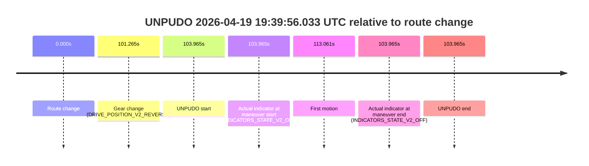
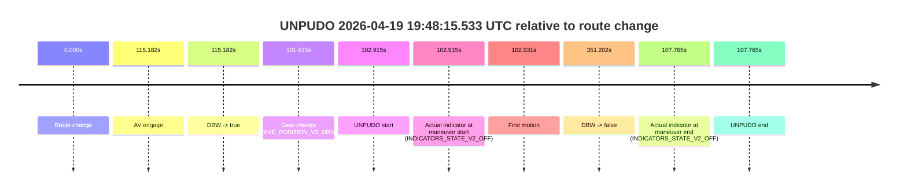
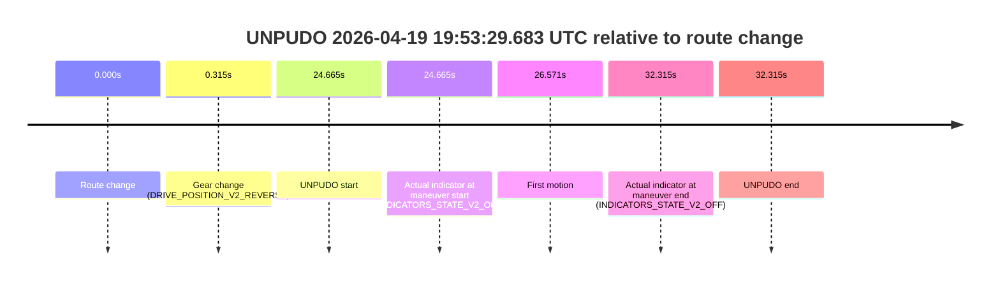
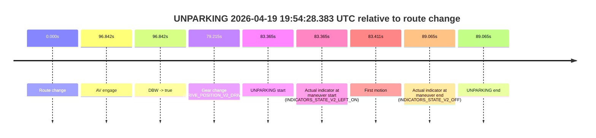

# Run Report: fme10003/2026-04-19--19-01-24--gen2-av-d03ace5e-a7f3-4575-b52f-a52764f5c68b

| Field | Value |
|---|---|
| Run ID | `fme10003/2026-04-19--19-01-24--gen2-av-d03ace5e-a7f3-4575-b52f-a52764f5c68b` |
| Date | `2026-04-19` |
| Model(s) | `apricot-crocodile-uproarious` |
| Author | `guy.geva` |
| Event count | `9` |

## unpudo 2026-04-19 19:10:57.633 UTC

| Field | Value |
|---|---|
| Model | `apricot-crocodile-uproarious` |
| Author | `guy.geva` |
| Run ID | `fme10003/2026-04-19--19-01-24--gen2-av-d03ace5e-a7f3-4575-b52f-a52764f5c68b` |
| Date | `2026-04-19` |
| Time (UTC) | `19:10:57.633` |
| Event type | `unpudo` |
| Disengagement type | `none observed` |
| Route change | `found` |
| Console | [run](https://console.sso.wayve.ai/run/fme10003/2026-04-19--19-01-24--gen2-av-d03ace5e-a7f3-4575-b52f-a52764f5c68b?id=&time-unixus=1776625857633292) |
| Foxglove | [segment](https://app.foxglove.dev/wayve-on-prem/p/prj_0dX18KZdVHg1fmmI/view?ds=foxglove-stream&ds.deviceName=fme10003&ds.start=2026-04-19T19%3A10%3A11.768292Z&ds.end=2026-04-19T19%3A14%3A03.221846Z&layoutId=lay_0e7VD4WIKDQGU73Y&time=2026-04-19T19%3A10%3A57.633292Z) |

### Event card: accidental

- Accidental: AV ownership is present for less than `2s`, so this is treated as an accidental brush with the maneuver rather than a meaningful model attempt.

| Event | Time (UTC) | Delta from route change |
|---|---:|---:|
| Route change | 2026-04-19 19:10:21.768 | `0.000s` |
| AV engage | 2026-04-19 19:11:15.480 | `53.712s` |
| DBW -> true | 2026-04-19 19:11:15.480 | `53.712s` |
| Gear change (DRIVE_POSITION_V2_REVERSE) | 2026-04-19 19:10:53.633 | `31.865s` |
| UNPUDO start | 2026-04-19 19:10:57.633 | `35.865s` |
| Actual indicator at maneuver start (INDICATORS_STATE_V2_OFF) | 2026-04-19 19:10:57.633 | `35.865s` |
| First motion | 2026-04-19 19:11:05.389 | `43.621s` |
| DBW -> false | 2026-04-19 19:13:53.221 | `211.454s` |
| Actual indicator at maneuver end (INDICATORS_STATE_V2_OFF) | 2026-04-19 19:11:12.683 | `50.915s` |
| UNPUDO end | 2026-04-19 19:11:12.683 | `50.915s` |

| Metric | Value |
|---|---|
| Outcome | `accidental` |
| Effective failure type | `none` |
| Route change status | `found` |
| DBW at event start | `false` |
| DBW at event end | `false` |
| Predicted gear at AV start | `DRIVE_POSITION_V2_DRIVE` |
| Actual gear at AV start | `DRIVE_POSITION_V2_DRIVE` |
| Predicted gear at event start | `DRIVE_POSITION_V2_REVERSE` |
| Actual gear at event start | `DRIVE_POSITION_V2_REVERSE` |
| Planned indicator direction | `INDICATORS_STATE_V2_LEFT_ON` |
| Controller indicator direction | `INDICATORS_STATE_V2_LEFT_ON` |
| Actual indicator direction | `INDICATORS_STATE_V2_OFF` |
| Actual indicator at maneuver end | `INDICATORS_STATE_V2_OFF` |
| Driver accel help in AV | `false` |
| Driver accel help timestamp | `n/a` |
| Max accel pedal pct in AV | `0.0%` |
| Max brake pedal pct in AV | `0.0%` |
| Max speed mps in AV | `0.000` |
| Route -> AV | `53.712s` |
| AV -> event start | `-17.847s` |
| AV -> first motion | `-10.091s` |
| AV duration before disengagement | `157.741s` |
| Trajectory waypoint count | `36` |
| Driving-plan step count | `11` |

The scored portion starts from the AV-owned window, not from the pre-AV setup. Route-change search in the stopped pre-event segment was `found`, with the baseline therefore set to route change. At the event anchor the model predicts `DRIVE_POSITION_V2_REVERSE` and the actual gear is `DRIVE_POSITION_V2_REVERSE`. The effective model outcome is `accidental` because `the AV-owned portion is shorter than 2s`.

### Resolution

| Field | Value |
|---|---|
| Final outcome | `accidental` |
| Do we agree with this label? | `yes` |
| Source disengagement type | `none observed` |
| Resolved effective failure type | `none` |
| Confidence | `high` |

## unpudo 2026-04-19 19:17:08.383 UTC

| Field | Value |
|---|---|
| Model | `apricot-crocodile-uproarious` |
| Author | `guy.geva` |
| Run ID | `fme10003/2026-04-19--19-01-24--gen2-av-d03ace5e-a7f3-4575-b52f-a52764f5c68b` |
| Date | `2026-04-19` |
| Time (UTC) | `19:17:08.383` |
| Event type | `unpudo` |
| Disengagement type | `failed_to_unpudo` |
| Route change | `found` |
| Console | [run](https://console.sso.wayve.ai/run/fme10003/2026-04-19--19-01-24--gen2-av-d03ace5e-a7f3-4575-b52f-a52764f5c68b?id=&time-unixus=1776626228383299) |
| Foxglove | [segment](https://app.foxglove.dev/wayve-on-prem/p/prj_0dX18KZdVHg1fmmI/view?ds=foxglove-stream&ds.deviceName=fme10003&ds.start=2026-04-19T19%3A16%3A28.268249Z&ds.end=2026-04-19T19%3A17%3A47.562320Z&layoutId=lay_0e7VD4WIKDQGU73Y&time=2026-04-19T19%3A17%3A08.383299Z) |

### Event card: accidental

- Accidental: AV ownership is present for less than `2s`, so this is treated as an accidental brush with the maneuver rather than a meaningful model attempt.

| Event | Time (UTC) | Delta from route change |
|---|---:|---:|
| Route change | 2026-04-19 19:16:38.268 | `0.000s` |
| AV engage | 2026-04-19 19:17:16.280 | `38.013s` |
| DBW -> true | 2026-04-19 19:17:16.280 | `38.013s` |
| Gear change (DRIVE_POSITION_V2_DRIVE) | 2026-04-19 19:16:38.483 | `0.215s` |
| UNPUDO start | 2026-04-19 19:17:08.383 | `30.115s` |
| Actual indicator at maneuver start (INDICATORS_STATE_V2_OFF) | 2026-04-19 19:17:08.383 | `30.115s` |
| First motion | 2026-04-19 19:17:08.429 | `30.161s` |
| DBW -> false | 2026-04-19 19:17:37.562 | `59.294s` |
| Actual indicator at maneuver end (INDICATORS_STATE_V2_OFF) | 2026-04-19 19:17:12.683 | `34.415s` |
| UNPUDO end | 2026-04-19 19:17:12.683 | `34.415s` |

| Metric | Value |
|---|---|
| Outcome | `accidental` |
| Effective failure type | `none` |
| Route change status | `found` |
| DBW at event start | `false` |
| DBW at event end | `false` |
| Predicted gear at AV start | `DRIVE_POSITION_V2_DRIVE` |
| Actual gear at AV start | `DRIVE_POSITION_V2_DRIVE` |
| Predicted gear at event start | `DRIVE_POSITION_V2_DRIVE` |
| Actual gear at event start | `DRIVE_POSITION_V2_DRIVE` |
| Planned indicator direction | `INDICATORS_STATE_V2_LEFT_ON` |
| Controller indicator direction | `INDICATORS_STATE_V2_LEFT_ON` |
| Actual indicator direction | `INDICATORS_STATE_V2_OFF` |
| Actual indicator at maneuver end | `INDICATORS_STATE_V2_OFF` |
| Driver accel help in AV | `false` |
| Driver accel help timestamp | `n/a` |
| Max accel pedal pct in AV | `0.0%` |
| Max brake pedal pct in AV | `0.0%` |
| Max speed mps in AV | `0.000` |
| Route -> AV | `38.013s` |
| AV -> event start | `-7.898s` |
| AV -> first motion | `-7.852s` |
| AV duration before disengagement | `21.281s` |
| Trajectory waypoint count | `37` |
| Driving-plan step count | `11` |

The scored portion starts from the AV-owned window, not from the pre-AV setup. Route-change search in the stopped pre-event segment was `found`, with the baseline therefore set to route change. At the event anchor the model predicts `DRIVE_POSITION_V2_DRIVE` and the actual gear is `DRIVE_POSITION_V2_DRIVE`. The effective model outcome is `accidental` because `the AV-owned portion is shorter than 2s`.

### Resolution

| Field | Value |
|---|---|
| Final outcome | `accidental` |
| Do we agree with this label? | `yes` |
| Source disengagement type | `failed_to_unpudo` |
| Resolved effective failure type | `none` |
| Confidence | `high` |

## unpudo 2026-04-19 19:18:30.333 UTC

| Field | Value |
|---|---|
| Model | `apricot-crocodile-uproarious` |
| Author | `guy.geva` |
| Run ID | `fme10003/2026-04-19--19-01-24--gen2-av-d03ace5e-a7f3-4575-b52f-a52764f5c68b` |
| Date | `2026-04-19` |
| Time (UTC) | `19:18:30.333` |
| Event type | `unpudo` |
| Disengagement type | `failed_to_unpudo` |
| Route change | `found` |
| Console | [run](https://console.sso.wayve.ai/run/fme10003/2026-04-19--19-01-24--gen2-av-d03ace5e-a7f3-4575-b52f-a52764f5c68b?id=&time-unixus=1776626310333304) |
| Foxglove | [segment](https://app.foxglove.dev/wayve-on-prem/p/prj_0dX18KZdVHg1fmmI/view?ds=foxglove-stream&ds.deviceName=fme10003&ds.start=2026-04-19T19%3A16%3A28.268249Z&ds.end=2026-04-19T19%3A19%3A44.800699Z&layoutId=lay_0e7VD4WIKDQGU73Y&time=2026-04-19T19%3A18%3A30.333304Z) |

### Event card: accidental

- Accidental: AV ownership is present for less than `2s`, so this is treated as an accidental brush with the maneuver rather than a meaningful model attempt.

| Event | Time (UTC) | Delta from route change |
|---|---:|---:|
| Route change | 2026-04-19 19:16:38.268 | `0.000s` |
| AV engage | 2026-04-19 19:18:53.642 | `135.374s` |
| DBW -> true | 2026-04-19 19:18:53.642 | `135.374s` |
| Gear change (DRIVE_POSITION_V2_REVERSE) | 2026-04-19 19:18:21.733 | `103.465s` |
| UNPUDO start | 2026-04-19 19:18:30.333 | `112.065s` |
| Actual indicator at maneuver start (INDICATORS_STATE_V2_OFF) | 2026-04-19 19:18:30.333 | `112.065s` |
| First motion | 2026-04-19 19:18:45.729 | `127.462s` |
| DBW -> false | 2026-04-19 19:19:34.800 | `176.532s` |
| Actual indicator at maneuver end (INDICATORS_STATE_V2_OFF) | 2026-04-19 19:18:50.833 | `132.565s` |
| UNPUDO end | 2026-04-19 19:18:50.833 | `132.565s` |

| Metric | Value |
|---|---|
| Outcome | `accidental` |
| Effective failure type | `none` |
| Route change status | `found` |
| DBW at event start | `false` |
| DBW at event end | `false` |
| Predicted gear at AV start | `DRIVE_POSITION_V2_DRIVE` |
| Actual gear at AV start | `DRIVE_POSITION_V2_DRIVE` |
| Predicted gear at event start | `DRIVE_POSITION_V2_REVERSE` |
| Actual gear at event start | `DRIVE_POSITION_V2_REVERSE` |
| Planned indicator direction | `INDICATORS_STATE_V2_OFF` |
| Controller indicator direction | `INDICATORS_STATE_V2_OFF` |
| Actual indicator direction | `INDICATORS_STATE_V2_OFF` |
| Actual indicator at maneuver end | `INDICATORS_STATE_V2_OFF` |
| Driver accel help in AV | `false` |
| Driver accel help timestamp | `n/a` |
| Max accel pedal pct in AV | `0.0%` |
| Max brake pedal pct in AV | `0.0%` |
| Max speed mps in AV | `0.000` |
| Route -> AV | `135.374s` |
| AV -> event start | `-23.309s` |
| AV -> first motion | `-7.912s` |
| AV duration before disengagement | `41.159s` |
| Trajectory waypoint count | `38` |
| Driving-plan step count | `11` |

The scored portion starts from the AV-owned window, not from the pre-AV setup. Route-change search in the stopped pre-event segment was `found`, with the baseline therefore set to route change. At the event anchor the model predicts `DRIVE_POSITION_V2_REVERSE` and the actual gear is `DRIVE_POSITION_V2_REVERSE`. The effective model outcome is `accidental` because `the AV-owned portion is shorter than 2s`.

### Resolution

| Field | Value |
|---|---|
| Final outcome | `accidental` |
| Do we agree with this label? | `yes` |
| Source disengagement type | `failed_to_unpudo` |
| Resolved effective failure type | `none` |
| Confidence | `high` |

## unpudo 2026-04-19 19:21:29.883 UTC

| Field | Value |
|---|---|
| Model | `apricot-crocodile-uproarious` |
| Author | `guy.geva` |
| Run ID | `fme10003/2026-04-19--19-01-24--gen2-av-d03ace5e-a7f3-4575-b52f-a52764f5c68b` |
| Date | `2026-04-19` |
| Time (UTC) | `19:21:29.883` |
| Event type | `unpudo` |
| Disengagement type | `failed_to_unpudo` |
| Route change | `found` |
| Console | [run](https://console.sso.wayve.ai/run/fme10003/2026-04-19--19-01-24--gen2-av-d03ace5e-a7f3-4575-b52f-a52764f5c68b?id=&time-unixus=1776626489883302) |
| Foxglove | [segment](https://app.foxglove.dev/wayve-on-prem/p/prj_0dX18KZdVHg1fmmI/view?ds=foxglove-stream&ds.deviceName=fme10003&ds.start=2026-04-19T19%3A21%3A10.468288Z&ds.end=2026-04-19T19%3A27%3A44.541860Z&layoutId=lay_0e7VD4WIKDQGU73Y&time=2026-04-19T19%3A21%3A29.883302Z) |

### Event card: accidental

- Accidental: AV ownership is present for less than `2s`, so this is treated as an accidental brush with the maneuver rather than a meaningful model attempt.

| Event | Time (UTC) | Delta from route change |
|---|---:|---:|
| Route change | 2026-04-19 19:21:20.468 | `0.000s` |
| AV engage | 2026-04-19 19:21:41.481 | `21.014s` |
| DBW -> true | 2026-04-19 19:21:41.481 | `21.014s` |
| Gear change (DRIVE_POSITION_V2_DRIVE) | 2026-04-19 19:21:20.833 | `0.365s` |
| UNPUDO start | 2026-04-19 19:21:29.883 | `9.415s` |
| Actual indicator at maneuver start (INDICATORS_STATE_V2_OFF) | 2026-04-19 19:21:29.883 | `9.415s` |
| First motion | 2026-04-19 19:21:29.909 | `9.441s` |
| DBW -> false | 2026-04-19 19:27:34.541 | `374.074s` |
| Actual indicator at maneuver end (INDICATORS_STATE_V2_OFF) | 2026-04-19 19:21:36.183 | `15.715s` |
| UNPUDO end | 2026-04-19 19:21:36.183 | `15.715s` |

| Metric | Value |
|---|---|
| Outcome | `accidental` |
| Effective failure type | `none` |
| Route change status | `found` |
| DBW at event start | `false` |
| DBW at event end | `false` |
| Predicted gear at AV start | `DRIVE_POSITION_V2_DRIVE` |
| Actual gear at AV start | `DRIVE_POSITION_V2_DRIVE` |
| Predicted gear at event start | `DRIVE_POSITION_V2_DRIVE` |
| Actual gear at event start | `DRIVE_POSITION_V2_DRIVE` |
| Planned indicator direction | `INDICATORS_STATE_V2_LEFT_ON` |
| Controller indicator direction | `INDICATORS_STATE_V2_LEFT_ON` |
| Actual indicator direction | `INDICATORS_STATE_V2_OFF` |
| Actual indicator at maneuver end | `INDICATORS_STATE_V2_OFF` |
| Driver accel help in AV | `false` |
| Driver accel help timestamp | `n/a` |
| Max accel pedal pct in AV | `0.0%` |
| Max brake pedal pct in AV | `0.0%` |
| Max speed mps in AV | `0.000` |
| Route -> AV | `21.014s` |
| AV -> event start | `-11.599s` |
| AV -> first motion | `-11.573s` |
| AV duration before disengagement | `353.060s` |
| Trajectory waypoint count | `37` |
| Driving-plan step count | `11` |

The scored portion starts from the AV-owned window, not from the pre-AV setup. Route-change search in the stopped pre-event segment was `found`, with the baseline therefore set to route change. At the event anchor the model predicts `DRIVE_POSITION_V2_DRIVE` and the actual gear is `DRIVE_POSITION_V2_DRIVE`. The effective model outcome is `accidental` because `the AV-owned portion is shorter than 2s`.

### Resolution

| Field | Value |
|---|---|
| Final outcome | `accidental` |
| Do we agree with this label? | `yes` |
| Source disengagement type | `failed_to_unpudo` |
| Resolved effective failure type | `none` |
| Confidence | `high` |

## unpudo 2026-04-19 19:36:27.733 UTC

| Field | Value |
|---|---|
| Model | `apricot-crocodile-uproarious` |
| Author | `guy.geva` |
| Run ID | `fme10003/2026-04-19--19-01-24--gen2-av-d03ace5e-a7f3-4575-b52f-a52764f5c68b` |
| Date | `2026-04-19` |
| Time (UTC) | `19:36:27.733` |
| Event type | `unpudo` |
| Disengagement type | `failed_to_unpudo` |
| Route change | `found` |
| Console | [run](https://console.sso.wayve.ai/run/fme10003/2026-04-19--19-01-24--gen2-av-d03ace5e-a7f3-4575-b52f-a52764f5c68b?id=&time-unixus=1776627387733323) |
| Foxglove | [segment](https://app.foxglove.dev/wayve-on-prem/p/prj_0dX18KZdVHg1fmmI/view?ds=foxglove-stream&ds.deviceName=fme10003&ds.start=2026-04-19T19%3A36%3A10.418326Z&ds.end=2026-04-19T19%3A37%3A45.102024Z&layoutId=lay_0e7VD4WIKDQGU73Y&time=2026-04-19T19%3A36%3A27.733323Z) |

### Event card: accidental

- Accidental: AV ownership is present for less than `2s`, so this is treated as an accidental brush with the maneuver rather than a meaningful model attempt.

| Event | Time (UTC) | Delta from route change |
|---|---:|---:|
| Route change | 2026-04-19 19:36:20.418 | `0.000s` |
| AV engage | 2026-04-19 19:36:33.740 | `13.322s` |
| DBW -> true | 2026-04-19 19:36:33.740 | `13.322s` |
| Gear change (DRIVE_POSITION_V2_DRIVE) | 2026-04-19 19:36:20.733 | `0.315s` |
| UNPUDO start | 2026-04-19 19:36:27.733 | `7.315s` |
| Actual indicator at maneuver start (INDICATORS_STATE_V2_LEFT_ON) | 2026-04-19 19:36:27.733 | `7.315s` |
| First motion | 2026-04-19 19:36:27.969 | `7.551s` |
| DBW -> false | 2026-04-19 19:37:35.102 | `74.684s` |
| Actual indicator at maneuver end (INDICATORS_STATE_V2_OFF) | 2026-04-19 19:36:33.433 | `13.015s` |
| UNPUDO end | 2026-04-19 19:36:33.433 | `13.015s` |

| Metric | Value |
|---|---|
| Outcome | `accidental` |
| Effective failure type | `none` |
| Route change status | `found` |
| DBW at event start | `false` |
| DBW at event end | `false` |
| Predicted gear at AV start | `DRIVE_POSITION_V2_DRIVE` |
| Actual gear at AV start | `DRIVE_POSITION_V2_DRIVE` |
| Predicted gear at event start | `DRIVE_POSITION_V2_DRIVE` |
| Actual gear at event start | `DRIVE_POSITION_V2_DRIVE` |
| Planned indicator direction | `INDICATORS_STATE_V2_LEFT_ON` |
| Controller indicator direction | `INDICATORS_STATE_V2_LEFT_ON` |
| Actual indicator direction | `INDICATORS_STATE_V2_LEFT_ON` |
| Actual indicator at maneuver end | `INDICATORS_STATE_V2_OFF` |
| Driver accel help in AV | `false` |
| Driver accel help timestamp | `n/a` |
| Max accel pedal pct in AV | `0.0%` |
| Max brake pedal pct in AV | `0.0%` |
| Max speed mps in AV | `0.000` |
| Route -> AV | `13.322s` |
| AV -> event start | `-6.007s` |
| AV -> first motion | `-5.772s` |
| AV duration before disengagement | `61.361s` |
| Trajectory waypoint count | `36` |
| Driving-plan step count | `11` |

The scored portion starts from the AV-owned window, not from the pre-AV setup. Route-change search in the stopped pre-event segment was `found`, with the baseline therefore set to route change. At the event anchor the model predicts `DRIVE_POSITION_V2_DRIVE` and the actual gear is `DRIVE_POSITION_V2_DRIVE`. The effective model outcome is `accidental` because `the AV-owned portion is shorter than 2s`.

### Resolution

| Field | Value |
|---|---|
| Final outcome | `accidental` |
| Do we agree with this label? | `yes` |
| Source disengagement type | `failed_to_unpudo` |
| Resolved effective failure type | `none` |
| Confidence | `high` |

## unpudo 2026-04-19 19:39:56.033 UTC

| Field | Value |
|---|---|
| Model | `apricot-crocodile-uproarious` |
| Author | `guy.geva` |
| Run ID | `fme10003/2026-04-19--19-01-24--gen2-av-d03ace5e-a7f3-4575-b52f-a52764f5c68b` |
| Date | `2026-04-19` |
| Time (UTC) | `19:39:56.033` |
| Event type | `unpudo` |
| Disengagement type | `none observed` |
| Route change | `found` |
| Console | [run](https://console.sso.wayve.ai/run/fme10003/2026-04-19--19-01-24--gen2-av-d03ace5e-a7f3-4575-b52f-a52764f5c68b?id=&time-unixus=1776627596033293) |
| Foxglove | [segment](https://app.foxglove.dev/wayve-on-prem/p/prj_0dX18KZdVHg1fmmI/view?ds=foxglove-stream&ds.deviceName=fme10003&ds.start=2026-04-19T19%3A38%3A02.068477Z&ds.end=2026-04-19T19%3A40%3A06.033293Z&layoutId=lay_0e7VD4WIKDQGU73Y&time=2026-04-19T19%3A39%3A56.033293Z) |

### Event card: non-av

- Non-AV: the detected unpudo starts outside AV ownership, so it is kept for coverage but excluded from model success / failure scoring.

| Event | Time (UTC) | Delta from route change |
|---|---:|---:|
| Route change | 2026-04-19 19:38:12.068 | `0.000s` |
| Gear change (DRIVE_POSITION_V2_REVERSE) | 2026-04-19 19:39:53.333 | `101.265s` |
| UNPUDO start | 2026-04-19 19:39:56.033 | `103.965s` |
| Actual indicator at maneuver start (INDICATORS_STATE_V2_OFF) | 2026-04-19 19:39:56.033 | `103.965s` |
| First motion | 2026-04-19 19:40:05.129 | `113.061s` |
| Actual indicator at maneuver end (INDICATORS_STATE_V2_OFF) | 2026-04-19 19:39:56.033 | `103.965s` |
| UNPUDO end | 2026-04-19 19:39:56.033 | `103.965s` |

| Metric | Value |
|---|---|
| Outcome | `non-av` |
| Effective failure type | `none` |
| Route change status | `found` |
| DBW at event start | `false` |
| DBW at event end | `false` |
| Predicted gear at AV start | `n/a` |
| Actual gear at AV start | `n/a` |
| Predicted gear at event start | `DRIVE_POSITION_V2_REVERSE` |
| Actual gear at event start | `DRIVE_POSITION_V2_REVERSE` |
| Planned indicator direction | `INDICATORS_STATE_V2_OFF` |
| Controller indicator direction | `INDICATORS_STATE_V2_OFF` |
| Actual indicator direction | `INDICATORS_STATE_V2_OFF` |
| Actual indicator at maneuver end | `INDICATORS_STATE_V2_OFF` |
| Driver accel help in AV | `false` |
| Driver accel help timestamp | `n/a` |
| Max accel pedal pct in AV | `0.0%` |
| Max brake pedal pct in AV | `0.0%` |
| Max speed mps in AV | `0.000` |
| Route -> AV | `n/a` |
| AV -> event start | `n/a` |
| AV -> first motion | `n/a` |
| AV duration before disengagement | `n/a` |
| Trajectory waypoint count | `36` |
| Driving-plan step count | `11` |

The scored portion starts from the AV-owned window, not from the pre-AV setup. Route-change search in the stopped pre-event segment was `found`, with the baseline therefore set to route change. At the event anchor the model predicts `DRIVE_POSITION_V2_REVERSE` and the actual gear is `DRIVE_POSITION_V2_REVERSE`. The effective model outcome is `non-av` because `the event does not begin in AV ownership`.

### Resolution

| Field | Value |
|---|---|
| Final outcome | `non-av` |
| Do we agree with this label? | `yes` |
| Source disengagement type | `none observed` |
| Resolved effective failure type | `none` |
| Confidence | `high` |

## unpudo 2026-04-19 19:48:15.533 UTC

| Field | Value |
|---|---|
| Model | `apricot-crocodile-uproarious` |
| Author | `guy.geva` |
| Run ID | `fme10003/2026-04-19--19-01-24--gen2-av-d03ace5e-a7f3-4575-b52f-a52764f5c68b` |
| Date | `2026-04-19` |
| Time (UTC) | `19:48:15.533` |
| Event type | `unpudo` |
| Disengagement type | `failed_to_unpudo` |
| Route change | `found` |
| Console | [run](https://console.sso.wayve.ai/run/fme10003/2026-04-19--19-01-24--gen2-av-d03ace5e-a7f3-4575-b52f-a52764f5c68b?id=&time-unixus=1776628095533311) |
| Foxglove | [segment](https://app.foxglove.dev/wayve-on-prem/p/prj_0dX18KZdVHg1fmmI/view?ds=foxglove-stream&ds.deviceName=fme10003&ds.start=2026-04-19T19%3A46%3A22.618268Z&ds.end=2026-04-19T19%3A52%3A33.820620Z&layoutId=lay_0e7VD4WIKDQGU73Y&time=2026-04-19T19%3A48%3A15.533311Z) |

### Event card: accidental

- Accidental: AV ownership is present for less than `2s`, so this is treated as an accidental brush with the maneuver rather than a meaningful model attempt.

| Event | Time (UTC) | Delta from route change |
|---|---:|---:|
| Route change | 2026-04-19 19:46:32.618 | `0.000s` |
| AV engage | 2026-04-19 19:48:27.800 | `115.182s` |
| DBW -> true | 2026-04-19 19:48:27.800 | `115.182s` |
| Gear change (DRIVE_POSITION_V2_DRIVE) | 2026-04-19 19:48:14.033 | `101.415s` |
| UNPUDO start | 2026-04-19 19:48:15.533 | `102.915s` |
| Actual indicator at maneuver start (INDICATORS_STATE_V2_OFF) | 2026-04-19 19:48:15.533 | `102.915s` |
| First motion | 2026-04-19 19:48:15.549 | `102.931s` |
| DBW -> false | 2026-04-19 19:52:23.820 | `351.202s` |
| Actual indicator at maneuver end (INDICATORS_STATE_V2_OFF) | 2026-04-19 19:48:20.383 | `107.765s` |
| UNPUDO end | 2026-04-19 19:48:20.383 | `107.765s` |

| Metric | Value |
|---|---|
| Outcome | `accidental` |
| Effective failure type | `none` |
| Route change status | `found` |
| DBW at event start | `false` |
| DBW at event end | `false` |
| Predicted gear at AV start | `DRIVE_POSITION_V2_DRIVE` |
| Actual gear at AV start | `DRIVE_POSITION_V2_DRIVE` |
| Predicted gear at event start | `DRIVE_POSITION_V2_DRIVE` |
| Actual gear at event start | `DRIVE_POSITION_V2_DRIVE` |
| Planned indicator direction | `INDICATORS_STATE_V2_LEFT_ON` |
| Controller indicator direction | `INDICATORS_STATE_V2_LEFT_ON` |
| Actual indicator direction | `INDICATORS_STATE_V2_OFF` |
| Actual indicator at maneuver end | `INDICATORS_STATE_V2_OFF` |
| Driver accel help in AV | `false` |
| Driver accel help timestamp | `n/a` |
| Max accel pedal pct in AV | `0.0%` |
| Max brake pedal pct in AV | `0.0%` |
| Max speed mps in AV | `0.000` |
| Route -> AV | `115.182s` |
| AV -> event start | `-12.267s` |
| AV -> first motion | `-12.252s` |
| AV duration before disengagement | `236.020s` |
| Trajectory waypoint count | `36` |
| Driving-plan step count | `11` |

The scored portion starts from the AV-owned window, not from the pre-AV setup. Route-change search in the stopped pre-event segment was `found`, with the baseline therefore set to route change. At the event anchor the model predicts `DRIVE_POSITION_V2_DRIVE` and the actual gear is `DRIVE_POSITION_V2_DRIVE`. The effective model outcome is `accidental` because `the AV-owned portion is shorter than 2s`.

### Resolution

| Field | Value |
|---|---|
| Final outcome | `accidental` |
| Do we agree with this label? | `yes` |
| Source disengagement type | `failed_to_unpudo` |
| Resolved effective failure type | `none` |
| Confidence | `high` |

## unpudo 2026-04-19 19:53:29.683 UTC

| Field | Value |
|---|---|
| Model | `apricot-crocodile-uproarious` |
| Author | `guy.geva` |
| Run ID | `fme10003/2026-04-19--19-01-24--gen2-av-d03ace5e-a7f3-4575-b52f-a52764f5c68b` |
| Date | `2026-04-19` |
| Time (UTC) | `19:53:29.683` |
| Event type | `unpudo` |
| Disengagement type | `failed_to_accelerate` |
| Route change | `found` |
| Console | [run](https://console.sso.wayve.ai/run/fme10003/2026-04-19--19-01-24--gen2-av-d03ace5e-a7f3-4575-b52f-a52764f5c68b?id=&time-unixus=1776628409683300) |
| Foxglove | [segment](https://app.foxglove.dev/wayve-on-prem/p/prj_0dX18KZdVHg1fmmI/view?ds=foxglove-stream&ds.deviceName=fme10003&ds.start=2026-04-19T19%3A52%3A55.018239Z&ds.end=2026-04-19T19%3A53%3A47.333308Z&layoutId=lay_0e7VD4WIKDQGU73Y&time=2026-04-19T19%3A53%3A29.683300Z) |

### Event card: non-av

- Non-AV: the detected unpudo starts outside AV ownership, so it is kept for coverage but excluded from model success / failure scoring.

| Event | Time (UTC) | Delta from route change |
|---|---:|---:|
| Route change | 2026-04-19 19:53:05.018 | `0.000s` |
| Gear change (DRIVE_POSITION_V2_REVERSE) | 2026-04-19 19:53:05.333 | `0.315s` |
| UNPUDO start | 2026-04-19 19:53:29.683 | `24.665s` |
| Actual indicator at maneuver start (INDICATORS_STATE_V2_OFF) | 2026-04-19 19:53:29.683 | `24.665s` |
| First motion | 2026-04-19 19:53:31.589 | `26.571s` |
| Actual indicator at maneuver end (INDICATORS_STATE_V2_OFF) | 2026-04-19 19:53:37.333 | `32.315s` |
| UNPUDO end | 2026-04-19 19:53:37.333 | `32.315s` |

| Metric | Value |
|---|---|
| Outcome | `non-av` |
| Effective failure type | `none` |
| Route change status | `found` |
| DBW at event start | `false` |
| DBW at event end | `false` |
| Predicted gear at AV start | `n/a` |
| Actual gear at AV start | `n/a` |
| Predicted gear at event start | `DRIVE_POSITION_V2_REVERSE` |
| Actual gear at event start | `DRIVE_POSITION_V2_REVERSE` |
| Planned indicator direction | `INDICATORS_STATE_V2_LEFT_ON` |
| Controller indicator direction | `INDICATORS_STATE_V2_LEFT_ON` |
| Actual indicator direction | `INDICATORS_STATE_V2_OFF` |
| Actual indicator at maneuver end | `INDICATORS_STATE_V2_OFF` |
| Driver accel help in AV | `false` |
| Driver accel help timestamp | `n/a` |
| Max accel pedal pct in AV | `0.0%` |
| Max brake pedal pct in AV | `0.0%` |
| Max speed mps in AV | `0.000` |
| Route -> AV | `n/a` |
| AV -> event start | `n/a` |
| AV -> first motion | `n/a` |
| AV duration before disengagement | `n/a` |
| Trajectory waypoint count | `37` |
| Driving-plan step count | `11` |

The scored portion starts from the AV-owned window, not from the pre-AV setup. Route-change search in the stopped pre-event segment was `found`, with the baseline therefore set to route change. At the event anchor the model predicts `DRIVE_POSITION_V2_REVERSE` and the actual gear is `DRIVE_POSITION_V2_REVERSE`. The effective model outcome is `non-av` because `the event does not begin in AV ownership`.

### Resolution

| Field | Value |
|---|---|
| Final outcome | `non-av` |
| Do we agree with this label? | `yes` |
| Source disengagement type | `failed_to_accelerate` |
| Resolved effective failure type | `none` |
| Confidence | `high` |

## unparking 2026-04-19 19:54:28.383 UTC

| Field | Value |
|---|---|
| Model | `apricot-crocodile-uproarious` |
| Author | `guy.geva` |
| Run ID | `fme10003/2026-04-19--19-01-24--gen2-av-d03ace5e-a7f3-4575-b52f-a52764f5c68b` |
| Date | `2026-04-19` |
| Time (UTC) | `19:54:28.383` |
| Event type | `unparking` |
| Disengagement type | `none observed` |
| Route change | `found` |
| Console | [run](https://console.sso.wayve.ai/run/fme10003/2026-04-19--19-01-24--gen2-av-d03ace5e-a7f3-4575-b52f-a52764f5c68b?id=&time-unixus=1776628468383317) |
| Foxglove | [segment](https://app.foxglove.dev/wayve-on-prem/p/prj_0dX18KZdVHg1fmmI/view?ds=foxglove-stream&ds.deviceName=fme10003&ds.start=2026-04-19T19%3A52%3A55.018239Z&ds.end=2026-04-19T19%3A54%3A44.083290Z&layoutId=lay_0e7VD4WIKDQGU73Y&time=2026-04-19T19%3A54%3A28.383317Z) |

### Event card: accidental

- Accidental: AV ownership is present for less than `2s`, so this is treated as an accidental brush with the maneuver rather than a meaningful model attempt.

| Event | Time (UTC) | Delta from route change |
|---|---:|---:|
| Route change | 2026-04-19 19:53:05.018 | `0.000s` |
| AV engage | 2026-04-19 19:54:41.860 | `96.842s` |
| DBW -> true | 2026-04-19 19:54:41.860 | `96.842s` |
| Gear change (DRIVE_POSITION_V2_DRIVE) | 2026-04-19 19:54:24.233 | `79.215s` |
| UNPARKING start | 2026-04-19 19:54:28.383 | `83.365s` |
| Actual indicator at maneuver start (INDICATORS_STATE_V2_LEFT_ON) | 2026-04-19 19:54:28.383 | `83.365s` |
| First motion | 2026-04-19 19:54:28.429 | `83.411s` |
| Actual indicator at maneuver end (INDICATORS_STATE_V2_OFF) | 2026-04-19 19:54:34.083 | `89.065s` |
| UNPARKING end | 2026-04-19 19:54:34.083 | `89.065s` |

| Metric | Value |
|---|---|
| Outcome | `accidental` |
| Effective failure type | `none` |
| Route change status | `found` |
| DBW at event start | `false` |
| DBW at event end | `false` |
| Predicted gear at AV start | `DRIVE_POSITION_V2_DRIVE` |
| Actual gear at AV start | `DRIVE_POSITION_V2_DRIVE` |
| Predicted gear at event start | `DRIVE_POSITION_V2_DRIVE` |
| Actual gear at event start | `DRIVE_POSITION_V2_DRIVE` |
| Planned indicator direction | `INDICATORS_STATE_V2_LEFT_ON` |
| Controller indicator direction | `INDICATORS_STATE_V2_LEFT_ON` |
| Actual indicator direction | `INDICATORS_STATE_V2_LEFT_ON` |
| Actual indicator at maneuver end | `INDICATORS_STATE_V2_OFF` |
| Driver accel help in AV | `false` |
| Driver accel help timestamp | `n/a` |
| Max accel pedal pct in AV | `0.0%` |
| Max brake pedal pct in AV | `0.0%` |
| Max speed mps in AV | `0.000` |
| Route -> AV | `96.842s` |
| AV -> event start | `-13.477s` |
| AV -> first motion | `-13.431s` |
| AV duration before disengagement | `n/a` |
| Trajectory waypoint count | `37` |
| Driving-plan step count | `11` |

The scored portion starts from the AV-owned window, not from the pre-AV setup. Route-change search in the stopped pre-event segment was `found`, with the baseline therefore set to route change. At the event anchor the model predicts `DRIVE_POSITION_V2_DRIVE` and the actual gear is `DRIVE_POSITION_V2_DRIVE`. The effective model outcome is `accidental` because `the AV-owned portion is shorter than 2s`.

### Resolution

| Field | Value |
|---|---|
| Final outcome | `accidental` |
| Do we agree with this label? | `yes` |
| Source disengagement type | `none observed` |
| Resolved effective failure type | `none` |
| Confidence | `high` |
