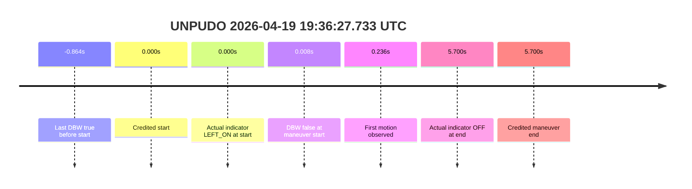
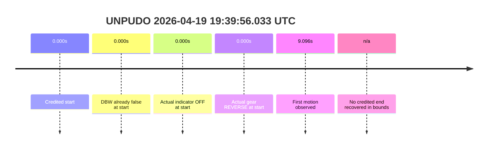
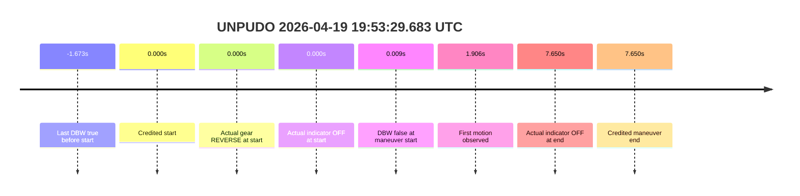
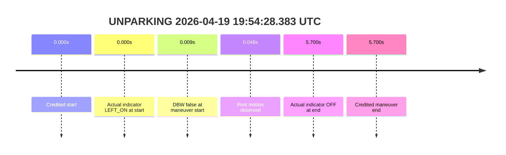

# Run Report: fme10003/2026-04-19--19-01-24--gen2-av-d03ace5e-a7f3-4575-b52f-a52764f5c68b

| Field | Value |
|---|---|
| Run ID | `fme10003/2026-04-19--19-01-24--gen2-av-d03ace5e-a7f3-4575-b52f-a52764f5c68b` |
| Date | `2026-04-19` |
| Model(s) | `apricot-crocodile-uproarious` |
| Author | `guy.geva` |
| Event count | `5` |
| Outcome summary | `0 pass / 5 fail` |
| Route-change summary | `0 found / 5 not found / 0 unclear` |

## unpudo 2026-04-19 19:36:27.733 UTC

| Field | Value |
|---|---|
| Model | `apricot-crocodile-uproarious` |
| Author | `guy.geva` |
| Run ID | `fme10003/2026-04-19--19-01-24--gen2-av-d03ace5e-a7f3-4575-b52f-a52764f5c68b` |
| Date | `2026-04-19` |
| Time (UTC) | `2026-04-19 19:36:27.733` |
| Event type | `unpudo` |
| Disengagement type | `failed_to_unpudo` (`gear_to_start`) |
| Console | [run](https://console.sso.wayve.ai/run/fme10003/2026-04-19--19-01-24--gen2-av-d03ace5e-a7f3-4575-b52f-a52764f5c68b?id=&time-unixus=1776627387733323) |
| Foxglove | [segment](https://app.foxglove.dev/wayve-on-prem/p/prj_0dX18KZdVHg1fmmI/view?ds=foxglove-stream&ds.deviceName=fme10003&ds.end=2026-04-19T19%3A36%3A48.433298Z&ds.start=2026-04-19T19%3A35%3A42.733323Z&layoutId=lay_0e7VD4WIKDQGU73Y&time=2026-04-19T19%3A36%3A27.733323Z) |

- Fail: the credited UNPUDO starts after the DBW boundary has already dropped out, so the model does not own the maneuver. Route-change search in the stopped pre-event segment was not recovered; the cached navigation stays routed with the same 4-step destination trace.

| Event | Time (UTC) | Delta from event start | Note |
|---|---|---:|---|
| Route-change search | not found | searched before event | stopped pre-event segment stayed `ROUTE_STATE_ROUTED` with 4 steps |
| Last DBW true before start | 2026-04-19 19:36:26.869 | `-0.864s` | `controller_is_dbw=true` |
| DBW false at maneuver start | 2026-04-19 19:36:27.741 | `+0.008s` | boundary straddles the anchor; credited start is not AV-owned |
| Credited maneuver start | 2026-04-19 19:36:27.733 | `0.000s` | event anchor |
| Predicted gear at start | `DRIVE_POSITION_V2_DRIVE` | `0.000s` | plan agrees on gear, but ownership does not |
| Actual gear at start | `DRIVE_POSITION_V2_DRIVE` | `0.000s` | vehicle already in `DRIVE` |
| Planned indicator at start | `INDICATORS_STATE_V2_OFF` | `0.000s` | plan stays off |
| Actual indicator at start | `INDICATORS_STATE_V2_LEFT_ON` | `0.000s` | actual switch is left on at the anchor |
| First motion observed | 2026-04-19 19:36:27.969 | `+0.236s` | vehicle begins moving after the anchor |
| Actual indicator at maneuver end | `INDICATORS_STATE_V2_OFF` | `+5.700s` | cleared by the credited end |
| Credited maneuver end | 2026-04-19 19:36:33.433 | `+5.700s` | event boundary |

| Metric | Value |
|---|---|
| Validated route reassignment | `false` |
| Route-change status | `not found` |
| Controller DBW at event start | `false` |
| Predicted gear at event start | `DRIVE_POSITION_V2_DRIVE` |
| Actual gear at event start | `DRIVE_POSITION_V2_DRIVE` |
| Planned indicator at event start | `INDICATORS_STATE_V2_OFF` |
| Actual indicator at event start | `INDICATORS_STATE_V2_LEFT_ON` |
| Actual indicator at event end | `INDICATORS_STATE_V2_OFF` |
| Driver accel help in maneuver window | `false` |
| Max accel pedal | `0.0%` |
| Max brake pedal | `0.0%` |
| Max speed | `3.793 m/s` |
| Trajectory waypoint count at anchor | `37` |
| Trajectory driving-plan step count at anchor | `11` |
| Main disengagement flag | `0` |
| Gear-to-start disengagement | `1` |
| Before-gearchange-10s disengagement | `0` |

The packet shows the model was already out of DBW at the credited start, so this is scored as a non-AV failure even though the predicted and actual gear both read `DRIVE`.

### Resolution

| Field | Value |
|---|---|
| Final outcome | `fail` |
| Do we agree with this label? | `yes` |
| Source disengagement type | `failed_to_unpudo` |
| Resolved effective failure type | `completed_outside_av` |
| Confidence | `high` |

## unpudo 2026-04-19 19:39:56.033 UTC

| Field | Value |
|---|---|
| Model | `apricot-crocodile-uproarious` |
| Author | `guy.geva` |
| Run ID | `fme10003/2026-04-19--19-01-24--gen2-av-d03ace5e-a7f3-4575-b52f-a52764f5c68b` |
| Date | `2026-04-19` |
| Time (UTC) | `2026-04-19 19:39:56.033` |
| Event type | `unpudo` |
| Disengagement type | `none observed` |
| Console | [run](https://console.sso.wayve.ai/run/fme10003/2026-04-19--19-01-24--gen2-av-d03ace5e-a7f3-4575-b52f-a52764f5c68b?id=&time-unixus=1776627596033293) |
| Foxglove | [segment](https://app.foxglove.dev/wayve-on-prem/p/prj_0dX18KZdVHg1fmmI/view?ds=foxglove-stream&ds.deviceName=fme10003&ds.end=2026-04-19T19%3A40%3A16.033293Z&ds.start=2026-04-19T19%3A39%3A11.033293Z&layoutId=lay_0e7VD4WIKDQGU73Y&time=2026-04-19T19%3A39%3A56.033293Z) |

- Fail: the credited UNPUDO never becomes AV-owned. DBW is already false at the anchor, the maneuver starts in manual reverse, and route-change recovery in the stopped pre-event segment did not find a new reassignment.

| Event | Time (UTC) | Delta from event start | Note |
|---|---|---:|---|
| Route-change search | not found | searched before event | stopped pre-event segment stayed routed with 4 steps |
| Last DBW true before start | not recovered | pre-event window | no AV-owned start recovered in the cached samples |
| DBW false at maneuver start | 2026-04-19 19:39:56.040 | `+0.007s` | already manual at the anchor |
| Credited maneuver start | 2026-04-19 19:39:56.033 | `0.000s` | event anchor |
| Predicted gear at start | `DRIVE_POSITION_V2_DRIVE` | `0.000s` | plan stays in `DRIVE` |
| Actual gear at start | `DRIVE_POSITION_V2_REVERSE` | `0.000s` | actual vehicle is still in reverse |
| Planned indicator at start | `INDICATORS_STATE_V2_OFF` | `0.000s` | plan is off |
| Actual indicator at start | `INDICATORS_STATE_V2_OFF` | `0.000s` | switch is off |
| First motion observed | 2026-04-19 19:40:05.129 | `+9.096s` | first moving sample in the cached window |
| Actual indicator at maneuver end | `not found in bounds` | `n/a` | event has no recovered boundary timestamp |
| Credited maneuver end | `not found in bounds` | `n/a` | `event_startOrEnd_method = not_found_in_bounds` |

| Metric | Value |
|---|---|
| Validated route reassignment | `false` |
| Route-change status | `not found` |
| Controller DBW at event start | `false` |
| Predicted gear at event start | `DRIVE_POSITION_V2_DRIVE` |
| Actual gear at event start | `DRIVE_POSITION_V2_REVERSE` |
| Planned indicator at event start | `INDICATORS_STATE_V2_OFF` |
| Actual indicator at event start | `INDICATORS_STATE_V2_OFF` |
| Actual indicator at event end | `unavailable` |
| Driver accel help in maneuver window | `false` |
| Max accel pedal | `0.0%` |
| Max brake pedal | `0.0%` |
| Max speed | `3.850 m/s` |
| Trajectory waypoint count at anchor | `37` |
| Trajectory driving-plan step count at anchor | `11` |
| Main disengagement flag | `0` |
| Gear-to-start disengagement | `0` |
| Before-gearchange-10s disengagement | `0` |

This is a clean scoring fail for model analysis because there is no AV-owned credited maneuver at all. The cached packet does not recover an end boundary, so the right failure framing is that the maneuver is not analyzable as an AV-owned success.

### Resolution

| Field | Value |
|---|---|
| Final outcome | `fail` |
| Do we agree with this label? | `yes` |
| Source disengagement type | `none observed` |
| Resolved effective failure type | `not_found_in_bounds` |
| Confidence | `high` |

## unpudo 2026-04-19 19:48:15.533 UTC

| Field | Value |
|---|---|
| Model | `apricot-crocodile-uproarious` |
| Author | `guy.geva` |
| Run ID | `fme10003/2026-04-19--19-01-24--gen2-av-d03ace5e-a7f3-4575-b52f-a52764f5c68b` |
| Date | `2026-04-19` |
| Time (UTC) | `2026-04-19 19:48:15.533` |
| Event type | `unpudo` |
| Disengagement type | `failed_to_unpudo` (`before_gearchange_10s`) |
| Console | [run](https://console.sso.wayve.ai/run/fme10003/2026-04-19--19-01-24--gen2-av-d03ace5e-a7f3-4575-b52f-a52764f5c68b?id=&time-unixus=1776628095533311) |
| Foxglove | [segment](https://app.foxglove.dev/wayve-on-prem/p/prj_0dX18KZdVHg1fmmI/view?ds=foxglove-stream&ds.deviceName=fme10003&ds.end=2026-04-19T19%3A48%3A35.383302Z&ds.start=2026-04-19T19%3A47%3A30.533311Z&layoutId=lay_0e7VD4WIKDQGU73Y&time=2026-04-19T19%3A48%3A15.533311Z) |

- Fail: the credited UNPUDO starts after DBW has already dropped false. The model predicts `DRIVE`, but the actual start is already manual, so this is scored as a completed-outside-AV failure rather than a model-owned maneuver failure.

| Event | Time (UTC) | Delta from event start | Note |
|---|---|---:|---|
| Route-change search | not found | searched before event | stopped pre-event segment stayed routed with 4 steps |
| Last DBW true before start | 2026-04-19 19:48:07.750 | `-7.783s` | last AV-owned sample before the handoff |
| DBW false at maneuver start | 2026-04-19 19:48:15.540 | `+0.007s` | already manual at the anchor |
| Credited maneuver start | 2026-04-19 19:48:15.533 | `0.000s` | event anchor |
| Predicted gear at start | `DRIVE_POSITION_V2_DRIVE` | `0.000s` | plan stays in `DRIVE` |
| Actual gear at start | `DRIVE_POSITION_V2_DRIVE` | `0.000s` | vehicle is already in `DRIVE` |
| Planned indicator at start | `INDICATORS_STATE_V2_OFF` | `0.000s` | plan is off |
| Actual indicator at start | `INDICATORS_STATE_V2_OFF` | `0.000s` | switch is off |
| First motion observed | 2026-04-19 19:48:15.549 | `+0.016s` | movement begins immediately after the anchor |
| Actual indicator at maneuver end | `INDICATORS_STATE_V2_OFF` | `+4.850s` | cleared by the credited end |
| Credited maneuver end | 2026-04-19 19:48:20.383 | `+4.850s` | event boundary |

| Metric | Value |
|---|---|
| Validated route reassignment | `false` |
| Route-change status | `not found` |
| Controller DBW at event start | `false` |
| Predicted gear at event start | `DRIVE_POSITION_V2_DRIVE` |
| Actual gear at event start | `DRIVE_POSITION_V2_DRIVE` |
| Planned indicator at event start | `INDICATORS_STATE_V2_OFF` |
| Actual indicator at event start | `INDICATORS_STATE_V2_OFF` |
| Actual indicator at event end | `INDICATORS_STATE_V2_OFF` |
| Driver accel help in maneuver window | `false` |
| Max accel pedal | `0.0%` |
| Max brake pedal | `0.0%` |
| Max speed | `3.878 m/s` |
| Trajectory waypoint count at anchor | `37` |
| Trajectory driving-plan step count at anchor | `11` |
| Main disengagement flag | `0` |
| Gear-to-start disengagement | `0` |
| Before-gearchange-10s disengagement | `1` |

The gear prediction is correct, but it lands outside the owned segment. Because DBW is already false at the credited start, this remains a fail for model-performance scoring.

### Resolution

| Field | Value |
|---|---|
| Final outcome | `fail` |
| Do we agree with this label? | `yes` |
| Source disengagement type | `failed_to_unpudo` |
| Resolved effective failure type | `completed_outside_av` |
| Confidence | `high` |

## unpudo 2026-04-19 19:53:29.683 UTC

| Field | Value |
|---|---|
| Model | `apricot-crocodile-uproarious` |
| Author | `guy.geva` |
| Run ID | `fme10003/2026-04-19--19-01-24--gen2-av-d03ace5e-a7f3-4575-b52f-a52764f5c68b` |
| Date | `2026-04-19` |
| Time (UTC) | `2026-04-19 19:53:29.683` |
| Event type | `unpudo` |
| Disengagement type | `failed_to_accelerate` (`gear_to_start`) |
| Console | [run](https://console.sso.wayve.ai/run/fme10003/2026-04-19--19-01-24--gen2-av-d03ace5e-a7f3-4575-b52f-a52764f5c68b?id=&time-unixus=1776628409683300) |
| Foxglove | [segment](https://app.foxglove.dev/wayve-on-prem/p/prj_0dX18KZdVHg1fmmI/view?ds=foxglove-stream&ds.deviceName=fme10003&ds.end=2026-04-19T19%3A53%3A52.333308Z&ds.start=2026-04-19T19%3A52%3A44.683300Z&layoutId=lay_0e7VD4WIKDQGU73Y&time=2026-04-19T19%3A53%3A29.683300Z) |

- Fail: the credited UNPUDO is not AV-owned. DBW is already false at the anchor, the actual vehicle starts in reverse, and the route-change search does not recover a new assignment in the stopped pre-event segment.

| Event | Time (UTC) | Delta from event start | Note |
|---|---|---:|---|
| Route-change search | not found | searched before event | stopped pre-event segment stayed routed with 4 steps |
| Last DBW true before start | 2026-04-19 19:53:28.010 | `-1.673s` | last AV-owned sample before the handoff |
| DBW false at maneuver start | 2026-04-19 19:53:29.692 | `+0.009s` | already manual at the anchor |
| Credited maneuver start | 2026-04-19 19:53:29.683 | `0.000s` | event anchor |
| Predicted gear at start | `DRIVE_POSITION_V2_DRIVE` | `0.000s` | plan says `DRIVE` |
| Actual gear at start | `DRIVE_POSITION_V2_REVERSE` | `0.000s` | vehicle is still in reverse |
| Planned indicator at start | `INDICATORS_STATE_V2_OFF` | `0.000s` | plan is off |
| Actual indicator at start | `INDICATORS_STATE_V2_OFF` | `0.000s` | switch is off |
| First motion observed | 2026-04-19 19:53:31.589 | `+1.906s` | first moving sample after the anchor |
| Actual indicator at maneuver end | `INDICATORS_STATE_V2_OFF` | `+7.650s` | cleared by the credited end |
| Credited maneuver end | 2026-04-19 19:53:37.333 | `+7.650s` | event boundary |

| Metric | Value |
|---|---|
| Validated route reassignment | `false` |
| Route-change status | `not found` |
| Controller DBW at event start | `false` |
| Predicted gear at event start | `DRIVE_POSITION_V2_DRIVE` |
| Actual gear at event start | `DRIVE_POSITION_V2_REVERSE` |
| Planned indicator at event start | `INDICATORS_STATE_V2_OFF` |
| Actual indicator at event start | `INDICATORS_STATE_V2_OFF` |
| Actual indicator at event end | `INDICATORS_STATE_V2_OFF` |
| Driver accel help in maneuver window | `false` |
| Max accel pedal | `0.0%` |
| Max brake pedal | `0.0%` |
| Max speed | `3.803 m/s` |
| Trajectory waypoint count at anchor | `37` |
| Trajectory driving-plan step count at anchor | `11` |
| Main disengagement flag | `0` |
| Gear-to-start disengagement | `1` |
| Before-gearchange-10s disengagement | `0` |

The model starts from the wrong actual gear and it starts outside AV ownership, so there is no case for a pass here. This is a completed-outside-AV fail.

### Resolution

| Field | Value |
|---|---|
| Final outcome | `fail` |
| Do we agree with this label? | `yes` |
| Source disengagement type | `failed_to_accelerate` |
| Resolved effective failure type | `completed_outside_av` |
| Confidence | `high` |

## unparking 2026-04-19 19:54:28.383 UTC

| Field | Value |
|---|---|
| Model | `apricot-crocodile-uproarious` |
| Author | `guy.geva` |
| Run ID | `fme10003/2026-04-19--19-01-24--gen2-av-d03ace5e-a7f3-4575-b52f-a52764f5c68b` |
| Date | `2026-04-19` |
| Time (UTC) | `2026-04-19 19:54:28.383` |
| Event type | `unparking` |
| Disengagement type | `none observed` |
| Console | [run](https://console.sso.wayve.ai/run/fme10003/2026-04-19--19-01-24--gen2-av-d03ace5e-a7f3-4575-b52f-a52764f5c68b?id=&time-unixus=1776628468383317) |
| Foxglove | [segment](https://app.foxglove.dev/wayve-on-prem/p/prj_0dX18KZdVHg1fmmI/view?ds=foxglove-stream&ds.deviceName=fme10003&ds.end=2026-04-19T19%3A54%3A49.083290Z&ds.start=2026-04-19T19%3A53%3A43.383317Z&layoutId=lay_0e7VD4WIKDQGU73Y&time=2026-04-19T19%3A54%3A28.383317Z) |

- Fail: the credited unparking starts outside AV. The vehicle is manual at the anchor, the route search does not recover a new assignment in the stopped pre-event segment, and the maneuver is not model-owned even though the vehicle proceeds to move.

| Event | Time (UTC) | Delta from event start | Note |
|---|---|---:|---|
| Route-change search | not found | searched before event | stopped pre-event segment stayed routed with 4 steps |
| Last DBW true before start | not recovered | pre-event window | no AV-owned start recovered in the cached samples |
| DBW false at maneuver start | 2026-04-19 19:54:28.392 | `+0.009s` | already manual at the anchor |
| Credited maneuver start | 2026-04-19 19:54:28.383 | `0.000s` | event anchor |
| Predicted gear at start | `DRIVE_POSITION_V2_DRIVE` | `0.000s` | plan says `DRIVE` |
| Actual gear at start | `DRIVE_POSITION_V2_DRIVE` | `0.000s` | vehicle is already in `DRIVE` |
| Planned indicator at start | `INDICATORS_STATE_V2_OFF` | `0.000s` | plan is off |
| Actual indicator at start | `INDICATORS_STATE_V2_LEFT_ON` | `0.000s` | actual switch is left on |
| First motion observed | 2026-04-19 19:54:28.429 | `+0.046s` | vehicle starts moving after the anchor |
| Actual indicator at maneuver end | `INDICATORS_STATE_V2_OFF` | `+5.700s` | cleared by the credited end |
| Credited maneuver end | 2026-04-19 19:54:34.083 | `+5.700s` | event boundary |

| Metric | Value |
|---|---|
| Validated route reassignment | `false` |
| Route-change status | `not found` |
| Controller DBW at event start | `false` |
| Predicted gear at event start | `DRIVE_POSITION_V2_DRIVE` |
| Actual gear at event start | `DRIVE_POSITION_V2_DRIVE` |
| Planned indicator at event start | `INDICATORS_STATE_V2_OFF` |
| Actual indicator at event start | `INDICATORS_STATE_V2_LEFT_ON` |
| Actual indicator at event end | `INDICATORS_STATE_V2_OFF` |
| Driver accel help in maneuver window | `false` |
| Max accel pedal | `0.0%` |
| Max brake pedal | `0.0%` |
| Max speed | `3.969 m/s` |
| Trajectory waypoint count at anchor | `37` |
| Trajectory driving-plan step count at anchor | `11` |
| Main disengagement flag | `0` |
| Gear-to-start disengagement | `0` |
| Before-gearchange-10s disengagement | `0` |

The vehicle can still move, but the credited unparking is not AV-owned, so model-performance scoring remains a fail.

### Resolution

| Field | Value |
|---|---|
| Final outcome | `fail` |
| Do we agree with this label? | `yes` |
| Source disengagement type | `none observed` |
| Resolved effective failure type | `completed_outside_av` |
| Confidence | `high` |
