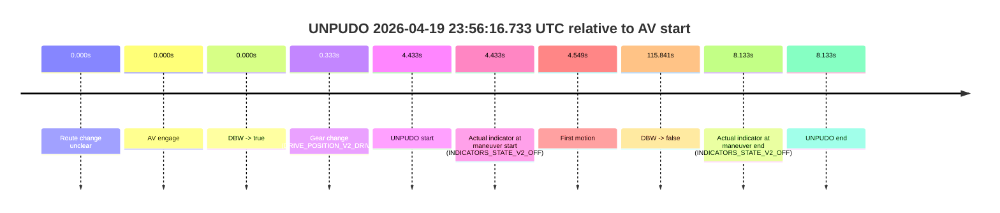
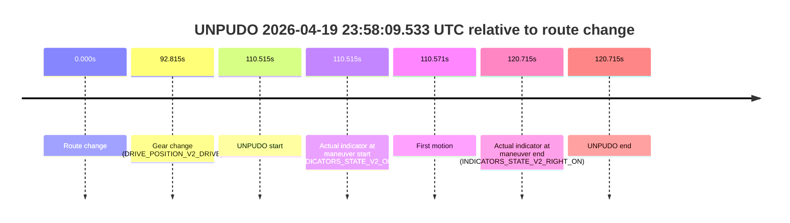

# Run Report: fme10003/2026-04-19--22-54-02--gen2-av-9f3b4da9-eb19-4c93-8a90-9d33d386c0dc

| Field | Value |
|---|---|
| Run ID | `fme10003/2026-04-19--22-54-02--gen2-av-9f3b4da9-eb19-4c93-8a90-9d33d386c0dc` |
| Date | `2026-04-19` |
| Model(s) | `pink-manta-ray-smooth` |
| Author | `guy.geva` |
| Event count | `2` |

## unpudo 2026-04-19 23:56:16.733 UTC

| Field | Value |
|---|---|
| Model | `pink-manta-ray-smooth` |
| Author | `guy.geva` |
| Run ID | `fme10003/2026-04-19--22-54-02--gen2-av-9f3b4da9-eb19-4c93-8a90-9d33d386c0dc` |
| Date | `2026-04-19` |
| Time (UTC) | `23:56:16.733` |
| Event type | `unpudo` |
| Disengagement type | `none observed` |
| Route change | `unclear` |
| Console | [run](https://console.sso.wayve.ai/run/fme10003/2026-04-19--22-54-02--gen2-av-9f3b4da9-eb19-4c93-8a90-9d33d386c0dc?id=&time-unixus=1776642976733316) |
| Foxglove | [segment](https://app.foxglove.dev/wayve-on-prem/p/prj_0dX18KZdVHg1fmmI/view?ds=foxglove-stream&ds.deviceName=fme10003&ds.start=2026-04-19T23%3A56%3A02.300248Z&ds.end=2026-04-19T23%3A58%3A18.141406Z&layoutId=lay_0e7VD4WIKDQGU73Y&time=2026-04-19T23%3A56%3A16.733316Z) |

### Event card: pass

- Pass: AV owns the credited unpudo through the official event window, the gear state is aligned at the anchor, and the vehicle moves without driver accelerator help in AV.

| Event | Time (UTC) | Delta from AV start |
|---|---:|---:|
| Route change unclear | 2026-04-19 23:56:12.300 | `0.000s` |
| AV engage | 2026-04-19 23:56:12.300 | `0.000s` |
| DBW -> true | 2026-04-19 23:56:12.300 | `0.000s` |
| Gear change (DRIVE_POSITION_V2_DRIVE) | 2026-04-19 23:56:12.633 | `0.333s` |
| UNPUDO start | 2026-04-19 23:56:16.733 | `4.433s` |
| Actual indicator at maneuver start (INDICATORS_STATE_V2_OFF) | 2026-04-19 23:56:16.733 | `4.433s` |
| First motion | 2026-04-19 23:56:16.849 | `4.549s` |
| DBW -> false | 2026-04-19 23:58:08.141 | `115.841s` |
| Actual indicator at maneuver end (INDICATORS_STATE_V2_OFF) | 2026-04-19 23:56:20.433 | `8.133s` |
| UNPUDO end | 2026-04-19 23:56:20.433 | `8.133s` |

| Metric | Value |
|---|---|
| Outcome | `pass` |
| Effective failure type | `none` |
| Route change status | `unclear` |
| DBW at event start | `true` |
| DBW at event end | `true` |
| Predicted gear at AV start | `DRIVE_POSITION_V2_DRIVE` |
| Actual gear at AV start | `DRIVE_POSITION_V2_PARK` |
| Predicted gear at event start | `DRIVE_POSITION_V2_DRIVE` |
| Actual gear at event start | `DRIVE_POSITION_V2_DRIVE` |
| Planned indicator direction | `INDICATORS_STATE_V2_LEFT_ON` |
| Controller indicator direction | `INDICATORS_STATE_V2_LEFT_ON` |
| Actual indicator direction | `INDICATORS_STATE_V2_OFF` |
| Actual indicator at maneuver end | `INDICATORS_STATE_V2_OFF` |
| Driver accel help in AV | `false` |
| Driver accel help timestamp | `n/a` |
| Max accel pedal pct in AV | `0.0%` |
| Max brake pedal pct in AV | `0.0%` |
| Max speed mps in AV | `4.544` |
| Route -> AV | `n/a` |
| AV -> event start | `4.433s` |
| AV -> first motion | `4.549s` |
| AV duration before disengagement | `115.841s` |
| Trajectory waypoint count | `36` |
| Driving-plan step count | `11` |

The scored portion starts from the AV-owned window, not from the pre-AV setup. Route-change search in the stopped pre-event segment was `unclear`, with the baseline therefore set to AV start. At the event anchor the model predicts `DRIVE_POSITION_V2_DRIVE` and the actual gear is `DRIVE_POSITION_V2_DRIVE`. The effective model outcome is `pass` because `the credited maneuver stays AV-owned through the official event end`.

### Resolution

| Field | Value |
|---|---|
| Final outcome | `pass` |
| Do we agree with this label? | `yes` |
| Source disengagement type | `none observed` |
| Resolved effective failure type | `none` |
| Confidence | `medium` |

## unpudo 2026-04-19 23:58:09.533 UTC

| Field | Value |
|---|---|
| Model | `pink-manta-ray-smooth` |
| Author | `guy.geva` |
| Run ID | `fme10003/2026-04-19--22-54-02--gen2-av-9f3b4da9-eb19-4c93-8a90-9d33d386c0dc` |
| Date | `2026-04-19` |
| Time (UTC) | `23:58:09.533` |
| Event type | `unpudo` |
| Disengagement type | `none observed` |
| Route change | `found` |
| Console | [run](https://console.sso.wayve.ai/run/fme10003/2026-04-19--22-54-02--gen2-av-9f3b4da9-eb19-4c93-8a90-9d33d386c0dc?id=&time-unixus=1776643089533305) |
| Foxglove | [segment](https://app.foxglove.dev/wayve-on-prem/p/prj_0dX18KZdVHg1fmmI/view?ds=foxglove-stream&ds.deviceName=fme10003&ds.start=2026-04-19T23%3A56%3A09.018239Z&ds.end=2026-04-19T23%3A58%3A29.733316Z&layoutId=lay_0e7VD4WIKDQGU73Y&time=2026-04-19T23%3A58%3A09.533305Z) |

### Event card: non-av

- Non-AV: there is no AV-owned portion anywhere inside the detected unpudo timeline, so it is kept for coverage but excluded from model success / failure scoring.

| Event | Time (UTC) | Delta from route change |
|---|---:|---:|
| Route change | 2026-04-19 23:56:19.018 | `0.000s` |
| Gear change (DRIVE_POSITION_V2_DRIVE) | 2026-04-19 23:57:51.833 | `92.815s` |
| UNPUDO start | 2026-04-19 23:58:09.533 | `110.515s` |
| Actual indicator at maneuver start (INDICATORS_STATE_V2_OFF) | 2026-04-19 23:58:09.533 | `110.515s` |
| First motion | 2026-04-19 23:58:09.589 | `110.571s` |
| Actual indicator at maneuver end (INDICATORS_STATE_V2_RIGHT_ON) | 2026-04-19 23:58:19.733 | `120.715s` |
| UNPUDO end | 2026-04-19 23:58:19.733 | `120.715s` |

| Metric | Value |
|---|---|
| Outcome | `non-av` |
| Effective failure type | `none` |
| Route change status | `found` |
| DBW at event start | `false` |
| DBW at event end | `false` |
| Predicted gear at AV start | `n/a` |
| Actual gear at AV start | `n/a` |
| Predicted gear at event start | `DRIVE_POSITION_V2_DRIVE` |
| Actual gear at event start | `DRIVE_POSITION_V2_DRIVE` |
| Planned indicator direction | `INDICATORS_STATE_V2_LEFT_ON` |
| Controller indicator direction | `INDICATORS_STATE_V2_LEFT_ON` |
| Actual indicator direction | `INDICATORS_STATE_V2_OFF` |
| Actual indicator at maneuver end | `INDICATORS_STATE_V2_RIGHT_ON` |
| Driver accel help in AV | `false` |
| Driver accel help timestamp | `n/a` |
| Max accel pedal pct in AV | `0.0%` |
| Max brake pedal pct in AV | `0.0%` |
| Max speed mps in AV | `0.000` |
| Route -> AV | `n/a` |
| AV -> event start | `n/a` |
| AV -> first motion | `n/a` |
| AV duration before disengagement | `n/a` |
| Trajectory waypoint count | `38` |
| Driving-plan step count | `11` |

The scored portion starts from the AV-owned window, not from the pre-AV setup. Route-change search in the stopped pre-event segment was `found`, with the baseline therefore set to route change. At the event anchor the model predicts `DRIVE_POSITION_V2_DRIVE` and the actual gear is `DRIVE_POSITION_V2_DRIVE`. The effective model outcome is `non-av` because `there is no AV-owned overlap inside the event timeline`.

### Resolution

| Field | Value |
|---|---|
| Final outcome | `non-av` |
| Do we agree with this label? | `yes` |
| Source disengagement type | `none observed` |
| Resolved effective failure type | `none` |
| Confidence | `high` |
