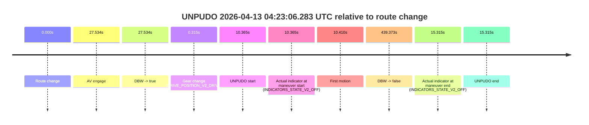
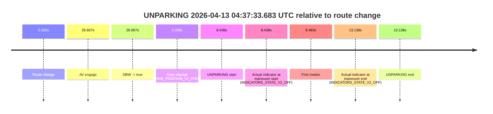

# Run Report: fme10005/2026-04-13--04-09-14--gen2-av-adf59601-e445-41c7-a489-99badbb95146

| Field | Value |
|---|---|
| Run ID | `fme10005/2026-04-13--04-09-14--gen2-av-adf59601-e445-41c7-a489-99badbb95146` |
| Date | `2026-04-13` |
| Model(s) | `lively-orange-horse` |
| Author | `guy.geva` |
| Event count | `5` |

## unpudo 2026-04-13 04:12:24.783 UTC

| Field | Value |
|---|---|
| Model | `lively-orange-horse` |
| Author | `guy.geva` |
| Run ID | `fme10005/2026-04-13--04-09-14--gen2-av-adf59601-e445-41c7-a489-99badbb95146` |
| Date | `2026-04-13` |
| Time (UTC) | `04:12:24.783` |
| Event type | `unpudo` |
| Disengagement type | `none observed` |
| Route change | `found` |
| Console | [run](https://console.sso.wayve.ai/run/fme10005/2026-04-13--04-09-14--gen2-av-adf59601-e445-41c7-a489-99badbb95146?id=&time-unixus=1776053544783306) |
| Foxglove | [segment](https://app.foxglove.dev/wayve-on-prem/p/prj_0dX18KZdVHg1fmmI/view?ds=foxglove-stream&ds.deviceName=fme10005&ds.start=2026-04-13T04%3A11%3A34.518238Z&ds.end=2026-04-13T04%3A13%3A56.871410Z&layoutId=lay_0e7VD4WIKDQGU73Y&time=2026-04-13T04%3A12%3A24.783306Z) |

### Event card: accidental

- Accidental: AV ownership is present for less than `2s`, so this is treated as an accidental brush with the maneuver rather than a meaningful model attempt.

| Event | Time (UTC) | Delta from route change |
|---|---:|---:|
| Route change | 2026-04-13 04:11:44.518 | `0.000s` |
| AV engage | 2026-04-13 04:13:25.732 | `101.214s` |
| DBW -> true | 2026-04-13 04:13:25.732 | `101.214s` |
| Gear change (DRIVE_POSITION_V2_REVERSE) | 2026-04-13 04:12:20.983 | `36.465s` |
| UNPUDO start | 2026-04-13 04:12:24.783 | `40.265s` |
| Actual indicator at maneuver start (INDICATORS_STATE_V2_OFF) | 2026-04-13 04:12:24.783 | `40.265s` |
| First motion | 2026-04-13 04:13:13.607 | `89.089s` |
| DBW -> false | 2026-04-13 04:13:46.871 | `122.353s` |
| Actual indicator at maneuver end (INDICATORS_STATE_V2_OFF) | 2026-04-13 04:13:14.583 | `90.065s` |
| UNPUDO end | 2026-04-13 04:13:14.583 | `90.065s` |

| Metric | Value |
|---|---|
| Outcome | `accidental` |
| Effective failure type | `none` |
| Route change status | `found` |
| DBW at event start | `false` |
| DBW at event end | `false` |
| Predicted gear at AV start | `DRIVE_POSITION_V2_DRIVE` |
| Actual gear at AV start | `DRIVE_POSITION_V2_DRIVE` |
| Predicted gear at event start | `DRIVE_POSITION_V2_DRIVE` |
| Actual gear at event start | `DRIVE_POSITION_V2_REVERSE` |
| Planned indicator direction | `INDICATORS_STATE_V2_OFF` |
| Controller indicator direction | `INDICATORS_STATE_V2_OFF` |
| Actual indicator direction | `INDICATORS_STATE_V2_OFF` |
| Actual indicator at maneuver end | `INDICATORS_STATE_V2_OFF` |
| Driver accel help in AV | `false` |
| Driver accel help timestamp | `n/a` |
| Max accel pedal pct in AV | `0.0%` |
| Max brake pedal pct in AV | `0.0%` |
| Max speed mps in AV | `0.000` |
| Route -> AV | `101.214s` |
| AV -> event start | `-60.949s` |
| AV -> first motion | `-12.125s` |
| AV duration before disengagement | `21.139s` |
| Trajectory waypoint count | `37` |
| Driving-plan step count | `11` |

The scored portion starts from the AV-owned window, not from the pre-AV setup. Route-change search in the stopped pre-event segment was `found`, with the baseline therefore set to route change. At the event anchor the model predicts `DRIVE_POSITION_V2_DRIVE` and the actual gear is `DRIVE_POSITION_V2_REVERSE`. The effective model outcome is `accidental` because `the AV-owned portion is shorter than 2s`.

### Resolution

| Field | Value |
|---|---|
| Final outcome | `accidental` |
| Do we agree with this label? | `yes` |
| Source disengagement type | `none observed` |
| Resolved effective failure type | `none` |
| Confidence | `high` |

## unpudo 2026-04-13 04:23:06.283 UTC

| Field | Value |
|---|---|
| Model | `lively-orange-horse` |
| Author | `guy.geva` |
| Run ID | `fme10005/2026-04-13--04-09-14--gen2-av-adf59601-e445-41c7-a489-99badbb95146` |
| Date | `2026-04-13` |
| Time (UTC) | `04:23:06.283` |
| Event type | `unpudo` |
| Disengagement type | `failed_to_unpudo` |
| Route change | `found` |
| Console | [run](https://console.sso.wayve.ai/run/fme10005/2026-04-13--04-09-14--gen2-av-adf59601-e445-41c7-a489-99badbb95146?id=&time-unixus=1776054186283298) |
| Foxglove | [segment](https://app.foxglove.dev/wayve-on-prem/p/prj_0dX18KZdVHg1fmmI/view?ds=foxglove-stream&ds.deviceName=fme10005&ds.start=2026-04-13T04%3A22%3A45.918286Z&ds.end=2026-04-13T04%3A30%3A25.291624Z&layoutId=lay_0e7VD4WIKDQGU73Y&time=2026-04-13T04%3A23%3A06.283298Z) |

### Event card: accidental

- Accidental: AV ownership is present for less than `2s`, so this is treated as an accidental brush with the maneuver rather than a meaningful model attempt.

| Event | Time (UTC) | Delta from route change |
|---|---:|---:|
| Route change | 2026-04-13 04:22:55.918 | `0.000s` |
| AV engage | 2026-04-13 04:23:23.452 | `27.534s` |
| DBW -> true | 2026-04-13 04:23:23.452 | `27.534s` |
| Gear change (DRIVE_POSITION_V2_DRIVE) | 2026-04-13 04:22:56.233 | `0.315s` |
| UNPUDO start | 2026-04-13 04:23:06.283 | `10.365s` |
| Actual indicator at maneuver start (INDICATORS_STATE_V2_OFF) | 2026-04-13 04:23:06.283 | `10.365s` |
| First motion | 2026-04-13 04:23:06.327 | `10.410s` |
| DBW -> false | 2026-04-13 04:30:15.291 | `439.373s` |
| Actual indicator at maneuver end (INDICATORS_STATE_V2_OFF) | 2026-04-13 04:23:11.233 | `15.315s` |
| UNPUDO end | 2026-04-13 04:23:11.233 | `15.315s` |

| Metric | Value |
|---|---|
| Outcome | `accidental` |
| Effective failure type | `none` |
| Route change status | `found` |
| DBW at event start | `false` |
| DBW at event end | `false` |
| Predicted gear at AV start | `DRIVE_POSITION_V2_DRIVE` |
| Actual gear at AV start | `DRIVE_POSITION_V2_DRIVE` |
| Predicted gear at event start | `DRIVE_POSITION_V2_DRIVE` |
| Actual gear at event start | `DRIVE_POSITION_V2_DRIVE` |
| Planned indicator direction | `INDICATORS_STATE_V2_LEFT_ON` |
| Controller indicator direction | `INDICATORS_STATE_V2_LEFT_ON` |
| Actual indicator direction | `INDICATORS_STATE_V2_OFF` |
| Actual indicator at maneuver end | `INDICATORS_STATE_V2_OFF` |
| Driver accel help in AV | `false` |
| Driver accel help timestamp | `n/a` |
| Max accel pedal pct in AV | `0.0%` |
| Max brake pedal pct in AV | `0.0%` |
| Max speed mps in AV | `0.000` |
| Route -> AV | `27.534s` |
| AV -> event start | `-17.169s` |
| AV -> first motion | `-17.124s` |
| AV duration before disengagement | `411.839s` |
| Trajectory waypoint count | `37` |
| Driving-plan step count | `11` |

The scored portion starts from the AV-owned window, not from the pre-AV setup. Route-change search in the stopped pre-event segment was `found`, with the baseline therefore set to route change. At the event anchor the model predicts `DRIVE_POSITION_V2_DRIVE` and the actual gear is `DRIVE_POSITION_V2_DRIVE`. The effective model outcome is `accidental` because `the AV-owned portion is shorter than 2s`.

### Resolution

| Field | Value |
|---|---|
| Final outcome | `accidental` |
| Do we agree with this label? | `yes` |
| Source disengagement type | `failed_to_unpudo` |
| Resolved effective failure type | `none` |
| Confidence | `high` |

## unpudo 2026-04-13 04:30:16.133 UTC

| Field | Value |
|---|---|
| Model | `lively-orange-horse` |
| Author | `guy.geva` |
| Run ID | `fme10005/2026-04-13--04-09-14--gen2-av-adf59601-e445-41c7-a489-99badbb95146` |
| Date | `2026-04-13` |
| Time (UTC) | `04:30:16.133` |
| Event type | `unpudo` |
| Disengagement type | `failed_to_unpudo` |
| Route change | `found` |
| Console | [run](https://console.sso.wayve.ai/run/fme10005/2026-04-13--04-09-14--gen2-av-adf59601-e445-41c7-a489-99badbb95146?id=&time-unixus=1776054616133294) |
| Foxglove | [segment](https://app.foxglove.dev/wayve-on-prem/p/prj_0dX18KZdVHg1fmmI/view?ds=foxglove-stream&ds.deviceName=fme10005&ds.start=2026-04-13T04%3A29%3A53.368283Z&ds.end=2026-04-13T04%3A31%3A43.192647Z&layoutId=lay_0e7VD4WIKDQGU73Y&time=2026-04-13T04%3A30%3A16.133294Z) |

### Event card: accidental

- Accidental: AV ownership is present for less than `2s`, so this is treated as an accidental brush with the maneuver rather than a meaningful model attempt.

| Event | Time (UTC) | Delta from route change |
|---|---:|---:|
| Route change | 2026-04-13 04:30:03.368 | `0.000s` |
| AV engage | 2026-04-13 04:30:30.291 | `26.923s` |
| DBW -> true | 2026-04-13 04:30:30.291 | `26.923s` |
| Gear change (DRIVE_POSITION_V2_DRIVE) | 2026-04-13 04:30:03.633 | `0.265s` |
| UNPUDO start | 2026-04-13 04:30:16.133 | `12.765s` |
| Actual indicator at maneuver start (INDICATORS_STATE_V2_LEFT_ON) | 2026-04-13 04:30:16.133 | `12.765s` |
| First motion | 2026-04-13 04:30:16.207 | `12.839s` |
| DBW -> false | 2026-04-13 04:31:33.192 | `89.824s` |
| Actual indicator at maneuver end (INDICATORS_STATE_V2_OFF) | 2026-04-13 04:30:22.533 | `19.165s` |
| UNPUDO end | 2026-04-13 04:30:22.533 | `19.165s` |

| Metric | Value |
|---|---|
| Outcome | `accidental` |
| Effective failure type | `none` |
| Route change status | `found` |
| DBW at event start | `false` |
| DBW at event end | `false` |
| Predicted gear at AV start | `DRIVE_POSITION_V2_DRIVE` |
| Actual gear at AV start | `DRIVE_POSITION_V2_DRIVE` |
| Predicted gear at event start | `DRIVE_POSITION_V2_DRIVE` |
| Actual gear at event start | `DRIVE_POSITION_V2_DRIVE` |
| Planned indicator direction | `INDICATORS_STATE_V2_RIGHT_ON` |
| Controller indicator direction | `INDICATORS_STATE_V2_RIGHT_ON` |
| Actual indicator direction | `INDICATORS_STATE_V2_LEFT_ON` |
| Actual indicator at maneuver end | `INDICATORS_STATE_V2_OFF` |
| Driver accel help in AV | `false` |
| Driver accel help timestamp | `n/a` |
| Max accel pedal pct in AV | `0.0%` |
| Max brake pedal pct in AV | `0.0%` |
| Max speed mps in AV | `0.000` |
| Route -> AV | `26.923s` |
| AV -> event start | `-14.158s` |
| AV -> first motion | `-14.084s` |
| AV duration before disengagement | `62.901s` |
| Trajectory waypoint count | `36` |
| Driving-plan step count | `11` |

The scored portion starts from the AV-owned window, not from the pre-AV setup. Route-change search in the stopped pre-event segment was `found`, with the baseline therefore set to route change. At the event anchor the model predicts `DRIVE_POSITION_V2_DRIVE` and the actual gear is `DRIVE_POSITION_V2_DRIVE`. The effective model outcome is `accidental` because `the AV-owned portion is shorter than 2s`.

### Resolution

| Field | Value |
|---|---|
| Final outcome | `accidental` |
| Do we agree with this label? | `yes` |
| Source disengagement type | `failed_to_unpudo` |
| Resolved effective failure type | `none` |
| Confidence | `high` |

## unpudo 2026-04-13 04:31:49.733 UTC

| Field | Value |
|---|---|
| Model | `lively-orange-horse` |
| Author | `guy.geva` |
| Run ID | `fme10005/2026-04-13--04-09-14--gen2-av-adf59601-e445-41c7-a489-99badbb95146` |
| Date | `2026-04-13` |
| Time (UTC) | `04:31:49.733` |
| Event type | `unpudo` |
| Disengagement type | `failed_to_unpudo` |
| Route change | `found` |
| Console | [run](https://console.sso.wayve.ai/run/fme10005/2026-04-13--04-09-14--gen2-av-adf59601-e445-41c7-a489-99badbb95146?id=&time-unixus=1776054709733304) |
| Foxglove | [segment](https://app.foxglove.dev/wayve-on-prem/p/prj_0dX18KZdVHg1fmmI/view?ds=foxglove-stream&ds.deviceName=fme10005&ds.start=2026-04-13T04%3A29%3A53.368283Z&ds.end=2026-04-13T04%3A37%3A43.170860Z&layoutId=lay_0e7VD4WIKDQGU73Y&time=2026-04-13T04%3A31%3A49.733304Z) |

### Event card: accidental

- Accidental: AV ownership is present for less than `2s`, so this is treated as an accidental brush with the maneuver rather than a meaningful model attempt.

| Event | Time (UTC) | Delta from route change |
|---|---:|---:|
| Route change | 2026-04-13 04:30:03.368 | `0.000s` |
| AV engage | 2026-04-13 04:32:12.591 | `129.223s` |
| DBW -> true | 2026-04-13 04:32:12.591 | `129.223s` |
| Gear change (DRIVE_POSITION_V2_DRIVE) | 2026-04-13 04:31:47.833 | `104.465s` |
| UNPUDO start | 2026-04-13 04:31:49.733 | `106.365s` |
| Actual indicator at maneuver start (INDICATORS_STATE_V2_OFF) | 2026-04-13 04:31:49.733 | `106.365s` |
| First motion | 2026-04-13 04:31:49.747 | `106.379s` |
| DBW -> false | 2026-04-13 04:37:33.170 | `449.803s` |
| Actual indicator at maneuver end (INDICATORS_STATE_V2_LEFT_ON) | 2026-04-13 04:31:54.733 | `111.365s` |
| UNPUDO end | 2026-04-13 04:31:54.733 | `111.365s` |

| Metric | Value |
|---|---|
| Outcome | `accidental` |
| Effective failure type | `none` |
| Route change status | `found` |
| DBW at event start | `false` |
| DBW at event end | `false` |
| Predicted gear at AV start | `DRIVE_POSITION_V2_DRIVE` |
| Actual gear at AV start | `DRIVE_POSITION_V2_DRIVE` |
| Predicted gear at event start | `DRIVE_POSITION_V2_DRIVE` |
| Actual gear at event start | `DRIVE_POSITION_V2_DRIVE` |
| Planned indicator direction | `INDICATORS_STATE_V2_LEFT_ON` |
| Controller indicator direction | `INDICATORS_STATE_V2_LEFT_ON` |
| Actual indicator direction | `INDICATORS_STATE_V2_OFF` |
| Actual indicator at maneuver end | `INDICATORS_STATE_V2_LEFT_ON` |
| Driver accel help in AV | `false` |
| Driver accel help timestamp | `n/a` |
| Max accel pedal pct in AV | `0.0%` |
| Max brake pedal pct in AV | `0.0%` |
| Max speed mps in AV | `0.000` |
| Route -> AV | `129.223s` |
| AV -> event start | `-22.858s` |
| AV -> first motion | `-22.844s` |
| AV duration before disengagement | `320.579s` |
| Trajectory waypoint count | `36` |
| Driving-plan step count | `11` |

The scored portion starts from the AV-owned window, not from the pre-AV setup. Route-change search in the stopped pre-event segment was `found`, with the baseline therefore set to route change. At the event anchor the model predicts `DRIVE_POSITION_V2_DRIVE` and the actual gear is `DRIVE_POSITION_V2_DRIVE`. The effective model outcome is `accidental` because `the AV-owned portion is shorter than 2s`.

### Resolution

| Field | Value |
|---|---|
| Final outcome | `accidental` |
| Do we agree with this label? | `yes` |
| Source disengagement type | `failed_to_unpudo` |
| Resolved effective failure type | `none` |
| Confidence | `high` |

## unparking 2026-04-13 04:37:33.683 UTC

| Field | Value |
|---|---|
| Model | `lively-orange-horse` |
| Author | `guy.geva` |
| Run ID | `fme10005/2026-04-13--04-09-14--gen2-av-adf59601-e445-41c7-a489-99badbb95146` |
| Date | `2026-04-13` |
| Time (UTC) | `04:37:33.683` |
| Event type | `unparking` |
| Disengagement type | `failed_to_unpudo` |
| Route change | `found` |
| Console | [run](https://console.sso.wayve.ai/run/fme10005/2026-04-13--04-09-14--gen2-av-adf59601-e445-41c7-a489-99badbb95146?id=&time-unixus=1776055053683300) |
| Foxglove | [segment](https://app.foxglove.dev/wayve-on-prem/p/prj_0dX18KZdVHg1fmmI/view?ds=foxglove-stream&ds.deviceName=fme10005&ds.start=2026-04-13T04%3A37%3A15.244861Z&ds.end=2026-04-13T04%3A37%3A48.383317Z&layoutId=lay_0e7VD4WIKDQGU73Y&time=2026-04-13T04%3A37%3A33.683300Z) |

### Event card: accidental

- Accidental: AV ownership is present for less than `2s`, so this is treated as an accidental brush with the maneuver rather than a meaningful model attempt.

| Event | Time (UTC) | Delta from route change |
|---|---:|---:|
| Route change | 2026-04-13 04:37:25.244 | `0.000s` |
| AV engage | 2026-04-13 04:37:51.852 | `26.607s` |
| DBW -> true | 2026-04-13 04:37:51.852 | `26.607s` |
| Gear change (DRIVE_POSITION_V2_DRIVE) | 2026-04-13 04:37:25.533 | `0.288s` |
| UNPARKING start | 2026-04-13 04:37:33.683 | `8.438s` |
| Actual indicator at maneuver start (INDICATORS_STATE_V2_OFF) | 2026-04-13 04:37:33.683 | `8.438s` |
| First motion | 2026-04-13 04:37:33.727 | `8.483s` |
| Actual indicator at maneuver end (INDICATORS_STATE_V2_OFF) | 2026-04-13 04:37:38.383 | `13.138s` |
| UNPARKING end | 2026-04-13 04:37:38.383 | `13.138s` |

| Metric | Value |
|---|---|
| Outcome | `accidental` |
| Effective failure type | `none` |
| Route change status | `found` |
| DBW at event start | `false` |
| DBW at event end | `false` |
| Predicted gear at AV start | `DRIVE_POSITION_V2_DRIVE` |
| Actual gear at AV start | `DRIVE_POSITION_V2_DRIVE` |
| Predicted gear at event start | `DRIVE_POSITION_V2_DRIVE` |
| Actual gear at event start | `DRIVE_POSITION_V2_DRIVE` |
| Planned indicator direction | `INDICATORS_STATE_V2_LEFT_ON` |
| Controller indicator direction | `INDICATORS_STATE_V2_LEFT_ON` |
| Actual indicator direction | `INDICATORS_STATE_V2_OFF` |
| Actual indicator at maneuver end | `INDICATORS_STATE_V2_OFF` |
| Driver accel help in AV | `false` |
| Driver accel help timestamp | `n/a` |
| Max accel pedal pct in AV | `0.0%` |
| Max brake pedal pct in AV | `0.0%` |
| Max speed mps in AV | `0.000` |
| Route -> AV | `26.607s` |
| AV -> event start | `-18.169s` |
| AV -> first motion | `-18.124s` |
| AV duration before disengagement | `n/a` |
| Trajectory waypoint count | `37` |
| Driving-plan step count | `11` |

The scored portion starts from the AV-owned window, not from the pre-AV setup. Route-change search in the stopped pre-event segment was `found`, with the baseline therefore set to route change. At the event anchor the model predicts `DRIVE_POSITION_V2_DRIVE` and the actual gear is `DRIVE_POSITION_V2_DRIVE`. The effective model outcome is `accidental` because `the AV-owned portion is shorter than 2s`.

### Resolution

| Field | Value |
|---|---|
| Final outcome | `accidental` |
| Do we agree with this label? | `yes` |
| Source disengagement type | `failed_to_unpudo` |
| Resolved effective failure type | `none` |
| Confidence | `high` |
