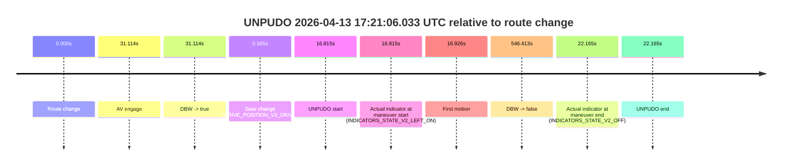
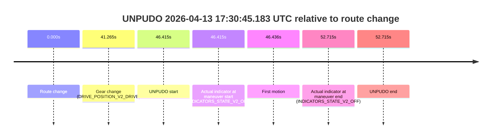

# Run Report: fme10005/2026-04-13--17-07-05--gen2-av-0a684268-29f5-4a49-8333-e537a299fe40

| Field | Value |
|---|---|
| Run ID | `fme10005/2026-04-13--17-07-05--gen2-av-0a684268-29f5-4a49-8333-e537a299fe40` |
| Date | `2026-04-13` |
| Model(s) | `lively-orange-horse` |
| Author | `guy.geva` |
| Event count | `2` |

## unpudo 2026-04-13 17:21:06.033 UTC

| Field | Value |
|---|---|
| Model | `lively-orange-horse` |
| Author | `guy.geva` |
| Run ID | `fme10005/2026-04-13--17-07-05--gen2-av-0a684268-29f5-4a49-8333-e537a299fe40` |
| Date | `2026-04-13` |
| Time (UTC) | `17:21:06.033` |
| Event type | `unpudo` |
| Disengagement type | `failed_to_unpudo` |
| Route change | `found` |
| Console | [run](https://console.sso.wayve.ai/run/fme10005/2026-04-13--17-07-05--gen2-av-0a684268-29f5-4a49-8333-e537a299fe40?id=&time-unixus=1776100866033314) |
| Foxglove | [segment](https://app.foxglove.dev/wayve-on-prem/p/prj_0dX18KZdVHg1fmmI/view?ds=foxglove-stream&ds.deviceName=fme10005&ds.start=2026-04-13T17%3A20%3A39.218235Z&ds.end=2026-04-13T17%3A30%3A05.630984Z&layoutId=lay_0e7VD4WIKDQGU73Y&time=2026-04-13T17%3A21%3A06.033314Z) |

### Event card: accidental

- Accidental: AV ownership is present for less than `2s`, so this is treated as an accidental brush with the maneuver rather than a meaningful model attempt.

| Event | Time (UTC) | Delta from route change |
|---|---:|---:|
| Route change | 2026-04-13 17:20:49.218 | `0.000s` |
| AV engage | 2026-04-13 17:21:20.332 | `31.114s` |
| DBW -> true | 2026-04-13 17:21:20.332 | `31.114s` |
| Gear change (DRIVE_POSITION_V2_DRIVE) | 2026-04-13 17:20:49.583 | `0.365s` |
| UNPUDO start | 2026-04-13 17:21:06.033 | `16.815s` |
| Actual indicator at maneuver start (INDICATORS_STATE_V2_LEFT_ON) | 2026-04-13 17:21:06.033 | `16.815s` |
| First motion | 2026-04-13 17:21:06.144 | `16.926s` |
| DBW -> false | 2026-04-13 17:29:55.630 | `546.413s` |
| Actual indicator at maneuver end (INDICATORS_STATE_V2_OFF) | 2026-04-13 17:21:11.383 | `22.165s` |
| UNPUDO end | 2026-04-13 17:21:11.383 | `22.165s` |

| Metric | Value |
|---|---|
| Outcome | `accidental` |
| Effective failure type | `none` |
| Route change status | `found` |
| DBW at event start | `false` |
| DBW at event end | `false` |
| Predicted gear at AV start | `DRIVE_POSITION_V2_DRIVE` |
| Actual gear at AV start | `DRIVE_POSITION_V2_DRIVE` |
| Predicted gear at event start | `DRIVE_POSITION_V2_DRIVE` |
| Actual gear at event start | `DRIVE_POSITION_V2_DRIVE` |
| Planned indicator direction | `INDICATORS_STATE_V2_LEFT_ON` |
| Controller indicator direction | `INDICATORS_STATE_V2_LEFT_ON` |
| Actual indicator direction | `INDICATORS_STATE_V2_LEFT_ON` |
| Actual indicator at maneuver end | `INDICATORS_STATE_V2_OFF` |
| Driver accel help in AV | `false` |
| Driver accel help timestamp | `n/a` |
| Max accel pedal pct in AV | `0.0%` |
| Max brake pedal pct in AV | `0.0%` |
| Max speed mps in AV | `0.000` |
| Route -> AV | `31.114s` |
| AV -> event start | `-14.299s` |
| AV -> first motion | `-14.187s` |
| AV duration before disengagement | `515.299s` |
| Trajectory waypoint count | `36` |
| Driving-plan step count | `11` |

The scored portion starts from the AV-owned window, not from the pre-AV setup. Route-change search in the stopped pre-event segment was `found`, with the baseline therefore set to route change. At the event anchor the model predicts `DRIVE_POSITION_V2_DRIVE` and the actual gear is `DRIVE_POSITION_V2_DRIVE`. The effective model outcome is `accidental` because `the AV-owned portion is shorter than 2s`.

### Resolution

| Field | Value |
|---|---|
| Final outcome | `accidental` |
| Do we agree with this label? | `yes` |
| Source disengagement type | `failed_to_unpudo` |
| Resolved effective failure type | `none` |
| Confidence | `high` |

## unpudo 2026-04-13 17:30:45.183 UTC

| Field | Value |
|---|---|
| Model | `lively-orange-horse` |
| Author | `guy.geva` |
| Run ID | `fme10005/2026-04-13--17-07-05--gen2-av-0a684268-29f5-4a49-8333-e537a299fe40` |
| Date | `2026-04-13` |
| Time (UTC) | `17:30:45.183` |
| Event type | `unpudo` |
| Disengagement type | `none observed` |
| Route change | `found` |
| Console | [run](https://console.sso.wayve.ai/run/fme10005/2026-04-13--17-07-05--gen2-av-0a684268-29f5-4a49-8333-e537a299fe40?id=&time-unixus=1776101445183308) |
| Foxglove | [segment](https://app.foxglove.dev/wayve-on-prem/p/prj_0dX18KZdVHg1fmmI/view?ds=foxglove-stream&ds.deviceName=fme10005&ds.start=2026-04-13T17%3A29%3A48.768263Z&ds.end=2026-04-13T17%3A31%3A01.483308Z&layoutId=lay_0e7VD4WIKDQGU73Y&time=2026-04-13T17%3A30%3A45.183308Z) |

### Event card: non-av

- Non-AV: the detected unpudo starts outside AV ownership, so it is kept for coverage but excluded from model success / failure scoring.

| Event | Time (UTC) | Delta from route change |
|---|---:|---:|
| Route change | 2026-04-13 17:29:58.768 | `0.000s` |
| Gear change (DRIVE_POSITION_V2_DRIVE) | 2026-04-13 17:30:40.033 | `41.265s` |
| UNPUDO start | 2026-04-13 17:30:45.183 | `46.415s` |
| Actual indicator at maneuver start (INDICATORS_STATE_V2_OFF) | 2026-04-13 17:30:45.183 | `46.415s` |
| First motion | 2026-04-13 17:30:45.204 | `46.436s` |
| Actual indicator at maneuver end (INDICATORS_STATE_V2_OFF) | 2026-04-13 17:30:51.483 | `52.715s` |
| UNPUDO end | 2026-04-13 17:30:51.483 | `52.715s` |

| Metric | Value |
|---|---|
| Outcome | `non-av` |
| Effective failure type | `none` |
| Route change status | `found` |
| DBW at event start | `false` |
| DBW at event end | `false` |
| Predicted gear at AV start | `n/a` |
| Actual gear at AV start | `n/a` |
| Predicted gear at event start | `DRIVE_POSITION_V2_DRIVE` |
| Actual gear at event start | `DRIVE_POSITION_V2_DRIVE` |
| Planned indicator direction | `INDICATORS_STATE_V2_OFF` |
| Controller indicator direction | `INDICATORS_STATE_V2_OFF` |
| Actual indicator direction | `INDICATORS_STATE_V2_OFF` |
| Actual indicator at maneuver end | `INDICATORS_STATE_V2_OFF` |
| Driver accel help in AV | `false` |
| Driver accel help timestamp | `n/a` |
| Max accel pedal pct in AV | `0.0%` |
| Max brake pedal pct in AV | `0.0%` |
| Max speed mps in AV | `0.000` |
| Route -> AV | `n/a` |
| AV -> event start | `n/a` |
| AV -> first motion | `n/a` |
| AV duration before disengagement | `n/a` |
| Trajectory waypoint count | `37` |
| Driving-plan step count | `11` |

The scored portion starts from the AV-owned window, not from the pre-AV setup. Route-change search in the stopped pre-event segment was `found`, with the baseline therefore set to route change. At the event anchor the model predicts `DRIVE_POSITION_V2_DRIVE` and the actual gear is `DRIVE_POSITION_V2_DRIVE`. The effective model outcome is `non-av` because `the event does not begin in AV ownership`.

### Resolution

| Field | Value |
|---|---|
| Final outcome | `non-av` |
| Do we agree with this label? | `yes` |
| Source disengagement type | `none observed` |
| Resolved effective failure type | `none` |
| Confidence | `high` |
