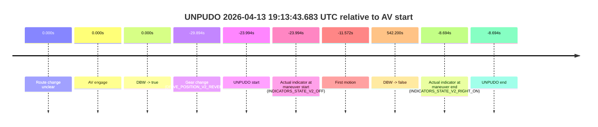
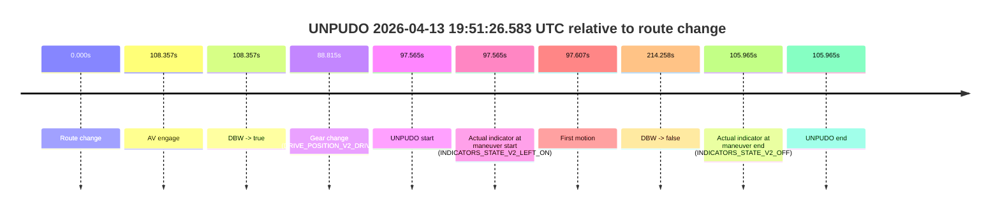
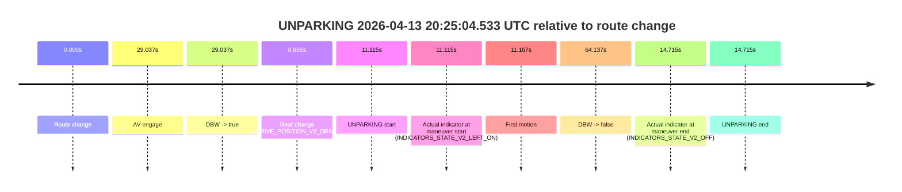
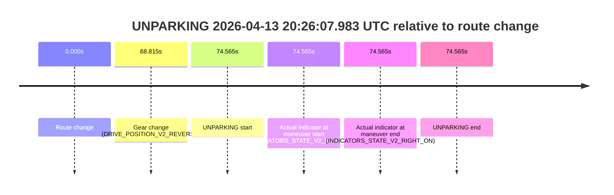

# Run Report: fme10005/2026-04-13--18-58-47--gen2-av-821c04c1-aeb9-45e0-ae77-d9ff9f5224c8

| Field | Value |
|---|---|
| Run ID | `fme10005/2026-04-13--18-58-47--gen2-av-821c04c1-aeb9-45e0-ae77-d9ff9f5224c8` |
| Date | `2026-04-13` |
| Model(s) | `lively-orange-horse` |
| Author | `guy.geva` |
| Event count | `9` |

## unpudo 2026-04-13 19:13:43.683 UTC

| Field | Value |
|---|---|
| Model | `lively-orange-horse` |
| Author | `guy.geva` |
| Run ID | `fme10005/2026-04-13--18-58-47--gen2-av-821c04c1-aeb9-45e0-ae77-d9ff9f5224c8` |
| Date | `2026-04-13` |
| Time (UTC) | `19:13:43.683` |
| Event type | `unpudo` |
| Disengagement type | `failed_to_remain_stopped` |
| Route change | `unclear` |
| Console | [run](https://console.sso.wayve.ai/run/fme10005/2026-04-13--18-58-47--gen2-av-821c04c1-aeb9-45e0-ae77-d9ff9f5224c8?id=&time-unixus=1776107623683297) |
| Foxglove | [segment](https://app.foxglove.dev/wayve-on-prem/p/prj_0dX18KZdVHg1fmmI/view?ds=foxglove-stream&ds.deviceName=fme10005&ds.start=2026-04-13T19%3A13%3A27.783306Z&ds.end=2026-04-13T19%3A23%3A19.876364Z&layoutId=lay_0e7VD4WIKDQGU73Y&time=2026-04-13T19%3A13%3A43.683297Z) |

### Event card: accidental

- Accidental: AV ownership is present for less than `2s`, so this is treated as an accidental brush with the maneuver rather than a meaningful model attempt.

| Event | Time (UTC) | Delta from AV start |
|---|---:|---:|
| Route change unclear | 2026-04-13 19:14:07.676 | `0.000s` |
| AV engage | 2026-04-13 19:14:07.676 | `0.000s` |
| DBW -> true | 2026-04-13 19:14:07.676 | `0.000s` |
| Gear change (DRIVE_POSITION_V2_REVERSE) | 2026-04-13 19:13:37.783 | `-29.894s` |
| UNPUDO start | 2026-04-13 19:13:43.683 | `-23.994s` |
| Actual indicator at maneuver start (INDICATORS_STATE_V2_OFF) | 2026-04-13 19:13:43.683 | `-23.994s` |
| First motion | 2026-04-13 19:13:56.104 | `-11.572s` |
| DBW -> false | 2026-04-13 19:23:09.876 | `542.200s` |
| Actual indicator at maneuver end (INDICATORS_STATE_V2_RIGHT_ON) | 2026-04-13 19:13:58.983 | `-8.694s` |
| UNPUDO end | 2026-04-13 19:13:58.983 | `-8.694s` |

| Metric | Value |
|---|---|
| Outcome | `accidental` |
| Effective failure type | `none` |
| Route change status | `unclear` |
| DBW at event start | `false` |
| DBW at event end | `false` |
| Predicted gear at AV start | `DRIVE_POSITION_V2_DRIVE` |
| Actual gear at AV start | `DRIVE_POSITION_V2_DRIVE` |
| Predicted gear at event start | `DRIVE_POSITION_V2_DRIVE` |
| Actual gear at event start | `DRIVE_POSITION_V2_REVERSE` |
| Planned indicator direction | `INDICATORS_STATE_V2_RIGHT_ON` |
| Controller indicator direction | `INDICATORS_STATE_V2_RIGHT_ON` |
| Actual indicator direction | `INDICATORS_STATE_V2_OFF` |
| Actual indicator at maneuver end | `INDICATORS_STATE_V2_RIGHT_ON` |
| Driver accel help in AV | `false` |
| Driver accel help timestamp | `n/a` |
| Max accel pedal pct in AV | `0.0%` |
| Max brake pedal pct in AV | `0.0%` |
| Max speed mps in AV | `0.000` |
| Route -> AV | `n/a` |
| AV -> event start | `-23.994s` |
| AV -> first motion | `-11.572s` |
| AV duration before disengagement | `542.200s` |
| Trajectory waypoint count | `36` |
| Driving-plan step count | `11` |

The scored portion starts from the AV-owned window, not from the pre-AV setup. Route-change search in the stopped pre-event segment was `unclear`, with the baseline therefore set to AV start. At the event anchor the model predicts `DRIVE_POSITION_V2_DRIVE` and the actual gear is `DRIVE_POSITION_V2_REVERSE`. The effective model outcome is `accidental` because `the AV-owned portion is shorter than 2s`.

### Resolution

| Field | Value |
|---|---|
| Final outcome | `accidental` |
| Do we agree with this label? | `yes` |
| Source disengagement type | `failed_to_remain_stopped` |
| Resolved effective failure type | `none` |
| Confidence | `medium` |

## unpudo 2026-04-13 19:24:05.733 UTC

| Field | Value |
|---|---|
| Model | `lively-orange-horse` |
| Author | `guy.geva` |
| Run ID | `fme10005/2026-04-13--18-58-47--gen2-av-821c04c1-aeb9-45e0-ae77-d9ff9f5224c8` |
| Date | `2026-04-13` |
| Time (UTC) | `19:24:05.733` |
| Event type | `unpudo` |
| Disengagement type | `none observed` |
| Route change | `found` |
| Console | [run](https://console.sso.wayve.ai/run/fme10005/2026-04-13--18-58-47--gen2-av-821c04c1-aeb9-45e0-ae77-d9ff9f5224c8?id=&time-unixus=1776108245733290) |
| Foxglove | [segment](https://app.foxglove.dev/wayve-on-prem/p/prj_0dX18KZdVHg1fmmI/view?ds=foxglove-stream&ds.deviceName=fme10005&ds.start=2026-04-13T19%3A23%3A11.936046Z&ds.end=2026-04-13T19%3A26%3A50.914987Z&layoutId=lay_0e7VD4WIKDQGU73Y&time=2026-04-13T19%3A24%3A05.733290Z) |

### Event card: pass

- Pass: AV owns the credited unpudo through the official event window, the gear state is aligned at the anchor, and the vehicle moves without driver accelerator help in AV.

| Event | Time (UTC) | Delta from route change |
|---|---:|---:|
| Route change | 2026-04-13 19:23:54.468 | `0.000s` |
| AV engage | 2026-04-13 19:23:21.936 | `-32.532s` |
| DBW -> true | 2026-04-13 19:23:21.936 | `-32.532s` |
| Gear change (DRIVE_POSITION_V2_DRIVE) | 2026-04-13 19:23:55.833 | `1.365s` |
| UNPUDO start | 2026-04-13 19:24:05.733 | `11.265s` |
| Actual indicator at maneuver start (INDICATORS_STATE_V2_OFF) | 2026-04-13 19:24:05.733 | `11.265s` |
| First motion | 2026-04-13 19:24:05.744 | `11.276s` |
| DBW -> false | 2026-04-13 19:26:40.914 | `166.447s` |
| Actual indicator at maneuver end (INDICATORS_STATE_V2_OFF) | 2026-04-13 19:24:09.083 | `14.615s` |
| UNPUDO end | 2026-04-13 19:24:09.083 | `14.615s` |

| Metric | Value |
|---|---|
| Outcome | `pass` |
| Effective failure type | `none` |
| Route change status | `found` |
| DBW at event start | `true` |
| DBW at event end | `true` |
| Predicted gear at AV start | `DRIVE_POSITION_V2_DRIVE` |
| Actual gear at AV start | `DRIVE_POSITION_V2_DRIVE` |
| Predicted gear at event start | `DRIVE_POSITION_V2_DRIVE` |
| Actual gear at event start | `DRIVE_POSITION_V2_DRIVE` |
| Planned indicator direction | `INDICATORS_STATE_V2_LEFT_ON` |
| Controller indicator direction | `INDICATORS_STATE_V2_LEFT_ON` |
| Actual indicator direction | `INDICATORS_STATE_V2_OFF` |
| Actual indicator at maneuver end | `INDICATORS_STATE_V2_OFF` |
| Driver accel help in AV | `false` |
| Driver accel help timestamp | `n/a` |
| Max accel pedal pct in AV | `0.0%` |
| Max brake pedal pct in AV | `8.0%` |
| Max speed mps in AV | `7.958` |
| Route -> AV | `-32.532s` |
| AV -> event start | `43.797s` |
| AV -> first motion | `43.809s` |
| AV duration before disengagement | `198.979s` |
| Trajectory waypoint count | `37` |
| Driving-plan step count | `11` |

The scored portion starts from the AV-owned window, not from the pre-AV setup. Route-change search in the stopped pre-event segment was `found`, with the baseline therefore set to route change. At the event anchor the model predicts `DRIVE_POSITION_V2_DRIVE` and the actual gear is `DRIVE_POSITION_V2_DRIVE`. The effective model outcome is `pass` because `the credited maneuver stays AV-owned through the official event end`.

### Resolution

| Field | Value |
|---|---|
| Final outcome | `pass` |
| Do we agree with this label? | `yes` |
| Source disengagement type | `none observed` |
| Resolved effective failure type | `none` |
| Confidence | `high` |

## unpudo 2026-04-13 19:46:34.933 UTC

| Field | Value |
|---|---|
| Model | `lively-orange-horse` |
| Author | `guy.geva` |
| Run ID | `fme10005/2026-04-13--18-58-47--gen2-av-821c04c1-aeb9-45e0-ae77-d9ff9f5224c8` |
| Date | `2026-04-13` |
| Time (UTC) | `19:46:34.933` |
| Event type | `unpudo` |
| Disengagement type | `failed_to_unpudo` |
| Route change | `found` |
| Console | [run](https://console.sso.wayve.ai/run/fme10005/2026-04-13--18-58-47--gen2-av-821c04c1-aeb9-45e0-ae77-d9ff9f5224c8?id=&time-unixus=1776109594933308) |
| Foxglove | [segment](https://app.foxglove.dev/wayve-on-prem/p/prj_0dX18KZdVHg1fmmI/view?ds=foxglove-stream&ds.deviceName=fme10005&ds.start=2026-04-13T19%3A46%3A09.133308Z&ds.end=2026-04-13T19%3A50%3A13.735031Z&layoutId=lay_0e7VD4WIKDQGU73Y&time=2026-04-13T19%3A46%3A34.933308Z) |

### Event card: accidental

- Accidental: AV ownership is present for less than `2s`, so this is treated as an accidental brush with the maneuver rather than a meaningful model attempt.

| Event | Time (UTC) | Delta from route change |
|---|---:|---:|
| Route change | 2026-04-13 19:46:28.318 | `0.000s` |
| AV engage | 2026-04-13 19:46:44.556 | `16.239s` |
| DBW -> true | 2026-04-13 19:46:44.556 | `16.239s` |
| Gear change (DRIVE_POSITION_V2_DRIVE) | 2026-04-13 19:46:19.133 | `-9.185s` |
| UNPUDO start | 2026-04-13 19:46:34.933 | `6.615s` |
| Actual indicator at maneuver start (INDICATORS_STATE_V2_OFF) | 2026-04-13 19:46:34.933 | `6.615s` |
| First motion | 2026-04-13 19:46:34.944 | `6.627s` |
| DBW -> false | 2026-04-13 19:50:03.735 | `215.417s` |
| Actual indicator at maneuver end (INDICATORS_STATE_V2_LEFT_ON) | 2026-04-13 19:46:38.883 | `10.565s` |
| UNPUDO end | 2026-04-13 19:46:38.883 | `10.565s` |

| Metric | Value |
|---|---|
| Outcome | `accidental` |
| Effective failure type | `none` |
| Route change status | `found` |
| DBW at event start | `false` |
| DBW at event end | `false` |
| Predicted gear at AV start | `DRIVE_POSITION_V2_DRIVE` |
| Actual gear at AV start | `DRIVE_POSITION_V2_DRIVE` |
| Predicted gear at event start | `DRIVE_POSITION_V2_DRIVE` |
| Actual gear at event start | `DRIVE_POSITION_V2_DRIVE` |
| Planned indicator direction | `INDICATORS_STATE_V2_LEFT_ON` |
| Controller indicator direction | `INDICATORS_STATE_V2_LEFT_ON` |
| Actual indicator direction | `INDICATORS_STATE_V2_OFF` |
| Actual indicator at maneuver end | `INDICATORS_STATE_V2_LEFT_ON` |
| Driver accel help in AV | `false` |
| Driver accel help timestamp | `n/a` |
| Max accel pedal pct in AV | `0.0%` |
| Max brake pedal pct in AV | `0.0%` |
| Max speed mps in AV | `0.000` |
| Route -> AV | `16.239s` |
| AV -> event start | `-9.624s` |
| AV -> first motion | `-9.612s` |
| AV duration before disengagement | `199.178s` |
| Trajectory waypoint count | `35` |
| Driving-plan step count | `11` |

The scored portion starts from the AV-owned window, not from the pre-AV setup. Route-change search in the stopped pre-event segment was `found`, with the baseline therefore set to route change. At the event anchor the model predicts `DRIVE_POSITION_V2_DRIVE` and the actual gear is `DRIVE_POSITION_V2_DRIVE`. The effective model outcome is `accidental` because `the AV-owned portion is shorter than 2s`.

### Resolution

| Field | Value |
|---|---|
| Final outcome | `accidental` |
| Do we agree with this label? | `yes` |
| Source disengagement type | `failed_to_unpudo` |
| Resolved effective failure type | `none` |
| Confidence | `high` |

## unpudo 2026-04-13 19:50:04.333 UTC

| Field | Value |
|---|---|
| Model | `lively-orange-horse` |
| Author | `guy.geva` |
| Run ID | `fme10005/2026-04-13--18-58-47--gen2-av-821c04c1-aeb9-45e0-ae77-d9ff9f5224c8` |
| Date | `2026-04-13` |
| Time (UTC) | `19:50:04.333` |
| Event type | `unpudo` |
| Disengagement type | `failed_to_unpudo` |
| Route change | `found` |
| Console | [run](https://console.sso.wayve.ai/run/fme10005/2026-04-13--18-58-47--gen2-av-821c04c1-aeb9-45e0-ae77-d9ff9f5224c8?id=&time-unixus=1776109804333314) |
| Foxglove | [segment](https://app.foxglove.dev/wayve-on-prem/p/prj_0dX18KZdVHg1fmmI/view?ds=foxglove-stream&ds.deviceName=fme10005&ds.start=2026-04-13T19%3A49%3A39.018274Z&ds.end=2026-04-13T19%3A51%3A35.696375Z&layoutId=lay_0e7VD4WIKDQGU73Y&time=2026-04-13T19%3A50%3A04.333314Z) |

### Event card: accidental

- Accidental: AV ownership is present for less than `2s`, so this is treated as an accidental brush with the maneuver rather than a meaningful model attempt.

| Event | Time (UTC) | Delta from route change |
|---|---:|---:|
| Route change | 2026-04-13 19:49:49.018 | `0.000s` |
| AV engage | 2026-04-13 19:50:09.975 | `20.957s` |
| DBW -> true | 2026-04-13 19:50:09.975 | `20.957s` |
| Gear change (DRIVE_POSITION_V2_DRIVE) | 2026-04-13 19:49:49.333 | `0.315s` |
| UNPUDO start | 2026-04-13 19:50:04.333 | `15.315s` |
| Actual indicator at maneuver start (INDICATORS_STATE_V2_OFF) | 2026-04-13 19:50:04.333 | `15.315s` |
| First motion | 2026-04-13 19:50:04.424 | `15.407s` |
| DBW -> false | 2026-04-13 19:51:25.696 | `96.678s` |
| Actual indicator at maneuver end (INDICATORS_STATE_V2_OFF) | 2026-04-13 19:50:09.433 | `20.415s` |
| UNPUDO end | 2026-04-13 19:50:09.433 | `20.415s` |

| Metric | Value |
|---|---|
| Outcome | `accidental` |
| Effective failure type | `none` |
| Route change status | `found` |
| DBW at event start | `false` |
| DBW at event end | `false` |
| Predicted gear at AV start | `DRIVE_POSITION_V2_DRIVE` |
| Actual gear at AV start | `DRIVE_POSITION_V2_DRIVE` |
| Predicted gear at event start | `DRIVE_POSITION_V2_DRIVE` |
| Actual gear at event start | `DRIVE_POSITION_V2_DRIVE` |
| Planned indicator direction | `INDICATORS_STATE_V2_LEFT_ON` |
| Controller indicator direction | `INDICATORS_STATE_V2_LEFT_ON` |
| Actual indicator direction | `INDICATORS_STATE_V2_OFF` |
| Actual indicator at maneuver end | `INDICATORS_STATE_V2_OFF` |
| Driver accel help in AV | `false` |
| Driver accel help timestamp | `n/a` |
| Max accel pedal pct in AV | `0.0%` |
| Max brake pedal pct in AV | `0.0%` |
| Max speed mps in AV | `0.000` |
| Route -> AV | `20.957s` |
| AV -> event start | `-5.642s` |
| AV -> first motion | `-5.551s` |
| AV duration before disengagement | `75.721s` |
| Trajectory waypoint count | `35` |
| Driving-plan step count | `11` |

The scored portion starts from the AV-owned window, not from the pre-AV setup. Route-change search in the stopped pre-event segment was `found`, with the baseline therefore set to route change. At the event anchor the model predicts `DRIVE_POSITION_V2_DRIVE` and the actual gear is `DRIVE_POSITION_V2_DRIVE`. The effective model outcome is `accidental` because `the AV-owned portion is shorter than 2s`.

### Resolution

| Field | Value |
|---|---|
| Final outcome | `accidental` |
| Do we agree with this label? | `yes` |
| Source disengagement type | `failed_to_unpudo` |
| Resolved effective failure type | `none` |
| Confidence | `high` |

## unpudo 2026-04-13 19:51:26.583 UTC

| Field | Value |
|---|---|
| Model | `lively-orange-horse` |
| Author | `guy.geva` |
| Run ID | `fme10005/2026-04-13--18-58-47--gen2-av-821c04c1-aeb9-45e0-ae77-d9ff9f5224c8` |
| Date | `2026-04-13` |
| Time (UTC) | `19:51:26.583` |
| Event type | `unpudo` |
| Disengagement type | `failed_to_unpudo` |
| Route change | `found` |
| Console | [run](https://console.sso.wayve.ai/run/fme10005/2026-04-13--18-58-47--gen2-av-821c04c1-aeb9-45e0-ae77-d9ff9f5224c8?id=&time-unixus=1776109886583314) |
| Foxglove | [segment](https://app.foxglove.dev/wayve-on-prem/p/prj_0dX18KZdVHg1fmmI/view?ds=foxglove-stream&ds.deviceName=fme10005&ds.start=2026-04-13T19%3A49%3A39.018274Z&ds.end=2026-04-13T19%3A53%3A33.276203Z&layoutId=lay_0e7VD4WIKDQGU73Y&time=2026-04-13T19%3A51%3A26.583314Z) |

### Event card: accidental

- Accidental: AV ownership is present for less than `2s`, so this is treated as an accidental brush with the maneuver rather than a meaningful model attempt.

| Event | Time (UTC) | Delta from route change |
|---|---:|---:|
| Route change | 2026-04-13 19:49:49.018 | `0.000s` |
| AV engage | 2026-04-13 19:51:37.375 | `108.357s` |
| DBW -> true | 2026-04-13 19:51:37.375 | `108.357s` |
| Gear change (DRIVE_POSITION_V2_DRIVE) | 2026-04-13 19:51:17.833 | `88.815s` |
| UNPUDO start | 2026-04-13 19:51:26.583 | `97.565s` |
| Actual indicator at maneuver start (INDICATORS_STATE_V2_LEFT_ON) | 2026-04-13 19:51:26.583 | `97.565s` |
| First motion | 2026-04-13 19:51:26.625 | `97.607s` |
| DBW -> false | 2026-04-13 19:53:23.276 | `214.258s` |
| Actual indicator at maneuver end (INDICATORS_STATE_V2_OFF) | 2026-04-13 19:51:34.983 | `105.965s` |
| UNPUDO end | 2026-04-13 19:51:34.983 | `105.965s` |

| Metric | Value |
|---|---|
| Outcome | `accidental` |
| Effective failure type | `none` |
| Route change status | `found` |
| DBW at event start | `false` |
| DBW at event end | `false` |
| Predicted gear at AV start | `DRIVE_POSITION_V2_DRIVE` |
| Actual gear at AV start | `DRIVE_POSITION_V2_DRIVE` |
| Predicted gear at event start | `DRIVE_POSITION_V2_DRIVE` |
| Actual gear at event start | `DRIVE_POSITION_V2_DRIVE` |
| Planned indicator direction | `INDICATORS_STATE_V2_LEFT_ON` |
| Controller indicator direction | `INDICATORS_STATE_V2_LEFT_ON` |
| Actual indicator direction | `INDICATORS_STATE_V2_LEFT_ON` |
| Actual indicator at maneuver end | `INDICATORS_STATE_V2_OFF` |
| Driver accel help in AV | `false` |
| Driver accel help timestamp | `n/a` |
| Max accel pedal pct in AV | `0.0%` |
| Max brake pedal pct in AV | `0.0%` |
| Max speed mps in AV | `0.000` |
| Route -> AV | `108.357s` |
| AV -> event start | `-10.792s` |
| AV -> first motion | `-10.751s` |
| AV duration before disengagement | `105.901s` |
| Trajectory waypoint count | `36` |
| Driving-plan step count | `11` |

The scored portion starts from the AV-owned window, not from the pre-AV setup. Route-change search in the stopped pre-event segment was `found`, with the baseline therefore set to route change. At the event anchor the model predicts `DRIVE_POSITION_V2_DRIVE` and the actual gear is `DRIVE_POSITION_V2_DRIVE`. The effective model outcome is `accidental` because `the AV-owned portion is shorter than 2s`.

### Resolution

| Field | Value |
|---|---|
| Final outcome | `accidental` |
| Do we agree with this label? | `yes` |
| Source disengagement type | `failed_to_unpudo` |
| Resolved effective failure type | `none` |
| Confidence | `high` |

## unpudo 2026-04-13 19:53:24.483 UTC

| Field | Value |
|---|---|
| Model | `lively-orange-horse` |
| Author | `guy.geva` |
| Run ID | `fme10005/2026-04-13--18-58-47--gen2-av-821c04c1-aeb9-45e0-ae77-d9ff9f5224c8` |
| Date | `2026-04-13` |
| Time (UTC) | `19:53:24.483` |
| Event type | `unpudo` |
| Disengagement type | `failed_to_unpudo` |
| Route change | `found` |
| Console | [run](https://console.sso.wayve.ai/run/fme10005/2026-04-13--18-58-47--gen2-av-821c04c1-aeb9-45e0-ae77-d9ff9f5224c8?id=&time-unixus=1776110004483305) |
| Foxglove | [segment](https://app.foxglove.dev/wayve-on-prem/p/prj_0dX18KZdVHg1fmmI/view?ds=foxglove-stream&ds.deviceName=fme10005&ds.start=2026-04-13T19%3A52%3A59.618234Z&ds.end=2026-04-13T19%3A55%3A55.576231Z&layoutId=lay_0e7VD4WIKDQGU73Y&time=2026-04-13T19%3A53%3A24.483305Z) |

### Event card: accidental

- Accidental: AV ownership is present for less than `2s`, so this is treated as an accidental brush with the maneuver rather than a meaningful model attempt.

| Event | Time (UTC) | Delta from route change |
|---|---:|---:|
| Route change | 2026-04-13 19:53:09.618 | `0.000s` |
| AV engage | 2026-04-13 19:53:35.876 | `26.258s` |
| DBW -> true | 2026-04-13 19:53:35.876 | `26.258s` |
| Gear change (DRIVE_POSITION_V2_DRIVE) | 2026-04-13 19:53:20.033 | `10.415s` |
| UNPUDO start | 2026-04-13 19:53:24.483 | `14.865s` |
| Actual indicator at maneuver start (INDICATORS_STATE_V2_LEFT_ON) | 2026-04-13 19:53:24.483 | `14.865s` |
| First motion | 2026-04-13 19:53:24.524 | `14.907s` |
| DBW -> false | 2026-04-13 19:55:45.576 | `155.958s` |
| Actual indicator at maneuver end (INDICATORS_STATE_V2_OFF) | 2026-04-13 19:53:29.033 | `19.415s` |
| UNPUDO end | 2026-04-13 19:53:29.033 | `19.415s` |

| Metric | Value |
|---|---|
| Outcome | `accidental` |
| Effective failure type | `none` |
| Route change status | `found` |
| DBW at event start | `false` |
| DBW at event end | `false` |
| Predicted gear at AV start | `DRIVE_POSITION_V2_DRIVE` |
| Actual gear at AV start | `DRIVE_POSITION_V2_DRIVE` |
| Predicted gear at event start | `DRIVE_POSITION_V2_DRIVE` |
| Actual gear at event start | `DRIVE_POSITION_V2_DRIVE` |
| Planned indicator direction | `INDICATORS_STATE_V2_LEFT_ON` |
| Controller indicator direction | `INDICATORS_STATE_V2_LEFT_ON` |
| Actual indicator direction | `INDICATORS_STATE_V2_LEFT_ON` |
| Actual indicator at maneuver end | `INDICATORS_STATE_V2_OFF` |
| Driver accel help in AV | `false` |
| Driver accel help timestamp | `n/a` |
| Max accel pedal pct in AV | `0.0%` |
| Max brake pedal pct in AV | `0.0%` |
| Max speed mps in AV | `0.000` |
| Route -> AV | `26.258s` |
| AV -> event start | `-11.393s` |
| AV -> first motion | `-11.351s` |
| AV duration before disengagement | `129.700s` |
| Trajectory waypoint count | `36` |
| Driving-plan step count | `11` |

The scored portion starts from the AV-owned window, not from the pre-AV setup. Route-change search in the stopped pre-event segment was `found`, with the baseline therefore set to route change. At the event anchor the model predicts `DRIVE_POSITION_V2_DRIVE` and the actual gear is `DRIVE_POSITION_V2_DRIVE`. The effective model outcome is `accidental` because `the AV-owned portion is shorter than 2s`.

### Resolution

| Field | Value |
|---|---|
| Final outcome | `accidental` |
| Do we agree with this label? | `yes` |
| Source disengagement type | `failed_to_unpudo` |
| Resolved effective failure type | `none` |
| Confidence | `high` |

## unpudo 2026-04-13 19:54:44.033 UTC

| Field | Value |
|---|---|
| Model | `lively-orange-horse` |
| Author | `guy.geva` |
| Run ID | `fme10005/2026-04-13--18-58-47--gen2-av-821c04c1-aeb9-45e0-ae77-d9ff9f5224c8` |
| Date | `2026-04-13` |
| Time (UTC) | `19:54:44.033` |
| Event type | `unpudo` |
| Disengagement type | `none observed` |
| Route change | `found` |
| Console | [run](https://console.sso.wayve.ai/run/fme10005/2026-04-13--18-58-47--gen2-av-821c04c1-aeb9-45e0-ae77-d9ff9f5224c8?id=&time-unixus=1776110084033314) |
| Foxglove | [segment](https://app.foxglove.dev/wayve-on-prem/p/prj_0dX18KZdVHg1fmmI/view?ds=foxglove-stream&ds.deviceName=fme10005&ds.start=2026-04-13T19%3A52%3A59.618234Z&ds.end=2026-04-13T19%3A55%3A55.576231Z&layoutId=lay_0e7VD4WIKDQGU73Y&time=2026-04-13T19%3A54%3A44.033314Z) |

### Event card: pass

- Pass: AV owns the credited unpudo through the official event window, the gear state is aligned at the anchor, and the vehicle moves without driver accelerator help in AV.

| Event | Time (UTC) | Delta from route change |
|---|---:|---:|
| Route change | 2026-04-13 19:53:09.618 | `0.000s` |
| AV engage | 2026-04-13 19:53:35.876 | `26.258s` |
| DBW -> true | 2026-04-13 19:53:35.876 | `26.258s` |
| Gear change (DRIVE_POSITION_V2_DRIVE) | 2026-04-13 19:54:30.633 | `81.015s` |
| UNPUDO start | 2026-04-13 19:54:44.033 | `94.415s` |
| Actual indicator at maneuver start (INDICATORS_STATE_V2_RIGHT_ON) | 2026-04-13 19:54:44.033 | `94.415s` |
| First motion | 2026-04-13 19:54:44.144 | `94.526s` |
| DBW -> false | 2026-04-13 19:55:45.576 | `155.958s` |
| Actual indicator at maneuver end (INDICATORS_STATE_V2_RIGHT_ON) | 2026-04-13 19:54:48.333 | `98.715s` |
| UNPUDO end | 2026-04-13 19:54:48.333 | `98.715s` |

| Metric | Value |
|---|---|
| Outcome | `pass` |
| Effective failure type | `none` |
| Route change status | `found` |
| DBW at event start | `true` |
| DBW at event end | `true` |
| Predicted gear at AV start | `DRIVE_POSITION_V2_DRIVE` |
| Actual gear at AV start | `DRIVE_POSITION_V2_DRIVE` |
| Predicted gear at event start | `DRIVE_POSITION_V2_DRIVE` |
| Actual gear at event start | `DRIVE_POSITION_V2_DRIVE` |
| Planned indicator direction | `INDICATORS_STATE_V2_OFF` |
| Controller indicator direction | `INDICATORS_STATE_V2_OFF` |
| Actual indicator direction | `INDICATORS_STATE_V2_RIGHT_ON` |
| Actual indicator at maneuver end | `INDICATORS_STATE_V2_RIGHT_ON` |
| Driver accel help in AV | `false` |
| Driver accel help timestamp | `n/a` |
| Max accel pedal pct in AV | `0.0%` |
| Max brake pedal pct in AV | `20.6%` |
| Max speed mps in AV | `9.650` |
| Route -> AV | `26.258s` |
| AV -> event start | `68.157s` |
| AV -> first motion | `68.268s` |
| AV duration before disengagement | `129.700s` |
| Trajectory waypoint count | `37` |
| Driving-plan step count | `11` |

The scored portion starts from the AV-owned window, not from the pre-AV setup. Route-change search in the stopped pre-event segment was `found`, with the baseline therefore set to route change. At the event anchor the model predicts `DRIVE_POSITION_V2_DRIVE` and the actual gear is `DRIVE_POSITION_V2_DRIVE`. The effective model outcome is `pass` because `the credited maneuver stays AV-owned through the official event end`.

### Resolution

| Field | Value |
|---|---|
| Final outcome | `pass` |
| Do we agree with this label? | `yes` |
| Source disengagement type | `none observed` |
| Resolved effective failure type | `none` |
| Confidence | `high` |

## unparking 2026-04-13 20:25:04.533 UTC

| Field | Value |
|---|---|
| Model | `lively-orange-horse` |
| Author | `guy.geva` |
| Run ID | `fme10005/2026-04-13--18-58-47--gen2-av-821c04c1-aeb9-45e0-ae77-d9ff9f5224c8` |
| Date | `2026-04-13` |
| Time (UTC) | `20:25:04.533` |
| Event type | `unparking` |
| Disengagement type | `none observed` |
| Route change | `found` |
| Console | [run](https://console.sso.wayve.ai/run/fme10005/2026-04-13--18-58-47--gen2-av-821c04c1-aeb9-45e0-ae77-d9ff9f5224c8?id=&time-unixus=1776111904533298) |
| Foxglove | [segment](https://app.foxglove.dev/wayve-on-prem/p/prj_0dX18KZdVHg1fmmI/view?ds=foxglove-stream&ds.deviceName=fme10005&ds.start=2026-04-13T20%3A24%3A43.418262Z&ds.end=2026-04-13T20%3A26%3A07.555637Z&layoutId=lay_0e7VD4WIKDQGU73Y&time=2026-04-13T20%3A25%3A04.533298Z) |

### Event card: accidental

- Accidental: AV ownership is present for less than `2s`, so this is treated as an accidental brush with the maneuver rather than a meaningful model attempt.

| Event | Time (UTC) | Delta from route change |
|---|---:|---:|
| Route change | 2026-04-13 20:24:53.418 | `0.000s` |
| AV engage | 2026-04-13 20:25:22.455 | `29.037s` |
| DBW -> true | 2026-04-13 20:25:22.455 | `29.037s` |
| Gear change (DRIVE_POSITION_V2_DRIVE) | 2026-04-13 20:25:02.383 | `8.965s` |
| UNPARKING start | 2026-04-13 20:25:04.533 | `11.115s` |
| Actual indicator at maneuver start (INDICATORS_STATE_V2_LEFT_ON) | 2026-04-13 20:25:04.533 | `11.115s` |
| First motion | 2026-04-13 20:25:04.584 | `11.167s` |
| DBW -> false | 2026-04-13 20:25:57.555 | `64.137s` |
| Actual indicator at maneuver end (INDICATORS_STATE_V2_OFF) | 2026-04-13 20:25:08.133 | `14.715s` |
| UNPARKING end | 2026-04-13 20:25:08.133 | `14.715s` |

| Metric | Value |
|---|---|
| Outcome | `accidental` |
| Effective failure type | `none` |
| Route change status | `found` |
| DBW at event start | `false` |
| DBW at event end | `false` |
| Predicted gear at AV start | `DRIVE_POSITION_V2_DRIVE` |
| Actual gear at AV start | `DRIVE_POSITION_V2_DRIVE` |
| Predicted gear at event start | `DRIVE_POSITION_V2_DRIVE` |
| Actual gear at event start | `DRIVE_POSITION_V2_DRIVE` |
| Planned indicator direction | `INDICATORS_STATE_V2_RIGHT_ON` |
| Controller indicator direction | `INDICATORS_STATE_V2_RIGHT_ON` |
| Actual indicator direction | `INDICATORS_STATE_V2_LEFT_ON` |
| Actual indicator at maneuver end | `INDICATORS_STATE_V2_OFF` |
| Driver accel help in AV | `false` |
| Driver accel help timestamp | `n/a` |
| Max accel pedal pct in AV | `0.0%` |
| Max brake pedal pct in AV | `0.0%` |
| Max speed mps in AV | `0.000` |
| Route -> AV | `29.037s` |
| AV -> event start | `-17.922s` |
| AV -> first motion | `-17.871s` |
| AV duration before disengagement | `35.100s` |
| Trajectory waypoint count | `37` |
| Driving-plan step count | `11` |

The scored portion starts from the AV-owned window, not from the pre-AV setup. Route-change search in the stopped pre-event segment was `found`, with the baseline therefore set to route change. At the event anchor the model predicts `DRIVE_POSITION_V2_DRIVE` and the actual gear is `DRIVE_POSITION_V2_DRIVE`. The effective model outcome is `accidental` because `the AV-owned portion is shorter than 2s`.

### Resolution

| Field | Value |
|---|---|
| Final outcome | `accidental` |
| Do we agree with this label? | `yes` |
| Source disengagement type | `none observed` |
| Resolved effective failure type | `none` |
| Confidence | `high` |

## unparking 2026-04-13 20:26:07.983 UTC

| Field | Value |
|---|---|
| Model | `lively-orange-horse` |
| Author | `guy.geva` |
| Run ID | `fme10005/2026-04-13--18-58-47--gen2-av-821c04c1-aeb9-45e0-ae77-d9ff9f5224c8` |
| Date | `2026-04-13` |
| Time (UTC) | `20:26:07.983` |
| Event type | `unparking` |
| Disengagement type | `end_of_run` |
| Route change | `found` |
| Console | [run](https://console.sso.wayve.ai/run/fme10005/2026-04-13--18-58-47--gen2-av-821c04c1-aeb9-45e0-ae77-d9ff9f5224c8?id=&time-unixus=1776111967983306) |
| Foxglove | [segment](https://app.foxglove.dev/wayve-on-prem/p/prj_0dX18KZdVHg1fmmI/view?ds=foxglove-stream&ds.deviceName=fme10005&ds.start=2026-04-13T20%3A24%3A43.418262Z&ds.end=2026-04-13T20%3A26%3A17.983306Z&layoutId=lay_0e7VD4WIKDQGU73Y&time=2026-04-13T20%3A26%3A07.983306Z) |

### Event card: non-av

- Non-AV: the detected unparking starts outside AV ownership, so it is kept for coverage but excluded from model success / failure scoring.

| Event | Time (UTC) | Delta from route change |
|---|---:|---:|
| Route change | 2026-04-13 20:24:53.418 | `0.000s` |
| Gear change (DRIVE_POSITION_V2_REVERSE) | 2026-04-13 20:26:02.233 | `68.815s` |
| UNPARKING start | 2026-04-13 20:26:07.983 | `74.565s` |
| Actual indicator at maneuver start (INDICATORS_STATE_V2_RIGHT_ON) | 2026-04-13 20:26:07.983 | `74.565s` |
| Actual indicator at maneuver end (INDICATORS_STATE_V2_RIGHT_ON) | 2026-04-13 20:26:07.983 | `74.565s` |
| UNPARKING end | 2026-04-13 20:26:07.983 | `74.565s` |

| Metric | Value |
|---|---|
| Outcome | `non-av` |
| Effective failure type | `none` |
| Route change status | `found` |
| DBW at event start | `false` |
| DBW at event end | `false` |
| Predicted gear at AV start | `n/a` |
| Actual gear at AV start | `n/a` |
| Predicted gear at event start | `DRIVE_POSITION_V2_DRIVE` |
| Actual gear at event start | `DRIVE_POSITION_V2_REVERSE` |
| Planned indicator direction | `INDICATORS_STATE_V2_LEFT_ON` |
| Controller indicator direction | `INDICATORS_STATE_V2_LEFT_ON` |
| Actual indicator direction | `INDICATORS_STATE_V2_RIGHT_ON` |
| Actual indicator at maneuver end | `INDICATORS_STATE_V2_RIGHT_ON` |
| Driver accel help in AV | `false` |
| Driver accel help timestamp | `n/a` |
| Max accel pedal pct in AV | `0.0%` |
| Max brake pedal pct in AV | `0.0%` |
| Max speed mps in AV | `0.000` |
| Route -> AV | `n/a` |
| AV -> event start | `n/a` |
| AV -> first motion | `n/a` |
| AV duration before disengagement | `n/a` |
| Trajectory waypoint count | `36` |
| Driving-plan step count | `11` |

The scored portion starts from the AV-owned window, not from the pre-AV setup. Route-change search in the stopped pre-event segment was `found`, with the baseline therefore set to route change. At the event anchor the model predicts `DRIVE_POSITION_V2_DRIVE` and the actual gear is `DRIVE_POSITION_V2_REVERSE`. The effective model outcome is `non-av` because `the event does not begin in AV ownership`.

### Resolution

| Field | Value |
|---|---|
| Final outcome | `non-av` |
| Do we agree with this label? | `yes` |
| Source disengagement type | `end_of_run` |
| Resolved effective failure type | `none` |
| Confidence | `high` |
