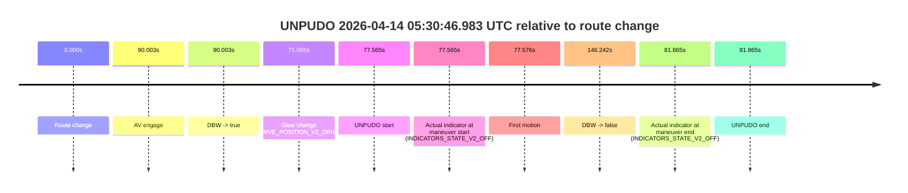
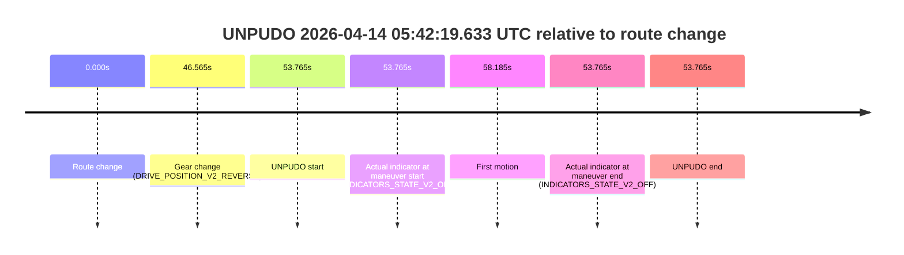
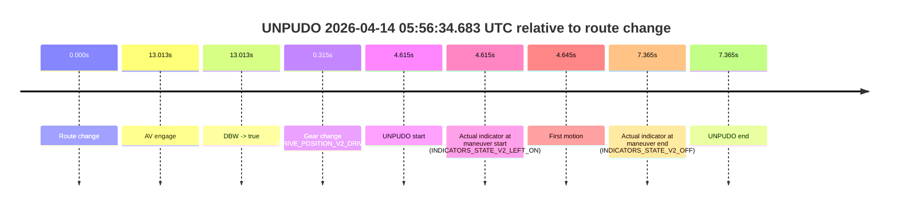

# Run Report: fme10005/2026-04-14--05-24-52--gen2-av-2631af58-8fe4-4d79-bd51-386400c81c15

| Field | Value |
|---|---|
| Run ID | `fme10005/2026-04-14--05-24-52--gen2-av-2631af58-8fe4-4d79-bd51-386400c81c15` |
| Date | `2026-04-14` |
| Model(s) | `lively-orange-horse` |
| Author | `guy.geva` |
| Event count | `5` |

## unpudo 2026-04-14 05:29:41.933 UTC

| Field | Value |
|---|---|
| Model | `lively-orange-horse` |
| Author | `guy.geva` |
| Run ID | `fme10005/2026-04-14--05-24-52--gen2-av-2631af58-8fe4-4d79-bd51-386400c81c15` |
| Date | `2026-04-14` |
| Time (UTC) | `05:29:41.933` |
| Event type | `unpudo` |
| Disengagement type | `failed_to_unpudo` |
| Route change | `found` |
| Console | [run](https://console.sso.wayve.ai/run/fme10005/2026-04-14--05-24-52--gen2-av-2631af58-8fe4-4d79-bd51-386400c81c15?id=&time-unixus=1776144581933296) |
| Foxglove | [segment](https://app.foxglove.dev/wayve-on-prem/p/prj_0dX18KZdVHg1fmmI/view?ds=foxglove-stream&ds.deviceName=fme10005&ds.start=2026-04-14T05%3A29%3A19.418226Z&ds.end=2026-04-14T05%3A30%3A56.401138Z&layoutId=lay_0e7VD4WIKDQGU73Y&time=2026-04-14T05%3A29%3A41.933296Z) |

### Event card: fail

- Fail: AV owns part of the segment, but the event still resolves as a model-performance failure under the AV-only scoring rule.

| Event | Time (UTC) | Delta from route change |
|---|---:|---:|
| Route change | 2026-04-14 05:29:29.418 | `0.000s` |
| AV engage | 2026-04-14 05:29:57.619 | `28.201s` |
| DBW -> true | 2026-04-14 05:29:57.619 | `28.201s` |
| Gear change (DRIVE_POSITION_V2_REVERSE) | 2026-04-14 05:29:36.733 | `7.315s` |
| UNPUDO start | 2026-04-14 05:29:41.933 | `12.515s` |
| Actual indicator at maneuver start (INDICATORS_STATE_V2_OFF) | 2026-04-14 05:29:41.933 | `12.515s` |
| First motion | 2026-04-14 05:29:46.453 | `17.035s` |
| DBW -> false | 2026-04-14 05:30:46.401 | `76.983s` |
| Actual indicator at maneuver end (INDICATORS_STATE_V2_OFF) | 2026-04-14 05:29:49.783 | `20.365s` |
| UNPUDO end | 2026-04-14 05:29:49.783 | `20.365s` |

| Metric | Value |
|---|---|
| Outcome | `fail` |
| Effective failure type | `failed_to_unpudo` |
| Route change status | `found` |
| DBW at event start | `false` |
| DBW at event end | `false` |
| Predicted gear at AV start | `DRIVE_POSITION_V2_DRIVE` |
| Actual gear at AV start | `DRIVE_POSITION_V2_DRIVE` |
| Predicted gear at event start | `DRIVE_POSITION_V2_DRIVE` |
| Actual gear at event start | `DRIVE_POSITION_V2_REVERSE` |
| Planned indicator direction | `INDICATORS_STATE_V2_OFF` |
| Controller indicator direction | `INDICATORS_STATE_V2_OFF` |
| Actual indicator direction | `INDICATORS_STATE_V2_OFF` |
| Actual indicator at maneuver end | `INDICATORS_STATE_V2_OFF` |
| Driver accel help in AV | `false` |
| Driver accel help timestamp | `n/a` |
| Max accel pedal pct in AV | `0.0%` |
| Max brake pedal pct in AV | `0.0%` |
| Max speed mps in AV | `0.000` |
| Route -> AV | `28.201s` |
| AV -> event start | `-15.686s` |
| AV -> first motion | `-11.166s` |
| AV duration before disengagement | `48.781s` |
| Trajectory waypoint count | `36` |
| Driving-plan step count | `11` |

The scored portion starts from the AV-owned window, not from the pre-AV setup. Route-change search in the stopped pre-event segment was `found`, with the baseline therefore set to route change. At the event anchor the model predicts `DRIVE_POSITION_V2_DRIVE` and the actual gear is `DRIVE_POSITION_V2_REVERSE`. The effective model outcome is `fail` because `failed_to_unpudo`.

### Resolution

| Field | Value |
|---|---|
| Final outcome | `fail` |
| Do we agree with this label? | `yes` |
| Source disengagement type | `failed_to_unpudo` |
| Resolved effective failure type | `failed_to_unpudo` |
| Confidence | `high` |

## unpudo 2026-04-14 05:30:46.983 UTC

| Field | Value |
|---|---|
| Model | `lively-orange-horse` |
| Author | `guy.geva` |
| Run ID | `fme10005/2026-04-14--05-24-52--gen2-av-2631af58-8fe4-4d79-bd51-386400c81c15` |
| Date | `2026-04-14` |
| Time (UTC) | `05:30:46.983` |
| Event type | `unpudo` |
| Disengagement type | `failed_to_unpudo` |
| Route change | `found` |
| Console | [run](https://console.sso.wayve.ai/run/fme10005/2026-04-14--05-24-52--gen2-av-2631af58-8fe4-4d79-bd51-386400c81c15?id=&time-unixus=1776144646983298) |
| Foxglove | [segment](https://app.foxglove.dev/wayve-on-prem/p/prj_0dX18KZdVHg1fmmI/view?ds=foxglove-stream&ds.deviceName=fme10005&ds.start=2026-04-14T05%3A29%3A19.418226Z&ds.end=2026-04-14T05%3A32%3A05.660489Z&layoutId=lay_0e7VD4WIKDQGU73Y&time=2026-04-14T05%3A30%3A46.983298Z) |

### Event card: fail

- Fail: AV owns part of the segment, but the event still resolves as a model-performance failure under the AV-only scoring rule.

| Event | Time (UTC) | Delta from route change |
|---|---:|---:|
| Route change | 2026-04-14 05:29:29.418 | `0.000s` |
| AV engage | 2026-04-14 05:30:59.420 | `90.003s` |
| DBW -> true | 2026-04-14 05:30:59.420 | `90.003s` |
| Gear change (DRIVE_POSITION_V2_DRIVE) | 2026-04-14 05:30:40.483 | `71.065s` |
| UNPUDO start | 2026-04-14 05:30:46.983 | `77.565s` |
| Actual indicator at maneuver start (INDICATORS_STATE_V2_OFF) | 2026-04-14 05:30:46.983 | `77.565s` |
| First motion | 2026-04-14 05:30:46.994 | `77.576s` |
| DBW -> false | 2026-04-14 05:31:55.660 | `146.242s` |
| Actual indicator at maneuver end (INDICATORS_STATE_V2_OFF) | 2026-04-14 05:30:51.283 | `81.865s` |
| UNPUDO end | 2026-04-14 05:30:51.283 | `81.865s` |

| Metric | Value |
|---|---|
| Outcome | `fail` |
| Effective failure type | `failed_to_unpudo` |
| Route change status | `found` |
| DBW at event start | `false` |
| DBW at event end | `false` |
| Predicted gear at AV start | `DRIVE_POSITION_V2_DRIVE` |
| Actual gear at AV start | `DRIVE_POSITION_V2_DRIVE` |
| Predicted gear at event start | `DRIVE_POSITION_V2_DRIVE` |
| Actual gear at event start | `DRIVE_POSITION_V2_DRIVE` |
| Planned indicator direction | `INDICATORS_STATE_V2_LEFT_ON` |
| Controller indicator direction | `INDICATORS_STATE_V2_LEFT_ON` |
| Actual indicator direction | `INDICATORS_STATE_V2_OFF` |
| Actual indicator at maneuver end | `INDICATORS_STATE_V2_OFF` |
| Driver accel help in AV | `false` |
| Driver accel help timestamp | `n/a` |
| Max accel pedal pct in AV | `0.0%` |
| Max brake pedal pct in AV | `0.0%` |
| Max speed mps in AV | `0.000` |
| Route -> AV | `90.003s` |
| AV -> event start | `-12.438s` |
| AV -> first motion | `-12.427s` |
| AV duration before disengagement | `56.240s` |
| Trajectory waypoint count | `37` |
| Driving-plan step count | `11` |

The scored portion starts from the AV-owned window, not from the pre-AV setup. Route-change search in the stopped pre-event segment was `found`, with the baseline therefore set to route change. At the event anchor the model predicts `DRIVE_POSITION_V2_DRIVE` and the actual gear is `DRIVE_POSITION_V2_DRIVE`. The effective model outcome is `fail` because `failed_to_unpudo`.

### Resolution

| Field | Value |
|---|---|
| Final outcome | `fail` |
| Do we agree with this label? | `yes` |
| Source disengagement type | `failed_to_unpudo` |
| Resolved effective failure type | `failed_to_unpudo` |
| Confidence | `high` |

## unpudo 2026-04-14 05:32:18.483 UTC

| Field | Value |
|---|---|
| Model | `lively-orange-horse` |
| Author | `guy.geva` |
| Run ID | `fme10005/2026-04-14--05-24-52--gen2-av-2631af58-8fe4-4d79-bd51-386400c81c15` |
| Date | `2026-04-14` |
| Time (UTC) | `05:32:18.483` |
| Event type | `unpudo` |
| Disengagement type | `none observed` |
| Route change | `found` |
| Console | [run](https://console.sso.wayve.ai/run/fme10005/2026-04-14--05-24-52--gen2-av-2631af58-8fe4-4d79-bd51-386400c81c15?id=&time-unixus=1776144738483288) |
| Foxglove | [segment](https://app.foxglove.dev/wayve-on-prem/p/prj_0dX18KZdVHg1fmmI/view?ds=foxglove-stream&ds.deviceName=fme10005&ds.start=2026-04-14T05%3A30%3A30.068215Z&ds.end=2026-04-14T05%3A33%3A05.241050Z&layoutId=lay_0e7VD4WIKDQGU73Y&time=2026-04-14T05%3A32%3A18.483288Z) |

### Event card: fail

- Fail: the credited unpudo does not stay AV-owned. The event window starts with DBW false, and the maneuver outcome lands outside a clean AV-owned segment.

| Event | Time (UTC) | Delta from route change |
|---|---:|---:|
| Route change | 2026-04-14 05:30:40.068 | `0.000s` |
| AV engage | 2026-04-14 05:32:36.320 | `116.253s` |
| DBW -> true | 2026-04-14 05:32:36.320 | `116.253s` |
| Gear change (DRIVE_POSITION_V2_DRIVE) | 2026-04-14 05:32:16.433 | `96.365s` |
| UNPUDO start | 2026-04-14 05:32:18.483 | `98.415s` |
| Actual indicator at maneuver start (INDICATORS_STATE_V2_LEFT_ON) | 2026-04-14 05:32:18.483 | `98.415s` |
| First motion | 2026-04-14 05:32:18.533 | `98.465s` |
| DBW -> false | 2026-04-14 05:32:55.241 | `135.173s` |
| Actual indicator at maneuver end (INDICATORS_STATE_V2_OFF) | 2026-04-14 05:32:23.183 | `103.115s` |
| UNPUDO end | 2026-04-14 05:32:23.183 | `103.115s` |

| Metric | Value |
|---|---|
| Outcome | `fail` |
| Effective failure type | `completed_outside_av` |
| Route change status | `found` |
| DBW at event start | `false` |
| DBW at event end | `false` |
| Predicted gear at AV start | `DRIVE_POSITION_V2_DRIVE` |
| Actual gear at AV start | `DRIVE_POSITION_V2_DRIVE` |
| Predicted gear at event start | `DRIVE_POSITION_V2_DRIVE` |
| Actual gear at event start | `DRIVE_POSITION_V2_DRIVE` |
| Planned indicator direction | `INDICATORS_STATE_V2_LEFT_ON` |
| Controller indicator direction | `INDICATORS_STATE_V2_LEFT_ON` |
| Actual indicator direction | `INDICATORS_STATE_V2_LEFT_ON` |
| Actual indicator at maneuver end | `INDICATORS_STATE_V2_OFF` |
| Driver accel help in AV | `false` |
| Driver accel help timestamp | `n/a` |
| Max accel pedal pct in AV | `0.0%` |
| Max brake pedal pct in AV | `0.0%` |
| Max speed mps in AV | `0.000` |
| Route -> AV | `116.253s` |
| AV -> event start | `-17.838s` |
| AV -> first motion | `-17.787s` |
| AV duration before disengagement | `18.920s` |
| Trajectory waypoint count | `37` |
| Driving-plan step count | `11` |

The scored portion starts from the AV-owned window, not from the pre-AV setup. Route-change search in the stopped pre-event segment was `found`, with the baseline therefore set to route change. At the event anchor the model predicts `DRIVE_POSITION_V2_DRIVE` and the actual gear is `DRIVE_POSITION_V2_DRIVE`. The effective model outcome is `fail` because `completed_outside_av`.

### Resolution

| Field | Value |
|---|---|
| Final outcome | `fail` |
| Do we agree with this label? | `yes` |
| Source disengagement type | `none observed` |
| Resolved effective failure type | `completed_outside_av` |
| Confidence | `high` |

## unpudo 2026-04-14 05:42:19.633 UTC

| Field | Value |
|---|---|
| Model | `lively-orange-horse` |
| Author | `guy.geva` |
| Run ID | `fme10005/2026-04-14--05-24-52--gen2-av-2631af58-8fe4-4d79-bd51-386400c81c15` |
| Date | `2026-04-14` |
| Time (UTC) | `05:42:19.633` |
| Event type | `unpudo` |
| Disengagement type | `none observed` |
| Route change | `found` |
| Console | [run](https://console.sso.wayve.ai/run/fme10005/2026-04-14--05-24-52--gen2-av-2631af58-8fe4-4d79-bd51-386400c81c15?id=&time-unixus=1776145339633304) |
| Foxglove | [segment](https://app.foxglove.dev/wayve-on-prem/p/prj_0dX18KZdVHg1fmmI/view?ds=foxglove-stream&ds.deviceName=fme10005&ds.start=2026-04-14T05%3A41%3A15.868268Z&ds.end=2026-04-14T05%3A42%3A29.633304Z&layoutId=lay_0e7VD4WIKDQGU73Y&time=2026-04-14T05%3A42%3A19.633304Z) |

### Event card: fail

- Fail: the credited unpudo does not stay AV-owned. The event window starts with DBW false, and the maneuver outcome lands outside a clean AV-owned segment.

| Event | Time (UTC) | Delta from route change |
|---|---:|---:|
| Route change | 2026-04-14 05:41:25.868 | `0.000s` |
| Gear change (DRIVE_POSITION_V2_REVERSE) | 2026-04-14 05:42:12.433 | `46.565s` |
| UNPUDO start | 2026-04-14 05:42:19.633 | `53.765s` |
| Actual indicator at maneuver start (INDICATORS_STATE_V2_OFF) | 2026-04-14 05:42:19.633 | `53.765s` |
| First motion | 2026-04-14 05:42:24.053 | `58.185s` |
| Actual indicator at maneuver end (INDICATORS_STATE_V2_OFF) | 2026-04-14 05:42:19.633 | `53.765s` |
| UNPUDO end | 2026-04-14 05:42:19.633 | `53.765s` |

| Metric | Value |
|---|---|
| Outcome | `fail` |
| Effective failure type | `not_av_owned` |
| Route change status | `found` |
| DBW at event start | `false` |
| DBW at event end | `false` |
| Predicted gear at AV start | `n/a` |
| Actual gear at AV start | `n/a` |
| Predicted gear at event start | `DRIVE_POSITION_V2_DRIVE` |
| Actual gear at event start | `DRIVE_POSITION_V2_REVERSE` |
| Planned indicator direction | `INDICATORS_STATE_V2_OFF` |
| Controller indicator direction | `INDICATORS_STATE_V2_OFF` |
| Actual indicator direction | `INDICATORS_STATE_V2_OFF` |
| Actual indicator at maneuver end | `INDICATORS_STATE_V2_OFF` |
| Driver accel help in AV | `false` |
| Driver accel help timestamp | `n/a` |
| Max accel pedal pct in AV | `0.0%` |
| Max brake pedal pct in AV | `0.0%` |
| Max speed mps in AV | `0.000` |
| Route -> AV | `n/a` |
| AV -> event start | `n/a` |
| AV -> first motion | `n/a` |
| AV duration before disengagement | `n/a` |
| Trajectory waypoint count | `36` |
| Driving-plan step count | `11` |

The scored portion starts from the AV-owned window, not from the pre-AV setup. Route-change search in the stopped pre-event segment was `found`, with the baseline therefore set to route change. At the event anchor the model predicts `DRIVE_POSITION_V2_DRIVE` and the actual gear is `DRIVE_POSITION_V2_REVERSE`. The effective model outcome is `fail` because `not_av_owned`.

### Resolution

| Field | Value |
|---|---|
| Final outcome | `fail` |
| Do we agree with this label? | `yes` |
| Source disengagement type | `none observed` |
| Resolved effective failure type | `not_av_owned` |
| Confidence | `high` |

## unpudo 2026-04-14 05:56:34.683 UTC

| Field | Value |
|---|---|
| Model | `lively-orange-horse` |
| Author | `guy.geva` |
| Run ID | `fme10005/2026-04-14--05-24-52--gen2-av-2631af58-8fe4-4d79-bd51-386400c81c15` |
| Date | `2026-04-14` |
| Time (UTC) | `05:56:34.683` |
| Event type | `unpudo` |
| Disengagement type | `failed_to_unpudo` |
| Route change | `found` |
| Console | [run](https://console.sso.wayve.ai/run/fme10005/2026-04-14--05-24-52--gen2-av-2631af58-8fe4-4d79-bd51-386400c81c15?id=&time-unixus=1776146194683291) |
| Foxglove | [segment](https://app.foxglove.dev/wayve-on-prem/p/prj_0dX18KZdVHg1fmmI/view?ds=foxglove-stream&ds.deviceName=fme10005&ds.start=2026-04-14T05%3A56%3A20.068181Z&ds.end=2026-04-14T05%3A56%3A47.433289Z&layoutId=lay_0e7VD4WIKDQGU73Y&time=2026-04-14T05%3A56%3A34.683291Z) |

### Event card: fail

- Fail: AV owns part of the segment, but the event still resolves as a model-performance failure under the AV-only scoring rule.

| Event | Time (UTC) | Delta from route change |
|---|---:|---:|
| Route change | 2026-04-14 05:56:30.068 | `0.000s` |
| AV engage | 2026-04-14 05:56:43.080 | `13.013s` |
| DBW -> true | 2026-04-14 05:56:43.080 | `13.013s` |
| Gear change (DRIVE_POSITION_V2_DRIVE) | 2026-04-14 05:56:30.383 | `0.315s` |
| UNPUDO start | 2026-04-14 05:56:34.683 | `4.615s` |
| Actual indicator at maneuver start (INDICATORS_STATE_V2_LEFT_ON) | 2026-04-14 05:56:34.683 | `4.615s` |
| First motion | 2026-04-14 05:56:34.713 | `4.645s` |
| Actual indicator at maneuver end (INDICATORS_STATE_V2_OFF) | 2026-04-14 05:56:37.433 | `7.365s` |
| UNPUDO end | 2026-04-14 05:56:37.433 | `7.365s` |

| Metric | Value |
|---|---|
| Outcome | `fail` |
| Effective failure type | `failed_to_unpudo` |
| Route change status | `found` |
| DBW at event start | `false` |
| DBW at event end | `false` |
| Predicted gear at AV start | `DRIVE_POSITION_V2_DRIVE` |
| Actual gear at AV start | `DRIVE_POSITION_V2_DRIVE` |
| Predicted gear at event start | `DRIVE_POSITION_V2_DRIVE` |
| Actual gear at event start | `DRIVE_POSITION_V2_DRIVE` |
| Planned indicator direction | `INDICATORS_STATE_V2_RIGHT_ON` |
| Controller indicator direction | `INDICATORS_STATE_V2_RIGHT_ON` |
| Actual indicator direction | `INDICATORS_STATE_V2_LEFT_ON` |
| Actual indicator at maneuver end | `INDICATORS_STATE_V2_OFF` |
| Driver accel help in AV | `false` |
| Driver accel help timestamp | `n/a` |
| Max accel pedal pct in AV | `0.0%` |
| Max brake pedal pct in AV | `0.0%` |
| Max speed mps in AV | `0.000` |
| Route -> AV | `13.013s` |
| AV -> event start | `-8.398s` |
| AV -> first motion | `-8.368s` |
| AV duration before disengagement | `n/a` |
| Trajectory waypoint count | `37` |
| Driving-plan step count | `11` |

The scored portion starts from the AV-owned window, not from the pre-AV setup. Route-change search in the stopped pre-event segment was `found`, with the baseline therefore set to route change. At the event anchor the model predicts `DRIVE_POSITION_V2_DRIVE` and the actual gear is `DRIVE_POSITION_V2_DRIVE`. The effective model outcome is `fail` because `failed_to_unpudo`.

### Resolution

| Field | Value |
|---|---|
| Final outcome | `fail` |
| Do we agree with this label? | `yes` |
| Source disengagement type | `failed_to_unpudo` |
| Resolved effective failure type | `failed_to_unpudo` |
| Confidence | `high` |
