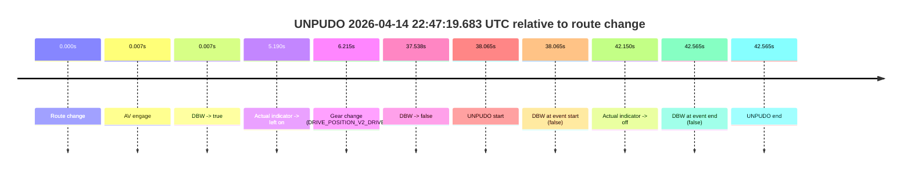
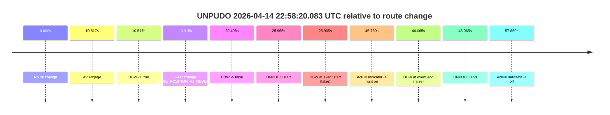
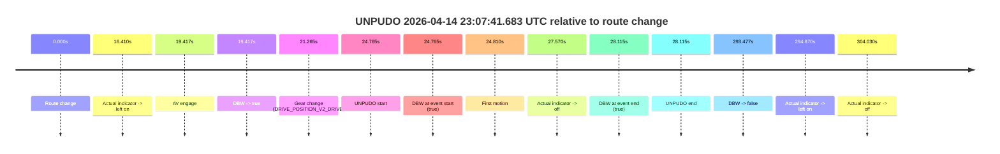
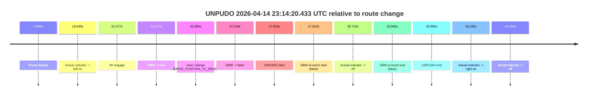
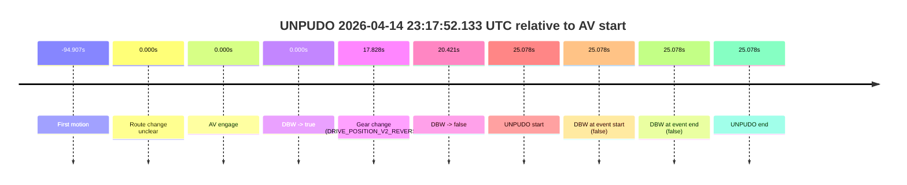
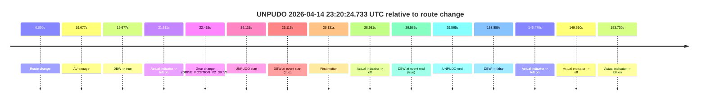
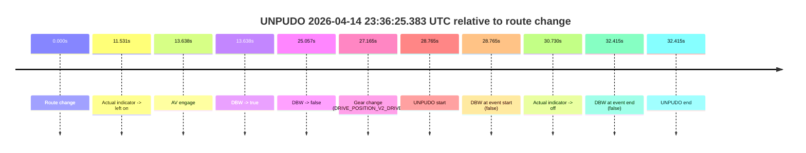

# Run Report: fme10005/2026-04-14--22-37-44--gen2-av-8d87ab20-f543-464d-a9ba-376113d03561

| Field | Value |
|---|---|
| Run ID | `fme10005/2026-04-14--22-37-44--gen2-av-8d87ab20-f543-464d-a9ba-376113d03561` |
| Date | `2026-04-14` |
| Model(s) | `armadillo-amethyst-squeaky` |
| Author | `guy.geva` |
| Event count | `8` |

## unpudo 2026-04-14 22:47:19.683 UTC

| Field | Value |
|---|---|
| Model | `armadillo-amethyst-squeaky` |
| Author | `guy.geva` |
| Run ID | `fme10005/2026-04-14--22-37-44--gen2-av-8d87ab20-f543-464d-a9ba-376113d03561` |
| Date | `2026-04-14` |
| Time (UTC) | `22:47:19.683` |
| Event type | `unpudo` |
| Disengagement type | `failed_to_unpudo` |
| Route change | `found` |
| Console | [run](https://console.sso.wayve.ai/run/fme10005/2026-04-14--22-37-44--gen2-av-8d87ab20-f543-464d-a9ba-376113d03561?id=&time-unixus=1776206839683316) |
| Foxglove | [segment](https://app.foxglove.dev/wayve-on-prem/p/prj_0dX18KZdVHg1fmmI/view?ds=foxglove-stream&ds.deviceName=fme10005&ds.start=2026-04-14T22%3A46%3A31.618260Z&ds.end=2026-04-14T22%3A47%3A34.183313Z&layoutId=lay_0e7VD4WIKDQGU73Y&time=2026-04-14T22%3A47%3A19.683316Z) |

### Event card: fail

- Fail: AV owns part of the segment, but the event still resolves as a model-performance failure under the AV-only scoring rule.

| Event | Time (UTC) | Delta from route change |
|---|---:|---:|
| Route change | 2026-04-14 22:46:41.618 | `0.000s` |
| AV engage | 2026-04-14 22:46:41.625 | `0.007s` |
| DBW -> true | 2026-04-14 22:46:41.625 | `0.007s` |
| Actual indicator -> left on | 2026-04-14 22:46:46.808 | `5.190s` |
| Gear change (DRIVE_POSITION_V2_DRIVE) | 2026-04-14 22:46:47.833 | `6.215s` |
| DBW -> false | 2026-04-14 22:47:19.155 | `37.538s` |
| UNPUDO start | 2026-04-14 22:47:19.683 | `38.065s` |
| DBW at event start (false) | 2026-04-14 22:47:19.683 | `38.065s` |
| Actual indicator -> off | 2026-04-14 22:47:23.768 | `42.150s` |
| DBW at event end (false) | 2026-04-14 22:47:24.183 | `42.565s` |
| UNPUDO end | 2026-04-14 22:47:24.183 | `42.565s` |

| Metric | Value |
|---|---|
| Outcome | `fail` |
| Effective failure type | `failed_to_unpudo` |
| Route change status | `found` |
| DBW at event start | `false` |
| DBW at event end | `false` |
| Predicted gear at AV start | `DRIVE_POSITION_V2_PARK` |
| Actual gear at AV start | `DRIVE_POSITION_V2_PARK` |
| Predicted gear at event start | `DRIVE_POSITION_V2_DRIVE` |
| Actual gear at event start | `DRIVE_POSITION_V2_DRIVE` |
| Planned indicator direction | `INDICATORS_STATE_V2_LEFT_ON` |
| Controller indicator direction | `INDICATORS_STATE_V2_LEFT_ON` |
| Actual indicator direction | `INDICATORS_STATE_V2_LEFT_ON` |
| Actual indicator at maneuver end | `INDICATORS_STATE_V2_OFF` |
| Driver accel help in AV | `false` |
| Driver accel help timestamp | `n/a` |
| Max accel pedal pct in AV | `0.0%` |
| Max brake pedal pct in AV | `8.0%` |
| Max speed mps in AV | `0.000` |
| Success timing baseline | `route change` |
| Route -> AV | `0.007s` |
| AV -> event start | `38.058s` |
| AV -> first motion | `n/a` |
| Success baseline -> event start | `38.065s` |
| Success baseline -> first motion | `n/a` |
| AV duration before disengagement | `37.530s` |
| Trajectory waypoint count | `36` |
| Driving-plan step count | `11` |

The scored portion starts from the AV-owned window, not from the pre-AV setup. Route-change search in the stopped pre-event segment was `found`, with the baseline therefore set to route change. At the event anchor the model predicts `DRIVE_POSITION_V2_DRIVE` and the actual gear is `DRIVE_POSITION_V2_DRIVE`. The effective model outcome is `fail` because `failed_to_unpudo.`

### Resolution

| Field | Value |
|---|---|
| Final outcome | `fail` |
| Do we agree with this label? | `yes` |
| Source disengagement type | `failed_to_unpudo` |
| Resolved effective failure type | `failed_to_unpudo` |
| Confidence | `high` |

## unpudo 2026-04-14 22:58:20.083 UTC

| Field | Value |
|---|---|
| Model | `armadillo-amethyst-squeaky` |
| Author | `guy.geva` |
| Run ID | `fme10005/2026-04-14--22-37-44--gen2-av-8d87ab20-f543-464d-a9ba-376113d03561` |
| Date | `2026-04-14` |
| Time (UTC) | `22:58:20.083` |
| Event type | `unpudo` |
| Disengagement type | `failed_to_unpudo` |
| Route change | `found` |
| Console | [run](https://console.sso.wayve.ai/run/fme10005/2026-04-14--22-37-44--gen2-av-8d87ab20-f543-464d-a9ba-376113d03561?id=&time-unixus=1776207500083318) |
| Foxglove | [segment](https://app.foxglove.dev/wayve-on-prem/p/prj_0dX18KZdVHg1fmmI/view?ds=foxglove-stream&ds.deviceName=fme10005&ds.start=2026-04-14T22%3A57%3A44.118292Z&ds.end=2026-04-14T22%3A58%3A50.183295Z&layoutId=lay_0e7VD4WIKDQGU73Y&time=2026-04-14T22%3A58%3A20.083318Z) |

### Event card: fail

- Fail: AV owns part of the segment, but the event still resolves as a model-performance failure under the AV-only scoring rule.

| Event | Time (UTC) | Delta from route change |
|---|---:|---:|
| Route change | 2026-04-14 22:57:54.118 | `0.000s` |
| AV engage | 2026-04-14 22:58:04.635 | `10.517s` |
| DBW -> true | 2026-04-14 22:58:04.635 | `10.517s` |
| Gear change (DRIVE_POSITION_V2_REVERSE) | 2026-04-14 22:58:08.033 | `13.915s` |
| DBW -> false | 2026-04-14 22:58:14.615 | `20.498s` |
| UNPUDO start | 2026-04-14 22:58:20.083 | `25.965s` |
| DBW at event start (false) | 2026-04-14 22:58:20.083 | `25.965s` |
| Actual indicator -> right on | 2026-04-14 22:58:39.848 | `45.730s` |
| DBW at event end (false) | 2026-04-14 22:58:40.183 | `46.065s` |
| UNPUDO end | 2026-04-14 22:58:40.183 | `46.065s` |
| Actual indicator -> off | 2026-04-14 22:58:51.968 | `57.850s` |

| Metric | Value |
|---|---|
| Outcome | `fail` |
| Effective failure type | `failed_to_unpudo` |
| Route change status | `found` |
| DBW at event start | `false` |
| DBW at event end | `false` |
| Predicted gear at AV start | `DRIVE_POSITION_V2_PARK` |
| Actual gear at AV start | `DRIVE_POSITION_V2_PARK` |
| Predicted gear at event start | `DRIVE_POSITION_V2_REVERSE` |
| Actual gear at event start | `DRIVE_POSITION_V2_REVERSE` |
| Planned indicator direction | `INDICATORS_STATE_V2_OFF` |
| Controller indicator direction | `INDICATORS_STATE_V2_OFF` |
| Actual indicator direction | `INDICATORS_STATE_V2_OFF` |
| Actual indicator at maneuver end | `INDICATORS_STATE_V2_RIGHT_ON` |
| Driver accel help in AV | `false` |
| Driver accel help timestamp | `n/a` |
| Max accel pedal pct in AV | `0.0%` |
| Max brake pedal pct in AV | `8.0%` |
| Max speed mps in AV | `0.000` |
| Success timing baseline | `route change` |
| Route -> AV | `10.517s` |
| AV -> event start | `15.448s` |
| AV -> first motion | `n/a` |
| Success baseline -> event start | `25.965s` |
| Success baseline -> first motion | `n/a` |
| AV duration before disengagement | `9.980s` |
| Trajectory waypoint count | `36` |
| Driving-plan step count | `11` |

The scored portion starts from the AV-owned window, not from the pre-AV setup. Route-change search in the stopped pre-event segment was `found`, with the baseline therefore set to route change. At the event anchor the model predicts `DRIVE_POSITION_V2_REVERSE` and the actual gear is `DRIVE_POSITION_V2_REVERSE`. The effective model outcome is `fail` because `failed_to_unpudo.`

### Resolution

| Field | Value |
|---|---|
| Final outcome | `fail` |
| Do we agree with this label? | `yes` |
| Source disengagement type | `failed_to_unpudo` |
| Resolved effective failure type | `failed_to_unpudo` |
| Confidence | `high` |

## unpudo 2026-04-14 23:02:17.533 UTC

| Field | Value |
|---|---|
| Model | `armadillo-amethyst-squeaky` |
| Author | `guy.geva` |
| Run ID | `fme10005/2026-04-14--22-37-44--gen2-av-8d87ab20-f543-464d-a9ba-376113d03561` |
| Date | `2026-04-14` |
| Time (UTC) | `23:02:17.533` |
| Event type | `unpudo` |
| Disengagement type | `failed_to_unpudo` |
| Route change | `found` |
| Console | [run](https://console.sso.wayve.ai/run/fme10005/2026-04-14--22-37-44--gen2-av-8d87ab20-f543-464d-a9ba-376113d03561?id=&time-unixus=1776207737533301) |
| Foxglove | [segment](https://app.foxglove.dev/wayve-on-prem/p/prj_0dX18KZdVHg1fmmI/view?ds=foxglove-stream&ds.deviceName=fme10005&ds.start=2026-04-14T23%3A01%3A49.918256Z&ds.end=2026-04-14T23%3A02%3A31.533321Z&layoutId=lay_0e7VD4WIKDQGU73Y&time=2026-04-14T23%3A02%3A17.533301Z) |

### Event card: fail

- Fail: AV owns part of the segment, but the event still resolves as a model-performance failure under the AV-only scoring rule.

| Event | Time (UTC) | Delta from route change |
|---|---:|---:|
| Route change | 2026-04-14 23:01:59.918 | `0.000s` |
| AV engage | 2026-04-14 23:02:10.375 | `10.457s` |
| DBW -> true | 2026-04-14 23:02:10.375 | `10.457s` |
| Actual indicator -> left on | 2026-04-14 23:02:10.928 | `11.010s` |
| Gear change (DRIVE_POSITION_V2_DRIVE) | 2026-04-14 23:02:12.033 | `12.115s` |
| DBW -> false | 2026-04-14 23:02:16.995 | `17.078s` |
| UNPUDO start | 2026-04-14 23:02:17.533 | `17.615s` |
| DBW at event start (false) | 2026-04-14 23:02:17.533 | `17.615s` |
| Actual indicator -> off | 2026-04-14 23:02:21.148 | `21.230s` |
| DBW at event end (false) | 2026-04-14 23:02:21.533 | `21.615s` |
| UNPUDO end | 2026-04-14 23:02:21.533 | `21.615s` |

| Metric | Value |
|---|---|
| Outcome | `fail` |
| Effective failure type | `failed_to_unpudo` |
| Route change status | `found` |
| DBW at event start | `false` |
| DBW at event end | `false` |
| Predicted gear at AV start | `DRIVE_POSITION_V2_PARK` |
| Actual gear at AV start | `DRIVE_POSITION_V2_PARK` |
| Predicted gear at event start | `DRIVE_POSITION_V2_DRIVE` |
| Actual gear at event start | `DRIVE_POSITION_V2_DRIVE` |
| Planned indicator direction | `INDICATORS_STATE_V2_LEFT_ON` |
| Controller indicator direction | `INDICATORS_STATE_V2_LEFT_ON` |
| Actual indicator direction | `INDICATORS_STATE_V2_LEFT_ON` |
| Actual indicator at maneuver end | `INDICATORS_STATE_V2_OFF` |
| Driver accel help in AV | `false` |
| Driver accel help timestamp | `n/a` |
| Max accel pedal pct in AV | `0.0%` |
| Max brake pedal pct in AV | `8.0%` |
| Max speed mps in AV | `0.000` |
| Success timing baseline | `route change` |
| Route -> AV | `10.457s` |
| AV -> event start | `7.158s` |
| AV -> first motion | `n/a` |
| Success baseline -> event start | `17.615s` |
| Success baseline -> first motion | `n/a` |
| AV duration before disengagement | `6.620s` |
| Trajectory waypoint count | `37` |
| Driving-plan step count | `11` |

The scored portion starts from the AV-owned window, not from the pre-AV setup. Route-change search in the stopped pre-event segment was `found`, with the baseline therefore set to route change. At the event anchor the model predicts `DRIVE_POSITION_V2_DRIVE` and the actual gear is `DRIVE_POSITION_V2_DRIVE`. The effective model outcome is `fail` because `failed_to_unpudo.`

### Resolution

| Field | Value |
|---|---|
| Final outcome | `fail` |
| Do we agree with this label? | `yes` |
| Source disengagement type | `failed_to_unpudo` |
| Resolved effective failure type | `failed_to_unpudo` |
| Confidence | `high` |

## unpudo 2026-04-14 23:07:41.683 UTC

| Field | Value |
|---|---|
| Model | `armadillo-amethyst-squeaky` |
| Author | `guy.geva` |
| Run ID | `fme10005/2026-04-14--22-37-44--gen2-av-8d87ab20-f543-464d-a9ba-376113d03561` |
| Date | `2026-04-14` |
| Time (UTC) | `23:07:41.683` |
| Event type | `unpudo` |
| Disengagement type | `none observed` |
| Route change | `found` |
| Console | [run](https://console.sso.wayve.ai/run/fme10005/2026-04-14--22-37-44--gen2-av-8d87ab20-f543-464d-a9ba-376113d03561?id=&time-unixus=1776208061683301) |
| Foxglove | [segment](https://app.foxglove.dev/wayve-on-prem/p/prj_0dX18KZdVHg1fmmI/view?ds=foxglove-stream&ds.deviceName=fme10005&ds.start=2026-04-14T23%3A07%3A06.918299Z&ds.end=2026-04-14T23%3A12%3A20.395560Z&layoutId=lay_0e7VD4WIKDQGU73Y&time=2026-04-14T23%3A07%3A41.683301Z) |

### Event card: pass

- Pass: AV owns the credited unpudo from route change through the official unpudo window, the gear state is aligned at the anchor, and the vehicle moves without driver accelerator help in AV.

| Event | Time (UTC) | Delta from route change |
|---|---:|---:|
| Route change | 2026-04-14 23:07:16.918 | `0.000s` |
| Actual indicator -> left on | 2026-04-14 23:07:33.328 | `16.410s` |
| AV engage | 2026-04-14 23:07:36.335 | `19.417s` |
| DBW -> true | 2026-04-14 23:07:36.335 | `19.417s` |
| Gear change (DRIVE_POSITION_V2_DRIVE) | 2026-04-14 23:07:38.183 | `21.265s` |
| UNPUDO start | 2026-04-14 23:07:41.683 | `24.765s` |
| DBW at event start (true) | 2026-04-14 23:07:41.683 | `24.765s` |
| First motion | 2026-04-14 23:07:41.728 | `24.810s` |
| Actual indicator -> off | 2026-04-14 23:07:44.488 | `27.570s` |
| DBW at event end (true) | 2026-04-14 23:07:45.033 | `28.115s` |
| UNPUDO end | 2026-04-14 23:07:45.033 | `28.115s` |
| DBW -> false | 2026-04-14 23:12:10.395 | `293.477s` |
| Actual indicator -> left on | 2026-04-14 23:12:11.788 | `294.870s` |
| Actual indicator -> off | 2026-04-14 23:12:20.948 | `304.030s` |

| Metric | Value |
|---|---|
| Outcome | `pass` |
| Effective failure type | `none` |
| Route change status | `found` |
| DBW at event start | `true` |
| DBW at event end | `true` |
| Predicted gear at AV start | `DRIVE_POSITION_V2_PARK` |
| Actual gear at AV start | `DRIVE_POSITION_V2_PARK` |
| Predicted gear at event start | `DRIVE_POSITION_V2_DRIVE` |
| Actual gear at event start | `DRIVE_POSITION_V2_DRIVE` |
| Planned indicator direction | `INDICATORS_STATE_V2_LEFT_ON` |
| Controller indicator direction | `INDICATORS_STATE_V2_LEFT_ON` |
| Actual indicator direction | `INDICATORS_STATE_V2_LEFT_ON` |
| Actual indicator at maneuver end | `INDICATORS_STATE_V2_OFF` |
| Driver accel help in AV | `false` |
| Driver accel help timestamp | `n/a` |
| Max accel pedal pct in AV | `0.0%` |
| Max brake pedal pct in AV | `8.0%` |
| Max speed mps in AV | `5.919` |
| Success timing baseline | `route change` |
| Route -> AV | `19.417s` |
| AV -> event start | `5.348s` |
| AV -> first motion | `5.393s` |
| Success baseline -> event start | `24.765s` |
| Success baseline -> first motion | `24.810s` |
| AV duration before disengagement | `274.060s` |
| Trajectory waypoint count | `36` |
| Driving-plan step count | `11` |

The scored portion starts from the AV-owned window, not from the pre-AV setup. Route-change search in the stopped pre-event segment was `found`, with the baseline therefore set to route change. At the event anchor the model predicts `DRIVE_POSITION_V2_DRIVE` and the actual gear is `DRIVE_POSITION_V2_DRIVE`. The effective model outcome is `pass` because `the credited unpudo stays AV-owned through the official unpudo window.`

### Resolution

| Field | Value |
|---|---|
| Final outcome | `pass` |
| Do we agree with this label? | `yes` |
| Source disengagement type | `none observed` |
| Resolved effective failure type | `none` |
| Confidence | `high` |

## unpudo 2026-04-14 23:14:20.433 UTC

| Field | Value |
|---|---|
| Model | `armadillo-amethyst-squeaky` |
| Author | `guy.geva` |
| Run ID | `fme10005/2026-04-14--22-37-44--gen2-av-8d87ab20-f543-464d-a9ba-376113d03561` |
| Date | `2026-04-14` |
| Time (UTC) | `23:14:20.433` |
| Event type | `unpudo` |
| Disengagement type | `failed_to_unpudo` |
| Route change | `found` |
| Console | [run](https://console.sso.wayve.ai/run/fme10005/2026-04-14--22-37-44--gen2-av-8d87ab20-f543-464d-a9ba-376113d03561?id=&time-unixus=1776208460433300) |
| Foxglove | [segment](https://app.foxglove.dev/wayve-on-prem/p/prj_0dX18KZdVHg1fmmI/view?ds=foxglove-stream&ds.deviceName=fme10005&ds.start=2026-04-14T23%3A13%3A42.618391Z&ds.end=2026-04-14T23%3A14%3A35.483303Z&layoutId=lay_0e7VD4WIKDQGU73Y&time=2026-04-14T23%3A14%3A20.433300Z) |

### Event card: fail

- Fail: AV owns part of the segment, but the event still resolves as a model-performance failure under the AV-only scoring rule.

| Event | Time (UTC) | Delta from route change |
|---|---:|---:|
| Route change | 2026-04-14 23:13:52.618 | `0.000s` |
| Actual indicator -> left on | 2026-04-14 23:14:11.548 | `18.930s` |
| AV engage | 2026-04-14 23:14:14.195 | `21.577s` |
| DBW -> true | 2026-04-14 23:14:14.195 | `21.577s` |
| Gear change (DRIVE_POSITION_V2_DRIVE) | 2026-04-14 23:14:15.183 | `22.565s` |
| DBW -> false | 2026-04-14 23:14:19.736 | `27.118s` |
| UNPUDO start | 2026-04-14 23:14:20.433 | `27.815s` |
| DBW at event start (false) | 2026-04-14 23:14:20.433 | `27.815s` |
| Actual indicator -> off | 2026-04-14 23:14:23.328 | `30.710s` |
| DBW at event end (false) | 2026-04-14 23:14:25.483 | `32.865s` |
| UNPUDO end | 2026-04-14 23:14:25.483 | `32.865s` |
| Actual indicator -> right on | 2026-04-14 23:14:26.848 | `34.230s` |
| Actual indicator -> off | 2026-04-14 23:14:35.948 | `43.330s` |

| Metric | Value |
|---|---|
| Outcome | `fail` |
| Effective failure type | `failed_to_unpudo` |
| Route change status | `found` |
| DBW at event start | `false` |
| DBW at event end | `false` |
| Predicted gear at AV start | `DRIVE_POSITION_V2_PARK` |
| Actual gear at AV start | `DRIVE_POSITION_V2_PARK` |
| Predicted gear at event start | `DRIVE_POSITION_V2_DRIVE` |
| Actual gear at event start | `DRIVE_POSITION_V2_DRIVE` |
| Planned indicator direction | `INDICATORS_STATE_V2_LEFT_ON` |
| Controller indicator direction | `INDICATORS_STATE_V2_LEFT_ON` |
| Actual indicator direction | `INDICATORS_STATE_V2_LEFT_ON` |
| Actual indicator at maneuver end | `INDICATORS_STATE_V2_OFF` |
| Driver accel help in AV | `false` |
| Driver accel help timestamp | `n/a` |
| Max accel pedal pct in AV | `0.0%` |
| Max brake pedal pct in AV | `8.0%` |
| Max speed mps in AV | `0.000` |
| Success timing baseline | `route change` |
| Route -> AV | `21.577s` |
| AV -> event start | `6.238s` |
| AV -> first motion | `n/a` |
| Success baseline -> event start | `27.815s` |
| Success baseline -> first motion | `n/a` |
| AV duration before disengagement | `5.541s` |
| Trajectory waypoint count | `35` |
| Driving-plan step count | `11` |

The scored portion starts from the AV-owned window, not from the pre-AV setup. Route-change search in the stopped pre-event segment was `found`, with the baseline therefore set to route change. At the event anchor the model predicts `DRIVE_POSITION_V2_DRIVE` and the actual gear is `DRIVE_POSITION_V2_DRIVE`. The effective model outcome is `fail` because `failed_to_unpudo.`

### Resolution

| Field | Value |
|---|---|
| Final outcome | `fail` |
| Do we agree with this label? | `yes` |
| Source disengagement type | `failed_to_unpudo` |
| Resolved effective failure type | `failed_to_unpudo` |
| Confidence | `high` |

## unpudo 2026-04-14 23:17:52.133 UTC

| Field | Value |
|---|---|
| Model | `armadillo-amethyst-squeaky` |
| Author | `guy.geva` |
| Run ID | `fme10005/2026-04-14--22-37-44--gen2-av-8d87ab20-f543-464d-a9ba-376113d03561` |
| Date | `2026-04-14` |
| Time (UTC) | `23:17:52.133` |
| Event type | `unpudo` |
| Disengagement type | `failed_to_pudo` |
| Route change | `unclear` |
| Console | [run](https://console.sso.wayve.ai/run/fme10005/2026-04-14--22-37-44--gen2-av-8d87ab20-f543-464d-a9ba-376113d03561?id=&time-unixus=1776208672133305) |
| Foxglove | [segment](https://app.foxglove.dev/wayve-on-prem/p/prj_0dX18KZdVHg1fmmI/view?ds=foxglove-stream&ds.deviceName=fme10005&ds.start=2026-04-14T23%3A17%3A17.055549Z&ds.end=2026-04-14T23%3A18%3A02.133305Z&layoutId=lay_0e7VD4WIKDQGU73Y&time=2026-04-14T23%3A17%3A52.133305Z) |

### Event card: fail

- Fail: AV owns part of the segment, but the event still resolves as a model-performance failure under the AV-only scoring rule.

| Event | Time (UTC) | Delta from AV start |
|---|---:|---:|
| First motion | 2026-04-14 23:15:52.148 | `-94.907s` |
| Route change unclear | 2026-04-14 23:17:27.055 | `0.000s` |
| AV engage | 2026-04-14 23:17:27.055 | `0.000s` |
| DBW -> true | 2026-04-14 23:17:27.055 | `0.000s` |
| Gear change (DRIVE_POSITION_V2_REVERSE) | 2026-04-14 23:17:44.883 | `17.828s` |
| DBW -> false | 2026-04-14 23:17:47.476 | `20.421s` |
| UNPUDO start | 2026-04-14 23:17:52.133 | `25.078s` |
| DBW at event start (false) | 2026-04-14 23:17:52.133 | `25.078s` |
| DBW at event end (false) | 2026-04-14 23:17:52.133 | `25.078s` |
| UNPUDO end | 2026-04-14 23:17:52.133 | `25.078s` |

| Metric | Value |
|---|---|
| Outcome | `fail` |
| Effective failure type | `failed_to_pudo` |
| Route change status | `unclear` |
| DBW at event start | `false` |
| DBW at event end | `false` |
| Predicted gear at AV start | `DRIVE_POSITION_V2_DRIVE` |
| Actual gear at AV start | `DRIVE_POSITION_V2_DRIVE` |
| Predicted gear at event start | `DRIVE_POSITION_V2_REVERSE` |
| Actual gear at event start | `DRIVE_POSITION_V2_REVERSE` |
| Planned indicator direction | `INDICATORS_STATE_V2_OFF` |
| Controller indicator direction | `INDICATORS_STATE_V2_OFF` |
| Actual indicator direction | `INDICATORS_STATE_V2_OFF` |
| Actual indicator at maneuver end | `INDICATORS_STATE_V2_OFF` |
| Driver accel help in AV | `false` |
| Driver accel help timestamp | `n/a` |
| Max accel pedal pct in AV | `0.0%` |
| Max brake pedal pct in AV | `14.3%` |
| Max speed mps in AV | `2.803` |
| Success timing baseline | `AV start` |
| Route -> AV | `n/a` |
| AV -> event start | `25.078s` |
| AV -> first motion | `-94.907s` |
| Success baseline -> event start | `25.078s` |
| Success baseline -> first motion | `-94.907s` |
| AV duration before disengagement | `20.421s` |
| Trajectory waypoint count | `37` |
| Driving-plan step count | `11` |

The scored portion starts from the AV-owned window, not from the pre-AV setup. Route-change search in the stopped pre-event segment was `unclear`, with the baseline therefore set to AV start. At the event anchor the model predicts `DRIVE_POSITION_V2_REVERSE` and the actual gear is `DRIVE_POSITION_V2_REVERSE`. The effective model outcome is `fail` because `failed_to_pudo.`

### Resolution

| Field | Value |
|---|---|
| Final outcome | `fail` |
| Do we agree with this label? | `yes` |
| Source disengagement type | `failed_to_pudo` |
| Resolved effective failure type | `failed_to_pudo` |
| Confidence | `medium` |

## unpudo 2026-04-14 23:20:24.733 UTC

| Field | Value |
|---|---|
| Model | `armadillo-amethyst-squeaky` |
| Author | `guy.geva` |
| Run ID | `fme10005/2026-04-14--22-37-44--gen2-av-8d87ab20-f543-464d-a9ba-376113d03561` |
| Date | `2026-04-14` |
| Time (UTC) | `23:20:24.733` |
| Event type | `unpudo` |
| Disengagement type | `none observed` |
| Route change | `found` |
| Console | [run](https://console.sso.wayve.ai/run/fme10005/2026-04-14--22-37-44--gen2-av-8d87ab20-f543-464d-a9ba-376113d03561?id=&time-unixus=1776208824733308) |
| Foxglove | [segment](https://app.foxglove.dev/wayve-on-prem/p/prj_0dX18KZdVHg1fmmI/view?ds=foxglove-stream&ds.deviceName=fme10005&ds.start=2026-04-14T23%3A19%3A48.618275Z&ds.end=2026-04-14T23%3A22%3A22.476779Z&layoutId=lay_0e7VD4WIKDQGU73Y&time=2026-04-14T23%3A20%3A24.733308Z) |

### Event card: pass

- Pass: AV owns the credited unpudo from route change through the official unpudo window, the gear state is aligned at the anchor, and the vehicle moves without driver accelerator help in AV.

| Event | Time (UTC) | Delta from route change |
|---|---:|---:|
| Route change | 2026-04-14 23:19:58.618 | `0.000s` |
| AV engage | 2026-04-14 23:20:18.295 | `19.677s` |
| DBW -> true | 2026-04-14 23:20:18.295 | `19.677s` |
| Actual indicator -> left on | 2026-04-14 23:20:19.928 | `21.311s` |
| Gear change (DRIVE_POSITION_V2_DRIVE) | 2026-04-14 23:20:21.033 | `22.415s` |
| UNPUDO start | 2026-04-14 23:20:24.733 | `26.115s` |
| DBW at event start (true) | 2026-04-14 23:20:24.733 | `26.115s` |
| First motion | 2026-04-14 23:20:24.748 | `26.131s` |
| Actual indicator -> off | 2026-04-14 23:20:27.548 | `28.931s` |
| DBW at event end (true) | 2026-04-14 23:20:28.183 | `29.565s` |
| UNPUDO end | 2026-04-14 23:20:28.183 | `29.565s` |
| DBW -> false | 2026-04-14 23:22:12.476 | `133.859s` |
| Actual indicator -> left on | 2026-04-14 23:22:25.088 | `146.470s` |
| Actual indicator -> off | 2026-04-14 23:22:28.228 | `149.610s` |
| Actual indicator -> left on | 2026-04-14 23:22:32.348 | `153.730s` |

| Metric | Value |
|---|---|
| Outcome | `pass` |
| Effective failure type | `none` |
| Route change status | `found` |
| DBW at event start | `true` |
| DBW at event end | `true` |
| Predicted gear at AV start | `DRIVE_POSITION_V2_PARK` |
| Actual gear at AV start | `DRIVE_POSITION_V2_PARK` |
| Predicted gear at event start | `DRIVE_POSITION_V2_DRIVE` |
| Actual gear at event start | `DRIVE_POSITION_V2_DRIVE` |
| Planned indicator direction | `INDICATORS_STATE_V2_RIGHT_ON` |
| Controller indicator direction | `INDICATORS_STATE_V2_RIGHT_ON` |
| Actual indicator direction | `INDICATORS_STATE_V2_LEFT_ON` |
| Actual indicator at maneuver end | `INDICATORS_STATE_V2_OFF` |
| Driver accel help in AV | `false` |
| Driver accel help timestamp | `n/a` |
| Max accel pedal pct in AV | `0.0%` |
| Max brake pedal pct in AV | `8.0%` |
| Max speed mps in AV | `5.583` |
| Success timing baseline | `route change` |
| Route -> AV | `19.677s` |
| AV -> event start | `6.438s` |
| AV -> first motion | `6.453s` |
| Success baseline -> event start | `26.115s` |
| Success baseline -> first motion | `26.131s` |
| AV duration before disengagement | `114.181s` |
| Trajectory waypoint count | `37` |
| Driving-plan step count | `11` |

The scored portion starts from the AV-owned window, not from the pre-AV setup. Route-change search in the stopped pre-event segment was `found`, with the baseline therefore set to route change. At the event anchor the model predicts `DRIVE_POSITION_V2_DRIVE` and the actual gear is `DRIVE_POSITION_V2_DRIVE`. The effective model outcome is `pass` because `the credited unpudo stays AV-owned through the official unpudo window.`

### Resolution

| Field | Value |
|---|---|
| Final outcome | `pass` |
| Do we agree with this label? | `yes` |
| Source disengagement type | `none observed` |
| Resolved effective failure type | `none` |
| Confidence | `high` |

## unpudo 2026-04-14 23:36:25.383 UTC

| Field | Value |
|---|---|
| Model | `armadillo-amethyst-squeaky` |
| Author | `guy.geva` |
| Run ID | `fme10005/2026-04-14--22-37-44--gen2-av-8d87ab20-f543-464d-a9ba-376113d03561` |
| Date | `2026-04-14` |
| Time (UTC) | `23:36:25.383` |
| Event type | `unpudo` |
| Disengagement type | `none observed` |
| Route change | `found` |
| Console | [run](https://console.sso.wayve.ai/run/fme10005/2026-04-14--22-37-44--gen2-av-8d87ab20-f543-464d-a9ba-376113d03561?id=&time-unixus=1776209785383305) |
| Foxglove | [segment](https://app.foxglove.dev/wayve-on-prem/p/prj_0dX18KZdVHg1fmmI/view?ds=foxglove-stream&ds.deviceName=fme10005&ds.start=2026-04-14T23%3A35%3A46.618255Z&ds.end=2026-04-14T23%3A36%3A39.033319Z&layoutId=lay_0e7VD4WIKDQGU73Y&time=2026-04-14T23%3A36%3A25.383305Z) |

### Event card: fail

- Fail: the credited unpudo does not stay AV-owned. The event window starts with DBW false, and the maneuver outcome lands outside a clean AV-owned segment.

| Event | Time (UTC) | Delta from route change |
|---|---:|---:|
| Route change | 2026-04-14 23:35:56.618 | `0.000s` |
| Actual indicator -> left on | 2026-04-14 23:36:08.149 | `11.531s` |
| AV engage | 2026-04-14 23:36:10.255 | `13.638s` |
| DBW -> true | 2026-04-14 23:36:10.255 | `13.638s` |
| DBW -> false | 2026-04-14 23:36:21.675 | `25.057s` |
| Gear change (DRIVE_POSITION_V2_DRIVE) | 2026-04-14 23:36:23.783 | `27.165s` |
| UNPUDO start | 2026-04-14 23:36:25.383 | `28.765s` |
| DBW at event start (false) | 2026-04-14 23:36:25.383 | `28.765s` |
| Actual indicator -> off | 2026-04-14 23:36:27.348 | `30.730s` |
| DBW at event end (false) | 2026-04-14 23:36:29.033 | `32.415s` |
| UNPUDO end | 2026-04-14 23:36:29.033 | `32.415s` |

| Metric | Value |
|---|---|
| Outcome | `fail` |
| Effective failure type | `not_av_owned` |
| Route change status | `found` |
| DBW at event start | `false` |
| DBW at event end | `false` |
| Predicted gear at AV start | `DRIVE_POSITION_V2_PARK` |
| Actual gear at AV start | `DRIVE_POSITION_V2_PARK` |
| Predicted gear at event start | `DRIVE_POSITION_V2_DRIVE` |
| Actual gear at event start | `DRIVE_POSITION_V2_DRIVE` |
| Planned indicator direction | `INDICATORS_STATE_V2_LEFT_ON` |
| Controller indicator direction | `INDICATORS_STATE_V2_LEFT_ON` |
| Actual indicator direction | `INDICATORS_STATE_V2_LEFT_ON` |
| Actual indicator at maneuver end | `INDICATORS_STATE_V2_OFF` |
| Driver accel help in AV | `false` |
| Driver accel help timestamp | `n/a` |
| Max accel pedal pct in AV | `0.0%` |
| Max brake pedal pct in AV | `8.0%` |
| Max speed mps in AV | `0.000` |
| Success timing baseline | `route change` |
| Route -> AV | `13.638s` |
| AV -> event start | `15.128s` |
| AV -> first motion | `n/a` |
| Success baseline -> event start | `28.765s` |
| Success baseline -> first motion | `n/a` |
| AV duration before disengagement | `11.420s` |
| Trajectory waypoint count | `36` |
| Driving-plan step count | `11` |

The scored portion starts from the AV-owned window, not from the pre-AV setup. Route-change search in the stopped pre-event segment was `found`, with the baseline therefore set to route change. At the event anchor the model predicts `DRIVE_POSITION_V2_DRIVE` and the actual gear is `DRIVE_POSITION_V2_DRIVE`. The effective model outcome is `fail` because `not_av_owned.`

### Resolution

| Field | Value |
|---|---|
| Final outcome | `fail` |
| Do we agree with this label? | `yes` |
| Source disengagement type | `none observed` |
| Resolved effective failure type | `not_av_owned` |
| Confidence | `high` |
