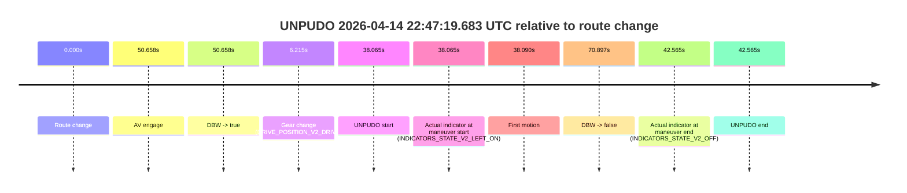
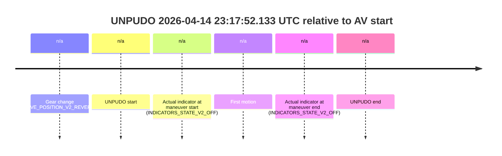
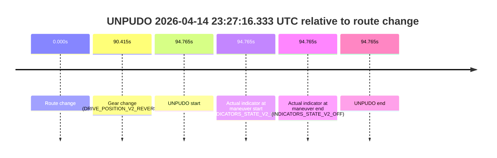
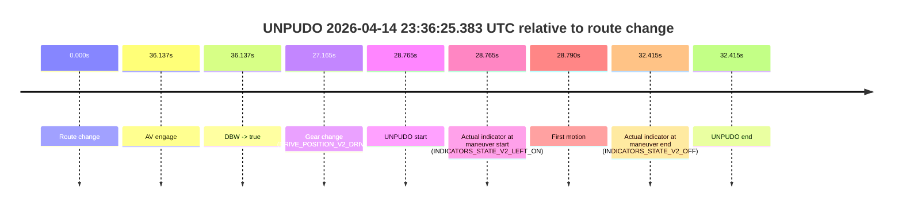

# Run Report: fme10005/2026-04-14--22-37-44--gen2-av-8d87ab20-f543-464d-a9ba-376113d03561

| Field | Value |
|---|---|
| Run ID | `fme10005/2026-04-14--22-37-44--gen2-av-8d87ab20-f543-464d-a9ba-376113d03561` |
| Date | `2026-04-14` |
| Model(s) | `armadillo-amethyst-squeaky` |
| Author | `guy.geva` |
| Event count | `9` |

## unpudo 2026-04-14 22:47:19.683 UTC

| Field | Value |
|---|---|
| Model | `armadillo-amethyst-squeaky` |
| Author | `guy.geva` |
| Run ID | `fme10005/2026-04-14--22-37-44--gen2-av-8d87ab20-f543-464d-a9ba-376113d03561` |
| Date | `2026-04-14` |
| Time (UTC) | `22:47:19.683` |
| Event type | `unpudo` |
| Disengagement type | `failed_to_unpudo` |
| Route change | `found` |
| Console | [run](https://console.sso.wayve.ai/run/fme10005/2026-04-14--22-37-44--gen2-av-8d87ab20-f543-464d-a9ba-376113d03561?id=&time-unixus=1776206839683316) |
| Foxglove | [segment](https://app.foxglove.dev/wayve-on-prem/p/prj_0dX18KZdVHg1fmmI/view?ds=foxglove-stream&ds.deviceName=fme10005&ds.start=2026-04-14T22%3A46%3A31.618260Z&ds.end=2026-04-14T22%3A48%3A02.515555Z&layoutId=lay_0e7VD4WIKDQGU73Y&time=2026-04-14T22%3A47%3A19.683316Z) |

### Event card: fail

- Fail: AV owns part of the segment, but the event still resolves as a model-performance failure under the AV-only scoring rule.

| Event | Time (UTC) | Delta from route change |
|---|---:|---:|
| Route change | 2026-04-14 22:46:41.618 | `0.000s` |
| AV engage | 2026-04-14 22:47:32.276 | `50.658s` |
| DBW -> true | 2026-04-14 22:47:32.276 | `50.658s` |
| Gear change (DRIVE_POSITION_V2_DRIVE) | 2026-04-14 22:46:47.833 | `6.215s` |
| UNPUDO start | 2026-04-14 22:47:19.683 | `38.065s` |
| Actual indicator at maneuver start (INDICATORS_STATE_V2_LEFT_ON) | 2026-04-14 22:47:19.683 | `38.065s` |
| First motion | 2026-04-14 22:47:19.708 | `38.090s` |
| DBW -> false | 2026-04-14 22:47:52.515 | `70.897s` |
| Actual indicator at maneuver end (INDICATORS_STATE_V2_OFF) | 2026-04-14 22:47:24.183 | `42.565s` |
| UNPUDO end | 2026-04-14 22:47:24.183 | `42.565s` |

| Metric | Value |
|---|---|
| Outcome | `fail` |
| Effective failure type | `failed_to_unpudo` |
| Route change status | `found` |
| DBW at event start | `false` |
| DBW at event end | `false` |
| Predicted gear at AV start | `DRIVE_POSITION_V2_DRIVE` |
| Actual gear at AV start | `DRIVE_POSITION_V2_DRIVE` |
| Predicted gear at event start | `DRIVE_POSITION_V2_DRIVE` |
| Actual gear at event start | `DRIVE_POSITION_V2_DRIVE` |
| Planned indicator direction | `INDICATORS_STATE_V2_LEFT_ON` |
| Controller indicator direction | `INDICATORS_STATE_V2_LEFT_ON` |
| Actual indicator direction | `INDICATORS_STATE_V2_LEFT_ON` |
| Actual indicator at maneuver end | `INDICATORS_STATE_V2_OFF` |
| Driver accel help in AV | `false` |
| Driver accel help timestamp | `n/a` |
| Max accel pedal pct in AV | `0.0%` |
| Max brake pedal pct in AV | `0.0%` |
| Max speed mps in AV | `0.000` |
| Route -> AV | `50.658s` |
| AV -> event start | `-12.593s` |
| AV -> first motion | `-12.568s` |
| AV duration before disengagement | `20.239s` |
| Trajectory waypoint count | `36` |
| Driving-plan step count | `11` |

The scored portion starts from the AV-owned window, not from the pre-AV setup. Route-change search in the stopped pre-event segment was `found`, with the baseline therefore set to route change. At the event anchor the model predicts `DRIVE_POSITION_V2_DRIVE` and the actual gear is `DRIVE_POSITION_V2_DRIVE`. The effective model outcome is `fail` because `failed_to_unpudo`.

### Resolution

| Field | Value |
|---|---|
| Final outcome | `fail` |
| Do we agree with this label? | `yes` |
| Source disengagement type | `failed_to_unpudo` |
| Resolved effective failure type | `failed_to_unpudo` |
| Confidence | `high` |

## unpudo 2026-04-14 22:58:20.083 UTC

| Field | Value |
|---|---|
| Model | `armadillo-amethyst-squeaky` |
| Author | `guy.geva` |
| Run ID | `fme10005/2026-04-14--22-37-44--gen2-av-8d87ab20-f543-464d-a9ba-376113d03561` |
| Date | `2026-04-14` |
| Time (UTC) | `22:58:20.083` |
| Event type | `unpudo` |
| Disengagement type | `failed_to_unpudo` |
| Route change | `found` |
| Console | [run](https://console.sso.wayve.ai/run/fme10005/2026-04-14--22-37-44--gen2-av-8d87ab20-f543-464d-a9ba-376113d03561?id=&time-unixus=1776207500083318) |
| Foxglove | [segment](https://app.foxglove.dev/wayve-on-prem/p/prj_0dX18KZdVHg1fmmI/view?ds=foxglove-stream&ds.deviceName=fme10005&ds.start=2026-04-14T22%3A57%3A44.118292Z&ds.end=2026-04-14T22%3A59%3A12.476746Z&layoutId=lay_0e7VD4WIKDQGU73Y&time=2026-04-14T22%3A58%3A20.083318Z) |

### Event card: fail

- Fail: AV owns part of the segment, but the event still resolves as a model-performance failure under the AV-only scoring rule.

| Event | Time (UTC) | Delta from route change |
|---|---:|---:|
| Route change | 2026-04-14 22:57:54.118 | `0.000s` |
| AV engage | 2026-04-14 22:58:56.635 | `62.517s` |
| DBW -> true | 2026-04-14 22:58:56.635 | `62.517s` |
| Gear change (DRIVE_POSITION_V2_REVERSE) | 2026-04-14 22:58:08.033 | `13.915s` |
| UNPUDO start | 2026-04-14 22:58:20.083 | `25.965s` |
| Actual indicator at maneuver start (INDICATORS_STATE_V2_OFF) | 2026-04-14 22:58:20.083 | `25.965s` |
| First motion | 2026-04-14 22:58:27.228 | `33.110s` |
| DBW -> false | 2026-04-14 22:59:02.476 | `68.358s` |
| Actual indicator at maneuver end (INDICATORS_STATE_V2_RIGHT_ON) | 2026-04-14 22:58:40.183 | `46.065s` |
| UNPUDO end | 2026-04-14 22:58:40.183 | `46.065s` |

| Metric | Value |
|---|---|
| Outcome | `fail` |
| Effective failure type | `failed_to_unpudo` |
| Route change status | `found` |
| DBW at event start | `false` |
| DBW at event end | `false` |
| Predicted gear at AV start | `DRIVE_POSITION_V2_DRIVE` |
| Actual gear at AV start | `DRIVE_POSITION_V2_DRIVE` |
| Predicted gear at event start | `DRIVE_POSITION_V2_REVERSE` |
| Actual gear at event start | `DRIVE_POSITION_V2_REVERSE` |
| Planned indicator direction | `INDICATORS_STATE_V2_OFF` |
| Controller indicator direction | `INDICATORS_STATE_V2_OFF` |
| Actual indicator direction | `INDICATORS_STATE_V2_OFF` |
| Actual indicator at maneuver end | `INDICATORS_STATE_V2_RIGHT_ON` |
| Driver accel help in AV | `false` |
| Driver accel help timestamp | `n/a` |
| Max accel pedal pct in AV | `0.0%` |
| Max brake pedal pct in AV | `0.0%` |
| Max speed mps in AV | `0.000` |
| Route -> AV | `62.517s` |
| AV -> event start | `-36.552s` |
| AV -> first motion | `-29.407s` |
| AV duration before disengagement | `5.841s` |
| Trajectory waypoint count | `36` |
| Driving-plan step count | `11` |

The scored portion starts from the AV-owned window, not from the pre-AV setup. Route-change search in the stopped pre-event segment was `found`, with the baseline therefore set to route change. At the event anchor the model predicts `DRIVE_POSITION_V2_REVERSE` and the actual gear is `DRIVE_POSITION_V2_REVERSE`. The effective model outcome is `fail` because `failed_to_unpudo`.

### Resolution

| Field | Value |
|---|---|
| Final outcome | `fail` |
| Do we agree with this label? | `yes` |
| Source disengagement type | `failed_to_unpudo` |
| Resolved effective failure type | `failed_to_unpudo` |
| Confidence | `high` |

## unpudo 2026-04-14 23:02:17.533 UTC

| Field | Value |
|---|---|
| Model | `armadillo-amethyst-squeaky` |
| Author | `guy.geva` |
| Run ID | `fme10005/2026-04-14--22-37-44--gen2-av-8d87ab20-f543-464d-a9ba-376113d03561` |
| Date | `2026-04-14` |
| Time (UTC) | `23:02:17.533` |
| Event type | `unpudo` |
| Disengagement type | `failed_to_unpudo` |
| Route change | `found` |
| Console | [run](https://console.sso.wayve.ai/run/fme10005/2026-04-14--22-37-44--gen2-av-8d87ab20-f543-464d-a9ba-376113d03561?id=&time-unixus=1776207737533301) |
| Foxglove | [segment](https://app.foxglove.dev/wayve-on-prem/p/prj_0dX18KZdVHg1fmmI/view?ds=foxglove-stream&ds.deviceName=fme10005&ds.start=2026-04-14T23%3A01%3A49.918256Z&ds.end=2026-04-14T23%3A02%3A56.395564Z&layoutId=lay_0e7VD4WIKDQGU73Y&time=2026-04-14T23%3A02%3A17.533301Z) |

### Event card: fail

- Fail: AV owns part of the segment, but the event still resolves as a model-performance failure under the AV-only scoring rule.

| Event | Time (UTC) | Delta from route change |
|---|---:|---:|
| Route change | 2026-04-14 23:01:59.918 | `0.000s` |
| AV engage | 2026-04-14 23:02:27.095 | `27.177s` |
| DBW -> true | 2026-04-14 23:02:27.095 | `27.177s` |
| Gear change (DRIVE_POSITION_V2_DRIVE) | 2026-04-14 23:02:12.033 | `12.115s` |
| UNPUDO start | 2026-04-14 23:02:17.533 | `17.615s` |
| Actual indicator at maneuver start (INDICATORS_STATE_V2_LEFT_ON) | 2026-04-14 23:02:17.533 | `17.615s` |
| First motion | 2026-04-14 23:02:17.588 | `17.670s` |
| DBW -> false | 2026-04-14 23:02:46.395 | `46.477s` |
| Actual indicator at maneuver end (INDICATORS_STATE_V2_OFF) | 2026-04-14 23:02:21.533 | `21.615s` |
| UNPUDO end | 2026-04-14 23:02:21.533 | `21.615s` |

| Metric | Value |
|---|---|
| Outcome | `fail` |
| Effective failure type | `failed_to_unpudo` |
| Route change status | `found` |
| DBW at event start | `false` |
| DBW at event end | `false` |
| Predicted gear at AV start | `DRIVE_POSITION_V2_DRIVE` |
| Actual gear at AV start | `DRIVE_POSITION_V2_DRIVE` |
| Predicted gear at event start | `DRIVE_POSITION_V2_DRIVE` |
| Actual gear at event start | `DRIVE_POSITION_V2_DRIVE` |
| Planned indicator direction | `INDICATORS_STATE_V2_LEFT_ON` |
| Controller indicator direction | `INDICATORS_STATE_V2_LEFT_ON` |
| Actual indicator direction | `INDICATORS_STATE_V2_LEFT_ON` |
| Actual indicator at maneuver end | `INDICATORS_STATE_V2_OFF` |
| Driver accel help in AV | `false` |
| Driver accel help timestamp | `n/a` |
| Max accel pedal pct in AV | `0.0%` |
| Max brake pedal pct in AV | `0.0%` |
| Max speed mps in AV | `0.000` |
| Route -> AV | `27.177s` |
| AV -> event start | `-9.562s` |
| AV -> first motion | `-9.507s` |
| AV duration before disengagement | `19.300s` |
| Trajectory waypoint count | `37` |
| Driving-plan step count | `11` |

The scored portion starts from the AV-owned window, not from the pre-AV setup. Route-change search in the stopped pre-event segment was `found`, with the baseline therefore set to route change. At the event anchor the model predicts `DRIVE_POSITION_V2_DRIVE` and the actual gear is `DRIVE_POSITION_V2_DRIVE`. The effective model outcome is `fail` because `failed_to_unpudo`.

### Resolution

| Field | Value |
|---|---|
| Final outcome | `fail` |
| Do we agree with this label? | `yes` |
| Source disengagement type | `failed_to_unpudo` |
| Resolved effective failure type | `failed_to_unpudo` |
| Confidence | `high` |

## unpudo 2026-04-14 23:07:41.683 UTC

| Field | Value |
|---|---|
| Model | `armadillo-amethyst-squeaky` |
| Author | `guy.geva` |
| Run ID | `fme10005/2026-04-14--22-37-44--gen2-av-8d87ab20-f543-464d-a9ba-376113d03561` |
| Date | `2026-04-14` |
| Time (UTC) | `23:07:41.683` |
| Event type | `unpudo` |
| Disengagement type | `none observed` |
| Route change | `found` |
| Console | [run](https://console.sso.wayve.ai/run/fme10005/2026-04-14--22-37-44--gen2-av-8d87ab20-f543-464d-a9ba-376113d03561?id=&time-unixus=1776208061683301) |
| Foxglove | [segment](https://app.foxglove.dev/wayve-on-prem/p/prj_0dX18KZdVHg1fmmI/view?ds=foxglove-stream&ds.deviceName=fme10005&ds.start=2026-04-14T23%3A07%3A06.918299Z&ds.end=2026-04-14T23%3A12%3A20.395560Z&layoutId=lay_0e7VD4WIKDQGU73Y&time=2026-04-14T23%3A07%3A41.683301Z) |

### Event card: pass

- Pass: AV owns the credited unpudo through the official event window, the gear state is aligned at the anchor, and the vehicle moves without driver accelerator help in AV.

| Event | Time (UTC) | Delta from route change |
|---|---:|---:|
| Route change | 2026-04-14 23:07:16.918 | `0.000s` |
| AV engage | 2026-04-14 23:07:36.335 | `19.417s` |
| DBW -> true | 2026-04-14 23:07:36.335 | `19.417s` |
| Gear change (DRIVE_POSITION_V2_DRIVE) | 2026-04-14 23:07:38.183 | `21.265s` |
| UNPUDO start | 2026-04-14 23:07:41.683 | `24.765s` |
| Actual indicator at maneuver start (INDICATORS_STATE_V2_LEFT_ON) | 2026-04-14 23:07:41.683 | `24.765s` |
| First motion | 2026-04-14 23:07:41.728 | `24.810s` |
| DBW -> false | 2026-04-14 23:12:10.395 | `293.477s` |
| Actual indicator at maneuver end (INDICATORS_STATE_V2_OFF) | 2026-04-14 23:07:45.033 | `28.115s` |
| UNPUDO end | 2026-04-14 23:07:45.033 | `28.115s` |

| Metric | Value |
|---|---|
| Outcome | `pass` |
| Effective failure type | `none` |
| Route change status | `found` |
| DBW at event start | `true` |
| DBW at event end | `true` |
| Predicted gear at AV start | `DRIVE_POSITION_V2_PARK` |
| Actual gear at AV start | `DRIVE_POSITION_V2_PARK` |
| Predicted gear at event start | `DRIVE_POSITION_V2_DRIVE` |
| Actual gear at event start | `DRIVE_POSITION_V2_DRIVE` |
| Planned indicator direction | `INDICATORS_STATE_V2_LEFT_ON` |
| Controller indicator direction | `INDICATORS_STATE_V2_LEFT_ON` |
| Actual indicator direction | `INDICATORS_STATE_V2_LEFT_ON` |
| Actual indicator at maneuver end | `INDICATORS_STATE_V2_OFF` |
| Driver accel help in AV | `false` |
| Driver accel help timestamp | `n/a` |
| Max accel pedal pct in AV | `0.0%` |
| Max brake pedal pct in AV | `8.0%` |
| Max speed mps in AV | `5.919` |
| Route -> AV | `19.417s` |
| AV -> event start | `5.348s` |
| AV -> first motion | `5.393s` |
| AV duration before disengagement | `274.060s` |
| Trajectory waypoint count | `36` |
| Driving-plan step count | `11` |

The scored portion starts from the AV-owned window, not from the pre-AV setup. Route-change search in the stopped pre-event segment was `found`, with the baseline therefore set to route change. At the event anchor the model predicts `DRIVE_POSITION_V2_DRIVE` and the actual gear is `DRIVE_POSITION_V2_DRIVE`. The effective model outcome is `pass` because `the credited maneuver stays AV-owned through the official event end`.

### Resolution

| Field | Value |
|---|---|
| Final outcome | `pass` |
| Do we agree with this label? | `yes` |
| Source disengagement type | `none observed` |
| Resolved effective failure type | `none` |
| Confidence | `high` |

## unpudo 2026-04-14 23:14:20.433 UTC

| Field | Value |
|---|---|
| Model | `armadillo-amethyst-squeaky` |
| Author | `guy.geva` |
| Run ID | `fme10005/2026-04-14--22-37-44--gen2-av-8d87ab20-f543-464d-a9ba-376113d03561` |
| Date | `2026-04-14` |
| Time (UTC) | `23:14:20.433` |
| Event type | `unpudo` |
| Disengagement type | `failed_to_unpudo` |
| Route change | `found` |
| Console | [run](https://console.sso.wayve.ai/run/fme10005/2026-04-14--22-37-44--gen2-av-8d87ab20-f543-464d-a9ba-376113d03561?id=&time-unixus=1776208460433300) |
| Foxglove | [segment](https://app.foxglove.dev/wayve-on-prem/p/prj_0dX18KZdVHg1fmmI/view?ds=foxglove-stream&ds.deviceName=fme10005&ds.start=2026-04-14T23%3A13%3A42.618391Z&ds.end=2026-04-14T23%3A17%3A26.435522Z&layoutId=lay_0e7VD4WIKDQGU73Y&time=2026-04-14T23%3A14%3A20.433300Z) |

### Event card: fail

- Fail: AV owns part of the segment, but the event still resolves as a model-performance failure under the AV-only scoring rule.

| Event | Time (UTC) | Delta from route change |
|---|---:|---:|
| Route change | 2026-04-14 23:13:52.618 | `0.000s` |
| AV engage | 2026-04-14 23:14:38.695 | `46.077s` |
| DBW -> true | 2026-04-14 23:14:38.695 | `46.077s` |
| Gear change (DRIVE_POSITION_V2_DRIVE) | 2026-04-14 23:14:15.183 | `22.565s` |
| UNPUDO start | 2026-04-14 23:14:20.433 | `27.815s` |
| Actual indicator at maneuver start (INDICATORS_STATE_V2_LEFT_ON) | 2026-04-14 23:14:20.433 | `27.815s` |
| First motion | 2026-04-14 23:14:20.468 | `27.850s` |
| DBW -> false | 2026-04-14 23:17:16.435 | `203.817s` |
| Actual indicator at maneuver end (INDICATORS_STATE_V2_OFF) | 2026-04-14 23:14:25.483 | `32.865s` |
| UNPUDO end | 2026-04-14 23:14:25.483 | `32.865s` |

| Metric | Value |
|---|---|
| Outcome | `fail` |
| Effective failure type | `failed_to_unpudo` |
| Route change status | `found` |
| DBW at event start | `false` |
| DBW at event end | `false` |
| Predicted gear at AV start | `DRIVE_POSITION_V2_DRIVE` |
| Actual gear at AV start | `DRIVE_POSITION_V2_DRIVE` |
| Predicted gear at event start | `DRIVE_POSITION_V2_DRIVE` |
| Actual gear at event start | `DRIVE_POSITION_V2_DRIVE` |
| Planned indicator direction | `INDICATORS_STATE_V2_LEFT_ON` |
| Controller indicator direction | `INDICATORS_STATE_V2_LEFT_ON` |
| Actual indicator direction | `INDICATORS_STATE_V2_LEFT_ON` |
| Actual indicator at maneuver end | `INDICATORS_STATE_V2_OFF` |
| Driver accel help in AV | `false` |
| Driver accel help timestamp | `n/a` |
| Max accel pedal pct in AV | `0.0%` |
| Max brake pedal pct in AV | `0.0%` |
| Max speed mps in AV | `0.000` |
| Route -> AV | `46.077s` |
| AV -> event start | `-18.262s` |
| AV -> first motion | `-18.227s` |
| AV duration before disengagement | `157.740s` |
| Trajectory waypoint count | `35` |
| Driving-plan step count | `11` |

The scored portion starts from the AV-owned window, not from the pre-AV setup. Route-change search in the stopped pre-event segment was `found`, with the baseline therefore set to route change. At the event anchor the model predicts `DRIVE_POSITION_V2_DRIVE` and the actual gear is `DRIVE_POSITION_V2_DRIVE`. The effective model outcome is `fail` because `failed_to_unpudo`.

### Resolution

| Field | Value |
|---|---|
| Final outcome | `fail` |
| Do we agree with this label? | `yes` |
| Source disengagement type | `failed_to_unpudo` |
| Resolved effective failure type | `failed_to_unpudo` |
| Confidence | `high` |

## unpudo 2026-04-14 23:17:52.133 UTC

| Field | Value |
|---|---|
| Model | `armadillo-amethyst-squeaky` |
| Author | `guy.geva` |
| Run ID | `fme10005/2026-04-14--22-37-44--gen2-av-8d87ab20-f543-464d-a9ba-376113d03561` |
| Date | `2026-04-14` |
| Time (UTC) | `23:17:52.133` |
| Event type | `unpudo` |
| Disengagement type | `failed_to_pudo` |
| Route change | `unclear` |
| Console | [run](https://console.sso.wayve.ai/run/fme10005/2026-04-14--22-37-44--gen2-av-8d87ab20-f543-464d-a9ba-376113d03561?id=&time-unixus=1776208672133305) |
| Foxglove | [segment](https://app.foxglove.dev/wayve-on-prem/p/prj_0dX18KZdVHg1fmmI/view?ds=foxglove-stream&ds.deviceName=fme10005&ds.start=2026-04-14T23%3A17%3A34.883302Z&ds.end=2026-04-14T23%3A18%3A02.133305Z&layoutId=lay_0e7VD4WIKDQGU73Y&time=2026-04-14T23%3A17%3A52.133305Z) |

### Event card: fail

- Fail: AV owns part of the segment, but the event still resolves as a model-performance failure under the AV-only scoring rule.

| Event | Time (UTC) | Delta from AV start |
|---|---:|---:|
| Gear change (DRIVE_POSITION_V2_REVERSE) | 2026-04-14 23:17:44.883 | `n/a` |
| UNPUDO start | 2026-04-14 23:17:52.133 | `n/a` |
| Actual indicator at maneuver start (INDICATORS_STATE_V2_OFF) | 2026-04-14 23:17:52.133 | `n/a` |
| First motion | 2026-04-14 23:17:56.628 | `n/a` |
| Actual indicator at maneuver end (INDICATORS_STATE_V2_OFF) | 2026-04-14 23:17:52.133 | `n/a` |
| UNPUDO end | 2026-04-14 23:17:52.133 | `n/a` |

| Metric | Value |
|---|---|
| Outcome | `fail` |
| Effective failure type | `failed_to_pudo` |
| Route change status | `unclear` |
| DBW at event start | `false` |
| DBW at event end | `false` |
| Predicted gear at AV start | `n/a` |
| Actual gear at AV start | `n/a` |
| Predicted gear at event start | `DRIVE_POSITION_V2_REVERSE` |
| Actual gear at event start | `DRIVE_POSITION_V2_REVERSE` |
| Planned indicator direction | `INDICATORS_STATE_V2_OFF` |
| Controller indicator direction | `INDICATORS_STATE_V2_OFF` |
| Actual indicator direction | `INDICATORS_STATE_V2_OFF` |
| Actual indicator at maneuver end | `INDICATORS_STATE_V2_OFF` |
| Driver accel help in AV | `false` |
| Driver accel help timestamp | `n/a` |
| Max accel pedal pct in AV | `0.0%` |
| Max brake pedal pct in AV | `0.0%` |
| Max speed mps in AV | `0.000` |
| Route -> AV | `n/a` |
| AV -> event start | `n/a` |
| AV -> first motion | `n/a` |
| AV duration before disengagement | `n/a` |
| Trajectory waypoint count | `37` |
| Driving-plan step count | `11` |

The scored portion starts from the AV-owned window, not from the pre-AV setup. Route-change search in the stopped pre-event segment was `unclear`, with the baseline therefore set to AV start. At the event anchor the model predicts `DRIVE_POSITION_V2_REVERSE` and the actual gear is `DRIVE_POSITION_V2_REVERSE`. The effective model outcome is `fail` because `failed_to_pudo`.

### Resolution

| Field | Value |
|---|---|
| Final outcome | `fail` |
| Do we agree with this label? | `yes` |
| Source disengagement type | `failed_to_pudo` |
| Resolved effective failure type | `failed_to_pudo` |
| Confidence | `medium` |

## unpudo 2026-04-14 23:20:24.733 UTC

| Field | Value |
|---|---|
| Model | `armadillo-amethyst-squeaky` |
| Author | `guy.geva` |
| Run ID | `fme10005/2026-04-14--22-37-44--gen2-av-8d87ab20-f543-464d-a9ba-376113d03561` |
| Date | `2026-04-14` |
| Time (UTC) | `23:20:24.733` |
| Event type | `unpudo` |
| Disengagement type | `none observed` |
| Route change | `found` |
| Console | [run](https://console.sso.wayve.ai/run/fme10005/2026-04-14--22-37-44--gen2-av-8d87ab20-f543-464d-a9ba-376113d03561?id=&time-unixus=1776208824733308) |
| Foxglove | [segment](https://app.foxglove.dev/wayve-on-prem/p/prj_0dX18KZdVHg1fmmI/view?ds=foxglove-stream&ds.deviceName=fme10005&ds.start=2026-04-14T23%3A19%3A48.618275Z&ds.end=2026-04-14T23%3A22%3A22.476779Z&layoutId=lay_0e7VD4WIKDQGU73Y&time=2026-04-14T23%3A20%3A24.733308Z) |

### Event card: pass

- Pass: AV owns the credited unpudo through the official event window, the gear state is aligned at the anchor, and the vehicle moves without driver accelerator help in AV.

| Event | Time (UTC) | Delta from route change |
|---|---:|---:|
| Route change | 2026-04-14 23:19:58.618 | `0.000s` |
| AV engage | 2026-04-14 23:20:18.295 | `19.677s` |
| DBW -> true | 2026-04-14 23:20:18.295 | `19.677s` |
| Gear change (DRIVE_POSITION_V2_DRIVE) | 2026-04-14 23:20:21.033 | `22.415s` |
| UNPUDO start | 2026-04-14 23:20:24.733 | `26.115s` |
| Actual indicator at maneuver start (INDICATORS_STATE_V2_LEFT_ON) | 2026-04-14 23:20:24.733 | `26.115s` |
| First motion | 2026-04-14 23:20:24.748 | `26.131s` |
| DBW -> false | 2026-04-14 23:22:12.476 | `133.859s` |
| Actual indicator at maneuver end (INDICATORS_STATE_V2_OFF) | 2026-04-14 23:20:28.183 | `29.565s` |
| UNPUDO end | 2026-04-14 23:20:28.183 | `29.565s` |

| Metric | Value |
|---|---|
| Outcome | `pass` |
| Effective failure type | `none` |
| Route change status | `found` |
| DBW at event start | `true` |
| DBW at event end | `true` |
| Predicted gear at AV start | `DRIVE_POSITION_V2_PARK` |
| Actual gear at AV start | `DRIVE_POSITION_V2_PARK` |
| Predicted gear at event start | `DRIVE_POSITION_V2_DRIVE` |
| Actual gear at event start | `DRIVE_POSITION_V2_DRIVE` |
| Planned indicator direction | `INDICATORS_STATE_V2_RIGHT_ON` |
| Controller indicator direction | `INDICATORS_STATE_V2_RIGHT_ON` |
| Actual indicator direction | `INDICATORS_STATE_V2_LEFT_ON` |
| Actual indicator at maneuver end | `INDICATORS_STATE_V2_OFF` |
| Driver accel help in AV | `false` |
| Driver accel help timestamp | `n/a` |
| Max accel pedal pct in AV | `0.0%` |
| Max brake pedal pct in AV | `8.0%` |
| Max speed mps in AV | `5.583` |
| Route -> AV | `19.677s` |
| AV -> event start | `6.438s` |
| AV -> first motion | `6.453s` |
| AV duration before disengagement | `114.181s` |
| Trajectory waypoint count | `37` |
| Driving-plan step count | `11` |

The scored portion starts from the AV-owned window, not from the pre-AV setup. Route-change search in the stopped pre-event segment was `found`, with the baseline therefore set to route change. At the event anchor the model predicts `DRIVE_POSITION_V2_DRIVE` and the actual gear is `DRIVE_POSITION_V2_DRIVE`. The effective model outcome is `pass` because `the credited maneuver stays AV-owned through the official event end`.

### Resolution

| Field | Value |
|---|---|
| Final outcome | `pass` |
| Do we agree with this label? | `yes` |
| Source disengagement type | `none observed` |
| Resolved effective failure type | `none` |
| Confidence | `high` |

## unpudo 2026-04-14 23:27:16.333 UTC

| Field | Value |
|---|---|
| Model | `armadillo-amethyst-squeaky` |
| Author | `guy.geva` |
| Run ID | `fme10005/2026-04-14--22-37-44--gen2-av-8d87ab20-f543-464d-a9ba-376113d03561` |
| Date | `2026-04-14` |
| Time (UTC) | `23:27:16.333` |
| Event type | `unpudo` |
| Disengagement type | `none observed` |
| Route change | `found` |
| Console | [run](https://console.sso.wayve.ai/run/fme10005/2026-04-14--22-37-44--gen2-av-8d87ab20-f543-464d-a9ba-376113d03561?id=&time-unixus=1776209236333298) |
| Foxglove | [segment](https://app.foxglove.dev/wayve-on-prem/p/prj_0dX18KZdVHg1fmmI/view?ds=foxglove-stream&ds.deviceName=fme10005&ds.start=2026-04-14T23%3A25%3A31.568251Z&ds.end=2026-04-14T23%3A27%3A26.333298Z&layoutId=lay_0e7VD4WIKDQGU73Y&time=2026-04-14T23%3A27%3A16.333298Z) |

### Event card: fail

- Fail: the credited unpudo does not stay AV-owned. The event window starts with DBW false, and the maneuver outcome lands outside a clean AV-owned segment.

| Event | Time (UTC) | Delta from route change |
|---|---:|---:|
| Route change | 2026-04-14 23:25:41.568 | `0.000s` |
| Gear change (DRIVE_POSITION_V2_REVERSE) | 2026-04-14 23:27:11.983 | `90.415s` |
| UNPUDO start | 2026-04-14 23:27:16.333 | `94.765s` |
| Actual indicator at maneuver start (INDICATORS_STATE_V2_OFF) | 2026-04-14 23:27:16.333 | `94.765s` |
| Actual indicator at maneuver end (INDICATORS_STATE_V2_OFF) | 2026-04-14 23:27:16.333 | `94.765s` |
| UNPUDO end | 2026-04-14 23:27:16.333 | `94.765s` |

| Metric | Value |
|---|---|
| Outcome | `fail` |
| Effective failure type | `not_av_owned` |
| Route change status | `found` |
| DBW at event start | `false` |
| DBW at event end | `false` |
| Predicted gear at AV start | `n/a` |
| Actual gear at AV start | `n/a` |
| Predicted gear at event start | `DRIVE_POSITION_V2_REVERSE` |
| Actual gear at event start | `DRIVE_POSITION_V2_REVERSE` |
| Planned indicator direction | `INDICATORS_STATE_V2_OFF` |
| Controller indicator direction | `INDICATORS_STATE_V2_OFF` |
| Actual indicator direction | `INDICATORS_STATE_V2_OFF` |
| Actual indicator at maneuver end | `INDICATORS_STATE_V2_OFF` |
| Driver accel help in AV | `false` |
| Driver accel help timestamp | `n/a` |
| Max accel pedal pct in AV | `0.0%` |
| Max brake pedal pct in AV | `0.0%` |
| Max speed mps in AV | `0.000` |
| Route -> AV | `n/a` |
| AV -> event start | `n/a` |
| AV -> first motion | `n/a` |
| AV duration before disengagement | `n/a` |
| Trajectory waypoint count | `37` |
| Driving-plan step count | `11` |

The scored portion starts from the AV-owned window, not from the pre-AV setup. Route-change search in the stopped pre-event segment was `found`, with the baseline therefore set to route change. At the event anchor the model predicts `DRIVE_POSITION_V2_REVERSE` and the actual gear is `DRIVE_POSITION_V2_REVERSE`. The effective model outcome is `fail` because `not_av_owned`.

### Resolution

| Field | Value |
|---|---|
| Final outcome | `fail` |
| Do we agree with this label? | `yes` |
| Source disengagement type | `none observed` |
| Resolved effective failure type | `not_av_owned` |
| Confidence | `high` |

## unpudo 2026-04-14 23:36:25.383 UTC

| Field | Value |
|---|---|
| Model | `armadillo-amethyst-squeaky` |
| Author | `guy.geva` |
| Run ID | `fme10005/2026-04-14--22-37-44--gen2-av-8d87ab20-f543-464d-a9ba-376113d03561` |
| Date | `2026-04-14` |
| Time (UTC) | `23:36:25.383` |
| Event type | `unpudo` |
| Disengagement type | `none observed` |
| Route change | `found` |
| Console | [run](https://console.sso.wayve.ai/run/fme10005/2026-04-14--22-37-44--gen2-av-8d87ab20-f543-464d-a9ba-376113d03561?id=&time-unixus=1776209785383305) |
| Foxglove | [segment](https://app.foxglove.dev/wayve-on-prem/p/prj_0dX18KZdVHg1fmmI/view?ds=foxglove-stream&ds.deviceName=fme10005&ds.start=2026-04-14T23%3A35%3A46.618255Z&ds.end=2026-04-14T23%3A36%3A39.033319Z&layoutId=lay_0e7VD4WIKDQGU73Y&time=2026-04-14T23%3A36%3A25.383305Z) |

### Event card: fail

- Fail: the credited unpudo does not stay AV-owned. The event window starts with DBW false, and the maneuver outcome lands outside a clean AV-owned segment.

| Event | Time (UTC) | Delta from route change |
|---|---:|---:|
| Route change | 2026-04-14 23:35:56.618 | `0.000s` |
| AV engage | 2026-04-14 23:36:32.755 | `36.137s` |
| DBW -> true | 2026-04-14 23:36:32.755 | `36.137s` |
| Gear change (DRIVE_POSITION_V2_DRIVE) | 2026-04-14 23:36:23.783 | `27.165s` |
| UNPUDO start | 2026-04-14 23:36:25.383 | `28.765s` |
| Actual indicator at maneuver start (INDICATORS_STATE_V2_LEFT_ON) | 2026-04-14 23:36:25.383 | `28.765s` |
| First motion | 2026-04-14 23:36:25.408 | `28.790s` |
| Actual indicator at maneuver end (INDICATORS_STATE_V2_OFF) | 2026-04-14 23:36:29.033 | `32.415s` |
| UNPUDO end | 2026-04-14 23:36:29.033 | `32.415s` |

| Metric | Value |
|---|---|
| Outcome | `fail` |
| Effective failure type | `completed_outside_av` |
| Route change status | `found` |
| DBW at event start | `false` |
| DBW at event end | `false` |
| Predicted gear at AV start | `DRIVE_POSITION_V2_DRIVE` |
| Actual gear at AV start | `DRIVE_POSITION_V2_DRIVE` |
| Predicted gear at event start | `DRIVE_POSITION_V2_DRIVE` |
| Actual gear at event start | `DRIVE_POSITION_V2_DRIVE` |
| Planned indicator direction | `INDICATORS_STATE_V2_LEFT_ON` |
| Controller indicator direction | `INDICATORS_STATE_V2_LEFT_ON` |
| Actual indicator direction | `INDICATORS_STATE_V2_LEFT_ON` |
| Actual indicator at maneuver end | `INDICATORS_STATE_V2_OFF` |
| Driver accel help in AV | `false` |
| Driver accel help timestamp | `n/a` |
| Max accel pedal pct in AV | `0.0%` |
| Max brake pedal pct in AV | `0.0%` |
| Max speed mps in AV | `0.000` |
| Route -> AV | `36.137s` |
| AV -> event start | `-7.372s` |
| AV -> first motion | `-7.347s` |
| AV duration before disengagement | `n/a` |
| Trajectory waypoint count | `36` |
| Driving-plan step count | `11` |

The scored portion starts from the AV-owned window, not from the pre-AV setup. Route-change search in the stopped pre-event segment was `found`, with the baseline therefore set to route change. At the event anchor the model predicts `DRIVE_POSITION_V2_DRIVE` and the actual gear is `DRIVE_POSITION_V2_DRIVE`. The effective model outcome is `fail` because `completed_outside_av`.

### Resolution

| Field | Value |
|---|---|
| Final outcome | `fail` |
| Do we agree with this label? | `yes` |
| Source disengagement type | `none observed` |
| Resolved effective failure type | `completed_outside_av` |
| Confidence | `high` |
