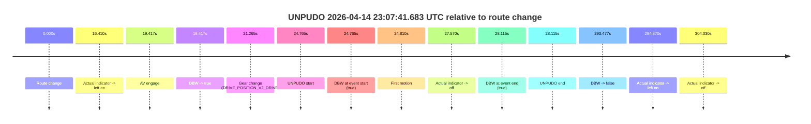
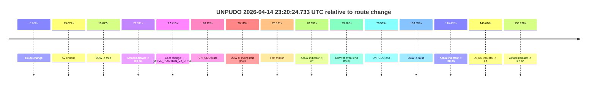

# Run Report: fme10005/2026-04-14--22-37-44--gen2-av-8d87ab20-f543-464d-a9ba-376113d03561

| Field | Value |
|---|---|
| Run ID | `fme10005/2026-04-14--22-37-44--gen2-av-8d87ab20-f543-464d-a9ba-376113d03561` |
| Date | `2026-04-14` |
| Model(s) | `armadillo-amethyst-squeaky` |
| Author | `guy.geva` |
| Event count | `2` |

## unpudo 2026-04-14 23:07:41.683 UTC

| Field | Value |
|---|---|
| Model | `armadillo-amethyst-squeaky` |
| Author | `guy.geva` |
| Run ID | `fme10005/2026-04-14--22-37-44--gen2-av-8d87ab20-f543-464d-a9ba-376113d03561` |
| Date | `2026-04-14` |
| Time (UTC) | `23:07:41.683` |
| Event type | `unpudo` |
| Disengagement type | `none observed` |
| Route change | `found` |
| Console | [run](https://console.sso.wayve.ai/run/fme10005/2026-04-14--22-37-44--gen2-av-8d87ab20-f543-464d-a9ba-376113d03561?id=&time-unixus=1776208061683301) |
| Foxglove | [segment](https://app.foxglove.dev/wayve-on-prem/p/prj_0dX18KZdVHg1fmmI/view?ds=foxglove-stream&ds.deviceName=fme10005&ds.start=2026-04-14T23%3A07%3A06.918299Z&ds.end=2026-04-14T23%3A12%3A20.395560Z&layoutId=lay_0e7VD4WIKDQGU73Y&time=2026-04-14T23%3A07%3A41.683301Z) |

### Event card: pass

- Pass: AV owns the credited unpudo through the official event window, the gear state is aligned at the anchor, and the vehicle moves without driver accelerator help in AV.

| Event | Time (UTC) | Delta from route change |
|---|---:|---:|
| Route change | 2026-04-14 23:07:16.918 | `0.000s` |
| Actual indicator -> left on | 2026-04-14 23:07:33.328 | `16.410s` |
| AV engage | 2026-04-14 23:07:36.335 | `19.417s` |
| DBW -> true | 2026-04-14 23:07:36.335 | `19.417s` |
| Gear change (DRIVE_POSITION_V2_DRIVE) | 2026-04-14 23:07:38.183 | `21.265s` |
| UNPUDO start | 2026-04-14 23:07:41.683 | `24.765s` |
| DBW at event start (true) | 2026-04-14 23:07:41.683 | `24.765s` |
| First motion | 2026-04-14 23:07:41.728 | `24.810s` |
| Actual indicator -> off | 2026-04-14 23:07:44.488 | `27.570s` |
| DBW at event end (true) | 2026-04-14 23:07:45.033 | `28.115s` |
| UNPUDO end | 2026-04-14 23:07:45.033 | `28.115s` |
| DBW -> false | 2026-04-14 23:12:10.395 | `293.477s` |
| Actual indicator -> left on | 2026-04-14 23:12:11.788 | `294.870s` |
| Actual indicator -> off | 2026-04-14 23:12:20.948 | `304.030s` |

| Metric | Value |
|---|---|
| Outcome | `pass` |
| Effective failure type | `none` |
| Route change status | `found` |
| DBW at event start | `true` |
| DBW at event end | `true` |
| Predicted gear at AV start | `DRIVE_POSITION_V2_PARK` |
| Actual gear at AV start | `DRIVE_POSITION_V2_PARK` |
| Predicted gear at event start | `DRIVE_POSITION_V2_DRIVE` |
| Actual gear at event start | `DRIVE_POSITION_V2_DRIVE` |
| Planned indicator direction | `INDICATORS_STATE_V2_LEFT_ON` |
| Controller indicator direction | `INDICATORS_STATE_V2_LEFT_ON` |
| Actual indicator direction | `INDICATORS_STATE_V2_LEFT_ON` |
| Actual indicator at maneuver end | `INDICATORS_STATE_V2_OFF` |
| Driver accel help in AV | `false` |
| Driver accel help timestamp | `n/a` |
| Max accel pedal pct in AV | `0.0%` |
| Max brake pedal pct in AV | `0.0%` |
| Max speed mps in AV | `5.919` |
| Success timing baseline | `route change` |
| Route -> AV | `19.417s` |
| AV -> event start | `5.348s` |
| AV -> first motion | `5.393s` |
| Success baseline -> event start | `24.765s` |
| Success baseline -> first motion | `24.810s` |
| AV duration before disengagement | `274.060s` |
| Trajectory waypoint count | `36` |
| Driving-plan step count | `11` |

The scored portion starts from the AV-owned window, not from the pre-AV setup. Route-change search in the stopped pre-event segment was `found`, with the baseline therefore set to route change. At the event anchor the model predicts `DRIVE_POSITION_V2_DRIVE` and the actual gear is `DRIVE_POSITION_V2_DRIVE`. The effective model outcome is `pass` because `the credited maneuver stays AV-owned through the official event end`.

### Resolution

| Field | Value |
|---|---|
| Final outcome | `pass` |
| Do we agree with this label? | `yes` |
| Source disengagement type | `none observed` |
| Resolved effective failure type | `none` |
| Confidence | `high` |

## unpudo 2026-04-14 23:20:24.733 UTC

| Field | Value |
|---|---|
| Model | `armadillo-amethyst-squeaky` |
| Author | `guy.geva` |
| Run ID | `fme10005/2026-04-14--22-37-44--gen2-av-8d87ab20-f543-464d-a9ba-376113d03561` |
| Date | `2026-04-14` |
| Time (UTC) | `23:20:24.733` |
| Event type | `unpudo` |
| Disengagement type | `none observed` |
| Route change | `found` |
| Console | [run](https://console.sso.wayve.ai/run/fme10005/2026-04-14--22-37-44--gen2-av-8d87ab20-f543-464d-a9ba-376113d03561?id=&time-unixus=1776208824733308) |
| Foxglove | [segment](https://app.foxglove.dev/wayve-on-prem/p/prj_0dX18KZdVHg1fmmI/view?ds=foxglove-stream&ds.deviceName=fme10005&ds.start=2026-04-14T23%3A19%3A48.618275Z&ds.end=2026-04-14T23%3A22%3A22.476779Z&layoutId=lay_0e7VD4WIKDQGU73Y&time=2026-04-14T23%3A20%3A24.733308Z) |

### Event card: pass

- Pass: AV owns the credited unpudo through the official event window, the gear state is aligned at the anchor, and the vehicle moves without driver accelerator help in AV.

| Event | Time (UTC) | Delta from route change |
|---|---:|---:|
| Route change | 2026-04-14 23:19:58.618 | `0.000s` |
| AV engage | 2026-04-14 23:20:18.295 | `19.677s` |
| DBW -> true | 2026-04-14 23:20:18.295 | `19.677s` |
| Actual indicator -> left on | 2026-04-14 23:20:19.928 | `21.311s` |
| Gear change (DRIVE_POSITION_V2_DRIVE) | 2026-04-14 23:20:21.033 | `22.415s` |
| UNPUDO start | 2026-04-14 23:20:24.733 | `26.115s` |
| DBW at event start (true) | 2026-04-14 23:20:24.733 | `26.115s` |
| First motion | 2026-04-14 23:20:24.748 | `26.131s` |
| Actual indicator -> off | 2026-04-14 23:20:27.548 | `28.931s` |
| DBW at event end (true) | 2026-04-14 23:20:28.183 | `29.565s` |
| UNPUDO end | 2026-04-14 23:20:28.183 | `29.565s` |
| DBW -> false | 2026-04-14 23:22:12.476 | `133.859s` |
| Actual indicator -> left on | 2026-04-14 23:22:25.088 | `146.470s` |
| Actual indicator -> off | 2026-04-14 23:22:28.228 | `149.610s` |
| Actual indicator -> left on | 2026-04-14 23:22:32.348 | `153.730s` |

| Metric | Value |
|---|---|
| Outcome | `pass` |
| Effective failure type | `none` |
| Route change status | `found` |
| DBW at event start | `true` |
| DBW at event end | `true` |
| Predicted gear at AV start | `DRIVE_POSITION_V2_PARK` |
| Actual gear at AV start | `DRIVE_POSITION_V2_PARK` |
| Predicted gear at event start | `DRIVE_POSITION_V2_DRIVE` |
| Actual gear at event start | `DRIVE_POSITION_V2_DRIVE` |
| Planned indicator direction | `INDICATORS_STATE_V2_RIGHT_ON` |
| Controller indicator direction | `INDICATORS_STATE_V2_RIGHT_ON` |
| Actual indicator direction | `INDICATORS_STATE_V2_LEFT_ON` |
| Actual indicator at maneuver end | `INDICATORS_STATE_V2_OFF` |
| Driver accel help in AV | `false` |
| Driver accel help timestamp | `n/a` |
| Max accel pedal pct in AV | `0.0%` |
| Max brake pedal pct in AV | `0.0%` |
| Max speed mps in AV | `5.583` |
| Success timing baseline | `route change` |
| Route -> AV | `19.677s` |
| AV -> event start | `6.438s` |
| AV -> first motion | `6.453s` |
| Success baseline -> event start | `26.115s` |
| Success baseline -> first motion | `26.131s` |
| AV duration before disengagement | `114.181s` |
| Trajectory waypoint count | `37` |
| Driving-plan step count | `11` |

The scored portion starts from the AV-owned window, not from the pre-AV setup. Route-change search in the stopped pre-event segment was `found`, with the baseline therefore set to route change. At the event anchor the model predicts `DRIVE_POSITION_V2_DRIVE` and the actual gear is `DRIVE_POSITION_V2_DRIVE`. The effective model outcome is `pass` because `the credited maneuver stays AV-owned through the official event end`.

### Resolution

| Field | Value |
|---|---|
| Final outcome | `pass` |
| Do we agree with this label? | `yes` |
| Source disengagement type | `none observed` |
| Resolved effective failure type | `none` |
| Confidence | `high` |
