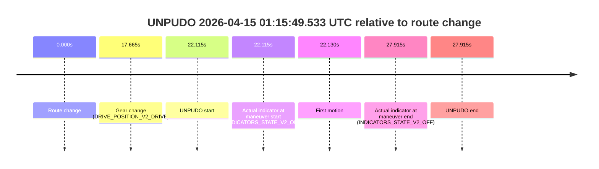
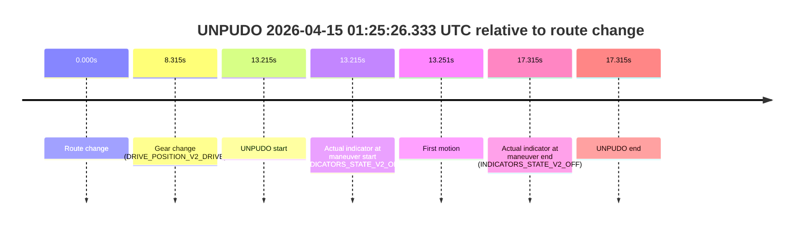
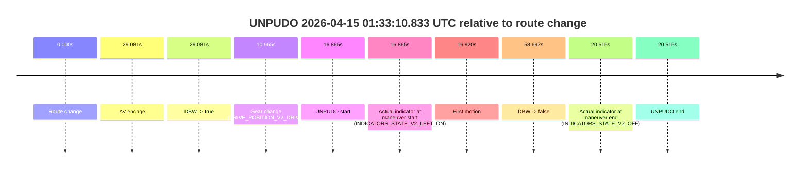
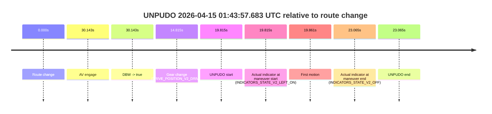

# Run Report: fme10005/2026-04-15--00-46-35--gen2-av-1202c391-bb32-4268-aa5d-deac5996f479

| Field | Value |
|---|---|
| Run ID | `fme10005/2026-04-15--00-46-35--gen2-av-1202c391-bb32-4268-aa5d-deac5996f479` |
| Date | `2026-04-15` |
| Model(s) | `apricot-crocodile-uproarious` |
| Author | `guy.geva` |
| Event count | `10` |

## unpudo 2026-04-15 00:55:59.183 UTC

| Field | Value |
|---|---|
| Model | `apricot-crocodile-uproarious` |
| Author | `guy.geva` |
| Run ID | `fme10005/2026-04-15--00-46-35--gen2-av-1202c391-bb32-4268-aa5d-deac5996f479` |
| Date | `2026-04-15` |
| Time (UTC) | `00:55:59.183` |
| Event type | `unpudo` |
| Disengagement type | `failed_to_unpudo` |
| Route change | `found` |
| Console | [run](https://console.sso.wayve.ai/run/fme10005/2026-04-15--00-46-35--gen2-av-1202c391-bb32-4268-aa5d-deac5996f479?id=&time-unixus=1776214559183297) |
| Foxglove | [segment](https://app.foxglove.dev/wayve-on-prem/p/prj_0dX18KZdVHg1fmmI/view?ds=foxglove-stream&ds.deviceName=fme10005&ds.start=2026-04-15T00%3A55%3A33.569200Z&ds.end=2026-04-15T00%3A56%3A13.133312Z&layoutId=lay_0e7VD4WIKDQGU73Y&time=2026-04-15T00%3A55%3A59.183297Z) |

### Event card: non-av

- Non-AV: there is no AV-owned portion anywhere inside the detected unpudo timeline, so it is kept for coverage but excluded from model success / failure scoring.

| Event | Time (UTC) | Delta from route change |
|---|---:|---:|
| Route change | 2026-04-15 00:55:43.569 | `0.000s` |
| Gear change (DRIVE_POSITION_V2_DRIVE) | 2026-04-15 00:55:53.533 | `9.964s` |
| UNPUDO start | 2026-04-15 00:55:59.183 | `15.614s` |
| Actual indicator at maneuver start (INDICATORS_STATE_V2_OFF) | 2026-04-15 00:55:59.183 | `15.614s` |
| First motion | 2026-04-15 00:55:59.208 | `15.639s` |
| Actual indicator at maneuver end (INDICATORS_STATE_V2_OFF) | 2026-04-15 00:56:03.133 | `19.564s` |
| UNPUDO end | 2026-04-15 00:56:03.133 | `19.564s` |

| Metric | Value |
|---|---|
| Outcome | `non-av` |
| Effective failure type | `none` |
| Route change status | `found` |
| DBW at event start | `false` |
| DBW at event end | `false` |
| Predicted gear at AV start | `n/a` |
| Actual gear at AV start | `n/a` |
| Predicted gear at event start | `DRIVE_POSITION_V2_DRIVE` |
| Actual gear at event start | `DRIVE_POSITION_V2_DRIVE` |
| Planned indicator direction | `INDICATORS_STATE_V2_OFF` |
| Controller indicator direction | `INDICATORS_STATE_V2_OFF` |
| Actual indicator direction | `INDICATORS_STATE_V2_OFF` |
| Actual indicator at maneuver end | `INDICATORS_STATE_V2_OFF` |
| Driver accel help in AV | `false` |
| Driver accel help timestamp | `n/a` |
| Max accel pedal pct in AV | `0.0%` |
| Max brake pedal pct in AV | `0.0%` |
| Max speed mps in AV | `0.000` |
| Route -> AV | `n/a` |
| AV -> event start | `n/a` |
| AV -> first motion | `n/a` |
| AV duration before disengagement | `n/a` |
| Trajectory waypoint count | `37` |
| Driving-plan step count | `11` |

The scored portion starts from the AV-owned window, not from the pre-AV setup. Route-change search in the stopped pre-event segment was `found`, with the baseline therefore set to route change. At the event anchor the model predicts `DRIVE_POSITION_V2_DRIVE` and the actual gear is `DRIVE_POSITION_V2_DRIVE`. The effective model outcome is `non-av` because `there is no AV-owned overlap inside the event timeline`.

### Resolution

| Field | Value |
|---|---|
| Final outcome | `non-av` |
| Do we agree with this label? | `yes` |
| Source disengagement type | `failed_to_unpudo` |
| Resolved effective failure type | `none` |
| Confidence | `high` |

## unpudo 2026-04-15 00:58:00.583 UTC

| Field | Value |
|---|---|
| Model | `apricot-crocodile-uproarious` |
| Author | `guy.geva` |
| Run ID | `fme10005/2026-04-15--00-46-35--gen2-av-1202c391-bb32-4268-aa5d-deac5996f479` |
| Date | `2026-04-15` |
| Time (UTC) | `00:58:00.583` |
| Event type | `unpudo` |
| Disengagement type | `failed_to_unpudo` |
| Route change | `found` |
| Console | [run](https://console.sso.wayve.ai/run/fme10005/2026-04-15--00-46-35--gen2-av-1202c391-bb32-4268-aa5d-deac5996f479?id=&time-unixus=1776214680583307) |
| Foxglove | [segment](https://app.foxglove.dev/wayve-on-prem/p/prj_0dX18KZdVHg1fmmI/view?ds=foxglove-stream&ds.deviceName=fme10005&ds.start=2026-04-15T00%3A57%3A37.518242Z&ds.end=2026-04-15T00%3A58%3A13.983311Z&layoutId=lay_0e7VD4WIKDQGU73Y&time=2026-04-15T00%3A58%3A00.583307Z) |

### Event card: non-av

- Non-AV: there is no AV-owned portion anywhere inside the detected unpudo timeline, so it is kept for coverage but excluded from model success / failure scoring.

| Event | Time (UTC) | Delta from route change |
|---|---:|---:|
| Route change | 2026-04-15 00:57:47.518 | `0.000s` |
| Gear change (DRIVE_POSITION_V2_DRIVE) | 2026-04-15 00:57:54.733 | `7.215s` |
| UNPUDO start | 2026-04-15 00:58:00.583 | `13.065s` |
| Actual indicator at maneuver start (INDICATORS_STATE_V2_LEFT_ON) | 2026-04-15 00:58:00.583 | `13.065s` |
| First motion | 2026-04-15 00:58:00.628 | `13.110s` |
| Actual indicator at maneuver end (INDICATORS_STATE_V2_OFF) | 2026-04-15 00:58:03.983 | `16.465s` |
| UNPUDO end | 2026-04-15 00:58:03.983 | `16.465s` |

| Metric | Value |
|---|---|
| Outcome | `non-av` |
| Effective failure type | `none` |
| Route change status | `found` |
| DBW at event start | `false` |
| DBW at event end | `false` |
| Predicted gear at AV start | `n/a` |
| Actual gear at AV start | `n/a` |
| Predicted gear at event start | `DRIVE_POSITION_V2_DRIVE` |
| Actual gear at event start | `DRIVE_POSITION_V2_DRIVE` |
| Planned indicator direction | `INDICATORS_STATE_V2_OFF` |
| Controller indicator direction | `INDICATORS_STATE_V2_OFF` |
| Actual indicator direction | `INDICATORS_STATE_V2_LEFT_ON` |
| Actual indicator at maneuver end | `INDICATORS_STATE_V2_OFF` |
| Driver accel help in AV | `false` |
| Driver accel help timestamp | `n/a` |
| Max accel pedal pct in AV | `0.0%` |
| Max brake pedal pct in AV | `0.0%` |
| Max speed mps in AV | `0.000` |
| Route -> AV | `n/a` |
| AV -> event start | `n/a` |
| AV -> first motion | `n/a` |
| AV duration before disengagement | `n/a` |
| Trajectory waypoint count | `37` |
| Driving-plan step count | `11` |

The scored portion starts from the AV-owned window, not from the pre-AV setup. Route-change search in the stopped pre-event segment was `found`, with the baseline therefore set to route change. At the event anchor the model predicts `DRIVE_POSITION_V2_DRIVE` and the actual gear is `DRIVE_POSITION_V2_DRIVE`. The effective model outcome is `non-av` because `there is no AV-owned overlap inside the event timeline`.

### Resolution

| Field | Value |
|---|---|
| Final outcome | `non-av` |
| Do we agree with this label? | `yes` |
| Source disengagement type | `failed_to_unpudo` |
| Resolved effective failure type | `none` |
| Confidence | `high` |

## unpudo 2026-04-15 01:15:49.533 UTC

| Field | Value |
|---|---|
| Model | `apricot-crocodile-uproarious` |
| Author | `guy.geva` |
| Run ID | `fme10005/2026-04-15--00-46-35--gen2-av-1202c391-bb32-4268-aa5d-deac5996f479` |
| Date | `2026-04-15` |
| Time (UTC) | `01:15:49.533` |
| Event type | `unpudo` |
| Disengagement type | `failed_to_unpudo` |
| Route change | `found` |
| Console | [run](https://console.sso.wayve.ai/run/fme10005/2026-04-15--00-46-35--gen2-av-1202c391-bb32-4268-aa5d-deac5996f479?id=&time-unixus=1776215749533305) |
| Foxglove | [segment](https://app.foxglove.dev/wayve-on-prem/p/prj_0dX18KZdVHg1fmmI/view?ds=foxglove-stream&ds.deviceName=fme10005&ds.start=2026-04-15T01%3A15%3A17.418281Z&ds.end=2026-04-15T01%3A16%3A05.333320Z&layoutId=lay_0e7VD4WIKDQGU73Y&time=2026-04-15T01%3A15%3A49.533305Z) |

### Event card: non-av

- Non-AV: there is no AV-owned portion anywhere inside the detected unpudo timeline, so it is kept for coverage but excluded from model success / failure scoring.

| Event | Time (UTC) | Delta from route change |
|---|---:|---:|
| Route change | 2026-04-15 01:15:27.418 | `0.000s` |
| Gear change (DRIVE_POSITION_V2_DRIVE) | 2026-04-15 01:15:45.083 | `17.665s` |
| UNPUDO start | 2026-04-15 01:15:49.533 | `22.115s` |
| Actual indicator at maneuver start (INDICATORS_STATE_V2_OFF) | 2026-04-15 01:15:49.533 | `22.115s` |
| First motion | 2026-04-15 01:15:49.548 | `22.130s` |
| Actual indicator at maneuver end (INDICATORS_STATE_V2_OFF) | 2026-04-15 01:15:55.333 | `27.915s` |
| UNPUDO end | 2026-04-15 01:15:55.333 | `27.915s` |

| Metric | Value |
|---|---|
| Outcome | `non-av` |
| Effective failure type | `none` |
| Route change status | `found` |
| DBW at event start | `false` |
| DBW at event end | `false` |
| Predicted gear at AV start | `n/a` |
| Actual gear at AV start | `n/a` |
| Predicted gear at event start | `DRIVE_POSITION_V2_DRIVE` |
| Actual gear at event start | `DRIVE_POSITION_V2_DRIVE` |
| Planned indicator direction | `INDICATORS_STATE_V2_OFF` |
| Controller indicator direction | `INDICATORS_STATE_V2_OFF` |
| Actual indicator direction | `INDICATORS_STATE_V2_OFF` |
| Actual indicator at maneuver end | `INDICATORS_STATE_V2_OFF` |
| Driver accel help in AV | `false` |
| Driver accel help timestamp | `n/a` |
| Max accel pedal pct in AV | `0.0%` |
| Max brake pedal pct in AV | `0.0%` |
| Max speed mps in AV | `0.000` |
| Route -> AV | `n/a` |
| AV -> event start | `n/a` |
| AV -> first motion | `n/a` |
| AV duration before disengagement | `n/a` |
| Trajectory waypoint count | `36` |
| Driving-plan step count | `11` |

The scored portion starts from the AV-owned window, not from the pre-AV setup. Route-change search in the stopped pre-event segment was `found`, with the baseline therefore set to route change. At the event anchor the model predicts `DRIVE_POSITION_V2_DRIVE` and the actual gear is `DRIVE_POSITION_V2_DRIVE`. The effective model outcome is `non-av` because `there is no AV-owned overlap inside the event timeline`.

### Resolution

| Field | Value |
|---|---|
| Final outcome | `non-av` |
| Do we agree with this label? | `yes` |
| Source disengagement type | `failed_to_unpudo` |
| Resolved effective failure type | `none` |
| Confidence | `high` |

## unpudo 2026-04-15 01:18:14.283 UTC

| Field | Value |
|---|---|
| Model | `apricot-crocodile-uproarious` |
| Author | `guy.geva` |
| Run ID | `fme10005/2026-04-15--00-46-35--gen2-av-1202c391-bb32-4268-aa5d-deac5996f479` |
| Date | `2026-04-15` |
| Time (UTC) | `01:18:14.283` |
| Event type | `unpudo` |
| Disengagement type | `none observed` |
| Route change | `found` |
| Console | [run](https://console.sso.wayve.ai/run/fme10005/2026-04-15--00-46-35--gen2-av-1202c391-bb32-4268-aa5d-deac5996f479?id=&time-unixus=1776215894283316) |
| Foxglove | [segment](https://app.foxglove.dev/wayve-on-prem/p/prj_0dX18KZdVHg1fmmI/view?ds=foxglove-stream&ds.deviceName=fme10005&ds.start=2026-04-15T01%3A17%3A39.268263Z&ds.end=2026-04-15T01%3A21%3A32.030569Z&layoutId=lay_0e7VD4WIKDQGU73Y&time=2026-04-15T01%3A18%3A14.283316Z) |

### Event card: non-av

- Non-AV: there is no AV-owned portion anywhere inside the detected unpudo timeline, so it is kept for coverage but excluded from model success / failure scoring.

| Event | Time (UTC) | Delta from route change |
|---|---:|---:|
| Route change | 2026-04-15 01:17:49.268 | `0.000s` |
| AV engage | 2026-04-15 01:18:24.711 | `35.443s` |
| DBW -> true | 2026-04-15 01:18:24.711 | `35.443s` |
| Gear change (DRIVE_POSITION_V2_DRIVE) | 2026-04-15 01:18:12.483 | `23.215s` |
| UNPUDO start | 2026-04-15 01:18:14.283 | `25.015s` |
| Actual indicator at maneuver start (INDICATORS_STATE_V2_LEFT_ON) | 2026-04-15 01:18:14.283 | `25.015s` |
| First motion | 2026-04-15 01:18:14.308 | `25.040s` |
| DBW -> false | 2026-04-15 01:21:22.030 | `212.762s` |
| Actual indicator at maneuver end (INDICATORS_STATE_V2_OFF) | 2026-04-15 01:18:18.033 | `28.765s` |
| UNPUDO end | 2026-04-15 01:18:18.033 | `28.765s` |

| Metric | Value |
|---|---|
| Outcome | `non-av` |
| Effective failure type | `none` |
| Route change status | `found` |
| DBW at event start | `false` |
| DBW at event end | `false` |
| Predicted gear at AV start | `DRIVE_POSITION_V2_DRIVE` |
| Actual gear at AV start | `DRIVE_POSITION_V2_DRIVE` |
| Predicted gear at event start | `DRIVE_POSITION_V2_DRIVE` |
| Actual gear at event start | `DRIVE_POSITION_V2_DRIVE` |
| Planned indicator direction | `INDICATORS_STATE_V2_LEFT_ON` |
| Controller indicator direction | `INDICATORS_STATE_V2_LEFT_ON` |
| Actual indicator direction | `INDICATORS_STATE_V2_LEFT_ON` |
| Actual indicator at maneuver end | `INDICATORS_STATE_V2_OFF` |
| Driver accel help in AV | `false` |
| Driver accel help timestamp | `n/a` |
| Max accel pedal pct in AV | `0.0%` |
| Max brake pedal pct in AV | `0.0%` |
| Max speed mps in AV | `0.000` |
| Route -> AV | `35.443s` |
| AV -> event start | `-10.428s` |
| AV -> first motion | `-10.403s` |
| AV duration before disengagement | `177.319s` |
| Trajectory waypoint count | `37` |
| Driving-plan step count | `11` |

The scored portion starts from the AV-owned window, not from the pre-AV setup. Route-change search in the stopped pre-event segment was `found`, with the baseline therefore set to route change. At the event anchor the model predicts `DRIVE_POSITION_V2_DRIVE` and the actual gear is `DRIVE_POSITION_V2_DRIVE`. The effective model outcome is `non-av` because `there is no AV-owned overlap inside the event timeline`.

### Resolution

| Field | Value |
|---|---|
| Final outcome | `non-av` |
| Do we agree with this label? | `yes` |
| Source disengagement type | `none observed` |
| Resolved effective failure type | `none` |
| Confidence | `high` |

## unpudo 2026-04-15 01:21:58.233 UTC

| Field | Value |
|---|---|
| Model | `apricot-crocodile-uproarious` |
| Author | `guy.geva` |
| Run ID | `fme10005/2026-04-15--00-46-35--gen2-av-1202c391-bb32-4268-aa5d-deac5996f479` |
| Date | `2026-04-15` |
| Time (UTC) | `01:21:58.233` |
| Event type | `unpudo` |
| Disengagement type | `none observed` |
| Route change | `found` |
| Console | [run](https://console.sso.wayve.ai/run/fme10005/2026-04-15--00-46-35--gen2-av-1202c391-bb32-4268-aa5d-deac5996f479?id=&time-unixus=1776216118233319) |
| Foxglove | [segment](https://app.foxglove.dev/wayve-on-prem/p/prj_0dX18KZdVHg1fmmI/view?ds=foxglove-stream&ds.deviceName=fme10005&ds.start=2026-04-15T01%3A20%3A57.318304Z&ds.end=2026-04-15T01%3A25%3A02.420385Z&layoutId=lay_0e7VD4WIKDQGU73Y&time=2026-04-15T01%3A21%3A58.233319Z) |

### Event card: non-av

- Non-AV: there is no AV-owned portion anywhere inside the detected unpudo timeline, so it is kept for coverage but excluded from model success / failure scoring.

| Event | Time (UTC) | Delta from route change |
|---|---:|---:|
| Route change | 2026-04-15 01:21:07.318 | `0.000s` |
| AV engage | 2026-04-15 01:22:11.751 | `64.433s` |
| DBW -> true | 2026-04-15 01:22:11.751 | `64.433s` |
| Gear change (DRIVE_POSITION_V2_DRIVE) | 2026-04-15 01:21:58.233 | `50.915s` |
| UNPUDO start | 2026-04-15 01:21:58.233 | `50.915s` |
| Actual indicator at maneuver start (INDICATORS_STATE_V2_OFF) | 2026-04-15 01:21:58.233 | `50.915s` |
| First motion | 2026-04-15 01:21:59.408 | `52.090s` |
| DBW -> false | 2026-04-15 01:24:52.420 | `225.102s` |
| Actual indicator at maneuver end (INDICATORS_STATE_V2_OFF) | 2026-04-15 01:22:02.433 | `55.115s` |
| UNPUDO end | 2026-04-15 01:22:02.433 | `55.115s` |

| Metric | Value |
|---|---|
| Outcome | `non-av` |
| Effective failure type | `none` |
| Route change status | `found` |
| DBW at event start | `false` |
| DBW at event end | `false` |
| Predicted gear at AV start | `DRIVE_POSITION_V2_DRIVE` |
| Actual gear at AV start | `DRIVE_POSITION_V2_DRIVE` |
| Predicted gear at event start | `DRIVE_POSITION_V2_REVERSE` |
| Actual gear at event start | `DRIVE_POSITION_V2_DRIVE` |
| Planned indicator direction | `INDICATORS_STATE_V2_OFF` |
| Controller indicator direction | `INDICATORS_STATE_V2_OFF` |
| Actual indicator direction | `INDICATORS_STATE_V2_OFF` |
| Actual indicator at maneuver end | `INDICATORS_STATE_V2_OFF` |
| Driver accel help in AV | `false` |
| Driver accel help timestamp | `n/a` |
| Max accel pedal pct in AV | `0.0%` |
| Max brake pedal pct in AV | `0.0%` |
| Max speed mps in AV | `0.000` |
| Route -> AV | `64.433s` |
| AV -> event start | `-13.518s` |
| AV -> first motion | `-12.343s` |
| AV duration before disengagement | `160.669s` |
| Trajectory waypoint count | `36` |
| Driving-plan step count | `11` |

The scored portion starts from the AV-owned window, not from the pre-AV setup. Route-change search in the stopped pre-event segment was `found`, with the baseline therefore set to route change. At the event anchor the model predicts `DRIVE_POSITION_V2_REVERSE` and the actual gear is `DRIVE_POSITION_V2_DRIVE`. The effective model outcome is `non-av` because `there is no AV-owned overlap inside the event timeline`.

### Resolution

| Field | Value |
|---|---|
| Final outcome | `non-av` |
| Do we agree with this label? | `yes` |
| Source disengagement type | `none observed` |
| Resolved effective failure type | `none` |
| Confidence | `high` |

## unpudo 2026-04-15 01:25:26.333 UTC

| Field | Value |
|---|---|
| Model | `apricot-crocodile-uproarious` |
| Author | `guy.geva` |
| Run ID | `fme10005/2026-04-15--00-46-35--gen2-av-1202c391-bb32-4268-aa5d-deac5996f479` |
| Date | `2026-04-15` |
| Time (UTC) | `01:25:26.333` |
| Event type | `unpudo` |
| Disengagement type | `failed_to_unpudo` |
| Route change | `found` |
| Console | [run](https://console.sso.wayve.ai/run/fme10005/2026-04-15--00-46-35--gen2-av-1202c391-bb32-4268-aa5d-deac5996f479?id=&time-unixus=1776216326333302) |
| Foxglove | [segment](https://app.foxglove.dev/wayve-on-prem/p/prj_0dX18KZdVHg1fmmI/view?ds=foxglove-stream&ds.deviceName=fme10005&ds.start=2026-04-15T01%3A25%3A03.118340Z&ds.end=2026-04-15T01%3A25%3A40.433294Z&layoutId=lay_0e7VD4WIKDQGU73Y&time=2026-04-15T01%3A25%3A26.333302Z) |

### Event card: non-av

- Non-AV: there is no AV-owned portion anywhere inside the detected unpudo timeline, so it is kept for coverage but excluded from model success / failure scoring.

| Event | Time (UTC) | Delta from route change |
|---|---:|---:|
| Route change | 2026-04-15 01:25:13.118 | `0.000s` |
| Gear change (DRIVE_POSITION_V2_DRIVE) | 2026-04-15 01:25:21.433 | `8.315s` |
| UNPUDO start | 2026-04-15 01:25:26.333 | `13.215s` |
| Actual indicator at maneuver start (INDICATORS_STATE_V2_OFF) | 2026-04-15 01:25:26.333 | `13.215s` |
| First motion | 2026-04-15 01:25:26.369 | `13.251s` |
| Actual indicator at maneuver end (INDICATORS_STATE_V2_OFF) | 2026-04-15 01:25:30.433 | `17.315s` |
| UNPUDO end | 2026-04-15 01:25:30.433 | `17.315s` |

| Metric | Value |
|---|---|
| Outcome | `non-av` |
| Effective failure type | `none` |
| Route change status | `found` |
| DBW at event start | `false` |
| DBW at event end | `false` |
| Predicted gear at AV start | `n/a` |
| Actual gear at AV start | `n/a` |
| Predicted gear at event start | `DRIVE_POSITION_V2_DRIVE` |
| Actual gear at event start | `DRIVE_POSITION_V2_DRIVE` |
| Planned indicator direction | `INDICATORS_STATE_V2_OFF` |
| Controller indicator direction | `INDICATORS_STATE_V2_OFF` |
| Actual indicator direction | `INDICATORS_STATE_V2_OFF` |
| Actual indicator at maneuver end | `INDICATORS_STATE_V2_OFF` |
| Driver accel help in AV | `false` |
| Driver accel help timestamp | `n/a` |
| Max accel pedal pct in AV | `0.0%` |
| Max brake pedal pct in AV | `0.0%` |
| Max speed mps in AV | `0.000` |
| Route -> AV | `n/a` |
| AV -> event start | `n/a` |
| AV -> first motion | `n/a` |
| AV duration before disengagement | `n/a` |
| Trajectory waypoint count | `36` |
| Driving-plan step count | `11` |

The scored portion starts from the AV-owned window, not from the pre-AV setup. Route-change search in the stopped pre-event segment was `found`, with the baseline therefore set to route change. At the event anchor the model predicts `DRIVE_POSITION_V2_DRIVE` and the actual gear is `DRIVE_POSITION_V2_DRIVE`. The effective model outcome is `non-av` because `there is no AV-owned overlap inside the event timeline`.

### Resolution

| Field | Value |
|---|---|
| Final outcome | `non-av` |
| Do we agree with this label? | `yes` |
| Source disengagement type | `failed_to_unpudo` |
| Resolved effective failure type | `none` |
| Confidence | `high` |

## unpudo 2026-04-15 01:25:44.633 UTC

| Field | Value |
|---|---|
| Model | `apricot-crocodile-uproarious` |
| Author | `guy.geva` |
| Run ID | `fme10005/2026-04-15--00-46-35--gen2-av-1202c391-bb32-4268-aa5d-deac5996f479` |
| Date | `2026-04-15` |
| Time (UTC) | `01:25:44.633` |
| Event type | `unpudo` |
| Disengagement type | `none observed` |
| Route change | `found` |
| Console | [run](https://console.sso.wayve.ai/run/fme10005/2026-04-15--00-46-35--gen2-av-1202c391-bb32-4268-aa5d-deac5996f479?id=&time-unixus=1776216344633293) |
| Foxglove | [segment](https://app.foxglove.dev/wayve-on-prem/p/prj_0dX18KZdVHg1fmmI/view?ds=foxglove-stream&ds.deviceName=fme10005&ds.start=2026-04-15T01%3A25%3A03.118340Z&ds.end=2026-04-15T01%3A26%3A16.933300Z&layoutId=lay_0e7VD4WIKDQGU73Y&time=2026-04-15T01%3A25%3A44.633293Z) |

### Event card: non-av

- Non-AV: there is no AV-owned portion anywhere inside the detected unpudo timeline, so it is kept for coverage but excluded from model success / failure scoring.

| Event | Time (UTC) | Delta from route change |
|---|---:|---:|
| Route change | 2026-04-15 01:25:13.118 | `0.000s` |
| Gear change (DRIVE_POSITION_V2_REVERSE) | 2026-04-15 01:25:39.433 | `26.315s` |
| UNPUDO start | 2026-04-15 01:25:44.633 | `31.515s` |
| Actual indicator at maneuver start (INDICATORS_STATE_V2_OFF) | 2026-04-15 01:25:44.633 | `31.515s` |
| First motion | 2026-04-15 01:25:50.188 | `37.070s` |
| Actual indicator at maneuver end (INDICATORS_STATE_V2_OFF) | 2026-04-15 01:26:06.933 | `53.815s` |
| UNPUDO end | 2026-04-15 01:26:06.933 | `53.815s` |

| Metric | Value |
|---|---|
| Outcome | `non-av` |
| Effective failure type | `none` |
| Route change status | `found` |
| DBW at event start | `false` |
| DBW at event end | `false` |
| Predicted gear at AV start | `n/a` |
| Actual gear at AV start | `n/a` |
| Predicted gear at event start | `DRIVE_POSITION_V2_REVERSE` |
| Actual gear at event start | `DRIVE_POSITION_V2_REVERSE` |
| Planned indicator direction | `INDICATORS_STATE_V2_OFF` |
| Controller indicator direction | `INDICATORS_STATE_V2_OFF` |
| Actual indicator direction | `INDICATORS_STATE_V2_OFF` |
| Actual indicator at maneuver end | `INDICATORS_STATE_V2_OFF` |
| Driver accel help in AV | `false` |
| Driver accel help timestamp | `n/a` |
| Max accel pedal pct in AV | `0.0%` |
| Max brake pedal pct in AV | `0.0%` |
| Max speed mps in AV | `0.000` |
| Route -> AV | `n/a` |
| AV -> event start | `n/a` |
| AV -> first motion | `n/a` |
| AV duration before disengagement | `n/a` |
| Trajectory waypoint count | `36` |
| Driving-plan step count | `11` |

The scored portion starts from the AV-owned window, not from the pre-AV setup. Route-change search in the stopped pre-event segment was `found`, with the baseline therefore set to route change. At the event anchor the model predicts `DRIVE_POSITION_V2_REVERSE` and the actual gear is `DRIVE_POSITION_V2_REVERSE`. The effective model outcome is `non-av` because `there is no AV-owned overlap inside the event timeline`.

### Resolution

| Field | Value |
|---|---|
| Final outcome | `non-av` |
| Do we agree with this label? | `yes` |
| Source disengagement type | `none observed` |
| Resolved effective failure type | `none` |
| Confidence | `high` |

## unpudo 2026-04-15 01:33:10.833 UTC

| Field | Value |
|---|---|
| Model | `apricot-crocodile-uproarious` |
| Author | `guy.geva` |
| Run ID | `fme10005/2026-04-15--00-46-35--gen2-av-1202c391-bb32-4268-aa5d-deac5996f479` |
| Date | `2026-04-15` |
| Time (UTC) | `01:33:10.833` |
| Event type | `unpudo` |
| Disengagement type | `failed_to_unpudo` |
| Route change | `found` |
| Console | [run](https://console.sso.wayve.ai/run/fme10005/2026-04-15--00-46-35--gen2-av-1202c391-bb32-4268-aa5d-deac5996f479?id=&time-unixus=1776216790833318) |
| Foxglove | [segment](https://app.foxglove.dev/wayve-on-prem/p/prj_0dX18KZdVHg1fmmI/view?ds=foxglove-stream&ds.deviceName=fme10005&ds.start=2026-04-15T01%3A32%3A43.968281Z&ds.end=2026-04-15T01%3A34%3A02.660323Z&layoutId=lay_0e7VD4WIKDQGU73Y&time=2026-04-15T01%3A33%3A10.833318Z) |

### Event card: non-av

- Non-AV: there is no AV-owned portion anywhere inside the detected unpudo timeline, so it is kept for coverage but excluded from model success / failure scoring.

| Event | Time (UTC) | Delta from route change |
|---|---:|---:|
| Route change | 2026-04-15 01:32:53.968 | `0.000s` |
| AV engage | 2026-04-15 01:33:23.049 | `29.081s` |
| DBW -> true | 2026-04-15 01:33:23.049 | `29.081s` |
| Gear change (DRIVE_POSITION_V2_DRIVE) | 2026-04-15 01:33:04.933 | `10.965s` |
| UNPUDO start | 2026-04-15 01:33:10.833 | `16.865s` |
| Actual indicator at maneuver start (INDICATORS_STATE_V2_LEFT_ON) | 2026-04-15 01:33:10.833 | `16.865s` |
| First motion | 2026-04-15 01:33:10.888 | `16.920s` |
| DBW -> false | 2026-04-15 01:33:52.660 | `58.692s` |
| Actual indicator at maneuver end (INDICATORS_STATE_V2_OFF) | 2026-04-15 01:33:14.483 | `20.515s` |
| UNPUDO end | 2026-04-15 01:33:14.483 | `20.515s` |

| Metric | Value |
|---|---|
| Outcome | `non-av` |
| Effective failure type | `none` |
| Route change status | `found` |
| DBW at event start | `false` |
| DBW at event end | `false` |
| Predicted gear at AV start | `DRIVE_POSITION_V2_DRIVE` |
| Actual gear at AV start | `DRIVE_POSITION_V2_DRIVE` |
| Predicted gear at event start | `DRIVE_POSITION_V2_DRIVE` |
| Actual gear at event start | `DRIVE_POSITION_V2_DRIVE` |
| Planned indicator direction | `INDICATORS_STATE_V2_LEFT_ON` |
| Controller indicator direction | `INDICATORS_STATE_V2_LEFT_ON` |
| Actual indicator direction | `INDICATORS_STATE_V2_LEFT_ON` |
| Actual indicator at maneuver end | `INDICATORS_STATE_V2_OFF` |
| Driver accel help in AV | `false` |
| Driver accel help timestamp | `n/a` |
| Max accel pedal pct in AV | `0.0%` |
| Max brake pedal pct in AV | `0.0%` |
| Max speed mps in AV | `0.000` |
| Route -> AV | `29.081s` |
| AV -> event start | `-12.216s` |
| AV -> first motion | `-12.161s` |
| AV duration before disengagement | `29.611s` |
| Trajectory waypoint count | `36` |
| Driving-plan step count | `11` |

The scored portion starts from the AV-owned window, not from the pre-AV setup. Route-change search in the stopped pre-event segment was `found`, with the baseline therefore set to route change. At the event anchor the model predicts `DRIVE_POSITION_V2_DRIVE` and the actual gear is `DRIVE_POSITION_V2_DRIVE`. The effective model outcome is `non-av` because `there is no AV-owned overlap inside the event timeline`.

### Resolution

| Field | Value |
|---|---|
| Final outcome | `non-av` |
| Do we agree with this label? | `yes` |
| Source disengagement type | `failed_to_unpudo` |
| Resolved effective failure type | `none` |
| Confidence | `high` |

## unpudo 2026-04-15 01:37:01.133 UTC

| Field | Value |
|---|---|
| Model | `apricot-crocodile-uproarious` |
| Author | `guy.geva` |
| Run ID | `fme10005/2026-04-15--00-46-35--gen2-av-1202c391-bb32-4268-aa5d-deac5996f479` |
| Date | `2026-04-15` |
| Time (UTC) | `01:37:01.133` |
| Event type | `unpudo` |
| Disengagement type | `failed_to_unpudo` |
| Route change | `found` |
| Console | [run](https://console.sso.wayve.ai/run/fme10005/2026-04-15--00-46-35--gen2-av-1202c391-bb32-4268-aa5d-deac5996f479?id=&time-unixus=1776217021133314) |
| Foxglove | [segment](https://app.foxglove.dev/wayve-on-prem/p/prj_0dX18KZdVHg1fmmI/view?ds=foxglove-stream&ds.deviceName=fme10005&ds.start=2026-04-15T01%3A36%3A37.618230Z&ds.end=2026-04-15T01%3A38%3A52.850344Z&layoutId=lay_0e7VD4WIKDQGU73Y&time=2026-04-15T01%3A37%3A01.133314Z) |

### Event card: non-av

- Non-AV: there is no AV-owned portion anywhere inside the detected unpudo timeline, so it is kept for coverage but excluded from model success / failure scoring.

| Event | Time (UTC) | Delta from route change |
|---|---:|---:|
| Route change | 2026-04-15 01:36:47.618 | `0.000s` |
| AV engage | 2026-04-15 01:37:23.511 | `35.893s` |
| DBW -> true | 2026-04-15 01:37:23.511 | `35.893s` |
| Gear change (DRIVE_POSITION_V2_DRIVE) | 2026-04-15 01:36:55.383 | `7.765s` |
| UNPUDO start | 2026-04-15 01:37:01.133 | `13.515s` |
| Actual indicator at maneuver start (INDICATORS_STATE_V2_LEFT_ON) | 2026-04-15 01:37:01.133 | `13.515s` |
| First motion | 2026-04-15 01:37:01.148 | `13.530s` |
| DBW -> false | 2026-04-15 01:38:42.850 | `115.232s` |
| Actual indicator at maneuver end (INDICATORS_STATE_V2_OFF) | 2026-04-15 01:37:04.233 | `16.615s` |
| UNPUDO end | 2026-04-15 01:37:04.233 | `16.615s` |

| Metric | Value |
|---|---|
| Outcome | `non-av` |
| Effective failure type | `none` |
| Route change status | `found` |
| DBW at event start | `false` |
| DBW at event end | `false` |
| Predicted gear at AV start | `DRIVE_POSITION_V2_DRIVE` |
| Actual gear at AV start | `DRIVE_POSITION_V2_DRIVE` |
| Predicted gear at event start | `DRIVE_POSITION_V2_DRIVE` |
| Actual gear at event start | `DRIVE_POSITION_V2_DRIVE` |
| Planned indicator direction | `INDICATORS_STATE_V2_OFF` |
| Controller indicator direction | `INDICATORS_STATE_V2_OFF` |
| Actual indicator direction | `INDICATORS_STATE_V2_LEFT_ON` |
| Actual indicator at maneuver end | `INDICATORS_STATE_V2_OFF` |
| Driver accel help in AV | `false` |
| Driver accel help timestamp | `n/a` |
| Max accel pedal pct in AV | `0.0%` |
| Max brake pedal pct in AV | `0.0%` |
| Max speed mps in AV | `0.000` |
| Route -> AV | `35.893s` |
| AV -> event start | `-22.378s` |
| AV -> first motion | `-22.363s` |
| AV duration before disengagement | `79.339s` |
| Trajectory waypoint count | `36` |
| Driving-plan step count | `11` |

The scored portion starts from the AV-owned window, not from the pre-AV setup. Route-change search in the stopped pre-event segment was `found`, with the baseline therefore set to route change. At the event anchor the model predicts `DRIVE_POSITION_V2_DRIVE` and the actual gear is `DRIVE_POSITION_V2_DRIVE`. The effective model outcome is `non-av` because `there is no AV-owned overlap inside the event timeline`.

### Resolution

| Field | Value |
|---|---|
| Final outcome | `non-av` |
| Do we agree with this label? | `yes` |
| Source disengagement type | `failed_to_unpudo` |
| Resolved effective failure type | `none` |
| Confidence | `high` |

## unpudo 2026-04-15 01:43:57.683 UTC

| Field | Value |
|---|---|
| Model | `apricot-crocodile-uproarious` |
| Author | `guy.geva` |
| Run ID | `fme10005/2026-04-15--00-46-35--gen2-av-1202c391-bb32-4268-aa5d-deac5996f479` |
| Date | `2026-04-15` |
| Time (UTC) | `01:43:57.683` |
| Event type | `unpudo` |
| Disengagement type | `failed_to_unpudo` |
| Route change | `found` |
| Console | [run](https://console.sso.wayve.ai/run/fme10005/2026-04-15--00-46-35--gen2-av-1202c391-bb32-4268-aa5d-deac5996f479?id=&time-unixus=1776217437683307) |
| Foxglove | [segment](https://app.foxglove.dev/wayve-on-prem/p/prj_0dX18KZdVHg1fmmI/view?ds=foxglove-stream&ds.deviceName=fme10005&ds.start=2026-04-15T01%3A43%3A27.868257Z&ds.end=2026-04-15T01%3A44%3A10.933317Z&layoutId=lay_0e7VD4WIKDQGU73Y&time=2026-04-15T01%3A43%3A57.683307Z) |

### Event card: non-av

- Non-AV: there is no AV-owned portion anywhere inside the detected unpudo timeline, so it is kept for coverage but excluded from model success / failure scoring.

| Event | Time (UTC) | Delta from route change |
|---|---:|---:|
| Route change | 2026-04-15 01:43:37.868 | `0.000s` |
| AV engage | 2026-04-15 01:44:08.011 | `30.143s` |
| DBW -> true | 2026-04-15 01:44:08.011 | `30.143s` |
| Gear change (DRIVE_POSITION_V2_DRIVE) | 2026-04-15 01:43:52.683 | `14.815s` |
| UNPUDO start | 2026-04-15 01:43:57.683 | `19.815s` |
| Actual indicator at maneuver start (INDICATORS_STATE_V2_LEFT_ON) | 2026-04-15 01:43:57.683 | `19.815s` |
| First motion | 2026-04-15 01:43:57.728 | `19.861s` |
| Actual indicator at maneuver end (INDICATORS_STATE_V2_OFF) | 2026-04-15 01:44:00.933 | `23.065s` |
| UNPUDO end | 2026-04-15 01:44:00.933 | `23.065s` |

| Metric | Value |
|---|---|
| Outcome | `non-av` |
| Effective failure type | `none` |
| Route change status | `found` |
| DBW at event start | `false` |
| DBW at event end | `false` |
| Predicted gear at AV start | `DRIVE_POSITION_V2_DRIVE` |
| Actual gear at AV start | `DRIVE_POSITION_V2_DRIVE` |
| Predicted gear at event start | `DRIVE_POSITION_V2_DRIVE` |
| Actual gear at event start | `DRIVE_POSITION_V2_DRIVE` |
| Planned indicator direction | `INDICATORS_STATE_V2_LEFT_ON` |
| Controller indicator direction | `INDICATORS_STATE_V2_LEFT_ON` |
| Actual indicator direction | `INDICATORS_STATE_V2_LEFT_ON` |
| Actual indicator at maneuver end | `INDICATORS_STATE_V2_OFF` |
| Driver accel help in AV | `false` |
| Driver accel help timestamp | `n/a` |
| Max accel pedal pct in AV | `0.0%` |
| Max brake pedal pct in AV | `0.0%` |
| Max speed mps in AV | `0.000` |
| Route -> AV | `30.143s` |
| AV -> event start | `-10.328s` |
| AV -> first motion | `-10.283s` |
| AV duration before disengagement | `n/a` |
| Trajectory waypoint count | `37` |
| Driving-plan step count | `11` |

The scored portion starts from the AV-owned window, not from the pre-AV setup. Route-change search in the stopped pre-event segment was `found`, with the baseline therefore set to route change. At the event anchor the model predicts `DRIVE_POSITION_V2_DRIVE` and the actual gear is `DRIVE_POSITION_V2_DRIVE`. The effective model outcome is `non-av` because `there is no AV-owned overlap inside the event timeline`.

### Resolution

| Field | Value |
|---|---|
| Final outcome | `non-av` |
| Do we agree with this label? | `yes` |
| Source disengagement type | `failed_to_unpudo` |
| Resolved effective failure type | `none` |
| Confidence | `high` |
