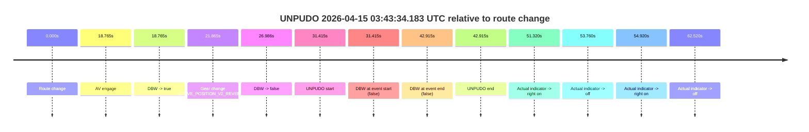
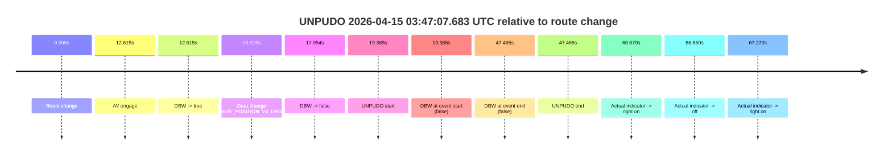
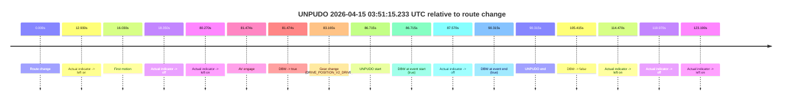
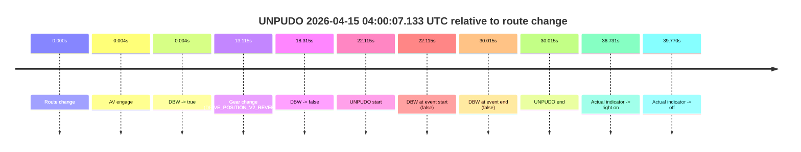
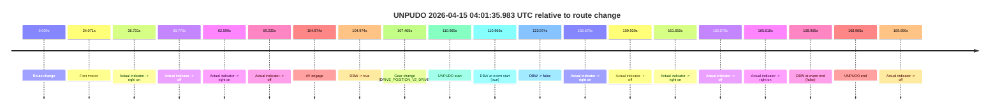
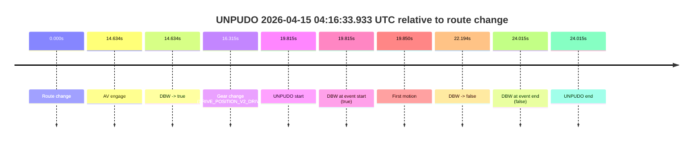
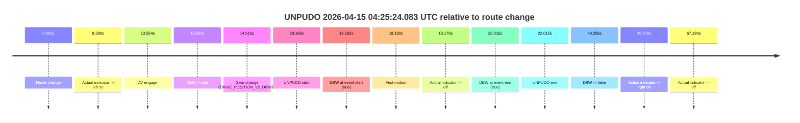
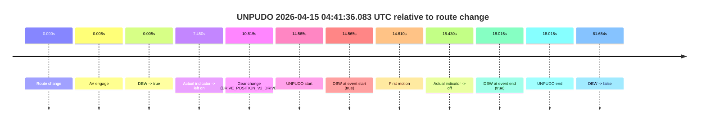
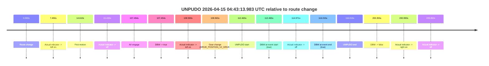
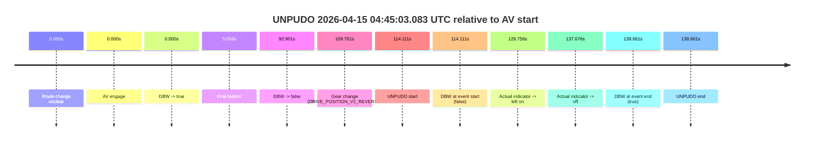

# Run Report: fme10005/2026-04-15--03-36-08--gen2-av-89e7a3a2-ccf3-4b10-95f1-fc161ac9a449

| Field | Value |
|---|---|
| Run ID | `fme10005/2026-04-15--03-36-08--gen2-av-89e7a3a2-ccf3-4b10-95f1-fc161ac9a449` |
| Date | `2026-04-15` |
| Model(s) | `eel-teal-outspoken` |
| Author | `zak` |
| Event count | `10` |

## unpudo 2026-04-15 03:43:34.183 UTC

| Field | Value |
|---|---|
| Model | `eel-teal-outspoken` |
| Author | `zak` |
| Run ID | `fme10005/2026-04-15--03-36-08--gen2-av-89e7a3a2-ccf3-4b10-95f1-fc161ac9a449` |
| Date | `2026-04-15` |
| Time (UTC) | `03:43:34.183` |
| Event type | `unpudo` |
| Disengagement type | `failed_to_unpudo` |
| Route change | `found` |
| Console | [run](https://console.sso.wayve.ai/run/fme10005/2026-04-15--03-36-08--gen2-av-89e7a3a2-ccf3-4b10-95f1-fc161ac9a449?id=&time-unixus=1776224614183291) |
| Foxglove | [segment](https://app.foxglove.dev/wayve-on-prem/p/prj_0dX18KZdVHg1fmmI/view?ds=foxglove-stream&ds.deviceName=fme10005&ds.start=2026-04-15T03%3A42%3A52.768255Z&ds.end=2026-04-15T03%3A43%3A55.683310Z&layoutId=lay_0e7VD4WIKDQGU73Y&time=2026-04-15T03%3A43%3A34.183291Z) |

### Event card: fail

- Fail: AV owns part of the segment, but the event still resolves as a model-performance failure under the AV-only scoring rule.

| Event | Time (UTC) | Delta from route change |
|---|---:|---:|
| Route change | 2026-04-15 03:43:02.768 | `0.000s` |
| AV engage | 2026-04-15 03:43:21.532 | `18.765s` |
| DBW -> true | 2026-04-15 03:43:21.532 | `18.765s` |
| Gear change (DRIVE_POSITION_V2_REVERSE) | 2026-04-15 03:43:24.633 | `21.865s` |
| DBW -> false | 2026-04-15 03:43:29.754 | `26.986s` |
| UNPUDO start | 2026-04-15 03:43:34.183 | `31.415s` |
| DBW at event start (false) | 2026-04-15 03:43:34.183 | `31.415s` |
| DBW at event end (false) | 2026-04-15 03:43:45.683 | `42.915s` |
| UNPUDO end | 2026-04-15 03:43:45.683 | `42.915s` |
| Actual indicator -> right on | 2026-04-15 03:43:54.088 | `51.320s` |
| Actual indicator -> off | 2026-04-15 03:43:56.528 | `53.760s` |
| Actual indicator -> right on | 2026-04-15 03:43:57.688 | `54.920s` |
| Actual indicator -> off | 2026-04-15 03:44:05.288 | `62.520s` |

| Metric | Value |
|---|---|
| Outcome | `fail` |
| Effective failure type | `failed_to_unpudo` |
| Route change status | `found` |
| DBW at event start | `false` |
| DBW at event end | `false` |
| Predicted gear at AV start | `DRIVE_POSITION_V2_PARK` |
| Actual gear at AV start | `DRIVE_POSITION_V2_PARK` |
| Predicted gear at event start | `DRIVE_POSITION_V2_REVERSE` |
| Actual gear at event start | `DRIVE_POSITION_V2_REVERSE` |
| Planned indicator direction | `INDICATORS_STATE_V2_OFF` |
| Controller indicator direction | `INDICATORS_STATE_V2_OFF` |
| Actual indicator direction | `INDICATORS_STATE_V2_OFF` |
| Actual indicator at maneuver end | `INDICATORS_STATE_V2_OFF` |
| Driver accel help in AV | `false` |
| Driver accel help timestamp | `n/a` |
| Max accel pedal pct in AV | `0.0%` |
| Max brake pedal pct in AV | `14.7%` |
| Max speed mps in AV | `0.000` |
| Success timing baseline | `route change` |
| Route -> AV | `18.765s` |
| AV -> event start | `12.650s` |
| AV -> first motion | `n/a` |
| Success baseline -> event start | `31.415s` |
| Success baseline -> first motion | `n/a` |
| AV duration before disengagement | `8.221s` |
| Trajectory waypoint count | `37` |
| Driving-plan step count | `11` |

The scored portion starts from the AV-owned window, not from the pre-AV setup. Route-change search in the stopped pre-event segment was `found`, with the baseline therefore set to route change. At the event anchor the model predicts `DRIVE_POSITION_V2_REVERSE` and the actual gear is `DRIVE_POSITION_V2_REVERSE`. The effective model outcome is `fail` because `failed_to_unpudo.`

### Resolution

| Field | Value |
|---|---|
| Final outcome | `fail` |
| Do we agree with this label? | `yes` |
| Source disengagement type | `failed_to_unpudo` |
| Resolved effective failure type | `failed_to_unpudo` |
| Confidence | `high` |

## unpudo 2026-04-15 03:47:07.683 UTC

| Field | Value |
|---|---|
| Model | `eel-teal-outspoken` |
| Author | `zak` |
| Run ID | `fme10005/2026-04-15--03-36-08--gen2-av-89e7a3a2-ccf3-4b10-95f1-fc161ac9a449` |
| Date | `2026-04-15` |
| Time (UTC) | `03:47:07.683` |
| Event type | `unpudo` |
| Disengagement type | `failed_to_unpudo` |
| Route change | `found` |
| Console | [run](https://console.sso.wayve.ai/run/fme10005/2026-04-15--03-36-08--gen2-av-89e7a3a2-ccf3-4b10-95f1-fc161ac9a449?id=&time-unixus=1776224827683307) |
| Foxglove | [segment](https://app.foxglove.dev/wayve-on-prem/p/prj_0dX18KZdVHg1fmmI/view?ds=foxglove-stream&ds.deviceName=fme10005&ds.start=2026-04-15T03%3A46%3A38.318244Z&ds.end=2026-04-15T03%3A47%3A45.783313Z&layoutId=lay_0e7VD4WIKDQGU73Y&time=2026-04-15T03%3A47%3A07.683307Z) |

### Event card: fail

- Fail: AV owns part of the segment, but the event still resolves as a model-performance failure under the AV-only scoring rule.

| Event | Time (UTC) | Delta from route change |
|---|---:|---:|
| Route change | 2026-04-15 03:46:48.318 | `0.000s` |
| AV engage | 2026-04-15 03:47:00.932 | `12.615s` |
| DBW -> true | 2026-04-15 03:47:00.932 | `12.615s` |
| Gear change (DRIVE_POSITION_V2_DRIVE) | 2026-04-15 03:47:03.633 | `15.315s` |
| DBW -> false | 2026-04-15 03:47:05.372 | `17.054s` |
| UNPUDO start | 2026-04-15 03:47:07.683 | `19.365s` |
| DBW at event start (false) | 2026-04-15 03:47:07.683 | `19.365s` |
| DBW at event end (false) | 2026-04-15 03:47:35.783 | `47.465s` |
| UNPUDO end | 2026-04-15 03:47:35.783 | `47.465s` |
| Actual indicator -> right on | 2026-04-15 03:47:48.988 | `60.670s` |
| Actual indicator -> off | 2026-04-15 03:47:55.168 | `66.850s` |
| Actual indicator -> right on | 2026-04-15 03:47:55.588 | `67.270s` |

| Metric | Value |
|---|---|
| Outcome | `fail` |
| Effective failure type | `failed_to_unpudo` |
| Route change status | `found` |
| DBW at event start | `false` |
| DBW at event end | `false` |
| Predicted gear at AV start | `DRIVE_POSITION_V2_PARK` |
| Actual gear at AV start | `DRIVE_POSITION_V2_PARK` |
| Predicted gear at event start | `DRIVE_POSITION_V2_DRIVE` |
| Actual gear at event start | `DRIVE_POSITION_V2_DRIVE` |
| Planned indicator direction | `INDICATORS_STATE_V2_OFF` |
| Controller indicator direction | `INDICATORS_STATE_V2_OFF` |
| Actual indicator direction | `INDICATORS_STATE_V2_OFF` |
| Actual indicator at maneuver end | `INDICATORS_STATE_V2_OFF` |
| Driver accel help in AV | `false` |
| Driver accel help timestamp | `n/a` |
| Max accel pedal pct in AV | `0.0%` |
| Max brake pedal pct in AV | `8.0%` |
| Max speed mps in AV | `0.000` |
| Success timing baseline | `route change` |
| Route -> AV | `12.615s` |
| AV -> event start | `6.750s` |
| AV -> first motion | `n/a` |
| Success baseline -> event start | `19.365s` |
| Success baseline -> first motion | `n/a` |
| AV duration before disengagement | `4.440s` |
| Trajectory waypoint count | `37` |
| Driving-plan step count | `11` |

The scored portion starts from the AV-owned window, not from the pre-AV setup. Route-change search in the stopped pre-event segment was `found`, with the baseline therefore set to route change. At the event anchor the model predicts `DRIVE_POSITION_V2_DRIVE` and the actual gear is `DRIVE_POSITION_V2_DRIVE`. The effective model outcome is `fail` because `failed_to_unpudo.`

### Resolution

| Field | Value |
|---|---|
| Final outcome | `fail` |
| Do we agree with this label? | `yes` |
| Source disengagement type | `failed_to_unpudo` |
| Resolved effective failure type | `failed_to_unpudo` |
| Confidence | `high` |

## unpudo 2026-04-15 03:51:15.233 UTC

| Field | Value |
|---|---|
| Model | `eel-teal-outspoken` |
| Author | `zak` |
| Run ID | `fme10005/2026-04-15--03-36-08--gen2-av-89e7a3a2-ccf3-4b10-95f1-fc161ac9a449` |
| Date | `2026-04-15` |
| Time (UTC) | `03:51:15.233` |
| Event type | `unpudo` |
| Disengagement type | `none observed` |
| Route change | `found` |
| Console | [run](https://console.sso.wayve.ai/run/fme10005/2026-04-15--03-36-08--gen2-av-89e7a3a2-ccf3-4b10-95f1-fc161ac9a449?id=&time-unixus=1776225075233309) |
| Foxglove | [segment](https://app.foxglove.dev/wayve-on-prem/p/prj_0dX18KZdVHg1fmmI/view?ds=foxglove-stream&ds.deviceName=fme10005&ds.start=2026-04-15T03%3A49%3A38.518228Z&ds.end=2026-04-15T03%3A51%3A43.932730Z&layoutId=lay_0e7VD4WIKDQGU73Y&time=2026-04-15T03%3A51%3A15.233309Z) |

### Event card: pass

- Pass: AV owns the credited unpudo from route change through the official unpudo window, the gear state is aligned at the anchor, and the vehicle moves without driver accelerator help in AV.

| Event | Time (UTC) | Delta from route change |
|---|---:|---:|
| Route change | 2026-04-15 03:49:48.518 | `0.000s` |
| Actual indicator -> left on | 2026-04-15 03:50:01.448 | `12.930s` |
| First motion | 2026-04-15 03:50:04.548 | `16.030s` |
| Actual indicator -> off | 2026-04-15 03:50:06.868 | `18.350s` |
| Actual indicator -> left on | 2026-04-15 03:51:08.788 | `80.270s` |
| AV engage | 2026-04-15 03:51:09.992 | `81.474s` |
| DBW -> true | 2026-04-15 03:51:09.992 | `81.474s` |
| Gear change (DRIVE_POSITION_V2_DRIVE) | 2026-04-15 03:51:11.683 | `83.165s` |
| UNPUDO start | 2026-04-15 03:51:15.233 | `86.715s` |
| DBW at event start (true) | 2026-04-15 03:51:15.233 | `86.715s` |
| Actual indicator -> off | 2026-04-15 03:51:16.088 | `87.570s` |
| DBW at event end (true) | 2026-04-15 03:51:18.833 | `90.315s` |
| UNPUDO end | 2026-04-15 03:51:18.833 | `90.315s` |
| DBW -> false | 2026-04-15 03:51:33.932 | `105.415s` |
| Actual indicator -> left on | 2026-04-15 03:51:42.988 | `114.470s` |
| Actual indicator -> off | 2026-04-15 03:51:48.488 | `119.970s` |
| Actual indicator -> left on | 2026-04-15 03:51:51.708 | `123.190s` |

| Metric | Value |
|---|---|
| Outcome | `pass` |
| Effective failure type | `none` |
| Route change status | `found` |
| DBW at event start | `true` |
| DBW at event end | `true` |
| Predicted gear at AV start | `DRIVE_POSITION_V2_PARK` |
| Actual gear at AV start | `DRIVE_POSITION_V2_PARK` |
| Predicted gear at event start | `DRIVE_POSITION_V2_DRIVE` |
| Actual gear at event start | `DRIVE_POSITION_V2_DRIVE` |
| Planned indicator direction | `INDICATORS_STATE_V2_LEFT_ON` |
| Controller indicator direction | `INDICATORS_STATE_V2_LEFT_ON` |
| Actual indicator direction | `INDICATORS_STATE_V2_LEFT_ON` |
| Actual indicator at maneuver end | `INDICATORS_STATE_V2_OFF` |
| Driver accel help in AV | `false` |
| Driver accel help timestamp | `n/a` |
| Max accel pedal pct in AV | `0.0%` |
| Max brake pedal pct in AV | `8.0%` |
| Max speed mps in AV | `5.864` |
| Success timing baseline | `route change` |
| Route -> AV | `81.474s` |
| AV -> event start | `5.241s` |
| AV -> first motion | `-65.444s` |
| Success baseline -> event start | `86.715s` |
| Success baseline -> first motion | `16.030s` |
| AV duration before disengagement | `23.940s` |
| Trajectory waypoint count | `38` |
| Driving-plan step count | `11` |

The scored portion starts from the AV-owned window, not from the pre-AV setup. Route-change search in the stopped pre-event segment was `found`, with the baseline therefore set to route change. At the event anchor the model predicts `DRIVE_POSITION_V2_DRIVE` and the actual gear is `DRIVE_POSITION_V2_DRIVE`. The effective model outcome is `pass` because `the credited unpudo stays AV-owned through the official unpudo window.`

### Resolution

| Field | Value |
|---|---|
| Final outcome | `pass` |
| Do we agree with this label? | `yes` |
| Source disengagement type | `none observed` |
| Resolved effective failure type | `none` |
| Confidence | `high` |

## unpudo 2026-04-15 04:00:07.133 UTC

| Field | Value |
|---|---|
| Model | `eel-teal-outspoken` |
| Author | `zak` |
| Run ID | `fme10005/2026-04-15--03-36-08--gen2-av-89e7a3a2-ccf3-4b10-95f1-fc161ac9a449` |
| Date | `2026-04-15` |
| Time (UTC) | `04:00:07.133` |
| Event type | `unpudo` |
| Disengagement type | `failed_to_unpudo` |
| Route change | `found` |
| Console | [run](https://console.sso.wayve.ai/run/fme10005/2026-04-15--03-36-08--gen2-av-89e7a3a2-ccf3-4b10-95f1-fc161ac9a449?id=&time-unixus=1776225607133291) |
| Foxglove | [segment](https://app.foxglove.dev/wayve-on-prem/p/prj_0dX18KZdVHg1fmmI/view?ds=foxglove-stream&ds.deviceName=fme10005&ds.start=2026-04-15T03%3A59%3A35.018317Z&ds.end=2026-04-15T04%3A00%3A25.033320Z&layoutId=lay_0e7VD4WIKDQGU73Y&time=2026-04-15T04%3A00%3A07.133291Z) |

### Event card: fail

- Fail: AV owns part of the segment, but the event still resolves as a model-performance failure under the AV-only scoring rule.

| Event | Time (UTC) | Delta from route change |
|---|---:|---:|
| Route change | 2026-04-15 03:59:45.018 | `0.000s` |
| AV engage | 2026-04-15 03:59:45.022 | `0.004s` |
| DBW -> true | 2026-04-15 03:59:45.022 | `0.004s` |
| Gear change (DRIVE_POSITION_V2_REVERSE) | 2026-04-15 03:59:58.133 | `13.115s` |
| DBW -> false | 2026-04-15 04:00:03.332 | `18.315s` |
| UNPUDO start | 2026-04-15 04:00:07.133 | `22.115s` |
| DBW at event start (false) | 2026-04-15 04:00:07.133 | `22.115s` |
| DBW at event end (false) | 2026-04-15 04:00:15.033 | `30.015s` |
| UNPUDO end | 2026-04-15 04:00:15.033 | `30.015s` |
| Actual indicator -> right on | 2026-04-15 04:00:21.749 | `36.731s` |
| Actual indicator -> off | 2026-04-15 04:00:24.788 | `39.770s` |

| Metric | Value |
|---|---|
| Outcome | `fail` |
| Effective failure type | `failed_to_unpudo` |
| Route change status | `found` |
| DBW at event start | `false` |
| DBW at event end | `false` |
| Predicted gear at AV start | `DRIVE_POSITION_V2_PARK` |
| Actual gear at AV start | `DRIVE_POSITION_V2_PARK` |
| Predicted gear at event start | `DRIVE_POSITION_V2_REVERSE` |
| Actual gear at event start | `DRIVE_POSITION_V2_REVERSE` |
| Planned indicator direction | `INDICATORS_STATE_V2_OFF` |
| Controller indicator direction | `INDICATORS_STATE_V2_OFF` |
| Actual indicator direction | `INDICATORS_STATE_V2_OFF` |
| Actual indicator at maneuver end | `INDICATORS_STATE_V2_OFF` |
| Driver accel help in AV | `false` |
| Driver accel help timestamp | `n/a` |
| Max accel pedal pct in AV | `0.0%` |
| Max brake pedal pct in AV | `8.0%` |
| Max speed mps in AV | `0.000` |
| Success timing baseline | `route change` |
| Route -> AV | `0.004s` |
| AV -> event start | `22.111s` |
| AV -> first motion | `n/a` |
| Success baseline -> event start | `22.115s` |
| Success baseline -> first motion | `n/a` |
| AV duration before disengagement | `18.310s` |
| Trajectory waypoint count | `38` |
| Driving-plan step count | `11` |

The scored portion starts from the AV-owned window, not from the pre-AV setup. Route-change search in the stopped pre-event segment was `found`, with the baseline therefore set to route change. At the event anchor the model predicts `DRIVE_POSITION_V2_REVERSE` and the actual gear is `DRIVE_POSITION_V2_REVERSE`. The effective model outcome is `fail` because `failed_to_unpudo.`

### Resolution

| Field | Value |
|---|---|
| Final outcome | `fail` |
| Do we agree with this label? | `yes` |
| Source disengagement type | `failed_to_unpudo` |
| Resolved effective failure type | `failed_to_unpudo` |
| Confidence | `high` |

## unpudo 2026-04-15 04:01:35.983 UTC

| Field | Value |
|---|---|
| Model | `eel-teal-outspoken` |
| Author | `zak` |
| Run ID | `fme10005/2026-04-15--03-36-08--gen2-av-89e7a3a2-ccf3-4b10-95f1-fc161ac9a449` |
| Date | `2026-04-15` |
| Time (UTC) | `04:01:35.983` |
| Event type | `unpudo` |
| Disengagement type | `failed_to_unpudo` |
| Route change | `found` |
| Console | [run](https://console.sso.wayve.ai/run/fme10005/2026-04-15--03-36-08--gen2-av-89e7a3a2-ccf3-4b10-95f1-fc161ac9a449?id=&time-unixus=1776225695983309) |
| Foxglove | [segment](https://app.foxglove.dev/wayve-on-prem/p/prj_0dX18KZdVHg1fmmI/view?ds=foxglove-stream&ds.deviceName=fme10005&ds.start=2026-04-15T03%3A59%3A35.018317Z&ds.end=2026-04-15T04%3A02%3A43.983304Z&layoutId=lay_0e7VD4WIKDQGU73Y&time=2026-04-15T04%3A01%3A35.983309Z) |

### Event card: fail

- Fail: AV owns part of the segment, but the event still resolves as a model-performance failure under the AV-only scoring rule.

| Event | Time (UTC) | Delta from route change |
|---|---:|---:|
| Route change | 2026-04-15 03:59:45.018 | `0.000s` |
| First motion | 2026-04-15 04:00:09.088 | `24.071s` |
| Actual indicator -> right on | 2026-04-15 04:00:21.749 | `36.731s` |
| Actual indicator -> off | 2026-04-15 04:00:24.788 | `39.770s` |
| Actual indicator -> right on | 2026-04-15 04:00:47.608 | `62.590s` |
| Actual indicator -> off | 2026-04-15 04:00:54.248 | `69.230s` |
| AV engage | 2026-04-15 04:01:29.992 | `104.974s` |
| DBW -> true | 2026-04-15 04:01:29.992 | `104.974s` |
| Gear change (DRIVE_POSITION_V2_DRIVE) | 2026-04-15 04:01:32.483 | `107.465s` |
| UNPUDO start | 2026-04-15 04:01:35.983 | `110.965s` |
| DBW at event start (true) | 2026-04-15 04:01:35.983 | `110.965s` |
| DBW -> false | 2026-04-15 04:01:48.992 | `123.974s` |
| Actual indicator -> right on | 2026-04-15 04:02:21.688 | `156.670s` |
| Actual indicator -> off | 2026-04-15 04:02:24.948 | `159.930s` |
| Actual indicator -> right on | 2026-04-15 04:02:26.668 | `161.650s` |
| Actual indicator -> off | 2026-04-15 04:02:27.588 | `162.570s` |
| Actual indicator -> right on | 2026-04-15 04:02:30.628 | `165.610s` |
| DBW at event end (false) | 2026-04-15 04:02:33.983 | `168.965s` |
| UNPUDO end | 2026-04-15 04:02:33.983 | `168.965s` |
| Actual indicator -> off | 2026-04-15 04:02:34.708 | `169.690s` |

| Metric | Value |
|---|---|
| Outcome | `fail` |
| Effective failure type | `failed_to_unpudo` |
| Route change status | `found` |
| DBW at event start | `true` |
| DBW at event end | `false` |
| Predicted gear at AV start | `DRIVE_POSITION_V2_PARK` |
| Actual gear at AV start | `DRIVE_POSITION_V2_PARK` |
| Predicted gear at event start | `DRIVE_POSITION_V2_DRIVE` |
| Actual gear at event start | `DRIVE_POSITION_V2_DRIVE` |
| Planned indicator direction | `INDICATORS_STATE_V2_OFF` |
| Controller indicator direction | `INDICATORS_STATE_V2_OFF` |
| Actual indicator direction | `INDICATORS_STATE_V2_OFF` |
| Actual indicator at maneuver end | `INDICATORS_STATE_V2_RIGHT_ON` |
| Driver accel help in AV | `false` |
| Driver accel help timestamp | `n/a` |
| Max accel pedal pct in AV | `0.0%` |
| Max brake pedal pct in AV | `8.0%` |
| Max speed mps in AV | `1.814` |
| Success timing baseline | `route change` |
| Route -> AV | `104.974s` |
| AV -> event start | `5.991s` |
| AV -> first motion | `-80.904s` |
| Success baseline -> event start | `110.965s` |
| Success baseline -> first motion | `24.071s` |
| AV duration before disengagement | `19.000s` |
| Trajectory waypoint count | `37` |
| Driving-plan step count | `11` |

The scored portion starts from the AV-owned window, not from the pre-AV setup. Route-change search in the stopped pre-event segment was `found`, with the baseline therefore set to route change. At the event anchor the model predicts `DRIVE_POSITION_V2_DRIVE` and the actual gear is `DRIVE_POSITION_V2_DRIVE`. The effective model outcome is `fail` because `failed_to_unpudo.`

### Resolution

| Field | Value |
|---|---|
| Final outcome | `fail` |
| Do we agree with this label? | `yes` |
| Source disengagement type | `failed_to_unpudo` |
| Resolved effective failure type | `failed_to_unpudo` |
| Confidence | `high` |

## unpudo 2026-04-15 04:16:33.933 UTC

| Field | Value |
|---|---|
| Model | `eel-teal-outspoken` |
| Author | `zak` |
| Run ID | `fme10005/2026-04-15--03-36-08--gen2-av-89e7a3a2-ccf3-4b10-95f1-fc161ac9a449` |
| Date | `2026-04-15` |
| Time (UTC) | `04:16:33.933` |
| Event type | `unpudo` |
| Disengagement type | `none observed` |
| Route change | `found` |
| Console | [run](https://console.sso.wayve.ai/run/fme10005/2026-04-15--03-36-08--gen2-av-89e7a3a2-ccf3-4b10-95f1-fc161ac9a449?id=&time-unixus=1776226593933295) |
| Foxglove | [segment](https://app.foxglove.dev/wayve-on-prem/p/prj_0dX18KZdVHg1fmmI/view?ds=foxglove-stream&ds.deviceName=fme10005&ds.start=2026-04-15T04%3A16%3A04.118265Z&ds.end=2026-04-15T04%3A16%3A48.133310Z&layoutId=lay_0e7VD4WIKDQGU73Y&time=2026-04-15T04%3A16%3A33.933295Z) |

### Event card: fail

- Fail: this is a short AV stint rather than a durable model-owned maneuver. The vehicle never settles into a long enough AV-owned attempt to credit the model.

| Event | Time (UTC) | Delta from route change |
|---|---:|---:|
| Route change | 2026-04-15 04:16:14.118 | `0.000s` |
| AV engage | 2026-04-15 04:16:28.752 | `14.634s` |
| DBW -> true | 2026-04-15 04:16:28.752 | `14.634s` |
| Gear change (DRIVE_POSITION_V2_DRIVE) | 2026-04-15 04:16:30.433 | `16.315s` |
| UNPUDO start | 2026-04-15 04:16:33.933 | `19.815s` |
| DBW at event start (true) | 2026-04-15 04:16:33.933 | `19.815s` |
| First motion | 2026-04-15 04:16:33.968 | `19.850s` |
| DBW -> false | 2026-04-15 04:16:36.312 | `22.194s` |
| DBW at event end (false) | 2026-04-15 04:16:38.133 | `24.015s` |
| UNPUDO end | 2026-04-15 04:16:38.133 | `24.015s` |

| Metric | Value |
|---|---|
| Outcome | `fail` |
| Effective failure type | `interrupted_handover` |
| Route change status | `found` |
| DBW at event start | `true` |
| DBW at event end | `false` |
| Predicted gear at AV start | `DRIVE_POSITION_V2_PARK` |
| Actual gear at AV start | `DRIVE_POSITION_V2_PARK` |
| Predicted gear at event start | `DRIVE_POSITION_V2_DRIVE` |
| Actual gear at event start | `DRIVE_POSITION_V2_DRIVE` |
| Planned indicator direction | `INDICATORS_STATE_V2_OFF` |
| Controller indicator direction | `INDICATORS_STATE_V2_OFF` |
| Actual indicator direction | `INDICATORS_STATE_V2_OFF` |
| Actual indicator at maneuver end | `INDICATORS_STATE_V2_OFF` |
| Driver accel help in AV | `false` |
| Driver accel help timestamp | `n/a` |
| Max accel pedal pct in AV | `0.0%` |
| Max brake pedal pct in AV | `8.0%` |
| Max speed mps in AV | `3.042` |
| Success timing baseline | `route change` |
| Route -> AV | `14.634s` |
| AV -> event start | `5.181s` |
| AV -> first motion | `5.216s` |
| Success baseline -> event start | `19.815s` |
| Success baseline -> first motion | `19.850s` |
| AV duration before disengagement | `7.560s` |
| Trajectory waypoint count | `38` |
| Driving-plan step count | `11` |

The scored portion starts from the AV-owned window, not from the pre-AV setup. Route-change search in the stopped pre-event segment was `found`, with the baseline therefore set to route change. At the event anchor the model predicts `DRIVE_POSITION_V2_DRIVE` and the actual gear is `DRIVE_POSITION_V2_DRIVE`. The effective model outcome is `fail` because `interrupted_handover.`

### Resolution

| Field | Value |
|---|---|
| Final outcome | `fail` |
| Do we agree with this label? | `yes` |
| Source disengagement type | `none observed` |
| Resolved effective failure type | `interrupted_handover` |
| Confidence | `high` |

## unpudo 2026-04-15 04:25:24.083 UTC

| Field | Value |
|---|---|
| Model | `eel-teal-outspoken` |
| Author | `zak` |
| Run ID | `fme10005/2026-04-15--03-36-08--gen2-av-89e7a3a2-ccf3-4b10-95f1-fc161ac9a449` |
| Date | `2026-04-15` |
| Time (UTC) | `04:25:24.083` |
| Event type | `unpudo` |
| Disengagement type | `none observed` |
| Route change | `found` |
| Console | [run](https://console.sso.wayve.ai/run/fme10005/2026-04-15--03-36-08--gen2-av-89e7a3a2-ccf3-4b10-95f1-fc161ac9a449?id=&time-unixus=1776227124083316) |
| Foxglove | [segment](https://app.foxglove.dev/wayve-on-prem/p/prj_0dX18KZdVHg1fmmI/view?ds=foxglove-stream&ds.deviceName=fme10005&ds.start=2026-04-15T04%3A24%3A55.918245Z&ds.end=2026-04-15T04%3A26%3A05.173802Z&layoutId=lay_0e7VD4WIKDQGU73Y&time=2026-04-15T04%3A25%3A24.083316Z) |

### Event card: pass

- Pass: AV owns the credited unpudo from route change through the official unpudo window, the gear state is aligned at the anchor, and the vehicle moves without driver accelerator help in AV.

| Event | Time (UTC) | Delta from route change |
|---|---:|---:|
| Route change | 2026-04-15 04:25:05.918 | `0.000s` |
| Actual indicator -> left on | 2026-04-15 04:25:14.308 | `8.390s` |
| AV engage | 2026-04-15 04:25:19.472 | `13.554s` |
| DBW -> true | 2026-04-15 04:25:19.472 | `13.554s` |
| Gear change (DRIVE_POSITION_V2_DRIVE) | 2026-04-15 04:25:20.433 | `14.515s` |
| UNPUDO start | 2026-04-15 04:25:24.083 | `18.165s` |
| DBW at event start (true) | 2026-04-15 04:25:24.083 | `18.165s` |
| First motion | 2026-04-15 04:25:24.108 | `18.190s` |
| Actual indicator -> off | 2026-04-15 04:25:25.088 | `19.170s` |
| DBW at event end (true) | 2026-04-15 04:25:27.933 | `22.015s` |
| UNPUDO end | 2026-04-15 04:25:27.933 | `22.015s` |
| DBW -> false | 2026-04-15 04:25:55.173 | `49.256s` |
| Actual indicator -> right on | 2026-04-15 04:25:55.388 | `49.470s` |
| Actual indicator -> off | 2026-04-15 04:26:13.108 | `67.190s` |

| Metric | Value |
|---|---|
| Outcome | `pass` |
| Effective failure type | `none` |
| Route change status | `found` |
| DBW at event start | `true` |
| DBW at event end | `true` |
| Predicted gear at AV start | `DRIVE_POSITION_V2_PARK` |
| Actual gear at AV start | `DRIVE_POSITION_V2_PARK` |
| Predicted gear at event start | `DRIVE_POSITION_V2_DRIVE` |
| Actual gear at event start | `DRIVE_POSITION_V2_DRIVE` |
| Planned indicator direction | `INDICATORS_STATE_V2_LEFT_ON` |
| Controller indicator direction | `INDICATORS_STATE_V2_LEFT_ON` |
| Actual indicator direction | `INDICATORS_STATE_V2_LEFT_ON` |
| Actual indicator at maneuver end | `INDICATORS_STATE_V2_OFF` |
| Driver accel help in AV | `false` |
| Driver accel help timestamp | `n/a` |
| Max accel pedal pct in AV | `0.0%` |
| Max brake pedal pct in AV | `8.0%` |
| Max speed mps in AV | `5.453` |
| Success timing baseline | `route change` |
| Route -> AV | `13.554s` |
| AV -> event start | `4.611s` |
| AV -> first motion | `4.636s` |
| Success baseline -> event start | `18.165s` |
| Success baseline -> first motion | `18.190s` |
| AV duration before disengagement | `35.701s` |
| Trajectory waypoint count | `37` |
| Driving-plan step count | `11` |

The scored portion starts from the AV-owned window, not from the pre-AV setup. Route-change search in the stopped pre-event segment was `found`, with the baseline therefore set to route change. At the event anchor the model predicts `DRIVE_POSITION_V2_DRIVE` and the actual gear is `DRIVE_POSITION_V2_DRIVE`. The effective model outcome is `pass` because `the credited unpudo stays AV-owned through the official unpudo window.`

### Resolution

| Field | Value |
|---|---|
| Final outcome | `pass` |
| Do we agree with this label? | `yes` |
| Source disengagement type | `none observed` |
| Resolved effective failure type | `none` |
| Confidence | `high` |

## unpudo 2026-04-15 04:41:36.083 UTC

| Field | Value |
|---|---|
| Model | `eel-teal-outspoken` |
| Author | `zak` |
| Run ID | `fme10005/2026-04-15--03-36-08--gen2-av-89e7a3a2-ccf3-4b10-95f1-fc161ac9a449` |
| Date | `2026-04-15` |
| Time (UTC) | `04:41:36.083` |
| Event type | `unpudo` |
| Disengagement type | `none observed` |
| Route change | `found` |
| Console | [run](https://console.sso.wayve.ai/run/fme10005/2026-04-15--03-36-08--gen2-av-89e7a3a2-ccf3-4b10-95f1-fc161ac9a449?id=&time-unixus=1776228096083305) |
| Foxglove | [segment](https://app.foxglove.dev/wayve-on-prem/p/prj_0dX18KZdVHg1fmmI/view?ds=foxglove-stream&ds.deviceName=fme10005&ds.start=2026-04-15T04%3A41%3A11.518242Z&ds.end=2026-04-15T04%3A42%3A53.172671Z&layoutId=lay_0e7VD4WIKDQGU73Y&time=2026-04-15T04%3A41%3A36.083305Z) |

### Event card: pass

- Pass: AV owns the credited unpudo from route change through the official unpudo window, the gear state is aligned at the anchor, and the vehicle moves without driver accelerator help in AV.

| Event | Time (UTC) | Delta from route change |
|---|---:|---:|
| Route change | 2026-04-15 04:41:21.518 | `0.000s` |
| AV engage | 2026-04-15 04:41:21.522 | `0.005s` |
| DBW -> true | 2026-04-15 04:41:21.522 | `0.005s` |
| Actual indicator -> left on | 2026-04-15 04:41:28.968 | `7.450s` |
| Gear change (DRIVE_POSITION_V2_DRIVE) | 2026-04-15 04:41:32.333 | `10.815s` |
| UNPUDO start | 2026-04-15 04:41:36.083 | `14.565s` |
| DBW at event start (true) | 2026-04-15 04:41:36.083 | `14.565s` |
| First motion | 2026-04-15 04:41:36.128 | `14.610s` |
| Actual indicator -> off | 2026-04-15 04:41:36.948 | `15.430s` |
| DBW at event end (true) | 2026-04-15 04:41:39.533 | `18.015s` |
| UNPUDO end | 2026-04-15 04:41:39.533 | `18.015s` |
| DBW -> false | 2026-04-15 04:42:43.172 | `81.654s` |

| Metric | Value |
|---|---|
| Outcome | `pass` |
| Effective failure type | `none` |
| Route change status | `found` |
| DBW at event start | `true` |
| DBW at event end | `true` |
| Predicted gear at AV start | `DRIVE_POSITION_V2_PARK` |
| Actual gear at AV start | `DRIVE_POSITION_V2_PARK` |
| Predicted gear at event start | `DRIVE_POSITION_V2_DRIVE` |
| Actual gear at event start | `DRIVE_POSITION_V2_DRIVE` |
| Planned indicator direction | `INDICATORS_STATE_V2_LEFT_ON` |
| Controller indicator direction | `INDICATORS_STATE_V2_LEFT_ON` |
| Actual indicator direction | `INDICATORS_STATE_V2_LEFT_ON` |
| Actual indicator at maneuver end | `INDICATORS_STATE_V2_OFF` |
| Driver accel help in AV | `false` |
| Driver accel help timestamp | `n/a` |
| Max accel pedal pct in AV | `0.0%` |
| Max brake pedal pct in AV | `8.0%` |
| Max speed mps in AV | `5.494` |
| Success timing baseline | `route change` |
| Route -> AV | `0.005s` |
| AV -> event start | `14.561s` |
| AV -> first motion | `14.605s` |
| Success baseline -> event start | `14.565s` |
| Success baseline -> first motion | `14.610s` |
| AV duration before disengagement | `81.650s` |
| Trajectory waypoint count | `37` |
| Driving-plan step count | `11` |

The scored portion starts from the AV-owned window, not from the pre-AV setup. Route-change search in the stopped pre-event segment was `found`, with the baseline therefore set to route change. At the event anchor the model predicts `DRIVE_POSITION_V2_DRIVE` and the actual gear is `DRIVE_POSITION_V2_DRIVE`. The effective model outcome is `pass` because `the credited unpudo stays AV-owned through the official unpudo window.`

### Resolution

| Field | Value |
|---|---|
| Final outcome | `pass` |
| Do we agree with this label? | `yes` |
| Source disengagement type | `none observed` |
| Resolved effective failure type | `none` |
| Confidence | `high` |

## unpudo 2026-04-15 04:43:13.983 UTC

| Field | Value |
|---|---|
| Model | `eel-teal-outspoken` |
| Author | `zak` |
| Run ID | `fme10005/2026-04-15--03-36-08--gen2-av-89e7a3a2-ccf3-4b10-95f1-fc161ac9a449` |
| Date | `2026-04-15` |
| Time (UTC) | `04:43:13.983` |
| Event type | `unpudo` |
| Disengagement type | `none observed` |
| Route change | `found` |
| Console | [run](https://console.sso.wayve.ai/run/fme10005/2026-04-15--03-36-08--gen2-av-89e7a3a2-ccf3-4b10-95f1-fc161ac9a449?id=&time-unixus=1776228193983304) |
| Foxglove | [segment](https://app.foxglove.dev/wayve-on-prem/p/prj_0dX18KZdVHg1fmmI/view?ds=foxglove-stream&ds.deviceName=fme10005&ds.start=2026-04-15T04%3A41%3A11.518242Z&ds.end=2026-04-15T04%3A44%3A51.873224Z&layoutId=lay_0e7VD4WIKDQGU73Y&time=2026-04-15T04%3A43%3A13.983304Z) |

### Event card: pass

- Pass: AV owns the credited unpudo from route change through the official unpudo window, the gear state is aligned at the anchor, and the vehicle moves without driver accelerator help in AV.

| Event | Time (UTC) | Delta from route change |
|---|---:|---:|
| Route change | 2026-04-15 04:41:21.518 | `0.000s` |
| Actual indicator -> left on | 2026-04-15 04:41:28.968 | `7.450s` |
| First motion | 2026-04-15 04:41:36.128 | `14.610s` |
| Actual indicator -> off | 2026-04-15 04:41:36.948 | `15.430s` |
| AV engage | 2026-04-15 04:43:08.972 | `107.454s` |
| DBW -> true | 2026-04-15 04:43:08.972 | `107.454s` |
| Actual indicator -> left on | 2026-04-15 04:43:10.108 | `108.590s` |
| Gear change (DRIVE_POSITION_V2_DRIVE) | 2026-04-15 04:43:10.483 | `108.965s` |
| UNPUDO start | 2026-04-15 04:43:13.983 | `112.465s` |
| DBW at event start (true) | 2026-04-15 04:43:13.983 | `112.465s` |
| Actual indicator -> off | 2026-04-15 04:43:16.489 | `114.971s` |
| DBW at event end (true) | 2026-04-15 04:43:17.533 | `116.015s` |
| UNPUDO end | 2026-04-15 04:43:17.533 | `116.015s` |
| DBW -> false | 2026-04-15 04:44:41.873 | `200.355s` |
| Actual indicator -> right on | 2026-04-15 04:44:42.508 | `200.990s` |
| Actual indicator -> off | 2026-04-15 04:44:51.368 | `209.850s` |

| Metric | Value |
|---|---|
| Outcome | `pass` |
| Effective failure type | `none` |
| Route change status | `found` |
| DBW at event start | `true` |
| DBW at event end | `true` |
| Predicted gear at AV start | `DRIVE_POSITION_V2_PARK` |
| Actual gear at AV start | `DRIVE_POSITION_V2_PARK` |
| Predicted gear at event start | `DRIVE_POSITION_V2_DRIVE` |
| Actual gear at event start | `DRIVE_POSITION_V2_DRIVE` |
| Planned indicator direction | `INDICATORS_STATE_V2_LEFT_ON` |
| Controller indicator direction | `INDICATORS_STATE_V2_LEFT_ON` |
| Actual indicator direction | `INDICATORS_STATE_V2_LEFT_ON` |
| Actual indicator at maneuver end | `INDICATORS_STATE_V2_OFF` |
| Driver accel help in AV | `false` |
| Driver accel help timestamp | `n/a` |
| Max accel pedal pct in AV | `0.0%` |
| Max brake pedal pct in AV | `8.0%` |
| Max speed mps in AV | `5.275` |
| Success timing baseline | `route change` |
| Route -> AV | `107.454s` |
| AV -> event start | `5.011s` |
| AV -> first motion | `-92.844s` |
| Success baseline -> event start | `112.465s` |
| Success baseline -> first motion | `14.610s` |
| AV duration before disengagement | `92.901s` |
| Trajectory waypoint count | `37` |
| Driving-plan step count | `11` |

The scored portion starts from the AV-owned window, not from the pre-AV setup. Route-change search in the stopped pre-event segment was `found`, with the baseline therefore set to route change. At the event anchor the model predicts `DRIVE_POSITION_V2_DRIVE` and the actual gear is `DRIVE_POSITION_V2_DRIVE`. The effective model outcome is `pass` because `the credited unpudo stays AV-owned through the official unpudo window.`

### Resolution

| Field | Value |
|---|---|
| Final outcome | `pass` |
| Do we agree with this label? | `yes` |
| Source disengagement type | `none observed` |
| Resolved effective failure type | `none` |
| Confidence | `high` |

## unpudo 2026-04-15 04:45:03.083 UTC

| Field | Value |
|---|---|
| Model | `eel-teal-outspoken` |
| Author | `zak` |
| Run ID | `fme10005/2026-04-15--03-36-08--gen2-av-89e7a3a2-ccf3-4b10-95f1-fc161ac9a449` |
| Date | `2026-04-15` |
| Time (UTC) | `04:45:03.083` |
| Event type | `unpudo` |
| Disengagement type | `none observed` |
| Route change | `unclear` |
| Console | [run](https://console.sso.wayve.ai/run/fme10005/2026-04-15--03-36-08--gen2-av-89e7a3a2-ccf3-4b10-95f1-fc161ac9a449?id=&time-unixus=1776228303083315) |
| Foxglove | [segment](https://app.foxglove.dev/wayve-on-prem/p/prj_0dX18KZdVHg1fmmI/view?ds=foxglove-stream&ds.deviceName=fme10005&ds.start=2026-04-15T04%3A42%3A58.972714Z&ds.end=2026-04-15T04%3A45%3A38.633310Z&layoutId=lay_0e7VD4WIKDQGU73Y&time=2026-04-15T04%3A45%3A03.083315Z) |

### Event card: fail

- Fail: the credited unpudo does not stay AV-owned. The event window starts with DBW false, and the maneuver outcome lands outside a clean AV-owned segment.

| Event | Time (UTC) | Delta from AV start |
|---|---:|---:|
| Route change unclear | 2026-04-15 04:43:08.972 | `0.000s` |
| AV engage | 2026-04-15 04:43:08.972 | `0.000s` |
| DBW -> true | 2026-04-15 04:43:08.972 | `0.000s` |
| First motion | 2026-04-15 04:43:14.028 | `5.056s` |
| DBW -> false | 2026-04-15 04:44:41.873 | `92.901s` |
| Gear change (DRIVE_POSITION_V2_REVERSE) | 2026-04-15 04:44:58.733 | `109.761s` |
| UNPUDO start | 2026-04-15 04:45:03.083 | `114.111s` |
| DBW at event start (false) | 2026-04-15 04:45:03.083 | `114.111s` |
| Actual indicator -> left on | 2026-04-15 04:45:18.728 | `129.756s` |
| Actual indicator -> off | 2026-04-15 04:45:26.649 | `137.676s` |
| DBW at event end (true) | 2026-04-15 04:45:28.633 | `139.661s` |
| UNPUDO end | 2026-04-15 04:45:28.633 | `139.661s` |

| Metric | Value |
|---|---|
| Outcome | `fail` |
| Effective failure type | `not_av_owned` |
| Route change status | `unclear` |
| DBW at event start | `false` |
| DBW at event end | `true` |
| Predicted gear at AV start | `DRIVE_POSITION_V2_PARK` |
| Actual gear at AV start | `DRIVE_POSITION_V2_PARK` |
| Predicted gear at event start | `DRIVE_POSITION_V2_REVERSE` |
| Actual gear at event start | `DRIVE_POSITION_V2_REVERSE` |
| Planned indicator direction | `INDICATORS_STATE_V2_OFF` |
| Controller indicator direction | `INDICATORS_STATE_V2_OFF` |
| Actual indicator direction | `INDICATORS_STATE_V2_OFF` |
| Actual indicator at maneuver end | `INDICATORS_STATE_V2_OFF` |
| Driver accel help in AV | `false` |
| Driver accel help timestamp | `n/a` |
| Max accel pedal pct in AV | `0.0%` |
| Max brake pedal pct in AV | `10.8%` |
| Max speed mps in AV | `11.686` |
| Success timing baseline | `AV start` |
| Route -> AV | `n/a` |
| AV -> event start | `114.111s` |
| AV -> first motion | `5.056s` |
| Success baseline -> event start | `114.111s` |
| Success baseline -> first motion | `5.056s` |
| AV duration before disengagement | `92.901s` |
| Trajectory waypoint count | `37` |
| Driving-plan step count | `11` |

The scored portion starts from the AV-owned window, not from the pre-AV setup. Route-change search in the stopped pre-event segment was `unclear`, with the baseline therefore set to AV start. At the event anchor the model predicts `DRIVE_POSITION_V2_REVERSE` and the actual gear is `DRIVE_POSITION_V2_REVERSE`. The effective model outcome is `fail` because `not_av_owned.`

### Resolution

| Field | Value |
|---|---|
| Final outcome | `fail` |
| Do we agree with this label? | `yes` |
| Source disengagement type | `none observed` |
| Resolved effective failure type | `not_av_owned` |
| Confidence | `medium` |
