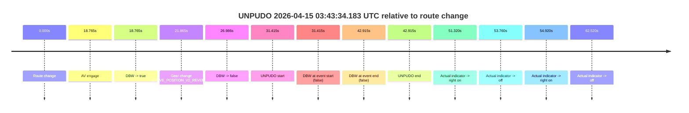
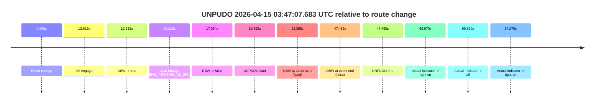
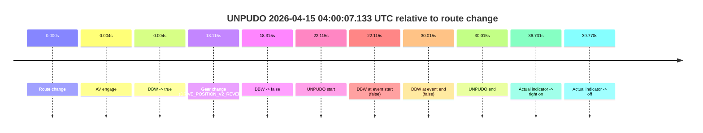
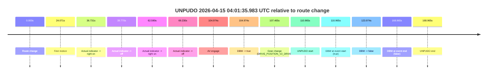

# Run Report: fme10005/2026-04-15--03-36-08--gen2-av-89e7a3a2-ccf3-4b10-95f1-fc161ac9a449

| Field | Value |
|---|---|
| Run ID | `fme10005/2026-04-15--03-36-08--gen2-av-89e7a3a2-ccf3-4b10-95f1-fc161ac9a449` |
| Date | `2026-04-15` |
| Model(s) | `eel-teal-outspoken` |
| Author | `zak` |
| Event count | `4` |

## unpudo 2026-04-15 03:43:34.183 UTC

| Field | Value |
|---|---|
| Model | `eel-teal-outspoken` |
| Author | `zak` |
| Run ID | `fme10005/2026-04-15--03-36-08--gen2-av-89e7a3a2-ccf3-4b10-95f1-fc161ac9a449` |
| Date | `2026-04-15` |
| Time (UTC) | `03:43:34.183` |
| Event type | `unpudo` |
| Disengagement type | `failed_to_unpudo` |
| Route change | `found` |
| Console | [run](https://console.sso.wayve.ai/run/fme10005/2026-04-15--03-36-08--gen2-av-89e7a3a2-ccf3-4b10-95f1-fc161ac9a449?id=&time-unixus=1776224614183291) |
| Foxglove | [segment](https://app.foxglove.dev/wayve-on-prem/p/prj_0dX18KZdVHg1fmmI/view?ds=foxglove-stream&ds.deviceName=fme10005&ds.start=2026-04-15T03%3A42%3A52.768255Z&ds.end=2026-04-15T03%3A43%3A55.683310Z&layoutId=lay_0e7VD4WIKDQGU73Y&time=2026-04-15T03%3A43%3A34.183291Z) |

### Event card: fail

- Fail: AV owns part of the segment, but the event still resolves as a model-performance failure under the AV-only scoring rule.

| Event | Time (UTC) | Delta from route change |
|---|---:|---:|
| Route change | 2026-04-15 03:43:02.768 | `0.000s` |
| AV engage | 2026-04-15 03:43:21.532 | `18.765s` |
| DBW -> true | 2026-04-15 03:43:21.532 | `18.765s` |
| Gear change (DRIVE_POSITION_V2_REVERSE) | 2026-04-15 03:43:24.633 | `21.865s` |
| DBW -> false | 2026-04-15 03:43:29.754 | `26.986s` |
| UNPUDO start | 2026-04-15 03:43:34.183 | `31.415s` |
| DBW at event start (false) | 2026-04-15 03:43:34.183 | `31.415s` |
| DBW at event end (false) | 2026-04-15 03:43:45.683 | `42.915s` |
| UNPUDO end | 2026-04-15 03:43:45.683 | `42.915s` |
| Actual indicator -> right on | 2026-04-15 03:43:54.088 | `51.320s` |
| Actual indicator -> off | 2026-04-15 03:43:56.528 | `53.760s` |
| Actual indicator -> right on | 2026-04-15 03:43:57.688 | `54.920s` |
| Actual indicator -> off | 2026-04-15 03:44:05.288 | `62.520s` |

| Metric | Value |
|---|---|
| Outcome | `fail` |
| Effective failure type | `failed_to_unpudo` |
| Route change status | `found` |
| DBW at event start | `false` |
| DBW at event end | `false` |
| Predicted gear at AV start | `DRIVE_POSITION_V2_PARK` |
| Actual gear at AV start | `DRIVE_POSITION_V2_PARK` |
| Predicted gear at event start | `DRIVE_POSITION_V2_REVERSE` |
| Actual gear at event start | `DRIVE_POSITION_V2_REVERSE` |
| Planned indicator direction | `INDICATORS_STATE_V2_OFF` |
| Controller indicator direction | `INDICATORS_STATE_V2_OFF` |
| Actual indicator direction | `INDICATORS_STATE_V2_OFF` |
| Actual indicator at maneuver end | `INDICATORS_STATE_V2_OFF` |
| Driver accel help in AV | `false` |
| Driver accel help timestamp | `n/a` |
| Max accel pedal pct in AV | `0.0%` |
| Max brake pedal pct in AV | `14.7%` |
| Max speed mps in AV | `0.000` |
| Success timing baseline | `route change` |
| Route -> AV | `18.765s` |
| AV -> event start | `12.650s` |
| AV -> first motion | `n/a` |
| Success baseline -> event start | `31.415s` |
| Success baseline -> first motion | `n/a` |
| AV duration before disengagement | `8.221s` |
| Trajectory waypoint count | `37` |
| Driving-plan step count | `11` |

The scored portion starts from the AV-owned window, not from the pre-AV setup. Route-change search in the stopped pre-event segment was `found`, with the baseline therefore set to route change. At the event anchor the model predicts `DRIVE_POSITION_V2_REVERSE` and the actual gear is `DRIVE_POSITION_V2_REVERSE`. The effective model outcome is `fail` because `failed_to_unpudo.`

### Resolution

| Field | Value |
|---|---|
| Final outcome | `fail` |
| Do we agree with this label? | `yes` |
| Source disengagement type | `failed_to_unpudo` |
| Resolved effective failure type | `failed_to_unpudo` |
| Confidence | `high` |

## unpudo 2026-04-15 03:47:07.683 UTC

| Field | Value |
|---|---|
| Model | `eel-teal-outspoken` |
| Author | `zak` |
| Run ID | `fme10005/2026-04-15--03-36-08--gen2-av-89e7a3a2-ccf3-4b10-95f1-fc161ac9a449` |
| Date | `2026-04-15` |
| Time (UTC) | `03:47:07.683` |
| Event type | `unpudo` |
| Disengagement type | `failed_to_unpudo` |
| Route change | `found` |
| Console | [run](https://console.sso.wayve.ai/run/fme10005/2026-04-15--03-36-08--gen2-av-89e7a3a2-ccf3-4b10-95f1-fc161ac9a449?id=&time-unixus=1776224827683307) |
| Foxglove | [segment](https://app.foxglove.dev/wayve-on-prem/p/prj_0dX18KZdVHg1fmmI/view?ds=foxglove-stream&ds.deviceName=fme10005&ds.start=2026-04-15T03%3A46%3A38.318244Z&ds.end=2026-04-15T03%3A47%3A45.783313Z&layoutId=lay_0e7VD4WIKDQGU73Y&time=2026-04-15T03%3A47%3A07.683307Z) |

### Event card: fail

- Fail: AV owns part of the segment, but the event still resolves as a model-performance failure under the AV-only scoring rule.

| Event | Time (UTC) | Delta from route change |
|---|---:|---:|
| Route change | 2026-04-15 03:46:48.318 | `0.000s` |
| AV engage | 2026-04-15 03:47:00.932 | `12.615s` |
| DBW -> true | 2026-04-15 03:47:00.932 | `12.615s` |
| Gear change (DRIVE_POSITION_V2_DRIVE) | 2026-04-15 03:47:03.633 | `15.315s` |
| DBW -> false | 2026-04-15 03:47:05.372 | `17.054s` |
| UNPUDO start | 2026-04-15 03:47:07.683 | `19.365s` |
| DBW at event start (false) | 2026-04-15 03:47:07.683 | `19.365s` |
| DBW at event end (false) | 2026-04-15 03:47:35.783 | `47.465s` |
| UNPUDO end | 2026-04-15 03:47:35.783 | `47.465s` |
| Actual indicator -> right on | 2026-04-15 03:47:48.988 | `60.670s` |
| Actual indicator -> off | 2026-04-15 03:47:55.168 | `66.850s` |
| Actual indicator -> right on | 2026-04-15 03:47:55.588 | `67.270s` |

| Metric | Value |
|---|---|
| Outcome | `fail` |
| Effective failure type | `failed_to_unpudo` |
| Route change status | `found` |
| DBW at event start | `false` |
| DBW at event end | `false` |
| Predicted gear at AV start | `DRIVE_POSITION_V2_PARK` |
| Actual gear at AV start | `DRIVE_POSITION_V2_PARK` |
| Predicted gear at event start | `DRIVE_POSITION_V2_DRIVE` |
| Actual gear at event start | `DRIVE_POSITION_V2_DRIVE` |
| Planned indicator direction | `INDICATORS_STATE_V2_OFF` |
| Controller indicator direction | `INDICATORS_STATE_V2_OFF` |
| Actual indicator direction | `INDICATORS_STATE_V2_OFF` |
| Actual indicator at maneuver end | `INDICATORS_STATE_V2_OFF` |
| Driver accel help in AV | `false` |
| Driver accel help timestamp | `n/a` |
| Max accel pedal pct in AV | `0.0%` |
| Max brake pedal pct in AV | `8.0%` |
| Max speed mps in AV | `0.000` |
| Success timing baseline | `route change` |
| Route -> AV | `12.615s` |
| AV -> event start | `6.750s` |
| AV -> first motion | `n/a` |
| Success baseline -> event start | `19.365s` |
| Success baseline -> first motion | `n/a` |
| AV duration before disengagement | `4.440s` |
| Trajectory waypoint count | `37` |
| Driving-plan step count | `11` |

The scored portion starts from the AV-owned window, not from the pre-AV setup. Route-change search in the stopped pre-event segment was `found`, with the baseline therefore set to route change. At the event anchor the model predicts `DRIVE_POSITION_V2_DRIVE` and the actual gear is `DRIVE_POSITION_V2_DRIVE`. The effective model outcome is `fail` because `failed_to_unpudo.`

### Resolution

| Field | Value |
|---|---|
| Final outcome | `fail` |
| Do we agree with this label? | `yes` |
| Source disengagement type | `failed_to_unpudo` |
| Resolved effective failure type | `failed_to_unpudo` |
| Confidence | `high` |

## unpudo 2026-04-15 04:00:07.133 UTC

| Field | Value |
|---|---|
| Model | `eel-teal-outspoken` |
| Author | `zak` |
| Run ID | `fme10005/2026-04-15--03-36-08--gen2-av-89e7a3a2-ccf3-4b10-95f1-fc161ac9a449` |
| Date | `2026-04-15` |
| Time (UTC) | `04:00:07.133` |
| Event type | `unpudo` |
| Disengagement type | `failed_to_unpudo` |
| Route change | `found` |
| Console | [run](https://console.sso.wayve.ai/run/fme10005/2026-04-15--03-36-08--gen2-av-89e7a3a2-ccf3-4b10-95f1-fc161ac9a449?id=&time-unixus=1776225607133291) |
| Foxglove | [segment](https://app.foxglove.dev/wayve-on-prem/p/prj_0dX18KZdVHg1fmmI/view?ds=foxglove-stream&ds.deviceName=fme10005&ds.start=2026-04-15T03%3A59%3A35.018317Z&ds.end=2026-04-15T04%3A00%3A25.033320Z&layoutId=lay_0e7VD4WIKDQGU73Y&time=2026-04-15T04%3A00%3A07.133291Z) |

### Event card: fail

- Fail: AV owns part of the segment, but the event still resolves as a model-performance failure under the AV-only scoring rule.

| Event | Time (UTC) | Delta from route change |
|---|---:|---:|
| Route change | 2026-04-15 03:59:45.018 | `0.000s` |
| AV engage | 2026-04-15 03:59:45.022 | `0.004s` |
| DBW -> true | 2026-04-15 03:59:45.022 | `0.004s` |
| Gear change (DRIVE_POSITION_V2_REVERSE) | 2026-04-15 03:59:58.133 | `13.115s` |
| DBW -> false | 2026-04-15 04:00:03.332 | `18.315s` |
| UNPUDO start | 2026-04-15 04:00:07.133 | `22.115s` |
| DBW at event start (false) | 2026-04-15 04:00:07.133 | `22.115s` |
| DBW at event end (false) | 2026-04-15 04:00:15.033 | `30.015s` |
| UNPUDO end | 2026-04-15 04:00:15.033 | `30.015s` |
| Actual indicator -> right on | 2026-04-15 04:00:21.749 | `36.731s` |
| Actual indicator -> off | 2026-04-15 04:00:24.788 | `39.770s` |

| Metric | Value |
|---|---|
| Outcome | `fail` |
| Effective failure type | `failed_to_unpudo` |
| Route change status | `found` |
| DBW at event start | `false` |
| DBW at event end | `false` |
| Predicted gear at AV start | `DRIVE_POSITION_V2_PARK` |
| Actual gear at AV start | `DRIVE_POSITION_V2_PARK` |
| Predicted gear at event start | `DRIVE_POSITION_V2_REVERSE` |
| Actual gear at event start | `DRIVE_POSITION_V2_REVERSE` |
| Planned indicator direction | `INDICATORS_STATE_V2_OFF` |
| Controller indicator direction | `INDICATORS_STATE_V2_OFF` |
| Actual indicator direction | `INDICATORS_STATE_V2_OFF` |
| Actual indicator at maneuver end | `INDICATORS_STATE_V2_OFF` |
| Driver accel help in AV | `false` |
| Driver accel help timestamp | `n/a` |
| Max accel pedal pct in AV | `0.0%` |
| Max brake pedal pct in AV | `8.0%` |
| Max speed mps in AV | `0.000` |
| Success timing baseline | `route change` |
| Route -> AV | `0.004s` |
| AV -> event start | `22.111s` |
| AV -> first motion | `n/a` |
| Success baseline -> event start | `22.115s` |
| Success baseline -> first motion | `n/a` |
| AV duration before disengagement | `18.310s` |
| Trajectory waypoint count | `38` |
| Driving-plan step count | `11` |

The scored portion starts from the AV-owned window, not from the pre-AV setup. Route-change search in the stopped pre-event segment was `found`, with the baseline therefore set to route change. At the event anchor the model predicts `DRIVE_POSITION_V2_REVERSE` and the actual gear is `DRIVE_POSITION_V2_REVERSE`. The effective model outcome is `fail` because `failed_to_unpudo.`

### Resolution

| Field | Value |
|---|---|
| Final outcome | `fail` |
| Do we agree with this label? | `yes` |
| Source disengagement type | `failed_to_unpudo` |
| Resolved effective failure type | `failed_to_unpudo` |
| Confidence | `high` |

## unpudo 2026-04-15 04:01:35.983 UTC

| Field | Value |
|---|---|
| Model | `eel-teal-outspoken` |
| Author | `zak` |
| Run ID | `fme10005/2026-04-15--03-36-08--gen2-av-89e7a3a2-ccf3-4b10-95f1-fc161ac9a449` |
| Date | `2026-04-15` |
| Time (UTC) | `04:01:35.983` |
| Event type | `unpudo` |
| Disengagement type | `failed_to_unpudo` |
| Route change | `found` |
| Console | [run](https://console.sso.wayve.ai/run/fme10005/2026-04-15--03-36-08--gen2-av-89e7a3a2-ccf3-4b10-95f1-fc161ac9a449?id=&time-unixus=1776225695983309) |
| Foxglove | [segment](https://app.foxglove.dev/wayve-on-prem/p/prj_0dX18KZdVHg1fmmI/view?ds=foxglove-stream&ds.deviceName=fme10005&ds.start=2026-04-15T03%3A59%3A35.018317Z&ds.end=2026-04-15T04%3A02%3A43.983304Z&layoutId=lay_0e7VD4WIKDQGU73Y&time=2026-04-15T04%3A01%3A35.983309Z) |

### Event card: fail

- Fail: AV owns part of the segment, but the event still resolves as a model-performance failure under the AV-only scoring rule.

| Event | Time (UTC) | Delta from route change |
|---|---:|---:|
| Route change | 2026-04-15 03:59:45.018 | `0.000s` |
| First motion | 2026-04-15 04:00:09.088 | `24.071s` |
| Actual indicator -> right on | 2026-04-15 04:00:21.749 | `36.731s` |
| Actual indicator -> off | 2026-04-15 04:00:24.788 | `39.770s` |
| Actual indicator -> right on | 2026-04-15 04:00:47.608 | `62.590s` |
| Actual indicator -> off | 2026-04-15 04:00:54.248 | `69.230s` |
| AV engage | 2026-04-15 04:01:29.992 | `104.974s` |
| DBW -> true | 2026-04-15 04:01:29.992 | `104.974s` |
| Gear change (DRIVE_POSITION_V2_DRIVE) | 2026-04-15 04:01:32.483 | `107.465s` |
| UNPUDO start | 2026-04-15 04:01:35.983 | `110.965s` |
| DBW at event start (true) | 2026-04-15 04:01:35.983 | `110.965s` |
| DBW -> false | 2026-04-15 04:01:48.992 | `123.974s` |
| DBW at event end (false) | 2026-04-15 04:02:33.983 | `168.965s` |
| UNPUDO end | 2026-04-15 04:02:33.983 | `168.965s` |

| Metric | Value |
|---|---|
| Outcome | `fail` |
| Effective failure type | `failed_to_unpudo` |
| Route change status | `found` |
| DBW at event start | `true` |
| DBW at event end | `false` |
| Predicted gear at AV start | `DRIVE_POSITION_V2_PARK` |
| Actual gear at AV start | `DRIVE_POSITION_V2_PARK` |
| Predicted gear at event start | `DRIVE_POSITION_V2_DRIVE` |
| Actual gear at event start | `DRIVE_POSITION_V2_DRIVE` |
| Planned indicator direction | `INDICATORS_STATE_V2_OFF` |
| Controller indicator direction | `INDICATORS_STATE_V2_OFF` |
| Actual indicator direction | `INDICATORS_STATE_V2_OFF` |
| Actual indicator at maneuver end | `INDICATORS_STATE_V2_OFF` |
| Driver accel help in AV | `false` |
| Driver accel help timestamp | `n/a` |
| Max accel pedal pct in AV | `0.0%` |
| Max brake pedal pct in AV | `8.0%` |
| Max speed mps in AV | `1.814` |
| Success timing baseline | `route change` |
| Route -> AV | `104.974s` |
| AV -> event start | `5.991s` |
| AV -> first motion | `-80.904s` |
| Success baseline -> event start | `110.965s` |
| Success baseline -> first motion | `24.071s` |
| AV duration before disengagement | `19.000s` |
| Trajectory waypoint count | `37` |
| Driving-plan step count | `11` |

The scored portion starts from the AV-owned window, not from the pre-AV setup. Route-change search in the stopped pre-event segment was `found`, with the baseline therefore set to route change. At the event anchor the model predicts `DRIVE_POSITION_V2_DRIVE` and the actual gear is `DRIVE_POSITION_V2_DRIVE`. The effective model outcome is `fail` because `failed_to_unpudo.`

### Resolution

| Field | Value |
|---|---|
| Final outcome | `fail` |
| Do we agree with this label? | `yes` |
| Source disengagement type | `failed_to_unpudo` |
| Resolved effective failure type | `failed_to_unpudo` |
| Confidence | `high` |
