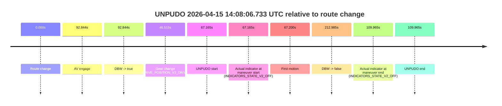
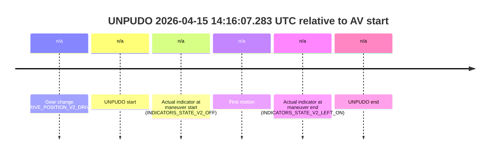
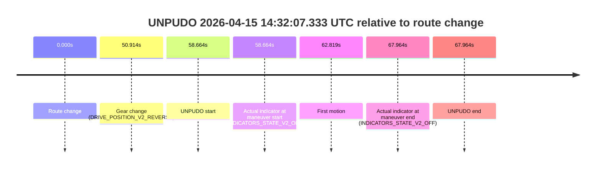
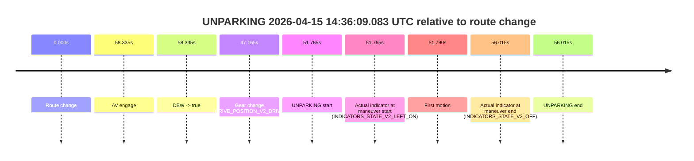

# Run Report: fme10005/2026-04-15--13-49-20--gen2-av-18761b48-3973-4ae3-aa56-7a75269c9832

| Field | Value |
|---|---|
| Run ID | `fme10005/2026-04-15--13-49-20--gen2-av-18761b48-3973-4ae3-aa56-7a75269c9832` |
| Date | `2026-04-15` |
| Model(s) | `plum-timeless-beaver` |
| Author | `peng.tang` |
| Event count | `5` |

## unpudo 2026-04-15 14:08:06.733 UTC

| Field | Value |
|---|---|
| Model | `plum-timeless-beaver` |
| Author | `peng.tang` |
| Run ID | `fme10005/2026-04-15--13-49-20--gen2-av-18761b48-3973-4ae3-aa56-7a75269c9832` |
| Date | `2026-04-15` |
| Time (UTC) | `14:08:06.733` |
| Event type | `unpudo` |
| Disengagement type | `failed_to_unpudo` |
| Route change | `found` |
| Console | [run](https://console.sso.wayve.ai/run/fme10005/2026-04-15--13-49-20--gen2-av-18761b48-3973-4ae3-aa56-7a75269c9832?id=&time-unixus=1776262086733299) |
| Foxglove | [segment](https://app.foxglove.dev/wayve-on-prem/p/prj_0dX18KZdVHg1fmmI/view?ds=foxglove-stream&ds.deviceName=fme10005&ds.start=2026-04-15T14%3A06%3A49.568343Z&ds.end=2026-04-15T14%3A10%3A42.553033Z&layoutId=lay_0e7VD4WIKDQGU73Y&time=2026-04-15T14%3A08%3A06.733299Z) |

### Event card: non-av

- Non-AV: the detected unpudo starts outside AV ownership, so it is kept for coverage but excluded from model success / failure scoring.

| Event | Time (UTC) | Delta from route change |
|---|---:|---:|
| Route change | 2026-04-15 14:06:59.568 | `0.000s` |
| AV engage | 2026-04-15 14:08:32.411 | `92.844s` |
| DBW -> true | 2026-04-15 14:08:32.411 | `92.844s` |
| Gear change (DRIVE_POSITION_V2_DRIVE) | 2026-04-15 14:07:46.083 | `46.515s` |
| UNPUDO start | 2026-04-15 14:08:06.733 | `67.165s` |
| Actual indicator at maneuver start (INDICATORS_STATE_V2_OFF) | 2026-04-15 14:08:06.733 | `67.165s` |
| First motion | 2026-04-15 14:08:06.768 | `67.200s` |
| DBW -> false | 2026-04-15 14:10:32.553 | `212.985s` |
| Actual indicator at maneuver end (INDICATORS_STATE_V2_OFF) | 2026-04-15 14:08:49.533 | `109.965s` |
| UNPUDO end | 2026-04-15 14:08:49.533 | `109.965s` |

| Metric | Value |
|---|---|
| Outcome | `non-av` |
| Effective failure type | `none` |
| Route change status | `found` |
| DBW at event start | `false` |
| DBW at event end | `true` |
| Predicted gear at AV start | `DRIVE_POSITION_V2_DRIVE` |
| Actual gear at AV start | `DRIVE_POSITION_V2_DRIVE` |
| Predicted gear at event start | `DRIVE_POSITION_V2_DRIVE` |
| Actual gear at event start | `DRIVE_POSITION_V2_DRIVE` |
| Planned indicator direction | `INDICATORS_STATE_V2_OFF` |
| Controller indicator direction | `INDICATORS_STATE_V2_OFF` |
| Actual indicator direction | `INDICATORS_STATE_V2_OFF` |
| Actual indicator at maneuver end | `INDICATORS_STATE_V2_OFF` |
| Driver accel help in AV | `false` |
| Driver accel help timestamp | `n/a` |
| Max accel pedal pct in AV | `0.0%` |
| Max brake pedal pct in AV | `0.0%` |
| Max speed mps in AV | `2.269` |
| Route -> AV | `92.844s` |
| AV -> event start | `-25.679s` |
| AV -> first motion | `-25.643s` |
| AV duration before disengagement | `120.141s` |
| Trajectory waypoint count | `36` |
| Driving-plan step count | `11` |

The scored portion starts from the AV-owned window, not from the pre-AV setup. Route-change search in the stopped pre-event segment was `found`, with the baseline therefore set to route change. At the event anchor the model predicts `DRIVE_POSITION_V2_DRIVE` and the actual gear is `DRIVE_POSITION_V2_DRIVE`. The effective model outcome is `non-av` because `the event does not begin in AV ownership`.

### Resolution

| Field | Value |
|---|---|
| Final outcome | `non-av` |
| Do we agree with this label? | `yes` |
| Source disengagement type | `failed_to_unpudo` |
| Resolved effective failure type | `none` |
| Confidence | `high` |

## unpudo 2026-04-15 14:10:33.133 UTC

| Field | Value |
|---|---|
| Model | `plum-timeless-beaver` |
| Author | `peng.tang` |
| Run ID | `fme10005/2026-04-15--13-49-20--gen2-av-18761b48-3973-4ae3-aa56-7a75269c9832` |
| Date | `2026-04-15` |
| Time (UTC) | `14:10:33.133` |
| Event type | `unpudo` |
| Disengagement type | `failed_to_unpudo` |
| Route change | `found` |
| Console | [run](https://console.sso.wayve.ai/run/fme10005/2026-04-15--13-49-20--gen2-av-18761b48-3973-4ae3-aa56-7a75269c9832?id=&time-unixus=1776262233133292) |
| Foxglove | [segment](https://app.foxglove.dev/wayve-on-prem/p/prj_0dX18KZdVHg1fmmI/view?ds=foxglove-stream&ds.deviceName=fme10005&ds.start=2026-04-15T14%3A09%3A33.318414Z&ds.end=2026-04-15T14%3A14%3A32.692497Z&layoutId=lay_0e7VD4WIKDQGU73Y&time=2026-04-15T14%3A10%3A33.133292Z) |

### Event card: accidental

- Accidental: AV ownership is present for less than `2s`, so this is treated as an accidental brush with the maneuver rather than a meaningful model attempt.

| Event | Time (UTC) | Delta from route change |
|---|---:|---:|
| Route change | 2026-04-15 14:09:43.318 | `0.000s` |
| AV engage | 2026-04-15 14:10:39.171 | `55.854s` |
| DBW -> true | 2026-04-15 14:10:39.171 | `55.854s` |
| Gear change (DRIVE_POSITION_V2_DRIVE) | 2026-04-15 14:10:21.583 | `38.265s` |
| UNPUDO start | 2026-04-15 14:10:33.133 | `49.815s` |
| Actual indicator at maneuver start (INDICATORS_STATE_V2_OFF) | 2026-04-15 14:10:33.133 | `49.815s` |
| First motion | 2026-04-15 14:10:33.188 | `49.870s` |
| DBW -> false | 2026-04-15 14:14:22.692 | `279.374s` |
| Actual indicator at maneuver end (INDICATORS_STATE_V2_OFF) | 2026-04-15 14:10:38.633 | `55.315s` |
| UNPUDO end | 2026-04-15 14:10:38.633 | `55.315s` |

| Metric | Value |
|---|---|
| Outcome | `accidental` |
| Effective failure type | `none` |
| Route change status | `found` |
| DBW at event start | `false` |
| DBW at event end | `false` |
| Predicted gear at AV start | `DRIVE_POSITION_V2_DRIVE` |
| Actual gear at AV start | `DRIVE_POSITION_V2_DRIVE` |
| Predicted gear at event start | `DRIVE_POSITION_V2_DRIVE` |
| Actual gear at event start | `DRIVE_POSITION_V2_DRIVE` |
| Planned indicator direction | `INDICATORS_STATE_V2_LEFT_ON` |
| Controller indicator direction | `INDICATORS_STATE_V2_LEFT_ON` |
| Actual indicator direction | `INDICATORS_STATE_V2_OFF` |
| Actual indicator at maneuver end | `INDICATORS_STATE_V2_OFF` |
| Driver accel help in AV | `false` |
| Driver accel help timestamp | `n/a` |
| Max accel pedal pct in AV | `0.0%` |
| Max brake pedal pct in AV | `0.0%` |
| Max speed mps in AV | `0.000` |
| Route -> AV | `55.854s` |
| AV -> event start | `-6.039s` |
| AV -> first motion | `-5.984s` |
| AV duration before disengagement | `223.521s` |
| Trajectory waypoint count | `36` |
| Driving-plan step count | `11` |

The scored portion starts from the AV-owned window, not from the pre-AV setup. Route-change search in the stopped pre-event segment was `found`, with the baseline therefore set to route change. At the event anchor the model predicts `DRIVE_POSITION_V2_DRIVE` and the actual gear is `DRIVE_POSITION_V2_DRIVE`. The effective model outcome is `accidental` because `the AV-owned portion is shorter than 2s`.

### Resolution

| Field | Value |
|---|---|
| Final outcome | `accidental` |
| Do we agree with this label? | `yes` |
| Source disengagement type | `failed_to_unpudo` |
| Resolved effective failure type | `none` |
| Confidence | `high` |

## unpudo 2026-04-15 14:16:07.283 UTC

| Field | Value |
|---|---|
| Model | `plum-timeless-beaver` |
| Author | `peng.tang` |
| Run ID | `fme10005/2026-04-15--13-49-20--gen2-av-18761b48-3973-4ae3-aa56-7a75269c9832` |
| Date | `2026-04-15` |
| Time (UTC) | `14:16:07.283` |
| Event type | `unpudo` |
| Disengagement type | `none observed` |
| Route change | `unclear` |
| Console | [run](https://console.sso.wayve.ai/run/fme10005/2026-04-15--13-49-20--gen2-av-18761b48-3973-4ae3-aa56-7a75269c9832?id=&time-unixus=1776262567283315) |
| Foxglove | [segment](https://app.foxglove.dev/wayve-on-prem/p/prj_0dX18KZdVHg1fmmI/view?ds=foxglove-stream&ds.deviceName=fme10005&ds.start=2026-04-15T14%3A15%3A55.883302Z&ds.end=2026-04-15T14%3A16%3A20.433291Z&layoutId=lay_0e7VD4WIKDQGU73Y&time=2026-04-15T14%3A16%3A07.283315Z) |

### Event card: non-av

- Non-AV: the detected unpudo starts outside AV ownership, so it is kept for coverage but excluded from model success / failure scoring.

| Event | Time (UTC) | Delta from AV start |
|---|---:|---:|
| Gear change (DRIVE_POSITION_V2_DRIVE) | 2026-04-15 14:16:05.883 | `n/a` |
| UNPUDO start | 2026-04-15 14:16:07.283 | `n/a` |
| Actual indicator at maneuver start (INDICATORS_STATE_V2_OFF) | 2026-04-15 14:16:07.283 | `n/a` |
| First motion | 2026-04-15 14:16:07.368 | `n/a` |
| Actual indicator at maneuver end (INDICATORS_STATE_V2_LEFT_ON) | 2026-04-15 14:16:10.433 | `n/a` |
| UNPUDO end | 2026-04-15 14:16:10.433 | `n/a` |

| Metric | Value |
|---|---|
| Outcome | `non-av` |
| Effective failure type | `none` |
| Route change status | `unclear` |
| DBW at event start | `false` |
| DBW at event end | `false` |
| Predicted gear at AV start | `n/a` |
| Actual gear at AV start | `n/a` |
| Predicted gear at event start | `DRIVE_POSITION_V2_DRIVE` |
| Actual gear at event start | `DRIVE_POSITION_V2_DRIVE` |
| Planned indicator direction | `INDICATORS_STATE_V2_OFF` |
| Controller indicator direction | `INDICATORS_STATE_V2_OFF` |
| Actual indicator direction | `INDICATORS_STATE_V2_OFF` |
| Actual indicator at maneuver end | `INDICATORS_STATE_V2_LEFT_ON` |
| Driver accel help in AV | `false` |
| Driver accel help timestamp | `n/a` |
| Max accel pedal pct in AV | `0.0%` |
| Max brake pedal pct in AV | `0.0%` |
| Max speed mps in AV | `0.000` |
| Route -> AV | `n/a` |
| AV -> event start | `n/a` |
| AV -> first motion | `n/a` |
| AV duration before disengagement | `n/a` |
| Trajectory waypoint count | `37` |
| Driving-plan step count | `11` |

The scored portion starts from the AV-owned window, not from the pre-AV setup. Route-change search in the stopped pre-event segment was `unclear`, with the baseline therefore set to AV start. At the event anchor the model predicts `DRIVE_POSITION_V2_DRIVE` and the actual gear is `DRIVE_POSITION_V2_DRIVE`. The effective model outcome is `non-av` because `the event does not begin in AV ownership`.

### Resolution

| Field | Value |
|---|---|
| Final outcome | `non-av` |
| Do we agree with this label? | `yes` |
| Source disengagement type | `none observed` |
| Resolved effective failure type | `none` |
| Confidence | `medium` |

## unpudo 2026-04-15 14:32:07.333 UTC

| Field | Value |
|---|---|
| Model | `plum-timeless-beaver` |
| Author | `peng.tang` |
| Run ID | `fme10005/2026-04-15--13-49-20--gen2-av-18761b48-3973-4ae3-aa56-7a75269c9832` |
| Date | `2026-04-15` |
| Time (UTC) | `14:32:07.333` |
| Event type | `unpudo` |
| Disengagement type | `failed_to_unpudo` |
| Route change | `found` |
| Console | [run](https://console.sso.wayve.ai/run/fme10005/2026-04-15--13-49-20--gen2-av-18761b48-3973-4ae3-aa56-7a75269c9832?id=&time-unixus=1776263527333311) |
| Foxglove | [segment](https://app.foxglove.dev/wayve-on-prem/p/prj_0dX18KZdVHg1fmmI/view?ds=foxglove-stream&ds.deviceName=fme10005&ds.start=2026-04-15T14%3A30%3A58.669180Z&ds.end=2026-04-15T14%3A32%3A26.633315Z&layoutId=lay_0e7VD4WIKDQGU73Y&time=2026-04-15T14%3A32%3A07.333311Z) |

### Event card: non-av

- Non-AV: the detected unpudo starts outside AV ownership, so it is kept for coverage but excluded from model success / failure scoring.

| Event | Time (UTC) | Delta from route change |
|---|---:|---:|
| Route change | 2026-04-15 14:31:08.669 | `0.000s` |
| Gear change (DRIVE_POSITION_V2_REVERSE) | 2026-04-15 14:31:59.583 | `50.914s` |
| UNPUDO start | 2026-04-15 14:32:07.333 | `58.664s` |
| Actual indicator at maneuver start (INDICATORS_STATE_V2_OFF) | 2026-04-15 14:32:07.333 | `58.664s` |
| First motion | 2026-04-15 14:32:11.488 | `62.819s` |
| Actual indicator at maneuver end (INDICATORS_STATE_V2_OFF) | 2026-04-15 14:32:16.633 | `67.964s` |
| UNPUDO end | 2026-04-15 14:32:16.633 | `67.964s` |

| Metric | Value |
|---|---|
| Outcome | `non-av` |
| Effective failure type | `none` |
| Route change status | `found` |
| DBW at event start | `false` |
| DBW at event end | `false` |
| Predicted gear at AV start | `n/a` |
| Actual gear at AV start | `n/a` |
| Predicted gear at event start | `DRIVE_POSITION_V2_REVERSE` |
| Actual gear at event start | `DRIVE_POSITION_V2_REVERSE` |
| Planned indicator direction | `INDICATORS_STATE_V2_OFF` |
| Controller indicator direction | `INDICATORS_STATE_V2_OFF` |
| Actual indicator direction | `INDICATORS_STATE_V2_OFF` |
| Actual indicator at maneuver end | `INDICATORS_STATE_V2_OFF` |
| Driver accel help in AV | `false` |
| Driver accel help timestamp | `n/a` |
| Max accel pedal pct in AV | `0.0%` |
| Max brake pedal pct in AV | `0.0%` |
| Max speed mps in AV | `0.000` |
| Route -> AV | `n/a` |
| AV -> event start | `n/a` |
| AV -> first motion | `n/a` |
| AV duration before disengagement | `n/a` |
| Trajectory waypoint count | `36` |
| Driving-plan step count | `11` |

The scored portion starts from the AV-owned window, not from the pre-AV setup. Route-change search in the stopped pre-event segment was `found`, with the baseline therefore set to route change. At the event anchor the model predicts `DRIVE_POSITION_V2_REVERSE` and the actual gear is `DRIVE_POSITION_V2_REVERSE`. The effective model outcome is `non-av` because `the event does not begin in AV ownership`.

### Resolution

| Field | Value |
|---|---|
| Final outcome | `non-av` |
| Do we agree with this label? | `yes` |
| Source disengagement type | `failed_to_unpudo` |
| Resolved effective failure type | `none` |
| Confidence | `high` |

## unparking 2026-04-15 14:36:09.083 UTC

| Field | Value |
|---|---|
| Model | `plum-timeless-beaver` |
| Author | `peng.tang` |
| Run ID | `fme10005/2026-04-15--13-49-20--gen2-av-18761b48-3973-4ae3-aa56-7a75269c9832` |
| Date | `2026-04-15` |
| Time (UTC) | `14:36:09.083` |
| Event type | `unparking` |
| Disengagement type | `failed_to_unpudo` |
| Route change | `found` |
| Console | [run](https://console.sso.wayve.ai/run/fme10005/2026-04-15--13-49-20--gen2-av-18761b48-3973-4ae3-aa56-7a75269c9832?id=&time-unixus=1776263769083314) |
| Foxglove | [segment](https://app.foxglove.dev/wayve-on-prem/p/prj_0dX18KZdVHg1fmmI/view?ds=foxglove-stream&ds.deviceName=fme10005&ds.start=2026-04-15T14%3A35%3A07.318259Z&ds.end=2026-04-15T14%3A36%3A23.333297Z&layoutId=lay_0e7VD4WIKDQGU73Y&time=2026-04-15T14%3A36%3A09.083314Z) |

### Event card: accidental

- Accidental: AV ownership is present for less than `2s`, so this is treated as an accidental brush with the maneuver rather than a meaningful model attempt.

| Event | Time (UTC) | Delta from route change |
|---|---:|---:|
| Route change | 2026-04-15 14:35:17.318 | `0.000s` |
| AV engage | 2026-04-15 14:36:15.653 | `58.335s` |
| DBW -> true | 2026-04-15 14:36:15.653 | `58.335s` |
| Gear change (DRIVE_POSITION_V2_DRIVE) | 2026-04-15 14:36:04.483 | `47.165s` |
| UNPARKING start | 2026-04-15 14:36:09.083 | `51.765s` |
| Actual indicator at maneuver start (INDICATORS_STATE_V2_LEFT_ON) | 2026-04-15 14:36:09.083 | `51.765s` |
| First motion | 2026-04-15 14:36:09.108 | `51.790s` |
| Actual indicator at maneuver end (INDICATORS_STATE_V2_OFF) | 2026-04-15 14:36:13.333 | `56.015s` |
| UNPARKING end | 2026-04-15 14:36:13.333 | `56.015s` |

| Metric | Value |
|---|---|
| Outcome | `accidental` |
| Effective failure type | `none` |
| Route change status | `found` |
| DBW at event start | `false` |
| DBW at event end | `false` |
| Predicted gear at AV start | `DRIVE_POSITION_V2_DRIVE` |
| Actual gear at AV start | `DRIVE_POSITION_V2_DRIVE` |
| Predicted gear at event start | `DRIVE_POSITION_V2_DRIVE` |
| Actual gear at event start | `DRIVE_POSITION_V2_DRIVE` |
| Planned indicator direction | `INDICATORS_STATE_V2_LEFT_ON` |
| Controller indicator direction | `INDICATORS_STATE_V2_LEFT_ON` |
| Actual indicator direction | `INDICATORS_STATE_V2_LEFT_ON` |
| Actual indicator at maneuver end | `INDICATORS_STATE_V2_OFF` |
| Driver accel help in AV | `false` |
| Driver accel help timestamp | `n/a` |
| Max accel pedal pct in AV | `0.0%` |
| Max brake pedal pct in AV | `0.0%` |
| Max speed mps in AV | `0.000` |
| Route -> AV | `58.335s` |
| AV -> event start | `-6.570s` |
| AV -> first motion | `-6.545s` |
| AV duration before disengagement | `n/a` |
| Trajectory waypoint count | `37` |
| Driving-plan step count | `11` |

The scored portion starts from the AV-owned window, not from the pre-AV setup. Route-change search in the stopped pre-event segment was `found`, with the baseline therefore set to route change. At the event anchor the model predicts `DRIVE_POSITION_V2_DRIVE` and the actual gear is `DRIVE_POSITION_V2_DRIVE`. The effective model outcome is `accidental` because `the AV-owned portion is shorter than 2s`.

### Resolution

| Field | Value |
|---|---|
| Final outcome | `accidental` |
| Do we agree with this label? | `yes` |
| Source disengagement type | `failed_to_unpudo` |
| Resolved effective failure type | `none` |
| Confidence | `high` |
