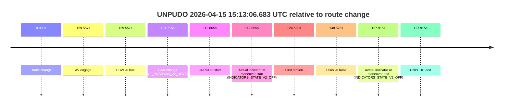
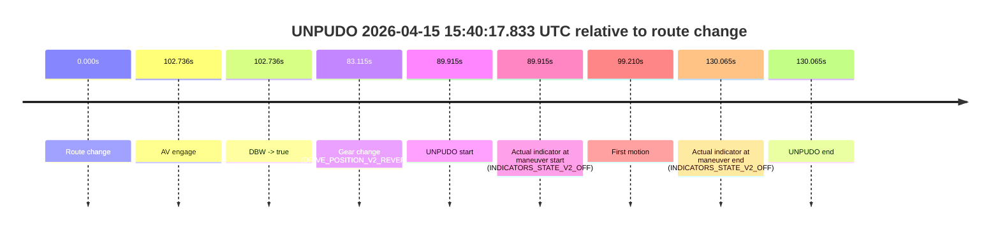

# Run Report: fme10005/2026-04-15--14-53-09--gen2-av-ce7e4658-34b1-479e-b9a0-7ebd6e630806

| Field | Value |
|---|---|
| Run ID | `fme10005/2026-04-15--14-53-09--gen2-av-ce7e4658-34b1-479e-b9a0-7ebd6e630806` |
| Date | `2026-04-15` |
| Model(s) | `plum-timeless-beaver` |
| Author | `peng.tang` |
| Event count | `2` |

## unpudo 2026-04-15 15:13:06.683 UTC

| Field | Value |
|---|---|
| Model | `plum-timeless-beaver` |
| Author | `peng.tang` |
| Run ID | `fme10005/2026-04-15--14-53-09--gen2-av-ce7e4658-34b1-479e-b9a0-7ebd6e630806` |
| Date | `2026-04-15` |
| Time (UTC) | `15:13:06.683` |
| Event type | `unpudo` |
| Disengagement type | `failed_to_unpudo` |
| Route change | `found` |
| Console | [run](https://console.sso.wayve.ai/run/fme10005/2026-04-15--14-53-09--gen2-av-ce7e4658-34b1-479e-b9a0-7ebd6e630806?id=&time-unixus=1776265986683295) |
| Foxglove | [segment](https://app.foxglove.dev/wayve-on-prem/p/prj_0dX18KZdVHg1fmmI/view?ds=foxglove-stream&ds.deviceName=fme10005&ds.start=2026-04-15T15%3A11%3A03.818232Z&ds.end=2026-04-15T15%3A13%3A52.394082Z&layoutId=lay_0e7VD4WIKDQGU73Y&time=2026-04-15T15%3A13%3A06.683295Z) |

### Event card: accidental

- Accidental: AV ownership is present for less than `2s`, so this is treated as an accidental brush with the maneuver rather than a meaningful model attempt.

| Event | Time (UTC) | Delta from route change |
|---|---:|---:|
| Route change | 2026-04-15 15:11:13.818 | `0.000s` |
| AV engage | 2026-04-15 15:13:23.375 | `129.557s` |
| DBW -> true | 2026-04-15 15:13:23.375 | `129.557s` |
| Gear change (DRIVE_POSITION_V2_REVERSE) | 2026-04-15 15:12:58.533 | `104.715s` |
| UNPUDO start | 2026-04-15 15:13:06.683 | `112.865s` |
| Actual indicator at maneuver start (INDICATORS_STATE_V2_OFF) | 2026-04-15 15:13:06.683 | `112.865s` |
| First motion | 2026-04-15 15:13:18.408 | `124.590s` |
| DBW -> false | 2026-04-15 15:13:42.394 | `148.576s` |
| Actual indicator at maneuver end (INDICATORS_STATE_V2_OFF) | 2026-04-15 15:13:21.733 | `127.915s` |
| UNPUDO end | 2026-04-15 15:13:21.733 | `127.915s` |

| Metric | Value |
|---|---|
| Outcome | `accidental` |
| Effective failure type | `none` |
| Route change status | `found` |
| DBW at event start | `false` |
| DBW at event end | `false` |
| Predicted gear at AV start | `DRIVE_POSITION_V2_DRIVE` |
| Actual gear at AV start | `DRIVE_POSITION_V2_DRIVE` |
| Predicted gear at event start | `DRIVE_POSITION_V2_REVERSE` |
| Actual gear at event start | `DRIVE_POSITION_V2_REVERSE` |
| Planned indicator direction | `INDICATORS_STATE_V2_OFF` |
| Controller indicator direction | `INDICATORS_STATE_V2_OFF` |
| Actual indicator direction | `INDICATORS_STATE_V2_OFF` |
| Actual indicator at maneuver end | `INDICATORS_STATE_V2_OFF` |
| Driver accel help in AV | `false` |
| Driver accel help timestamp | `n/a` |
| Max accel pedal pct in AV | `0.0%` |
| Max brake pedal pct in AV | `0.0%` |
| Max speed mps in AV | `0.000` |
| Route -> AV | `129.557s` |
| AV -> event start | `-16.692s` |
| AV -> first motion | `-4.967s` |
| AV duration before disengagement | `19.019s` |
| Trajectory waypoint count | `37` |
| Driving-plan step count | `11` |

The scored portion starts from the AV-owned window, not from the pre-AV setup. Route-change search in the stopped pre-event segment was `found`, with the baseline therefore set to route change. At the event anchor the model predicts `DRIVE_POSITION_V2_REVERSE` and the actual gear is `DRIVE_POSITION_V2_REVERSE`. The effective model outcome is `accidental` because `the AV-owned portion is shorter than 2s`.

### Resolution

| Field | Value |
|---|---|
| Final outcome | `accidental` |
| Do we agree with this label? | `yes` |
| Source disengagement type | `failed_to_unpudo` |
| Resolved effective failure type | `none` |
| Confidence | `high` |

## unpudo 2026-04-15 15:40:17.833 UTC

| Field | Value |
|---|---|
| Model | `plum-timeless-beaver` |
| Author | `peng.tang` |
| Run ID | `fme10005/2026-04-15--14-53-09--gen2-av-ce7e4658-34b1-479e-b9a0-7ebd6e630806` |
| Date | `2026-04-15` |
| Time (UTC) | `15:40:17.833` |
| Event type | `unpudo` |
| Disengagement type | `failed_to_unpudo` |
| Route change | `found` |
| Console | [run](https://console.sso.wayve.ai/run/fme10005/2026-04-15--14-53-09--gen2-av-ce7e4658-34b1-479e-b9a0-7ebd6e630806?id=&time-unixus=1776267617833316) |
| Foxglove | [segment](https://app.foxglove.dev/wayve-on-prem/p/prj_0dX18KZdVHg1fmmI/view?ds=foxglove-stream&ds.deviceName=fme10005&ds.start=2026-04-15T15%3A38%3A37.918235Z&ds.end=2026-04-15T15%3A41%3A07.983306Z&layoutId=lay_0e7VD4WIKDQGU73Y&time=2026-04-15T15%3A40%3A17.833316Z) |

### Event card: non-av

- Non-AV: the detected unpudo starts outside AV ownership, so it is kept for coverage but excluded from model success / failure scoring.

| Event | Time (UTC) | Delta from route change |
|---|---:|---:|
| Route change | 2026-04-15 15:38:47.918 | `0.000s` |
| AV engage | 2026-04-15 15:40:30.654 | `102.736s` |
| DBW -> true | 2026-04-15 15:40:30.654 | `102.736s` |
| Gear change (DRIVE_POSITION_V2_REVERSE) | 2026-04-15 15:40:11.033 | `83.115s` |
| UNPUDO start | 2026-04-15 15:40:17.833 | `89.915s` |
| Actual indicator at maneuver start (INDICATORS_STATE_V2_OFF) | 2026-04-15 15:40:17.833 | `89.915s` |
| First motion | 2026-04-15 15:40:27.128 | `99.210s` |
| Actual indicator at maneuver end (INDICATORS_STATE_V2_OFF) | 2026-04-15 15:40:57.983 | `130.065s` |
| UNPUDO end | 2026-04-15 15:40:57.983 | `130.065s` |

| Metric | Value |
|---|---|
| Outcome | `non-av` |
| Effective failure type | `none` |
| Route change status | `found` |
| DBW at event start | `false` |
| DBW at event end | `true` |
| Predicted gear at AV start | `DRIVE_POSITION_V2_DRIVE` |
| Actual gear at AV start | `DRIVE_POSITION_V2_DRIVE` |
| Predicted gear at event start | `DRIVE_POSITION_V2_REVERSE` |
| Actual gear at event start | `DRIVE_POSITION_V2_REVERSE` |
| Planned indicator direction | `INDICATORS_STATE_V2_OFF` |
| Controller indicator direction | `INDICATORS_STATE_V2_OFF` |
| Actual indicator direction | `INDICATORS_STATE_V2_OFF` |
| Actual indicator at maneuver end | `INDICATORS_STATE_V2_OFF` |
| Driver accel help in AV | `false` |
| Driver accel help timestamp | `n/a` |
| Max accel pedal pct in AV | `0.0%` |
| Max brake pedal pct in AV | `0.0%` |
| Max speed mps in AV | `2.050` |
| Route -> AV | `102.736s` |
| AV -> event start | `-12.821s` |
| AV -> first motion | `-3.526s` |
| AV duration before disengagement | `n/a` |
| Trajectory waypoint count | `36` |
| Driving-plan step count | `11` |

The scored portion starts from the AV-owned window, not from the pre-AV setup. Route-change search in the stopped pre-event segment was `found`, with the baseline therefore set to route change. At the event anchor the model predicts `DRIVE_POSITION_V2_REVERSE` and the actual gear is `DRIVE_POSITION_V2_REVERSE`. The effective model outcome is `non-av` because `the event does not begin in AV ownership`.

### Resolution

| Field | Value |
|---|---|
| Final outcome | `non-av` |
| Do we agree with this label? | `yes` |
| Source disengagement type | `failed_to_unpudo` |
| Resolved effective failure type | `none` |
| Confidence | `high` |
