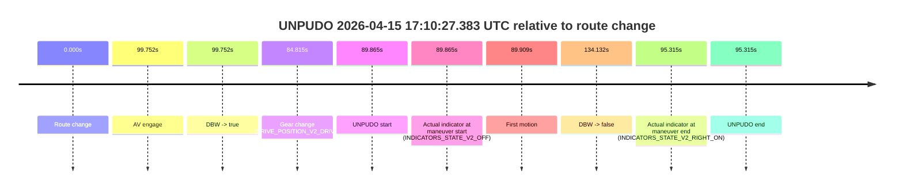
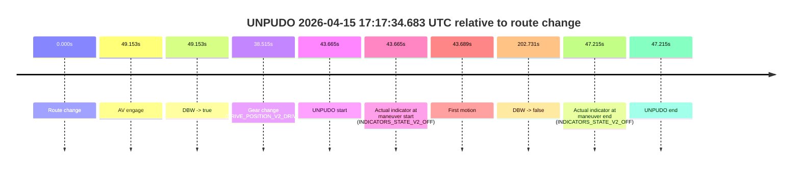
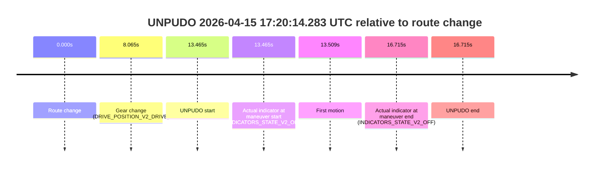
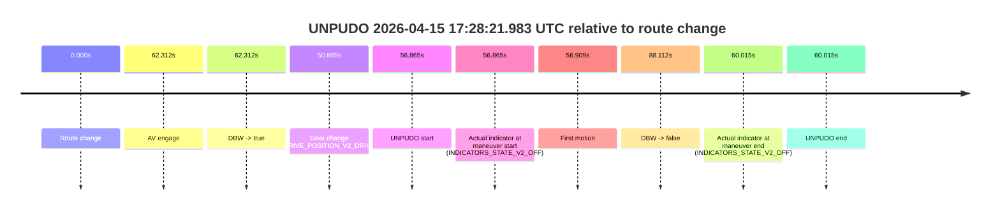
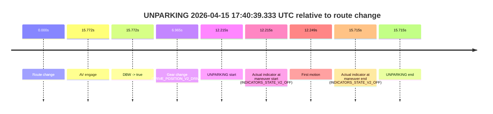

# Run Report: fme10005/2026-04-15--16-37-23--gen2-av-8a26619d-7461-43e5-923f-1c2927d12d24

| Field | Value |
|---|---|
| Run ID | `fme10005/2026-04-15--16-37-23--gen2-av-8a26619d-7461-43e5-923f-1c2927d12d24` |
| Date | `2026-04-15` |
| Model(s) | `apricot-crocodile-uproarious` |
| Author | `guy.geva` |
| Event count | `9` |

## unpudo 2026-04-15 16:48:24.483 UTC

| Field | Value |
|---|---|
| Model | `apricot-crocodile-uproarious` |
| Author | `guy.geva` |
| Run ID | `fme10005/2026-04-15--16-37-23--gen2-av-8a26619d-7461-43e5-923f-1c2927d12d24` |
| Date | `2026-04-15` |
| Time (UTC) | `16:48:24.483` |
| Event type | `unpudo` |
| Disengagement type | `failed_to_unpudo` |
| Route change | `found` |
| Console | [run](https://console.sso.wayve.ai/run/fme10005/2026-04-15--16-37-23--gen2-av-8a26619d-7461-43e5-923f-1c2927d12d24?id=&time-unixus=1776271704483316) |
| Foxglove | [segment](https://app.foxglove.dev/wayve-on-prem/p/prj_0dX18KZdVHg1fmmI/view?ds=foxglove-stream&ds.deviceName=fme10005&ds.start=2026-04-15T16%3A47%3A23.918282Z&ds.end=2026-04-15T16%3A59%3A02.490669Z&layoutId=lay_0e7VD4WIKDQGU73Y&time=2026-04-15T16%3A48%3A24.483316Z) |

### Event card: non-av

- Non-AV: there is no AV-owned portion anywhere inside the detected unpudo timeline, so it is kept for coverage but excluded from model success / failure scoring.

| Event | Time (UTC) | Delta from route change |
|---|---:|---:|
| Route change | 2026-04-15 16:47:33.918 | `0.000s` |
| AV engage | 2026-04-15 16:48:30.511 | `56.593s` |
| DBW -> true | 2026-04-15 16:48:30.511 | `56.593s` |
| Gear change (DRIVE_POSITION_V2_DRIVE) | 2026-04-15 16:48:19.733 | `45.815s` |
| UNPUDO start | 2026-04-15 16:48:24.483 | `50.565s` |
| Actual indicator at maneuver start (INDICATORS_STATE_V2_OFF) | 2026-04-15 16:48:24.483 | `50.565s` |
| First motion | 2026-04-15 16:48:24.526 | `50.609s` |
| DBW -> false | 2026-04-15 16:58:52.490 | `678.572s` |
| Actual indicator at maneuver end (INDICATORS_STATE_V2_OFF) | 2026-04-15 16:48:28.533 | `54.615s` |
| UNPUDO end | 2026-04-15 16:48:28.533 | `54.615s` |

| Metric | Value |
|---|---|
| Outcome | `non-av` |
| Effective failure type | `none` |
| Route change status | `found` |
| DBW at event start | `false` |
| DBW at event end | `false` |
| Predicted gear at AV start | `DRIVE_POSITION_V2_DRIVE` |
| Actual gear at AV start | `DRIVE_POSITION_V2_DRIVE` |
| Predicted gear at event start | `DRIVE_POSITION_V2_DRIVE` |
| Actual gear at event start | `DRIVE_POSITION_V2_DRIVE` |
| Planned indicator direction | `INDICATORS_STATE_V2_RIGHT_ON` |
| Controller indicator direction | `INDICATORS_STATE_V2_RIGHT_ON` |
| Actual indicator direction | `INDICATORS_STATE_V2_OFF` |
| Actual indicator at maneuver end | `INDICATORS_STATE_V2_OFF` |
| Driver accel help in AV | `false` |
| Driver accel help timestamp | `n/a` |
| Max accel pedal pct in AV | `0.0%` |
| Max brake pedal pct in AV | `0.0%` |
| Max speed mps in AV | `0.000` |
| Route -> AV | `56.593s` |
| AV -> event start | `-6.028s` |
| AV -> first motion | `-5.984s` |
| AV duration before disengagement | `621.979s` |
| Trajectory waypoint count | `37` |
| Driving-plan step count | `11` |

The scored portion starts from the AV-owned window, not from the pre-AV setup. Route-change search in the stopped pre-event segment was `found`, with the baseline therefore set to route change. At the event anchor the model predicts `DRIVE_POSITION_V2_DRIVE` and the actual gear is `DRIVE_POSITION_V2_DRIVE`. The effective model outcome is `non-av` because `there is no AV-owned overlap inside the event timeline`.

### Resolution

| Field | Value |
|---|---|
| Final outcome | `non-av` |
| Do we agree with this label? | `yes` |
| Source disengagement type | `failed_to_unpudo` |
| Resolved effective failure type | `none` |
| Confidence | `high` |

## unpudo 2026-04-15 16:59:56.083 UTC

| Field | Value |
|---|---|
| Model | `apricot-crocodile-uproarious` |
| Author | `guy.geva` |
| Run ID | `fme10005/2026-04-15--16-37-23--gen2-av-8a26619d-7461-43e5-923f-1c2927d12d24` |
| Date | `2026-04-15` |
| Time (UTC) | `16:59:56.083` |
| Event type | `unpudo` |
| Disengagement type | `failed_to_unpudo` |
| Route change | `found` |
| Console | [run](https://console.sso.wayve.ai/run/fme10005/2026-04-15--16-37-23--gen2-av-8a26619d-7461-43e5-923f-1c2927d12d24?id=&time-unixus=1776272396083297) |
| Foxglove | [segment](https://app.foxglove.dev/wayve-on-prem/p/prj_0dX18KZdVHg1fmmI/view?ds=foxglove-stream&ds.deviceName=fme10005&ds.start=2026-04-15T16%3A59%3A27.918310Z&ds.end=2026-04-15T17%3A00%3A29.933317Z&layoutId=lay_0e7VD4WIKDQGU73Y&time=2026-04-15T16%3A59%3A56.083297Z) |

### Event card: fail

- Fail: AV owns part of the segment, but the event still resolves as a model-performance failure under the AV-only scoring rule.

| Event | Time (UTC) | Delta from route change |
|---|---:|---:|
| Route change | 2026-04-15 16:59:37.918 | `0.000s` |
| AV engage | 2026-04-15 17:00:06.871 | `28.953s` |
| DBW -> true | 2026-04-15 17:00:06.871 | `28.953s` |
| Gear change (DRIVE_POSITION_V2_REVERSE) | 2026-04-15 16:59:46.833 | `8.915s` |
| UNPUDO start | 2026-04-15 16:59:56.083 | `18.165s` |
| Actual indicator at maneuver start (INDICATORS_STATE_V2_OFF) | 2026-04-15 16:59:56.083 | `18.165s` |
| First motion | 2026-04-15 16:59:59.746 | `21.829s` |
| DBW -> false | 2026-04-15 17:00:11.651 | `33.733s` |
| Actual indicator at maneuver end (INDICATORS_STATE_V2_RIGHT_ON) | 2026-04-15 17:00:19.933 | `42.015s` |
| UNPUDO end | 2026-04-15 17:00:19.933 | `42.015s` |

| Metric | Value |
|---|---|
| Outcome | `fail` |
| Effective failure type | `failed_to_unpudo` |
| Route change status | `found` |
| DBW at event start | `false` |
| DBW at event end | `false` |
| Predicted gear at AV start | `DRIVE_POSITION_V2_DRIVE` |
| Actual gear at AV start | `DRIVE_POSITION_V2_DRIVE` |
| Predicted gear at event start | `DRIVE_POSITION_V2_REVERSE` |
| Actual gear at event start | `DRIVE_POSITION_V2_REVERSE` |
| Planned indicator direction | `INDICATORS_STATE_V2_OFF` |
| Controller indicator direction | `INDICATORS_STATE_V2_OFF` |
| Actual indicator direction | `INDICATORS_STATE_V2_OFF` |
| Actual indicator at maneuver end | `INDICATORS_STATE_V2_RIGHT_ON` |
| Driver accel help in AV | `false` |
| Driver accel help timestamp | `n/a` |
| Max accel pedal pct in AV | `0.0%` |
| Max brake pedal pct in AV | `0.0%` |
| Max speed mps in AV | `1.803` |
| Route -> AV | `28.953s` |
| AV -> event start | `-10.788s` |
| AV -> first motion | `-7.124s` |
| AV duration before disengagement | `4.780s` |
| Trajectory waypoint count | `37` |
| Driving-plan step count | `11` |

The scored portion starts from the AV-owned window, not from the pre-AV setup. Route-change search in the stopped pre-event segment was `found`, with the baseline therefore set to route change. At the event anchor the model predicts `DRIVE_POSITION_V2_REVERSE` and the actual gear is `DRIVE_POSITION_V2_REVERSE`. The effective model outcome is `fail` because `failed_to_unpudo`.

### Resolution

| Field | Value |
|---|---|
| Final outcome | `fail` |
| Do we agree with this label? | `yes` |
| Source disengagement type | `failed_to_unpudo` |
| Resolved effective failure type | `failed_to_unpudo` |
| Confidence | `high` |

## unpudo 2026-04-15 17:10:27.383 UTC

| Field | Value |
|---|---|
| Model | `apricot-crocodile-uproarious` |
| Author | `guy.geva` |
| Run ID | `fme10005/2026-04-15--16-37-23--gen2-av-8a26619d-7461-43e5-923f-1c2927d12d24` |
| Date | `2026-04-15` |
| Time (UTC) | `17:10:27.383` |
| Event type | `unpudo` |
| Disengagement type | `failed_to_unpudo` |
| Route change | `found` |
| Console | [run](https://console.sso.wayve.ai/run/fme10005/2026-04-15--16-37-23--gen2-av-8a26619d-7461-43e5-923f-1c2927d12d24?id=&time-unixus=1776273027383322) |
| Foxglove | [segment](https://app.foxglove.dev/wayve-on-prem/p/prj_0dX18KZdVHg1fmmI/view?ds=foxglove-stream&ds.deviceName=fme10005&ds.start=2026-04-15T17%3A08%3A47.518247Z&ds.end=2026-04-15T17%3A11%3A21.650284Z&layoutId=lay_0e7VD4WIKDQGU73Y&time=2026-04-15T17%3A10%3A27.383322Z) |

### Event card: non-av

- Non-AV: there is no AV-owned portion anywhere inside the detected unpudo timeline, so it is kept for coverage but excluded from model success / failure scoring.

| Event | Time (UTC) | Delta from route change |
|---|---:|---:|
| Route change | 2026-04-15 17:08:57.518 | `0.000s` |
| AV engage | 2026-04-15 17:10:37.270 | `99.752s` |
| DBW -> true | 2026-04-15 17:10:37.270 | `99.752s` |
| Gear change (DRIVE_POSITION_V2_DRIVE) | 2026-04-15 17:10:22.333 | `84.815s` |
| UNPUDO start | 2026-04-15 17:10:27.383 | `89.865s` |
| Actual indicator at maneuver start (INDICATORS_STATE_V2_OFF) | 2026-04-15 17:10:27.383 | `89.865s` |
| First motion | 2026-04-15 17:10:27.426 | `89.909s` |
| DBW -> false | 2026-04-15 17:11:11.650 | `134.132s` |
| Actual indicator at maneuver end (INDICATORS_STATE_V2_RIGHT_ON) | 2026-04-15 17:10:32.833 | `95.315s` |
| UNPUDO end | 2026-04-15 17:10:32.833 | `95.315s` |

| Metric | Value |
|---|---|
| Outcome | `non-av` |
| Effective failure type | `none` |
| Route change status | `found` |
| DBW at event start | `false` |
| DBW at event end | `false` |
| Predicted gear at AV start | `DRIVE_POSITION_V2_DRIVE` |
| Actual gear at AV start | `DRIVE_POSITION_V2_DRIVE` |
| Predicted gear at event start | `DRIVE_POSITION_V2_DRIVE` |
| Actual gear at event start | `DRIVE_POSITION_V2_DRIVE` |
| Planned indicator direction | `INDICATORS_STATE_V2_OFF` |
| Controller indicator direction | `INDICATORS_STATE_V2_OFF` |
| Actual indicator direction | `INDICATORS_STATE_V2_OFF` |
| Actual indicator at maneuver end | `INDICATORS_STATE_V2_RIGHT_ON` |
| Driver accel help in AV | `false` |
| Driver accel help timestamp | `n/a` |
| Max accel pedal pct in AV | `0.0%` |
| Max brake pedal pct in AV | `0.0%` |
| Max speed mps in AV | `0.000` |
| Route -> AV | `99.752s` |
| AV -> event start | `-9.887s` |
| AV -> first motion | `-9.843s` |
| AV duration before disengagement | `34.380s` |
| Trajectory waypoint count | `37` |
| Driving-plan step count | `11` |

The scored portion starts from the AV-owned window, not from the pre-AV setup. Route-change search in the stopped pre-event segment was `found`, with the baseline therefore set to route change. At the event anchor the model predicts `DRIVE_POSITION_V2_DRIVE` and the actual gear is `DRIVE_POSITION_V2_DRIVE`. The effective model outcome is `non-av` because `there is no AV-owned overlap inside the event timeline`.

### Resolution

| Field | Value |
|---|---|
| Final outcome | `non-av` |
| Do we agree with this label? | `yes` |
| Source disengagement type | `failed_to_unpudo` |
| Resolved effective failure type | `none` |
| Confidence | `high` |

## unpudo 2026-04-15 17:17:34.683 UTC

| Field | Value |
|---|---|
| Model | `apricot-crocodile-uproarious` |
| Author | `guy.geva` |
| Run ID | `fme10005/2026-04-15--16-37-23--gen2-av-8a26619d-7461-43e5-923f-1c2927d12d24` |
| Date | `2026-04-15` |
| Time (UTC) | `17:17:34.683` |
| Event type | `unpudo` |
| Disengagement type | `failed_to_unpudo` |
| Route change | `found` |
| Console | [run](https://console.sso.wayve.ai/run/fme10005/2026-04-15--16-37-23--gen2-av-8a26619d-7461-43e5-923f-1c2927d12d24?id=&time-unixus=1776273454683314) |
| Foxglove | [segment](https://app.foxglove.dev/wayve-on-prem/p/prj_0dX18KZdVHg1fmmI/view?ds=foxglove-stream&ds.deviceName=fme10005&ds.start=2026-04-15T17%3A16%3A41.018229Z&ds.end=2026-04-15T17%3A20%3A23.749459Z&layoutId=lay_0e7VD4WIKDQGU73Y&time=2026-04-15T17%3A17%3A34.683314Z) |

### Event card: non-av

- Non-AV: there is no AV-owned portion anywhere inside the detected unpudo timeline, so it is kept for coverage but excluded from model success / failure scoring.

| Event | Time (UTC) | Delta from route change |
|---|---:|---:|
| Route change | 2026-04-15 17:16:51.018 | `0.000s` |
| AV engage | 2026-04-15 17:17:40.171 | `49.153s` |
| DBW -> true | 2026-04-15 17:17:40.171 | `49.153s` |
| Gear change (DRIVE_POSITION_V2_DRIVE) | 2026-04-15 17:17:29.533 | `38.515s` |
| UNPUDO start | 2026-04-15 17:17:34.683 | `43.665s` |
| Actual indicator at maneuver start (INDICATORS_STATE_V2_OFF) | 2026-04-15 17:17:34.683 | `43.665s` |
| First motion | 2026-04-15 17:17:34.707 | `43.689s` |
| DBW -> false | 2026-04-15 17:20:13.749 | `202.731s` |
| Actual indicator at maneuver end (INDICATORS_STATE_V2_OFF) | 2026-04-15 17:17:38.233 | `47.215s` |
| UNPUDO end | 2026-04-15 17:17:38.233 | `47.215s` |

| Metric | Value |
|---|---|
| Outcome | `non-av` |
| Effective failure type | `none` |
| Route change status | `found` |
| DBW at event start | `false` |
| DBW at event end | `false` |
| Predicted gear at AV start | `DRIVE_POSITION_V2_DRIVE` |
| Actual gear at AV start | `DRIVE_POSITION_V2_DRIVE` |
| Predicted gear at event start | `DRIVE_POSITION_V2_DRIVE` |
| Actual gear at event start | `DRIVE_POSITION_V2_DRIVE` |
| Planned indicator direction | `INDICATORS_STATE_V2_LEFT_ON` |
| Controller indicator direction | `INDICATORS_STATE_V2_LEFT_ON` |
| Actual indicator direction | `INDICATORS_STATE_V2_OFF` |
| Actual indicator at maneuver end | `INDICATORS_STATE_V2_OFF` |
| Driver accel help in AV | `false` |
| Driver accel help timestamp | `n/a` |
| Max accel pedal pct in AV | `0.0%` |
| Max brake pedal pct in AV | `0.0%` |
| Max speed mps in AV | `0.000` |
| Route -> AV | `49.153s` |
| AV -> event start | `-5.488s` |
| AV -> first motion | `-5.464s` |
| AV duration before disengagement | `153.578s` |
| Trajectory waypoint count | `37` |
| Driving-plan step count | `11` |

The scored portion starts from the AV-owned window, not from the pre-AV setup. Route-change search in the stopped pre-event segment was `found`, with the baseline therefore set to route change. At the event anchor the model predicts `DRIVE_POSITION_V2_DRIVE` and the actual gear is `DRIVE_POSITION_V2_DRIVE`. The effective model outcome is `non-av` because `there is no AV-owned overlap inside the event timeline`.

### Resolution

| Field | Value |
|---|---|
| Final outcome | `non-av` |
| Do we agree with this label? | `yes` |
| Source disengagement type | `failed_to_unpudo` |
| Resolved effective failure type | `none` |
| Confidence | `high` |

## unpudo 2026-04-15 17:20:14.283 UTC

| Field | Value |
|---|---|
| Model | `apricot-crocodile-uproarious` |
| Author | `guy.geva` |
| Run ID | `fme10005/2026-04-15--16-37-23--gen2-av-8a26619d-7461-43e5-923f-1c2927d12d24` |
| Date | `2026-04-15` |
| Time (UTC) | `17:20:14.283` |
| Event type | `unpudo` |
| Disengagement type | `failed_to_unpudo` |
| Route change | `found` |
| Console | [run](https://console.sso.wayve.ai/run/fme10005/2026-04-15--16-37-23--gen2-av-8a26619d-7461-43e5-923f-1c2927d12d24?id=&time-unixus=1776273614283310) |
| Foxglove | [segment](https://app.foxglove.dev/wayve-on-prem/p/prj_0dX18KZdVHg1fmmI/view?ds=foxglove-stream&ds.deviceName=fme10005&ds.start=2026-04-15T17%3A19%3A50.818261Z&ds.end=2026-04-15T17%3A20%3A27.533299Z&layoutId=lay_0e7VD4WIKDQGU73Y&time=2026-04-15T17%3A20%3A14.283310Z) |

### Event card: non-av

- Non-AV: there is no AV-owned portion anywhere inside the detected unpudo timeline, so it is kept for coverage but excluded from model success / failure scoring.

| Event | Time (UTC) | Delta from route change |
|---|---:|---:|
| Route change | 2026-04-15 17:20:00.818 | `0.000s` |
| Gear change (DRIVE_POSITION_V2_DRIVE) | 2026-04-15 17:20:08.883 | `8.065s` |
| UNPUDO start | 2026-04-15 17:20:14.283 | `13.465s` |
| Actual indicator at maneuver start (INDICATORS_STATE_V2_OFF) | 2026-04-15 17:20:14.283 | `13.465s` |
| First motion | 2026-04-15 17:20:14.327 | `13.509s` |
| Actual indicator at maneuver end (INDICATORS_STATE_V2_OFF) | 2026-04-15 17:20:17.533 | `16.715s` |
| UNPUDO end | 2026-04-15 17:20:17.533 | `16.715s` |

| Metric | Value |
|---|---|
| Outcome | `non-av` |
| Effective failure type | `none` |
| Route change status | `found` |
| DBW at event start | `false` |
| DBW at event end | `false` |
| Predicted gear at AV start | `n/a` |
| Actual gear at AV start | `n/a` |
| Predicted gear at event start | `DRIVE_POSITION_V2_DRIVE` |
| Actual gear at event start | `DRIVE_POSITION_V2_DRIVE` |
| Planned indicator direction | `INDICATORS_STATE_V2_OFF` |
| Controller indicator direction | `INDICATORS_STATE_V2_OFF` |
| Actual indicator direction | `INDICATORS_STATE_V2_OFF` |
| Actual indicator at maneuver end | `INDICATORS_STATE_V2_OFF` |
| Driver accel help in AV | `false` |
| Driver accel help timestamp | `n/a` |
| Max accel pedal pct in AV | `0.0%` |
| Max brake pedal pct in AV | `0.0%` |
| Max speed mps in AV | `0.000` |
| Route -> AV | `n/a` |
| AV -> event start | `n/a` |
| AV -> first motion | `n/a` |
| AV duration before disengagement | `n/a` |
| Trajectory waypoint count | `37` |
| Driving-plan step count | `11` |

The scored portion starts from the AV-owned window, not from the pre-AV setup. Route-change search in the stopped pre-event segment was `found`, with the baseline therefore set to route change. At the event anchor the model predicts `DRIVE_POSITION_V2_DRIVE` and the actual gear is `DRIVE_POSITION_V2_DRIVE`. The effective model outcome is `non-av` because `there is no AV-owned overlap inside the event timeline`.

### Resolution

| Field | Value |
|---|---|
| Final outcome | `non-av` |
| Do we agree with this label? | `yes` |
| Source disengagement type | `failed_to_unpudo` |
| Resolved effective failure type | `none` |
| Confidence | `high` |

## unpudo 2026-04-15 17:23:36.033 UTC

| Field | Value |
|---|---|
| Model | `apricot-crocodile-uproarious` |
| Author | `guy.geva` |
| Run ID | `fme10005/2026-04-15--16-37-23--gen2-av-8a26619d-7461-43e5-923f-1c2927d12d24` |
| Date | `2026-04-15` |
| Time (UTC) | `17:23:36.033` |
| Event type | `unpudo` |
| Disengagement type | `failed_to_unpudo` |
| Route change | `found` |
| Console | [run](https://console.sso.wayve.ai/run/fme10005/2026-04-15--16-37-23--gen2-av-8a26619d-7461-43e5-923f-1c2927d12d24?id=&time-unixus=1776273816033314) |
| Foxglove | [segment](https://app.foxglove.dev/wayve-on-prem/p/prj_0dX18KZdVHg1fmmI/view?ds=foxglove-stream&ds.deviceName=fme10005&ds.start=2026-04-15T17%3A21%3A46.868246Z&ds.end=2026-04-15T17%3A24%3A45.770074Z&layoutId=lay_0e7VD4WIKDQGU73Y&time=2026-04-15T17%3A23%3A36.033314Z) |

### Event card: non-av

- Non-AV: there is no AV-owned portion anywhere inside the detected unpudo timeline, so it is kept for coverage but excluded from model success / failure scoring.

| Event | Time (UTC) | Delta from route change |
|---|---:|---:|
| Route change | 2026-04-15 17:21:56.868 | `0.000s` |
| AV engage | 2026-04-15 17:23:41.290 | `104.422s` |
| DBW -> true | 2026-04-15 17:23:41.290 | `104.422s` |
| Gear change (DRIVE_POSITION_V2_DRIVE) | 2026-04-15 17:23:29.383 | `92.515s` |
| UNPUDO start | 2026-04-15 17:23:36.033 | `99.165s` |
| Actual indicator at maneuver start (INDICATORS_STATE_V2_OFF) | 2026-04-15 17:23:36.033 | `99.165s` |
| First motion | 2026-04-15 17:23:36.046 | `99.179s` |
| DBW -> false | 2026-04-15 17:24:35.770 | `158.902s` |
| Actual indicator at maneuver end (INDICATORS_STATE_V2_OFF) | 2026-04-15 17:23:40.233 | `103.365s` |
| UNPUDO end | 2026-04-15 17:23:40.233 | `103.365s` |

| Metric | Value |
|---|---|
| Outcome | `non-av` |
| Effective failure type | `none` |
| Route change status | `found` |
| DBW at event start | `false` |
| DBW at event end | `false` |
| Predicted gear at AV start | `DRIVE_POSITION_V2_DRIVE` |
| Actual gear at AV start | `DRIVE_POSITION_V2_DRIVE` |
| Predicted gear at event start | `DRIVE_POSITION_V2_DRIVE` |
| Actual gear at event start | `DRIVE_POSITION_V2_DRIVE` |
| Planned indicator direction | `INDICATORS_STATE_V2_LEFT_ON` |
| Controller indicator direction | `INDICATORS_STATE_V2_LEFT_ON` |
| Actual indicator direction | `INDICATORS_STATE_V2_OFF` |
| Actual indicator at maneuver end | `INDICATORS_STATE_V2_OFF` |
| Driver accel help in AV | `false` |
| Driver accel help timestamp | `n/a` |
| Max accel pedal pct in AV | `0.0%` |
| Max brake pedal pct in AV | `0.0%` |
| Max speed mps in AV | `0.000` |
| Route -> AV | `104.422s` |
| AV -> event start | `-5.257s` |
| AV -> first motion | `-5.243s` |
| AV duration before disengagement | `54.480s` |
| Trajectory waypoint count | `36` |
| Driving-plan step count | `11` |

The scored portion starts from the AV-owned window, not from the pre-AV setup. Route-change search in the stopped pre-event segment was `found`, with the baseline therefore set to route change. At the event anchor the model predicts `DRIVE_POSITION_V2_DRIVE` and the actual gear is `DRIVE_POSITION_V2_DRIVE`. The effective model outcome is `non-av` because `there is no AV-owned overlap inside the event timeline`.

### Resolution

| Field | Value |
|---|---|
| Final outcome | `non-av` |
| Do we agree with this label? | `yes` |
| Source disengagement type | `failed_to_unpudo` |
| Resolved effective failure type | `none` |
| Confidence | `high` |

## unpudo 2026-04-15 17:28:21.983 UTC

| Field | Value |
|---|---|
| Model | `apricot-crocodile-uproarious` |
| Author | `guy.geva` |
| Run ID | `fme10005/2026-04-15--16-37-23--gen2-av-8a26619d-7461-43e5-923f-1c2927d12d24` |
| Date | `2026-04-15` |
| Time (UTC) | `17:28:21.983` |
| Event type | `unpudo` |
| Disengagement type | `failed_to_unpudo` |
| Route change | `found` |
| Console | [run](https://console.sso.wayve.ai/run/fme10005/2026-04-15--16-37-23--gen2-av-8a26619d-7461-43e5-923f-1c2927d12d24?id=&time-unixus=1776274101983317) |
| Foxglove | [segment](https://app.foxglove.dev/wayve-on-prem/p/prj_0dX18KZdVHg1fmmI/view?ds=foxglove-stream&ds.deviceName=fme10005&ds.start=2026-04-15T17%3A27%3A15.118285Z&ds.end=2026-04-15T17%3A29%3A03.229890Z&layoutId=lay_0e7VD4WIKDQGU73Y&time=2026-04-15T17%3A28%3A21.983317Z) |

### Event card: non-av

- Non-AV: there is no AV-owned portion anywhere inside the detected unpudo timeline, so it is kept for coverage but excluded from model success / failure scoring.

| Event | Time (UTC) | Delta from route change |
|---|---:|---:|
| Route change | 2026-04-15 17:27:25.118 | `0.000s` |
| AV engage | 2026-04-15 17:28:27.430 | `62.312s` |
| DBW -> true | 2026-04-15 17:28:27.430 | `62.312s` |
| Gear change (DRIVE_POSITION_V2_DRIVE) | 2026-04-15 17:28:15.983 | `50.865s` |
| UNPUDO start | 2026-04-15 17:28:21.983 | `56.865s` |
| Actual indicator at maneuver start (INDICATORS_STATE_V2_OFF) | 2026-04-15 17:28:21.983 | `56.865s` |
| First motion | 2026-04-15 17:28:22.026 | `56.909s` |
| DBW -> false | 2026-04-15 17:28:53.229 | `88.112s` |
| Actual indicator at maneuver end (INDICATORS_STATE_V2_OFF) | 2026-04-15 17:28:25.133 | `60.015s` |
| UNPUDO end | 2026-04-15 17:28:25.133 | `60.015s` |

| Metric | Value |
|---|---|
| Outcome | `non-av` |
| Effective failure type | `none` |
| Route change status | `found` |
| DBW at event start | `false` |
| DBW at event end | `false` |
| Predicted gear at AV start | `DRIVE_POSITION_V2_DRIVE` |
| Actual gear at AV start | `DRIVE_POSITION_V2_DRIVE` |
| Predicted gear at event start | `DRIVE_POSITION_V2_DRIVE` |
| Actual gear at event start | `DRIVE_POSITION_V2_DRIVE` |
| Planned indicator direction | `INDICATORS_STATE_V2_LEFT_ON` |
| Controller indicator direction | `INDICATORS_STATE_V2_LEFT_ON` |
| Actual indicator direction | `INDICATORS_STATE_V2_OFF` |
| Actual indicator at maneuver end | `INDICATORS_STATE_V2_OFF` |
| Driver accel help in AV | `false` |
| Driver accel help timestamp | `n/a` |
| Max accel pedal pct in AV | `0.0%` |
| Max brake pedal pct in AV | `0.0%` |
| Max speed mps in AV | `0.000` |
| Route -> AV | `62.312s` |
| AV -> event start | `-5.447s` |
| AV -> first motion | `-5.403s` |
| AV duration before disengagement | `25.800s` |
| Trajectory waypoint count | `37` |
| Driving-plan step count | `11` |

The scored portion starts from the AV-owned window, not from the pre-AV setup. Route-change search in the stopped pre-event segment was `found`, with the baseline therefore set to route change. At the event anchor the model predicts `DRIVE_POSITION_V2_DRIVE` and the actual gear is `DRIVE_POSITION_V2_DRIVE`. The effective model outcome is `non-av` because `there is no AV-owned overlap inside the event timeline`.

### Resolution

| Field | Value |
|---|---|
| Final outcome | `non-av` |
| Do we agree with this label? | `yes` |
| Source disengagement type | `failed_to_unpudo` |
| Resolved effective failure type | `none` |
| Confidence | `high` |

## unpudo 2026-04-15 17:31:58.783 UTC

| Field | Value |
|---|---|
| Model | `apricot-crocodile-uproarious` |
| Author | `guy.geva` |
| Run ID | `fme10005/2026-04-15--16-37-23--gen2-av-8a26619d-7461-43e5-923f-1c2927d12d24` |
| Date | `2026-04-15` |
| Time (UTC) | `17:31:58.783` |
| Event type | `unpudo` |
| Disengagement type | `failed_to_unpudo` |
| Route change | `found` |
| Console | [run](https://console.sso.wayve.ai/run/fme10005/2026-04-15--16-37-23--gen2-av-8a26619d-7461-43e5-923f-1c2927d12d24?id=&time-unixus=1776274318783307) |
| Foxglove | [segment](https://app.foxglove.dev/wayve-on-prem/p/prj_0dX18KZdVHg1fmmI/view?ds=foxglove-stream&ds.deviceName=fme10005&ds.start=2026-04-15T17%3A30%3A36.918245Z&ds.end=2026-04-15T17%3A33%3A50.432035Z&layoutId=lay_0e7VD4WIKDQGU73Y&time=2026-04-15T17%3A31%3A58.783307Z) |

### Event card: non-av

- Non-AV: there is no AV-owned portion anywhere inside the detected unpudo timeline, so it is kept for coverage but excluded from model success / failure scoring.

| Event | Time (UTC) | Delta from route change |
|---|---:|---:|
| Route change | 2026-04-15 17:30:46.918 | `0.000s` |
| AV engage | 2026-04-15 17:32:13.330 | `86.412s` |
| DBW -> true | 2026-04-15 17:32:13.330 | `86.412s` |
| Gear change (DRIVE_POSITION_V2_DRIVE) | 2026-04-15 17:31:53.883 | `66.965s` |
| UNPUDO start | 2026-04-15 17:31:58.783 | `71.865s` |
| Actual indicator at maneuver start (INDICATORS_STATE_V2_OFF) | 2026-04-15 17:31:58.783 | `71.865s` |
| First motion | 2026-04-15 17:31:58.826 | `71.909s` |
| DBW -> false | 2026-04-15 17:33:40.432 | `173.514s` |
| Actual indicator at maneuver end (INDICATORS_STATE_V2_OFF) | 2026-04-15 17:32:03.583 | `76.665s` |
| UNPUDO end | 2026-04-15 17:32:03.583 | `76.665s` |

| Metric | Value |
|---|---|
| Outcome | `non-av` |
| Effective failure type | `none` |
| Route change status | `found` |
| DBW at event start | `false` |
| DBW at event end | `false` |
| Predicted gear at AV start | `DRIVE_POSITION_V2_DRIVE` |
| Actual gear at AV start | `DRIVE_POSITION_V2_DRIVE` |
| Predicted gear at event start | `DRIVE_POSITION_V2_DRIVE` |
| Actual gear at event start | `DRIVE_POSITION_V2_DRIVE` |
| Planned indicator direction | `INDICATORS_STATE_V2_LEFT_ON` |
| Controller indicator direction | `INDICATORS_STATE_V2_LEFT_ON` |
| Actual indicator direction | `INDICATORS_STATE_V2_OFF` |
| Actual indicator at maneuver end | `INDICATORS_STATE_V2_OFF` |
| Driver accel help in AV | `false` |
| Driver accel help timestamp | `n/a` |
| Max accel pedal pct in AV | `0.0%` |
| Max brake pedal pct in AV | `0.0%` |
| Max speed mps in AV | `0.000` |
| Route -> AV | `86.412s` |
| AV -> event start | `-14.547s` |
| AV -> first motion | `-14.503s` |
| AV duration before disengagement | `87.102s` |
| Trajectory waypoint count | `37` |
| Driving-plan step count | `11` |

The scored portion starts from the AV-owned window, not from the pre-AV setup. Route-change search in the stopped pre-event segment was `found`, with the baseline therefore set to route change. At the event anchor the model predicts `DRIVE_POSITION_V2_DRIVE` and the actual gear is `DRIVE_POSITION_V2_DRIVE`. The effective model outcome is `non-av` because `there is no AV-owned overlap inside the event timeline`.

### Resolution

| Field | Value |
|---|---|
| Final outcome | `non-av` |
| Do we agree with this label? | `yes` |
| Source disengagement type | `failed_to_unpudo` |
| Resolved effective failure type | `none` |
| Confidence | `high` |

## unparking 2026-04-15 17:40:39.333 UTC

| Field | Value |
|---|---|
| Model | `apricot-crocodile-uproarious` |
| Author | `guy.geva` |
| Run ID | `fme10005/2026-04-15--16-37-23--gen2-av-8a26619d-7461-43e5-923f-1c2927d12d24` |
| Date | `2026-04-15` |
| Time (UTC) | `17:40:39.333` |
| Event type | `unparking` |
| Disengagement type | `failed_to_unpudo` |
| Route change | `found` |
| Console | [run](https://console.sso.wayve.ai/run/fme10005/2026-04-15--16-37-23--gen2-av-8a26619d-7461-43e5-923f-1c2927d12d24?id=&time-unixus=1776274839333313) |
| Foxglove | [segment](https://app.foxglove.dev/wayve-on-prem/p/prj_0dX18KZdVHg1fmmI/view?ds=foxglove-stream&ds.deviceName=fme10005&ds.start=2026-04-15T17%3A40%3A17.118267Z&ds.end=2026-04-15T17%3A40%3A52.833306Z&layoutId=lay_0e7VD4WIKDQGU73Y&time=2026-04-15T17%3A40%3A39.333313Z) |

### Event card: non-av

- Non-AV: there is no AV-owned portion anywhere inside the detected unparking timeline, so it is kept for coverage but excluded from model success / failure scoring.

| Event | Time (UTC) | Delta from route change |
|---|---:|---:|
| Route change | 2026-04-15 17:40:27.118 | `0.000s` |
| AV engage | 2026-04-15 17:40:42.889 | `15.772s` |
| DBW -> true | 2026-04-15 17:40:42.889 | `15.772s` |
| Gear change (DRIVE_POSITION_V2_DRIVE) | 2026-04-15 17:40:34.083 | `6.965s` |
| UNPARKING start | 2026-04-15 17:40:39.333 | `12.215s` |
| Actual indicator at maneuver start (INDICATORS_STATE_V2_OFF) | 2026-04-15 17:40:39.333 | `12.215s` |
| First motion | 2026-04-15 17:40:39.367 | `12.249s` |
| Actual indicator at maneuver end (INDICATORS_STATE_V2_OFF) | 2026-04-15 17:40:42.833 | `15.715s` |
| UNPARKING end | 2026-04-15 17:40:42.833 | `15.715s` |

| Metric | Value |
|---|---|
| Outcome | `non-av` |
| Effective failure type | `none` |
| Route change status | `found` |
| DBW at event start | `false` |
| DBW at event end | `false` |
| Predicted gear at AV start | `DRIVE_POSITION_V2_DRIVE` |
| Actual gear at AV start | `DRIVE_POSITION_V2_DRIVE` |
| Predicted gear at event start | `DRIVE_POSITION_V2_DRIVE` |
| Actual gear at event start | `DRIVE_POSITION_V2_DRIVE` |
| Planned indicator direction | `INDICATORS_STATE_V2_OFF` |
| Controller indicator direction | `INDICATORS_STATE_V2_OFF` |
| Actual indicator direction | `INDICATORS_STATE_V2_OFF` |
| Actual indicator at maneuver end | `INDICATORS_STATE_V2_OFF` |
| Driver accel help in AV | `false` |
| Driver accel help timestamp | `n/a` |
| Max accel pedal pct in AV | `0.0%` |
| Max brake pedal pct in AV | `0.0%` |
| Max speed mps in AV | `0.000` |
| Route -> AV | `15.772s` |
| AV -> event start | `-3.557s` |
| AV -> first motion | `-3.522s` |
| AV duration before disengagement | `n/a` |
| Trajectory waypoint count | `36` |
| Driving-plan step count | `11` |

The scored portion starts from the AV-owned window, not from the pre-AV setup. Route-change search in the stopped pre-event segment was `found`, with the baseline therefore set to route change. At the event anchor the model predicts `DRIVE_POSITION_V2_DRIVE` and the actual gear is `DRIVE_POSITION_V2_DRIVE`. The effective model outcome is `non-av` because `there is no AV-owned overlap inside the event timeline`.

### Resolution

| Field | Value |
|---|---|
| Final outcome | `non-av` |
| Do we agree with this label? | `yes` |
| Source disengagement type | `failed_to_unpudo` |
| Resolved effective failure type | `none` |
| Confidence | `high` |
