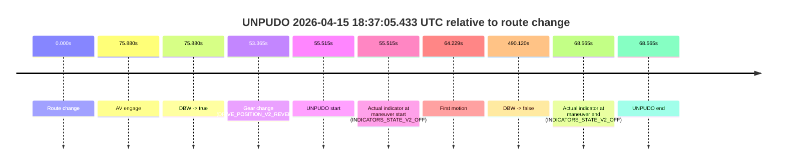
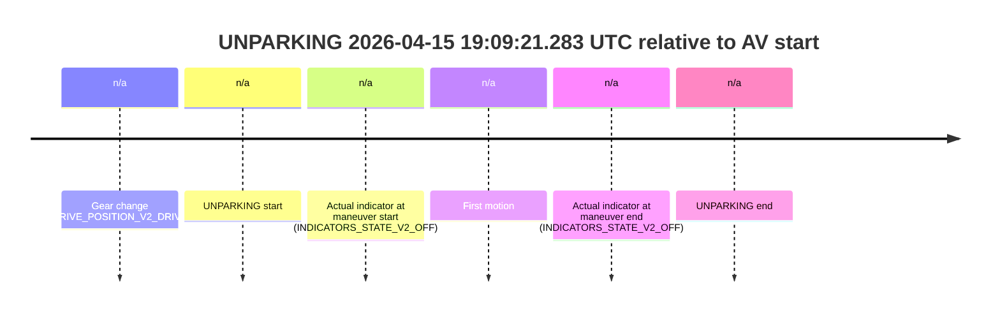

# Run Report: fme10005/2026-04-15--18-25-49--gen2-av-44847044-957a-43a9-a146-123f5e0d76b8

| Field | Value |
|---|---|
| Run ID | `fme10005/2026-04-15--18-25-49--gen2-av-44847044-957a-43a9-a146-123f5e0d76b8` |
| Date | `2026-04-15` |
| Model(s) | `satisfied-amber-moose` |
| Author | `guy.geva` |
| Event count | `6` |

## unpudo 2026-04-15 18:37:05.433 UTC

| Field | Value |
|---|---|
| Model | `satisfied-amber-moose` |
| Author | `guy.geva` |
| Run ID | `fme10005/2026-04-15--18-25-49--gen2-av-44847044-957a-43a9-a146-123f5e0d76b8` |
| Date | `2026-04-15` |
| Time (UTC) | `18:37:05.433` |
| Event type | `unpudo` |
| Disengagement type | `failed_to_unpudo` |
| Route change | `found` |
| Console | [run](https://console.sso.wayve.ai/run/fme10005/2026-04-15--18-25-49--gen2-av-44847044-957a-43a9-a146-123f5e0d76b8?id=&time-unixus=1776278225433313) |
| Foxglove | [segment](https://app.foxglove.dev/wayve-on-prem/p/prj_0dX18KZdVHg1fmmI/view?ds=foxglove-stream&ds.deviceName=fme10005&ds.start=2026-04-15T18%3A35%3A59.918271Z&ds.end=2026-04-15T18%3A44%3A30.037896Z&layoutId=lay_0e7VD4WIKDQGU73Y&time=2026-04-15T18%3A37%3A05.433313Z) |

### Event card: accidental

- Accidental: AV ownership is present for less than `2s`, so this is treated as an accidental brush with the maneuver rather than a meaningful model attempt.

| Event | Time (UTC) | Delta from route change |
|---|---:|---:|
| Route change | 2026-04-15 18:36:09.918 | `0.000s` |
| AV engage | 2026-04-15 18:37:25.797 | `75.880s` |
| DBW -> true | 2026-04-15 18:37:25.797 | `75.880s` |
| Gear change (DRIVE_POSITION_V2_REVERSE) | 2026-04-15 18:37:03.283 | `53.365s` |
| UNPUDO start | 2026-04-15 18:37:05.433 | `55.515s` |
| Actual indicator at maneuver start (INDICATORS_STATE_V2_OFF) | 2026-04-15 18:37:05.433 | `55.515s` |
| First motion | 2026-04-15 18:37:14.146 | `64.229s` |
| DBW -> false | 2026-04-15 18:44:20.037 | `490.120s` |
| Actual indicator at maneuver end (INDICATORS_STATE_V2_OFF) | 2026-04-15 18:37:18.483 | `68.565s` |
| UNPUDO end | 2026-04-15 18:37:18.483 | `68.565s` |

| Metric | Value |
|---|---|
| Outcome | `accidental` |
| Effective failure type | `none` |
| Route change status | `found` |
| DBW at event start | `false` |
| DBW at event end | `false` |
| Predicted gear at AV start | `DRIVE_POSITION_V2_DRIVE` |
| Actual gear at AV start | `DRIVE_POSITION_V2_DRIVE` |
| Predicted gear at event start | `DRIVE_POSITION_V2_REVERSE` |
| Actual gear at event start | `DRIVE_POSITION_V2_REVERSE` |
| Planned indicator direction | `INDICATORS_STATE_V2_OFF` |
| Controller indicator direction | `INDICATORS_STATE_V2_OFF` |
| Actual indicator direction | `INDICATORS_STATE_V2_OFF` |
| Actual indicator at maneuver end | `INDICATORS_STATE_V2_OFF` |
| Driver accel help in AV | `false` |
| Driver accel help timestamp | `n/a` |
| Max accel pedal pct in AV | `0.0%` |
| Max brake pedal pct in AV | `0.0%` |
| Max speed mps in AV | `0.000` |
| Route -> AV | `75.880s` |
| AV -> event start | `-20.364s` |
| AV -> first motion | `-11.651s` |
| AV duration before disengagement | `414.240s` |
| Trajectory waypoint count | `37` |
| Driving-plan step count | `11` |

The scored portion starts from the AV-owned window, not from the pre-AV setup. Route-change search in the stopped pre-event segment was `found`, with the baseline therefore set to route change. At the event anchor the model predicts `DRIVE_POSITION_V2_REVERSE` and the actual gear is `DRIVE_POSITION_V2_REVERSE`. The effective model outcome is `accidental` because `the AV-owned portion is shorter than 2s`.

### Resolution

| Field | Value |
|---|---|
| Final outcome | `accidental` |
| Do we agree with this label? | `yes` |
| Source disengagement type | `failed_to_unpudo` |
| Resolved effective failure type | `none` |
| Confidence | `high` |

## unpudo 2026-04-15 18:49:16.383 UTC

| Field | Value |
|---|---|
| Model | `satisfied-amber-moose` |
| Author | `guy.geva` |
| Run ID | `fme10005/2026-04-15--18-25-49--gen2-av-44847044-957a-43a9-a146-123f5e0d76b8` |
| Date | `2026-04-15` |
| Time (UTC) | `18:49:16.383` |
| Event type | `unpudo` |
| Disengagement type | `failed_to_unpudo` |
| Route change | `found` |
| Console | [run](https://console.sso.wayve.ai/run/fme10005/2026-04-15--18-25-49--gen2-av-44847044-957a-43a9-a146-123f5e0d76b8?id=&time-unixus=1776278956383314) |
| Foxglove | [segment](https://app.foxglove.dev/wayve-on-prem/p/prj_0dX18KZdVHg1fmmI/view?ds=foxglove-stream&ds.deviceName=fme10005&ds.start=2026-04-15T18%3A47%3A16.068238Z&ds.end=2026-04-15T18%3A50%3A00.739970Z&layoutId=lay_0e7VD4WIKDQGU73Y&time=2026-04-15T18%3A49%3A16.383314Z) |

### Event card: accidental

- Accidental: AV ownership is present for less than `2s`, so this is treated as an accidental brush with the maneuver rather than a meaningful model attempt.

| Event | Time (UTC) | Delta from route change |
|---|---:|---:|
| Route change | 2026-04-15 18:47:26.068 | `0.000s` |
| AV engage | 2026-04-15 18:49:21.659 | `115.591s` |
| DBW -> true | 2026-04-15 18:49:21.659 | `115.591s` |
| Gear change (DRIVE_POSITION_V2_DRIVE) | 2026-04-15 18:49:08.633 | `102.565s` |
| UNPUDO start | 2026-04-15 18:49:16.383 | `110.315s` |
| Actual indicator at maneuver start (INDICATORS_STATE_V2_OFF) | 2026-04-15 18:49:16.383 | `110.315s` |
| First motion | 2026-04-15 18:49:16.446 | `110.379s` |
| DBW -> false | 2026-04-15 18:49:50.739 | `144.672s` |
| Actual indicator at maneuver end (INDICATORS_STATE_V2_OFF) | 2026-04-15 18:49:20.483 | `114.415s` |
| UNPUDO end | 2026-04-15 18:49:20.483 | `114.415s` |

| Metric | Value |
|---|---|
| Outcome | `accidental` |
| Effective failure type | `none` |
| Route change status | `found` |
| DBW at event start | `false` |
| DBW at event end | `false` |
| Predicted gear at AV start | `DRIVE_POSITION_V2_DRIVE` |
| Actual gear at AV start | `DRIVE_POSITION_V2_DRIVE` |
| Predicted gear at event start | `DRIVE_POSITION_V2_DRIVE` |
| Actual gear at event start | `DRIVE_POSITION_V2_DRIVE` |
| Planned indicator direction | `INDICATORS_STATE_V2_OFF` |
| Controller indicator direction | `INDICATORS_STATE_V2_OFF` |
| Actual indicator direction | `INDICATORS_STATE_V2_OFF` |
| Actual indicator at maneuver end | `INDICATORS_STATE_V2_OFF` |
| Driver accel help in AV | `false` |
| Driver accel help timestamp | `n/a` |
| Max accel pedal pct in AV | `0.0%` |
| Max brake pedal pct in AV | `0.0%` |
| Max speed mps in AV | `0.000` |
| Route -> AV | `115.591s` |
| AV -> event start | `-5.276s` |
| AV -> first motion | `-5.212s` |
| AV duration before disengagement | `29.081s` |
| Trajectory waypoint count | `36` |
| Driving-plan step count | `11` |

The scored portion starts from the AV-owned window, not from the pre-AV setup. Route-change search in the stopped pre-event segment was `found`, with the baseline therefore set to route change. At the event anchor the model predicts `DRIVE_POSITION_V2_DRIVE` and the actual gear is `DRIVE_POSITION_V2_DRIVE`. The effective model outcome is `accidental` because `the AV-owned portion is shorter than 2s`.

### Resolution

| Field | Value |
|---|---|
| Final outcome | `accidental` |
| Do we agree with this label? | `yes` |
| Source disengagement type | `failed_to_unpudo` |
| Resolved effective failure type | `none` |
| Confidence | `high` |

## unpudo 2026-04-15 18:51:22.683 UTC

| Field | Value |
|---|---|
| Model | `satisfied-amber-moose` |
| Author | `guy.geva` |
| Run ID | `fme10005/2026-04-15--18-25-49--gen2-av-44847044-957a-43a9-a146-123f5e0d76b8` |
| Date | `2026-04-15` |
| Time (UTC) | `18:51:22.683` |
| Event type | `unpudo` |
| Disengagement type | `failed_to_unpudo` |
| Route change | `found` |
| Console | [run](https://console.sso.wayve.ai/run/fme10005/2026-04-15--18-25-49--gen2-av-44847044-957a-43a9-a146-123f5e0d76b8?id=&time-unixus=1776279082683321) |
| Foxglove | [segment](https://app.foxglove.dev/wayve-on-prem/p/prj_0dX18KZdVHg1fmmI/view?ds=foxglove-stream&ds.deviceName=fme10005&ds.start=2026-04-15T18%3A49%3A48.118246Z&ds.end=2026-04-15T18%3A52%3A59.657829Z&layoutId=lay_0e7VD4WIKDQGU73Y&time=2026-04-15T18%3A51%3A22.683321Z) |

### Event card: accidental

- Accidental: AV ownership is present for less than `2s`, so this is treated as an accidental brush with the maneuver rather than a meaningful model attempt.

| Event | Time (UTC) | Delta from route change |
|---|---:|---:|
| Route change | 2026-04-15 18:49:58.118 | `0.000s` |
| AV engage | 2026-04-15 18:51:35.659 | `97.541s` |
| DBW -> true | 2026-04-15 18:51:35.659 | `97.541s` |
| Gear change (DRIVE_POSITION_V2_DRIVE) | 2026-04-15 18:51:17.633 | `79.515s` |
| UNPUDO start | 2026-04-15 18:51:22.683 | `84.565s` |
| Actual indicator at maneuver start (INDICATORS_STATE_V2_OFF) | 2026-04-15 18:51:22.683 | `84.565s` |
| First motion | 2026-04-15 18:51:22.726 | `84.609s` |
| DBW -> false | 2026-04-15 18:52:49.657 | `171.540s` |
| Actual indicator at maneuver end (INDICATORS_STATE_V2_OFF) | 2026-04-15 18:51:26.233 | `88.115s` |
| UNPUDO end | 2026-04-15 18:51:26.233 | `88.115s` |

| Metric | Value |
|---|---|
| Outcome | `accidental` |
| Effective failure type | `none` |
| Route change status | `found` |
| DBW at event start | `false` |
| DBW at event end | `false` |
| Predicted gear at AV start | `DRIVE_POSITION_V2_DRIVE` |
| Actual gear at AV start | `DRIVE_POSITION_V2_DRIVE` |
| Predicted gear at event start | `DRIVE_POSITION_V2_DRIVE` |
| Actual gear at event start | `DRIVE_POSITION_V2_DRIVE` |
| Planned indicator direction | `INDICATORS_STATE_V2_LEFT_ON` |
| Controller indicator direction | `INDICATORS_STATE_V2_LEFT_ON` |
| Actual indicator direction | `INDICATORS_STATE_V2_OFF` |
| Actual indicator at maneuver end | `INDICATORS_STATE_V2_OFF` |
| Driver accel help in AV | `false` |
| Driver accel help timestamp | `n/a` |
| Max accel pedal pct in AV | `0.0%` |
| Max brake pedal pct in AV | `0.0%` |
| Max speed mps in AV | `0.000` |
| Route -> AV | `97.541s` |
| AV -> event start | `-12.976s` |
| AV -> first motion | `-12.932s` |
| AV duration before disengagement | `73.999s` |
| Trajectory waypoint count | `37` |
| Driving-plan step count | `11` |

The scored portion starts from the AV-owned window, not from the pre-AV setup. Route-change search in the stopped pre-event segment was `found`, with the baseline therefore set to route change. At the event anchor the model predicts `DRIVE_POSITION_V2_DRIVE` and the actual gear is `DRIVE_POSITION_V2_DRIVE`. The effective model outcome is `accidental` because `the AV-owned portion is shorter than 2s`.

### Resolution

| Field | Value |
|---|---|
| Final outcome | `accidental` |
| Do we agree with this label? | `yes` |
| Source disengagement type | `failed_to_unpudo` |
| Resolved effective failure type | `none` |
| Confidence | `high` |

## unpudo 2026-04-15 19:00:24.233 UTC

| Field | Value |
|---|---|
| Model | `satisfied-amber-moose` |
| Author | `guy.geva` |
| Run ID | `fme10005/2026-04-15--18-25-49--gen2-av-44847044-957a-43a9-a146-123f5e0d76b8` |
| Date | `2026-04-15` |
| Time (UTC) | `19:00:24.233` |
| Event type | `unpudo` |
| Disengagement type | `failed_to_unpudo` |
| Route change | `found` |
| Console | [run](https://console.sso.wayve.ai/run/fme10005/2026-04-15--18-25-49--gen2-av-44847044-957a-43a9-a146-123f5e0d76b8?id=&time-unixus=1776279624233295) |
| Foxglove | [segment](https://app.foxglove.dev/wayve-on-prem/p/prj_0dX18KZdVHg1fmmI/view?ds=foxglove-stream&ds.deviceName=fme10005&ds.start=2026-04-15T19%3A00%3A01.268296Z&ds.end=2026-04-15T19%3A01%3A34.037820Z&layoutId=lay_0e7VD4WIKDQGU73Y&time=2026-04-15T19%3A00%3A24.233295Z) |

### Event card: accidental

- Accidental: AV ownership is present for less than `2s`, so this is treated as an accidental brush with the maneuver rather than a meaningful model attempt.

| Event | Time (UTC) | Delta from route change |
|---|---:|---:|
| Route change | 2026-04-15 19:00:11.268 | `0.000s` |
| AV engage | 2026-04-15 19:00:45.277 | `34.009s` |
| DBW -> true | 2026-04-15 19:00:45.277 | `34.009s` |
| Gear change (DRIVE_POSITION_V2_DRIVE) | 2026-04-15 19:00:19.083 | `7.815s` |
| UNPUDO start | 2026-04-15 19:00:24.233 | `12.965s` |
| Actual indicator at maneuver start (INDICATORS_STATE_V2_OFF) | 2026-04-15 19:00:24.233 | `12.965s` |
| First motion | 2026-04-15 19:00:24.246 | `12.979s` |
| DBW -> false | 2026-04-15 19:01:24.037 | `72.770s` |
| Actual indicator at maneuver end (INDICATORS_STATE_V2_RIGHT_ON) | 2026-04-15 19:00:30.833 | `19.565s` |
| UNPUDO end | 2026-04-15 19:00:30.833 | `19.565s` |

| Metric | Value |
|---|---|
| Outcome | `accidental` |
| Effective failure type | `none` |
| Route change status | `found` |
| DBW at event start | `false` |
| DBW at event end | `false` |
| Predicted gear at AV start | `DRIVE_POSITION_V2_DRIVE` |
| Actual gear at AV start | `DRIVE_POSITION_V2_DRIVE` |
| Predicted gear at event start | `DRIVE_POSITION_V2_DRIVE` |
| Actual gear at event start | `DRIVE_POSITION_V2_DRIVE` |
| Planned indicator direction | `INDICATORS_STATE_V2_OFF` |
| Controller indicator direction | `INDICATORS_STATE_V2_OFF` |
| Actual indicator direction | `INDICATORS_STATE_V2_OFF` |
| Actual indicator at maneuver end | `INDICATORS_STATE_V2_RIGHT_ON` |
| Driver accel help in AV | `false` |
| Driver accel help timestamp | `n/a` |
| Max accel pedal pct in AV | `0.0%` |
| Max brake pedal pct in AV | `0.0%` |
| Max speed mps in AV | `0.000` |
| Route -> AV | `34.009s` |
| AV -> event start | `-21.044s` |
| AV -> first motion | `-21.031s` |
| AV duration before disengagement | `38.760s` |
| Trajectory waypoint count | `37` |
| Driving-plan step count | `11` |

The scored portion starts from the AV-owned window, not from the pre-AV setup. Route-change search in the stopped pre-event segment was `found`, with the baseline therefore set to route change. At the event anchor the model predicts `DRIVE_POSITION_V2_DRIVE` and the actual gear is `DRIVE_POSITION_V2_DRIVE`. The effective model outcome is `accidental` because `the AV-owned portion is shorter than 2s`.

### Resolution

| Field | Value |
|---|---|
| Final outcome | `accidental` |
| Do we agree with this label? | `yes` |
| Source disengagement type | `failed_to_unpudo` |
| Resolved effective failure type | `none` |
| Confidence | `high` |

## unpudo 2026-04-15 19:03:21.083 UTC

| Field | Value |
|---|---|
| Model | `satisfied-amber-moose` |
| Author | `guy.geva` |
| Run ID | `fme10005/2026-04-15--18-25-49--gen2-av-44847044-957a-43a9-a146-123f5e0d76b8` |
| Date | `2026-04-15` |
| Time (UTC) | `19:03:21.083` |
| Event type | `unpudo` |
| Disengagement type | `failed_to_unpudo` |
| Route change | `found` |
| Console | [run](https://console.sso.wayve.ai/run/fme10005/2026-04-15--18-25-49--gen2-av-44847044-957a-43a9-a146-123f5e0d76b8?id=&time-unixus=1776279801083316) |
| Foxglove | [segment](https://app.foxglove.dev/wayve-on-prem/p/prj_0dX18KZdVHg1fmmI/view?ds=foxglove-stream&ds.deviceName=fme10005&ds.start=2026-04-15T19%3A02%3A33.168204Z&ds.end=2026-04-15T19%3A04%3A01.397886Z&layoutId=lay_0e7VD4WIKDQGU73Y&time=2026-04-15T19%3A03%3A21.083316Z) |

### Event card: accidental

- Accidental: AV ownership is present for less than `2s`, so this is treated as an accidental brush with the maneuver rather than a meaningful model attempt.

| Event | Time (UTC) | Delta from route change |
|---|---:|---:|
| Route change | 2026-04-15 19:02:43.168 | `0.000s` |
| AV engage | 2026-04-15 19:03:48.817 | `65.649s` |
| DBW -> true | 2026-04-15 19:03:48.817 | `65.649s` |
| Gear change (DRIVE_POSITION_V2_DRIVE) | 2026-04-15 19:03:15.133 | `31.965s` |
| UNPUDO start | 2026-04-15 19:03:21.083 | `37.915s` |
| Actual indicator at maneuver start (INDICATORS_STATE_V2_OFF) | 2026-04-15 19:03:21.083 | `37.915s` |
| First motion | 2026-04-15 19:03:21.107 | `37.940s` |
| DBW -> false | 2026-04-15 19:03:51.397 | `68.230s` |
| Actual indicator at maneuver end (INDICATORS_STATE_V2_OFF) | 2026-04-15 19:03:30.533 | `47.365s` |
| UNPUDO end | 2026-04-15 19:03:30.533 | `47.365s` |

| Metric | Value |
|---|---|
| Outcome | `accidental` |
| Effective failure type | `none` |
| Route change status | `found` |
| DBW at event start | `false` |
| DBW at event end | `false` |
| Predicted gear at AV start | `DRIVE_POSITION_V2_DRIVE` |
| Actual gear at AV start | `DRIVE_POSITION_V2_DRIVE` |
| Predicted gear at event start | `DRIVE_POSITION_V2_DRIVE` |
| Actual gear at event start | `DRIVE_POSITION_V2_DRIVE` |
| Planned indicator direction | `INDICATORS_STATE_V2_LEFT_ON` |
| Controller indicator direction | `INDICATORS_STATE_V2_OFF` |
| Actual indicator direction | `INDICATORS_STATE_V2_OFF` |
| Actual indicator at maneuver end | `INDICATORS_STATE_V2_OFF` |
| Driver accel help in AV | `false` |
| Driver accel help timestamp | `n/a` |
| Max accel pedal pct in AV | `0.0%` |
| Max brake pedal pct in AV | `0.0%` |
| Max speed mps in AV | `0.000` |
| Route -> AV | `65.649s` |
| AV -> event start | `-27.734s` |
| AV -> first motion | `-27.710s` |
| AV duration before disengagement | `2.580s` |
| Trajectory waypoint count | `36` |
| Driving-plan step count | `11` |

The scored portion starts from the AV-owned window, not from the pre-AV setup. Route-change search in the stopped pre-event segment was `found`, with the baseline therefore set to route change. At the event anchor the model predicts `DRIVE_POSITION_V2_DRIVE` and the actual gear is `DRIVE_POSITION_V2_DRIVE`. The effective model outcome is `accidental` because `the AV-owned portion is shorter than 2s`.

### Resolution

| Field | Value |
|---|---|
| Final outcome | `accidental` |
| Do we agree with this label? | `yes` |
| Source disengagement type | `failed_to_unpudo` |
| Resolved effective failure type | `none` |
| Confidence | `high` |

## unparking 2026-04-15 19:09:21.283 UTC

| Field | Value |
|---|---|
| Model | `satisfied-amber-moose` |
| Author | `guy.geva` |
| Run ID | `fme10005/2026-04-15--18-25-49--gen2-av-44847044-957a-43a9-a146-123f5e0d76b8` |
| Date | `2026-04-15` |
| Time (UTC) | `19:09:21.283` |
| Event type | `unparking` |
| Disengagement type | `uncategorised` |
| Route change | `not found` |
| Console | [run](https://console.sso.wayve.ai/run/fme10005/2026-04-15--18-25-49--gen2-av-44847044-957a-43a9-a146-123f5e0d76b8?id=&time-unixus=1776280161283311) |
| Foxglove | [segment](https://app.foxglove.dev/wayve-on-prem/p/prj_0dX18KZdVHg1fmmI/view?ds=foxglove-stream&ds.deviceName=fme10005&ds.start=2026-04-15T19%3A09%3A05.333291Z&ds.end=2026-04-15T19%3A09%3A39.183315Z&layoutId=lay_0e7VD4WIKDQGU73Y&time=2026-04-15T19%3A09%3A21.283311Z) |

### Event card: non-av

- Non-AV: the detected unparking starts outside AV ownership, so it is kept for coverage but excluded from model success / failure scoring.

| Event | Time (UTC) | Delta from AV start |
|---|---:|---:|
| Gear change (DRIVE_POSITION_V2_DRIVE) | 2026-04-15 19:09:15.333 | `n/a` |
| UNPARKING start | 2026-04-15 19:09:21.283 | `n/a` |
| Actual indicator at maneuver start (INDICATORS_STATE_V2_OFF) | 2026-04-15 19:09:21.283 | `n/a` |
| First motion | 2026-04-15 19:09:21.306 | `n/a` |
| Actual indicator at maneuver end (INDICATORS_STATE_V2_OFF) | 2026-04-15 19:09:29.183 | `n/a` |
| UNPARKING end | 2026-04-15 19:09:29.183 | `n/a` |

| Metric | Value |
|---|---|
| Outcome | `non-av` |
| Effective failure type | `none` |
| Route change status | `not found` |
| DBW at event start | `false` |
| DBW at event end | `false` |
| Predicted gear at AV start | `n/a` |
| Actual gear at AV start | `n/a` |
| Predicted gear at event start | `DRIVE_POSITION_V2_DRIVE` |
| Actual gear at event start | `DRIVE_POSITION_V2_DRIVE` |
| Planned indicator direction | `INDICATORS_STATE_V2_LEFT_ON` |
| Controller indicator direction | `INDICATORS_STATE_V2_LEFT_ON` |
| Actual indicator direction | `INDICATORS_STATE_V2_OFF` |
| Actual indicator at maneuver end | `INDICATORS_STATE_V2_OFF` |
| Driver accel help in AV | `false` |
| Driver accel help timestamp | `n/a` |
| Max accel pedal pct in AV | `0.0%` |
| Max brake pedal pct in AV | `0.0%` |
| Max speed mps in AV | `0.000` |
| Route -> AV | `n/a` |
| AV -> event start | `n/a` |
| AV -> first motion | `n/a` |
| AV duration before disengagement | `n/a` |
| Trajectory waypoint count | `36` |
| Driving-plan step count | `11` |

The scored portion starts from the AV-owned window, not from the pre-AV setup. Route-change search in the stopped pre-event segment was `not found`, with the baseline therefore set to AV start. At the event anchor the model predicts `DRIVE_POSITION_V2_DRIVE` and the actual gear is `DRIVE_POSITION_V2_DRIVE`. The effective model outcome is `non-av` because `the event does not begin in AV ownership`.

### Resolution

| Field | Value |
|---|---|
| Final outcome | `non-av` |
| Do we agree with this label? | `yes` |
| Source disengagement type | `uncategorised` |
| Resolved effective failure type | `none` |
| Confidence | `high` |
