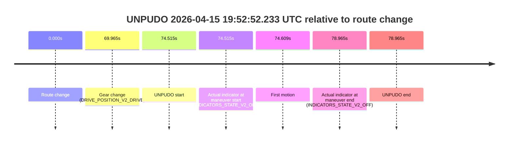
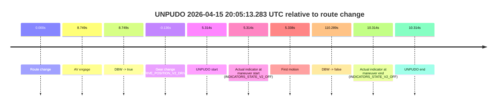
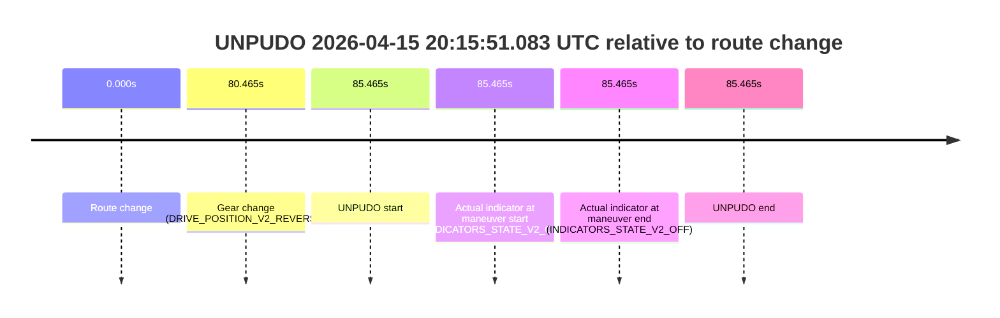

# Run Report: fme10005/2026-04-15--19-34-19--gen2-av-02dc9df5-e166-4df7-af87-5d6e200cad5a

| Field | Value |
|---|---|
| Run ID | `fme10005/2026-04-15--19-34-19--gen2-av-02dc9df5-e166-4df7-af87-5d6e200cad5a` |
| Date | `2026-04-15` |
| Model(s) | `satisfied-amber-moose` |
| Author | `guy.geva` |
| Event count | `9` |

## unpudo 2026-04-15 19:51:49.433 UTC

| Field | Value |
|---|---|
| Model | `satisfied-amber-moose` |
| Author | `guy.geva` |
| Run ID | `fme10005/2026-04-15--19-34-19--gen2-av-02dc9df5-e166-4df7-af87-5d6e200cad5a` |
| Date | `2026-04-15` |
| Time (UTC) | `19:51:49.433` |
| Event type | `unpudo` |
| Disengagement type | `failed_to_unpudo` |
| Route change | `found` |
| Console | [run](https://console.sso.wayve.ai/run/fme10005/2026-04-15--19-34-19--gen2-av-02dc9df5-e166-4df7-af87-5d6e200cad5a?id=&time-unixus=1776282709433310) |
| Foxglove | [segment](https://app.foxglove.dev/wayve-on-prem/p/prj_0dX18KZdVHg1fmmI/view?ds=foxglove-stream&ds.deviceName=fme10005&ds.start=2026-04-15T19%3A51%3A27.718245Z&ds.end=2026-04-15T19%3A53%3A01.637911Z&layoutId=lay_0e7VD4WIKDQGU73Y&time=2026-04-15T19%3A51%3A49.433310Z) |

### Event card: accidental

- Accidental: AV ownership is present for less than `2s`, so this is treated as an accidental brush with the maneuver rather than a meaningful model attempt.

| Event | Time (UTC) | Delta from route change |
|---|---:|---:|
| Route change | 2026-04-15 19:51:37.718 | `0.000s` |
| AV engage | 2026-04-15 19:51:53.858 | `16.141s` |
| DBW -> true | 2026-04-15 19:51:53.858 | `16.141s` |
| Gear change (DRIVE_POSITION_V2_DRIVE) | 2026-04-15 19:51:44.983 | `7.265s` |
| UNPUDO start | 2026-04-15 19:51:49.433 | `11.715s` |
| Actual indicator at maneuver start (INDICATORS_STATE_V2_OFF) | 2026-04-15 19:51:49.433 | `11.715s` |
| First motion | 2026-04-15 19:51:49.487 | `11.769s` |
| DBW -> false | 2026-04-15 19:52:51.637 | `73.920s` |
| Actual indicator at maneuver end (INDICATORS_STATE_V2_OFF) | 2026-04-15 19:51:52.833 | `15.115s` |
| UNPUDO end | 2026-04-15 19:51:52.833 | `15.115s` |

| Metric | Value |
|---|---|
| Outcome | `accidental` |
| Effective failure type | `none` |
| Route change status | `found` |
| DBW at event start | `false` |
| DBW at event end | `false` |
| Predicted gear at AV start | `DRIVE_POSITION_V2_DRIVE` |
| Actual gear at AV start | `DRIVE_POSITION_V2_DRIVE` |
| Predicted gear at event start | `DRIVE_POSITION_V2_DRIVE` |
| Actual gear at event start | `DRIVE_POSITION_V2_DRIVE` |
| Planned indicator direction | `INDICATORS_STATE_V2_RIGHT_ON` |
| Controller indicator direction | `INDICATORS_STATE_V2_RIGHT_ON` |
| Actual indicator direction | `INDICATORS_STATE_V2_OFF` |
| Actual indicator at maneuver end | `INDICATORS_STATE_V2_OFF` |
| Driver accel help in AV | `false` |
| Driver accel help timestamp | `n/a` |
| Max accel pedal pct in AV | `0.0%` |
| Max brake pedal pct in AV | `0.0%` |
| Max speed mps in AV | `0.000` |
| Route -> AV | `16.141s` |
| AV -> event start | `-4.426s` |
| AV -> first motion | `-4.372s` |
| AV duration before disengagement | `57.779s` |
| Trajectory waypoint count | `37` |
| Driving-plan step count | `11` |

The scored portion starts from the AV-owned window, not from the pre-AV setup. Route-change search in the stopped pre-event segment was `found`, with the baseline therefore set to route change. At the event anchor the model predicts `DRIVE_POSITION_V2_DRIVE` and the actual gear is `DRIVE_POSITION_V2_DRIVE`. The effective model outcome is `accidental` because `the AV-owned portion is shorter than 2s`.

### Resolution

| Field | Value |
|---|---|
| Final outcome | `accidental` |
| Do we agree with this label? | `yes` |
| Source disengagement type | `failed_to_unpudo` |
| Resolved effective failure type | `none` |
| Confidence | `high` |

## unpudo 2026-04-15 19:52:52.233 UTC

| Field | Value |
|---|---|
| Model | `satisfied-amber-moose` |
| Author | `guy.geva` |
| Run ID | `fme10005/2026-04-15--19-34-19--gen2-av-02dc9df5-e166-4df7-af87-5d6e200cad5a` |
| Date | `2026-04-15` |
| Time (UTC) | `19:52:52.233` |
| Event type | `unpudo` |
| Disengagement type | `failed_to_unpudo` |
| Route change | `found` |
| Console | [run](https://console.sso.wayve.ai/run/fme10005/2026-04-15--19-34-19--gen2-av-02dc9df5-e166-4df7-af87-5d6e200cad5a?id=&time-unixus=1776282772233293) |
| Foxglove | [segment](https://app.foxglove.dev/wayve-on-prem/p/prj_0dX18KZdVHg1fmmI/view?ds=foxglove-stream&ds.deviceName=fme10005&ds.start=2026-04-15T19%3A51%3A27.718245Z&ds.end=2026-04-15T19%3A53%3A06.683298Z&layoutId=lay_0e7VD4WIKDQGU73Y&time=2026-04-15T19%3A52%3A52.233293Z) |

### Event card: non-av

- Non-AV: the detected unpudo starts outside AV ownership, so it is kept for coverage but excluded from model success / failure scoring.

| Event | Time (UTC) | Delta from route change |
|---|---:|---:|
| Route change | 2026-04-15 19:51:37.718 | `0.000s` |
| Gear change (DRIVE_POSITION_V2_DRIVE) | 2026-04-15 19:52:47.683 | `69.965s` |
| UNPUDO start | 2026-04-15 19:52:52.233 | `74.515s` |
| Actual indicator at maneuver start (INDICATORS_STATE_V2_OFF) | 2026-04-15 19:52:52.233 | `74.515s` |
| First motion | 2026-04-15 19:52:52.327 | `74.609s` |
| Actual indicator at maneuver end (INDICATORS_STATE_V2_OFF) | 2026-04-15 19:52:56.683 | `78.965s` |
| UNPUDO end | 2026-04-15 19:52:56.683 | `78.965s` |

| Metric | Value |
|---|---|
| Outcome | `non-av` |
| Effective failure type | `none` |
| Route change status | `found` |
| DBW at event start | `false` |
| DBW at event end | `false` |
| Predicted gear at AV start | `n/a` |
| Actual gear at AV start | `n/a` |
| Predicted gear at event start | `DRIVE_POSITION_V2_DRIVE` |
| Actual gear at event start | `DRIVE_POSITION_V2_DRIVE` |
| Planned indicator direction | `INDICATORS_STATE_V2_OFF` |
| Controller indicator direction | `INDICATORS_STATE_V2_OFF` |
| Actual indicator direction | `INDICATORS_STATE_V2_OFF` |
| Actual indicator at maneuver end | `INDICATORS_STATE_V2_OFF` |
| Driver accel help in AV | `false` |
| Driver accel help timestamp | `n/a` |
| Max accel pedal pct in AV | `0.0%` |
| Max brake pedal pct in AV | `0.0%` |
| Max speed mps in AV | `0.000` |
| Route -> AV | `n/a` |
| AV -> event start | `n/a` |
| AV -> first motion | `n/a` |
| AV duration before disengagement | `n/a` |
| Trajectory waypoint count | `37` |
| Driving-plan step count | `11` |

The scored portion starts from the AV-owned window, not from the pre-AV setup. Route-change search in the stopped pre-event segment was `found`, with the baseline therefore set to route change. At the event anchor the model predicts `DRIVE_POSITION_V2_DRIVE` and the actual gear is `DRIVE_POSITION_V2_DRIVE`. The effective model outcome is `non-av` because `the event does not begin in AV ownership`.

### Resolution

| Field | Value |
|---|---|
| Final outcome | `non-av` |
| Do we agree with this label? | `yes` |
| Source disengagement type | `failed_to_unpudo` |
| Resolved effective failure type | `none` |
| Confidence | `high` |

## unpudo 2026-04-15 19:53:07.083 UTC

| Field | Value |
|---|---|
| Model | `satisfied-amber-moose` |
| Author | `guy.geva` |
| Run ID | `fme10005/2026-04-15--19-34-19--gen2-av-02dc9df5-e166-4df7-af87-5d6e200cad5a` |
| Date | `2026-04-15` |
| Time (UTC) | `19:53:07.083` |
| Event type | `unpudo` |
| Disengagement type | `none observed` |
| Route change | `found` |
| Console | [run](https://console.sso.wayve.ai/run/fme10005/2026-04-15--19-34-19--gen2-av-02dc9df5-e166-4df7-af87-5d6e200cad5a?id=&time-unixus=1776282787083299) |
| Foxglove | [segment](https://app.foxglove.dev/wayve-on-prem/p/prj_0dX18KZdVHg1fmmI/view?ds=foxglove-stream&ds.deviceName=fme10005&ds.start=2026-04-15T19%3A51%3A27.718245Z&ds.end=2026-04-15T19%3A54%3A59.918209Z&layoutId=lay_0e7VD4WIKDQGU73Y&time=2026-04-15T19%3A53%3A07.083299Z) |

### Event card: accidental

- Accidental: AV ownership is present for less than `2s`, so this is treated as an accidental brush with the maneuver rather than a meaningful model attempt.

| Event | Time (UTC) | Delta from route change |
|---|---:|---:|
| Route change | 2026-04-15 19:51:37.718 | `0.000s` |
| AV engage | 2026-04-15 19:53:20.218 | `102.501s` |
| DBW -> true | 2026-04-15 19:53:20.218 | `102.501s` |
| Gear change (DRIVE_POSITION_V2_REVERSE) | 2026-04-15 19:53:05.933 | `88.215s` |
| UNPUDO start | 2026-04-15 19:53:07.083 | `89.365s` |
| Actual indicator at maneuver start (INDICATORS_STATE_V2_OFF) | 2026-04-15 19:53:07.083 | `89.365s` |
| First motion | 2026-04-15 19:53:12.866 | `95.149s` |
| DBW -> false | 2026-04-15 19:54:49.918 | `192.200s` |
| Actual indicator at maneuver end (INDICATORS_STATE_V2_OFF) | 2026-04-15 19:53:16.833 | `99.115s` |
| UNPUDO end | 2026-04-15 19:53:16.833 | `99.115s` |

| Metric | Value |
|---|---|
| Outcome | `accidental` |
| Effective failure type | `none` |
| Route change status | `found` |
| DBW at event start | `false` |
| DBW at event end | `false` |
| Predicted gear at AV start | `DRIVE_POSITION_V2_DRIVE` |
| Actual gear at AV start | `DRIVE_POSITION_V2_DRIVE` |
| Predicted gear at event start | `DRIVE_POSITION_V2_REVERSE` |
| Actual gear at event start | `DRIVE_POSITION_V2_REVERSE` |
| Planned indicator direction | `INDICATORS_STATE_V2_OFF` |
| Controller indicator direction | `INDICATORS_STATE_V2_OFF` |
| Actual indicator direction | `INDICATORS_STATE_V2_OFF` |
| Actual indicator at maneuver end | `INDICATORS_STATE_V2_OFF` |
| Driver accel help in AV | `false` |
| Driver accel help timestamp | `n/a` |
| Max accel pedal pct in AV | `0.0%` |
| Max brake pedal pct in AV | `0.0%` |
| Max speed mps in AV | `0.000` |
| Route -> AV | `102.501s` |
| AV -> event start | `-13.136s` |
| AV -> first motion | `-7.352s` |
| AV duration before disengagement | `89.699s` |
| Trajectory waypoint count | `37` |
| Driving-plan step count | `11` |

The scored portion starts from the AV-owned window, not from the pre-AV setup. Route-change search in the stopped pre-event segment was `found`, with the baseline therefore set to route change. At the event anchor the model predicts `DRIVE_POSITION_V2_REVERSE` and the actual gear is `DRIVE_POSITION_V2_REVERSE`. The effective model outcome is `accidental` because `the AV-owned portion is shorter than 2s`.

### Resolution

| Field | Value |
|---|---|
| Final outcome | `accidental` |
| Do we agree with this label? | `yes` |
| Source disengagement type | `none observed` |
| Resolved effective failure type | `none` |
| Confidence | `high` |

## unpudo 2026-04-15 19:58:35.683 UTC

| Field | Value |
|---|---|
| Model | `satisfied-amber-moose` |
| Author | `guy.geva` |
| Run ID | `fme10005/2026-04-15--19-34-19--gen2-av-02dc9df5-e166-4df7-af87-5d6e200cad5a` |
| Date | `2026-04-15` |
| Time (UTC) | `19:58:35.683` |
| Event type | `unpudo` |
| Disengagement type | `failed_to_unpudo` |
| Route change | `found` |
| Console | [run](https://console.sso.wayve.ai/run/fme10005/2026-04-15--19-34-19--gen2-av-02dc9df5-e166-4df7-af87-5d6e200cad5a?id=&time-unixus=1776283115683298) |
| Foxglove | [segment](https://app.foxglove.dev/wayve-on-prem/p/prj_0dX18KZdVHg1fmmI/view?ds=foxglove-stream&ds.deviceName=fme10005&ds.start=2026-04-15T19%3A58%3A17.318322Z&ds.end=2026-04-15T19%3A59%3A03.933310Z&layoutId=lay_0e7VD4WIKDQGU73Y&time=2026-04-15T19%3A58%3A35.683298Z) |

### Event card: non-av

- Non-AV: the detected unpudo starts outside AV ownership, so it is kept for coverage but excluded from model success / failure scoring.

| Event | Time (UTC) | Delta from route change |
|---|---:|---:|
| Route change | 2026-04-15 19:58:27.318 | `0.000s` |
| AV engage | 2026-04-15 19:58:42.517 | `15.200s` |
| DBW -> true | 2026-04-15 19:58:42.517 | `15.200s` |
| Gear change (DRIVE_POSITION_V2_REVERSE) | 2026-04-15 19:58:31.433 | `4.115s` |
| UNPUDO start | 2026-04-15 19:58:35.683 | `8.365s` |
| Actual indicator at maneuver start (INDICATORS_STATE_V2_OFF) | 2026-04-15 19:58:35.683 | `8.365s` |
| First motion | 2026-04-15 19:58:49.186 | `21.868s` |
| DBW -> false | 2026-04-15 19:58:48.457 | `21.140s` |
| Actual indicator at maneuver end (INDICATORS_STATE_V2_OFF) | 2026-04-15 19:58:53.933 | `26.615s` |
| UNPUDO end | 2026-04-15 19:58:53.933 | `26.615s` |

| Metric | Value |
|---|---|
| Outcome | `non-av` |
| Effective failure type | `none` |
| Route change status | `found` |
| DBW at event start | `false` |
| DBW at event end | `false` |
| Predicted gear at AV start | `DRIVE_POSITION_V2_DRIVE` |
| Actual gear at AV start | `DRIVE_POSITION_V2_DRIVE` |
| Predicted gear at event start | `DRIVE_POSITION_V2_REVERSE` |
| Actual gear at event start | `DRIVE_POSITION_V2_REVERSE` |
| Planned indicator direction | `INDICATORS_STATE_V2_RIGHT_ON` |
| Controller indicator direction | `INDICATORS_STATE_V2_RIGHT_ON` |
| Actual indicator direction | `INDICATORS_STATE_V2_OFF` |
| Actual indicator at maneuver end | `INDICATORS_STATE_V2_OFF` |
| Driver accel help in AV | `false` |
| Driver accel help timestamp | `n/a` |
| Max accel pedal pct in AV | `0.0%` |
| Max brake pedal pct in AV | `8.0%` |
| Max speed mps in AV | `0.000` |
| Route -> AV | `15.200s` |
| AV -> event start | `-6.835s` |
| AV -> first motion | `6.669s` |
| AV duration before disengagement | `5.940s` |
| Trajectory waypoint count | `36` |
| Driving-plan step count | `11` |

The scored portion starts from the AV-owned window, not from the pre-AV setup. Route-change search in the stopped pre-event segment was `found`, with the baseline therefore set to route change. At the event anchor the model predicts `DRIVE_POSITION_V2_REVERSE` and the actual gear is `DRIVE_POSITION_V2_REVERSE`. The effective model outcome is `non-av` because `the event does not begin in AV ownership`.

### Resolution

| Field | Value |
|---|---|
| Final outcome | `non-av` |
| Do we agree with this label? | `yes` |
| Source disengagement type | `failed_to_unpudo` |
| Resolved effective failure type | `none` |
| Confidence | `high` |

## unpudo 2026-04-15 20:05:13.283 UTC

| Field | Value |
|---|---|
| Model | `satisfied-amber-moose` |
| Author | `guy.geva` |
| Run ID | `fme10005/2026-04-15--19-34-19--gen2-av-02dc9df5-e166-4df7-af87-5d6e200cad5a` |
| Date | `2026-04-15` |
| Time (UTC) | `20:05:13.283` |
| Event type | `unpudo` |
| Disengagement type | `failed_to_unpudo` |
| Route change | `found` |
| Console | [run](https://console.sso.wayve.ai/run/fme10005/2026-04-15--19-34-19--gen2-av-02dc9df5-e166-4df7-af87-5d6e200cad5a?id=&time-unixus=1776283513283321) |
| Foxglove | [segment](https://app.foxglove.dev/wayve-on-prem/p/prj_0dX18KZdVHg1fmmI/view?ds=foxglove-stream&ds.deviceName=fme10005&ds.start=2026-04-15T20%3A04%3A57.833309Z&ds.end=2026-04-15T20%3A07%3A08.257790Z&layoutId=lay_0e7VD4WIKDQGU73Y&time=2026-04-15T20%3A05%3A13.283321Z) |

### Event card: accidental

- Accidental: AV ownership is present for less than `2s`, so this is treated as an accidental brush with the maneuver rather than a meaningful model attempt.

| Event | Time (UTC) | Delta from route change |
|---|---:|---:|
| Route change | 2026-04-15 20:05:07.968 | `0.000s` |
| AV engage | 2026-04-15 20:05:16.717 | `8.749s` |
| DBW -> true | 2026-04-15 20:05:16.717 | `8.749s` |
| Gear change (DRIVE_POSITION_V2_DRIVE) | 2026-04-15 20:05:07.833 | `-0.136s` |
| UNPUDO start | 2026-04-15 20:05:13.283 | `5.314s` |
| Actual indicator at maneuver start (INDICATORS_STATE_V2_OFF) | 2026-04-15 20:05:13.283 | `5.314s` |
| First motion | 2026-04-15 20:05:13.306 | `5.338s` |
| DBW -> false | 2026-04-15 20:06:58.257 | `110.289s` |
| Actual indicator at maneuver end (INDICATORS_STATE_V2_OFF) | 2026-04-15 20:05:18.283 | `10.314s` |
| UNPUDO end | 2026-04-15 20:05:18.283 | `10.314s` |

| Metric | Value |
|---|---|
| Outcome | `accidental` |
| Effective failure type | `none` |
| Route change status | `found` |
| DBW at event start | `false` |
| DBW at event end | `true` |
| Predicted gear at AV start | `DRIVE_POSITION_V2_DRIVE` |
| Actual gear at AV start | `DRIVE_POSITION_V2_DRIVE` |
| Predicted gear at event start | `DRIVE_POSITION_V2_DRIVE` |
| Actual gear at event start | `DRIVE_POSITION_V2_DRIVE` |
| Planned indicator direction | `INDICATORS_STATE_V2_OFF` |
| Controller indicator direction | `INDICATORS_STATE_V2_OFF` |
| Actual indicator direction | `INDICATORS_STATE_V2_OFF` |
| Actual indicator at maneuver end | `INDICATORS_STATE_V2_OFF` |
| Driver accel help in AV | `false` |
| Driver accel help timestamp | `n/a` |
| Max accel pedal pct in AV | `0.0%` |
| Max brake pedal pct in AV | `0.0%` |
| Max speed mps in AV | `3.006` |
| Route -> AV | `8.749s` |
| AV -> event start | `-3.434s` |
| AV -> first motion | `-3.411s` |
| AV duration before disengagement | `101.540s` |
| Trajectory waypoint count | `36` |
| Driving-plan step count | `11` |

The scored portion starts from the AV-owned window, not from the pre-AV setup. Route-change search in the stopped pre-event segment was `found`, with the baseline therefore set to route change. At the event anchor the model predicts `DRIVE_POSITION_V2_DRIVE` and the actual gear is `DRIVE_POSITION_V2_DRIVE`. The effective model outcome is `accidental` because `the AV-owned portion is shorter than 2s`.

### Resolution

| Field | Value |
|---|---|
| Final outcome | `accidental` |
| Do we agree with this label? | `yes` |
| Source disengagement type | `failed_to_unpudo` |
| Resolved effective failure type | `none` |
| Confidence | `high` |

## unpudo 2026-04-15 20:08:13.933 UTC

| Field | Value |
|---|---|
| Model | `satisfied-amber-moose` |
| Author | `guy.geva` |
| Run ID | `fme10005/2026-04-15--19-34-19--gen2-av-02dc9df5-e166-4df7-af87-5d6e200cad5a` |
| Date | `2026-04-15` |
| Time (UTC) | `20:08:13.933` |
| Event type | `unpudo` |
| Disengagement type | `failed_to_unpudo` |
| Route change | `found` |
| Console | [run](https://console.sso.wayve.ai/run/fme10005/2026-04-15--19-34-19--gen2-av-02dc9df5-e166-4df7-af87-5d6e200cad5a?id=&time-unixus=1776283693933320) |
| Foxglove | [segment](https://app.foxglove.dev/wayve-on-prem/p/prj_0dX18KZdVHg1fmmI/view?ds=foxglove-stream&ds.deviceName=fme10005&ds.start=2026-04-15T20%3A07%3A24.568309Z&ds.end=2026-04-15T20%3A10%3A29.919443Z&layoutId=lay_0e7VD4WIKDQGU73Y&time=2026-04-15T20%3A08%3A13.933320Z) |

### Event card: accidental

- Accidental: AV ownership is present for less than `2s`, so this is treated as an accidental brush with the maneuver rather than a meaningful model attempt.

| Event | Time (UTC) | Delta from route change |
|---|---:|---:|
| Route change | 2026-04-15 20:07:34.568 | `0.000s` |
| AV engage | 2026-04-15 20:08:21.018 | `46.451s` |
| DBW -> true | 2026-04-15 20:08:21.018 | `46.451s` |
| Gear change (DRIVE_POSITION_V2_DRIVE) | 2026-04-15 20:08:04.833 | `30.265s` |
| UNPUDO start | 2026-04-15 20:08:13.933 | `39.365s` |
| Actual indicator at maneuver start (INDICATORS_STATE_V2_OFF) | 2026-04-15 20:08:13.933 | `39.365s` |
| First motion | 2026-04-15 20:08:13.967 | `39.399s` |
| DBW -> false | 2026-04-15 20:10:19.919 | `165.351s` |
| Actual indicator at maneuver end (INDICATORS_STATE_V2_OFF) | 2026-04-15 20:08:17.883 | `43.315s` |
| UNPUDO end | 2026-04-15 20:08:17.883 | `43.315s` |

| Metric | Value |
|---|---|
| Outcome | `accidental` |
| Effective failure type | `none` |
| Route change status | `found` |
| DBW at event start | `false` |
| DBW at event end | `false` |
| Predicted gear at AV start | `DRIVE_POSITION_V2_DRIVE` |
| Actual gear at AV start | `DRIVE_POSITION_V2_DRIVE` |
| Predicted gear at event start | `DRIVE_POSITION_V2_DRIVE` |
| Actual gear at event start | `DRIVE_POSITION_V2_DRIVE` |
| Planned indicator direction | `INDICATORS_STATE_V2_LEFT_ON` |
| Controller indicator direction | `INDICATORS_STATE_V2_LEFT_ON` |
| Actual indicator direction | `INDICATORS_STATE_V2_OFF` |
| Actual indicator at maneuver end | `INDICATORS_STATE_V2_OFF` |
| Driver accel help in AV | `false` |
| Driver accel help timestamp | `n/a` |
| Max accel pedal pct in AV | `0.0%` |
| Max brake pedal pct in AV | `0.0%` |
| Max speed mps in AV | `0.000` |
| Route -> AV | `46.451s` |
| AV -> event start | `-7.086s` |
| AV -> first motion | `-7.051s` |
| AV duration before disengagement | `118.901s` |
| Trajectory waypoint count | `37` |
| Driving-plan step count | `11` |

The scored portion starts from the AV-owned window, not from the pre-AV setup. Route-change search in the stopped pre-event segment was `found`, with the baseline therefore set to route change. At the event anchor the model predicts `DRIVE_POSITION_V2_DRIVE` and the actual gear is `DRIVE_POSITION_V2_DRIVE`. The effective model outcome is `accidental` because `the AV-owned portion is shorter than 2s`.

### Resolution

| Field | Value |
|---|---|
| Final outcome | `accidental` |
| Do we agree with this label? | `yes` |
| Source disengagement type | `failed_to_unpudo` |
| Resolved effective failure type | `none` |
| Confidence | `high` |

## unpudo 2026-04-15 20:11:49.133 UTC

| Field | Value |
|---|---|
| Model | `satisfied-amber-moose` |
| Author | `guy.geva` |
| Run ID | `fme10005/2026-04-15--19-34-19--gen2-av-02dc9df5-e166-4df7-af87-5d6e200cad5a` |
| Date | `2026-04-15` |
| Time (UTC) | `20:11:49.133` |
| Event type | `unpudo` |
| Disengagement type | `failed_to_unpudo` |
| Route change | `found` |
| Console | [run](https://console.sso.wayve.ai/run/fme10005/2026-04-15--19-34-19--gen2-av-02dc9df5-e166-4df7-af87-5d6e200cad5a?id=&time-unixus=1776283909133293) |
| Foxglove | [segment](https://app.foxglove.dev/wayve-on-prem/p/prj_0dX18KZdVHg1fmmI/view?ds=foxglove-stream&ds.deviceName=fme10005&ds.start=2026-04-15T20%3A11%3A16.768264Z&ds.end=2026-04-15T20%3A12%3A15.857662Z&layoutId=lay_0e7VD4WIKDQGU73Y&time=2026-04-15T20%3A11%3A49.133293Z) |

### Event card: accidental

- Accidental: AV ownership is present for less than `2s`, so this is treated as an accidental brush with the maneuver rather than a meaningful model attempt.

| Event | Time (UTC) | Delta from route change |
|---|---:|---:|
| Route change | 2026-04-15 20:11:26.768 | `0.000s` |
| AV engage | 2026-04-15 20:11:56.418 | `29.651s` |
| DBW -> true | 2026-04-15 20:11:56.418 | `29.651s` |
| Gear change (DRIVE_POSITION_V2_DRIVE) | 2026-04-15 20:11:40.383 | `13.615s` |
| UNPUDO start | 2026-04-15 20:11:49.133 | `22.365s` |
| Actual indicator at maneuver start (INDICATORS_STATE_V2_OFF) | 2026-04-15 20:11:49.133 | `22.365s` |
| First motion | 2026-04-15 20:11:49.166 | `22.399s` |
| DBW -> false | 2026-04-15 20:12:05.857 | `39.089s` |
| Actual indicator at maneuver end (INDICATORS_STATE_V2_OFF) | 2026-04-15 20:11:52.233 | `25.465s` |
| UNPUDO end | 2026-04-15 20:11:52.233 | `25.465s` |

| Metric | Value |
|---|---|
| Outcome | `accidental` |
| Effective failure type | `none` |
| Route change status | `found` |
| DBW at event start | `false` |
| DBW at event end | `false` |
| Predicted gear at AV start | `DRIVE_POSITION_V2_DRIVE` |
| Actual gear at AV start | `DRIVE_POSITION_V2_DRIVE` |
| Predicted gear at event start | `DRIVE_POSITION_V2_DRIVE` |
| Actual gear at event start | `DRIVE_POSITION_V2_DRIVE` |
| Planned indicator direction | `INDICATORS_STATE_V2_RIGHT_ON` |
| Controller indicator direction | `INDICATORS_STATE_V2_RIGHT_ON` |
| Actual indicator direction | `INDICATORS_STATE_V2_OFF` |
| Actual indicator at maneuver end | `INDICATORS_STATE_V2_OFF` |
| Driver accel help in AV | `false` |
| Driver accel help timestamp | `n/a` |
| Max accel pedal pct in AV | `0.0%` |
| Max brake pedal pct in AV | `0.0%` |
| Max speed mps in AV | `0.000` |
| Route -> AV | `29.651s` |
| AV -> event start | `-7.286s` |
| AV -> first motion | `-7.252s` |
| AV duration before disengagement | `9.439s` |
| Trajectory waypoint count | `37` |
| Driving-plan step count | `11` |

The scored portion starts from the AV-owned window, not from the pre-AV setup. Route-change search in the stopped pre-event segment was `found`, with the baseline therefore set to route change. At the event anchor the model predicts `DRIVE_POSITION_V2_DRIVE` and the actual gear is `DRIVE_POSITION_V2_DRIVE`. The effective model outcome is `accidental` because `the AV-owned portion is shorter than 2s`.

### Resolution

| Field | Value |
|---|---|
| Final outcome | `accidental` |
| Do we agree with this label? | `yes` |
| Source disengagement type | `failed_to_unpudo` |
| Resolved effective failure type | `none` |
| Confidence | `high` |

## unpudo 2026-04-15 20:13:09.333 UTC

| Field | Value |
|---|---|
| Model | `satisfied-amber-moose` |
| Author | `guy.geva` |
| Run ID | `fme10005/2026-04-15--19-34-19--gen2-av-02dc9df5-e166-4df7-af87-5d6e200cad5a` |
| Date | `2026-04-15` |
| Time (UTC) | `20:13:09.333` |
| Event type | `unpudo` |
| Disengagement type | `none observed` |
| Route change | `found` |
| Console | [run](https://console.sso.wayve.ai/run/fme10005/2026-04-15--19-34-19--gen2-av-02dc9df5-e166-4df7-af87-5d6e200cad5a?id=&time-unixus=1776283989333306) |
| Foxglove | [segment](https://app.foxglove.dev/wayve-on-prem/p/prj_0dX18KZdVHg1fmmI/view?ds=foxglove-stream&ds.deviceName=fme10005&ds.start=2026-04-15T20%3A11%3A16.768264Z&ds.end=2026-04-15T20%3A14%3A29.057693Z&layoutId=lay_0e7VD4WIKDQGU73Y&time=2026-04-15T20%3A13%3A09.333306Z) |

### Event card: accidental

- Accidental: AV ownership is present for less than `2s`, so this is treated as an accidental brush with the maneuver rather than a meaningful model attempt.

| Event | Time (UTC) | Delta from route change |
|---|---:|---:|
| Route change | 2026-04-15 20:11:26.768 | `0.000s` |
| AV engage | 2026-04-15 20:13:24.717 | `117.950s` |
| DBW -> true | 2026-04-15 20:13:24.717 | `117.950s` |
| Gear change (DRIVE_POSITION_V2_REVERSE) | 2026-04-15 20:13:02.533 | `95.765s` |
| UNPUDO start | 2026-04-15 20:13:09.333 | `102.565s` |
| Actual indicator at maneuver start (INDICATORS_STATE_V2_OFF) | 2026-04-15 20:13:09.333 | `102.565s` |
| First motion | 2026-04-15 20:13:13.486 | `106.719s` |
| DBW -> false | 2026-04-15 20:14:19.057 | `172.289s` |
| Actual indicator at maneuver end (INDICATORS_STATE_V2_RIGHT_ON) | 2026-04-15 20:13:19.233 | `112.465s` |
| UNPUDO end | 2026-04-15 20:13:19.233 | `112.465s` |

| Metric | Value |
|---|---|
| Outcome | `accidental` |
| Effective failure type | `none` |
| Route change status | `found` |
| DBW at event start | `false` |
| DBW at event end | `false` |
| Predicted gear at AV start | `DRIVE_POSITION_V2_DRIVE` |
| Actual gear at AV start | `DRIVE_POSITION_V2_DRIVE` |
| Predicted gear at event start | `DRIVE_POSITION_V2_REVERSE` |
| Actual gear at event start | `DRIVE_POSITION_V2_REVERSE` |
| Planned indicator direction | `INDICATORS_STATE_V2_OFF` |
| Controller indicator direction | `INDICATORS_STATE_V2_OFF` |
| Actual indicator direction | `INDICATORS_STATE_V2_OFF` |
| Actual indicator at maneuver end | `INDICATORS_STATE_V2_RIGHT_ON` |
| Driver accel help in AV | `false` |
| Driver accel help timestamp | `n/a` |
| Max accel pedal pct in AV | `0.0%` |
| Max brake pedal pct in AV | `0.0%` |
| Max speed mps in AV | `0.000` |
| Route -> AV | `117.950s` |
| AV -> event start | `-15.385s` |
| AV -> first motion | `-11.231s` |
| AV duration before disengagement | `54.340s` |
| Trajectory waypoint count | `37` |
| Driving-plan step count | `11` |

The scored portion starts from the AV-owned window, not from the pre-AV setup. Route-change search in the stopped pre-event segment was `found`, with the baseline therefore set to route change. At the event anchor the model predicts `DRIVE_POSITION_V2_REVERSE` and the actual gear is `DRIVE_POSITION_V2_REVERSE`. The effective model outcome is `accidental` because `the AV-owned portion is shorter than 2s`.

### Resolution

| Field | Value |
|---|---|
| Final outcome | `accidental` |
| Do we agree with this label? | `yes` |
| Source disengagement type | `none observed` |
| Resolved effective failure type | `none` |
| Confidence | `high` |

## unpudo 2026-04-15 20:15:51.083 UTC

| Field | Value |
|---|---|
| Model | `satisfied-amber-moose` |
| Author | `guy.geva` |
| Run ID | `fme10005/2026-04-15--19-34-19--gen2-av-02dc9df5-e166-4df7-af87-5d6e200cad5a` |
| Date | `2026-04-15` |
| Time (UTC) | `20:15:51.083` |
| Event type | `unpudo` |
| Disengagement type | `failed_to_pudo` |
| Route change | `found` |
| Console | [run](https://console.sso.wayve.ai/run/fme10005/2026-04-15--19-34-19--gen2-av-02dc9df5-e166-4df7-af87-5d6e200cad5a?id=&time-unixus=1776284151083320) |
| Foxglove | [segment](https://app.foxglove.dev/wayve-on-prem/p/prj_0dX18KZdVHg1fmmI/view?ds=foxglove-stream&ds.deviceName=fme10005&ds.start=2026-04-15T20%3A14%3A15.618297Z&ds.end=2026-04-15T20%3A16%3A01.083320Z&layoutId=lay_0e7VD4WIKDQGU73Y&time=2026-04-15T20%3A15%3A51.083320Z) |

### Event card: non-av

- Non-AV: the detected unpudo starts outside AV ownership, so it is kept for coverage but excluded from model success / failure scoring.

| Event | Time (UTC) | Delta from route change |
|---|---:|---:|
| Route change | 2026-04-15 20:14:25.618 | `0.000s` |
| Gear change (DRIVE_POSITION_V2_REVERSE) | 2026-04-15 20:15:46.083 | `80.465s` |
| UNPUDO start | 2026-04-15 20:15:51.083 | `85.465s` |
| Actual indicator at maneuver start (INDICATORS_STATE_V2_OFF) | 2026-04-15 20:15:51.083 | `85.465s` |
| Actual indicator at maneuver end (INDICATORS_STATE_V2_OFF) | 2026-04-15 20:15:51.083 | `85.465s` |
| UNPUDO end | 2026-04-15 20:15:51.083 | `85.465s` |

| Metric | Value |
|---|---|
| Outcome | `non-av` |
| Effective failure type | `none` |
| Route change status | `found` |
| DBW at event start | `false` |
| DBW at event end | `false` |
| Predicted gear at AV start | `n/a` |
| Actual gear at AV start | `n/a` |
| Predicted gear at event start | `DRIVE_POSITION_V2_REVERSE` |
| Actual gear at event start | `DRIVE_POSITION_V2_REVERSE` |
| Planned indicator direction | `INDICATORS_STATE_V2_OFF` |
| Controller indicator direction | `INDICATORS_STATE_V2_OFF` |
| Actual indicator direction | `INDICATORS_STATE_V2_OFF` |
| Actual indicator at maneuver end | `INDICATORS_STATE_V2_OFF` |
| Driver accel help in AV | `false` |
| Driver accel help timestamp | `n/a` |
| Max accel pedal pct in AV | `0.0%` |
| Max brake pedal pct in AV | `0.0%` |
| Max speed mps in AV | `0.000` |
| Route -> AV | `n/a` |
| AV -> event start | `n/a` |
| AV -> first motion | `n/a` |
| AV duration before disengagement | `n/a` |
| Trajectory waypoint count | `36` |
| Driving-plan step count | `11` |

The scored portion starts from the AV-owned window, not from the pre-AV setup. Route-change search in the stopped pre-event segment was `found`, with the baseline therefore set to route change. At the event anchor the model predicts `DRIVE_POSITION_V2_REVERSE` and the actual gear is `DRIVE_POSITION_V2_REVERSE`. The effective model outcome is `non-av` because `the event does not begin in AV ownership`.

### Resolution

| Field | Value |
|---|---|
| Final outcome | `non-av` |
| Do we agree with this label? | `yes` |
| Source disengagement type | `failed_to_pudo` |
| Resolved effective failure type | `none` |
| Confidence | `high` |
