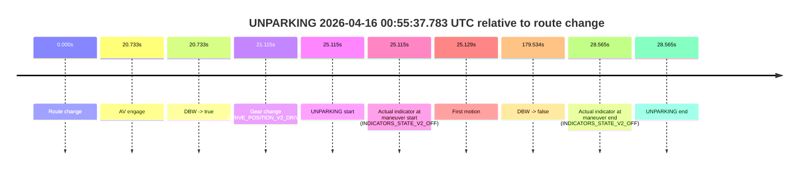
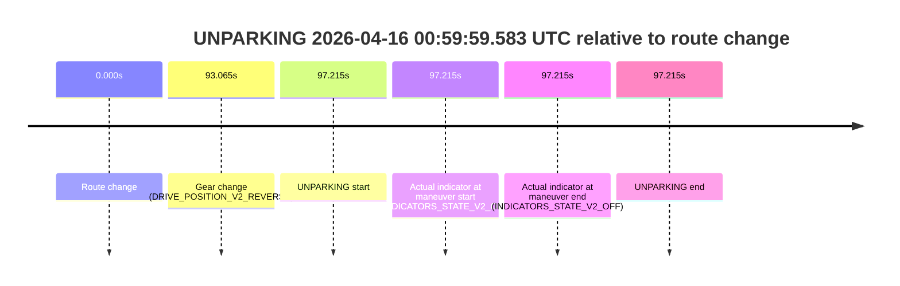

# Run Report: fme10005/2026-04-15--23-23-57--gen2-av-d52b4232-57c2-47e9-9d37-5bff0a9b84b5

| Field | Value |
|---|---|
| Run ID | `fme10005/2026-04-15--23-23-57--gen2-av-d52b4232-57c2-47e9-9d37-5bff0a9b84b5` |
| Date | `2026-04-15` |
| Model(s) | `armadillo-amethyst-squeaky` |
| Author | `guy.geva` |
| Event count | `2` |

## unparking 2026-04-16 00:55:37.783 UTC

| Field | Value |
|---|---|
| Model | `armadillo-amethyst-squeaky` |
| Author | `guy.geva` |
| Run ID | `fme10005/2026-04-15--23-23-57--gen2-av-d52b4232-57c2-47e9-9d37-5bff0a9b84b5` |
| Date | `2026-04-15` |
| Time (UTC) | `00:55:37.783` |
| Event type | `unparking` |
| Disengagement type | `none observed` |
| Route change | `found` |
| Console | [run](https://console.sso.wayve.ai/run/fme10005/2026-04-15--23-23-57--gen2-av-d52b4232-57c2-47e9-9d37-5bff0a9b84b5?id=&time-unixus=1776300937783296) |
| Foxglove | [segment](https://app.foxglove.dev/wayve-on-prem/p/prj_0dX18KZdVHg1fmmI/view?ds=foxglove-stream&ds.deviceName=fme10005&ds.start=2026-04-16T00%3A55%3A02.668310Z&ds.end=2026-04-16T00%3A58%3A22.202553Z&layoutId=lay_0e7VD4WIKDQGU73Y&time=2026-04-16T00%3A55%3A37.783296Z) |

### Event card: pass

- Pass: AV owns the credited unparking through the official event window, the gear state is aligned at the anchor, and the vehicle moves without driver accelerator help in AV.

| Event | Time (UTC) | Delta from route change |
|---|---:|---:|
| Route change | 2026-04-16 00:55:12.668 | `0.000s` |
| AV engage | 2026-04-16 00:55:33.401 | `20.733s` |
| DBW -> true | 2026-04-16 00:55:33.401 | `20.733s` |
| Gear change (DRIVE_POSITION_V2_DRIVE) | 2026-04-16 00:55:33.783 | `21.115s` |
| UNPARKING start | 2026-04-16 00:55:37.783 | `25.115s` |
| Actual indicator at maneuver start (INDICATORS_STATE_V2_OFF) | 2026-04-16 00:55:37.783 | `25.115s` |
| First motion | 2026-04-16 00:55:37.797 | `25.129s` |
| DBW -> false | 2026-04-16 00:58:12.202 | `179.534s` |
| Actual indicator at maneuver end (INDICATORS_STATE_V2_OFF) | 2026-04-16 00:55:41.233 | `28.565s` |
| UNPARKING end | 2026-04-16 00:55:41.233 | `28.565s` |

| Metric | Value |
|---|---|
| Outcome | `pass` |
| Effective failure type | `none` |
| Route change status | `found` |
| DBW at event start | `true` |
| DBW at event end | `true` |
| Predicted gear at AV start | `DRIVE_POSITION_V2_DRIVE` |
| Actual gear at AV start | `DRIVE_POSITION_V2_PARK` |
| Predicted gear at event start | `DRIVE_POSITION_V2_DRIVE` |
| Actual gear at event start | `DRIVE_POSITION_V2_DRIVE` |
| Planned indicator direction | `INDICATORS_STATE_V2_LEFT_ON` |
| Controller indicator direction | `INDICATORS_STATE_V2_LEFT_ON` |
| Actual indicator direction | `INDICATORS_STATE_V2_OFF` |
| Actual indicator at maneuver end | `INDICATORS_STATE_V2_OFF` |
| Driver accel help in AV | `false` |
| Driver accel help timestamp | `n/a` |
| Max accel pedal pct in AV | `0.0%` |
| Max brake pedal pct in AV | `8.0%` |
| Max speed mps in AV | `4.728` |
| Route -> AV | `20.733s` |
| AV -> event start | `4.382s` |
| AV -> first motion | `4.396s` |
| AV duration before disengagement | `158.801s` |
| Trajectory waypoint count | `37` |
| Driving-plan step count | `11` |

The scored portion starts from the AV-owned window, not from the pre-AV setup. Route-change search in the stopped pre-event segment was `found`, with the baseline therefore set to route change. At the event anchor the model predicts `DRIVE_POSITION_V2_DRIVE` and the actual gear is `DRIVE_POSITION_V2_DRIVE`. The effective model outcome is `pass` because `the credited maneuver stays AV-owned through the official event end`.

### Resolution

| Field | Value |
|---|---|
| Final outcome | `pass` |
| Do we agree with this label? | `yes` |
| Source disengagement type | `none observed` |
| Resolved effective failure type | `none` |
| Confidence | `high` |

## unparking 2026-04-16 00:59:59.583 UTC

| Field | Value |
|---|---|
| Model | `armadillo-amethyst-squeaky` |
| Author | `guy.geva` |
| Run ID | `fme10005/2026-04-15--23-23-57--gen2-av-d52b4232-57c2-47e9-9d37-5bff0a9b84b5` |
| Date | `2026-04-15` |
| Time (UTC) | `00:59:59.583` |
| Event type | `unparking` |
| Disengagement type | `none observed` |
| Route change | `found` |
| Console | [run](https://console.sso.wayve.ai/run/fme10005/2026-04-15--23-23-57--gen2-av-d52b4232-57c2-47e9-9d37-5bff0a9b84b5?id=&time-unixus=1776301199583301) |
| Foxglove | [segment](https://app.foxglove.dev/wayve-on-prem/p/prj_0dX18KZdVHg1fmmI/view?ds=foxglove-stream&ds.deviceName=fme10005&ds.start=2026-04-16T00%3A58%3A12.368594Z&ds.end=2026-04-16T01%3A00%3A09.583301Z&layoutId=lay_0e7VD4WIKDQGU73Y&time=2026-04-16T00%3A59%3A59.583301Z) |

### Event card: non-av

- Non-AV: the detected unparking starts outside AV ownership, so it is kept for coverage but excluded from model success / failure scoring.

| Event | Time (UTC) | Delta from route change |
|---|---:|---:|
| Route change | 2026-04-16 00:58:22.368 | `0.000s` |
| Gear change (DRIVE_POSITION_V2_REVERSE) | 2026-04-16 00:59:55.433 | `93.065s` |
| UNPARKING start | 2026-04-16 00:59:59.583 | `97.215s` |
| Actual indicator at maneuver start (INDICATORS_STATE_V2_OFF) | 2026-04-16 00:59:59.583 | `97.215s` |
| Actual indicator at maneuver end (INDICATORS_STATE_V2_OFF) | 2026-04-16 00:59:59.583 | `97.215s` |
| UNPARKING end | 2026-04-16 00:59:59.583 | `97.215s` |

| Metric | Value |
|---|---|
| Outcome | `non-av` |
| Effective failure type | `none` |
| Route change status | `found` |
| DBW at event start | `false` |
| DBW at event end | `false` |
| Predicted gear at AV start | `n/a` |
| Actual gear at AV start | `n/a` |
| Predicted gear at event start | `DRIVE_POSITION_V2_REVERSE` |
| Actual gear at event start | `DRIVE_POSITION_V2_REVERSE` |
| Planned indicator direction | `INDICATORS_STATE_V2_OFF` |
| Controller indicator direction | `INDICATORS_STATE_V2_OFF` |
| Actual indicator direction | `INDICATORS_STATE_V2_OFF` |
| Actual indicator at maneuver end | `INDICATORS_STATE_V2_OFF` |
| Driver accel help in AV | `false` |
| Driver accel help timestamp | `n/a` |
| Max accel pedal pct in AV | `0.0%` |
| Max brake pedal pct in AV | `0.0%` |
| Max speed mps in AV | `0.000` |
| Route -> AV | `n/a` |
| AV -> event start | `n/a` |
| AV -> first motion | `n/a` |
| AV duration before disengagement | `n/a` |
| Trajectory waypoint count | `37` |
| Driving-plan step count | `11` |

The scored portion starts from the AV-owned window, not from the pre-AV setup. Route-change search in the stopped pre-event segment was `found`, with the baseline therefore set to route change. At the event anchor the model predicts `DRIVE_POSITION_V2_REVERSE` and the actual gear is `DRIVE_POSITION_V2_REVERSE`. The effective model outcome is `non-av` because `the event does not begin in AV ownership`.

### Resolution

| Field | Value |
|---|---|
| Final outcome | `non-av` |
| Do we agree with this label? | `yes` |
| Source disengagement type | `none observed` |
| Resolved effective failure type | `none` |
| Confidence | `high` |
