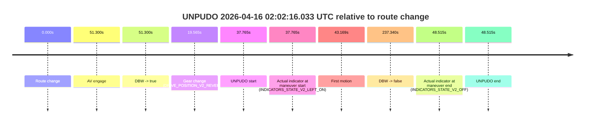
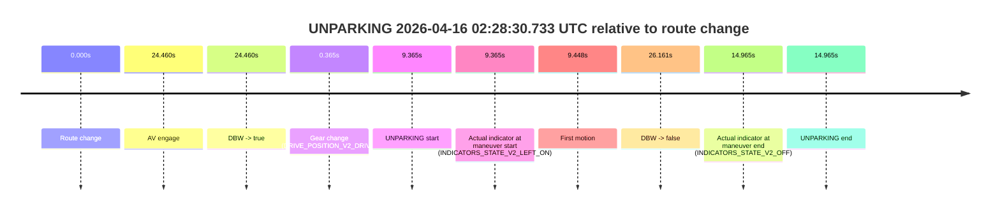

# Run Report: fme10005/2026-04-16--01-23-35--gen2-av-08afed03-dd0b-44a6-87f1-66e1432f863d

| Field | Value |
|---|---|
| Run ID | `fme10005/2026-04-16--01-23-35--gen2-av-08afed03-dd0b-44a6-87f1-66e1432f863d` |
| Date | `2026-04-16` |
| Model(s) | `plum-timeless-beaver` |
| Author | `peng.tang` |
| Event count | `6` |

## unpudo 2026-04-16 01:54:23.683 UTC

| Field | Value |
|---|---|
| Model | `plum-timeless-beaver` |
| Author | `peng.tang` |
| Run ID | `fme10005/2026-04-16--01-23-35--gen2-av-08afed03-dd0b-44a6-87f1-66e1432f863d` |
| Date | `2026-04-16` |
| Time (UTC) | `01:54:23.683` |
| Event type | `unpudo` |
| Disengagement type | `failed_to_unpudo` |
| Route change | `found` |
| Console | [run](https://console.sso.wayve.ai/run/fme10005/2026-04-16--01-23-35--gen2-av-08afed03-dd0b-44a6-87f1-66e1432f863d?id=&time-unixus=1776304463683299) |
| Foxglove | [segment](https://app.foxglove.dev/wayve-on-prem/p/prj_0dX18KZdVHg1fmmI/view?ds=foxglove-stream&ds.deviceName=fme10005&ds.start=2026-04-16T01%3A53%3A37.468247Z&ds.end=2026-04-16T01%3A54%3A49.809540Z&layoutId=lay_0e7VD4WIKDQGU73Y&time=2026-04-16T01%3A54%3A23.683299Z) |

### Event card: accidental

- Accidental: AV ownership is present for less than `2s`, so this is treated as an accidental brush with the maneuver rather than a meaningful model attempt.

| Event | Time (UTC) | Delta from route change |
|---|---:|---:|
| Route change | 2026-04-16 01:53:47.468 | `0.000s` |
| AV engage | 2026-04-16 01:54:32.009 | `44.541s` |
| DBW -> true | 2026-04-16 01:54:32.009 | `44.541s` |
| Gear change (DRIVE_POSITION_V2_DRIVE) | 2026-04-16 01:54:01.383 | `13.915s` |
| UNPUDO start | 2026-04-16 01:54:23.683 | `36.215s` |
| Actual indicator at maneuver start (INDICATORS_STATE_V2_LEFT_ON) | 2026-04-16 01:54:23.683 | `36.215s` |
| First motion | 2026-04-16 01:54:23.817 | `36.349s` |
| DBW -> false | 2026-04-16 01:54:39.809 | `52.341s` |
| Actual indicator at maneuver end (INDICATORS_STATE_V2_OFF) | 2026-04-16 01:54:28.733 | `41.265s` |
| UNPUDO end | 2026-04-16 01:54:28.733 | `41.265s` |

| Metric | Value |
|---|---|
| Outcome | `accidental` |
| Effective failure type | `none` |
| Route change status | `found` |
| DBW at event start | `false` |
| DBW at event end | `false` |
| Predicted gear at AV start | `DRIVE_POSITION_V2_DRIVE` |
| Actual gear at AV start | `DRIVE_POSITION_V2_DRIVE` |
| Predicted gear at event start | `DRIVE_POSITION_V2_DRIVE` |
| Actual gear at event start | `DRIVE_POSITION_V2_DRIVE` |
| Planned indicator direction | `INDICATORS_STATE_V2_LEFT_ON` |
| Controller indicator direction | `INDICATORS_STATE_V2_LEFT_ON` |
| Actual indicator direction | `INDICATORS_STATE_V2_LEFT_ON` |
| Actual indicator at maneuver end | `INDICATORS_STATE_V2_OFF` |
| Driver accel help in AV | `false` |
| Driver accel help timestamp | `n/a` |
| Max accel pedal pct in AV | `0.0%` |
| Max brake pedal pct in AV | `0.0%` |
| Max speed mps in AV | `0.000` |
| Route -> AV | `44.541s` |
| AV -> event start | `-8.326s` |
| AV -> first motion | `-8.192s` |
| AV duration before disengagement | `7.800s` |
| Trajectory waypoint count | `37` |
| Driving-plan step count | `11` |

The scored portion starts from the AV-owned window, not from the pre-AV setup. Route-change search in the stopped pre-event segment was `found`, with the baseline therefore set to route change. At the event anchor the model predicts `DRIVE_POSITION_V2_DRIVE` and the actual gear is `DRIVE_POSITION_V2_DRIVE`. The effective model outcome is `accidental` because `the AV-owned portion is shorter than 2s`.

### Resolution

| Field | Value |
|---|---|
| Final outcome | `accidental` |
| Do we agree with this label? | `yes` |
| Source disengagement type | `failed_to_unpudo` |
| Resolved effective failure type | `none` |
| Confidence | `high` |

## unpudo 2026-04-16 01:55:39.183 UTC

| Field | Value |
|---|---|
| Model | `plum-timeless-beaver` |
| Author | `peng.tang` |
| Run ID | `fme10005/2026-04-16--01-23-35--gen2-av-08afed03-dd0b-44a6-87f1-66e1432f863d` |
| Date | `2026-04-16` |
| Time (UTC) | `01:55:39.183` |
| Event type | `unpudo` |
| Disengagement type | `failed_to_unpudo` |
| Route change | `found` |
| Console | [run](https://console.sso.wayve.ai/run/fme10005/2026-04-16--01-23-35--gen2-av-08afed03-dd0b-44a6-87f1-66e1432f863d?id=&time-unixus=1776304539183299) |
| Foxglove | [segment](https://app.foxglove.dev/wayve-on-prem/p/prj_0dX18KZdVHg1fmmI/view?ds=foxglove-stream&ds.deviceName=fme10005&ds.start=2026-04-16T01%3A53%3A37.468247Z&ds.end=2026-04-16T01%3A58%3A01.688699Z&layoutId=lay_0e7VD4WIKDQGU73Y&time=2026-04-16T01%3A55%3A39.183299Z) |

### Event card: accidental

- Accidental: AV ownership is present for less than `2s`, so this is treated as an accidental brush with the maneuver rather than a meaningful model attempt.

| Event | Time (UTC) | Delta from route change |
|---|---:|---:|
| Route change | 2026-04-16 01:53:47.468 | `0.000s` |
| AV engage | 2026-04-16 01:55:57.648 | `130.180s` |
| DBW -> true | 2026-04-16 01:55:57.648 | `130.180s` |
| Gear change (DRIVE_POSITION_V2_DRIVE) | 2026-04-16 01:55:26.083 | `98.615s` |
| UNPUDO start | 2026-04-16 01:55:39.183 | `111.715s` |
| Actual indicator at maneuver start (INDICATORS_STATE_V2_OFF) | 2026-04-16 01:55:39.183 | `111.715s` |
| First motion | 2026-04-16 01:55:39.256 | `111.789s` |
| DBW -> false | 2026-04-16 01:57:51.688 | `244.220s` |
| Actual indicator at maneuver end (INDICATORS_STATE_V2_OFF) | 2026-04-16 01:55:42.633 | `115.165s` |
| UNPUDO end | 2026-04-16 01:55:42.633 | `115.165s` |

| Metric | Value |
|---|---|
| Outcome | `accidental` |
| Effective failure type | `none` |
| Route change status | `found` |
| DBW at event start | `false` |
| DBW at event end | `false` |
| Predicted gear at AV start | `DRIVE_POSITION_V2_DRIVE` |
| Actual gear at AV start | `DRIVE_POSITION_V2_DRIVE` |
| Predicted gear at event start | `DRIVE_POSITION_V2_DRIVE` |
| Actual gear at event start | `DRIVE_POSITION_V2_DRIVE` |
| Planned indicator direction | `INDICATORS_STATE_V2_LEFT_ON` |
| Controller indicator direction | `INDICATORS_STATE_V2_LEFT_ON` |
| Actual indicator direction | `INDICATORS_STATE_V2_OFF` |
| Actual indicator at maneuver end | `INDICATORS_STATE_V2_OFF` |
| Driver accel help in AV | `false` |
| Driver accel help timestamp | `n/a` |
| Max accel pedal pct in AV | `0.0%` |
| Max brake pedal pct in AV | `0.0%` |
| Max speed mps in AV | `0.000` |
| Route -> AV | `130.180s` |
| AV -> event start | `-18.465s` |
| AV -> first motion | `-18.391s` |
| AV duration before disengagement | `114.040s` |
| Trajectory waypoint count | `37` |
| Driving-plan step count | `11` |

The scored portion starts from the AV-owned window, not from the pre-AV setup. Route-change search in the stopped pre-event segment was `found`, with the baseline therefore set to route change. At the event anchor the model predicts `DRIVE_POSITION_V2_DRIVE` and the actual gear is `DRIVE_POSITION_V2_DRIVE`. The effective model outcome is `accidental` because `the AV-owned portion is shorter than 2s`.

### Resolution

| Field | Value |
|---|---|
| Final outcome | `accidental` |
| Do we agree with this label? | `yes` |
| Source disengagement type | `failed_to_unpudo` |
| Resolved effective failure type | `none` |
| Confidence | `high` |

## unpudo 2026-04-16 02:02:16.033 UTC

| Field | Value |
|---|---|
| Model | `plum-timeless-beaver` |
| Author | `peng.tang` |
| Run ID | `fme10005/2026-04-16--01-23-35--gen2-av-08afed03-dd0b-44a6-87f1-66e1432f863d` |
| Date | `2026-04-16` |
| Time (UTC) | `02:02:16.033` |
| Event type | `unpudo` |
| Disengagement type | `failed_to_unpudo` |
| Route change | `found` |
| Console | [run](https://console.sso.wayve.ai/run/fme10005/2026-04-16--01-23-35--gen2-av-08afed03-dd0b-44a6-87f1-66e1432f863d?id=&time-unixus=1776304936033312) |
| Foxglove | [segment](https://app.foxglove.dev/wayve-on-prem/p/prj_0dX18KZdVHg1fmmI/view?ds=foxglove-stream&ds.deviceName=fme10005&ds.start=2026-04-16T02%3A01%3A28.268255Z&ds.end=2026-04-16T02%3A05%3A45.608251Z&layoutId=lay_0e7VD4WIKDQGU73Y&time=2026-04-16T02%3A02%3A16.033312Z) |

### Event card: accidental

- Accidental: AV ownership is present for less than `2s`, so this is treated as an accidental brush with the maneuver rather than a meaningful model attempt.

| Event | Time (UTC) | Delta from route change |
|---|---:|---:|
| Route change | 2026-04-16 02:01:38.268 | `0.000s` |
| AV engage | 2026-04-16 02:02:29.568 | `51.300s` |
| DBW -> true | 2026-04-16 02:02:29.568 | `51.300s` |
| Gear change (DRIVE_POSITION_V2_REVERSE) | 2026-04-16 02:01:57.833 | `19.565s` |
| UNPUDO start | 2026-04-16 02:02:16.033 | `37.765s` |
| Actual indicator at maneuver start (INDICATORS_STATE_V2_LEFT_ON) | 2026-04-16 02:02:16.033 | `37.765s` |
| First motion | 2026-04-16 02:02:21.436 | `43.169s` |
| DBW -> false | 2026-04-16 02:05:35.608 | `237.340s` |
| Actual indicator at maneuver end (INDICATORS_STATE_V2_OFF) | 2026-04-16 02:02:26.783 | `48.515s` |
| UNPUDO end | 2026-04-16 02:02:26.783 | `48.515s` |

| Metric | Value |
|---|---|
| Outcome | `accidental` |
| Effective failure type | `none` |
| Route change status | `found` |
| DBW at event start | `false` |
| DBW at event end | `false` |
| Predicted gear at AV start | `DRIVE_POSITION_V2_DRIVE` |
| Actual gear at AV start | `DRIVE_POSITION_V2_DRIVE` |
| Predicted gear at event start | `DRIVE_POSITION_V2_REVERSE` |
| Actual gear at event start | `DRIVE_POSITION_V2_REVERSE` |
| Planned indicator direction | `INDICATORS_STATE_V2_OFF` |
| Controller indicator direction | `INDICATORS_STATE_V2_OFF` |
| Actual indicator direction | `INDICATORS_STATE_V2_LEFT_ON` |
| Actual indicator at maneuver end | `INDICATORS_STATE_V2_OFF` |
| Driver accel help in AV | `false` |
| Driver accel help timestamp | `n/a` |
| Max accel pedal pct in AV | `0.0%` |
| Max brake pedal pct in AV | `0.0%` |
| Max speed mps in AV | `0.000` |
| Route -> AV | `51.300s` |
| AV -> event start | `-13.535s` |
| AV -> first motion | `-8.131s` |
| AV duration before disengagement | `186.040s` |
| Trajectory waypoint count | `36` |
| Driving-plan step count | `11` |

The scored portion starts from the AV-owned window, not from the pre-AV setup. Route-change search in the stopped pre-event segment was `found`, with the baseline therefore set to route change. At the event anchor the model predicts `DRIVE_POSITION_V2_REVERSE` and the actual gear is `DRIVE_POSITION_V2_REVERSE`. The effective model outcome is `accidental` because `the AV-owned portion is shorter than 2s`.

### Resolution

| Field | Value |
|---|---|
| Final outcome | `accidental` |
| Do we agree with this label? | `yes` |
| Source disengagement type | `failed_to_unpudo` |
| Resolved effective failure type | `none` |
| Confidence | `high` |

## unpudo 2026-04-16 02:06:52.733 UTC

| Field | Value |
|---|---|
| Model | `plum-timeless-beaver` |
| Author | `peng.tang` |
| Run ID | `fme10005/2026-04-16--01-23-35--gen2-av-08afed03-dd0b-44a6-87f1-66e1432f863d` |
| Date | `2026-04-16` |
| Time (UTC) | `02:06:52.733` |
| Event type | `unpudo` |
| Disengagement type | `failed_to_unpudo` |
| Route change | `found` |
| Console | [run](https://console.sso.wayve.ai/run/fme10005/2026-04-16--01-23-35--gen2-av-08afed03-dd0b-44a6-87f1-66e1432f863d?id=&time-unixus=1776305212733317) |
| Foxglove | [segment](https://app.foxglove.dev/wayve-on-prem/p/prj_0dX18KZdVHg1fmmI/view?ds=foxglove-stream&ds.deviceName=fme10005&ds.start=2026-04-16T02%3A06%3A10.568350Z&ds.end=2026-04-16T02%3A07%3A54.568394Z&layoutId=lay_0e7VD4WIKDQGU73Y&time=2026-04-16T02%3A06%3A52.733317Z) |

### Event card: accidental

- Accidental: AV ownership is present for less than `2s`, so this is treated as an accidental brush with the maneuver rather than a meaningful model attempt.

| Event | Time (UTC) | Delta from route change |
|---|---:|---:|
| Route change | 2026-04-16 02:06:20.568 | `0.000s` |
| AV engage | 2026-04-16 02:07:03.868 | `43.300s` |
| DBW -> true | 2026-04-16 02:07:03.868 | `43.300s` |
| Gear change (DRIVE_POSITION_V2_DRIVE) | 2026-04-16 02:06:42.933 | `22.365s` |
| UNPUDO start | 2026-04-16 02:06:52.733 | `32.165s` |
| Actual indicator at maneuver start (INDICATORS_STATE_V2_LEFT_ON) | 2026-04-16 02:06:52.733 | `32.165s` |
| First motion | 2026-04-16 02:06:52.876 | `32.309s` |
| DBW -> false | 2026-04-16 02:07:44.568 | `84.000s` |
| Actual indicator at maneuver end (INDICATORS_STATE_V2_OFF) | 2026-04-16 02:06:58.433 | `37.865s` |
| UNPUDO end | 2026-04-16 02:06:58.433 | `37.865s` |

| Metric | Value |
|---|---|
| Outcome | `accidental` |
| Effective failure type | `none` |
| Route change status | `found` |
| DBW at event start | `false` |
| DBW at event end | `false` |
| Predicted gear at AV start | `DRIVE_POSITION_V2_DRIVE` |
| Actual gear at AV start | `DRIVE_POSITION_V2_DRIVE` |
| Predicted gear at event start | `DRIVE_POSITION_V2_DRIVE` |
| Actual gear at event start | `DRIVE_POSITION_V2_DRIVE` |
| Planned indicator direction | `INDICATORS_STATE_V2_LEFT_ON` |
| Controller indicator direction | `INDICATORS_STATE_V2_LEFT_ON` |
| Actual indicator direction | `INDICATORS_STATE_V2_LEFT_ON` |
| Actual indicator at maneuver end | `INDICATORS_STATE_V2_OFF` |
| Driver accel help in AV | `false` |
| Driver accel help timestamp | `n/a` |
| Max accel pedal pct in AV | `0.0%` |
| Max brake pedal pct in AV | `0.0%` |
| Max speed mps in AV | `0.000` |
| Route -> AV | `43.300s` |
| AV -> event start | `-11.135s` |
| AV -> first motion | `-10.991s` |
| AV duration before disengagement | `40.700s` |
| Trajectory waypoint count | `36` |
| Driving-plan step count | `11` |

The scored portion starts from the AV-owned window, not from the pre-AV setup. Route-change search in the stopped pre-event segment was `found`, with the baseline therefore set to route change. At the event anchor the model predicts `DRIVE_POSITION_V2_DRIVE` and the actual gear is `DRIVE_POSITION_V2_DRIVE`. The effective model outcome is `accidental` because `the AV-owned portion is shorter than 2s`.

### Resolution

| Field | Value |
|---|---|
| Final outcome | `accidental` |
| Do we agree with this label? | `yes` |
| Source disengagement type | `failed_to_unpudo` |
| Resolved effective failure type | `none` |
| Confidence | `high` |

## unpudo 2026-04-16 02:26:35.133 UTC

| Field | Value |
|---|---|
| Model | `plum-timeless-beaver` |
| Author | `peng.tang` |
| Run ID | `fme10005/2026-04-16--01-23-35--gen2-av-08afed03-dd0b-44a6-87f1-66e1432f863d` |
| Date | `2026-04-16` |
| Time (UTC) | `02:26:35.133` |
| Event type | `unpudo` |
| Disengagement type | `failed_to_unpudo` |
| Route change | `found` |
| Console | [run](https://console.sso.wayve.ai/run/fme10005/2026-04-16--01-23-35--gen2-av-08afed03-dd0b-44a6-87f1-66e1432f863d?id=&time-unixus=1776306395133307) |
| Foxglove | [segment](https://app.foxglove.dev/wayve-on-prem/p/prj_0dX18KZdVHg1fmmI/view?ds=foxglove-stream&ds.deviceName=fme10005&ds.start=2026-04-16T02%3A26%3A05.168263Z&ds.end=2026-04-16T02%3A28%3A39.749514Z&layoutId=lay_0e7VD4WIKDQGU73Y&time=2026-04-16T02%3A26%3A35.133307Z) |

### Event card: accidental

- Accidental: AV ownership is present for less than `2s`, so this is treated as an accidental brush with the maneuver rather than a meaningful model attempt.

| Event | Time (UTC) | Delta from route change |
|---|---:|---:|
| Route change | 2026-04-16 02:26:15.168 | `0.000s` |
| AV engage | 2026-04-16 02:26:40.988 | `25.820s` |
| DBW -> true | 2026-04-16 02:26:40.988 | `25.820s` |
| Gear change (DRIVE_POSITION_V2_DRIVE) | 2026-04-16 02:26:30.333 | `15.165s` |
| UNPUDO start | 2026-04-16 02:26:35.133 | `19.965s` |
| Actual indicator at maneuver start (INDICATORS_STATE_V2_OFF) | 2026-04-16 02:26:35.133 | `19.965s` |
| First motion | 2026-04-16 02:26:35.177 | `20.009s` |
| DBW -> false | 2026-04-16 02:28:29.749 | `134.581s` |
| Actual indicator at maneuver end (INDICATORS_STATE_V2_OFF) | 2026-04-16 02:26:38.533 | `23.365s` |
| UNPUDO end | 2026-04-16 02:26:38.533 | `23.365s` |

| Metric | Value |
|---|---|
| Outcome | `accidental` |
| Effective failure type | `none` |
| Route change status | `found` |
| DBW at event start | `false` |
| DBW at event end | `false` |
| Predicted gear at AV start | `DRIVE_POSITION_V2_DRIVE` |
| Actual gear at AV start | `DRIVE_POSITION_V2_DRIVE` |
| Predicted gear at event start | `DRIVE_POSITION_V2_DRIVE` |
| Actual gear at event start | `DRIVE_POSITION_V2_DRIVE` |
| Planned indicator direction | `INDICATORS_STATE_V2_OFF` |
| Controller indicator direction | `INDICATORS_STATE_V2_OFF` |
| Actual indicator direction | `INDICATORS_STATE_V2_OFF` |
| Actual indicator at maneuver end | `INDICATORS_STATE_V2_OFF` |
| Driver accel help in AV | `false` |
| Driver accel help timestamp | `n/a` |
| Max accel pedal pct in AV | `0.0%` |
| Max brake pedal pct in AV | `0.0%` |
| Max speed mps in AV | `0.000` |
| Route -> AV | `25.820s` |
| AV -> event start | `-5.855s` |
| AV -> first motion | `-5.811s` |
| AV duration before disengagement | `108.761s` |
| Trajectory waypoint count | `37` |
| Driving-plan step count | `11` |

The scored portion starts from the AV-owned window, not from the pre-AV setup. Route-change search in the stopped pre-event segment was `found`, with the baseline therefore set to route change. At the event anchor the model predicts `DRIVE_POSITION_V2_DRIVE` and the actual gear is `DRIVE_POSITION_V2_DRIVE`. The effective model outcome is `accidental` because `the AV-owned portion is shorter than 2s`.

### Resolution

| Field | Value |
|---|---|
| Final outcome | `accidental` |
| Do we agree with this label? | `yes` |
| Source disengagement type | `failed_to_unpudo` |
| Resolved effective failure type | `none` |
| Confidence | `high` |

## unparking 2026-04-16 02:28:30.733 UTC

| Field | Value |
|---|---|
| Model | `plum-timeless-beaver` |
| Author | `peng.tang` |
| Run ID | `fme10005/2026-04-16--01-23-35--gen2-av-08afed03-dd0b-44a6-87f1-66e1432f863d` |
| Date | `2026-04-16` |
| Time (UTC) | `02:28:30.733` |
| Event type | `unparking` |
| Disengagement type | `failed_to_unpudo` |
| Route change | `found` |
| Console | [run](https://console.sso.wayve.ai/run/fme10005/2026-04-16--01-23-35--gen2-av-08afed03-dd0b-44a6-87f1-66e1432f863d?id=&time-unixus=1776306510733295) |
| Foxglove | [segment](https://app.foxglove.dev/wayve-on-prem/p/prj_0dX18KZdVHg1fmmI/view?ds=foxglove-stream&ds.deviceName=fme10005&ds.start=2026-04-16T02%3A28%3A11.368505Z&ds.end=2026-04-16T02%3A28%3A57.529185Z&layoutId=lay_0e7VD4WIKDQGU73Y&time=2026-04-16T02%3A28%3A30.733295Z) |

### Event card: accidental

- Accidental: AV ownership is present for less than `2s`, so this is treated as an accidental brush with the maneuver rather than a meaningful model attempt.

| Event | Time (UTC) | Delta from route change |
|---|---:|---:|
| Route change | 2026-04-16 02:28:21.368 | `0.000s` |
| AV engage | 2026-04-16 02:28:45.828 | `24.460s` |
| DBW -> true | 2026-04-16 02:28:45.828 | `24.460s` |
| Gear change (DRIVE_POSITION_V2_DRIVE) | 2026-04-16 02:28:21.733 | `0.365s` |
| UNPARKING start | 2026-04-16 02:28:30.733 | `9.365s` |
| Actual indicator at maneuver start (INDICATORS_STATE_V2_LEFT_ON) | 2026-04-16 02:28:30.733 | `9.365s` |
| First motion | 2026-04-16 02:28:30.816 | `9.448s` |
| DBW -> false | 2026-04-16 02:28:47.529 | `26.161s` |
| Actual indicator at maneuver end (INDICATORS_STATE_V2_OFF) | 2026-04-16 02:28:36.333 | `14.965s` |
| UNPARKING end | 2026-04-16 02:28:36.333 | `14.965s` |

| Metric | Value |
|---|---|
| Outcome | `accidental` |
| Effective failure type | `none` |
| Route change status | `found` |
| DBW at event start | `false` |
| DBW at event end | `false` |
| Predicted gear at AV start | `DRIVE_POSITION_V2_DRIVE` |
| Actual gear at AV start | `DRIVE_POSITION_V2_DRIVE` |
| Predicted gear at event start | `DRIVE_POSITION_V2_DRIVE` |
| Actual gear at event start | `DRIVE_POSITION_V2_DRIVE` |
| Planned indicator direction | `INDICATORS_STATE_V2_LEFT_ON` |
| Controller indicator direction | `INDICATORS_STATE_V2_LEFT_ON` |
| Actual indicator direction | `INDICATORS_STATE_V2_LEFT_ON` |
| Actual indicator at maneuver end | `INDICATORS_STATE_V2_OFF` |
| Driver accel help in AV | `false` |
| Driver accel help timestamp | `n/a` |
| Max accel pedal pct in AV | `0.0%` |
| Max brake pedal pct in AV | `0.0%` |
| Max speed mps in AV | `0.000` |
| Route -> AV | `24.460s` |
| AV -> event start | `-15.095s` |
| AV -> first motion | `-15.012s` |
| AV duration before disengagement | `1.701s` |
| Trajectory waypoint count | `36` |
| Driving-plan step count | `11` |

The scored portion starts from the AV-owned window, not from the pre-AV setup. Route-change search in the stopped pre-event segment was `found`, with the baseline therefore set to route change. At the event anchor the model predicts `DRIVE_POSITION_V2_DRIVE` and the actual gear is `DRIVE_POSITION_V2_DRIVE`. The effective model outcome is `accidental` because `the AV-owned portion is shorter than 2s`.

### Resolution

| Field | Value |
|---|---|
| Final outcome | `accidental` |
| Do we agree with this label? | `yes` |
| Source disengagement type | `failed_to_unpudo` |
| Resolved effective failure type | `none` |
| Confidence | `high` |
