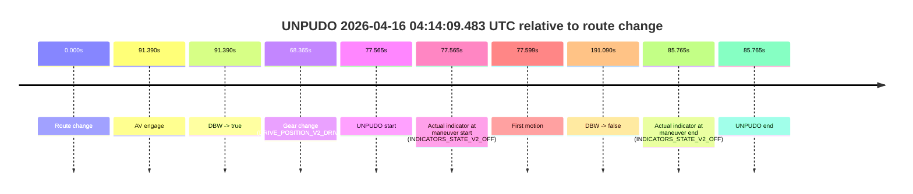
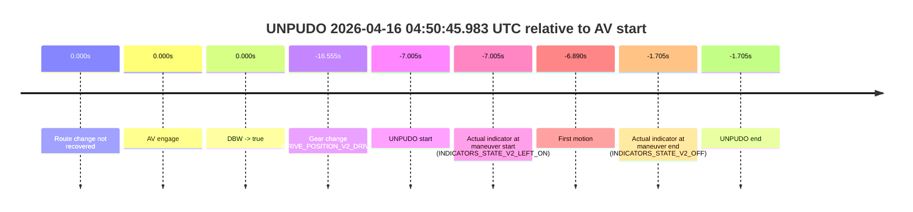

# Run Report: fme10005/2026-04-16--03-40-35--gen2-av-1d3748dd-c942-42b5-b365-b8cd63792359

| Field | Value |
|---|---|
| Run ID | `fme10005/2026-04-16--03-40-35--gen2-av-1d3748dd-c942-42b5-b365-b8cd63792359` |
| Date | `2026-04-16` |
| Model(s) | `apricot-crocodile-uproarious` |
| Author | `guy.geva` |
| Event count | `6` |

## unpudo 2026-04-16 03:56:27.833 UTC

| Field | Value |
|---|---|
| Model | `apricot-crocodile-uproarious` |
| Author | `guy.geva` |
| Run ID | `fme10005/2026-04-16--03-40-35--gen2-av-1d3748dd-c942-42b5-b365-b8cd63792359` |
| Date | `2026-04-16` |
| Time (UTC) | `03:56:27.833` |
| Event type | `unpudo` |
| Disengagement type | `failed_to_unpudo` |
| Route change | `found` |
| Console | [run](https://console.sso.wayve.ai/run/fme10005/2026-04-16--03-40-35--gen2-av-1d3748dd-c942-42b5-b365-b8cd63792359?id=&time-unixus=1776311787833294) |
| Foxglove | [segment](https://app.foxglove.dev/wayve-on-prem/p/prj_0dX18KZdVHg1fmmI/view?ds=foxglove-stream&ds.deviceName=fme10005&ds.start=2026-04-16T03%3A55%3A35.368258Z&ds.end=2026-04-16T03%3A57%3A47.848147Z&layoutId=lay_0e7VD4WIKDQGU73Y&time=2026-04-16T03%3A56%3A27.833294Z) |

### Event card: non-av

- Non-AV: there is no AV-owned portion anywhere inside the detected unpudo timeline, so it is kept for coverage but excluded from model success / failure scoring.

| Event | Time (UTC) | Delta from route change |
|---|---:|---:|
| Route change | 2026-04-16 03:55:45.368 | `0.000s` |
| AV engage | 2026-04-16 03:56:38.149 | `52.781s` |
| DBW -> true | 2026-04-16 03:56:38.149 | `52.781s` |
| Gear change (DRIVE_POSITION_V2_DRIVE) | 2026-04-16 03:56:02.083 | `16.715s` |
| UNPUDO start | 2026-04-16 03:56:27.833 | `42.465s` |
| Actual indicator at maneuver start (INDICATORS_STATE_V2_OFF) | 2026-04-16 03:56:27.833 | `42.465s` |
| First motion | 2026-04-16 03:56:27.977 | `42.609s` |
| DBW -> false | 2026-04-16 03:57:37.848 | `112.480s` |
| Actual indicator at maneuver end (INDICATORS_STATE_V2_OFF) | 2026-04-16 03:56:34.983 | `49.615s` |
| UNPUDO end | 2026-04-16 03:56:34.983 | `49.615s` |

| Metric | Value |
|---|---|
| Outcome | `non-av` |
| Effective failure type | `none` |
| Route change status | `found` |
| DBW at event start | `false` |
| DBW at event end | `false` |
| Predicted gear at AV start | `DRIVE_POSITION_V2_DRIVE` |
| Actual gear at AV start | `DRIVE_POSITION_V2_DRIVE` |
| Predicted gear at event start | `DRIVE_POSITION_V2_DRIVE` |
| Actual gear at event start | `DRIVE_POSITION_V2_DRIVE` |
| Planned indicator direction | `INDICATORS_STATE_V2_LEFT_ON` |
| Controller indicator direction | `INDICATORS_STATE_V2_LEFT_ON` |
| Actual indicator direction | `INDICATORS_STATE_V2_OFF` |
| Actual indicator at maneuver end | `INDICATORS_STATE_V2_OFF` |
| Driver accel help in AV | `false` |
| Driver accel help timestamp | `n/a` |
| Max accel pedal pct in AV | `0.0%` |
| Max brake pedal pct in AV | `0.0%` |
| Max speed mps in AV | `0.000` |
| Route -> AV | `52.781s` |
| AV -> event start | `-10.316s` |
| AV -> first motion | `-10.172s` |
| AV duration before disengagement | `59.699s` |
| Trajectory waypoint count | `36` |
| Driving-plan step count | `11` |

The scored portion starts from the AV-owned window, not from the pre-AV setup. Route-change search in the stopped pre-event segment was `found`, with the baseline therefore set to route change. At the event anchor the model predicts `DRIVE_POSITION_V2_DRIVE` and the actual gear is `DRIVE_POSITION_V2_DRIVE`. The effective model outcome is `non-av` because `there is no AV-owned overlap inside the event timeline`.

### Resolution

| Field | Value |
|---|---|
| Final outcome | `non-av` |
| Do we agree with this label? | `yes` |
| Source disengagement type | `failed_to_unpudo` |
| Resolved effective failure type | `none` |
| Confidence | `high` |

## unpudo 2026-04-16 04:06:24.483 UTC

| Field | Value |
|---|---|
| Model | `apricot-crocodile-uproarious` |
| Author | `guy.geva` |
| Run ID | `fme10005/2026-04-16--03-40-35--gen2-av-1d3748dd-c942-42b5-b365-b8cd63792359` |
| Date | `2026-04-16` |
| Time (UTC) | `04:06:24.483` |
| Event type | `unpudo` |
| Disengagement type | `failed_to_unpudo` |
| Route change | `found` |
| Console | [run](https://console.sso.wayve.ai/run/fme10005/2026-04-16--03-40-35--gen2-av-1d3748dd-c942-42b5-b365-b8cd63792359?id=&time-unixus=1776312384483297) |
| Foxglove | [segment](https://app.foxglove.dev/wayve-on-prem/p/prj_0dX18KZdVHg1fmmI/view?ds=foxglove-stream&ds.deviceName=fme10005&ds.start=2026-04-16T04%3A05%3A40.018276Z&ds.end=2026-04-16T04%3A08%3A09.048185Z&layoutId=lay_0e7VD4WIKDQGU73Y&time=2026-04-16T04%3A06%3A24.483297Z) |

### Event card: non-av

- Non-AV: there is no AV-owned portion anywhere inside the detected unpudo timeline, so it is kept for coverage but excluded from model success / failure scoring.

| Event | Time (UTC) | Delta from route change |
|---|---:|---:|
| Route change | 2026-04-16 04:05:50.018 | `0.000s` |
| AV engage | 2026-04-16 04:06:32.808 | `42.790s` |
| DBW -> true | 2026-04-16 04:06:32.808 | `42.790s` |
| Gear change (DRIVE_POSITION_V2_DRIVE) | 2026-04-16 04:06:06.583 | `16.565s` |
| UNPUDO start | 2026-04-16 04:06:24.483 | `34.465s` |
| Actual indicator at maneuver start (INDICATORS_STATE_V2_LEFT_ON) | 2026-04-16 04:06:24.483 | `34.465s` |
| First motion | 2026-04-16 04:06:24.497 | `34.479s` |
| DBW -> false | 2026-04-16 04:07:59.048 | `129.030s` |
| Actual indicator at maneuver end (INDICATORS_STATE_V2_OFF) | 2026-04-16 04:06:29.783 | `39.765s` |
| UNPUDO end | 2026-04-16 04:06:29.783 | `39.765s` |

| Metric | Value |
|---|---|
| Outcome | `non-av` |
| Effective failure type | `none` |
| Route change status | `found` |
| DBW at event start | `false` |
| DBW at event end | `false` |
| Predicted gear at AV start | `DRIVE_POSITION_V2_DRIVE` |
| Actual gear at AV start | `DRIVE_POSITION_V2_DRIVE` |
| Predicted gear at event start | `DRIVE_POSITION_V2_DRIVE` |
| Actual gear at event start | `DRIVE_POSITION_V2_DRIVE` |
| Planned indicator direction | `INDICATORS_STATE_V2_LEFT_ON` |
| Controller indicator direction | `INDICATORS_STATE_V2_LEFT_ON` |
| Actual indicator direction | `INDICATORS_STATE_V2_LEFT_ON` |
| Actual indicator at maneuver end | `INDICATORS_STATE_V2_OFF` |
| Driver accel help in AV | `false` |
| Driver accel help timestamp | `n/a` |
| Max accel pedal pct in AV | `0.0%` |
| Max brake pedal pct in AV | `0.0%` |
| Max speed mps in AV | `0.000` |
| Route -> AV | `42.790s` |
| AV -> event start | `-8.325s` |
| AV -> first motion | `-8.311s` |
| AV duration before disengagement | `86.240s` |
| Trajectory waypoint count | `37` |
| Driving-plan step count | `11` |

The scored portion starts from the AV-owned window, not from the pre-AV setup. Route-change search in the stopped pre-event segment was `found`, with the baseline therefore set to route change. At the event anchor the model predicts `DRIVE_POSITION_V2_DRIVE` and the actual gear is `DRIVE_POSITION_V2_DRIVE`. The effective model outcome is `non-av` because `there is no AV-owned overlap inside the event timeline`.

### Resolution

| Field | Value |
|---|---|
| Final outcome | `non-av` |
| Do we agree with this label? | `yes` |
| Source disengagement type | `failed_to_unpudo` |
| Resolved effective failure type | `none` |
| Confidence | `high` |

## unpudo 2026-04-16 04:13:11.383 UTC

| Field | Value |
|---|---|
| Model | `apricot-crocodile-uproarious` |
| Author | `guy.geva` |
| Run ID | `fme10005/2026-04-16--03-40-35--gen2-av-1d3748dd-c942-42b5-b365-b8cd63792359` |
| Date | `2026-04-16` |
| Time (UTC) | `04:13:11.383` |
| Event type | `unpudo` |
| Disengagement type | `failed_to_unpudo` |
| Route change | `found` |
| Console | [run](https://console.sso.wayve.ai/run/fme10005/2026-04-16--03-40-35--gen2-av-1d3748dd-c942-42b5-b365-b8cd63792359?id=&time-unixus=1776312791383306) |
| Foxglove | [segment](https://app.foxglove.dev/wayve-on-prem/p/prj_0dX18KZdVHg1fmmI/view?ds=foxglove-stream&ds.deviceName=fme10005&ds.start=2026-04-16T04%3A11%3A07.268296Z&ds.end=2026-04-16T04%3A13%3A30.183303Z&layoutId=lay_0e7VD4WIKDQGU73Y&time=2026-04-16T04%3A13%3A11.383306Z) |

### Event card: fail

- Fail: AV owns part of the segment, but the event still resolves as a model-performance failure under the AV-only scoring rule.

| Event | Time (UTC) | Delta from route change |
|---|---:|---:|
| Route change | 2026-04-16 04:11:17.268 | `0.000s` |
| AV engage | 2026-04-16 04:13:05.168 | `107.900s` |
| DBW -> true | 2026-04-16 04:13:05.168 | `107.900s` |
| Gear change (DRIVE_POSITION_V2_DRIVE) | 2026-04-16 04:13:05.683 | `108.415s` |
| UNPUDO start | 2026-04-16 04:13:11.383 | `114.115s` |
| Actual indicator at maneuver start (INDICATORS_STATE_V2_OFF) | 2026-04-16 04:13:11.383 | `114.115s` |
| First motion | 2026-04-16 04:13:11.597 | `114.329s` |
| DBW -> false | 2026-04-16 04:13:16.447 | `119.179s` |
| Actual indicator at maneuver end (INDICATORS_STATE_V2_OFF) | 2026-04-16 04:13:20.183 | `122.915s` |
| UNPUDO end | 2026-04-16 04:13:20.183 | `122.915s` |

| Metric | Value |
|---|---|
| Outcome | `fail` |
| Effective failure type | `failed_to_unpudo` |
| Route change status | `found` |
| DBW at event start | `true` |
| DBW at event end | `false` |
| Predicted gear at AV start | `DRIVE_POSITION_V2_DRIVE` |
| Actual gear at AV start | `DRIVE_POSITION_V2_PARK` |
| Predicted gear at event start | `DRIVE_POSITION_V2_DRIVE` |
| Actual gear at event start | `DRIVE_POSITION_V2_DRIVE` |
| Planned indicator direction | `INDICATORS_STATE_V2_RIGHT_ON` |
| Controller indicator direction | `INDICATORS_STATE_V2_RIGHT_ON` |
| Actual indicator direction | `INDICATORS_STATE_V2_OFF` |
| Actual indicator at maneuver end | `INDICATORS_STATE_V2_OFF` |
| Driver accel help in AV | `false` |
| Driver accel help timestamp | `n/a` |
| Max accel pedal pct in AV | `0.0%` |
| Max brake pedal pct in AV | `20.5%` |
| Max speed mps in AV | `0.483` |
| Route -> AV | `107.900s` |
| AV -> event start | `6.215s` |
| AV -> first motion | `6.429s` |
| AV duration before disengagement | `11.279s` |
| Trajectory waypoint count | `37` |
| Driving-plan step count | `11` |

The scored portion starts from the AV-owned window, not from the pre-AV setup. Route-change search in the stopped pre-event segment was `found`, with the baseline therefore set to route change. At the event anchor the model predicts `DRIVE_POSITION_V2_DRIVE` and the actual gear is `DRIVE_POSITION_V2_DRIVE`. The effective model outcome is `fail` because `failed_to_unpudo`.

### Resolution

| Field | Value |
|---|---|
| Final outcome | `fail` |
| Do we agree with this label? | `yes` |
| Source disengagement type | `failed_to_unpudo` |
| Resolved effective failure type | `failed_to_unpudo` |
| Confidence | `high` |

## unpudo 2026-04-16 04:14:09.483 UTC

| Field | Value |
|---|---|
| Model | `apricot-crocodile-uproarious` |
| Author | `guy.geva` |
| Run ID | `fme10005/2026-04-16--03-40-35--gen2-av-1d3748dd-c942-42b5-b365-b8cd63792359` |
| Date | `2026-04-16` |
| Time (UTC) | `04:14:09.483` |
| Event type | `unpudo` |
| Disengagement type | `failed_to_unpudo` |
| Route change | `found` |
| Console | [run](https://console.sso.wayve.ai/run/fme10005/2026-04-16--03-40-35--gen2-av-1d3748dd-c942-42b5-b365-b8cd63792359?id=&time-unixus=1776312849483296) |
| Foxglove | [segment](https://app.foxglove.dev/wayve-on-prem/p/prj_0dX18KZdVHg1fmmI/view?ds=foxglove-stream&ds.deviceName=fme10005&ds.start=2026-04-16T04%3A12%3A41.918319Z&ds.end=2026-04-16T04%3A16%3A13.008188Z&layoutId=lay_0e7VD4WIKDQGU73Y&time=2026-04-16T04%3A14%3A09.483296Z) |

### Event card: non-av

- Non-AV: there is no AV-owned portion anywhere inside the detected unpudo timeline, so it is kept for coverage but excluded from model success / failure scoring.

| Event | Time (UTC) | Delta from route change |
|---|---:|---:|
| Route change | 2026-04-16 04:12:51.918 | `0.000s` |
| AV engage | 2026-04-16 04:14:23.308 | `91.390s` |
| DBW -> true | 2026-04-16 04:14:23.308 | `91.390s` |
| Gear change (DRIVE_POSITION_V2_DRIVE) | 2026-04-16 04:14:00.283 | `68.365s` |
| UNPUDO start | 2026-04-16 04:14:09.483 | `77.565s` |
| Actual indicator at maneuver start (INDICATORS_STATE_V2_OFF) | 2026-04-16 04:14:09.483 | `77.565s` |
| First motion | 2026-04-16 04:14:09.517 | `77.599s` |
| DBW -> false | 2026-04-16 04:16:03.008 | `191.090s` |
| Actual indicator at maneuver end (INDICATORS_STATE_V2_OFF) | 2026-04-16 04:14:17.683 | `85.765s` |
| UNPUDO end | 2026-04-16 04:14:17.683 | `85.765s` |

| Metric | Value |
|---|---|
| Outcome | `non-av` |
| Effective failure type | `none` |
| Route change status | `found` |
| DBW at event start | `false` |
| DBW at event end | `false` |
| Predicted gear at AV start | `DRIVE_POSITION_V2_DRIVE` |
| Actual gear at AV start | `DRIVE_POSITION_V2_DRIVE` |
| Predicted gear at event start | `DRIVE_POSITION_V2_REVERSE` |
| Actual gear at event start | `DRIVE_POSITION_V2_DRIVE` |
| Planned indicator direction | `INDICATORS_STATE_V2_RIGHT_ON` |
| Controller indicator direction | `INDICATORS_STATE_V2_RIGHT_ON` |
| Actual indicator direction | `INDICATORS_STATE_V2_OFF` |
| Actual indicator at maneuver end | `INDICATORS_STATE_V2_OFF` |
| Driver accel help in AV | `false` |
| Driver accel help timestamp | `n/a` |
| Max accel pedal pct in AV | `0.0%` |
| Max brake pedal pct in AV | `0.0%` |
| Max speed mps in AV | `0.000` |
| Route -> AV | `91.390s` |
| AV -> event start | `-13.825s` |
| AV -> first motion | `-13.791s` |
| AV duration before disengagement | `99.700s` |
| Trajectory waypoint count | `37` |
| Driving-plan step count | `11` |

The scored portion starts from the AV-owned window, not from the pre-AV setup. Route-change search in the stopped pre-event segment was `found`, with the baseline therefore set to route change. At the event anchor the model predicts `DRIVE_POSITION_V2_REVERSE` and the actual gear is `DRIVE_POSITION_V2_DRIVE`. The effective model outcome is `non-av` because `there is no AV-owned overlap inside the event timeline`.

### Resolution

| Field | Value |
|---|---|
| Final outcome | `non-av` |
| Do we agree with this label? | `yes` |
| Source disengagement type | `failed_to_unpudo` |
| Resolved effective failure type | `none` |
| Confidence | `high` |

## unpudo 2026-04-16 04:39:39.783 UTC

| Field | Value |
|---|---|
| Model | `apricot-crocodile-uproarious` |
| Author | `guy.geva` |
| Run ID | `fme10005/2026-04-16--03-40-35--gen2-av-1d3748dd-c942-42b5-b365-b8cd63792359` |
| Date | `2026-04-16` |
| Time (UTC) | `04:39:39.783` |
| Event type | `unpudo` |
| Disengagement type | `failed_to_unpudo` |
| Route change | `found` |
| Console | [run](https://console.sso.wayve.ai/run/fme10005/2026-04-16--03-40-35--gen2-av-1d3748dd-c942-42b5-b365-b8cd63792359?id=&time-unixus=1776314379783298) |
| Foxglove | [segment](https://app.foxglove.dev/wayve-on-prem/p/prj_0dX18KZdVHg1fmmI/view?ds=foxglove-stream&ds.deviceName=fme10005&ds.start=2026-04-16T04%3A39%3A04.668244Z&ds.end=2026-04-16T04%3A41%3A53.728153Z&layoutId=lay_0e7VD4WIKDQGU73Y&time=2026-04-16T04%3A39%3A39.783298Z) |

### Event card: non-av

- Non-AV: there is no AV-owned portion anywhere inside the detected unpudo timeline, so it is kept for coverage but excluded from model success / failure scoring.

| Event | Time (UTC) | Delta from route change |
|---|---:|---:|
| Route change | 2026-04-16 04:39:14.668 | `0.000s` |
| AV engage | 2026-04-16 04:39:51.029 | `36.361s` |
| DBW -> true | 2026-04-16 04:39:51.029 | `36.361s` |
| Gear change (DRIVE_POSITION_V2_DRIVE) | 2026-04-16 04:39:31.983 | `17.315s` |
| UNPUDO start | 2026-04-16 04:39:39.783 | `25.115s` |
| Actual indicator at maneuver start (INDICATORS_STATE_V2_OFF) | 2026-04-16 04:39:39.783 | `25.115s` |
| First motion | 2026-04-16 04:39:39.796 | `25.129s` |
| DBW -> false | 2026-04-16 04:41:43.728 | `149.060s` |
| Actual indicator at maneuver end (INDICATORS_STATE_V2_OFF) | 2026-04-16 04:39:43.333 | `28.665s` |
| UNPUDO end | 2026-04-16 04:39:43.333 | `28.665s` |

| Metric | Value |
|---|---|
| Outcome | `non-av` |
| Effective failure type | `none` |
| Route change status | `found` |
| DBW at event start | `false` |
| DBW at event end | `false` |
| Predicted gear at AV start | `DRIVE_POSITION_V2_DRIVE` |
| Actual gear at AV start | `DRIVE_POSITION_V2_DRIVE` |
| Predicted gear at event start | `DRIVE_POSITION_V2_DRIVE` |
| Actual gear at event start | `DRIVE_POSITION_V2_DRIVE` |
| Planned indicator direction | `INDICATORS_STATE_V2_LEFT_ON` |
| Controller indicator direction | `INDICATORS_STATE_V2_LEFT_ON` |
| Actual indicator direction | `INDICATORS_STATE_V2_OFF` |
| Actual indicator at maneuver end | `INDICATORS_STATE_V2_OFF` |
| Driver accel help in AV | `false` |
| Driver accel help timestamp | `n/a` |
| Max accel pedal pct in AV | `0.0%` |
| Max brake pedal pct in AV | `0.0%` |
| Max speed mps in AV | `0.000` |
| Route -> AV | `36.361s` |
| AV -> event start | `-11.246s` |
| AV -> first motion | `-11.232s` |
| AV duration before disengagement | `112.699s` |
| Trajectory waypoint count | `37` |
| Driving-plan step count | `11` |

The scored portion starts from the AV-owned window, not from the pre-AV setup. Route-change search in the stopped pre-event segment was `found`, with the baseline therefore set to route change. At the event anchor the model predicts `DRIVE_POSITION_V2_DRIVE` and the actual gear is `DRIVE_POSITION_V2_DRIVE`. The effective model outcome is `non-av` because `there is no AV-owned overlap inside the event timeline`.

### Resolution

| Field | Value |
|---|---|
| Final outcome | `non-av` |
| Do we agree with this label? | `yes` |
| Source disengagement type | `failed_to_unpudo` |
| Resolved effective failure type | `none` |
| Confidence | `high` |

## unpudo 2026-04-16 04:50:45.983 UTC

| Field | Value |
|---|---|
| Model | `apricot-crocodile-uproarious` |
| Author | `guy.geva` |
| Run ID | `fme10005/2026-04-16--03-40-35--gen2-av-1d3748dd-c942-42b5-b365-b8cd63792359` |
| Date | `2026-04-16` |
| Time (UTC) | `04:50:45.983` |
| Event type | `unpudo` |
| Disengagement type | `failed_to_unpudo` |
| Route change | `not found` |
| Console | [run](https://console.sso.wayve.ai/run/fme10005/2026-04-16--03-40-35--gen2-av-1d3748dd-c942-42b5-b365-b8cd63792359?id=&time-unixus=1776315045983300) |
| Foxglove | [segment](https://app.foxglove.dev/wayve-on-prem/p/prj_0dX18KZdVHg1fmmI/view?ds=foxglove-stream&ds.deviceName=fme10005&ds.start=2026-04-16T04%3A50%3A26.433292Z&ds.end=2026-04-16T04%3A51%3A01.283309Z&layoutId=lay_0e7VD4WIKDQGU73Y&time=2026-04-16T04%3A50%3A45.983300Z) |

### Event card: non-av

- Non-AV: there is no AV-owned portion anywhere inside the detected unpudo timeline, so it is kept for coverage but excluded from model success / failure scoring.

| Event | Time (UTC) | Delta from AV start |
|---|---:|---:|
| Route change not recovered | 2026-04-16 04:50:52.988 | `0.000s` |
| AV engage | 2026-04-16 04:50:52.988 | `0.000s` |
| DBW -> true | 2026-04-16 04:50:52.988 | `0.000s` |
| Gear change (DRIVE_POSITION_V2_DRIVE) | 2026-04-16 04:50:36.433 | `-16.555s` |
| UNPUDO start | 2026-04-16 04:50:45.983 | `-7.005s` |
| Actual indicator at maneuver start (INDICATORS_STATE_V2_LEFT_ON) | 2026-04-16 04:50:45.983 | `-7.005s` |
| First motion | 2026-04-16 04:50:46.098 | `-6.890s` |
| Actual indicator at maneuver end (INDICATORS_STATE_V2_OFF) | 2026-04-16 04:50:51.283 | `-1.705s` |
| UNPUDO end | 2026-04-16 04:50:51.283 | `-1.705s` |

| Metric | Value |
|---|---|
| Outcome | `non-av` |
| Effective failure type | `none` |
| Route change status | `not found` |
| DBW at event start | `false` |
| DBW at event end | `false` |
| Predicted gear at AV start | `DRIVE_POSITION_V2_DRIVE` |
| Actual gear at AV start | `DRIVE_POSITION_V2_DRIVE` |
| Predicted gear at event start | `DRIVE_POSITION_V2_DRIVE` |
| Actual gear at event start | `DRIVE_POSITION_V2_DRIVE` |
| Planned indicator direction | `INDICATORS_STATE_V2_LEFT_ON` |
| Controller indicator direction | `INDICATORS_STATE_V2_LEFT_ON` |
| Actual indicator direction | `INDICATORS_STATE_V2_LEFT_ON` |
| Actual indicator at maneuver end | `INDICATORS_STATE_V2_OFF` |
| Driver accel help in AV | `false` |
| Driver accel help timestamp | `n/a` |
| Max accel pedal pct in AV | `0.0%` |
| Max brake pedal pct in AV | `0.0%` |
| Max speed mps in AV | `0.000` |
| Route -> AV | `n/a` |
| AV -> event start | `-7.005s` |
| AV -> first motion | `-6.890s` |
| AV duration before disengagement | `n/a` |
| Trajectory waypoint count | `37` |
| Driving-plan step count | `11` |

The scored portion starts from the AV-owned window, not from the pre-AV setup. Route-change search in the stopped pre-event segment was `not found`, with the baseline therefore set to AV start. At the event anchor the model predicts `DRIVE_POSITION_V2_DRIVE` and the actual gear is `DRIVE_POSITION_V2_DRIVE`. The effective model outcome is `non-av` because `there is no AV-owned overlap inside the event timeline`.

### Resolution

| Field | Value |
|---|---|
| Final outcome | `non-av` |
| Do we agree with this label? | `yes` |
| Source disengagement type | `failed_to_unpudo` |
| Resolved effective failure type | `none` |
| Confidence | `high` |
